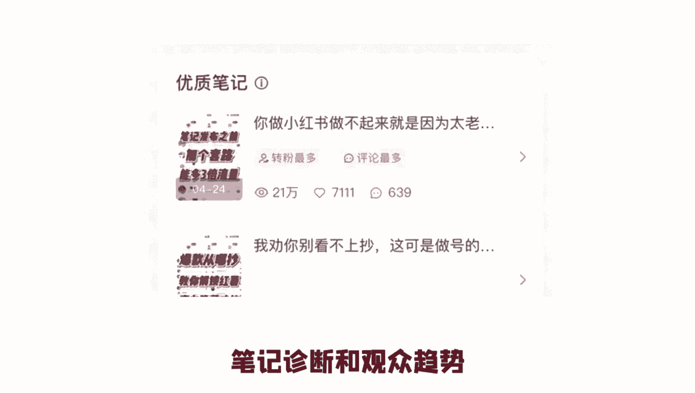
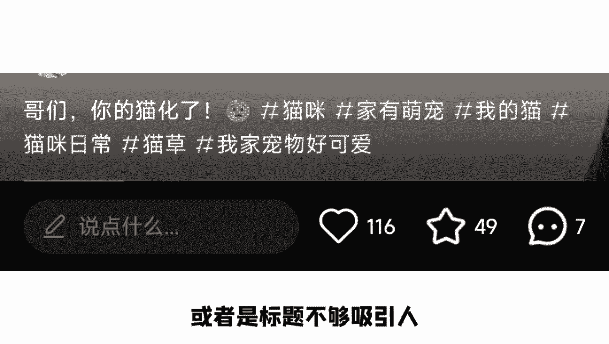

# 【2024小红书实战干货】小红书无货源电商实战全流程演示，天花板级别教程，当下起号可用！ - P3：小红书起号四大步骤 - 地瓜粉发发发 - BV1MAHpedEfM

所有人都告诉你，2024年一定要做小红书，但没人告诉你到底该怎么做，你天天发笔记，小眼睛就是不过一两百，而我只用了几个小技巧，条条都是大爆款，今天就给大家分享，我们团队做了200多个账号。

踩过无数的坑才总结出来的技巧，一共四个，只要照做就能轻松获取流量，我还把更多小红书快速起号的实战经验，整理成了一份指南，放在粉丝群了，直接去拿就可以，第一个技巧发布笔记的时候，不要直接点击加号上传。

在创作中心往下拉，可以看到笔记灵感里面都是有官方流量扶持的，选题方向，从这里呢找到符合你行业的选题发布，就会获得相应的流量助推，我有条笔记就是在这个路口发布的，现在已经是百万的播放了，第二个技巧。

关注小红书的官方账号，比如薯队长，薯条小助手，日常鼠等等，这些官方账号呢，不仅会定期处理各行业的爆款选题，还会不定时的发布站内活动，如果你的笔记在活动里面被官方选中，就会获得好几万的曝光奖励。

这个大家千万不要错过，第三个技巧，带上位置信息，这个技巧做同城流量的老板一定要用起来，不管是封面标题，话题还是发布地点，都带上你的城市或者是门面位置，这样你就能获得额外的同城流量曝光。

最后一个技巧是借助平台数据做复盘优化，这一点呢非常重要，点开笔记的数据分析，就可以看到笔记的基础数据，以及诊断和观众趋势。

比如显示点击率低，那就说明你的封面或者是标题不够吸引人。

没有推荐流量，可能是笔记里面有敏感词，违背社区收录，那根据这里的信息，你就知道该如何调整和优化自己的笔记了，如果你用的上面这四个技巧还没起好。

那就说明你压根就不会做内容，留下你的行业。