# 【2024小红书运营教程】强到无法呼吸！！！小红书起号养号黄金七法则，原来爆款账号这么简单！ - P10：08.小红书的正确养号方法 - 鼓腹含和防护服 - BV1wJt8eSE6o

。🎼大家好，我是阿强。今天来跟大家讲到一个非常重要的一节。我们小红书如何去正确的养号，对吧？大家一定要知道我上一节课讲了如何去选择我们正确的类目，先选择类目，养号其实也很重要的。你如果说号不养的话。

你后面想要去呃操作的话，其实比你不养号操作是呃养号是比不养号是要顺畅很多的，好吧，一定要养号，学会养号这个习惯，你后面去不断去铺号的话，你自己做的话速度也会更快一点，好吧？呃。

那接下来我们会以四个四个维度来跟大家讲。首先小红书为什么要养号，对吧？大家先想一下什么是养号，我把我这个号养成这个他们喜欢的一样的，对吧？养成我是正确会推给别人的样的。或者说我推推给推给我的。

也是这个标签的，为什么会说打标签呢，就打圈打造正确的标签。

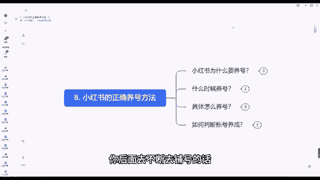

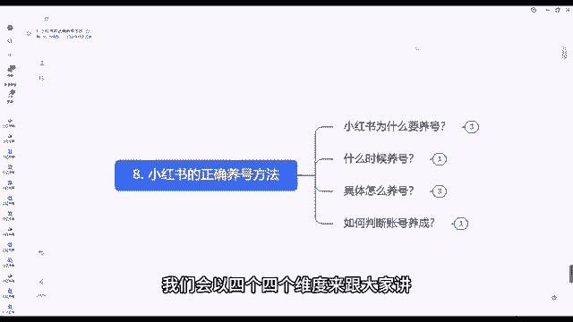

人家就会有更多我们这个同类型的人群点击刷到我们的号，要不然你看大量的假如说我这个条视频，我能有个1000播放量，但是有个900播放量都是跟我们这个无关紧要的，那你去转化。

那的难度跟你1000跟你500的播放量，能有400个人跟我这个标签是同样的。你说哪个转化效果好，肯定是500有400的这个效果好。所以说我们拿到一个手里面有个新号，一定要不要着急去发作品。

不要着急去营销，对吧？先学会养号新号，我们防止被判为营销号，前期不要着急，一上来就挂产品，一上来就卖货，对吧？一上来直接营销不养号，也不自己用，对吧？我只你就是这样，很多人就是加号一个视频。

或者说我写好一个笔记，我直接发上去挂产品呃，我自己平常也不刷，只有当时我发产品的时候发作品的时候，我打开一下，这种情况下，很很容易被平台判为营销号，然后后期就不给你流量了。发一个视频可能只有几个流量。

几十个流量。

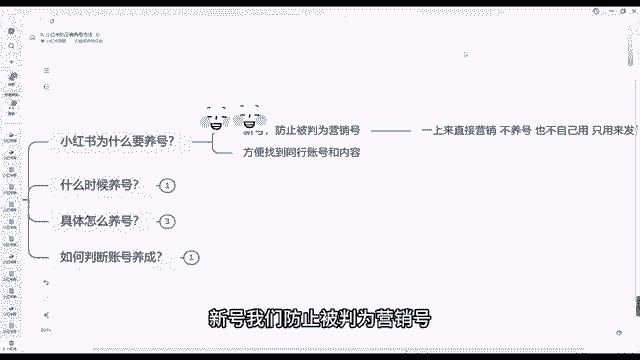

对吧看一个笔记，基本上没有播放，没有观看，对吧？很容易出现这种情况，不要着急。前期我们一步一步来。为什么很多人说我前期呃发了块很多天都没有赚到钱，对吧？没有出单，很正常，你太心急了。

那做所有事情并不是说心急就能成功的好吧，第二个方便我们找到同行的账号，对吧？我们新我们新号养号。第一个我们能防止呃平台判定我们营销。第二个，我们也能养号，也能找到同行，我们也能找到对标啊。

找到对标怎么做的，我们知道自己之后应该怎么做，好吧，那什么时候开始养号呢？我们要确定自己类目之后，确定完自己类目之后再去养号，不要着急养号养号，你不要上来，你类目还没确定，你怎么去养号啊。

你都不知道你卖什么的对吧？我确定我卖什么了。比如说我上一节课讲到的卖马面群的。

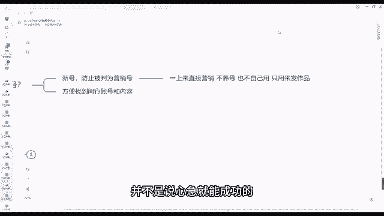

那我就确认我卖这个女装，卖这个马面裙了，那我就开始通过马面裙来养号了。呃，我们具体怎么去养号呢？首先第一步，我们先搜索其他同类目的账号，比如说是卖卖马面群的那我们去先找到这些卖卖马面群账号。

我们去搜索几家，多点击几家，再次打开小红书APP对吧？我们退出小红书APP我们第一步先搜索其他同类目的账号，我们搜索完之后，我们退出小红书APP对吧？放一段时间，我们再打开APP。

打开小红书APP刷新首页，刷新首页页面，不要凭个人喜好去刷小红书，带着自己的目的对吧？去刷潜在的对标账号，对吧？我们刷开刷那个首页，刷首页，如果说也有卖马面群的，我们点开对吧？如果符合对标账号的要求的。

我们点我们可以点赞评论关注，给他安排上一键三连给他安排上，每天循环的11到311到三步对吧？1到三步，然后大约3到5天，111天的话3到5次就行了。

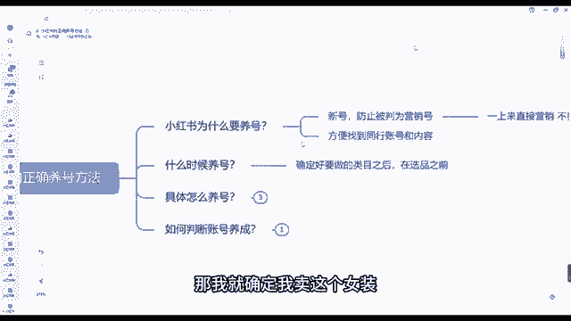

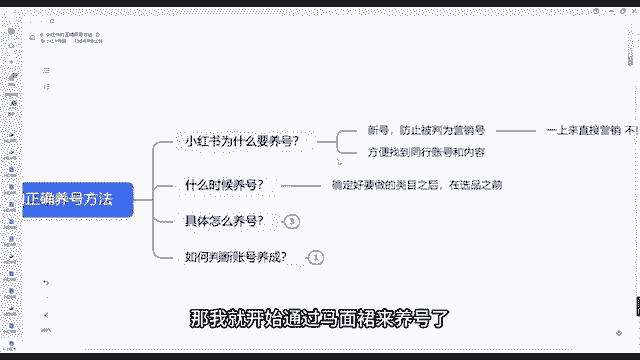

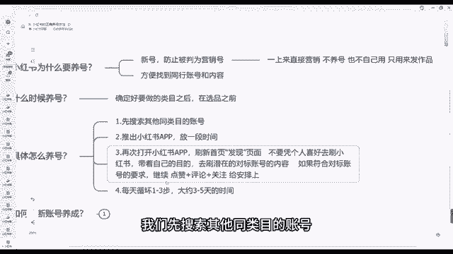

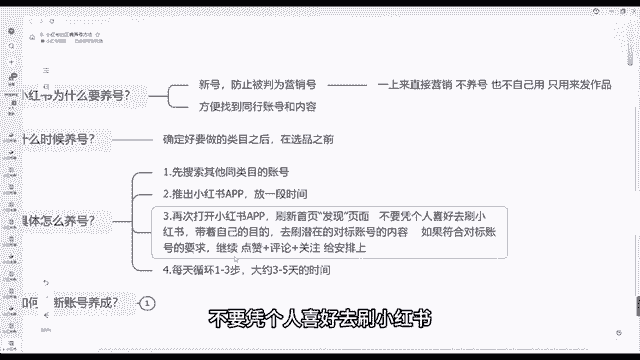

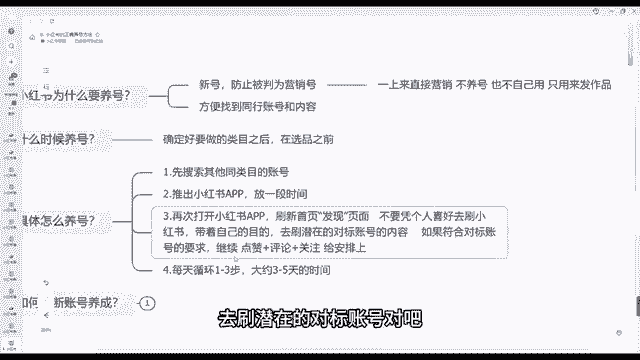

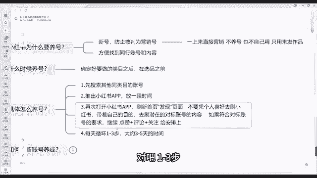

吧，大概是这个操作，具体怎么去养号的。那我们如何判断养号成功呢？具体怎么判断养号成功呢？首先判断账号养成的标准在50%以上，50%以上都是跟你这个刷到你，刷到了这个发现页里面。

这个发现页里面50%的都是跟你这个相同类目的相关的内容的推送的内容非常精准内容搜作人群也是也是你就是你想要的这个人群人群，我刷你这个账号你就想象出来别人刷这个账号能不能刷到你就相当于如果说你能刷到别人。

那别人也能刷到你就差不多。这种这就是养号，好吧，我们能把号养成之后，那我们这个账号后期再去做账号，那难度就比你不养号难度要好很多。好吧，那这个就是小红书如何去正确养号的方法，大家可以去学习一下。

操作一下就行了。一定要实操。好吧，那我们今天这个课程就到这边。

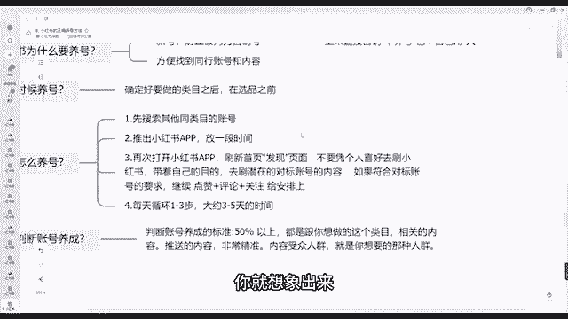

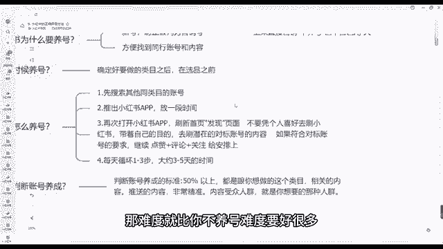

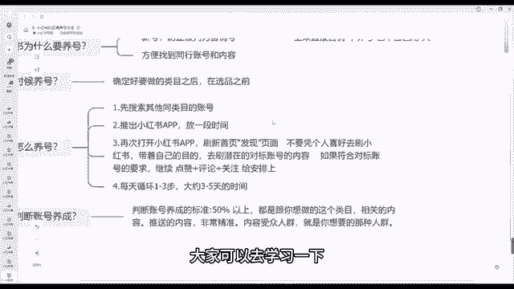

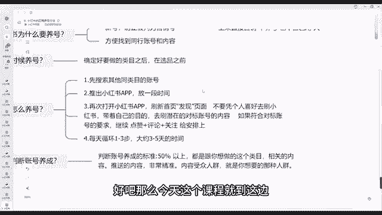