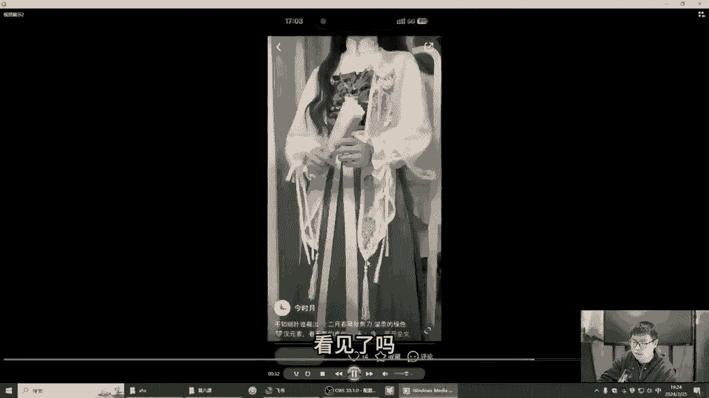
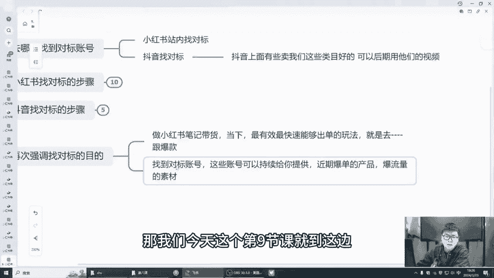

# 【2024小红书运营教程】强到无法呼吸！！！小红书起号养号黄金七法则，原来爆款账号这么简单！ - P11：09.小红书如何快速找到对标账号 - 鼓腹含和防护服 - BV1wJt8eSE6o

🎼大家好，我叫阿强。接下来这节课我跟大家来聊一聊小红书如何快速找到对标账号。呃，大家先要了解一下对标，我们为什么要找对标账号，对吧？找对标账号的一个目的是什么？我们讲呃去哪里找对标账号。

以及他的找对标账号的一个步骤，对吧？那我们接下来一步一步来跟大家讲好吧，首先你一定要明白一点是同行是我们最好的老师，我们为什么要去模仿他呢？因为因为你模仿他之后，别人之前的已经帮你踩好很多坑了。

已经帮你铺好很多路了。我们再去做的话，成功的几率也会更大一点。好吧，我们找对标的目的。首先第一个找对标的目的。首先第一个模仿对标账号，我们可以给账号进行一个包装包装，比如说头像昵称简介笔记风格这些对吧？

你可以了解一下别人是怎么做的。别人是怎样引流的，别人是这些头像是不是怎么去打造自己的，打造自己的人设的。对吧这是第一个。第二个，根据小红书上面对标账号，我们可以确定自己的账号的运营方向，对吧？

你可以看一下别人的运营方向是什么，我们来确定自己的运营方向，对吧？我们可以进行其中一些学习参考，针对什么样的人群做什么样的类型的产品，这些我们都是可以自己做到的。对吧因为你要知道。

其实呃因为很多他们的面对的人群是什么？我们如果说跟他同样的人群，对吧？那我们也是可以运用他的一些技技巧，一些方法的对吧？第三个，找到素材的来源，对吧？对标抖音，比如说抖音的对标账号，对吧？

前期我们就不用去拍素材，对吧？因为别人。别人的素材，抖音对标抖音对标他的很多素材我们可以拿到小红书里面去做的。只要人家没在小红书里面发过，我们可以做一些混剪，做一些剪辑，对吧？

前期你自己去拍摄难度肯定是大的。时间成本，人力成本，拍摄成本很高很高，对吧？所以说我们找到合适的账号之后，作为你素材的源头，你找到100个1000个抖音的同行，我们把它所有视频。

每个视频剪下来个一秒2秒，对吧？我拼接在一起，那我就问一下，是是你是你找数找对标的速度快，还是你拍摄的速度快，还是人家又要拍摄又要剪辑。但是我只要找到对标之后，我把它保存下来，我做一个适当的混剪。

拍出去还有流量，对吧？你有可能拍拍出去之后，拍了大量的视频还没有流量，有没有这种可能性，对吧？首先总之我们要先去模仿，模仿到对方有几成功率，我们就能拿到几的效果。我们模仿了对方五成功率。

那我们做成这个呃概率就最起码在50%以上，所以说别人这个同行。一定是我们最好的老师，我们一定要学会学习他们，学习他们的一些好的方面。他笔记是怎么发呢？他笔记发布技巧，他怎么去引流的？

他怎么去引导别人购买的对吧？他笔记他的主图封面是怎样吸引别人的，他的视频的前三秒钟是怎样把人家拉到停留里面的，对吧？以及这些都是我们需要找找对标的目的，那我们讲一讲具体怎么去找呢？去哪里找呢？

首先两个方面是目前来说找对标比较多的。第一个小红书站内是可以找对标，我们可以搜索对吧？搜索同行对吧？我接下来会跟大家具体来讲一讲小红书怎么去找找对标的步骤，小红书站内的对标，抖音找对标，对吧？

抖音小红书站内内那对标，就比如说他们的发拍的一些视频，他们的账号以及他们的一些笔记怎么写的，抖音就更多了，抖音就是视频，视频端对吧？抖音上面呃有些卖我们这些类目好的，后期我们完全是可以拉他们视频用的。

对不对？我们只要在不违规的情况下用这些都是好的呀，这个是两个方。一个是小红书，一个是抖音，我们可以找对标，对吧？小红书找到对标的步骤。我接下来具体来跟大家讲讲。好的，小红书呃。

目前找对标的方法就是第一个我们去小红书打开它的搜索页，对吧？搜索页搜索这个类目。比如说呃我前面讲的最多的马面群这个案例，我们也可以按照搜索马面群，对吧？在搜索结果中找到低于粉丝在1万以下的。

因为小红书整体的粉丝基础肯定是没有抖音搭的，他一万粉丝以下的基基本上处在一个快速上涨的一个阶段，最好你能找到的是也是人家通过混点搬运的账号，对吧？你就知道人家是怎么做的。

那我们按照他的模式一比一的复制下来，我们也能做起来，好吧，视频清晰度，一般他们是一些混点账号有几个特点。第一个视频清晰度一般视频不是很清晰。因为他们保存过来，它通过二次的路径没法保存这种原图的视频。

第二个全程不露脸，用为一个表情包把脸这很多这种案例。都是因为他放了之后可能会影响到人家的版权，或者人家发过了，对吧？你这个平台一查到不就违规了嘛，持续发布各种不同类型的对吧？

带货笔记时不时有个大爆款上千站的，或者产品价格，小位数，呃，后面两带两位的呃，比如说小位数带两位产品价格99。99块的这种无规律的这种等等等等。这些都是它的一个搬运的一些账号的一些特点，好吧？

大家可以了解一下。第三个，点赞，我们找到这些账号之后，我们怎么办的点赞收藏、关注对标账号的一些爆款的笔记，那我们下次可能刷到更多的像这种同类型的。因为他这个也是大数据平台，对吧？

他会把更多相似的账号给它分享给我们是吧？那接下来我来分享一两个视频给大家看一下第9个。

好的，我们来看一下这个视频，我们打开我们小红书的呃搜索栏，对吧？我们搜索麻面群，我们搜索麻面群，你看这边有很多跳出来的麻面裙的视频，几百几千赞的几百赞的都有。对吧这是第一步。

我们先搜索搜索我们看到有很多很多相同的视频的呃人账号，对吧？像很多种的，人家有露脸的，有不露脸的，我们尽量去找一些不露脸的视频，对吧？啊，多多类型的，像这个它就属于个人拍的个人拍的这种是账号。

我们如果说他这个效果好的，几千站的，我们也可以拿出来当一个全屏啊，我们去1688里面搜一下，像这个它是属于摄影的摄影呢，我们就没必要作为一个对标账号的，然后以及像一些个人的账号，店铺的账号。

我们可以拿为作为对标账号，你像这个他也是摄影工作室的，我们也没必要去拿它当一个对标账号。像这个它是作为一个卖汉服的，我们也可以看一下点赞评论都挺高的。我们去看一下他的点赞评论，吸引的哪一部分人群。

跟我们是否相似的。我们相似他就是属于一个爆款，那我们是否可以用他的这个去搜索一下这个产品的，278。你看他是店铺的产品，他自己卖的，对吧？这有可能是他自己。店铺的产品也有可能是他在网上网上到的对吧？

🎼有很多很多账号，你像这个账号他不露脸的有两种情况，他粉丝比较多，基本上这个应该属于他自己拍的。他个人账号也有很多他这个所有账号都是从抖音里面搬过来的。很多很多接下来继续看啊，都是有大几千点赞的。

说明这个整个麻面群这它就是一个爆款，像很多的不露脸了，对吧？不露脸的这些视频账号，对吧？它这个也是一个原创品牌的，对吧？可以看一下它对表账号，我们就可以搜一下宣品吧，爆品吧，好吧。

很多很多都是大几千点赞的，像这些对吧？看一下人家的图片怎么拍的，对吧？像这种我们就可以作为一个简单的对表账号这些。你像这种呃6万粉丝啊，他的小清单里面写了哪些哪些产品呢，就是最有可能就是他自己个人拍的。

这种这种形式，这种模仿我们也是可以作为模仿的对吧？很多像这种不露脸的，有这种露脸的，有很能也有很多不露脸的，或者说像用个特效把脸遮住的，像这种用个特效把脸遮住的这种，有可能这个视频就不是他自己。

🎼对吧在其他平台呢，你看到了吗？他把人家视频拿过来，但是避免违规，那避免或者人家已经翻过来，那他还得弄个特效，把这个脸给挡住，对吧？像这种视频也是人物不露脸的对吧？介绍的。

人物不露脸的这种或者说有这种混剪痕迹的，很很有可能就是整条视频，他来说他就不是不是他自己拍的，也是混剪过来的，我们就可以参考它，好吧，我们再来看第二个视频，你像这个就我们找到了一个对标账号。

他也是开店铺的对吧？他的店铺产品价格也在呃大几十到上0左右，你可以看到他很多作品人物脸脸像很多你不怎么露脸的对吧？很多很多很多，而且他的人物都是不一样的，对吧？

说明他这些视频很多都是混剪出来的这种说法就很像混剪出来的，很多你看他每个人物都不一样，看见了吗？

🎼么就是这些，所以说这就是我们小红书可以多找几个对标账号，然后去点赞关注，它跳出来也会越来越多，对吧？循环的我们找个10到20个对标账号肯定能找到的对吧？一定要坚持去找，然后小红书如何。

然们再看一下抖音如何去找到对标。首先其实也是一样的。我们去抖音搜索内幕栏，对吧？去搜索我们的内幕对吧？切切到视频一栏，对吧？筛选不不超过半个月的视频，点赞量还可以的，对吧？

高的视频不超过30万粉丝的低粉高赞的对吧？循环找一个10到20个，就像刚刚。小红书一样的这个步骤，建议拿一个单独的抖音号也来最好拿一个新号，对吧？我们也可以拿一个新号去操作啊，抖音会持续推类似的账号。

方便后续我们长期找到素材，对吧？其实它跟小红书一样，它也会打标签，打更种标签。对吧以及呃这个是找抖音的部队，不找抖音找对标的步骤。在最后我再强调一下找对标的目的啊吧，然后做小红书笔记带货。

当下其实最有效最快速最最能够出单的方法就是去跟爆款，对吧？找到对标了，对标有爆款，那我们去跟对跟上人家的爆款对吧？找到对标账号，这些账号可以持续给到你提供近期爆单的产品以及素材对吧？报流论的素材对吧？

这个就是同行是我们最好的老师，好吧，大家一定要花时间去找对标，对吧？按照这个步骤，一步一步去找对标。你在抖音里面小红书里面可以模仿他们的笔记，抖音里面可以可以参考他们的素材，对吧？

选品可以用他们的品都可以好吧，那我们今天这个第九节课就到这边。

