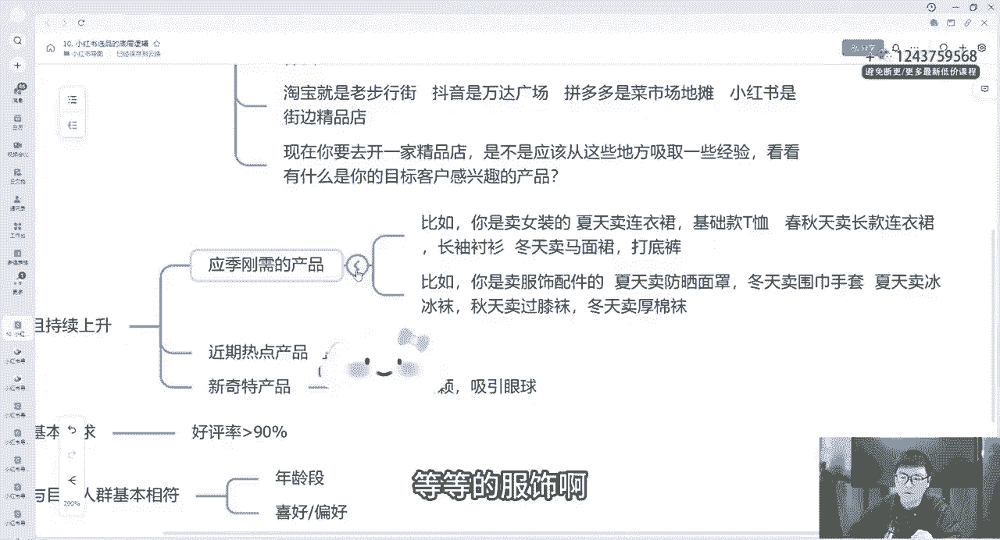

# 【2024小红书运营教程】强到无法呼吸！！！小红书起号养号黄金七法则，原来爆款账号这么简单！ - P12：10. 小红书选品的底层逻辑 - 鼓腹含和防护服 - BV1wJt8eSE6o

大家好，我们今天继续来学习我们小红书的课程中的第十节课，也是接下来几节课的一个铺垫。我们怎么去小红书选品，对吧？我们不管选品之前，我们一定要了解小红书选品的一个底层逻辑。它的一个重要性。

我们所有刚前期也跟大家讲了，选品方向不对，努力白费，你的内目不对，那你那你选品选品肯定不会太好的。你选品不太好，你的笔记啊，你的呃整个整体的视频来说展现的也不会说有太好的效果的。好吧。

所以说我们得一步一步来，我们先确定自己的呃先确定。确定自己的类目，确定完之后，找到自己适合的同行。找到同行之后，我们再去选择同行的爆品。我们自己再找到一些通过其他平台、淘宝啊、天猫啊、抖音啊、小红书啊。

拼多多等等，这些寻找这些同行的一些爆品，对吧？了解它的一些重要性底层逻辑。那我们接下来就正式开始我们今天的课程。这要了解抖音的，我们先接下来要了解小红书选品的一个重要性和底层逻辑，具体来跟大家讲一讲。

首先大家要了解一下呃电商选品的重要性有多重要。我们做所有的电商，做过我直播间做过电商的人都知道，没有没做电商，你今天跟我们一起学习了，你接下来也会知道所有电商的平台里面，不管说你是抖音淘宝。

还是目前我们做的小红书七分靠选品，三分靠运营，对吧？你运营可能再牛逼再牛逼。只要你个品不行，那你所有都是白费，选品是店铺的基础，选品是你整个。

整个团队的基础，选品不对，整体努力都是白费的，再厉害的销售也不可能把一坨屎给他卖给客户的。可以，但我说的这个是只是一个画画一个引号的，但是这个是说明毫无亮点的产品，我们有任何卖点。

任何没有任何亮点的产品，你是没法去在平台里面销售的所以我们一定要选好爆品，对吧？不去卖给客户才能够后面操作才能更更简单一点，可能说你后面的笔记啊，视频啊，剪的一塌糊涂。但是你这个品是一个好品。

那我跟你讲你这条视频爆的可能性肯定也比你这条你这个品是是垃圾的品。但是你的视频讲的好效果也好，我敢这么跟你保证好吧，这个是电商选品的一个重要性。那我刚刚讲那么多，那我们如何去培养选品的感觉呢。

首先确定好类目之后，我们要把大量的时间，大量的精力画在选品上面，你前期选品要画大量的时间，大量的精力，我们才能后面才能不走弯路嘛，我们要多看多对比好卖的。

产品是看了众多的产品之后，结合实际的情况选出来的，既不是瞎猫踩狗屎运卖出来的，也不是自己设计出来的。你不是工厂，我们大部分人都不是工厂，我们都是做一件代发的，你只负责进货。

那我们进货的前提一定要把品选好，拿货去卖我们一定要选好品，我讲这么多目的就是跟大家讲，不要去着急，我们慢慢去选品，选品对了，后面其他都好做，好吧，就是一个耐子耐入性质去选品，然后跨平台选品的逻辑是什么？

我因为我们要得得去好多平台去选品。比如说淘宝啊、抖抖音啊、天猫啊、京东呃拼多多等等。你要知道这些平台，他们的品都属于一个什么的等级，我来打个比方啊。比如说今天。

你开的不是小红书的网店，而是开的是一家线下的女装店。那那么你需要去进货，进货的时候呃，你是否会拿稳拿货的老板娘，说最近有什么款式好卖的呀。最近有什么爆款的。

老板娘肯定说最近我们家别家女装店最近从我家拿的ABC3个款比较多啊这时候你就知道了ABC是爆款，其他的款你就不拿了，我们就不浪费钱了。我们知道别的家卖的比较多。

那我们去拿拿到我们面对人群是跟人家人群是一样的，都是同一家拿的货，而且都是卖女装的，那我们就知道这个是爆款了，对不对？不是你觉得卖什么什么好卖，你就去卖什么，而是别人都买什么，市面上大部分人都买什么。

那这个就是爆款，别人都卖什么，这个也是爆款好吧，你才去卖什么，相对于来说淘宝其实就跟那个老的步行街一样，你们自己去刷算刷不到，自己经不经常在一些步行街，抖音就相当于万达广场。

稍微高档高大上一点，价格也稍微贵一点。而拼多多就跟菜市场一样，里面价格都是很便宜，对吧？但是呃好货其实也是比较少的对吧？小红书就更像街边的一些精品店，价格比较贵，但是东西还是比较好的。

相对于抖音跟拼多多跟淘宝一样，大大家能理解了吧。所以我们在小红书里面选的话，尽量要去选一个一些精品比较好卖一点。因为整体来说，小红书的人群啊，它整体的消费水平还是可以的，好吧，现在你要去开一家精精品店。

对吧？是不是应该从这些地方去吸取一些经验，看看你有什么是你的目标客户群体感兴趣的，你的目标人群是哪些，你去感兴趣，就选哪些就行了，好吧，这是一个底层逻辑，那我们看一下选品的基基本逻辑，基本逻辑。

我们从三个部分来跟大家讲。首先第一个产品要有热度，要持续上升热度。比如说应应季刚需的产品来给大家举个例子看一下应急刚需的产品有哪些，对吧？比如说你是卖女装的对吧？夏天卖连衣裙基础款。

T恤，春秋天春秋天卖长款的连衣裙，长袖的短袖，冬天卖马面裙、打底衫打底裤这些对吧？应季刚需的，大家一定要去学会运用。冬天我为什么说了呃过年期间卖对卖对联，卖红包卖的好的。因为它是呃应季刚需啊。

比如说你是冬天呃你是卖羽绒服的对吧？肯定是卖的好的呀，你是卖这种服饰配件的，你夏天卖防晒面具对吧？冬天卖围巾围巾手套对吧？夏天卖冰冰袜，冬天卖过膝袜，其实这都是差不多类目的。

而且你都是能在自己人群来说其实都差不多的，有没有发现其实你同样的根据不同的季节，你可以卖很多东西，关于服饰的等等的服饰啊搭配这些，比如说近期的热卖产品也有很多，比如说你是卖女装的。

最近网络上有哪个明星穿的那款衣服啊，小众的衣服，但很好看，价格也很便宜，我们就可以在我们店铺里面做，比如说某某某某明星同款对吧？比如说前段时间比较爆火的。

比如说我举例子，像繁花，大家应该有看过繁花里面的唐嫣同款，对吧？抖音抖音小红书里面卖的很火很火，对吧？你旧可以去卖，对吧？要慢慢培养自己的网感，对吧？什么东西，火什么话题火。

那代表的这个产品这个话题有流量。那我们去卖这个产品就99。9%能卖得动，如何如何这个产品呃爆点跟我们的跟我们这个产品有关，你就去趁这个热度，对吧？新奇乐的产品造型新颖的吸引眼球的这些都都是可以去卖的。

好吧，就是产品有热度，我们要有热度蹭热度，第二个产品好评率基本上要符合90%的要求，对吧？你可以发现为什么拼多多有很多人在不在拼多多选品。因为它里面好评率基本上有很多啊，我不是说分之百啊。

但是有很多它好评率不达到90%，达不到90%退货率第一个你容易上升。第二个你店铺的评分容易降低。第三个呢，你本身这个品可能质量。

不好，你不好的前提下，你就不容易成为一个爆款。好吧，这是好评率，一定要达要求。第三个，产品受众人群与你的目标人群要基本符合，对吧？我年龄段啊、喜好啊，偏好这些都跟你要差不多，最起码差不多吧。

不能相差太大，这是我们选品的一个逻辑。你不能说你是卖女装的，你去找到人家男装的店铺里面去选品，你选一些男装，那肯定不行。我是卖这种上班主，你去卖一些夜店风的，两个相差太大了。好吧。

这个就是选品的一个基基本逻辑，接下来我们的课程呢会具体来跟大家讲一讲，如何去通过抖音选品，如果通过拼多多选品，如何通过淘宝，如果通过小红书站的选品。好吧，大家来继续来听我们的课程。

那我们今天这堂第十节课就到这边。

