# 【2024小红书运营教程】强到无法呼吸！！！小红书起号养号黄金七法则，原来爆款账号这么简单！ - P1：小红书起号直接2.0 - 鼓腹含和防护服 - BV1wJt8eSE6o

要说最近什么项目最火，那必须要提到小红书电商。最近几个月呢几乎整个互联网都在讨论小红书电商。我关注的几个商业博主啊，包括一些付费社群都在讨论他。我朋友圈月入5位数甚至6位数的比比皆是。

这个项目在年初的时候，我其实就有让团队跟进测试，我还在市面上买了一些课程学习，到现在单人单店一个月能做个一两万块吧。今天我就用一个视频详细的给大家拆解一下，就是小红书电商到底怎么玩。

我会把整个小红书电商的流程，包括一些注意点，比如怎么开店，怎么选品，怎么做流量，一次性给大家讲清楚，你甚至都不用再去看别的相关视频和培训啊，你就跟着我的视频去按住做骥，就足够你在这个事情上开始盈利了。

视频的结尾呢，我还会给大家准备一份资料，里面有我找的课程啊，对你运营小红书电商呢会有很大的帮助。有需要呢直接去拿就可以了。言归正传啊，整个项目的逻辑啊，其实也非常简单，它就三件事儿，第一个呢开店。

第二个选品，第三个流量，我们一个一个来讲，先说开店。

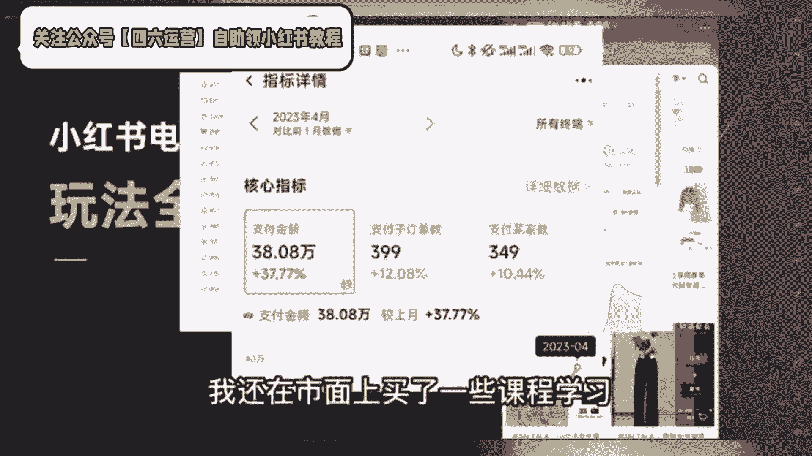

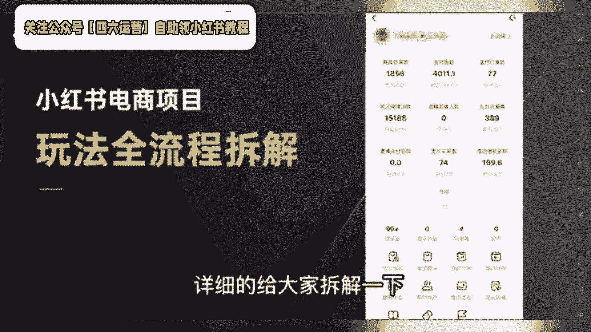

呃，开店其实没什么好说的。那，首先就是打开小红书，然后点击左上角的菜单图标，再选择创作中心，然后点击更多服务这个选项，选择店铺，点击立即入住就可以了。你就按他官方要求的提交资料入住就行了。

我居然看到有人把小红书开店包装成一个项目拿出来卖。居然还有不少人买，这也是很奇特。这里跟大家说一下，小红书店铺的两种形式，个人店和企业店，其中个人店有两种分别是个人店和个体工商户店。

个人店只需要身份证加1000保证金就可以开通了。个体工商户呢还要多一个营业执照，企业店呢就多一点，企业店有三种呃，有包括那个普通的企业店，有专卖店和旗舰店，企业店都需要营业执照。

而且还要缴纳600个年费。我们刚开始运营小红书电商的时候，你直接选择个人店就可以了。我们实测下呀，企业店和个人店一样，平台并没有对企业店有什么流量倾斜。唯一的区别是个人店，你只能开一家。

而一份营业执照呢，你可以开三个店。你一个店如果都没做好，你开再多的店都是没有用的。而且小红书电商啊，我觉得是。

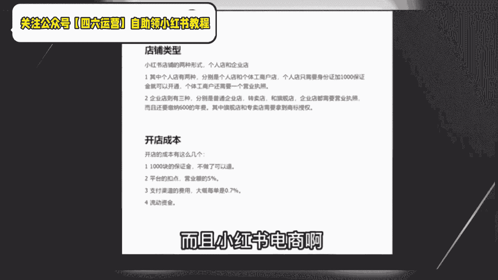

适合店群形式去做的。这是因为小红书的流量机制，它的电商自然流占比非常低。那你铺再多的店再多的货有什么用呢？所以只要你看到有博主跟你讲什么小红书店群，我都觉得是在扯淡。小红书是要做矩阵的啊。

但不是店铺矩阵，而是账号矩阵。这个后面在流量获取那里，我会跟大家细说，开店的成本呢有这么几个。第一个就是1000块钱的保证金啊，不做了可以退。第二个呢是平台的扣点营业额的5。第三个呢是支付渠道的费用。

大概呢每单是0。7，第四个就是自己的流动资金啊，一开始大家做呢可以有无货源的方式去做？对资金要求也不高。你刚开始呢准备个2000块3000块完全够了。呃，开完店以后呢，我们下一步就是选品。

我们应该在小红书上卖什么的？选品其实也简单在其他平台上的爆款大概率在小红书上也能报。目前小红书呢我是推荐三个渠道进行选品的。第一个是通过某东某宝上面找那种小红书平台调性的爆款产品。呃。

身边有做电商的朋友，他自己在某宝的店铺卖爆款，搬到小红书上。第一篇笔记就开。第二篇笔记单量就已经破百了。第二个呢是通过某音的那个精选联盟。你在某音的精选联盟排行榜，你可以看到现阶段哪些品卖的好。

只要符合小红书用户调性的产品，直接搬运测试就可以了。第三个就是某多多的这个销量排行榜，选择适合小红书的类目排行榜，从中选择相应的爆品搬运到小红书整个选品的逻辑，就是我们要利用市场来帮助我们选品。

而不是自己在那瞎抢，我们要借助大卖家的选品能力来弥补自己选品上的不足。所以我们只要判断一个东西啊，就是这些排行榜上的爆品是否跟小红书的人群有匹配的可能，如果有我就搬过来测一下，对吧？

相当于是借助了别人的能力来帮我们自己选品，这样反而是最快，而且是最稳妥的选品方式，肯定比你瞎测成功率要高很多。然后等你这个产品上架以后呢，就到了最重要的环节了，我们应该如何获取流量。

小红书它是个种草平台。你店铺九成以上的流量啊，都是来自你发发的笔记。这就是为什么我之选说小红书不要铺出店群，而要做账号矩阵，尽可能多的发笔记耗流量，它的通路就是。

用户通过你的笔记然后对你推的产品产生兴趣，然后到达你的店铺完成购买，你堆一堆店铺，对吧？你铺一堆店铺一还不如多发笔记，多发几篇笔记的这个效果好。所以怎么在小红书上发笔记，对吧？

就是你小红书电商是否成功的关键。小红书这个平台，你直接发硬广，我觉得效果非常差，对吧？本来小红书的这个用户群体认知就比较高。你直接发广告没有办法获得信任的啊，更不要提转化了。你发笔记的时候。

一定要用一个素人的角度，你知道吧？就是用户的角度去切入，站在用户的角度去做种草内容，而不是官方视角，这才是真正有效的。呃，这种种草笔记怎么做，其实也很简单，就是去各大平台的商品评论里找。

比如某音某宝某东的商品买家秀找到好看的素材，你直接copy下来用嘛，对吧？文案呢在买家评价上去做修改。这些买家的评价呢就是商品用户的使用体验，天然的适合用来做这个中考笔记，而且可以说是取之不尽了啊。

然后呃当你单个账号的SOP跑通了是吧？我们就可以开始举阵引流了啊，通过批量上小红书账号批量发布笔记。给我们的店铺来引流来放大。那基本上整个小红书的电商的运营啊。

就是我上面分享的这些外面不管多少钱的培训啊，000块也好，000块、1万块也好，其实就是这些东西。有些培训可能还没有讲的清楚啊。根据上面几个点，我给大家准备了一份资料。

里面包括了小红书账号的起号运营的方法，以及一份小红书电商的视频课程。你如果打算经营小红书电商，你也不用看别的东西，就跟着这份资料走，足够你开始盈利了。有需要的啊，点赞加关注，在评论区回复红书电商。

我分享给你。😊。

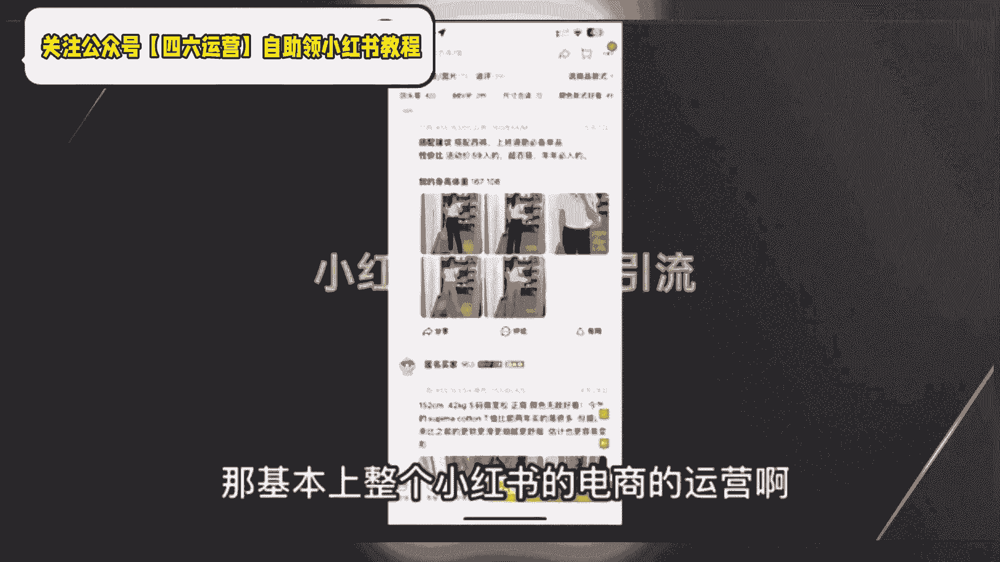

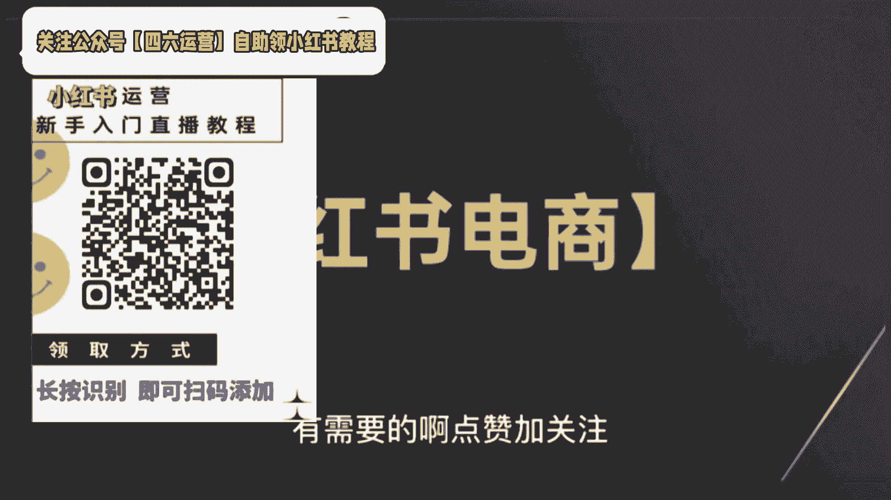

🎼要有自信啊，你是最好的，知道吗？做新手从零开始做小红书后，30天之后月入5000块钱，有可能吗？在小红书认真发布帖子的博主里面，月收入超过1000块钱了，占到了57%。

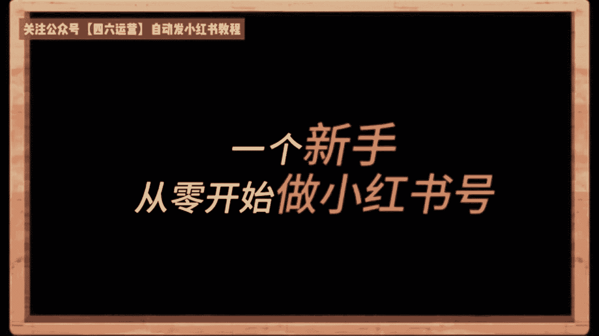

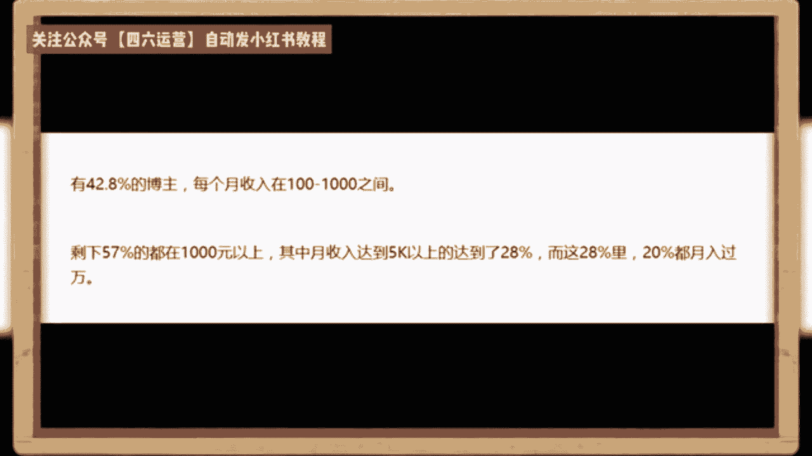

🎼别说是超过5000块钱了，占到了28%。也就是说，只要你开始做了小红书，只有28%的概率，纯靠小红书就能养活你自己。设置是先驱，我会在接下来的几分钟，里让你获得这28%的入场权。

🎼首先我们要知道小红书是一个什么样的平台，它的本质是一个社交分享型平台。我们要注意里面的社交和分享。🎼所以要为他人提供有价值的内容，是做起了一个小红书号的核心。所以有四类人是不适合做小红书的。🎼第一。

不喜欢创作和表达，没有持续输出内容能力的人。第二，不善于检索阅读和总结信息的人。第三，心理脆弱容易放弃的人。第四，没有执行力的人。🎼这4条只要你占了一条，后面内容你都不用再听了，直接评论区找到我。

先提高你的基础能力再说吧。🎼如果你一条都不占，那么恭喜你基础能力是没有问题的。接下来我们会手把手教大家解决三个问题。第一，如何从零开始起一个号。第二，如何保证持续有高质量内容的输出。第三。

如何确保内容能够变成收益。这三个问题，我会分别分为起号片和变现篇，两期讲励大家。本期是起号片，起号第一件事情不是起名，不是搞图像搞简介，而确定自己到底要卖什么赚钱，他决定了整个号的方向。

我们做小红书不是为了做慈善做分享，我们做小红书的唯一目的就是赚钱，有些人辛辛苦苦运营了半天，有了几千几万粉丝了，然后发现自己的方向赚不来钱。

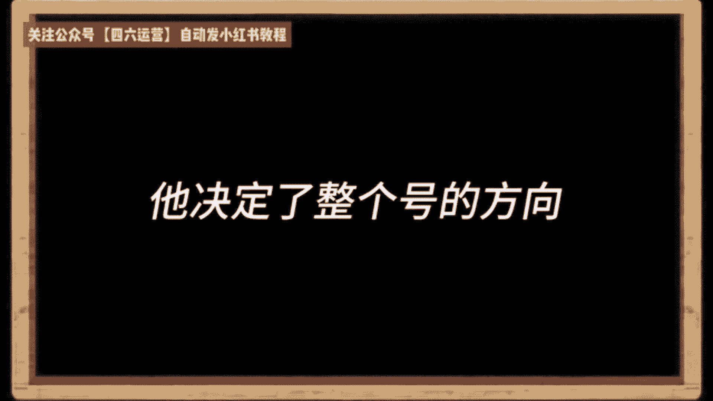

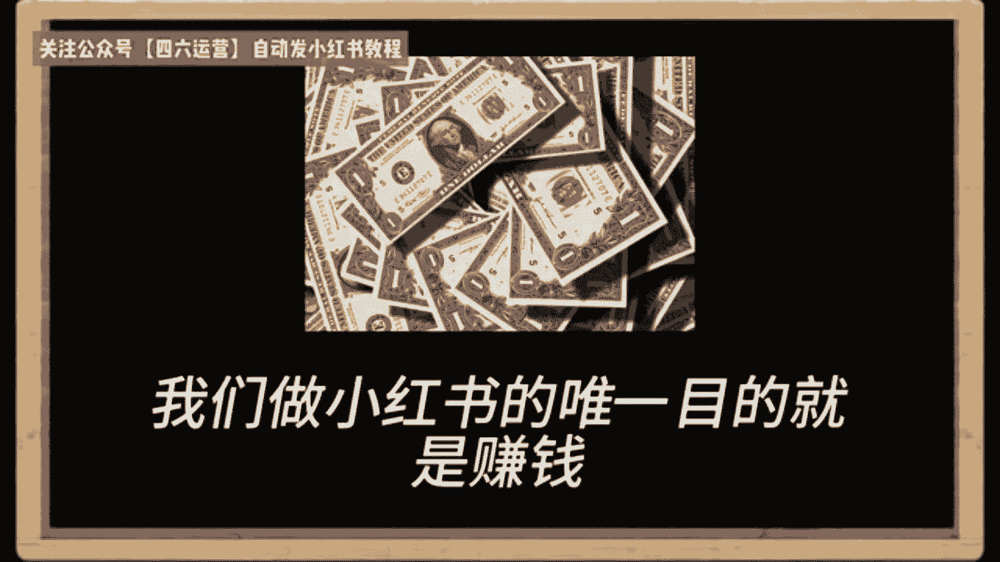

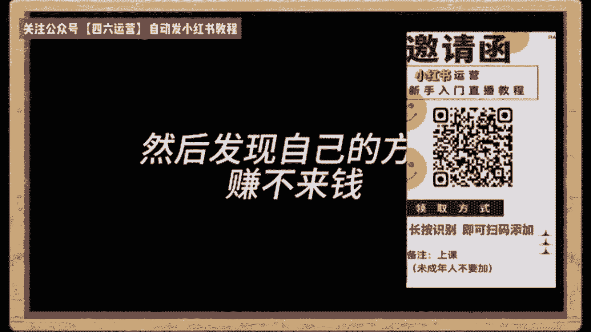

🎼比如有些人喜欢做每日好好剧分享，每日读书打卡的号热度也很高，但没有什么商业价值。这种核心的问题就在于，一开始就没有想清楚自己这个号到底要卖什么东西。

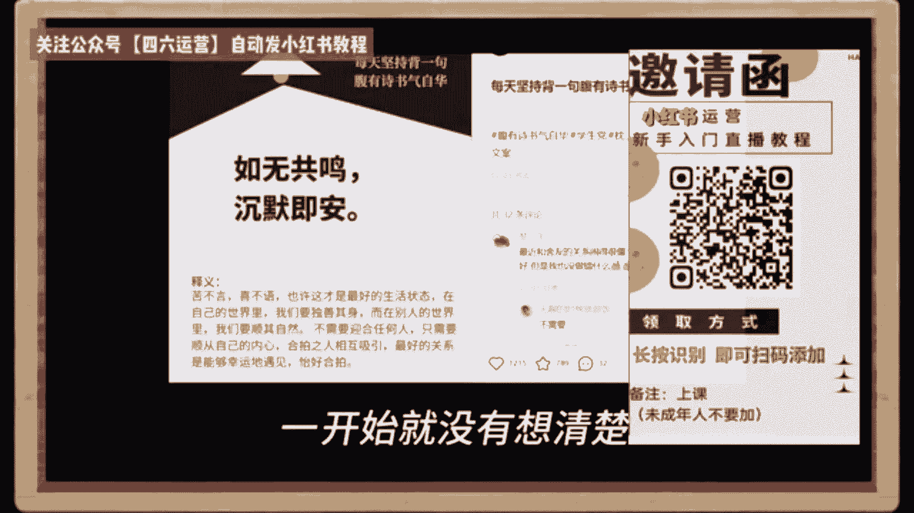

🎼所以第一步你要确定的是自己到底要卖什么产品，然后在这个方向上确定号怎么做。你要卖衣服，你就做穿搭号，你要卖付费课程，你就做培训号，你要卖吃的，那就做美食号。你自己擅长不擅长某个领域。

并不是你选择方向的依据。🎼选择方向的依据是你要在这个方向上，第一能够持去创作内容。第二，有产品可以交辅，那就可以去做。至于擅长不擅长，不擅长，你可以学呀。

所有人刚起好的时候都不可能比这个领域大杯更加擅长，能力都是做着做着就起来了。就算你刚开始不懂穿达，你做上200个传达的帖子出来，你还不能不会吗？如果实在不知道该做什么，这里可以给你一个参考。

小红书里面最赚钱的领域是家居、护肤，其次的情感，健身、健康、母婴和美食。其他领域的收入普遍都没有这些高。所以你在这里面随便挑一个，你可以做就可以了。确定方向之后是一些基础的工作。

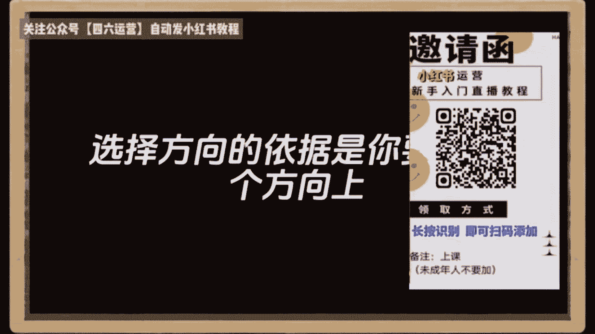

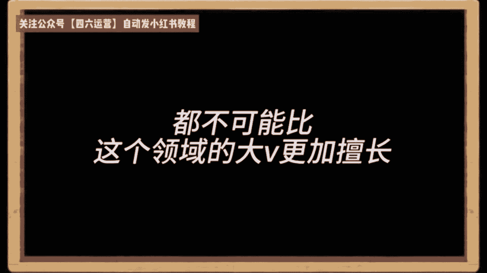

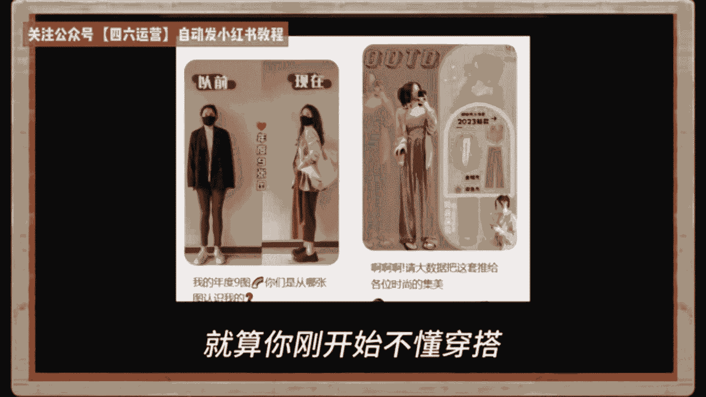

🎼第一个是起名，给你一个万能模板，要做的事情加标签，加个人昵称。🎼要做的事情和标签之间要有一定的反差感，比如卖猪肉的转行医师生鱼玉。🎼卖烧烤的下岗基金经理曾格，抑郁的心理医生刘溜，不会穿搭的女装店主。

不会做饭的美食博主，不会骑自行车的旅行旅行男人，不会穿越的烧烤摊主。这种反差太好找了。如果不会搞的话，来评论区找我，我给你起都可以。第二，头像随便弄也经常换就行，没有什么讲究。第三。

把默认小红书改成自己的微信号，这样以后面有人私信你，你就可以直接告诉他，加我小红书号就可以了。这样可以合规引流。第四，简介还是玩能模板。

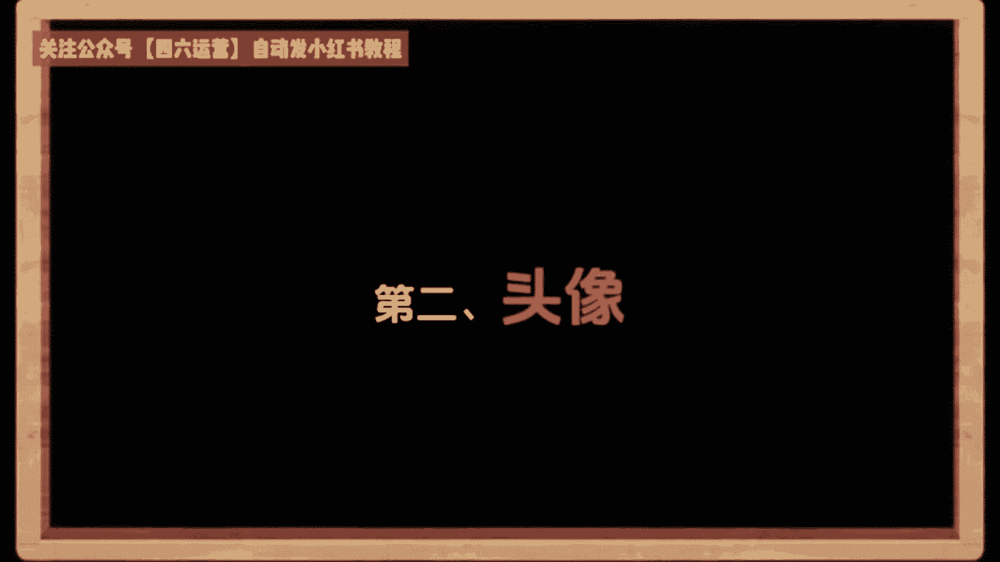

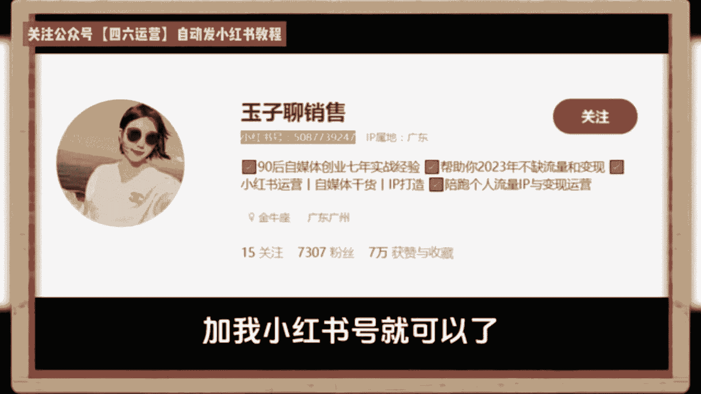

🎼身份我是谁，加我在做什么，加这个号会发什么？

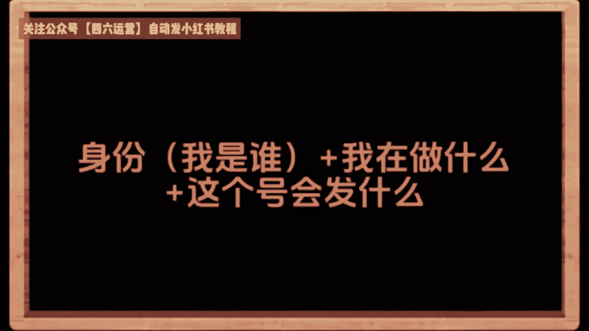

🎼比如说这个人身份是90后自媒体创业者，做什么帮人搞流量，搞变现号里面会发什么会发小红数运营自媒体干货IP打造。第54下平台规则。第一，禁止炫富，不要带给人焦虑。制造焦虑可以短期有流量。但长期来讲。

既会被平台打压，又不利于人手所塑造。第二，禁止直接引流。帖子中间不能出现任何微信号公众号等信息更不能出现二维码。合规的引流方式以后，我们会讲，也可以直接看评论区置顶就行。但是在你彻底了解之前。

千万不要直接引流直接引流对你的负面影响，一定会打鱼你所得的收益。第三，不要出现不文明言论，不良言论。

🎼第四，不要过度擦边。第五，不要抄袭大杯的内容，可以借鉴选题，但不能抄袭内容。第六，可以发泄负能量，但不要宣传负能量。比如你可以说自己心情不好，但不要宣传人就应该抑郁，不抑郁，不是正常人这样的观点。

到这里，所有基础工作就做完了。接下来是最重点的部分，如何做出好内容，如何把账号给做起来，做出好内容，做起来账号，总共有5个方面。🎼第一，找到一个稳定的创作模式，进而找到一个稳定的素材来源。比如这个博主。

他的创作模式就是每次做一道新菜分享给大家。植物的做法显然是无穷无尽的。所以他这个模式可以保证长期持续稳定的更新。再比如这个人，你可以看到他的内容就是不同类型的衣服穿搭。

衣服的类型、款式穿搭的方式是年年都不同，无穷无尽的，所以他也可以保证自己源源不断的有输出的内容。每一个领域都有类似的创作模式，稍微研究一下对标的账号，你就可以帮他搞清楚。如果自己只是有感而发。

或者根据自己的经验，人生经历真是去创作，你写个120篇恐怕就没东西写了，所以你必须要找到一个稳定的创作模式和素材的来源，找不到评论去找我，我给你找。第二，内容必须有价值，要么能解决需求痛点。

要么能引起情绪波动。如果别人想做红烧肉，但是不知道怎么做，你教会了它，这就是解决了需求。🎼如果他晚上刷了小红叔手，肚子正在饿着，也给他提供了一个美食视频，这就能引起情绪波动。🎼这二者同时都有。

算是满足底线要求的合格内容，只满足了一条属于低质量的内容，都不满足，那就是毫无价值垃圾内容，没有发出来任何必要，发出来也没什么用。但是即使是两条都满足了合格内容，也不一定有什么流量。自媒体发展到了现在。

大家已经不是比的不是谁能合格了，而谁能考90分。🎼不说红烧肉了，就算你想学黄焖大闸蟹，话是小龙虾，网上都有无限的教程给你看。用户晚上刷到的可能是成千上万个美食视频，根本不差你一个。

所以如果你要做满足需求的内容，你必须讲的别人更清楚、更全面、更容易理解，更有帮助。🎼如果你要做让人能情绪共鸣的内容，那你就必须更垂直，更有差异化。曾经你说自己是创业者，就能让人认同。

但现在你必须得说自己是大一再度创业。985辍辍学创业有这些标签才可以。曾经只要你的选题是小白如何从零开始学会创业就可以了。但现在卖创业课的人呢，卷题都是负债如何翻身，穷人如何翻身才能引起人的共鸣。

🎼在这个内容饱和的年代，情绪价值比内容本身更有价值。别人看见你的选题，至少有点进来的欲望，他才会点进来。比如我这边如果叫小红书运营个教程，那就没有什么爽点，也没有什么点进来的欲望。

但如果叫做小红书如何从零开始，30天之后月入5000看见之后阅读点击欲望会不会更强一些。但这并不代表只有情绪价值就可以。🎼如果你的内容只是看着爽，但解决不了人的痛点需求，那他可能只是流量比较高。

但你没办法变现收钱。比如张三生病了，你每天更新十0个屌徒，告诉他，我靠，要开心，要乐观，不要难过，让他哈哈哈哈哈笑完给你点了个赞，转头就给另外一个搞医学科普的人付费了。

所以好的内容一定是同时既满足情绪需求和价值需求，而且这里会有一个雷。这里做干货内容的人。

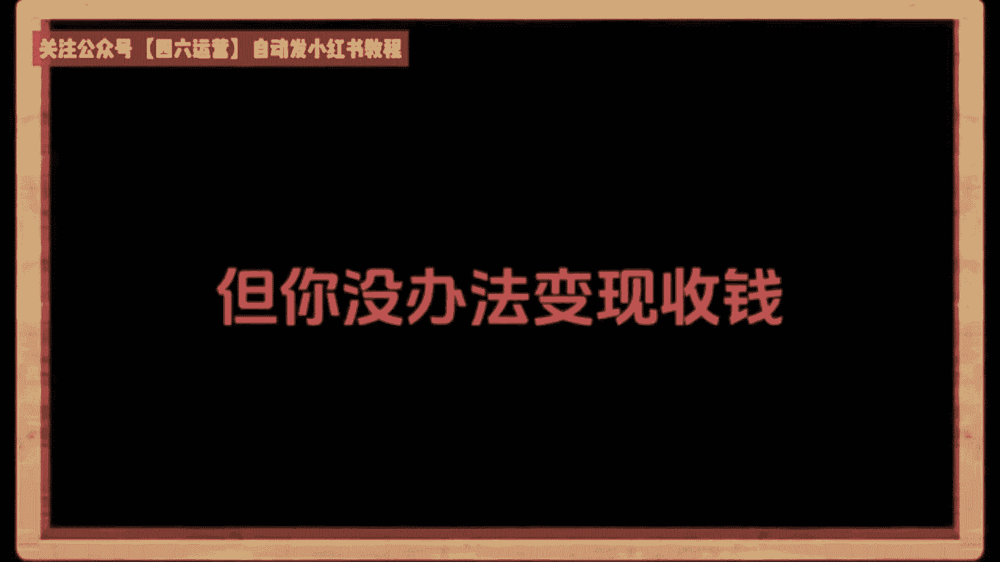

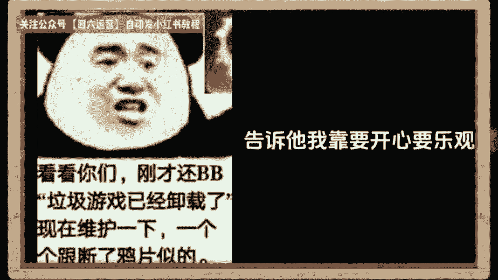

🎼总是以为自己就能解决需求了，但是内容有干货和能解决需求，它不是一个东西。🎼张三生病了，他最想知道是自己怎么治，能不能治好多久能治好，有没有后遗症。你讲你为啥得这个病，你得这个病的原理是什么？

人家不关心，讲的再专业，再有干货都没有用，所以准确的识别需求是很重要了。这是一种网感，你要慢慢培养。

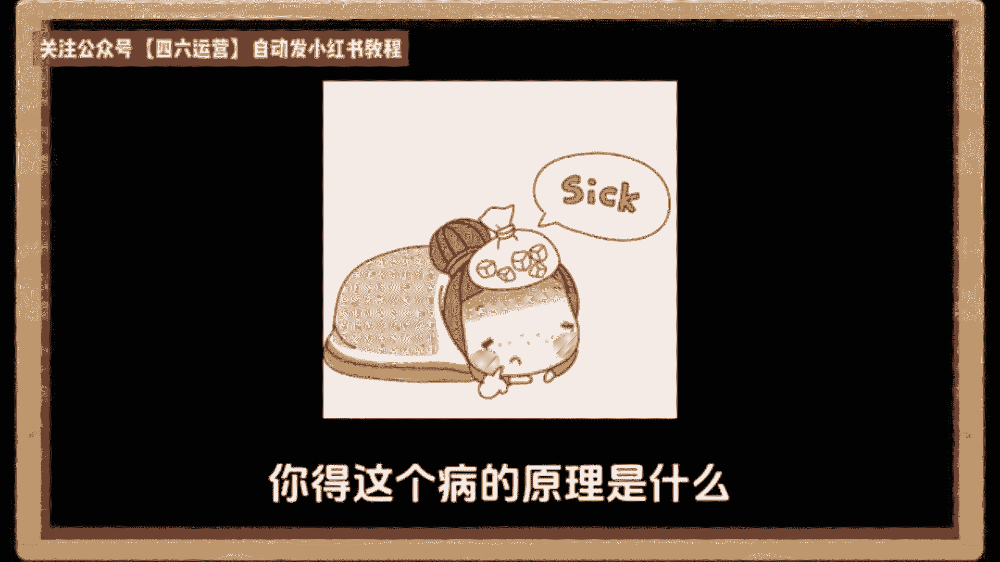

🎼如果你发了一大堆内容，号就是起不来。那八成是因为原因，内容不行，要么没有情绪，要么没有价值，自己回去分析分析原因。如果还是搞不清楚，还是评论去找我，我给你看看。第三个是封面既要引发用户兴趣。

又要解决用户问题，内容的情绪价值和痛点价值，全部都要体现在封面上，具体的操作，因为你领域而已。比如说搞穿搭的照片又有个性，亮眼，而且要养眼搞美式的图片拍出来有食欲就可以了。

搞知识的要展示出最引人注目的观点，让别人能关注到你。如果你灵感迸发，想到了一个天才文案型的封面上，靠着封面，说不定就能报一个帖子。这个我没有办法通过一个万能公式去让你百分之百的掌握怎么做封面。

这是一种感觉，只能多去揣摩同领域是大号，然后自己去试做的多了赞就会了。如果怎么做都搞不定，还是来找我看看就可以。第四，账号你要做出个人风格。这个牵扯到个人IP的问题，后面我们会详细讲。

这里就是说说白了就是让你懒一点。

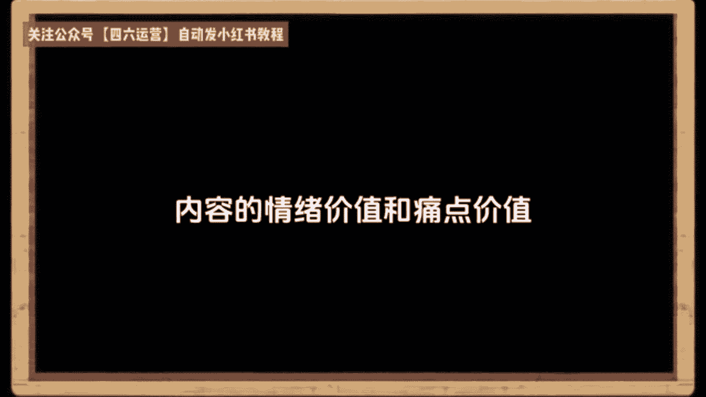

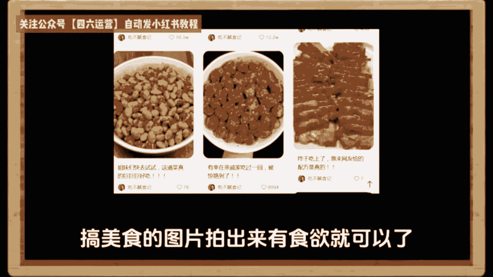

🎼不要瞎折腾，封面不要乱换，一直用一套模板就可以了。视频的片头，音乐不要乱换，一直用一套就行了。说话的风格不要刻意去学别人的，按自己的习惯坚持表达下去就可以了。比如这个人，你看他所有的封面都是一个风格。

时间长了，你要记住它了。第五是宁可减少数量，也要保证质量。如果能三天更一片牛逼了，就不要一天更三天垃圾了，但是你要保证更新频率稳定。🎼你不要两个月更一个。🎼一个月之内一定要更一篇。

如果一个月之内没有更新，平台就会觉得你断更了，流量会少很多。🎼到这里，如果今天讲的东西全部都搞定，坚持做下去，铁号绝对不是问题。🎼但相关有5个，或续变相相关有5个问题。🎼第一。

如何让同样的内容阅读量跳跃式的增长？🎼第二个，如何大规模跳跃式的涨粉？🎼第三，如何安全高效的引流和变现。第四，如何让帖子发布一年后也能继续带来收入。第五，小红书群体的赚钱逻辑是什么？

这5个问题在下一期变现片中会详细讲，迫不及待的想看了，可以看评论置顶区就OK做了几周甚至几个月，连1000粉都没有破的评论区找我，我帮你看看。

Yeah。趁年轻的时候。多学点技术，啥也不会，年老了，吃亏呀。😡，🎼。