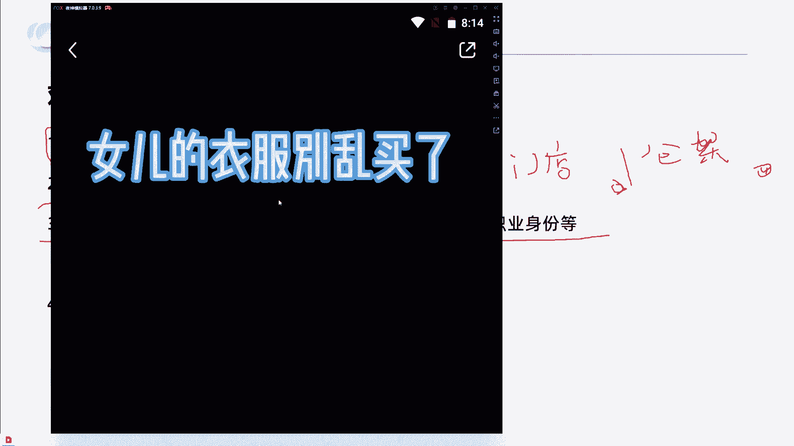
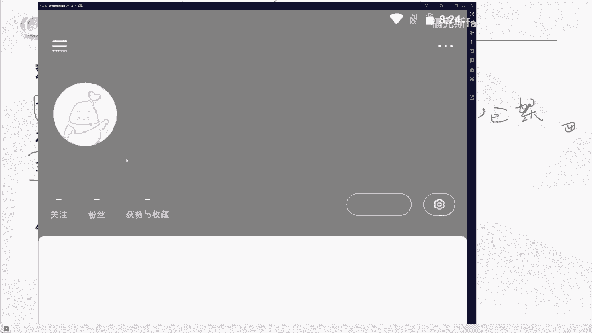

# 【2024小红书运营教程】强到无法呼吸！！！小红书起号养号黄金七法则，原来爆款账号这么简单！ - P2：小红书起号教程 - 鼓腹含和防护服 - BV1wJt8eSE6o

今天我们跟大家分享的是小红书从0到1系列对标账号的筛选与应用。那么我接下来要讲的内容还是老规矩，都是一线的实战干货啊，我们大概预计花费一个小时跟大家做分享完毕。那么我们整个分四个板块去做一个分享。

第一个是了解对标账号。第二个呢是如何找到对标账号。第三个是如何运用对标账号以及有效对标与无效对标。那我刚刚问了大家啊，我们怎么什么是对标账号啊，有一个人回答了说同赛道数据好能复制的那这个。

答案是否正确呢？我们往后看啊，其实对标账号是什么啊？在我看来，对标账号其实是分狭义的理解和广义的理解。

对标账号狭义的理解就是未来你希望做成什么样的一个账号，给自己一个参考方向，一个前行的一个参照物。那对标账号的广义理解呢就是只要是账号内容能够辅佐你来做出未来运营决策的，都可以作为对标账号。

只是说广义的对标账号，你可能参考借鉴的是它的一个选题一个标题或者是它变现方式啊，甚至引导客户添加你思域的方式。那我们来看一个例子啊，为什么说我们要找对标账号，我们从学习美术到学习音乐啊。

不管你学任何一种艺术，基本上啊临摹是第一步。我们可以看到啊在美术学习的这个过程中啊，像我就是学美术出身的啊。那这个呢就是美术生可能都画过的一个大卫的一个头像。那我们发现一个事情啊。

你们觉得一号大卫2号大卫和3号大卫谁画的更好呢？一23谁画的更好呢？所以我们会发现说当你把大卫做成当成一个对标的一个头像去做的话，作为一个产品的话，有的人画出来是一号的样子。有的人画出来是二号的样子。

有的人画出来是三号的样子。那么在这个过程中啊在这个过程中。每个人本身他对艺术的一种感觉，对产品的描述出来的形式就不一样。那也就意味着是什么？我们根据不同的描述，我们可以选择学习一号，也可以选择2号。

也可以学习一个3号。所以学习是最快的方式啊，那我们再往后看。那么什么叫广义的一个对标呢？就像我们刚刚看到大卫一样啊，相同的一个大卫石膏像不同的人画出不同的样子。那相同的产品。

不同的人写出来的笔迹给人的感觉也是不同的。那我们再看到偏狭义的一个对标啊，还是一个石石膏像。但是你会发现不同的人他的创作手法开始发生的区别。一号大卫他使用的是素描方式，2号大卫他使用的是油画方式。

3号大卫他使用的是雕塑二次创作的方式。所以相同的产品，不同的展示方式也是不同的。那我们对账号的管义理解是什么呢？再确定一下啊，就是对标账号的关理理解，就是内容能够辅助做辅助自己做出未来运营决策的。

它可能是标题，可能是选题，也可能是变现方式等参考。那像我们现在啊所看到的右边的这个图片，就是我在小红书网页版搜索芒果啊，搜索出来的一些内容。那这个图片我第一页我就发现了它的奥秘。

我不知道你们有没有人感觉到啊，就是这一个一号内容。这一个2号内容和这一个3号内容，它都属于数据很好的内容，1个3。7万点赞，1个4万点赞，1个3。3万点赞。而且他们表达的内容形式是一样的。

就是吃芒果用什么样的一个方式是超级好用的。那我们再往后看啊，你会发现说这三篇笔记啊，它数据都很好，而且它都只是讲用勺子吃芒果的这种方式。那我们可以看到这一篇笔记啊，3。7万的点赞，它是什么时候发布的呢？

是4月19号啊，22年的4月19号。那这一篇笔记呢，右边的这一篇呢，它是22年5月18号发布的啊，它的数据呢是4万的一个点赞。那我们再来看一下这一篇左边的笔记啊，是22年4月9号发布的。他是3。

3万点赞。那么在这一篇笔记中，我们可以发现说他这这个作者艾特出来了真正的原创。第一个发现这个方法的人啊，他是22年的3月20号啊，他的数据是1。2万点赞。那我们发现说一个芒果的内容啊。

被一个素人他发现了，但是被有。敏锐的创作者进行了二次三次创作，拿到了不错的数据。那我们来看一下这四个人的数据结果啊。一号。发现这个。就第一个发出芒果可以用勺子吃啊。

用用勺子吃芒果比切芒果切盘要更加的方便快捷的人啊，他是38个粉丝。那么二次创作的啊有的是138粉丝啊，有的是10万粉丝啊，有的是5。4万粉丝。所以当我把芒果的这个事情拎出来之后。

你们现在能够理解什么是一个基础的一个对标了吗？啊，芒果的这个案例就是在告诉大家。账号内容能够辅助自己做出未来的运营决策，可能是标题选题或者变现方式。那我们可以看到啊，这四篇数据都很好的内容中。

原创内容的标题是吃芒果的正确方式。那二次创造用的是终于找到芒果的正确吃法，太开心了啊，以及终于找到了芒果的正确打开方式和吃芒果方法超方便实用好用。请问一下，这四个人。

他们有借鉴第一个原创的吃芒果正确方式的这个标题吗？是没有的，对不对？所以他们借鉴的是什么？他们借鉴的是选题就是我们来分享用勺子吃芒果这件事情，就能获得大量的流量，所以他们借鉴的选题。那么我们再来看一下。

我们切到这个网页版来看一下。来看一下这四个账号的一个实际情况啊。

实际情况我告诉大家是什么样的呢？就是真正的原创的人啊，他38个粉丝，他发了将近四五十篇笔记，但只有这一篇数据O而这一个138粉丝的，他是属于他真的啊用了他看了他的笔记，他用了他的方法去吃芒果。

他也觉得很好。所以他也发了，但他不是真正的内容创作者，所以他也只有138个粉丝，而右边的这两位，他们是真正的做内容的啊，做创作的，他们看懂了这些这个选题的一个数据的一个有效性和爆发力。

所以他们进行了二次创作，所以他们做到了10万粉丝，5万粉丝啊。但是我想问一下大家，吃芒果的一个用勺子吃芒果的这样的一个方式的分享。他为什么会有这么多的点赞收藏呢？

符不符合最开始跟大家说过的真诚分享友好互动。我真诚的分享了一个吃芒果的方式，所以我拿到了观众的友好互动。好，那我们再来想一下啊，我们为什么要找对标账号呢？几个点啊。

第一个点是对标账号能够有效提供前行的参考方向。第二个，对标账号的类型多样，能够更快给我们找到内容的制作方向。第三个对标账号的数据，代表着市场结果，可以提取精华。第四个制作出来的内容，有对比。

可以找到差距去缩小啊，就像我们前面所看的大卫一样，你有对比，你是去临摹的，有差距，你就可以去缩小这个差距。但是如果你没有一个参照物，你都不知道你画的好还是不好。那么第五个就是我们可以借鉴选题啊。

借鉴封面，借鉴优化思路的一个理解。第六个是依据对标账号的数据表现，提取爆点啊。这个接着我们会细细的展开。那么右边有一幅名画啊，是小鸡赤米图。那我们可以看到啊，对标的过程中，我们还可能发现一种情况，对吧？

就是做。边是背对标的啊，右边是我们有一些朋友啊，有一些朋友的一个结果是吧？这个就变成了什么小鸡夺米图。我想问一下大家，这个叫有效对标吗？这个算对标吗？一个小鸡痴米图，一个小鸡夺米图。

所以有对标就能让你知道你哪个地方没有做好啊，而且大家在后面的一个字内容的创作过程中，不要轻松的觉得说啊我做了内容，我的标题跟它是一样的，所以我就能报，你真的看一下你的内容是不是像这两幅画一样。

出现了巨大的理解差异。那为什么们要去做对对标呢？就是第一个啊，从抄袭到抄越啊，到钞票。

那么第二个点啊，我们来讲什么呢？讲如何找到对标账号。

那么对标账的几种收集方式啊，我已经给大家罗列出来了。第一个是关键词查询法用户名搜索结果。第二个是关键词查询法的笔记搜索结果。第三个是通过数据软件平台筛选。第四个是跨类目对标。那我么们第一个啊来看。

就是通过关键词的查询法，这个我们一般是用到手机端啊，我们在手机输入童装中啊，我们可以看到用户这一栏啊，可以看到用户这一栏，我们可以看到。名字中包含童装的这些账号啊，可以对它的内容去进行一个检索。

这里我讲一个知识点啊，讲一个知识点就是。比记数与粉丝量的对比是账号运营能力的体现，是账号运营能力体现。我想问一下大家。A运营啊100篇笔记增加了1万个粉丝。B运营啊500篇笔记增加了1万个粉丝。啊。

他们的目标用户都是一致的，拿到的目标用户都是一致。请问是A厉害还是B厉害，A厉害还是B厉害？啊，我再跟大家强调一下啊，今天的知识点啊，比技数与粉丝量的对比是账号运营能力的体现。

所以我们在研究账号的过程中，我们尽可能多去看一下它是如何通过少量的笔记来做到更多的粉丝啊，像我对吧？我通过29篇装修笔记做到了1万粉丝，所以我每篇笔记的增粉量在300以上。那我们接着往下去看啊。

对标账号的几种方式的第二个点是关键词查询法啊。这个我们用网页版的小红书就好了。网页版的小红书啊，在网页版的小红书搜童装结果，它会有一排关联词的出现啊，关联词出现。那这里有春夏春款啊。

公主裙连衣裙、幼儿园穿搭等等啊，它是有关联词的自带关联词。那么通过关联词，我们可以去进一步啊把童装这个类目进行深化啊，像连衣裙对吧？会出现这么多内容，像公主裙啊，又会出现公主群的一些笔记内容。

那么第三种啊，我们对标账号的一个收集方式是什么呢？是通过数据软件平台进行一个筛选啊，像数据软件里，他们可以筛选博主筛选笔记，筛选实时的一个笔记版低粉豹文版啊，以及商品的7天15天的一个销量排行榜。

这是第三种对标账号的收集方式。第四种对标的一个收集方式呢，它是跨类目的一个对标啊，我们借鉴呢是标题是封面，是选题是运营方式，甚至导流方式啊，这个我不具体展开。但是我们实际上是可以做到跨类目对标的啊。

举个例子，我们看到这一篇笔记啊。他的标题是陈海玩具，还比1688便宜，你敢相信吗？我想问一下大家啊，我们跨类目对标啊，我们觉得这个标题很好的情况下，我们怎么样去写一篇母婴的标题，我再把这个标题念一遍。

你们去构思一下，怎么样去写母婴童装的标题，打在评论区好吗？它的这个标题是陈海玩具还比1688便宜，你敢相信吗？大家思考一下啊。我们借鉴这一个标题的手法，去写一篇母婴的标题啊，这一篇标题是什么？

是陈海玩具还比1688便宜，你敢相信吗？那同理我们是不是可以把陈海玩具这个词换掉啊，变成。叉叉童装啊，还比1688便宜，你敢相信吗？啊，比如说这个啊。第二个这一个标题我们可以看到啊。

这个标题是啥是顺德本地人分享不踩雷系列啊，荣桂美食篇。那如果说我们觉得这个标题很好，我们把它对标到我们的母婴账号去做，那就可以是什么？就是不是他的他这个标题的吸引人的点在哪里？在顺德本地人分享啊？

我不是美食达人啊，我不是乱七八糟带的带货博主，我是本地人分享，让人天生觉得更真诚。那我们把这个标题套进去就变成了什么什么样的身份更真诚呢？比如说是童装，对吧？那可能就是啊。童装啊或者叫童装产二代是吧？

分享啊，不踩雷系列。或者说。十年童装人啊分享不踩雷系列，它这个叫荣桂美食片。那我们就可以说衣服材质片啊，这也是属于跨类目的一个。跨类目的一个对标和借鉴。那包括像这一篇笔记啊，4000多的点赞，薅牙毛了。

1688婴童服装同源工厂便宜这么多。啊，所以我们通过一些对标账号，可以是同赛的对标，也可以是差异的对标。我们都可以给自己提供一个灵感。所以对标账户能够给大家提供更多的信息。为什么我们要通过对标账号。

是因为什么？是因为实际上90%的事情其实都有人想到要怎么做了，而90%的方法都已经有人在做了。所以你们90%问题的答案其实都在对标账号里，我问一下大家，童装有几种卖法，通过小红书。

是不是可以通过店铺挂车是不是可以通过店铺引流，是不是可以通过群营销啊，我们把群插件，对吧？上次跟大家讲解了。所以说那我就看到了这个牧童妈妈童装，他都已经到第九个群了，而且有358人了。

那我们是不是可以通过这个账号去加入他的群去看他是怎么在群做成交的。同样的在陈先生童装供应链这个账号里啊，他有一篇置顶的笔记打开是这样的，就是这一张图啊，这这其实这个就是他的笔记内容。

这个就是他一篇的笔记内容。这个不是他主页啊，这已经是他一篇笔记内容，他就画了一个圈，很多人找不到我们字母加数字，这个就是我们的朋友圈。那这是不是通过主页置顶笔记啊导流的一种方式。

所以90%的答案其实都在对标账号里。那么对标账的使用意义啊，我们再来跟大家灌输一遍啊，接下来我们会继续让你们更深入的一个理解啊。第一个对标账号能够有效提供前行的参考方向啊，就是你的账号要怎么做。

对标账号的类型多样，能够更快的让我们找到制作方向。第三个，对标账号的数据，代表着市场结果可以提取内容精华。第四个，制作出来的内容有对比，可以找到差距去缩小啊。第五个，借鉴封面选题优化思路的理解。

以及提取爆点。那么综合用一句话来说啊，对标账号的使用意义是什么？对标账号的使用意义是让我们从偶然的从偶然性的数据中找到必然性的规律。大家把这句话打在评论上，好吧，大家把这话打到评论区。

加强你们的对这个知识的一个吸收啊，从偶然性数据中找到必然性规律。大家把这句话打在评论区好吗？从偶然性数据中找到必然性规律。为什么我们要从偶然性的一个数据中去找到必然性的规律呢？是为了抬高笔记的数据下限。

抬高笔记的数据下限。我们的笔记能否获得几千点赞甚至几万点赞甚至上十万的点赞互动，这个是需要运气的。但是你把你的笔记下限，抬到几十个点赞，是可以通过自己的运营技巧和找对标去完全实现的。

所以我们找对标是从偶然性的数据中找到必然性的规律，从而抬高笔记的数据下限。那么对标账号的一个学习收集习惯啊，这里我跟大家分享一下，也是我自己把29篇笔记做到1万粉丝所在用的一个方法。第一个动作是。童专。

那你们通过刚刚所说的对标账号的寻找方式，找到你们觉得优秀的账号，关注他关注它的作用是什么呢？是你可以定时翻阅账号主页，查看是否有豹文出现，趁热打铁，还记得刚刚那个芒果吗？

从3月19号到4月20号到4月20几号到5月份连续4篇笔记全都报了。但是如果是你们去分享芒果，有多少人能想到，从芒果的。用勺子吃芒果这种体验方式去。创作内容呢根本想不到。

但是我们如果看到了别人这样的方式，他报了，我们能不能赶紧去尝示做二次创作是可以的。所以说我们是定时翻阅账号主页，查看是否有豹文出现趁热打铁，这是第一个动作啊，关注10到20个学习账号啊。

定期去翻他的内容。如果他有很好的表现形式，创移方式，赶紧趁热打铁。第二个动作是什么？是在你们的小红书收藏里面建立至少三个专辑文件夹，建立三个专辑文件夹分别是什么？

是标题灵感、标题灵感以及封面样式、封面样式啊，还有选题方向选题方向啊。嗯。我问一下大家，你们觉得标题封面和选题这三个哪个重要？打在评论区好吗？标题封面和选题这三个你们觉得哪个重要啊。

我建议大家啊建在自己的这个小红书的收藏夹里，建立至少三个专辑文件夹啊，分别是选题封面以及标题。因为优秀的内容，数据好的内容，它本身就是市场检验出来的结果，所以我们把好的东西的灵魂提取出来了。

用在我们自己的身上，会让自己更快拿到结果。所以我们将日常刷到的笔记有收获的进行分类就好了。不一定是要你做的类目，不一定是要你做的类目，明白吧？好，那有人我看一下啊，有60%的人啊，认为封面重要。

有20%的人认为标题重要啊。然后没有人认为选题重要啊。实际上我告诉大家啊，这三个其实都挺重要啊都挺重要。当然，按照小红书的推流逻辑，因为它不像抖音，它推荐一篇内容，它会自动播放，它封面是推荐四篇笔记。

对吧？小红书的封面是推荐四篇笔记，所以我们必须把标题和优封面优化好，人家才会点进来，在你标题和封面没有优化好之前。

那人家可能都不会打开这篇笔记了。那我们第三个我们来说什么呢？来说我们如何运用对标账号，运用对标账号。

对标账号的灵活运用啊，这个地方我希望跟大家去共同创作啊。那我先告诉大家什么叫对标账号？什么叫对标账号的借鉴形式。那么如何运用对标账号呢？我们要想把这个对标账号运用好。首先我们要知道怎么去分类啊。

所以我们要找到合理的账号归类方式，找到多角度的表达方式，找到多身份的表达方式，最终找到适合自己的账号定位和表达方式。那这里啊我们来以同装举例，以同装举例啊。找到合理的账号归类方式。我能想到的啊。

比如说我们是可以按照展现场景去分类的。比如说我们去搜童装或者公主裙啊等等一系列关键词，它出现的内容，我们是不是可以给他做一个场景的分类。这一篇内容它是在室内拍摄的，还是室外拍摄的？啊。

第二个我们是不是可以做第二个分类，是他是有模特的还是无模特的？啊，还有什么分类方式吗？大家想一下啊，大家动动脑筋，因为你们学会怎么去梳理账号，怎么样去搭建这个账号的分类方式。当你知道怎么分类了。

你就知道怎么样去看别人报的内容。那你知道怎么样看别人报的内容去进行有效分类，那你就知道你的内容和别人的内容差在哪里，明白吗？所以我们第二个，我们可以找到多角度的表达方式。第三个是什么？

找到多身份的表达方式啊，比如说爸爸妈妈啊，这篇笔记的一个发布这篇笔记的人，是爸爸还是妈妈还是外婆还是爷爷啊，或者说甚至是后妈，是不是？那我想问一下大家，如果你们去发童装的内容。

你们会选择什么方式去发布呢？是用妈妈我给孩子买了一件啊，心爱的童装。还是说。作为后妈，我给孩子买6。9块的衣服有错吗？😡，还是说作为爷爷。爷爷提前啊孩子还没生，爷爷就就已经把衣服买回来了。

你们觉得我刚刚的这三个方式，哪个更吸引人？啊，你们觉得我刚的三个方式，后妈给孩子买一件有6。9块的衣服有错吗？啊，或者说我们能不能用用其他的身份去做这样的一件事情。大家还记得一个有趣的故事吧。

有一个这个小朋友啊，拾金不昧啊，送给了警察叔叔啊。作业是不是？所以啊。不同的内容你们看到之后，创作者的身份他们可以进行一个分类啊。账号的展现形式可以分类。同样的啊，像刚刚也有人在评论区说的。

产品做成九宫格啊，进行一个拼图。那这是不是属于一个表达方式的分类呢？那我们现在啊有人说啊，我们可以通过九宫格分类，它有没有没有更多的方式？想一下，肯定是有的，有方式一九宫格，有方式2，有方式3啊。

有方式4。九宫格算是一种分类，对不对？那同样的，比如说我们在货架上展示货架。货架。啊，以及以及戴老师说过的啊，我们去门店，对不对？戴老师不是说过，我们直接去合适的朋友的这个童装的门店去拍摄素材。

是不是一种表达方式啊，以及什么甚至仓库。是不是等等等等。所以你们要知道怎么样去应用对标账号。首先你们要学会分类，然后你们就会发现有的身份，有的表现形式和有的展现场景，它是天生有流量的，能理解吧。

理解理解打个理解好吗？我打个666好吗？有收获打个666好吗？有收获打个666，我喝口水啊。那么这个地方。我带大家啊，我们去实际运用一下怎么样去寻找到对标账号。来啊，我们先讲。先讲先看一下啊。

这个是手机端啊。比如说我们通过手机端搜童装啊，我们可以看到。在用户端啊。

我们可以看到第一个字账号。它是400篇笔记，23万粉丝，每篇大概增长了600笔记啊，这个地方我把这个屏幕给大家拉大一点。

啊，你可以看到这个这个账号的数据啊。怎么样还可以啊还可以啊。那么你发现没有？😡，他用了他的这个内容啊，有一个共性，我不知道大家发现没有。

就是他的所有的内容。他的封面都加了一句话，叫富养女儿穿搭。富养女儿穿搭。

看到没有？好，那我问一下大家啊。😊。

这些内容的展现形式是不是不一样的对吧？这个属于什么场景？这个属于我们来看一下什么场景啊，女儿的衣服别乱买了，这里都是整套搭配好的，喜欢就收藏关注吧，不然刷着刷着就不见了。

🎼这个属于室内，对不对？室内。

🎼模特啊混剪室内模特混剪。

🎼那么这个属于什么？女儿的衣服，看到没有他前面啊还加了一段字母，这个属于什么？室内没有模特啊。

🎼合集室内没有模特合集。好，这是一个账号啊。那我想问一下大家，你们在看这个账号的过程中，你能你们能告诉我是有模特的数据好还是没模特的数据好吗？

我带大来看一下这个账号啊。😊，我们怎么去看账号，看一下大家啊，就是要当我们去分析一个账号，我们就要看它数据高的内容。

数据高的内容啊，像他这种账号，那就以以1000啊大几百为单位。这是我们看到的一篇啊1200点赞的内容，这是有模特的对吧？而且是亲子装。

啊，这里有篇4000的，这里有篇5000的。这个是什么？啊，也是有模特的啊，而且他的标题还很重复，孩子就是要在还小的时候尽情给他打扮啊。这里一句话，富养女儿穿搭。好，这有一篇一000的，看到没有？

他也用了同样的一句话，孩子就要在还小的时候尽情给他打扮。接着看我们看上千内容啊，这个也上签了。然后这个呢。就左边这个他是这个也是属于应该是模特没有出镜的啊这个封面是没有出镜的。好，看到没有？哎。

这个地方看到没有？他是不是测试了一个什么情况，他测试了用虚拟卡通人物做封面，看到没有？所以我们的出镜方式，除了有人真人无人，还有什么，还有虚拟卡通。

之前有人想到过虚拟卡通形象吗？是不是？那你会发现说他做了尝试，只是他的尝试结构怎么样不好啊，1个16个点赞，1个20个点赞。那我们继续往后看啊，这两篇也是一样的，用的虚拟卡通人物100多点赞啊。

7个点赞。

所以从他这个数据啊，我们可以看出来，虚拟卡通人物至少他测试的结果啊是放弃了。

那我们再看一下这篇1000多点赞的又是属于什么？属于真人出镜，对吧？真人出镜。

所以从目前这个账号的数据，我们能看出什么东西就是他尝试了虚拟人物出境，然后虚拟人物并没有拿到很好的数据，然后他一直在用富养女儿穿搭这6个字做内容，以及什么？

以及尝试着人物出镜和启能人物不出镜。那么根据数据比较好的笔记，我们可以发现啊，像这篇4693个点赞，它也是人物出镜。所以我问一下大家是人物出镜的数据更好，出镜数据更好还是不出镜数据更好。

出镜还是不出镜啊，把你们的答案打在评论区好吗？像这个1450个点赞啊，是这个小朋友啊，穿着这个衣服。

是出镜数据更好还是不出镜数据更好，出镜还是不出镜？啊，所以你们要通过分析对标账号去归类啊，归类找结果找自己的一个内容方向。同样的我想告诉大家啊，其实这个人物它也是还有区分的。有的人物他有素人感。

有的人物是模特感啊，所以也是我们可以去区分的那这个账号我们看到这里我们再看第二个账号。

啊，这个账号是13。6万粉丝啊，他总共是我看一下多少篇内容啊。

这个账号叫做童妈啊，女装童装穿业店415篇笔记啊，13。6万粉丝。我们来看一下他的账号数据。他也是一样的，他用了富阳女儿穿搭，看到没有？看到没有？大家这两家店啊，首先说到两家店。

他们都把富阳女儿穿搭放在了首页。我想问一下大家，这个是不是规律，是不是运营的规律，他们能做到十几二十万粉丝，他们每一篇都把富阳女儿穿搭打在封面上，是不是规律？是不是规律？那我想问一下大家。

你们知道富阳女儿穿搭这6个字打在这个封面上还有一个什么好处吗？她吸引什么人群？他信的是舍得为孩子花钱的人群。他是舍得为孩子花钱的人群，对不对？因为我是富养女儿，我不是穷养女儿。

所以他能吸引的就是舍得为孩子花钱的人群。我们可以看到他的内容。啊，我们现在也在往下刷啊，比如说我们可以看到说。4000多点赞的这一篇笔记啊。他是孩子出境啊。然后我们再往上看啊。

像这两篇它是属于大人出镜啊，大人出境的数据就没有上签，我们再来看。这个2600点赞啊，这个目前从封面上看没有人物出镜，这个8000点赞的。看一下啊，这个是小朋友出镜，对不对？那你有没有发现一个点。

就是他们的这个所谓的小朋友的模特，其实他打扮出来，是有一种高级感和精致感的。我觉得这个穿搭已经是不是传统的那种小朋友的穿搭了。那么我们再看到右边这一篇1212点赞的，他也是大人出镜还是小孩出镜啊。

大人出镜的数据感还是小孩出镜更好。那我们可以看到啊，这个1443最右边这个啊富养女儿穿搭啊，他也是富养女儿穿搭。那中间的亲子装啊，数据没有更好。所以我们可以通过别人的数据。

通过他们最爆的内容去看到我们的内容方向是双人出镜还是儿子出儿童孩子出境还是母亲出镜。像这一篇6996969点赞的，又是小朋友出镜。啊，那我们。是不是还可以做一个归类啊？比如说现在的三篇笔记中。

这一篇它是属于一个户外场景，看到没有？它应该是在类似于一个大堂前台的地方，这样一个充电宝。那我们是不是还可以去进行数据分析，它究竟是在户外的表现数据好，还是室内的数据表较好。

就是我们是在一个随机的场景数据好，还是在一个刻意的数据好啊，你像它也在尝试，看到没有？像右边这一个戴眼镜的这一个笔记，它是在户外的一个停车场的场景中。

啊，看到没有？1619点赞啊，它是在户外的一个场景中下雪啊，他这两篇笔记。

你们不要看啊你们不要看这个笔记，只看数据，只看标题。这一篇458点赞的啊，爸爸给孩子穿衣服。和这个1619点赞的爸爸给孩子穿衣服。我想问一下大家。爸爸给孩子穿衣服这个动作，爸爸被拍进去。

他是有意的还是无意的。大家打在评论区是有意的还是无意的？

我们再继续看一下啊。啊，包括这个。啊，大家意识到没有？是有益的。因为在户外的环境中，爸爸给孩子穿衣服，这张照片是比你在服装店里穿好站在那里像模特一样拍照是更有场景感和真实感的。所以这个运营。

其实我觉得它是一流的运营。它能够捕捉到我刚刚所说的分类的场景的差异。那包括这一张。啊，是小朋友也是在大堂走路的一个姿势。那我想问一下大家，这个是什么区别？这个是不是动态动态封面和静态封面的区别？

因为这个人物是明显拿着手机往前走，他是没有那种刻意感的这是一个动态图。那我们再往往往往继续看，看到没有？这个1403的这个中间的这个笔记，它是不是小朋友在等电梯的一个照片，他也是人往前走。

所以这也是一个动态图动态图啊，包括像这两篇啊，看到没有？他又报了一篇数据很好的2700的，他是怎么报的，他是妈妈。拿着衣服，妈妈拿着衣服，这个衣服没有挂在架子上啊，就是有一双女人的手拿着这件衣服。

这是不是一种表达方式，是不是一个场景，有人物衔接的关系，在挑衣服的关系。那么他报了一篇2790的笔记之后，他又继续拍了一篇，就是有人物在旁边准备取衣服的这个动态。

所以所有的数据好的内容都是值得你去仔细分析的。他是什么样的场景，他是有人还是没有人啊，他配了什么样的道具，他出了手，没有出手，他是静态的还是动态的啊。大家我问一下大家有没有收获，今天有没有收获。

有收获打个有好吗？有收获打个有啊，所以我带大家我们实实在在的去看别人的账号到底什么叫做对标。什么叫做对标。

那我想问一下大家，像这种啊像这种账号，我们都可以看到这种就属于什么无模特静态在服装店内拍的。我想问一下大家，他的数据好吗？他的数据好吗？知道为什么要找对标吗？知道为什么要找对标吗？啊。

包括有人提到的合集，合集就一定数据好吗啊，所以实际上有人刚刚在评论区打了一条弹幕啊，就是。

这个孝程啊是模仿这个童妈的啊。那实际上从运营水平来讲，童妈的这个账号的运营水平肯定是最高的，他确实有模仿的嫌疑。但是他模仿，他只模仿了一个啥，他只模仿了一个标题啊，比如说我要富养女儿穿搭。

他没有真正的去把童妈的一些所有的运营思路给理解，没有像童妈一样去做多个角度的尝试，他所有的场景基本上都是在服装店里拍摄的，所以他有一种刻意感，而童妈她在干嘛，他一直在尝试，是不是跟我当时做我的账号一样。

我不会因为说我的数据有400个点赞了啊，我就满意了。我把我的数据拉到上千点赞，我就满意了。不管怎么样，我们永远在尝试，永远在对标。那这些账号，当他的数据不好的时候，我们是不是现在能发现原因呢？

我想问一下大家，为什么这个账号的数据不好，你们能。

能告诉我原因吗？是真的是因为它的古装风大家不喜欢吗？啊，这个账号我觉得它的产品还是非常有特色的，非常有特色的啊，基本上都是属于这种。裙子啊。基本上它都是属于裙子。我想问一下大家。

🎼如果是你们这个账号是你们的，你们要怎么优化，现在脑子里有没有思路了，是不是这个人他是在把同样的一个事情啊做了几十遍上百遍啊，就是把衣服挂在这里拍，他是不是也会有困扰啊，为什么我的数据这么差呀？

为什么我的点赞就3个4个呀，啊，我可能运气好有30个点赞，看到没有？他好不容易运气好，有一篇100个点赞了，而他的下限是多少？是5，所以我刚刚前面给大家是不是讲过，我们去找对标是提升账号的下限。

从什么从偶然性中找到必然性，明白吗？从偶然性中去找到必然性啊，我们再继看一下。

啊，像这种合计账号对不对？那我想问一下谁？😊，这个合计账号他数据好吗？数据好吗？啊。我们看一下啊，目前还可以啊，到这一条还可以啊，四4个的合集啊，它的下线大概是上百站的样子。这个是山百赞啊山百赞。

它是属于44张图拼图的数据。嗯。哎，看到没有看到没有？这一条袜子，这一条袜子啊，它有4673个点赞，4673个点赞。在这个场景中啊，左边的这个袜子，但是我想告诉你，这个商家的运营并没有很优秀。

你们知道为什么吗？我想问一下大家，当你有一篇笔记能够出现4673个点赞的数据的时候，你们会想到什么操作啊，你们会想到什么操作，能告诉我吗？为什么我说这个运营啊，它并没有很优秀，它绝对不算顶级S级的运营。

我告诉大家结论啊，为什么是因为他没有复制，你都知道这个角度有4673个点赞了。你为什么不把这个角度隔一段时间再发一次呢？对不对？而这篇笔记，如果我们是卖袜子的。

我们刷到了我们是不是可以收藏到我们的专辑里面作为封面的专辑。因为它这一篇我们去分析的话，是封面吸引人还是标题吸引人。所以我告诉大家，我们找对标不是一个今天一天做完的动作。

我们的对标和学习是一个持续的对坐。所以这一张图片对卖袜子的账号来说是有绝对参考意义的。如果卖袜子的刷到这篇它一段时间内去复制，这个一定是可以把下线提到几百个点赞的。大家相信吗？好，那我们继续往下去看啊。

😊，哎，又有意思了啊，大家发现没有？这一篇笔记，最右边的这篇笔记，它有700多个点赞，它有700多个点赞，它是什么？它是把饰品挂到一起。我想问一下大家，这个袜子和这个饰品它有没有关联性？有没有关联性。

是不是属于我们把产品挂到一溜，用1个45度角去拍摄出很多的产品，是不是有关联性？所以这是不是一个共性，我们是不是发到了一个惯性共性？啊，包括他尝生的货架。哎，我们发现没有？

这又有一篇啊又有一篇500个点赞的。他是不是把这个视频放到这样的一个角度，对吧？陈列很多的情况下，是不是数据也挺好的。所以我们在分析别人的过程中，我们要找的什么？要找的是怎么样让数据好，然后可复制。

提升自己的一个内容下限。啊，那你像他啊，他也不会说没有做尝试。那，看到没有？其实这一篇也是一样的，它也是一个袜子斜拍的角度，300多点赞，他也做了尝试啊，比如说母亲拿着衣服拍啊。

宝宝在在这个篮子里面拍啊，是不是也是一种方式？啊，甚至货架。等等啊，所以这一个运营它的优点是什么呢？他会去尝试啊会去尝试，但是他趁热打铁啊和这个。趁势追击的这个运营思维啊稍微差了一些，差差了一些。

所以啊我告诉大家，为什么说最后啊我们是要干嘛？我们是要找到适合自己的账号和定位。为什么我们要找到适合自己的？因为不是所有的表现形式都适合你。比如说我们看到的目前数据最好的啊，她有一个可爱的女儿，对不对？

在外面去拍摄。那如果你的孩子还是一个半个月大的baby，对不对？或者是已经是一个读高中的男孩子，你怎么去拍这样的内容，你是不是没有创作条件，对不对？那同样的。

有的内容她是属于拍照好看的有的内容它是视频创作出效果的那如果你没有视频，那是不是不适合你，所以我们要通过种种的归类方式和和这个角度的整理，去找到适合自己的账号定位和表达方式，能理解吧？

最后你们是要找到自己的账号定位和表达方式？

所以最后啊我跟大家讲一下有效对标和无效对标。因为你们在找的过程中呢，其实有可能会踩坑的啊。因为在我接触这么多商家的过程中，我发现了几个坑啊，第一个是什么？是他们找到一个。

大几十万的粉丝的账号。但是我们去看笔记的时候，就是他这一篇他这个账号可能。就是20万点赞啊，20万赞啊，5万的粉丝看这个数据很牛逼。但是你看他的笔记，你会发现他最近的20篇笔记可能就是5个点赞。

10个点赞。那这种账号它其实是运营过早的账号，它的积累是因为平台出期的红利，所以这种账号对你们来讲是没有对标价值的，所以我讲究无效对标。那么第二个账号是啥？是粉丝量过大的账号。

可能是平台选出来的案例账号。大家知道今年啊今年小红书平台要做直播选出来的案例账号是谁吗？把谁打在把这个人的名字打在公屏上好吗？所以如果你要去对标，你要尽可能跳出平台的一个案例账号。

因为平台的案例账号是你没有对标意的，平台会用各种流量和资源去警结，去帮它打起来。知道吧？第三个是啥？第三个是持续投放流量的账号，持续投放流量的账号。因为你们在刷的过程中也有一部分笔记。

右下角是有赞助标签的那这种账号它能带来的流量，不一定是自然流。而你如果是做自然流的情况下，这种账号对你来说没有建议。如果你是打付费流，那赞助数据高的笔记肯定是对你有借鉴意义的。因为它只有这个笔记出效果。

它才会持续去投这个笔记，大家能理解吧？第四个是啥是也是比较容易踩的一个坑啊，就是只有数据没有咨询的账号，就是在我们刚刚所看的这些账号里。

其实我们可以通过他的评论区去看到有人有没有人在下面评论怎么买怎么买啊，在哪买多少钱，有这些评论，意味着什么？意味观众和消费者有购买欲。如果没有意味着这个东西只是点赞收藏高。所以不要去。

对标这种只有数据没有咨询的，以及什么，以及不要去对标近期数据不稳定的账号，为什么？我在抖音对不对？曾经有一个。炫劳力斯表的账号是不是很牛逼啊？导演叫小戴，是不是？枯燥无味的生活啊，那当他把运营换了之后。

这个账号数据一下就下来了。所以如果一个账号他的数据不稳定，那么你要意识到他是不是可能更换了运营。所以我们找对标啊，要先。把对标账号拎出来，再反问一下自己这个账号是有效对标还是无效对标。

把无效对标的账号剔除掉，然后找到我们的一个规律。那有效对标有什么特征呢？第一个特征是什么？是半年内数据优秀的账号，半年内数据优秀的账号。因为。他三年前就已经做了10万粉了，和3个月做1万粉。

那肯定是后者对你的借鉴价值更大。因为3年前的运营方法和涨粉方式可能更加的简单。啊，第二个是粉丝增长速度快的算好。比如说你哪怕他现在只有1000个粉丝，但是你发现他总共才发了半个月一个星期。

他7天15天就做到了。1000粉丝啊，这种也是属于有运营人才在做才能做出来的。第三个什么是评论区咨询量大的账号？因为如果你的目标是卖货卖货卖产品，那你就一定是要以评论区去判断它的咨询量怎么样。

是否有消费动因。那么第四个什么？是我刚刚所说的数据下限高的账号。因为一个账号。的运营是否优秀，我会看两个指标。第一个指标就是他粉丝增长的速度，对吧？比如说他是通过500篇笔记去做到1万粉丝。

还是通过100篇笔记，他就能做到1万粉丝啊，这里还记得我用了多少篇笔记吗？我用了29篇笔记做到1万粉丝。啊，一个是这个水平的差异。第二个是看数据下限啊，有的账号5个点赞，10个点赞啊，500个啊。

10个10个啊，50个。那有的账号它是300501000。啊，300500100，那你肯定是要去关注这种数据下限高的账号，因为你去获得几千几万个点赞是需要运气的。但是你能够稳定的获得上00个点赞。

这个是运营的实力在那里的，明白吧？所以再次给大家啊去讲一下所有自媒体平台的运营，其实就是这12个字，找对标拆报款多尝试要坚持。那我今天跟大家详细讲的内容是什么？是如何找对标，对不对？

我们怎么样找到有效的对标，怎么样去通过对账号的一个分类方式去套到这个账号中去找到数据下限高的表的方式。那么面对你们后面还有什么还有拆报款，还有多尝试以及什么以及要坚持再牛逼的运营啊。

他牛逼也是需要尝试的。他不是把脑门一拍，哎，我按这个方式排会报。我按那个方式拍去报。不是的，越牛逼的运营，他越会尊重这个市场的一个客观规律。为什么？因为本身小红书每天就大几十万的笔记。

新的笔记投放到市场中，本身这个是是情这个。笔记他能获得上千的点赞，就已经是千里挑一的了，就相当于什么？就相当于什么？就相当于说小红书它是开卷考试。就像我啊我读书的时候，如果说你把我放在全年级第100名。

那我考试成绩就在200名以内。但是我最牛逼一次，我考了全年级第59名。你们知道坐在我旁边的是谁嘛？是全年级第19名，其实就是这个逻辑，小红书是开卷考试，它的这一篇笔记已经在排名中拿到了好的排名。

你就要去研究它借鉴它。所以最后呢就是我们要说坚持啊再坚持。好，今天的分享就到这里，更多干货慢慢更新，有问题评论区见。😊。

