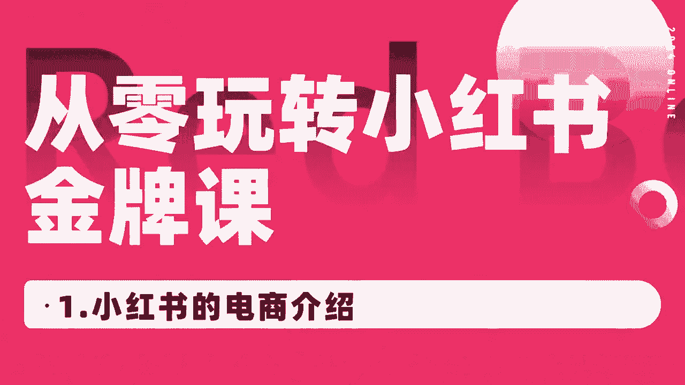
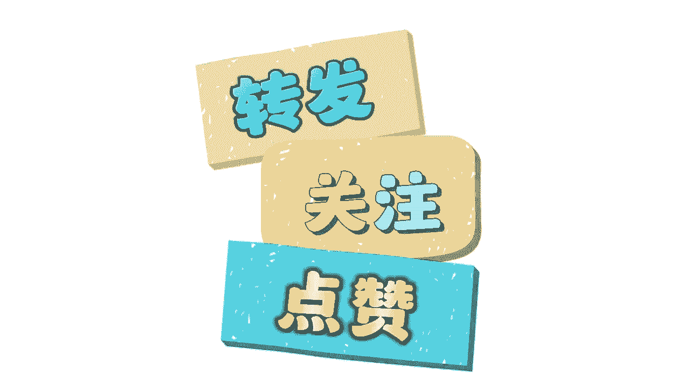

# 【2024小红书运营教程】强到无法呼吸！！！小红书起号养号黄金七法则，原来爆款账号这么简单！ - P3：1.小红书的电商介绍 - 鼓腹含和防护服 - BV1wJt8eSE6o

🎼，🎼。

🎼你好，我叫阿强，我是咱们王岛主电商学院的小红书官方讲师。从今天开始就由我来和大家一起来呃学习我们小红书，小红书整体的如何去做的，对吧？我们店铺如何去做我们小红书的IP如何去打造。

以及我们关于一些呃剪辑方面的问题都会跟大家讲的很明白，很清楚，好吧，呃，那我们今天这节课先跟大家来聊一聊我们小红书的电商的整体的一些介绍，好吧，呃，那我们会从两个方面会跟大家具体来讲一讲。

首先会跟大家来聊一聊为什么我们要去做小红书电商。今天的主要目的就是跟大家来聊一聊我们整整堂这个我们的课程里面会按照一个什么节奏，什么步骤来跟大家呃讲我们的小红书课程。首先为什么我们要去做小红书呢？

首先要大家要知道趋势很重要。小红书它目前算是整个互联网中风口已经是比较大的。但是最。

大的流量大家可能也知道，肯定目前肯定是抖音，对吧？但是小红书它目抖音它已经处在一个风口，但是它在逐渐下降的。而且小红书其实你会发现它每年它每个月的呃热度啊以及流量的都是一个处在一个。

持续上涨上涨的一个状态。所以说其实大家和我们一样，其实也是看到了小红书它的风口，它的流量。所以说我们才会去做小红书，对吧？才会去越来越多人在小红书里面赚到钱，也有越来越多的人开始入局小红书。

所以说趋势很重要。这个就是目前它的一个风口的趋势，所以我们也需要大家去顺势而为，而不是逆水行舟，对吧？那目前小红书它是一个什么平台呢？首先第一个它是一个电商平台，对吧？我们可以在里面买东西啊。

以及可以在里面卖东西，以及它是一个直播平台，对吧？它是一个买手平台，对吧？大家要明白这三个点，就很重要，以及目前小红书相对于其他的一些。平台来说，比如说一类电商的淘宝、天猫、京东这些是稍微比较简单的。

而且相对于抖音来说也是比较易上手，成本比较低的那它具体从哪两个方面。首先它不需要大家去囤货，不像抖音天猫淘宝这些它需要大家有货源，有工厂，对吧？它不需要你去说固定，我必须得去直播，对吧？直播卖货。

这些都不需要，我因为我们大部分做小红书的人都应该知道它是可以有一个叫做一键代发的，我们可以让别的平台帮我们发发货，我们自己不需要去发货，以及它对于像抖音来说，抖音。如果说你不实拍的话。

或者说你呃全部混检的话，它肯定会很容易被呃可被判为这种搬运啊，混检啊，会会被判为违规的。而小红书不一样，小红书我们前期做的话，不需要你去实拍，对吧？而且不需要我们自己去买样品。

我们不需要花费大量的人力精力，我们去做混检就可以了，对吧？提供呃，你可以自己去寻找一些素材，通过这些素材做一个混检，做一个简单的混检，就能获得一些稍微大一点的流量啊，形成呃出单等等等等，对吧？

形成这个店铺的一些火爆的流量很简单，好吧，第三个点，它目前来说，竞争压力相对于来说也是比较小一点的。因为很多传统的电商的卖家呀，还没有开始完全的入局小红书这个平台。还有很多人甚至都不知道小红书这个平台。

而目前。呃，2024年也确实是小红书，它的一个新一轮的风口。所以说我们大家一定要抓住时间，对吧？抓紧时间去入住小红书这个平台，也是目前我们呃大部分人想在互联网上翻身的一个机会。好吧，呃。

那这个就是我们跟大家讲一讲具体我们为什么要去做小红书的，好吧，那接下来我会通过三个方面跟大家来聊一聊呃，接下来的课程的内容，好吧，首先呃先会简单的跟大家讲一讲我们的小红书店铺的如何去操作的。

我会跟大家简单做一个预告。好吧，我们如何去看我们的课程，我们的一个正确的步骤，我们怎么去操作的。我会从几个步骤来跟大家来讲一讲。首先第一个第一个我们肯定是开店，对吧？店铺的一些基础操作。我们对吧？

不管说你目前以前有没有开店，或者说以前店铺操不操作。我们先如果说大家都没有的话，我建议大家先把我们这个开店的流程都给大家看一遍。我们。开店的整体的流程以及店铺的一些技础操作。对吧那呃具体怎么去操作呢？

我们会第第二节课里面会跟大家讲用什么账号去开店，用新号还是老号，对吧？第三节课第四节课我会跟大家讲讲我们如何去设计开店，一个人如何去开多家店铺，我们后期想做矩阵，我们如何去操作。

以及我们第五节课第六节课会跟大家具体来讲一讲我们如何完成店铺的一些技术操作。我们地址怎么去填写，以及我们怎么去发货呀，以及我们等等等等，怎么去上品啊等等。

都会跟大家讲这是我们第一部分第二部分会跟大家讲讲，我们怎么去选类目的，分析一下我们类目，对吧？我们类目其实也是很重要。我接下来也会跟大家讲。其实我们这个方向其实永远比努力更重要。我们要选对方向。

这一一大点，我会具体跟大家讲讲如何去选类目的，以及我们选好类目之后，我们如何去养号呀，我们如何去找到我们的对标账号，别人学的好的，别人做的好的，他肯定是有一些好。的地方我们可以借鉴的啊。

这两节课我会具体来跟大家讲一讲我们养好号之后，我们如何去选品啊，我们内目也想好了，对吧？那我们得去选品，我们通过什么呃在什么地方选品呢？在淘宝抖音、拼多多小红书里面都是可以选品的。

以及我们选品的一些底底层逻辑，对吧？以及我们用一些大数据来观察一下，怎么去选品的问题，好吧呃，就是选品的问题，以及我们去选完品之后，我们怎样去做一些营销的活动，比如说上架优惠券等等等等。

我们通过手机端上架产品，对吧？电脑端上架产品，对吧？以及优惠券怎么去设置客服的聊天等等等等等，这些我都会具体细节方面跟大家讲一讲，以及我们这些品都上完了，店铺都看完了，那我们开始找素材，写笔记了。

我们如何去写写出我们的高效的笔记，写出我们爆款的笔记，找到我们爆款的素材，对吧？我们在哪些地方找呢？如何在拼多多淘宝里面找，以及在跟。😊，抖音小红书里面找素材，我们的封面笔记标题，我们如何去正确操作。

才能做出我们爆款的笔记，爆款的视频，对吧？我们手机端如何去发布笔记，电脑端如何去发布等等等等。这个我们会在找素材写笔记这里面跟大家讲的很清楚，以及我们会跟大家具体来讲一讲我们写完笔记。

我们笔记后端的怎么去分析它，我们获如何通过官方来获得更多大量的流量，我们小红书笔记流量整体的分析，以及小红书模板的如何去正确使用，我们会有大量的模板可以使用，以及小红书如何去日常维护，对吧？维护它。

对吧？让更多人吸引到我们的账户里面来呃，我们发了一条作品之后，如何去维护它，如何能给他获得更多的流量，人何如何把别人留下来，如何让别人来出单，对吧？小红书如何去使用1688拍单。

如何我们使用吞金吞金软件，以及我们如何跟厂家对接等等等等。这里面都会讲的很清楚，以及最后我会给大家讲一讲如何去发货的。小红书的订单。揭秘我们如何获得更多的私域啊，订单对吧？获得订单之后。

白讲呃发给人家第第三方平台，对吧？我们形成一键代发，以及如何我们使用呃处理店店铺的售后问题，以及小红书如何去报备店铺，对吧？这里面都会讲的很详细跟大家讲。

这是关于小红书店铺的一些呃操作的那店铺操作完之后啊，我们要打造自己的IP，对吧？我IP课程，我认为呃还有很多朋友跟我讲说确实想学IP的这个课程里面也会跟大家具体来讲讲，如何去打造自己的IP的对吧？

什么是小红书IP如何确定你的赛道，找到细分领域，对吧？找到账号的精细化运营，以及怎么去选题的对吧？我们笔记内容如何制作账号笔记整体怎么去复盘，对吧？如何形成商务变现，私域产品如何发布，如何导流的对吧？

以及我们思域怎么去变现的这个是将近十节课程里面我们会跟大家讲一讲小红书IP的最后我们会来讲到如何我们小红书素材的。文剪剪辑片对吧？我们如何去把人家的视频保留下来，我们如何去剪辑的？我们去如何去。

如果说后期我们自己去拍摄的，我们拍摄的工具，那么构图以及口播如何录制，拍摄素材初剪的，如何添加帖子啊，添加转场、特效、字幕、音乐、音音效、背景音乐，对吧？等等等等。这里面都会讲的很详细，好吧，好的。

那我呃这个就是咱们今天的课程，我们下节课会跟大家去具体来聊一聊。

