# 【2024年10月最新版】新手亚马逊跨境电商运营合集，亚马逊入门教程（纯干货，超详细） - P11：第8讲.亚马逊基础后台操作 - 三师兄的故事 - BV13qxPesEyQ

大家好，我是rean。然后今天的话我跟大家去继续讲解我们店铺后台的一个操作方法哈。首先我会从以下的就是七八个板块跟大家去详细的去拆解一下我们整个店铺后台，包括我们去重点来讲一块。

这个上传创建商品应该如何去做。以及目前我们的一个广告和品牌的板块。这些都是我们在平时的操作中呃，使用的频率比较多的一些这个呃板块的一种情况。那么我们现在先从第一个开始，关于我们店铺的基础后台的一个操作。

首先第一点哈我们。先讲最基本的登录的一个方法，登录后台的一个方法呢基本上是有两种的。一种的话呢就是前台我们直接登录啊，我们可以通过前台点击，比如说。登录美国站的话。

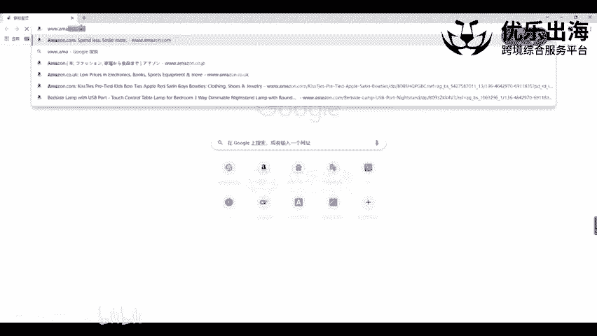

Eeven点儿com。然后打开美国站的前台，打开前台之后拉到最下面。

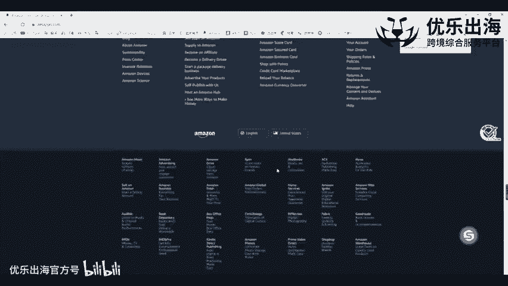

选择啊在亚马逊上销售产品这一个板块，我们点击之后跳转到我们的商家登录页面，直接点击注册，或者是点击登录都可以，都是一样的一个页面，点击注册完之后，就可以看到这里有账号密码啊。

我们只需要把这个账号密码填进去，下一步就可以了。另外我们如果说想要创建账号的话，创建一个新的亚马逊账号，也可以通过这种方式进行自注册的啊方法啊，create要 account，就是通过这种方式。

我们可以直接通呃自注册去创建我们的亚马逊账号，不走招商经理的那个途径和链接。然后这是一点哈，那么针对于一些比如说是英国站或者说日本站，可能就是日文啊，一些我们就是不是特别了解，还有一些小站点。

我们没有办法就是很好的去登录进去，那么我们可以手。

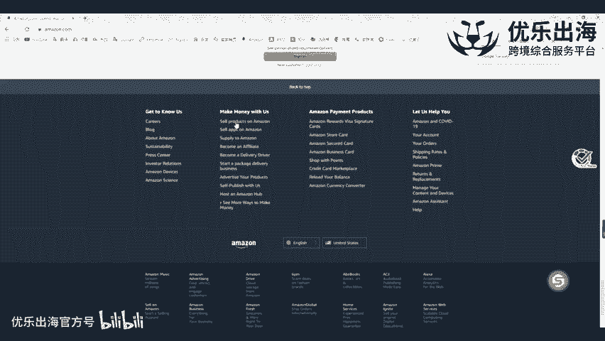

先打开亚马逊123这个网站。打开这个网站之后呢，我们可以看到。这里啊有很多的一个站点的一个前台，我可以直接通过这里打开意大利站呃和日本站或者其他的一个站点。另外这里也有一个后台的一个操作。

美国、欧洲、日本啊，这三个主要的一个站点都可以通过这个呃操作进行。另外我们需要注意的一点是，如果我们直接通过前台，比如说我们的日本站。点CO啊点GP。我们如果说直接通过前台的话，我们是进不去的啊。

因为这个日本站的话，需要翻墙才可以进入到前台。那么我们进入不到这个前台的话，我们应该如何去做呢？另外一点，我们就直接可以通过这个日本的后台点击进去啊，点击进去，可以看到哈。

这里是有一定的一个不一样的一个操作手法的。如果我们通过翻墙进入到了日本站的前台，再通过刚才的一个方法拉到最下面。

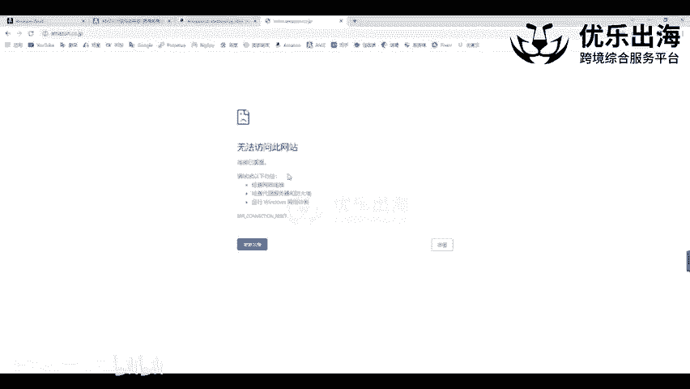

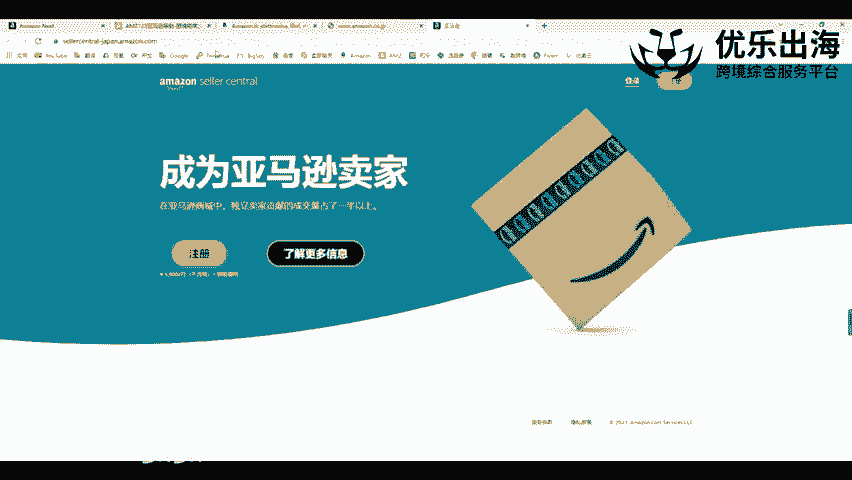

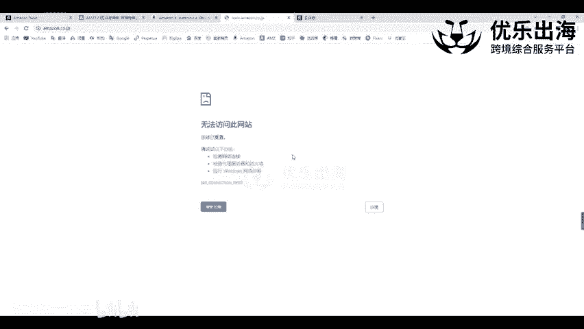

啊，拉到最下面最下面的时候，然后再点击去在亚马逊上销售我们的一个产品。但这样操作的话啊，会导致我们在登录后台的时候是一个外网的一种情况，是一个外网的一种情况。

从前台去点击这里的呃亚马逊登录后台的一个这个日本站一个操作，和我们直接通过这里日本站后台打开的一个页面是网址是不一样的啊，网址是不一样的。这里前面加入了一个s seller central啊。

还有一个杠japan。如果说后台的话，那么直接就是点GP点scent啊，就是它的一个网址是不一样的。所以说我们要么就是从。

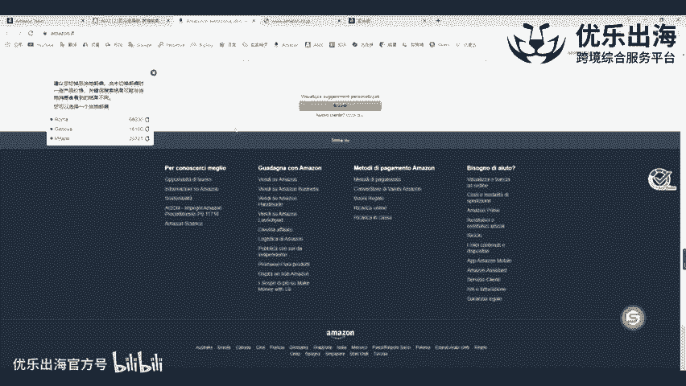

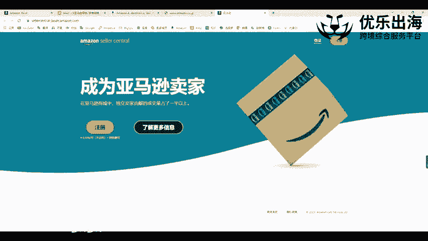

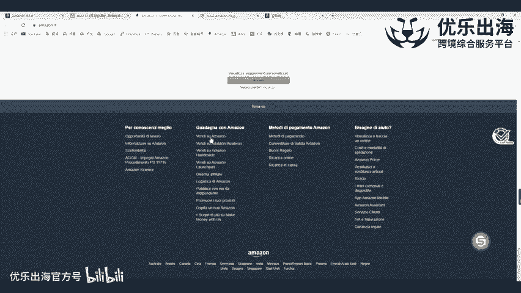

给我们下这个注册链接的那个网站。因为这个那个网站也是也是这个啊进去，或者说是直接通过亚马逊123登录我们的一个店铺后台，否则的话我们不要去通过翻墙的一种形式去登录我们的后台。这样IP会进行感染啊。

如果说真的有其他的卖家也是这样登录的话，那么我们店铺会形成关联的一种情况。这也就是为什么最近越来越多的一个卖家反映啊，越来越多的一个卖家反映他们的一个店铺和一个根本就不认识的一个店铺。

导致形成了关联的情况出现啊，这是第一种。

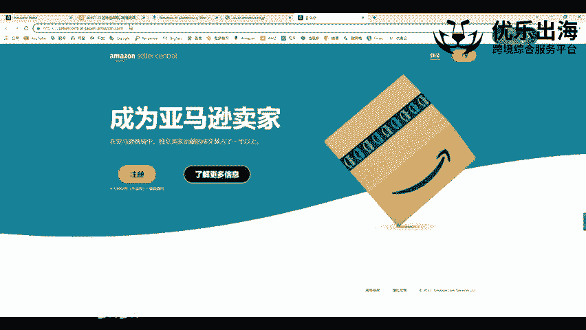

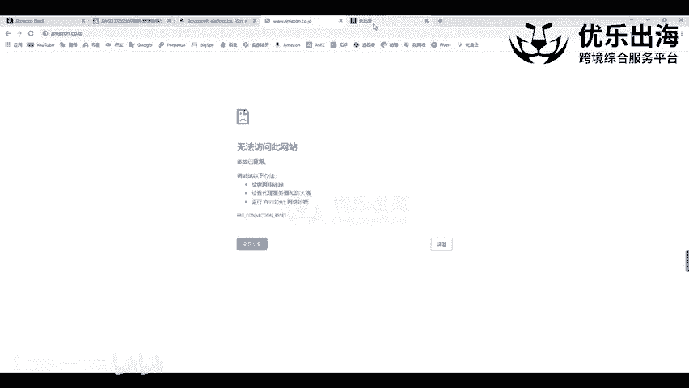

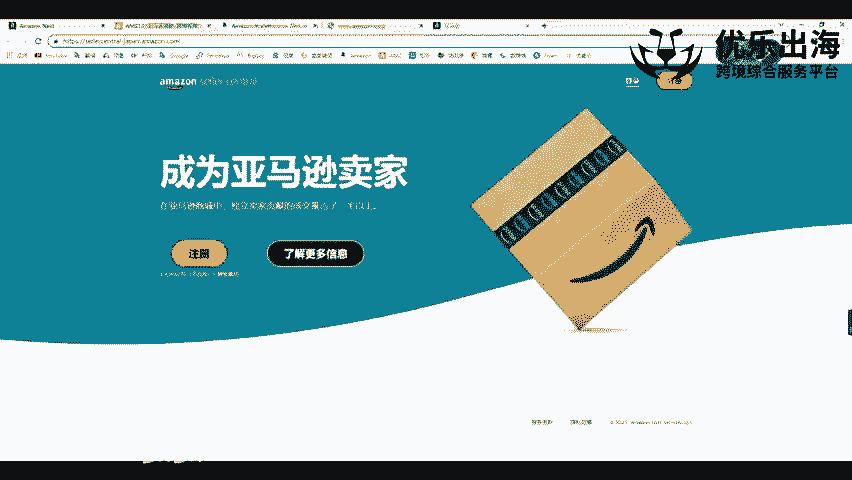

登录的一个方法。第二个呢就是我们在登录进去后台之后，我们可以点击啊账户信息啊，我们可以点击账户信息这里。进行我们个人卖家以及专业卖家的切换。可以看一下。我们可以将我们的专业卖家进行降级。

也可以把我们的个人卖家进行升级。关于专业卖家和个人卖家的一个核心的一个区别。我在就是讲第一节课，最开始的时候已经跟大家去稍微的分享一下专业卖家啊，每个月费每个月的月费是39。99美金啊。

其他的站略也差不多就是300人民币左右。然后另外一点的话呢，就是他每销售出去产品啊配送一定的一个佣金。另外一个点就是个人卖家的话，他有很多的类目没有办法销售，并且他没有这个月费。

只有这个每次销售完一个商品之后啊，会有一定的一个费用出现。但是这个费用的话，他不根据你的一个产品的一个客单价多少。你就算是卖9。99美金，他收的费用也不少也不少。

所以说如果我们能够销售每天每个月销售1单20单以上。那么还是专业卖家更划算，也可以获得更多的一个。比如说购物车啊，比如说购物车这种形式。比如说使用FBA报活动都是个人卖家没有办法去操作的一些事情啊。

我建议大家还是要以专业卖家啊来进行参考。但是如果这个店铺我们就放置在那里的话，可能要放3个月，要放半年。那么我们可以点击这里进行降级。下一下个月啊，它就会降为个人卖家，不会再扣我们的一个月费啊。

是这种情况。这是专业卖家和我们个人卖家的一个切换的方式哈。接着就是切换站点。之前的话切换站点是比较麻烦的，但是现在切换站点比较容易。大家可以看这里，我们后台的话基本上都有这样的一个呃这个路径。

那么我们再去这个路径之后，一般现在注册店铺的话，13个站点直接就全部下来。如果说是老店铺的话。如果是老店铺的话，我们也可以开case去申请合并账户啊，去申请把我们的账户多个账户进行一个合并。一般来说。

现在就是从21年初开始，就是之后注册的一个店铺的话，都是呃我们选择注册其中一个站点的话，其他的站点是直接可以呃下来的。另外一点哈，我跟大家去提提两个点。第一个点就是刚才说的，如果我们有欧洲站。

也有美国站，但是是不同的一个邮箱。但是我们这时候可以开case去联系客服看申请能否将我们的一个呃账号。去那个呃就是关联起来合并账户啊，就直接出现这种这种的一种形式。另外一点的话。

就是我们如果只做了美国站，其他的欧洲站，日本站啊都没有去做啊，而且是这是个老老老店铺嘛，所以说其他的一些站点的话，我们就没有办法去呃那个没有办法去那个有这个路径嘛啊。

所以说呢这时候跟大家可以去提醒一个点，我们可以用原始的邮箱。也就是说我们美国站用的邮箱是什么？我们用这个邮箱再次去注册一下欧洲站啊，再次去注册一下欧洲站，这个注册欧洲站的时候。

可以和我们的呃产品的一个我们店铺的这个后台的IP是可以是一致的啊，因为本来它的一个资料都是同一套的。是那个邮箱也是同一套的。那么下来之后肯定也是直接关联的一种情况。就算是我们换。

IP啊换那个那个这个手机号的话，但是我们的资料也是一样的，一样也会进行关联啊，是这种情况。🎼这是我们基础后台的三个操作方法。第一个是登录啊，第二个是个人卖家和专业卖家来回切换。

第三个是我们进行站点的一个切换操作。

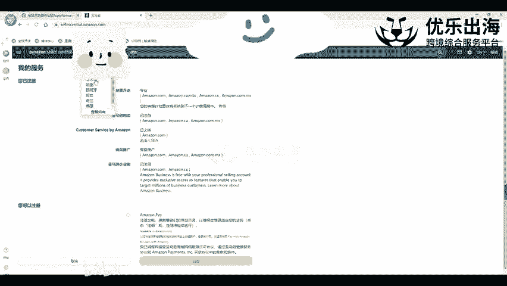