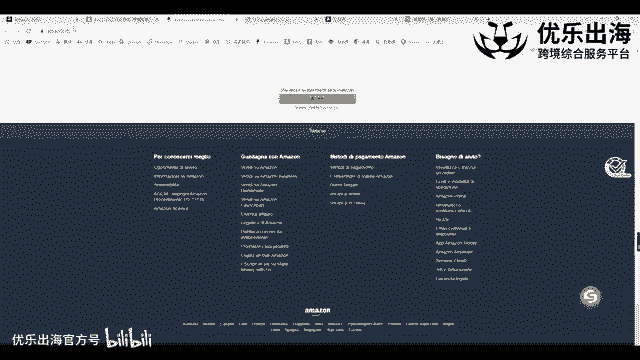
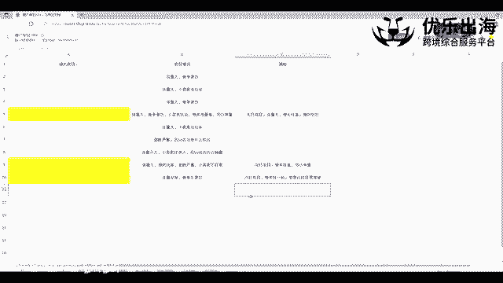
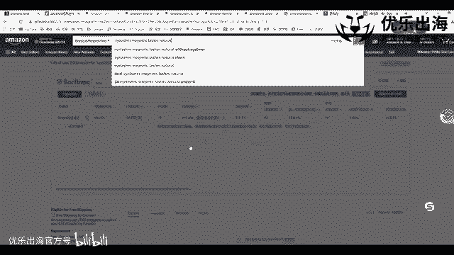
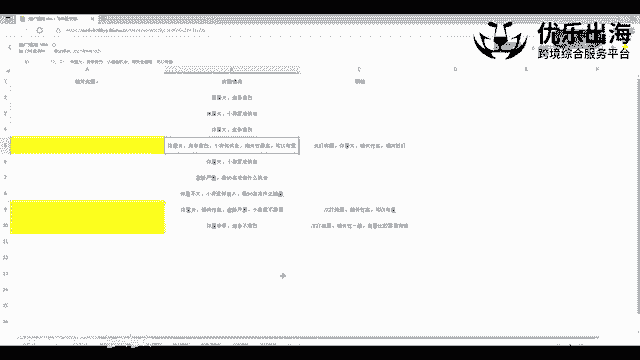

# 【2024年10月最新版】新手亚马逊跨境电商运营合集，亚马逊入门教程（纯干货，超详细） - P13：第10讲.如何选择合适类目 - 三师兄的故事 - BV13qxPesEyQ

然后第二，接着第四点的话，就是我们的一个个人卖家和专业卖家销售的类目的一个不同。我们的一个专业卖家来说，除了一些呃亚马逊自营的一个这个呃类目来说，比如说是可能是一些杀虫剂类目啊。

只能只放开给我们的一个美国美国的一个卖家，包括我们的一些就是一些就是呃亚马逊的一个叫什么一个机器人的那个那个产品，那个有一个专属的一个类目啊，都是亚马逊，就是只能是自营的一个产品出现。

但是大部分来说80%，70%的一个类目。亚马逊都是会放给我们专业的一个卖家进行销售的。我们都只要是说我们有一定的一个资质权限。我们就可以进行这个类目的一个销售。然后接着就是个人卖家，个人卖家的话。

除了刚才有讲到的我们的一个呃。就是包括佣金啊，包括我们的一个月费啊，还有一些我们的一个就是购物车的一个限制啊，类目上面也有很大的一个限制。可能就是整个亚马逊上面只有30%的一个呃类目。

是亚个人卖家可以进行销售的那个刚才我之前找了一个图片，就是个人卖家呃和专业卖家能够分别销售的一个类目的图片。但是图片并不是特别的清晰啊。我可以那个直接不如大家在后台去观察一下啊，去看一下这个情况。

然后接着呢就是如何去找寻我们正确的产品的类目啊，这个是非常重要的一个点啊，大家一定要去重点的去关注一下啊，重点去关注一下，为什么会这么说呢？因为大家能够知道我们每一个产品它的一个流量来源。

包括什么样的来源呢？站内的一个流量来源的话啊，优惠券啊，包括我们做的促销第有网站啊，他们都是有专属的一个流量的一个入口。

他们都是有专属的一个流量的入口。比如说就是badside，baside是类流量，也就是我们主要讲的一个流量哈，有一个today deals。讲的就是我们这里说的呃一个刚才说的一个就是优惠券的一个流量。

包括d的。我们报了活动之后，专属的一个流量的一个入口啊，专属的一个流量入口，包括广告流量的话，这些大家都比较熟悉了哈啊。

我在这里主要讲的是类目里面它是有专门的一个流量的这个就是出现就是我们知道这个呃评判这个。这个这个我想想哈。就是我们能够知道有专属类目流量的一个原因，就是我们把我们的这个产品放置到不同的类目之后。

它所带来的自然流量的一个变化是非常大的。可能是我们那个产品啊是键宝，我们的是allashes。原lash是。然后我们把这个产品放到正确的这个类目allashes这个类目里面之后。

我们可以发现就是我们的一个类，我们的可能自然流量是10%。我们的一个自然的一个流量可能是占到10%，或者说占每天有1单。但是我们把这个睫毛放到了哪一个类目呢？就是我们可以看到哈。

就是我们打开通过这一点去打开，找到了我们的类目，然后放到了。睫毛胶水里面去啊，放到了睫毛胶水里面去，就是这个这个主要是胶水啊，可以看到这个是睫毛这个类目，这个是睫毛胶水的一个类目。那么类目肯定不一样啊。

但是有一点是什么样的？就是它有一定的一个相关性，但并不是最相关的一个类目，我再去做我们产品的一个。推广计划的时候，我第一个重点的一个目标就是选择我们产品的一个正确的类目。

但是这个正确类目的一个呃筛选是比较困难的。尤其是针对于一些做呃一些那个就是跨类目，就是这一个产品适用于多个类目的这种情况的话，那么会更加的去艰难的去选择。我跟大家去展示一下哈。

可以看一下我们这个表格哈啊类目的一个情况表格。然后在我做的这个产品的一个规划里面啊，在我做这个产品的规划里面，我的这个产品适用于。这9个类目啊，放到这9个类目里面都没有什么太大的一个问题啊。

都有一定的一个相关性。但是我从这类这些类目里面，我应该如何去选择哪一个类目是我先去放的一个类目。因为说实话，我的类目比较多的话，我后期可以去就是有一定的一个销量之后，我可以去加类目的。

我可以再去加其他的类目。最多的话我可以加2到3个类目啊，那么这时候的话我就第一个刚开始去操作的时候，这个是比较呃比较那个需要慎重选择的一个点。可以看一下哈，就是我第一个选择了这个市场体量比较大。

竞争激烈小卖家，但是小卖家呢也有一定的机会，相关度是跟我的产品是最高的。我们可以考虑一下。然后接着就是次打类目，体量大，相关性高，但是它的垄断比较严重，就是我变成了我的一个次打的一个类目。

在打了这个类目之后，可能有一定的销量排名之后。过再去尝试通过一些手段的一些。操作手段，然后把这些其他类目添加进去啊，添加进去，增加我的一个类目的流量入口，增加我的类目的流量入口。所以我们在。

找这个产品的时候，我们一定要去找到我们正确的一个类目到底是什么。找到我们正确类目的一个标准是什么怎么去找呢？首先是第一点。我们去搜索我们产品的核心关键词啊，我们去搜索我们产品的核心关键词。

但是不要说是搜我们的一个宽泛词，我们的类目大词哈不要是这样哈，就我们找到我们核心的一个关键词。比如说这个睫毛里面它有带胶水的睫毛，也有带呃眼线液的一个睫毛，那么我们就选择带眼线液的一个睫毛。

因为我们做的就是这个产品，对不对？那么出来的这个结果全部都是跟我们的一个产品是高度相关的。那么这时候的话我们再点击进去查看它们的类目链接是怎么样的。因为这个是工具嘛，我们正常的查看链接的一个类路径。

就是进入到它的一个产品的主页啊，主页之后呢，可以在这里be rank啊，这里有一个ra值可以看到这个产品所在的一级大类目是什么，以及最终的小类目是什么，我们可以通过这。

再去进一步的进入到我们这个类目类目里面的一个细分的形式。细分的一个形式，但是可以注意到一点哈，我们可以看一下这一个产品的话，它是放到了高一级的一个类目，它没有放到最终的类目，可以看到吗？

也就是说它放到了就是整个睫毛带盒胶水这个类目，它下面分为三个类目，一个是睫毛胶水，一个是睫毛，一个是睫毛套装啊，一个睫毛套装。所以说它是故意，它有可能是故意的。

就是放到一个相对来说高一层级的一个大类目之后，为什么这样放呢？因为它的一个流量更大。但是相对应的它的一个呃转化率就包括流量的一个来源可能会更加的一个驳杂一些啊，可能会更加的一个驳杂一些。

之后它应该是配合一些包括一些测评手段啊，包括一些其他的一些手段啊，包括一些站外的一些手段去呃去搭配的一个操作的一个手法。这里的话我们就先直接跳过哈，因为说实话这个它的这种操作手法我听说过。

但是我没有实际进行操作过啊，没有实际进行操作过，就是专门放到我们大一级的类目里面，然后去蹭这个大级类目的一个流量，配合我们的一个大规模的一个测评，包括站外的一个放量形式，快速的把这个量推起来。

因为刚才有跟大家去讲到过，就是我们这个一个类目对应一定的流量啊，一个类目对应一个一定的一个流量，这个是毋庸置疑的。为什么呢？就是很很多的一些。亚马逊买家他们也会啊去通过什么样的一种形式嘛？

先去打开这个类目beauty啊，选完beauty类目之后，我们再去选择我们的一个产品的一个呃就是关键词，然后再去进一步的进行筛选啊，有很多的一个卖家会这样操作。另外一点。

很多的卖家也会去直接通过这一点进入到我们整个的一个呃baest seller榜单里面去进行产品的一个查看。这些都是比较重要的一个流量入口。所以说我们如果说能够把我们的产品放到更高一级的类目的话。

可能就是我们的来的流量会更多一些嘛，对不对？这是一点。那么我们还是回到刚才的一个话题哈，就是找我们的核心类目，可以看到刚才是上级的类目，我们就直接pass掉。

我们可以根据这个方法再去找其他的适合我们的一个产品。

再去找其他的是跟我们产品是一模一样的这些竞品。然后。点击他们的一个网页进入到啊进入到一个这个最终的链接里面去，进入到最终的链接里面去。可以看一下这个产品所放的这个类目就就是最末集的类目。

而且整个类目里面可能也都是跟我们产品高度相关的产品。那么我们就可以初步确定出来false alashes就是跟我们的产品高度相关的一个类目啊，高度相关的类目，这就是找寻我们正确类目的一个方法。

另外再给大家去做一下延伸的一个。延伸的一个点哈就是我们。可以看到有一些卖家他们所放置的类目是怎么样的，就是故意放到呃一些比较呃这个跟我们相关的，而且市场体量小的一个类目里面啊。

市场体量小的一个类目里面可以看一下，就是这里面基本上都是市场体量比较大，竞争比较激烈的。就比如说这个呃第一个类目，市场体量比较小，垄断比较严重，或者说是那个市场体量比较小。

但是没有什么那个没有什么人去做。那么这样的一个类目的话，我们也可以进行去做啊，一个这个原因到底是什么原因嘛？就是我跟大家去分享一下哈，很多的一些卖家就是他可能在有一定的呃销量之后。

它有一定的一个销量之后，它会去增加这种呃增加这种体量小，但是竞争也相对来说较小的这样的一个类目啊，然后去拓展它的一个流量入口。另外一点就是他可能会直接更换类目啊，他可能会直接更换类目。

比如说他本来是在市场体量比较大的类目里面去进行竞争的，但是呢竞争非常的激烈，CPC非常高啊，每天可能就是虽然说出十单，但是它会就是每天亏损100啊，每天都会亏损100块钱。

那么它可以直接更换它自己的产品类目。如果说产品类目是相关性的，那么可以直接进行更换啊，后台开case直接进行更换一个工作日就可以把我们的类目变更成我们想要的一个类目，变更成这个类目之后呢，竞争不激烈。

虽然说市场体量不大，但是竞争不激烈。我们在市场体量这个大的类目里面，我们积攒了很多的一个评价，积攒完评价之后，我们放到小类目，我们就直接形成了垄断。

我们可以在最短的时间内垄断这个类目的一个销量的这个数据情况啊，可以在最短的时间内垄断这个类目的一个销量的一个情况。虽然说整体的市场体量没有这个市场体量大，但是我们把这个类目里面90%。

80%的一个呃销量全部都垄断了。那么可能跟我们这个类目里面的销量也差不多，并且还还有可能是有利润的一种情况啊，这也就是算。但是一种降尾的一种打击啊，降维的一种打击。我们从大类目带着我们的一个评价。

还有带着我们产品的一个权重到小类目来进行小类目的一个市场的垄断。这是关于我们的一个类目的一个垄断情况哈这一点。然后接着我们再去讲解一下我们接下来的一个啊点。

