# 【2024年10月最新版】新手亚马逊跨境电商运营合集，亚马逊入门教程（纯干货，超详细） - P14：第11讲.后台创建商品步骤 - 小恐龙游江南 - BV1cfs8eGEKy

更多的一个库存页面隐藏的一个属性。我先直接就是呃后台直接先去创建我们整个的一个商品啊，包括我们商品信息都有哪些必填项啊，我们还是先回到我们的一个中文。回到我们那一个中文。回到中文之后。

我们首先选择啊GTI。因为这个我已经是啊没有，我还是选择UPC吧。我们的商品名称嗯，可能就是。品牌名加上我们的一个产品的一个名字。品牌的话呃，我在这里直接我们就勾选，没有品牌。

或者说是去选择填写NC嗯NA或者说是NP这样的一个呃这样的一种情况。然后接着制造商。这里跟大家去分享一个小技巧哈，就是如果我们这个产品还没有呃，还没有这个品牌注册的话。

但是我们有考虑去进行这个品牌的一个注册，或者说我们回执还没有下来的这种情况，我们先去呃做这个产品的一个。上传嘛，对不对？那么我们可以直接提前在这里写上我们要注册的一个产品的名字啊。

我们可以在这里提前写上注册我们这个商标的一个名称是什么样的。并且这个商标一定要是已经联系服务商，让他们帮助我们去核名，核实这个名字确实是没有人在用。我们的意我们要注册的话是有一定的一个成功率的情况下。

我们可以这样去写制造商这里写完我们的一个品牌名之后，我们到时候真正的品牌注册下来之后，我们进行了品牌备案，到时候再把这里的通用品牌，或者说是NA品牌，或者说是NC品牌，改成我们就是下证书的这个品牌的话。

会相对来说比较容易一些。比你去写1个NA，然后后面的话我们再改成我们的一个就是实际操作的品牌的话要方便太多了。因为这个修改品牌这个问题的话，在两年之前我们可以联系客服随便改啊，我们可以联系客服呃。

就是我们自己可以随便改。两年之前我们自己可以随便的去更改。那时候的话我就是通过这种方法，我制造商直接要写写成我要去做的产品的，就是商标的一个名字。然后品牌我写NA。然后后面的话我品牌备案下来之后。

直接在这里选择写更换成我们商标的名字，选择保存并完成，直接就能更改。那么这是两年前的一个情况。一年的前的情况的话，是需要联系客服改。给客服发一下我们产品的一个使用证据啊，然后去把这个品牌名更改过来的话。

是也是比较方便的，不会说是呃出现太多的一个问题。然后但是现在的话，就算是我们联系客服，我们提交了商品的一个使用证据，并且我们制造商这里写的也是我们的一个品牌名，但是我们实际更改的过程中是非常麻烦的。

当时我是开了十几个case，开了十几个case。然后在提附附带上提交我的一个。上传那个表格以及我的使用证据。最终侥幸过了一个啊最终侥幸过了一个。接下来我们接着去讲啊，就是呃商品是否有保质期。

我们这里就直接选择否，然后按照实际情况进行填写哈。商品的数量，也就是我们这个包装的一个数量有多少个啊，我一般我都是直接填一就可以了。然后批次数目以及批次类型，这里主要讲的是我们的一个重量啊。

或者说是类型，我们这里直接就选择重量gramgram的话一盒就是50克。大家可以根据自己的一个情况啊，去进行一个填写，是否具有热敏性。我们可以看一下，就是不相关的一个属性，可以直接pass掉啊。

因为说实话，这个热敏性，我做这个产品我都不知道是什么意思啊，就直接选择no就可以了。然后呢，接着就是是否有变体啊，是否有变体，我们先直接跳过行，我们先把这两个做完之后，我们再回到这个是否有变体上面来啊。

然后接着就是报价，报价的话，我们可以填一个10美金数量的话，可以填10个产品的一个数量。然后在这里配送渠道啊，就卖家SQ嘛。卖家SQ的话，我们可以这里去写一下，就是。啊，睫毛这个产品啊睫毛。先这个产品。

然后这个产品之后呢，然后下面有一个配送渠道，配送渠道里面的话就是要么就是卖家自配送这个产品和亚马逊配送这个产品。我建议大家的话可以跟我就是这个习惯一样，我们先去选择啊。

我们先去选择卖家进行自配送的这种情况。后面的话，我们在手动操作变成亚马逊配送。当然如果说大家想要直接切换成亚马逊配送的话，也可以也没有什么太大的问题。只不过我个人操作习惯的一个问题而已。接着就是图片啊。

图片的话，我们基本上就是9张图片，9张图片进行上传完成。这里要需要注意的一点就是哈就是我们可能会啊有一些变体。如果说有变体或者说是有一个colour name情况出现的话。

那么这时候我们在除了上传完前面的呃8张图片之后，我们需要在最后图片去提交我们产品的一个就是主图吧。算是我们可以看一下哈。就是这个是什么样的一个意思，看一下这有没有变体，这个产品没有变体。再过一下。啊。

像这种啊，可以看一下哈。就是大家可以看到，在style，包括color啊，这里我们会看到这里的一个产品上面前面是有一定的一个主图的，对不对？这里会有一个小图去展示我们的一个产品的一个信息。

那么如果我们在后台呃后台这里图片最后一个变体的最后一个我们不去上传的话，默认将我们的主图放成我们的一个啊最最这个这个style图片里面啊，放到我们的style图片里面。如果我们最后填上去的话。

那么就是这里就是填我们就是实际上传的一个产品的一个图片。我们为什么就是单要单独说这样操作呢，可以看一下就是。一旦我们这个产品的一个主图不是统一的格式的话，比如说有这种格式，也有这种格式啊。

有这种这两种格式都有。那么我们再去上传的时候，就会显得乱七八糟的情况啊，就会出现乱七八糟情况。那么我们可以啊单通过单独的上传我们统一格式的图片，来让我们的这个变体去变得更加的一个美观啊。

让我们的一个变体变得更加的一个美观起来。然后接着我们再去呃讲解一下关于这个后台，我们看一下重要信息有一个报错啊，UPC的一个问题，我们我没有去填写UPC啊，这里的话我去看一下，找1个UPC码。

然后填上去。让我们看一下哈。

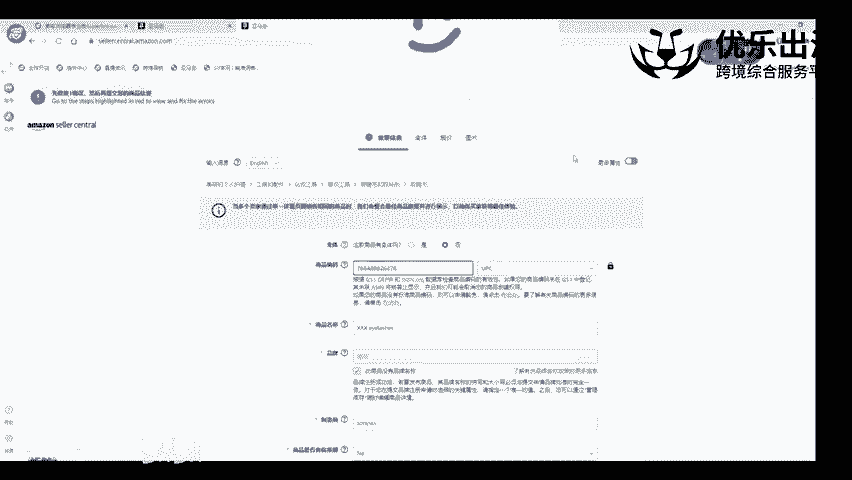

好。哦，这里进行了一个报错，稍等，我看一下怎么回事。

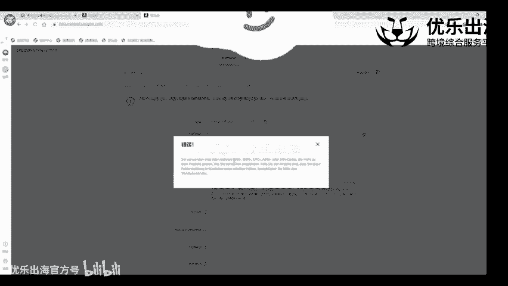

使我们使用的UPC与尝试提供的产品不匹配。在这里我跟大家去说一下哈，就是在这里去填写的时候啊，如果说进行了这种报错的一个提示，并不是我们UPC码的一个问题，并不是我们UPC码的一个问题。

而是我们在填写品牌的过程中的一个问题，能够理解吗？也就是说我们填写品牌的一个过程中，品牌名出错了。因为大家可以看到哈，这里我们不是选择的一个通用嘛，对不对？但是选择通用之后。

也是依然会形成报错的这种形式。可以看一下，我把这个品牌不写通用去写成NC。

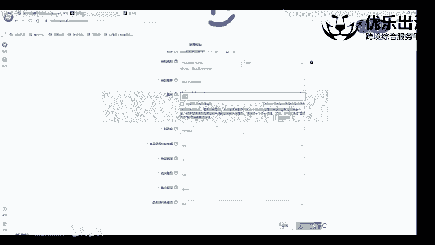

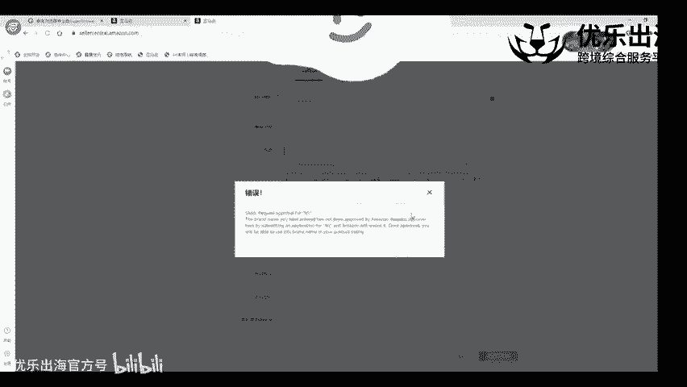

稍等哈。

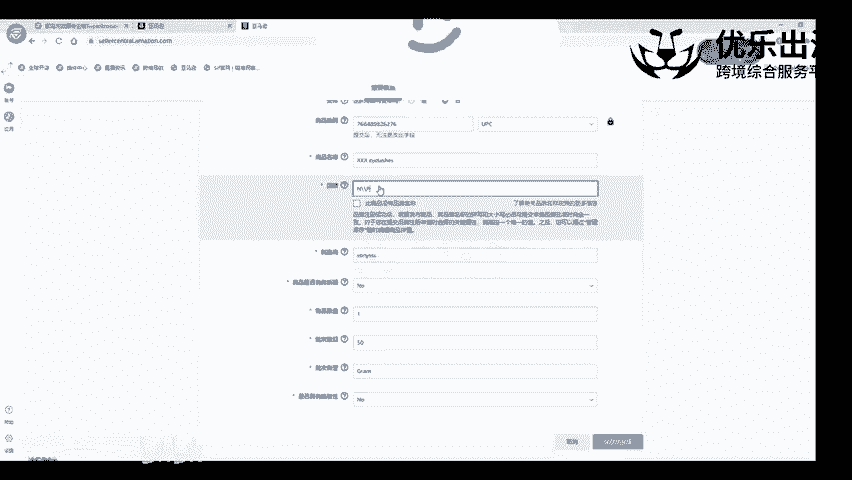

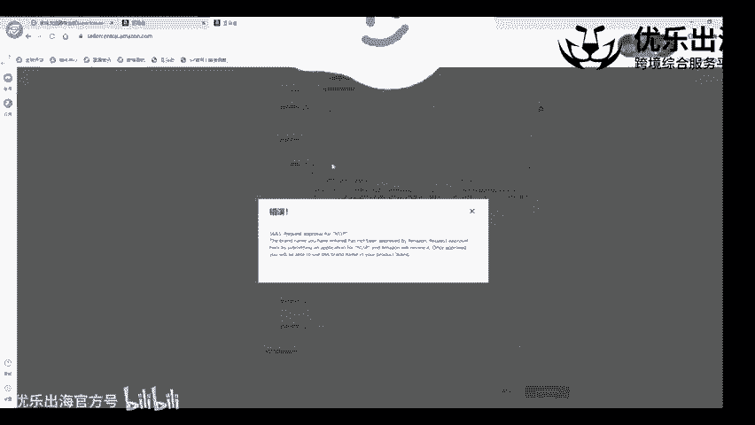

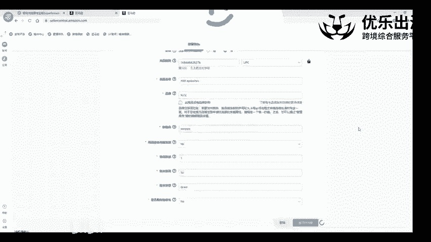

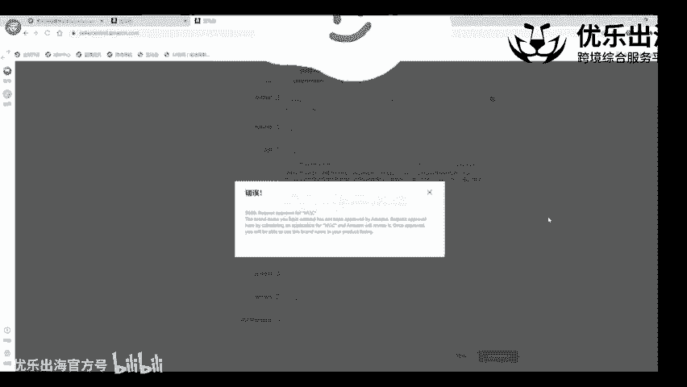

好，可以看到哈填写了NP这个品牌之后，我们就可以正常的进行保存了啊，正就可以正常的进行我们产品的一个上传。我们直接点击保存并完成。所以说这个NP也不是我这个店铺注册的一个品牌啊。

但是刚才那个报错提示的是UPC码的那个问题。我在这里直接就改成NP的话，就直接把这个报错取消掉了啊，直接就把这个报错取消掉了。我们点击保存并完成。点击保存并完成。

这个产品我们可以说就算是可能是上传成功啊，可能就算上传成功，我们再重新回到关于添加商品这一联啊，这一栏哈。在这里再带大家去演示一下我们刚才后台的一个变题的操作手法啊，应该如何去操作？这个。好，我们这里。

打开最下面切换成中文。切完成中文之后，我们点击是这个产品是有变体的形式的。然后变体里面我们是什么样的一个变体呢？可能是设计款式的一个问题啊，或者说是颜色的一个问题啊，颜色的话跟尺寸是有一定的一个搭配的。

我们这里的话可以看前台我们的一个竞争对手，他再去做变体的时候啊，他再去做变体的时候，是选择的颜色尺寸还是选择的一个风格还是选择的一些其他的一种形式。我们选择完颜色尺寸之后，我们再变体这里啊尺寸里面的话。

我们可以选择叉L。添加。啊，最好是大写。Chd。或者是叉叉L。就添加颜色的话就black。然后接着是graey。添加进去之后呢，我们就可以看到这里就形形成了一个单独的一个子体哈。这个这里单独子体的话。

包括色表，它是哪一个色表？这个色表的话并不是必填项啊，并不是必填项，最好是跟前面的我们的颜色是一致的。然后接着是卖家的SQ卖家SQ的话，这是针对于单个子体的SQ我们就可以写成allash。

然后杠black。Black。然后再杠叉L啊再杠叉L。把我们的产品的详细信息去写进去。那么前面重要信息以及这个商品报价里面啊，商品报价我们的附体的这个SQ里面，我们的附体的SQ里面我们找一下哈。

附体的SQ里面的话，我们就需要写成lashes或者是lashes一啊lashes类型一，然后其他的子体的SQ的话，我们再写成更加详细的一个辩体。不然的话，如果说我们变体多的话。

那么针对于我们产品的一个表现情况的话是非常不好的。非常不不是特别容易分辨的。那么接着是商品的一个编码，我们再去刚才选择UPC啊，UPC的话，前面去选择填写UBC的一个编号啊，填写UPC一个编号。

刚才我们买的一个编号嘛。然后商品状况都是新的。我们的一个这个单独子体的一个报价是怎么样以及数量数量是怎么样的一个情况啊，都可以去。去填写出来。填写出来之后呢。我们可以看一下，下面没有再下拉的一种形式。

如果我们这个产品的一个就是变体更多的话，或者是属性更多的话，我们还是需要往右边去拉一下啊，往右边去拉一下，看一下这个产品。看一下这个产品，它可能是有更多的一个数据出来的。

然后我们需要把这些数据填全面才可以。这这一点哈啊我们的一个变体操作情况可以通过这里重要信息有变体，然后在这里输入变体的一个变体属性，再加上变体的挨个的一个数据进行操作，就可以上传成功啊。

把我们的这个产品就可以上传成功。那么这是关于我们的一个后台直接上传变体的一个操作手法啊，直接上传我们变体的操作手法产品的各个信息。然后接着呢我们去上传成功，或者说是上传失败的情况下，我们选择中文。

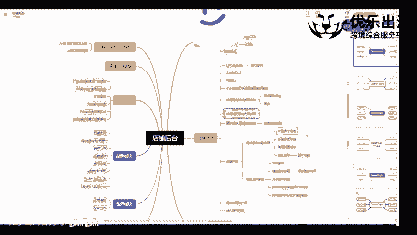

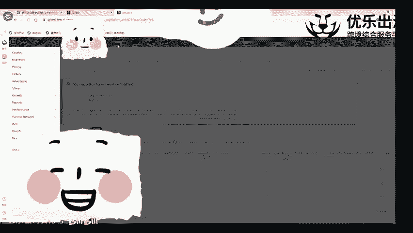

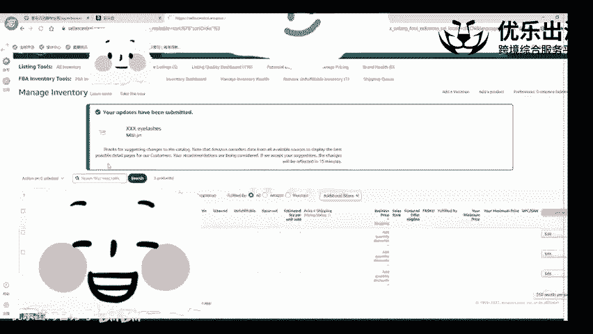

上传失败情况下，我们在目录里面它会有一个补全草稿啊，补全草稿。也就是说是什么意思呢？就是我们这个上传的产品，如果出现了一些图片，没有去发布啊，或者说是一些产品的属性没有去发布，就这里就会有一个编辑草稿。

需要让我们把这个草稿补全完之后，我们才可以继续去发布这个产品，才可以继续成功的发布这个产品，目前大家可以看一下，这里哈刚才创建的这个商品链接是属于不可收的一个状态啊，不可收的状态。

不可受的一个原因禁止显示原因是显示搜索结果，我们点击进去之后，可以看到具体的一个报错。首先第一个长描述是必填项啊，常描都是必填项，把这个长描述填进去点击保存之后啊，然后下下面它可能会再一次的报错。

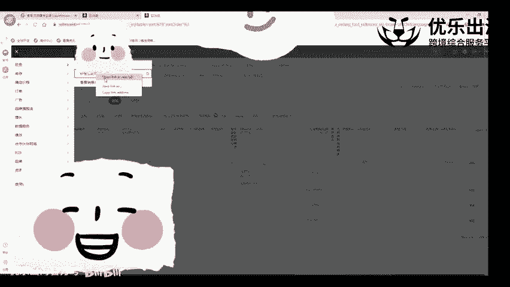

报错的一个内容就是我们的一个产品的一个图片问题。然后再让我们上传图片，基本上把这一个点去弄完之后，那么我们这个产品可以正常的去进行上架的一个操作啊，都会在这里收修复商品这里进行一个出现。这是这一点哈。

然后商品质量信息商品质量信息板块应该这样去说。我们可以看一下商品信息控制面板，商品信息控制面板打开面板之后，它这里有我们产品的一个具体的数据，以及我们的产品的一个修改的建议补足的一个建议。

也就是说针对于这个产品来说哈，针对于这一款产品来说啊，180天内有呃最近30天内有180个浏览量，但是库存可售为0啊，那么建议的话就是我我们这里有一个1项改进的一个建议。

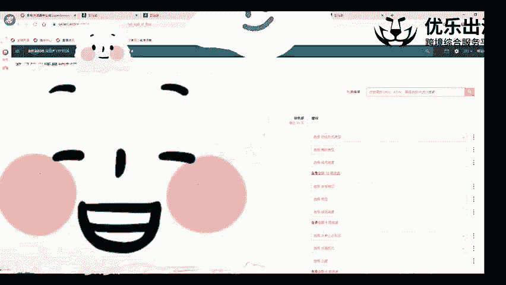

可以看到我们那一个不含式一个价目表，包括地毯的这个因为我们卖的是毯子嘛，这个地毯的一个类型是什么类型的？编织是怎么办？编织的绒毛高度是是怎么样的？保养说明啊，抛光形式都是怎么样的一种形式。

我们把这些数据全部都补全完之后，我们把这些数据全部都补全完之后，那么我们这个产品。

会有更大的一个曝光量啊会有更大的一个曝光量。也就是也就是这个意思哈。也就是说我们如果说能够有这些信息补全的话，一定要把这些信息补全，可以更快的啊就是增加亚马逊推广我们产品曝光量的一种形式啊。

这是一个比较细节的一个点哈，跟大家去表明一下。

🎼接着就是静止显示啊，禁止显示我们看一下，我们回到这里刷新一下，看一下它是否是奥在售啊，已经出现在售的一种形式，但是没有传图片啊，没有传图片，我们打开前台。那还什么都没有的一种形式。

但是确实提示在售了啊，确实提示在售了。啊，我建议大家的话就是一般来说就可能会显提示禁止显示嘛。禁止显示的话主要就是图片的一个问题。它因为禁止显示之后，我们点击进去也会跑到修复商品这个板块。

修复商品这个板块。然后在这里去提交我们产品的一个图片啊，上传我们产品的图片，图片上传完成之后，我们的一个A加可能是那个包括无端描述标题都上传完之后，这个产品才算是正式的上传成功啊，正式的上传成功。

这个是后台直接操作上传我们产品的这个方法啊，这是这个方法哈。

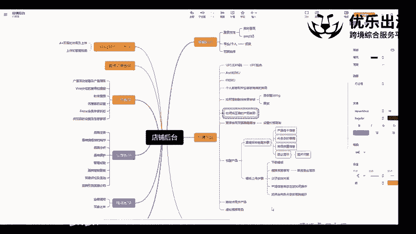