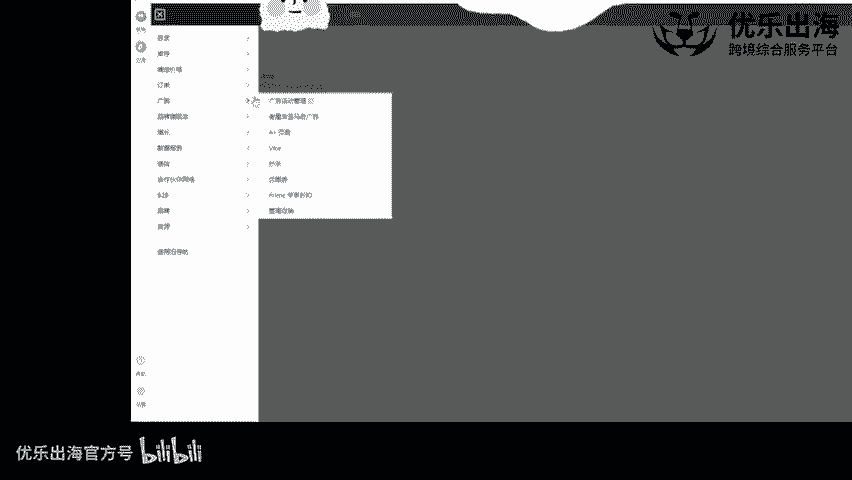

# 【2024年10月最新版】新手亚马逊跨境电商运营合集，亚马逊入门教程（纯干货，超详细） - P17：第14讲.listingA+板块上传与管理 - 小恐龙游江南 - BV1cfs8eGEKy

然后接着就是其他的listing的一个板块，我在这里跟大家去讲解一下。

然，首先是我们接着下来去看一下A加的一个板块。在这里需要跟大家去那个特别说的一点，就是如果我们做的是日本站的话，如果我们做的是日本站，那么我们这个日本站不需要品牌备案，我们就可以做A加这个呃事情啊。

我们就可以去做A加。如果我们是在美国站和欧洲站的话，我们就需要有品牌备案之后才可以去做A加板块啊，这也是算是那个亚马逊呃，日本站对我们的一个扶持吧。啊，算是对我们的一个卖家的一个新手门家的一个扶持。

那么在这里的话。

可以我们点击创建A加页面，可以看到有两个呃形式，第一个是品牌故事啊，品牌故事，第二个是增强性描述。首先我先给大家去。看一下这个品牌故事板块，它主要是展示形式是怎么样的。

我们现在找。找几个链接看能不能发现。品牌板块的一个。外加哈这个屏这个A加的话也叫做图文描述。图文描述。这个不属于品牌板块，放我们的man非ature。

Descript。去找几个大品牌，我们看一下。啊，在这里。🎼from the brand啊，大家可以看到哈，就是上面可以带上我们的一个背景，背景可以是模特或者说是我们的一个产品。

然后再带上我们的一个品牌的故事啊，再带上我们品牌的一个故事。然后呢，接着是我们产品的一个展示啊，使用效果的一个展示。场景图的一个展示，以及啊就是我们的一个品牌怎么怎么样，就是为什么我们那个品牌比较好。

然后我们可以提供什么样的一些东西，就可以通过这个板块来增加客户对于我们产品的就是整体的一个观感那算是我们可以看一下，就是我们的产品页面，整个页面里面先有一个品牌的一个大图，展示我们品牌的一个细节。

再有通过A加板块，图文描述板块去展示我们产品的进一步的一个信息。那么这时候的话对于我们品牌的一个打造，以及我们产品的一个推广，增加我们的一个转化率是非常有效的一个一个手段啊，操作手段。

我们可以在这里创建品牌故事。这里添加背景图片，就是刚就是这一个啊背景图片。然后我们可以在这里。

再去添加模块啊，添加模块一共有4个模块。四个模块的话呢，第一个模块about us就是我们的这个啊我们的这个基本上就是我们这个看一下。

呃，差不多。嗯，不是这个哈，看一下。🎼后台。图片文本啊，对，差不多。这个应该就是我们后台的这个板块。然后接着是四个图片的一个板块，接着是4个图片的板块，接着是一张图片的一个板块啊。

一张图片的一个板块这种啊一张图片网，它这个文字没有使用，然后最后是啊就是关于品牌的一个板块啊，并品牌的一个品牌卡的一个问题的一个板块啊，这种情况这个我们可以挨个去添加添加上来之后。

我们去输入我们产品比如说啊，然后。

A加。品牌板块。一家平板板块方便这里的商品描述是方便我们去认识这个呃这个创建的。模板到底是什么？让我们推出退出之后，我们主要去讲解增强性的商品描述。因为我们很多的一个卖家去做的话。

并不是以我们的品牌为目的的，对不对？并不是以品牌为目的。那么这时候的话我们可以就是用到的更多的是我们的基础的一个板块啊，是我们基础的一个板块。那么这个基础板块的话，我们可以第一个我们可以看一下。

有很多的一个板块的一个逻辑，我们可以去添加我们的一个logo啊和我们可以去添加我们的一个产品的一个三个图片啊。

就这种，然后插入我们的一个图片以及文字之后，插入我们的图片以及文字之后，我们可以进一步的去得到啊，就是我们想要的一个效果啊，想要的一个效果。然后呢，我在这里先给大家去做一下演示吧。

看一下这张图。

然后这里大家可以看一下，注意一下，就是有一个图片关键词啊，图片关键词。也就是说为什么就是大家经常说的A加里面也可以埋词。A加里面可以埋词。但是它的这个字符的话，只有100个字符，只有100个字符。

我们先去随便写一下添加上这个图片之后啊，我们添加上这个图片之后，我们还可以去进一步的编辑这个图片啊，上传的时候呢，我们可以在呃就是图片里面有一个tagt里面的话，我们也可以进行埋词，也可以进行埋词。

至于能否被检索到。说实话没有没有被认证哈，没有被认证。然后接着呢就是。

我们先添加这个板块哈，我们先添加这个图片的一个板块。添加图片板块啊，在这里添加图片板块的时候，有一个产产品的详情，就是在这里tex。然后我们可以一。23就把我们的关键词去。贴入到这里面。

但是这里面的关键词是否能够真的被抓取到，还是一个未知数。但是我们能够呃就是尽可能所有的埋词的地方我们都埋上词啊，我们把所有埋词的地方都埋上词，然后我们选择添加啊，添加这个产品，然后这里选择就是测试。啊。

就是爱戴史。这个产品，然后就是A加一。或者说是A加蓝色A加，或者说是那个呃15英寸A加就是怎么样的。只要是我们能够看到就可以。然后这里有一个预览啊，我们可以直接在这里去进行这个A加的预览。

A加的一个预览。哦，预览预览出来了，预览成功了。然后我们点击下一步应用AC在这里去搜索我们的A啊，在这里去搜索我们的A啊，B开头的。我们去搜索aen之后，然后我们点击确定，然后在这里选择应用啊。

应用asen应用asen之后，我们点击下一步查看并提交，然后再次提交我们的产品的呃一个呃A加就可以了。这就是我们创建A加以及提交A加的一个全流程啊。创建A加以及提交A加的全部流程。

然后至于A加的具体的一个布局的话。我会在接下来listing的一个板块。跟大家去分享一下就是什么样的一个呃产品的一个情况，算是比较好的呃形式，算是一种比较好的一种形式哈。

