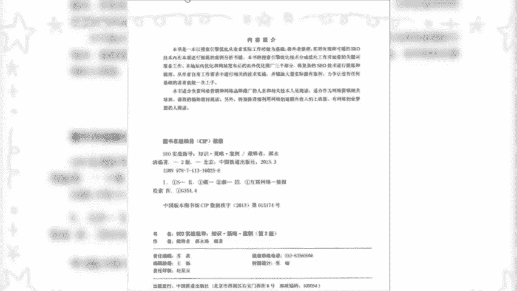

# 【2024年10月最新版】新手亚马逊跨境电商运营合集，亚马逊入门教程（纯干货，超详细） - P1：亚马逊开店 - 小恐龙游江南 - BV1cfs8eGEKy

🎼做跨境电商离不开互联网思维，通过书籍来学习运营产品，流量这些思维模式，从构思到落地反馈总结反思。从大佬们的心路历程中可以学到很多东西。为了方便大家学习。

我们直接挑选出值得跨境电商人入门学习的书籍共识本。你只需挤出一点时间就能真正走入电商的大门。一、营销新手入门指南。

这是一本并不出名的入门书籍包括了对营销职业的认识营销基本技能、客户服务理念和技能、营销财务知识和财务风险控制四个部分，虽然讲的很浅显，但这也是它的优势所在，浅显易读，有助于培养你对营销的兴趣。

2、跨境电商营销、阿里巴巴售卖通宝典该书汇集了始于位售卖通大学讲师的干货内分享内容营销理论全球主要国家电商市场概况，做卖通店铺运营策略营销活动，流量语入和使用无线端营销行业板块营销为主。

写的也通俗易懂一读3消费者行为与营销战略，该书的亮点在于从营究消费者行为入。😊。

🎼以管理角度洞悉消费者行为，解决了如何运用营销组合因素影响消费者行为。如何对不同类型的顾客进行产品价值塑造，如何运用消费者行为许制定营销战略等问题。4网络营销实战并码。

此书为系统总结助网络营销使用策略和技巧，介绍了市场与产品研究，讨论了以网络营销为导向的网站设计提高转化率，以及怎样给网站带来流量。数据化营销。

从流量转化率和客单价以及数据团队搭建四个方面讲解网店数据化营销的基础知识，其间穿插使用的案例。虽说是以淘宝为平台，但是对学习电商数据思维有一定帮助。

网店美工主要内容为美工基础及流量转化的图片处理的方法论指导，可以归为内容营销的一块非常基础的一本书。搜索引擎营销网站流量大提速该书获得了搜索引擎营销圈内多位大佬的认可教材班的经典书籍，从基础入手。

逐步引导同者建立有效的营销计划预计商业价值向各位主管推销建立团队。

🎼策略实质标准评测以及执行等8SO实战指导知识策略案例是一本以搜索引擎优化从业者实际工作经验为基础，将外表繁琐，实则有规律可循的SO技术内在本质进行提炼的案例分析收集，并辅助大量实际操作案例。

力争认没有任何基础的读者也能一次上手。各个外包营销网上成功之道，以跨境电商从业者来说，针对性更强，但理论部分过多了，观点的提炼也不够挑有用的技巧学习吧。

1跨境电商多平台运营内容包括跨境电商概论、基础操作平台规则，速卖通选品跨境物流、市场营销而当平台介绍以为平台介绍，为平台介绍和跨境电商多平台管理等方面实用性强，简单易读视频到这里就结束了。

那么光靠看书肯定是没那么详细。那我自己也是做亚马逊的，现在的利润也是还是挺稳定的。如果有新手想做亚马逊，或者说有对这亚马逊感兴趣的。那我也整理了一个我做亚马逊的。

🎼一个运营直播教程，大家下方扣一个6，那我直接就分享给你就我自己经验而言啊。只要说你掌握好方法之后，收益呢，后期也是可以很稳定的。如果说呢你口袋里面连2万块钱存款都没有的话，那你呢不妨试一下我这个玩法。

这是我通过上个月这个玩法赚到的一个收益，跟月入十几万的大脑呢，可能是比不了的。因为我们不用投资什么成本，所以说呢收入不是很高，主要是操作很简单，只要有一个足够的执行能力。

再加一个人挣个四五位数还是很轻松的，把我这个方法记住。那我相信下个月你也能够做到。我只分享给有需要的普通人富二代的话，请你划走。首先的话我们只需要去注册一个亚马逊账号，那么具体注册条件呢。

大家可以参考一下我这张图片，然后呢我们只要百度搜索亚马逊全球开店找到右上角前往站点注册，选择北美站注册就可以了。北美站呢包含了美国加拿大、墨西哥开通北美站的同。

同时我们可以在三个国家进行销售了。底量呢也是比较大的。如果说的你是新手，我建议你从北美站开始做，那么现在产品不会找呢，我建议大家去参考1688中国制造网义物购这些上面呢都有一些跨境专供的一些资源。

尽量找一些差价比较大的一个产品吧。就比如说我们国内很火的大度杯啊，在我们国内拿货价呢是10元左右。我通过亚马逊呢把它卖到美国，那么它的一个售价呢高达19。9美金，相当于人民币100多吧。

除去所有的成本呢，我一单挣到80多不过分吧。而且你不需要去囤货，也不需要你押什么资金，直接到我刚才说的互联网站上面找一件代发就可以了。找到适合的产品之后呢，复制它的图片标题还有详情页。

通过加价呢上传到我们注册好的亚马逊就可以了。只要有老外下单之后呢，我们选择一件代发就可以了。现在单一个产品呢，我每个月稳定3000多美金的一个收入相当。

当于人民币2万多。那听到这里呢，肯定有一些朋友想吐槽我了，说我把挣钱的思路说出来，那我是不是不要挣钱了？其实大家不要这么去讲，因为呢我只是分享一个挣钱的思路。而且呢真正去执行落地的人非常少。

会赚钱和不会赚钱的，永远是两种人。前者呢处处是机会，后者呢处处是壁垒，真的很割裂。如果说呢看完还有不懂的朋友，就请三连加关注，然后在下方留言感谢，我会在评论区发一份我自己的亚马逊直播教程给大家。

他是分为两个小时的直播，其实就我一个经验而言，你只要有一个足够的执行能力，后期收益也是比较稳定的。那本期视频呢就给大家分享到这里吧。等会呢我还上传几个产品，拜拜。我要争一口气，不是想证明我了不起。

我是要告诉人家，我失去的东西，我一定要拿回来。😡。