# 【2024年10月最新版】新手亚马逊跨境电商运营合集，亚马逊入门教程（纯干货，超详细） - P20：第17讲.品牌的注册和备案 - 三师兄的故事 - BV13qxPesEyQ

来，我们接着来讲关于这个品牌板块哈。品牌板块的话呢就是主要是分为我们的一个品牌注册，以及我们品牌备案。还有我们品牌备案之后，我们的一个品牌的一些功能具体的一个讲解是怎么样的。然后首先是第一点哈。

我们的一个品牌注册。我们在注册呃品牌的一个时候呢，就是首先第一点我们是需要确认我们要注册的一个类目。一般来说呢，我们去联系服务商去注册的话呢，呃他们会让我们去选择10到15个小类目啊。

因为呃我们这个去注册品牌的话，并不是说我们去注册家居类目，或者说注册某一个类目的话，我们就可以把这个类目里面所有的产品都包含，只能包含其中的一部分啊，只能包含其中的一部分。另外一点就是。

关于品牌的一个注册费用的话呃，每标的话一般来说是呃2000多到3000块钱左右。具体的话我们可以看服务商这边的一个报价到底是怎么样的。记住大家就是可以多对比几几家，不要被人坑了哈。

然后接着就是我们确定好类目之后啊，我们再去准备我们品牌注册的一个材料。首先是它分为公司和个人，就是我们是要把这个品牌注册到公司上面还是注册到个人上面。这这是一个需要明确的一个点。在之前的话。

我建议大家是注册到个人上面。因为我们可能就是说比如说A这个人。他有呃就是那个A这个人的话，我们可以在他的名义下去注册多个品牌，然后不同的品牌绑定不同的一个店铺，这种是没有什么问题的。之前就是这种操作的。

但是现在出现了一种品牌滥用的一种形式啊，品牌滥用的一种形式。之前这种个人的一个就是方法，就是也就是说一个人注册了多个品牌，然后绑定了不同的一个店铺，很多人会问哈，就是可能这种会不会去照造成关联。

目前来说的话是不会出现关联的。而且这个人名重复的非常多重复的非常多。所以说就是亚马逊还没有查到这一方面还没有查到这一方面。呃，另外就是我们现在在进行配品牌备案的时候。

会出现越来越多的就是品牌滥用的一种问题。这种问题的话可能就是跟我们这个注册品牌的一个主体是有关系的。也就是说我们可能是真的是有一个人注册多个呃品牌的话，绑定到了一个人上面。

或者说是绑定了到了一个公司上面。那么就会产生一些问题。可能会导致呃就是我们这个产品啊，我们这个品牌备案不成功的一种情况出现。那么。会出现这种情况之后呢，我建议大家可以以公司的名义去进行品牌的一个备案。

而备案的这个公司就是我们注册亚马逊啊，就是注册亚马逊的这个公司名义去进行品牌的一个备案。之前备案的个人的一个原因，就是我们可能是。有很多的一些员工嘛，用员工的一个名义去注册亚马逊店铺，并且进行品牌备案。

但是员工离职之后，他们会把这个品牌的所有权带走啊，我们主要是担心的这些。但是现在的话我建议大家就是就算是真的有这种问题出现，我们提前签好协议。

也要以品也也要以注册亚马逊店铺的一个公司的名义进行品牌的一个啊注册。这是关于我们品牌。准备材料里面的就是以公司名义还是个人名义去进行我们这个品牌备案的一个逻辑。另外一点的话就是呃需要准备我们的使用证据。

使用证据指的就是我们的一个产品或者说是我们的一个包装上面要显示我们品牌的一个logo啊，要显示我们的品牌的一个logo。这个的话就是我们的一个使用证据。

是需要提交给我那个美国的商标去进行备案的一个必要步骤。另外也是我们在亚马逊后台进行品牌备案的一个必要的一个步骤啊，这是那个使用证据另外一点的话就是销售链接，销售链接，我们可以用独立站啊。

我们可以注册一个独立站，然后绑定一个域名做我们的一个销售链接啊，然后上传一个产品嘛，上传一个产品，然后产品的一个图片，就可以是我们使用证据上面的一个带logo的一个商品的一个名字。

然后文案的话我们可以随便去编辑一下啊，独立站这方面。然后另外呢我们也可以就是因为独立站比较麻烦嘛，我们还要需要去。单独的再去买域名。那么我们可以在亚马逊上去通过啊亚马逊品牌白名单。

或者说是一些就是其他的一种形式啊，去在亚马逊上上一个链接，上一个链接之后啊，我们就可以直接去提交我们的一个品牌的一个注册。另外一点的话，它是还是需要有一个销售订单的一个数据。

当然这个倒是就是并不是特别难哈。因为我们在独立站上面去上传产品的话，我们设一个10美金。我们自己买我们自己的一个产品，包括亚马逊上的话，我们也可以自己去买我们自己的产品，然后这样去生成一个销售链接。

然后上传到我们的一个就是品牌注册就可以。另外一点的话就是我们再去联系服务商。进行这个品牌注册的一种呃品牌注册的时候呢，我们可以去问一下他们包不包这些使用证据啊。如果说包使用证据的话。

他这个费用会不会有所增加，我们可以提前问一下，现在很多的服务商都是包这些使用证据的，这些都不用我们去管。另外如果说就算是他可能价格非常便宜，但是不包的话，我们可以去淘宝上啊。

我们可以去淘宝上去找这种帮助我们去做使用证据的一些人啊，使用证据的一些人都可以没有没有什么太大的一个问题的。另外一点的话呃，就是这个品牌注册的费用还是有一定的一个费用的，大约需要23000块钱嘛。

如果说是我们自己去跑通整个流程的话，好像是貌似需要500到1000块钱就已经足够了啊，通需要500到1001000块钱就可以就已经足够了。但是是需要我们自己去。

谷歌上面啊去搜索品牌注册品牌注册的一个整个流程，以及我们需要自己去联系美国的律师进行品牌的一个注册。这中间是有很多的一些呃就是那个比较呃比较复杂的一些点。

所以说呃我建议大家就是一般来说就注册一个品牌的话，我们可以去找服务商帮着我们去注册，比较省事嘛。另外品牌的话也分为回执和R标啊，TM回执和R标回执的话一般来说是两个州啊，10到14天就可以下来回执。

就是那个呃表示这个商标局受理了我们的一个品牌申请啊。然后有了这个回执之后，我们就可以在后台进行品牌的一个备案。接着就是二标哈，二标的话呢就是下来的话就是需要8到10个月。这个二标是真正的一个宣。

宣布我们这个品牌成功注册的一个证明啊，二标需要8到10个月才可以下来。那么期间的话也会出现问题。比如说我们在去注册品牌的时候，是需要去核明的。就是我们这个品牌和别的品牌，它的一个重复率啊有多少啊。

那个如果说重复率过高的话，会导致商标局驳回我们的一个品牌申请，会导致商标局驳回我们的品牌申请。面对于这种情况来说的话，我建议大家。那么我们这个品牌需要补正证据啊，补正证据的话也需要两三千0块钱。

两三千块钱基本上就算是我们重新注册一遍商标的一个费用了啊，就是提交我们更多的一个证据，然后让律师去呃就是提交到商标局进行一个产品的一个使用的一个补正。补正的话呢呃补正之后也并不是百分之百。

我们那一个商标就可以下来的。所以说期间我们在刚开始创建商标的时候，就尽量的去选择那些通过率比较高的一些名称啊，通过率比较高的一些名称。另外一点，我们那个品牌注册下来之后。我们可以去。

我们的一个后台进行品牌的一个备案。首先我们打开啊后台后台之后呢，我们打开品牌旗舰店管理店铺。

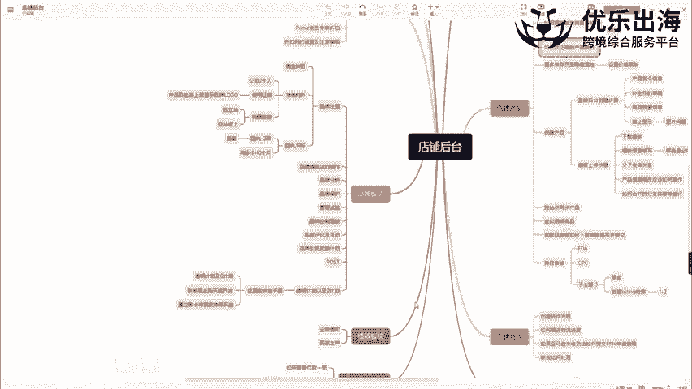

在这里点击注册您的品牌。

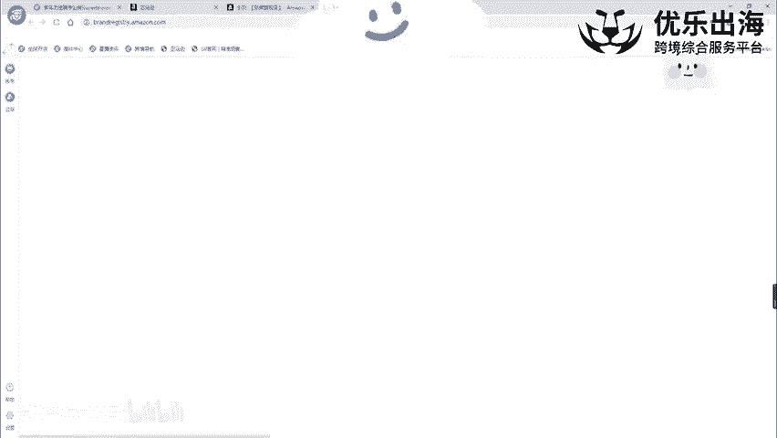

然后这里有一个注册新品牌，我们直接点击注册新品牌，然后点击注册品牌啊，注册品牌。然后这里的话呢就是品牌注册的整个页面。那么我们的一个品牌名，我们可以直接写上我们的要注册的品牌名到底是什么。

然后接着就是我们去申请的这个就是在哪一个国家申请的一个品牌。我们是在日本申请的日本的商标，还是欧洲的商标还是加拿大的商标或者是美国的商标。一般来说我们都是美国的商标。

然后在这里输入我们的一个注册号和序列号。然后如果说是TM回执的话，就输入我们的一个回执编号。如果说是阿标证书的话，就直接输入我们R标证书的一个上面正式的一个编号啊，编号代码。

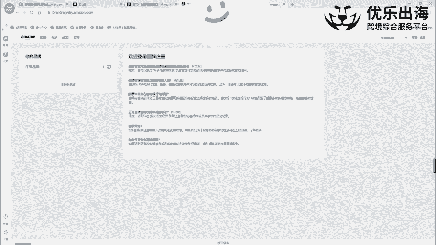

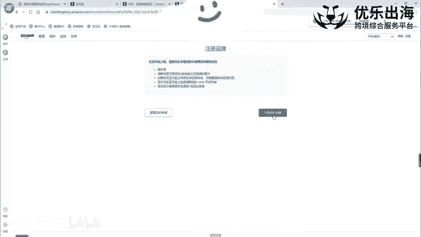

然后这两个呃回执和阿标的一个代码都是不一样的哈，并不是说到期之后啊，我们的品牌成功注下来，注册下来之后，我们的一个呃TM回执会自动变成阿标。

然后接下来是啊提供我们官方的URL和我们的一个就是是否在其他的网站上面进行销售，我们这个品牌。那么我们这两个基本上就按照实际情况去填写就可以了。然后下面这个部分就是刚才我所讲到的啊，我们这里。

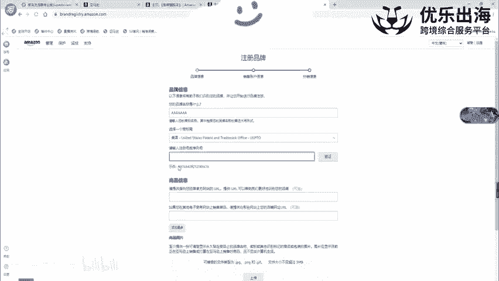

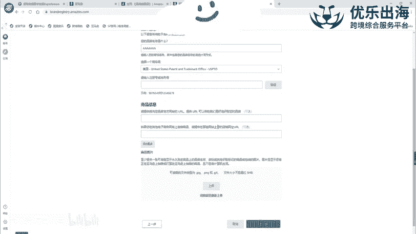

啊，我们这里就是产品和包装上面带有我们品牌logo的这样的一些使用证据的一字验。我们可可以点击这里进行上传。然后整个页面填写完之后，我们再点击进行下一步。

下一步的话也是去询问我们具体的一些产品的品牌的使用情况。我们按照实际的使用成使用情况。然后去填写这个证据就可以也可以过来联系我去领取关于我们进行品牌备案的整个的流程的操作一个步骤啊。

PDF的一个文档格式发给大家。

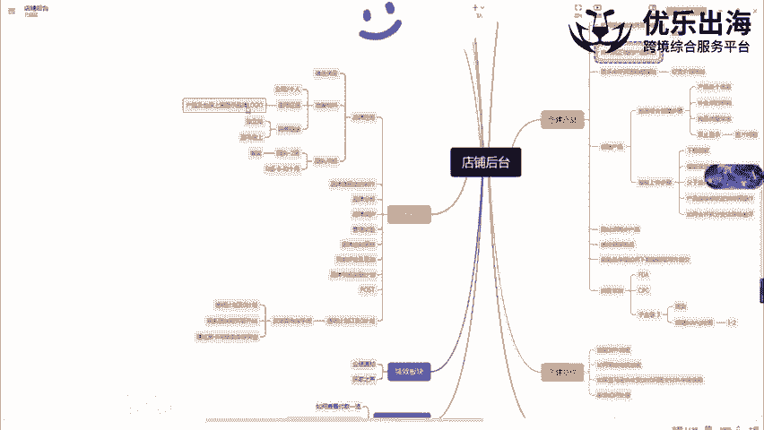

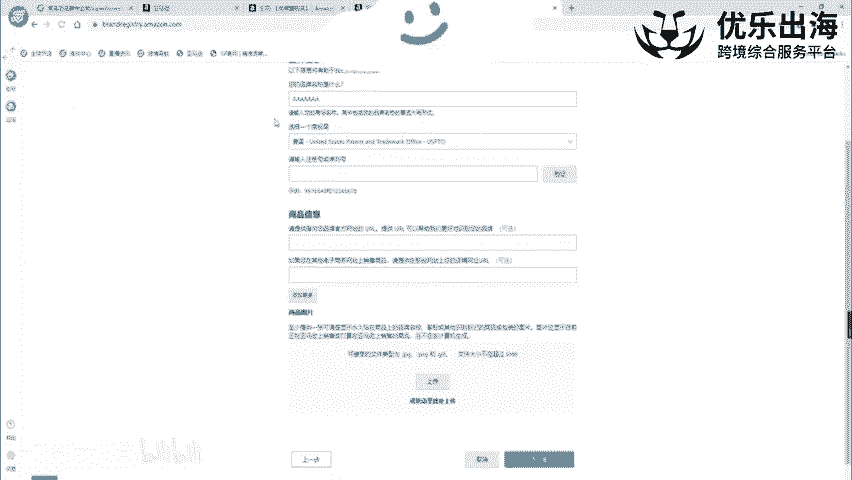

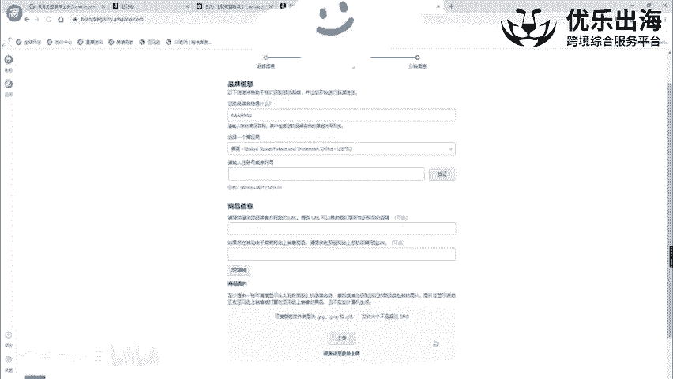

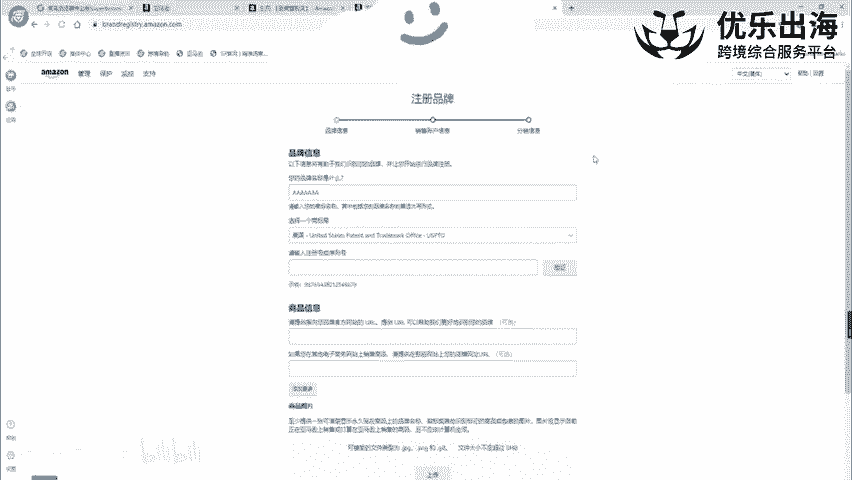

另外一点啊，就是我们那个品牌备案之备案成功之后，我们就可以成功的使用这些接下来的一些品牌的一些功能。

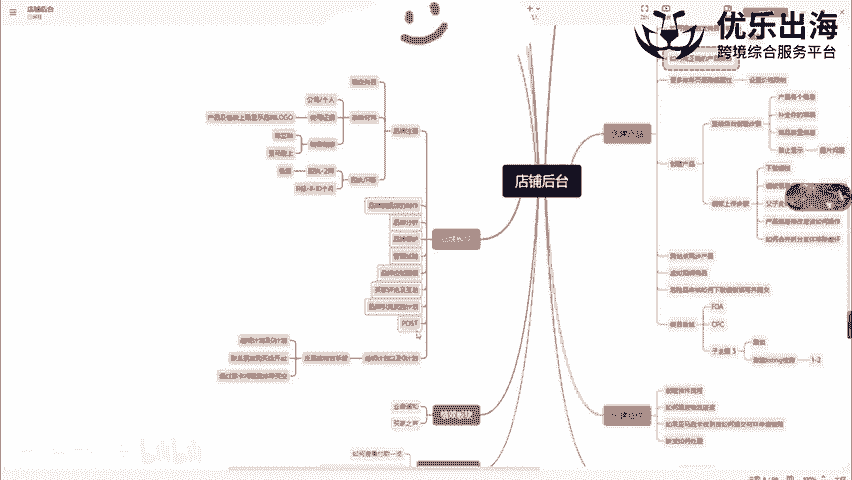