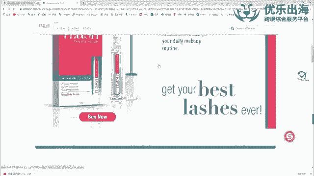
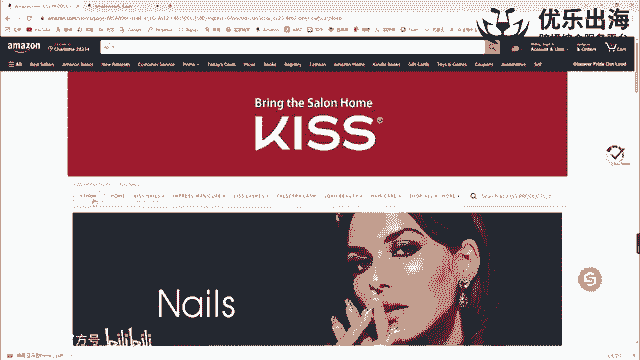
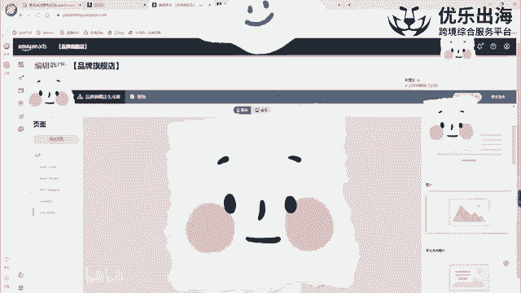
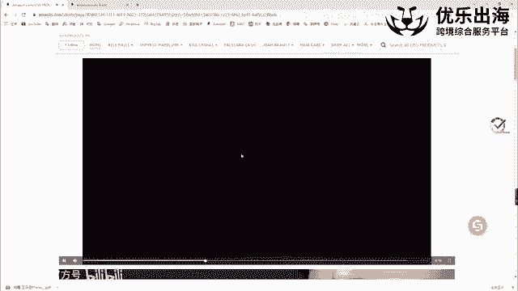
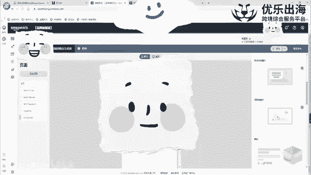

# 【2024年10月最新版】新手亚马逊跨境电商运营合集，亚马逊入门教程（纯干货，超详细） - P21：第18讲.品牌旗舰店制作 - 三师兄的故事 - BV13qxPesEyQ

首先我们从第一个品牌旗舰店的一个制作啊，我们先打开这个。亚马逊哈打开亚马逊之后，我们搜索一个关键词。我们在搜索完这个关键词之后，我们可以看到在这里。在我们这个啊搜索结果的顶部的一个位置。

顶部的广告位置的上面还有一个广告的一个位置。这个广告位置就是品牌广告啊，我们可以通过品牌广告直接展示我们的一个品牌logo啊，品牌的一个标语，以及我们产品的一个信息。但是这个品牌广告。

只有在我们做了品牌旗舰店之后才可以去做的一个广告。另外一点，我们可以直接通过啊这个按钮进入到我们的一个品牌旗舰店里面去啊，包括竞争对手的品牌旗舰店里面都可以去进入。

就这一个哈。然后呢，就是这个是我们的一个呃选的一个竞争对手，他的一个品牌旗舰店。然后接着我跟大家去讲一下啊，我们直接点击进入编辑品牌旗舰店。

我们应该如何去制作属于我们的一个品牌旗舰店里面有没有哪些需要注意的一些点。首先第一个啊店面设置啊，店面设置，这里有一个品牌信息，直接写我们自身的店铺的品牌信息就可以了啊。我们的一个品牌名。

还有我们的一个品牌的logo，这个logo是凸显在。

这个位置。啊，这个位置。然后呢，这个logo选完之后，下面有两个是商品网格的一个显示呃，显示的一个布局的一个区别，一个是正方形，一个是立方体。大家可以就是根据我们自身的一个页面的一个布局进行。

我们就是产品的一个呃就是网格的一个显示情况。然后接着是进入到我们正式的一个页面里面，我们可以点击这里添加页面啊，我们可以点击这里添加页面，然后增加一个全新的页面啊，增加一个全新的页面。

那么这个全新的页面呢，我们可以就是呃比如说我们是做呃睫毛的嘛。我们做睫毛呢，我们就可以直接在这里输入睫毛这样的一个关键词，以及页面的原毛术里面。

我们可以通过一句话来简短的描述我们这个页面去卖的是什么产品想要去介绍什么样的一个呃功能，或者说是也可以去顺便埋入我们的一个关键词啊，然后商品网格，还是说标注，还是说这选取框的一种形式。

下面有4种方式可以去啊可以去构建。然后呢，我们去随便先选一下创建这个页面，创建完这个页面之后呢，然后我们可以把这个页面可以看一下，我这里也有1个LSS页面。

然后我们可以把这个页面直接以这种形式拉到这个页面下面啊，拉到这个页面下面。也就是说相当于变成它的一个子页面啊，变成一个这样的一种形式。也就是说我们整个店铺里面的一级栏目和二级栏目。

我们可能卖键盘键盘相关产品，然后下面是键盘键盘垫儿啊，或者键盘套啊，或者说是机械键盘、电子键盘、黑色键盘，白色键盘等等等等。这样一些键盘。然后接下来就是我们具体的一个商品页面的一个布局哈。

先拉回来拉回来之后呢，然后我们可以看一下，这里有一个添加全新部分。然后首先下面呢就是呃我们我给大家去做一下演示哈。就是我们先看一下我们竞争对手，他们是如何去做的。

首先第一个我们这个case的一个页面的话。😊。

顶部是一个呃算是一个那个斑的图吧。🎼然后这个图片可以显示我们的一个产品的logo，以及或者说是带上我们的一个背景啊，带上设计的一些图片。图片接下来呢是我们这个呃竞争对手。🎼它的一个算是产品的一个视频啊。

展现产品的一个视频。

然后再往下呢就是包括指甲啊一个图片图片呢，但是这个是可购物的一张图片，我们可以直接点击shopdown shop now，然后去啊去进行我们这个指甲相关的产品的一个购买。

然后接着是我们睫毛产品相关的一个购买，以及我们化妆啊产品啊，头发护理产品等等等等等。这些产品的一些购买。每一张图片啊都是一个就是说可以购物的啊一个主图，都是可以购物的一个主图。

这是我它这个首页的一个展示形式。那么我们我建议大家就是首页的一个展示形式是什么样的？就是首先第一个我们可以模仿它以视频作为我们就是整个啊就是品牌旗舰店的一个开头啊，品牌旗舰店的一个开头，这是视频这方面。

另外一点的话，我们也可以去选择我们的一个轮播图。我们那个图片展板可以展示我们3到8张图片，每张图片的一个像素的话是至少是1500乘以700的。然后这三张像素图片可以分别去展示我们店铺里面的不同的产品。

而且每一张图片都可以去佩戴我们的一个产品的一个链接。也就是说我们的个这个店铺里面去卖键键盘，连麦键盘垫，还卖鼠标。那么我们可以放三张轮播图。分别是啊键盘键盘内和鼠标的一个就是设计的一些图片。

然后我们再连接我们店铺内的一个产品啊，店铺内的一个产品，以此可以展示出来我们这个产品，就是呃客户看到喜欢的这个产品图片的话，我们可以直接点击进来进行我们产品的一个购买，帮助我们的产品进行引流啊。

这是图片展板。然后接着呢就是我们的一个跟刚才一样。整体的一个图片，或者说是可购物的一个图片。可购物的一个图片啊，都可以是这样展示的。如果说我们单纯去放图片的话，呃，其实也是可以去添加我们的产品的链接的。

只不过我们这个可购物的图片的话，可以直接跳转到我们的一个链接的一个页面啊，是这种情况。然后接着就是呃除了这几部分之外，我们还可以自行的去组装。如果说我们想要通过一个呃一个版块同时展示我们的一个商品信息。

或者说是我们的一个可购物的一个呃图片或者说是一个视频都去同时展示来，我们可以通过这种拆分部分啊，拆分部分，我们通可以通过这种形式，或者说这种形式去添加不同的一个模块，比如说在这里去添加一个视频。

在这里去添加一个产品，就是这个产品的话，就是旁边这个展示的视频。下面的话，我们可以添加一张轮播的一个大图啊，就是直接添加一张大图。这一张大图的话。啊也可以是这个产品的一个板块啊也可以是这个产品的板块。

可以自由去组合，自由去设计组合。然后接着就是呃除了我们这个自由组合的部分的话，还有两个呃比较重点的一个板块，一就是我们的一个精选促销畅销商品啊，以及最下面的一个推荐商品的一个板块。这些。板块的话。

我们可以直接添加而不需要我们的一个就是具体的一个操作，不需要去链接我们的一个产品。这些是亚马逊根据客户啊，那个可能是来了一个路径，包括搜索的一个渠道来自动给客户进行的一个产品的一个推荐。

比如说我们这个畅销商品可能就是直接展示的我们整个店铺里面最畅销的一个产品啊，精选促销的话，就是可能目前我们店铺里面在售的一个推荐的一个产品，这就是促销的一些产品做定有的一些产品，都会在这里推荐。

以及我推荐商品。客户虽然说我们可能是键盘鼠标动卖，但是客户是通过键盘进入到的我们的一个店铺。那么推荐我们设置完推荐商品之后，亚马逊会自动的去推送一些键盘和键盘相关的一些产品。

就是我们店铺里面的产品推送给客户，是这种形式。这是我们这个呃就是品牌旗舰店的一个布局哈。我建议大家在做品牌新的时候，可以重点的去呃模仿一下我在我们做这个品类里面的比较大的一些就是这些客户啊。

比较大的这些品牌。他们的品牌是如何进行布局。我们可以进行模仿。

可以看一下。