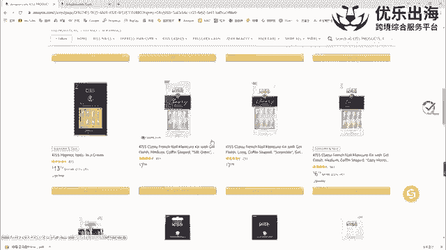
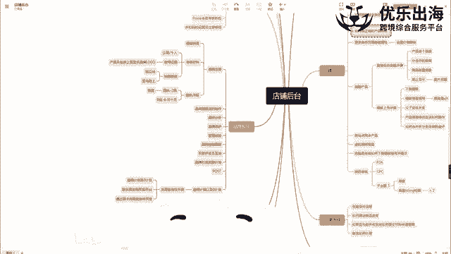
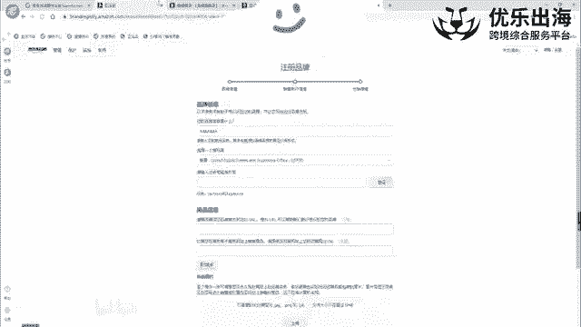
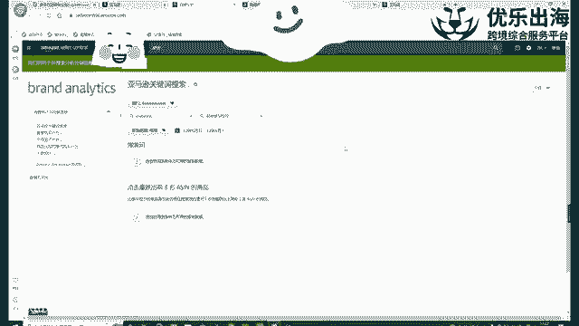
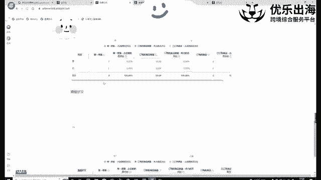
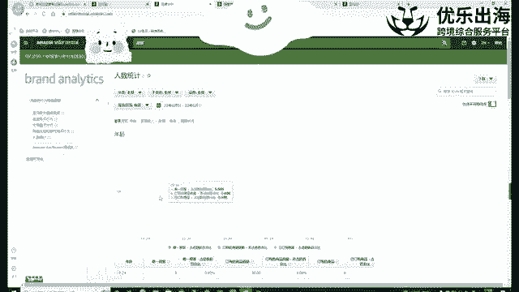

# 【2024年10月最新版】新手亚马逊跨境电商运营合集，亚马逊入门教程（纯干货，超详细） - P22：第19讲.品牌分析 - 小恐龙游江南 - BV1cfs8eGEKy

，品牌的一个展板。然后我们接着。接下来去讲关于品牌分析这个板块啊，品牌分析板块的话呢，我们去打开。

我们的一个后台。

点击品牌品牌分析。也就是说我们正式的品牌功能的第一个板块啊，亚马逊对于我们这个品牌的扶持力度还是比较大的。

第一个板块里面的亚马逊关键词搜索啊，亚马逊关键词搜索这个关键词搜索类似于我们卖家精理，或者说是一些选品工具里面的关键词反差以及关键词拓展。为什么会这么说呢？我先在这里搜索一个关键词。让我们点击应用。

可以看到哈，就是得到的这个结果啊，allashes magnetic alllashes或者是false alashes这样的一些结果的一些数据都是跟我们的一个产品息息相关的啊。

根据我们搜索的关键词息息相关的，算是我们关键词的一个拓展，也类似于我们呃做广告里面的广泛匹配啊，做广告里面的广告广泛匹配。然后。😊，得到的搜索词的结果，我跟大家去稍微的去讲几个点哈。

第一个点就是这个搜索排名越小，证明这个关键词的搜索量越大啊，它这个是搜索的一个排名，排名越靠前，搜索量越大。但是具体的搜索量有多少。亚马逊这里没有给到具体的一个呃展示。另外一点的话呢。

就是接下来后面会跟着商品，就是第一前三名的一个商品。这前三名的商品是点击率和转化率啊，综合考量之下的啊，综合考量后的就是针对于这个关键词allashches下面排名第一的点击率的和转化率啊。

这个链接是什么？然后接着第二名是谁？第三名是谁。我们可以在这里看一下。往右拉第二名啊，以及第二名和第三名，他们分别的点击率和转化率是怎么样的？关于这个点的话，可以帮助我们去啊进行关键词打排名期间啊。

有效的帮助我们去呃得到一些这个比较不错的一些数据。因为像这种哈，比如说。这个关键词这个关键词的话，这个产品链接已经占到了我们整体整个关键词流量的50%。也就是说我们再去做的话，只能抢剩下的50%的流量。

甚至这个77%垄断非常严重。如果说出现这种情况的话呢，我们尽可能的就不要再去啊争抢这些关键词的一个排名去争抢类似于这种就是呃竞争机会还比较大啊，包括我们这个竞争度并不是特别激烈的一些关键词啊，是这种。

然后接着就是这个的话，就类似于我们的个asen反查。我们可以在这里。去看一下，先去搜索一个A赛。我们在这里搜索一个A赛。复制A复制下来asen之后。

我们在这里去反查这个asen在亚马逊上面的这个期间的流量词啊，这个期间流量词这个期间是没有流量词。看一下。

flashes删掉。我们换一个产品试一试。好，可以看到这一个产品的话就是出单词基本上是有44个。然后针对于这些出单词排名第一和第二、第三，他们的一个数据都分别是多少啊。

类似于我们就是出单词或者说是流量词的一个反差啊，就是这个。然后接下来就是重复购买行为啊，重复购买行为这一块的话啊，基本上我们可以看一下，就是帮助我们去。

反查出来我们出单的一些订单都有哪些，以及我们的一些顾客啊，他们的一个占比啊，数据都是怎么样的。还有一个是市场。

篮子行为这个的话基本上就是可能大多数人用不到哈。然后我们看一下这个人数统计，人数统计也是比较有用的。可以看到我们整个店铺里面的一个产品的一个客户群体，他们的一个年龄分布以及收入分布、教育分布。

还有性别分布，婚姻状况分布都可以具体的帮助我们去得到这些产品的一个信息啊，都可以得到我们产品的一个信息。

