# 【2024年10月最新版】新手亚马逊跨境电商运营合集，亚马逊入门教程（纯干货，超详细） - P24：第21讲.品牌板块其他内容讲解 - 小恐龙游江南 - BV1cfs8eGEKy

接着是我们那个品牌控制面板啊，评论互动以及品牌引流奖励计划，还有最终的一个post。我们可以看一下，继续往下讲哈。

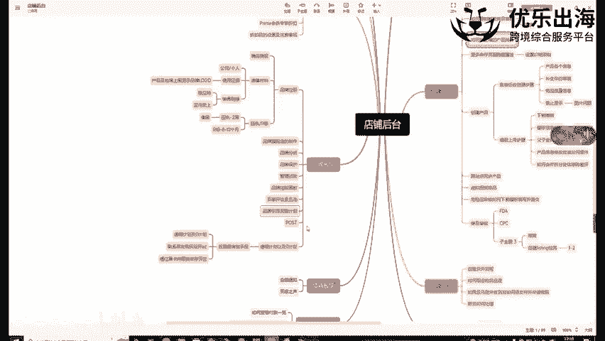

品牌啊品牌控制面板可以从这个品牌控制面板看到我们具体的一个品牌的一个数据，以及我们的一个健康程度啊。首先第一，我们的一个产品的定价是否是有竞争力的一个定价，以及我们的一个存货率，好。

包括我们一个prim的一个参加的一个资格啊，是有怎么样的。

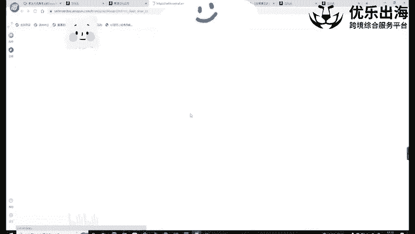

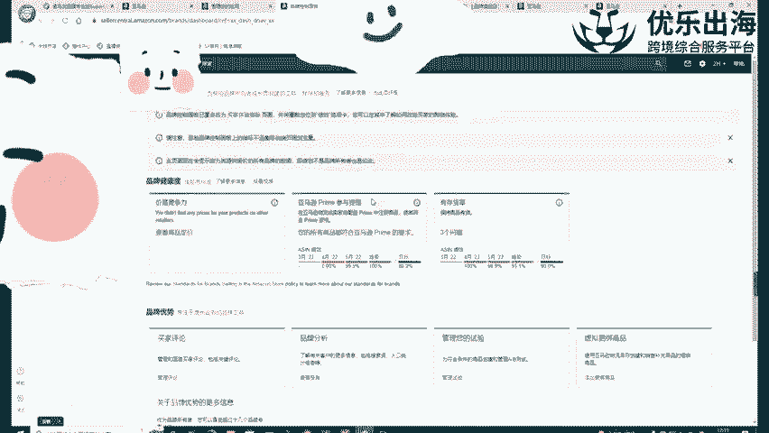

接下来就是我们可以看通过这个面面板去观察我们的一个买家的评论啊，管理和回复买家的一个评论，包括关键的一个评论。还有我们可以在这里去查看我们品牌的一个分析板块啊，直接就跳转过来。

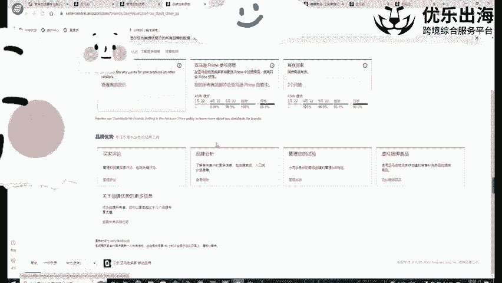

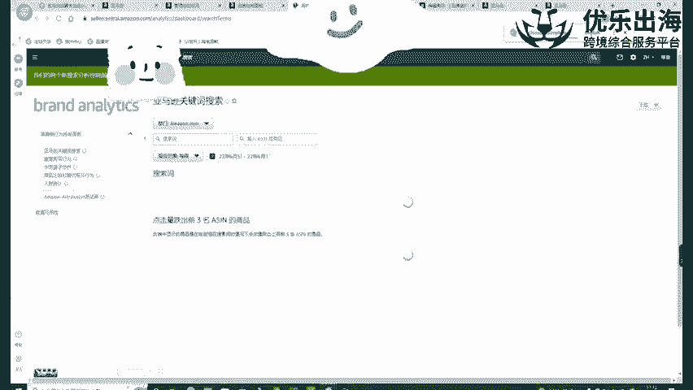

管理实验ABtest以及虚拟捆绑商品啊，这个之前有讲过。

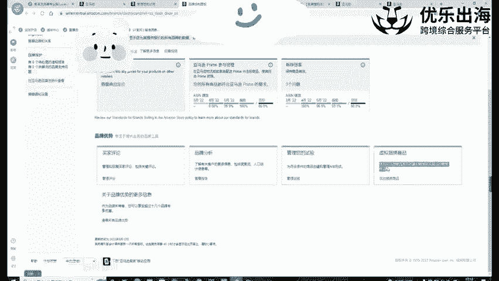

那么接下来这个品牌控制面板的话，算是对于我们整体的品牌功能的一个展示。品牌目录管理器啊，包括买家评论，买家互动的话，我们基本上刚才都可以去就是通过品牌的板块直接跳转过去啊。

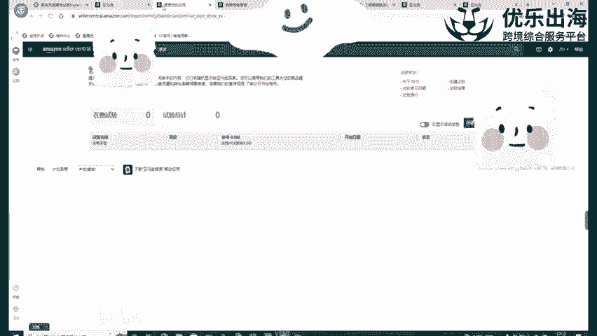

然后接下来是虚拟捆绑商品品牌引流奖励计划。这个我针对于大家重点去讲一下哈。品牌引流奖励计划是我们可以通过这个计划生成一个独特的标签，生成这个独特的标签之后。

我们可以将这个标签放到一些facebook上面去，或者说是twitter或者说是ins。这上面去之后，然后有人通过这个标签链接进入到我们的一个商品页面。

然后进入到商这个商品页面之后进行的下单购买的行为啊，然后亚马逊会给到我们佣金的一个支持啊。会给到我们佣金的一个支持。带来的流量越多，获得的奖励机会就越多。这个奖励可以抵扣未来的销售佣金啊。

未来销售佣金我们可以在这里看一下它如何做工作的。第一个就是生成我们的一个亚马逊洞察引流标签，然后再将标签添加到广告活动中。这个广告活动是指的这个标签里面的广告活动啊，我会等会跟大家去做一些演示。

然后接着将这个去发布到我们其他的一些平台上面去，然后接着就会获得我们的一个独特的一个销售的一个奖励啊，独特的销售奖励，将获得。

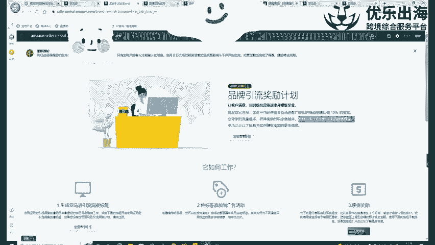

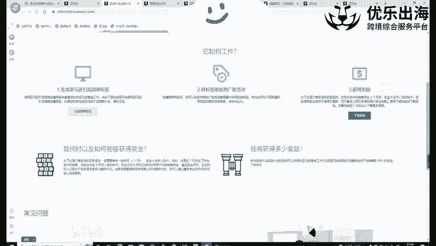

多少的一个佣金呢？啊，参与品牌引流奖励计划的品牌可以获得非亚马逊营销工作，引流到亚马逊商品流量推动的平均销售额10%的一个奖金。也就是说我们的一个商品品类佣金是15%的话。

那么直接就会直接降到我们5%啊，变成我们呃佣金的百5%。

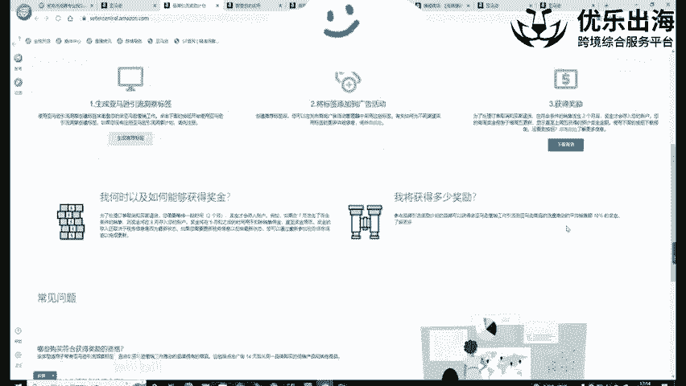

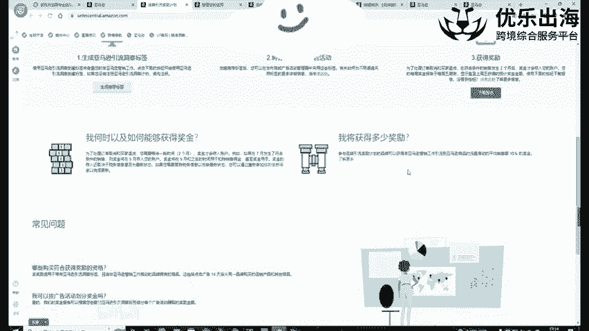

然后接着呢我们去看一下，就生成推荐标签。点击生成推荐标签之后，我们会进入到我们品牌引流奖励计划里面的一个呃栏目里面去。我们点击创建广告活动啊，一定要去记得是引流洞察里面的广广告活动。然后手动创建。

在这里输入广告名称啊，输入广告名称以及外部编号，搜索我们的商品，然后接下来再去创建我们的一个广告组合，跟我们的广告创建广告活动基本上是一样的。在这里出版商的话，选择我们投放的渠道。

比如说我们要放facebook渠道，facebook群组，或者说是哪里facebook公共主页，那么我们就选择facebook渠道。如果是谷歌的话，我们就选择谷歌投放渠道。

instagram就选择instagram投放渠道啊，就等等的这一系列的一个销售的一个渠道。

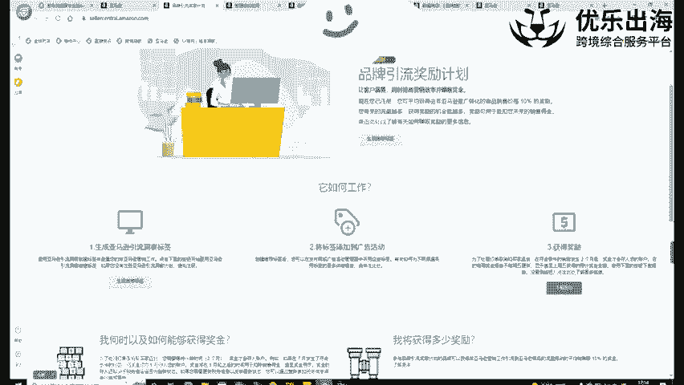

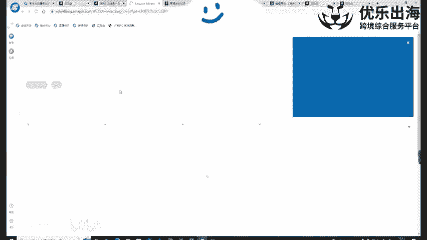

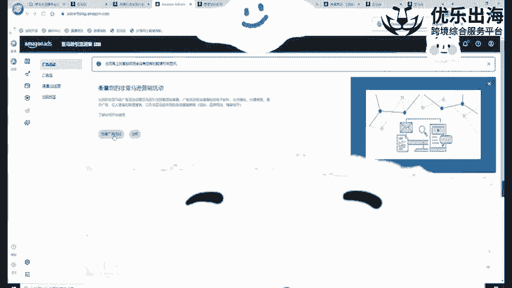

然后选择我们是视频投放还是email，还是一些那个展示型，或者说社交媒体里面我们那个投放。然后最后创建成功啊，创建成功，创建成功之后啊，创建成功之后，我们会在这里我们会在这个位置去生成我们的归因标签。

我们点我们把归因标签复制下来去放到我们那个比如说facebook或者说其他ins上面去就可以啊就是别人通过一些流量之后，我们就可以通过这些订单来获得一个佣金的一个折扣吧，算是啊佣金的一个折扣。

这是我们亚马逊品牌引流奖励计划。然后接着就是所有品牌的一个权益，我们也可以在这里去获得一个大致的一个了解啊，去获得一个大致了解。这就是我们在注册品牌之后，我们所拥有的品牌的一些权益和功能啊。

品牌的一些权益和功能。

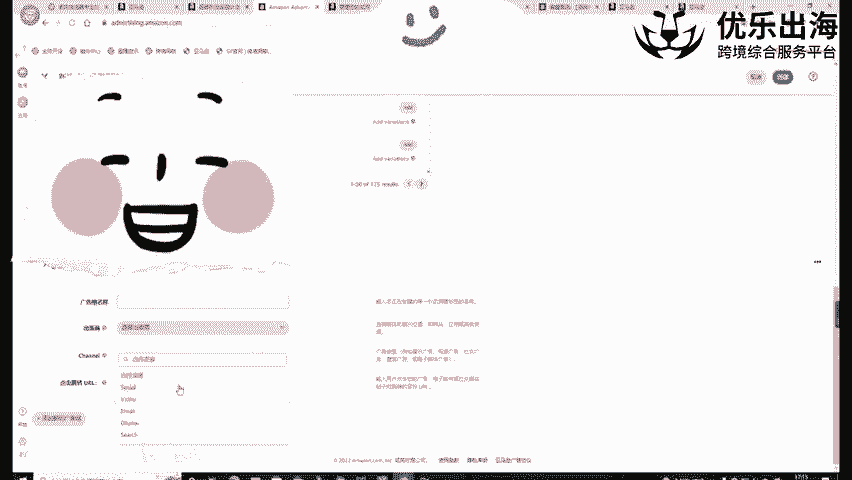

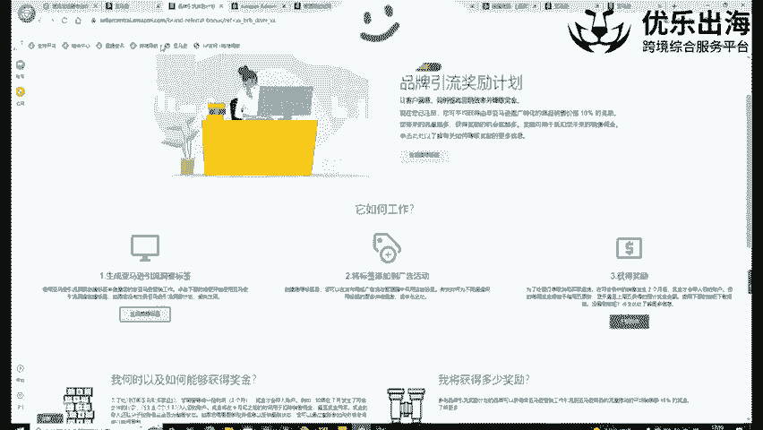

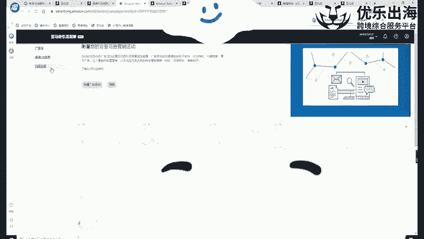

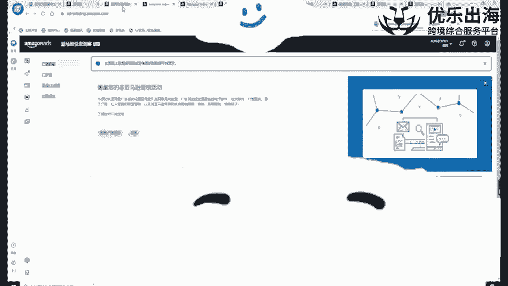

然后接着我们去讲解啊，关于这个post这一方面。post的话是这样哈，就是我们可以点击进入我们那个品牌引流。奖励计划里面进入跳转到我们的广告页面。然后广告页面里面的最下面有一个更多工具。

动更多工具里面有一个帖，我们可以通过这里更多工具帖子啊，这里去进入到我们的一个帖子页面。然后在这个帖子页面的话，就跟平时我们发朋友圈一样，去发一些我们的一个产品的一些图片。

配备上我们的一段表述性的一个文字。比如说这个产品的一个材质是怎么样的，使用使用的一个感受非常不错。然后来吸引买家啊吸引买家来去那个获取我们的一个就是产品的一个信息。因为这个帖子的话。

我建议大家如果说注册的品牌之后，一定要去使用起来。这个帖子可以极大的去帮助我们去获得很多的免费的流量，很多的免费的流量。这个。

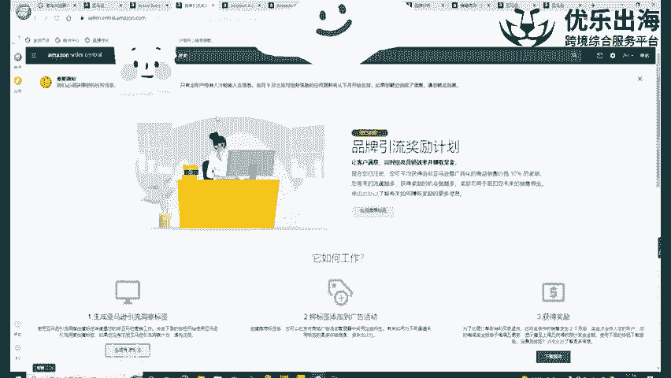

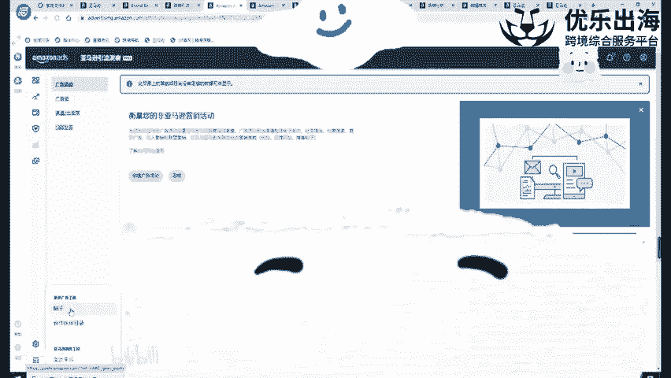

帖子我们大家一定要去用起来。这个我们发布了帖子之后，这个帖子出现的位置是在手机端的评价的上方啊，是在手机端评价上方，我们可以按F12。

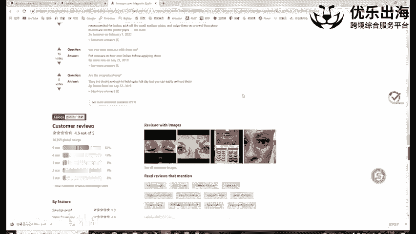

切换成手机版本，切换成手机版本之后，那么我们再去刷新这个页面。

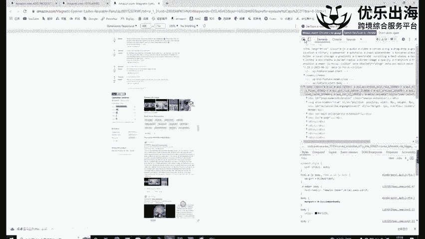

好，我们再去刷新这个页面，这已经是手机版本了。手机版本之后我们往下拉。

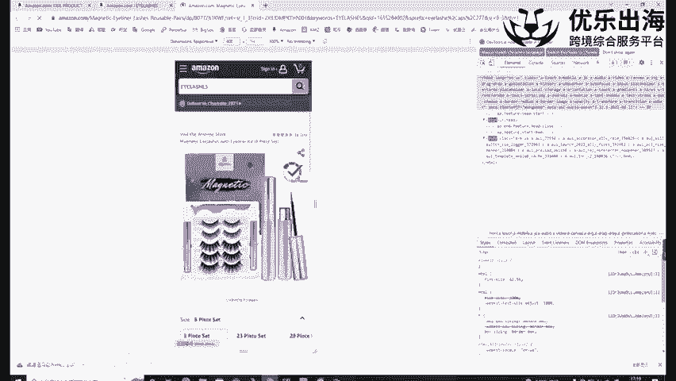

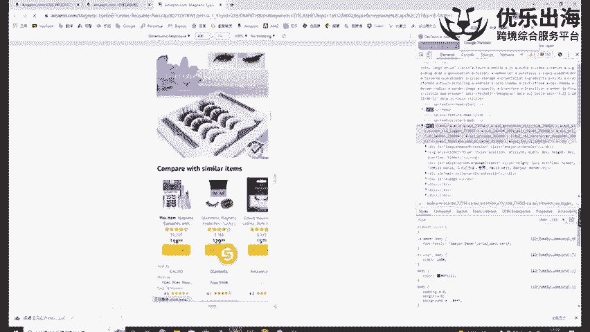

往下拉之后，我们可以看一下。啊，在这里啊，post。

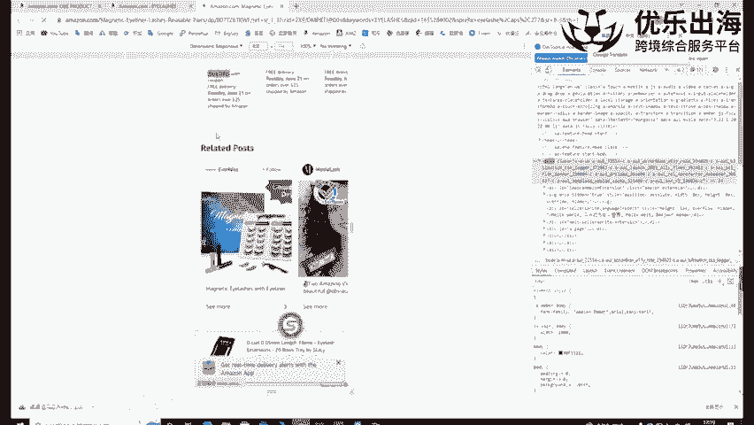

这个这里全部都是啊全部都是我们竞争对手的一个品牌的po。如果说我们自己不发，这里就会被别人全部占满啊，就算是当然是就是就算是我们自己发了这里页可能就是更多的是呃竞争对手的一个po哈。然后但是不管怎么说。

这里po就相当于我们的一个朋友圈。然后这里也是一个非常大的一个呃流量的一个入口，我们可以通过这个流量入口获得很多的一个免费的流量，大家一定要把握住啊，大家一定要去把握住这个手机端的一个流量。

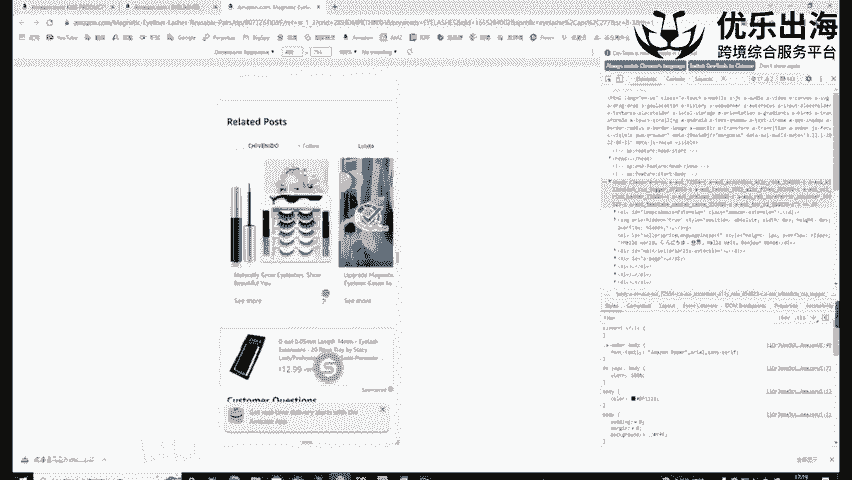

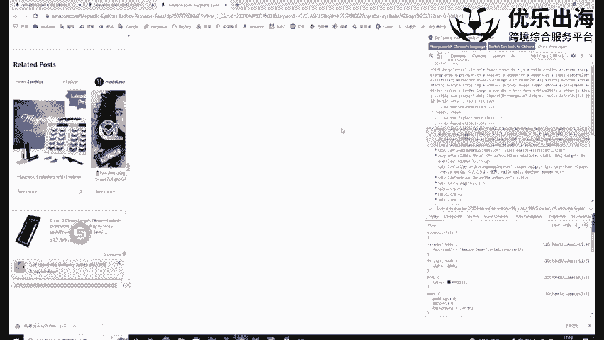

好。完Po之后呢，我们再讲解关于亚马逊，就是呃做了品牌备案之后啊，一定是R标的情况下，一定要是二标的情况下，我们可以做品牌计划以及零计划来帮助我们去赶跟卖啊，来帮助我们去赶跟卖。

因为很多人就是可能会我们把链接做起来之后，会遭受到跟卖的一个困扰啊，跟卖别人会就是进就是随意的去跟卖我们的一个商品去窃取我们的一个自身的一个果实嘛。那么这时候的话我们应该如何去有效的反制跟卖呢？

首先是第一个就是亚马逊注册品牌备案之后，可以使用。透明计划以及零计划。亚马逊透明计划的话，也就是说我们注册完亚马逊透明计划之后，我们所有的产品，就是我们注册透明计划的产品都会有一个防伪标签。

每一个防伪标签上面有独特的一个条码，独特条码，只有跟卖我们的人输入5个不同的我们的产品的条码，他才可以去跟买我们的产品啊，一般来说他们不呃他们那个不是我们内部人员的话，是根本就不知道我们这些产品信息的。

所以说这种形式可以有效帮助我们去赶走，防止别人去跟买我们的产品，这是亚马逊的透明计划啊，我们可以看一下，刚才亚就是产品的一个。

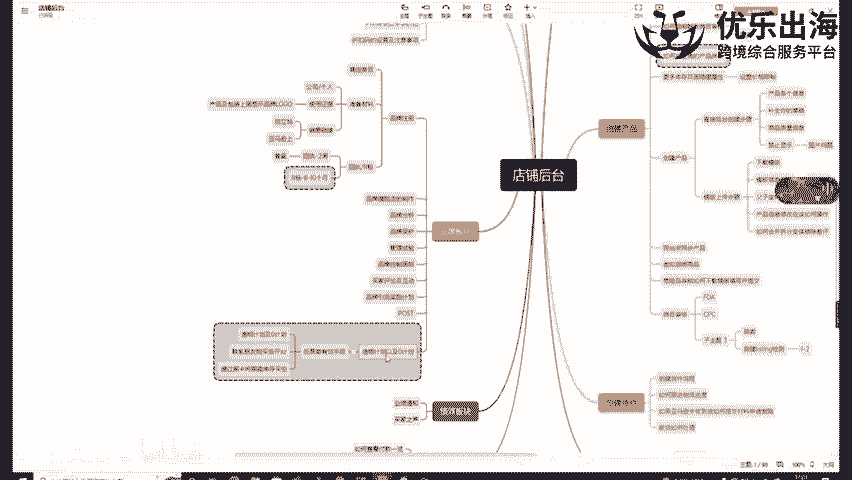

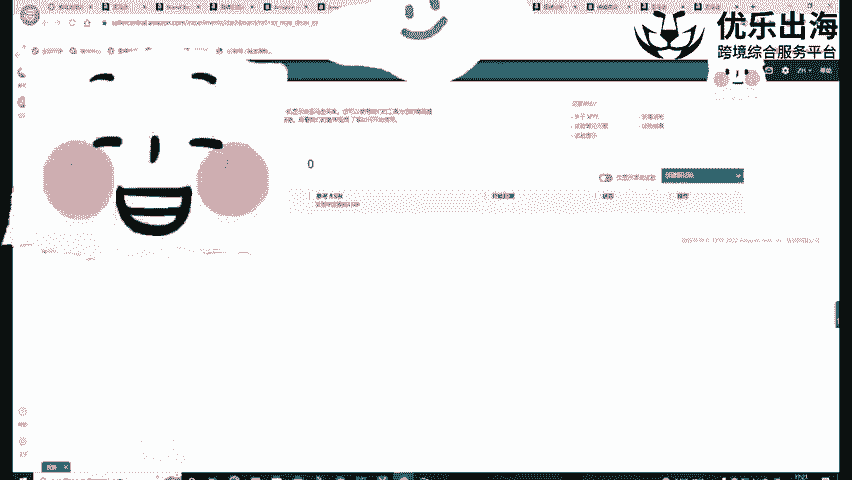

板块儿。品牌权益板块里面。看一下。在这里啊。啊，我们可以点击品牌权益板块，在最下方有一个透明计划的一个描述，可以在这里点击详细描述。

并且gestar联系我们的一个品牌透明计划的一个官方人员去尝试操作这个计划。另外一点的话就是零计划啊，注册完零计划之后的话，我们一旦发现跟麦之后，可以直接在后台去将跟麦赶走啊，直接在后台将跟麦赶走。

如果说我们这个呃那个品牌并没有注册透明计划，或者说零计划的话，也没有什么太大的一个问题。我们现在亚马逊对品牌的一个扶持力度特别大。我们可以直接点击啊进入到我们的个品牌注册页面。

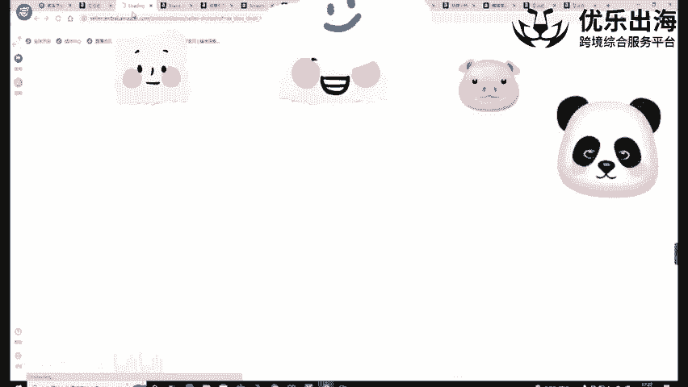

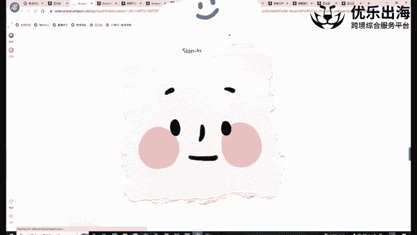

然后在这里有一个注册您的品牌。

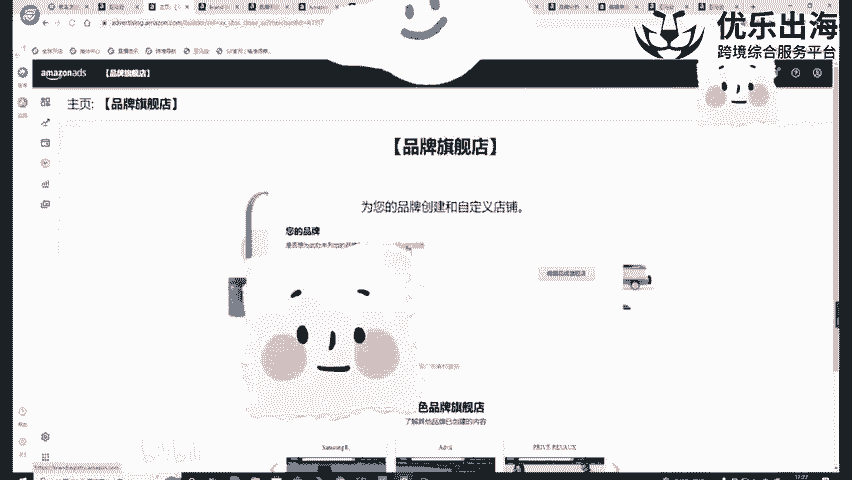

注册您的品牌里面有一个举报违规行为啊，举报违规行为。我们可以通过举报违规行为里面将我跟卖我们的人，然后提交我们的一个使用证据来将他们赶走啊，来将他们赶走。一定要去注意一点哈，就是啊把我们自身的一个卖家。

然后需要去排除在外。因为我们因为如果说是不排除在外的话，连我们自己也都会一起去赶走啊，也都会一起去赶走。这是我们的一个呃透明计划和零计划防止跟卖的一个点，以及我们可以通过后台的一个品牌的举报违规行为啊。

直接举报我们跟卖的一个手段。另外一点呢，就是我们可以连。

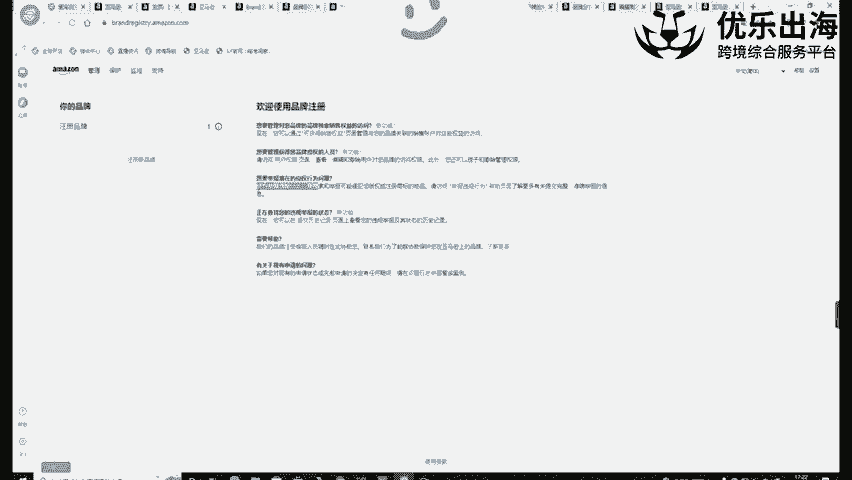

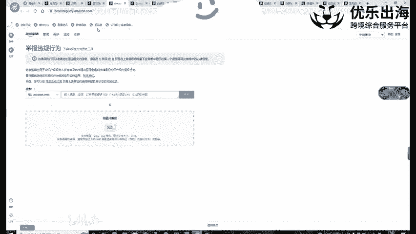

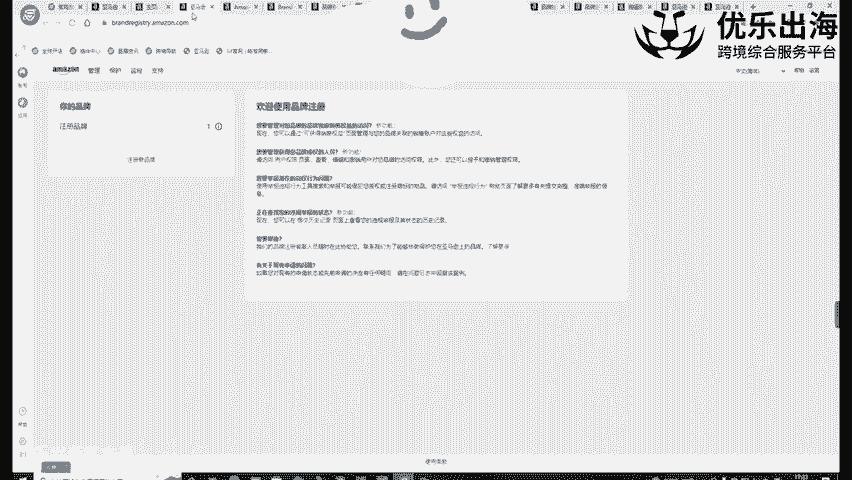

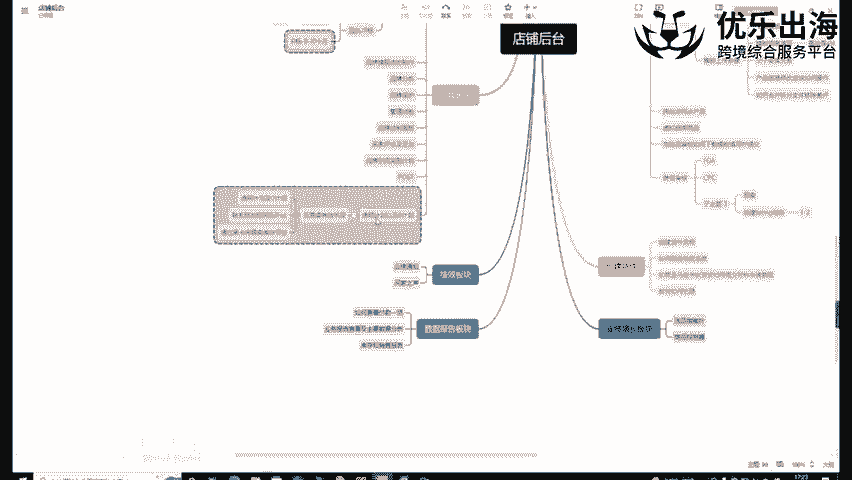

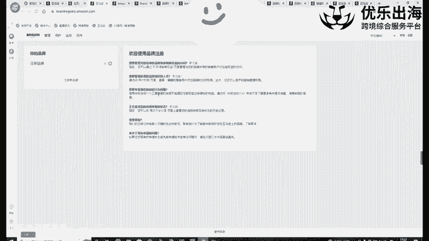

如果我们没有品牌的一个备案的话啊，或者说是我们的1个TM的一个回执啊，去赶跟麦。亚马逊没有受理成功。那么我们可以联系我们国外的一个朋友去购买我们这个呃跟麦人的一个产品，然后跟购买完之后。

他的一个产品肯定是给我们就是有一些差别的。然后就是以这种呃图片商品与描述不不符去开AZ啊，去投诉这个跟麦的一个店铺。那么基本上我们投诉几次之后，这个跟麦的店铺也都会啊封掉。

然后接着呢就是通过黑卡啊将跟卖的库存买空。黑卡是什么意思呢？就是我们的一个虚拟信用卡，我们呢可以在淘宝上找到很多的这种虚拟的信用卡。然后将这些虚拟信用卡的话，我们可以使用这些虚拟信用卡。

然后将跟卖的库存直接买空，而并不是实际上面的一个付款啊。这个黑卡的话就是淘宝上面也有卖，但是费用应该也是不便宜的。这也是一个比较不错的一个跟卖的手段啊，比较不错的跟卖手段，再加上我们就是。品牌投诉滥用。

四种反对跟麦有效的方式啊，我们大家可以使用一下。

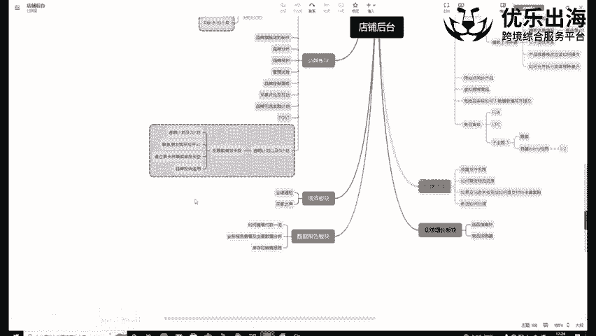

接着是我们的一个业绩增长板块哈，业绩增长板块里面的一个选品指南针。我重点跟大家去讲一下，就是呃在我们的一个我看一下，在我们基本上是增长增长下面的选品指南针。我们点开之后呢，可以看到。

就是这里面有一个全球选品需求。也就是说整个呃全球范围之内，我们的一个产品或者说是跟我们产品相关的一些产品。在全球范围之内的一个需求的一个比较旺盛的一个产品机会。另外一个就是新选新选品推荐。

新选品推荐的话，是根据目前我们正在做的这个类目，正在做着正在做的这个类目的话，就是给到的一个类目里面的细分市场呃，更加。

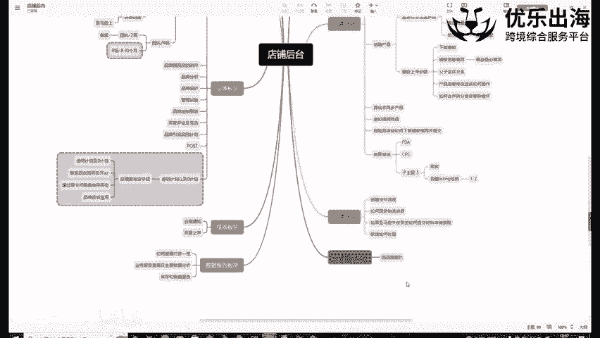

比较不错的表现不比较错不错的一些产品的一些推荐。以及目前我们呃就是所在的这个类目里面的一个具体的一个数据分析。首先是我们看一下那个全球选品需求来源于我们店铺本身的一个产品。

然后去给到一些产品的一些机会建议啊，然后接着是我们新。

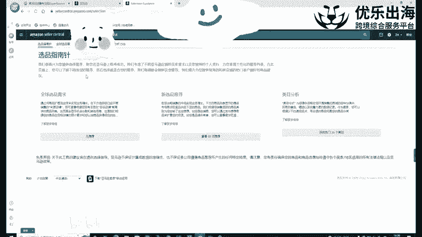

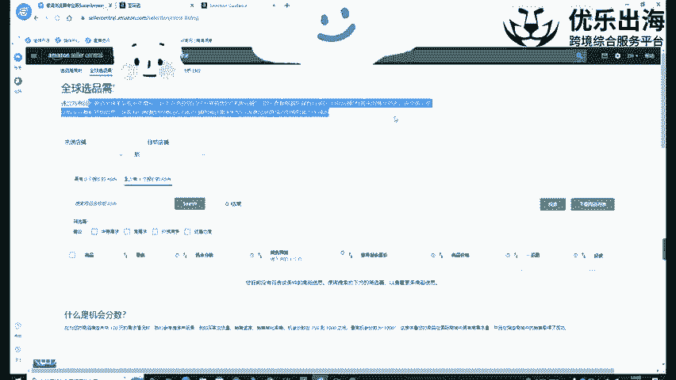