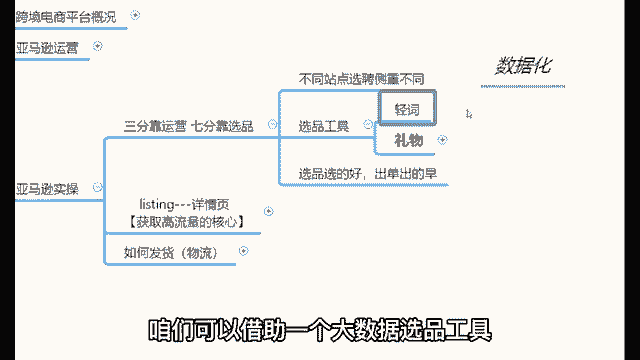
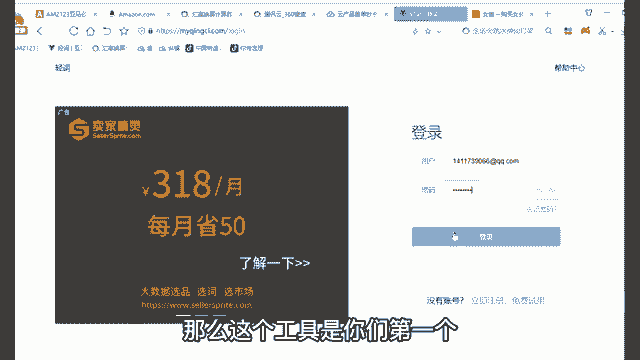
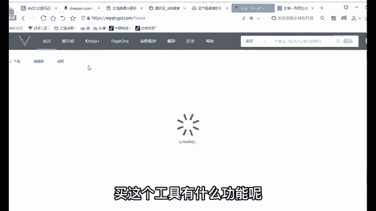
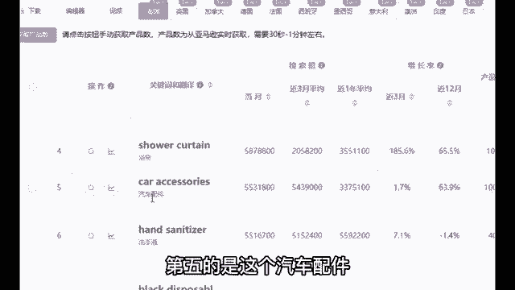
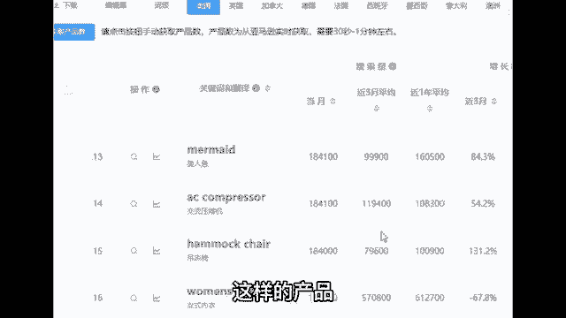
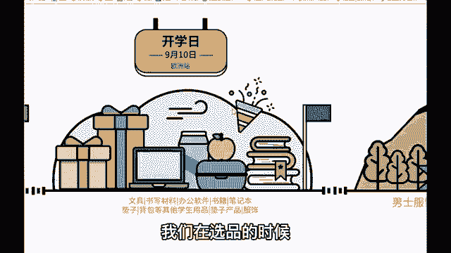

# 【2024年9月最新版】新手亚马逊跨境电商运营合集，亚马逊入门教程（纯干货，超详细） - P14：14、如何进行选品 - 疯往呗催哇 - BV1THsSeuEss

那么讲完这些之后，接下来开始去讲一下亚马逊的实操。首先做亚马逊的时候，有一句话一定要记得叫做三分靠运营，七分靠选品。就是不同站点对于产品的需求是不一样的。

美国人对于产品的需求和日本人对于产品的需求和欧洲人对于产品的需求一样吗？😡，完全不一样，就是每一个国家的消费者对于产品的喜好都是不一样的。😡，那么我们怎么去了解这个外国人的喜好呢？

首先今天教你们两种选品的方式，一种是通过数据化的方式去选品。咱们可以借助一个大数据选米工具，叫做青瓷。那么这个青瓷的工具是干什么用的？我打开给大家看一下啊，点击青瓷。

那么这个工具是你们第一个可能会用到的软件啊，318块钱一个月，38161年，你可以按月买，也可以按年买买这个工具有什么功能呢？给大家简单介绍一下。比如说我今天做的是美国人的生意，对吧？我点击美国之后。

在这里可以看到产品的搜索量排名。

就是在美国排名第一的产品是什么？哈利波特哎，那么大概753万的搜素量，排名第二的是婴儿救生衣啊，687万。第三个是面罩，第四的是浴帘，第五个是这个汽车配件，第六的是洗手液，第十七的是什么黑色一次性面罩。

第八的是指甲油。😊。

你不知道外国人需要什么东西，没关系，这些数据不会骗人的。对这些数据只要知道这些数据都是从亚马逊实施获取的，30秒到1分钟左右左右更新一次，别人搜集起来，我们直接用进去了。😡，有明白了吗？

所以说选品这个事儿啊，就可以借助这样的方式去选品。当然有一个问题就是我们不要选一些排名很靠前的产品。😡，那么这样的产品确实排名特别靠前，但是竞争压力也大呀。对吧我们可以往后翻翻页啊。

比如说在这里右上角这个位置可以翻页的。比如说我们翻翻第20页。😊，翻到第20页之后啊，你看20页的产品的速度量就相对比较低了。你看。😊，什么漱口水，18万的厕子量，还有什么32英寸的显示屏。

418万多的厕子量，还有什么这个什么这个这个什么什么什么史努比啊，美人鱼啊，什么这个这个吊床椅。😡，等等这些。那么这样的产品的搜索量相对比较靠中间，甚至靠后。但是我们卖这样的产品，反而更容易什么出订单。

对不对？因为竞争压力小呀，就是老卖加那些你像像那些就像我这样的，就我不会跟你们去竞争这样的产品，因为我没必要，对不对？所以说那么我们新手去做的话，去选择一些排名比较靠中间，甚至靠后的产品。😡。

那么这就是通过数据化方方式的去选品的威力。就它能够帮助你们选择更加出色的、更加容易出单的产品啊，这就是第一种选品的方式，叫做青瓷。当然你们想要卖什么产品，可以在那直接搜啊。唉，你们有没有什么想卖的。

可以打在公屏上，我帮你们直接搜索一下。😡，我教你们怎么搜索产品啊。😡，有什么想卖的可以打在公屏上，我帮你们搜索一下。😡，有没有？手串红木手串儿。手链吧，咱们就是直接收手链吧。😡，熟链。Okay。

OK那我们搜索这个手链哈，那么你看到手链的一个搜索量情况，哎，这个产品是可以做的。哎，这个产品是可以做的。你看一下大概在5万多的搜索量。你看它这个还有什么，它当然周边还有很多啊，像呃女性的脚镯40多万。

女手镯33333万。😊，还有什么925纯银的手镯，17万，这个手链这个产品是可以做的，就手链是可以做的。呃，还有什么，我再随便随便再来一个哈，还有头盔。哎，手链是可以做的。

首先这个产品我刚刚看到这个5万多的话，对于你们新手而言，他的一个压力会小特别特别多。😡，但然头盔稍等。头盔的话呢搜索量你看它分为很多种类型啊，自行车头盔的话大概在13710044辆。

还有是这个摩托车头盔，大概在112300，头盔也是可以做的，头盔也是可以做的。呃，头盔这样的产品的话呢。😊，哎，可以尝试一下哈。小众化产品。那。需要的人嘛没那么多，你说。😡，但是的话呢。

利润也会相对会比较可观啊，这样的产品是可以做的。对，其实我送给你们一句话啊，就是你宁愿在2%的市场占据就是你在2%的一个小众市场占据98%的市场份额，也不要在这98%的市场里边占据那2%的市场份额。

就是你宁宁当鸡头不当凤围。你明白啥意思吗？😡，就是就是选品的时候，不要去跟那些大麦去竞争啊，就是那些竞争压力确实很大的产品，我们搞不赢的，就是我们新手的话搞不赢的。😡，这样一些比较竞争压力小的产品。

我们现场更容易出订单啊，这是关于选品这块哈，借助这样的一个工具选品。当然除了这种方式之外，今天也送你们一份小小的礼物啊，这个礼物叫做大卖日历哈。那么。😊，这个大麦力是干什么的？我打开给大家看一下啊。😡。

稍等。我打开这个大门里给大看一下。那么这份礼物的话呢，也是精心准备给各位的哈，就是2021年的国外的节节假日表。

就是这个大家都知道，就是中国有节日，外国也有节日，从1月份直到12月份，外国有很多的节日，对吧？那么并且现在已经进入到下半年，下半年的节日是最多的。从1月份，你看到12月份有很多很多的节日。

比如说现在已经9月份了啊，9月份的节日有什么，我们打开看一下啊。😡，9月份你比如说有一些国外的节日哈，什么9月10号欧洲站的开学日OK那么在你如果说提前知道了这条信息的时候，开学的时候什么东西好玩？😊。

就是开学的时候不都好买，笔记本、铅笔盒，还有什么书包，还有什么。😡，呃，还有什么这个水笔、铅笔、钢笔、橡皮擦。你你你们说这样的产品好不好买？😡，就他是必然会好卖的，对不对？因为外国有这个节日的时候。

不是外国开学的时候，他们小孩子肯定要买这些东西的，家长肯定要是给给这些小孩子去买，是不是各位所以说哈我们在选品的时候啊，可以看一看外外国的一些节日，那包括了还有什么节日啊？你看这还有什么？

9月6号父亲节，父亲节的时候有什么产品可以给小孩子去呃，不是小孩子去了。😡。

🎼父亲节的时候有哪些产品比较好玩？给自己的父亲当礼物去送的？比如说像什么鱼竿，还有什么男士的这个衣服，还有电子产品啊，体育体育用品、华子华子，你在亚马哈卖华子是吗？啊，那么这是父亲节的礼物，对不对？

那外国也是有节日的，中国有节日。😊，中国有一些传统节日，外国也有一些传统节日。那么在这些传统节日的时候，如果说我们把握住了某一些这个关键点，在这些节日的时候上架一些特定的产品，不报单都难，对不对？

所以说选品啊一定是有思路和方向，还有方法的。那么今天的话教会你们的就是这样的两种选品的思路。一种是通过数据化的方式选品。一种是通过这样的一个节日选品。😡。

