# 【2024年9月最新版】新手亚马逊跨境电商运营合集，亚马逊入门教程（纯干货，超详细） - P14：第12讲.模板上传步骤 - 包包滴 - BV1tstBeEEPA

然后接着呢，就是我们的一个模板上传的一个步骤。这个是比较重点的一个啊比较重点的一个点哈。通过模板上传步骤，第一个下载模板下载模板的话。

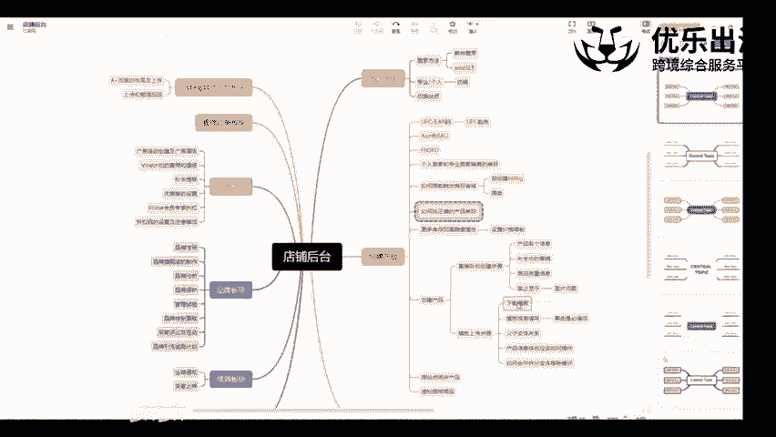

我们打开后台的目录，添加商品页面。目录添加商品页面要选择我正在上传文件来添加多个商品，通过这个上传文件来添加多个商品。

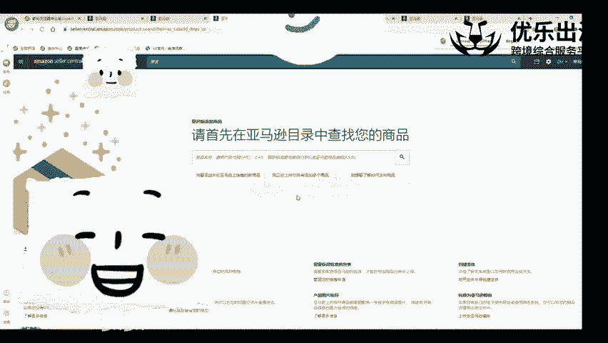

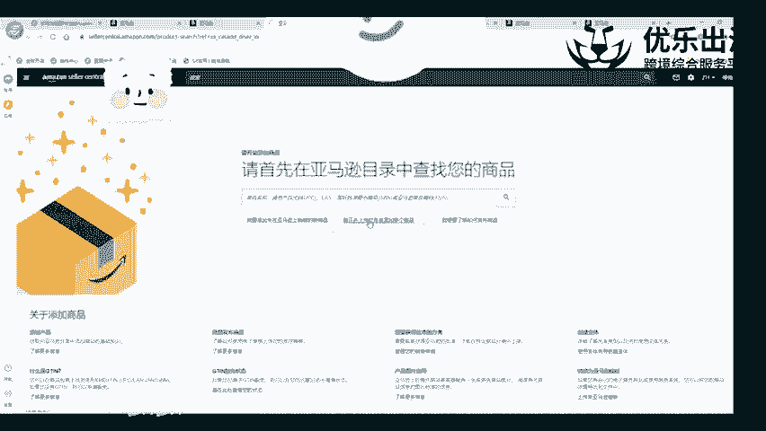

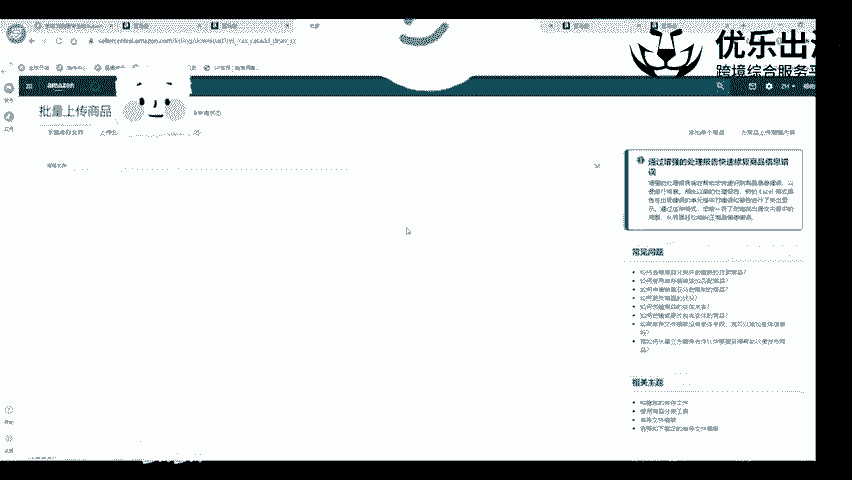

然后点击进来之后呢，然后我们在这里去还是依然。因为我这边的话就尽量的是通过英文的一个描述嘛。通过英文的一些描述，我们去前台啊我们去前台打开这个产品所在的类目啊，所在类目从左边栏可以看到这个类目路径。

然后我们按照这个类目路径一级一级的往下去进行筛选啊，工具栏。然后接着是工具，接着是化妆，接着是睫毛，接着是这个。最终是这个，然后就可以看到把这个啊基本上就下载下来了。下载下来之后呢。

我们可以在这里选择我们的一个表格可以同步的站点类型。我建议大家就是单独进行选择，就是美美国，我们就选择美就是美洲我们就选择美洲欧洲，我们就选择欧洲啊，你独立的一个表格。

因为它有具体的一个情况还是不一样的还不一样的。我们生成这个表格之后，打开这个表格的模板链接。

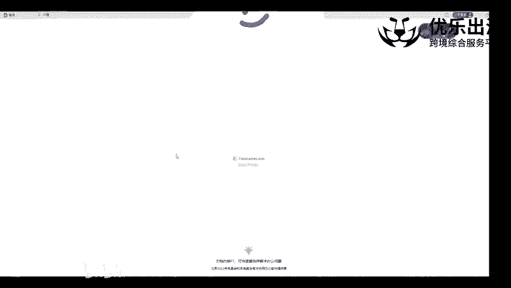

打开这个表格的模板链接，然后在这里。啊，打开template啊template这里去进行我们产品的信息的编辑。进行我们产品信息的一个编辑。那么信息编辑的话，上传产品应该如何去上传呢？

在这里我们首先选择这个类目啊，大体的类目到底是什么，这是第一点。选择完类目之后，这里跟我们刚才所讲到的SQ是一样的啊，所讲到的SQ是一样的。我们的附体可以写lashes这样的有个一个直接大写的一种形式。

那么我们的子体的话，可以去写上我们那个，比如说睫毛，加上我们的一个产品黑色，再加上我们的产品可能15毫米，再加上我们的产品可能是。有一个其他的一些款式，比如说是呃其他一些变体。

一般来说都是两个变体就可以了。然后allashes。然后杠白色。白色再杠15毫米。这种，然后再接下来可以去选择一个，就是可能还会有一个其他的一个呃变体关系嘛。那么我们可以就是nlash。杠black。

到1312毫米。啊，12毫米这种。白色。我们也直接复制下来。做12毫米，这样的话就是有两种不同的一个变体。第一个变体是颜色，黑色和白色。第二个变体是尺是长度啊。

15毫米和12毫米这个长度其他的我们就先不写。我们主要是跟大家去做一下演示哈。然后品牌这里啊品牌这里根据我刚才。给大家讲的那个进行一个操作，就是我们这个产品是属于什么类型的啊。

就是我们产品的话就是报错的话，我们可以提前用一些无品牌，或者说是一些NPNC啊，就是品牌备案之后，我们可以直接在这里选择我们的个品牌进行操作。刚才就选择的NP嘛。NP我们就直接选择NP操作。

然后包括附体这里也需要有啊也需要有。然后在这里呢选择UPC码，把我们刚才购买的UPC码去填上去，在这里跟大家去提示一下附体可以不用填写UPC码啊，附体不用填写。但是标题附体一定是需要填写的啊。

附体需要填写我们的一个产品标题啊，工厂工厂这里的话，就跟刚才说的一样。如果我们接下来要去注册品牌这个点的话，接下来我们要去注册品牌。那么我们可以啊在这里提前写上我们要注册的品牌到底是什么啊。

提前要写上我们注册品牌是什么？到时候我们品牌下来之后去更改品牌的时候，更改这个产品实际的品牌的时候，会相对来说容易一些啊，这算是一个小技巧。

然后接着就是我们的一个产品的一个类型啊，我们的产品的一个类型，包括工厂这里附体可以写上可以写上以及产品的一个属性啊，就是选选择克重啊，选择克重。然后我们把我们的克重填上去。在这里啊产品是否是有会过期啊。

就或者是过敏，我们直接选都。包括这个的de有没有有没有那个那个那个保质期选择no啊part of items这个基本上是不用填的，不用填的，然后往后面。去填写往后面去填写。

后面的话大家可以看到就是主图是什么。

浮图一是什么？浮图二是什么？幅图3幅图4附图5浮图。附图啊这些包括switch imagine，这是switch image是什么意思呢？就是我刚才所提到的，我们这个产品，如果说在有变体的情况下。

如果再有变体的一种情况下，那么我们这个产品。看一下。怎么都没有图片呢？打开这一个。

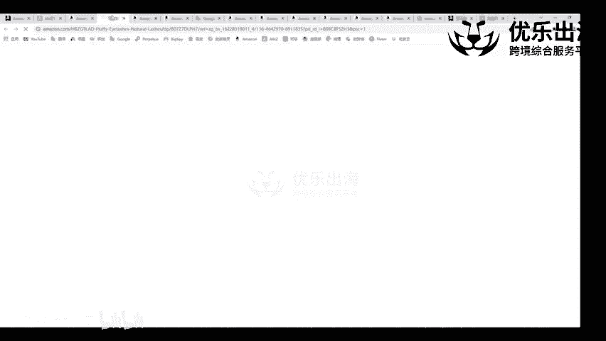

如果再有变题的情况下，我们这里会显示出来图片，那么这个辅图的位置就可以通过这里进行评判啊，这个幅图的位置就可以通过这里进行评判。然后接着呢，这是我们的一个6张图片啊，填写URL的一个地址。

UIL的地址可以直接百度啊，直接百度图片URL地址生成器啊，图片UIL地址生成器，然后生成我们那个地址，然后去填写上去就可以。如果说那个就是很多的都是收费的嘛。我们可以选择把我们的产品。

如果有一些1688店铺的话，或者说有一些那个其他的一些平台店铺的话，我们可以把这个产品传上去啊，传品传上去传上去之后，图片啊上传上传完之后把我们的图片的UIL网址记录下来，提交到这里也可以，也没问题。

接下来这个啊对，刚才过了忘了忽略了一个点啊，就是这个图片并不是必填项。图片并不是必填项。另外一个点就是比较重要的一点就是可能我们这个标红的地方啊，标红的这一栏里面大家可能都会认为是必填项。

但是并不是这样的，有的标红的栏里面，我们是不需要填写数据的啊，有些标红的栏里面不需要填写数据的。因为我们可能就是这个产品的一个编号。

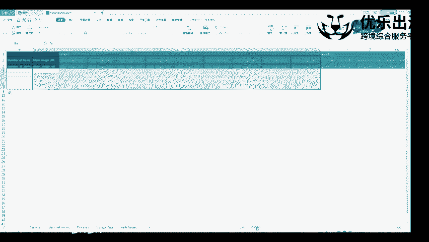

根本就没有，或者说我们就是呃那个这个不需要这一个方面，我们就可以不填。如果他有报错的话，我们可以直接就。补充一下啊，补充一下就可以。像不同的一个产品类目，他们所下载下来的一个模板形式也都是不一样的。

有一些必填项可能在就这个产品的一个编号，在这个类目里面不是必填项，但是在另外一个类目里面就是必填项啊，所以说还是要具体的问题具体分析，我们要需要不断的一个测试。因为我可能是做啊。

比如说我目前在做的服装这个类目，我们通过模板上传服装，这个产品我比较熟悉了。那我知道哪里是需要填的，哪里是不需要填的。但是给我一个汽配的类目啊，给我一个其他的一个产品的类目的话。

那么这时候里面哪些必填项，哪些不是必填项，我还是需要重新再测试一遍才可以重新在测试遍才可以。所以说。就是主要是跟大家去提醒一个点嘛。第一个点就是不并不是所有的标红都是必填项。第二个点就是不同的类目。

它的一个模板的一个形式是不同的啊，必填项就是填写的产品的属性信息也不相同。所以说你的一个呃产品的一个经验的话，上传模板成功的一个经验，其他人并不一定适用啊。

我在这里跟大家只是主要讲解的是大体的一种框架应该如何去做。其中的一些细节的一些点。比如说经常报错的一些点，可以发我可以私聊发，我，就是我跟帮大家去看一下哪些呃这个数据是有一些填错的一种情况出现。

然后接着就是variation variation的话就是父子变体关系，这个是嗯就是比较重要的一个点。大家需要重点去关注一下。如果我们产品确实是有父子变体关系的话。

那么我们要在附体的一个位置选择parent，然后其他的子体的位置选择chilt啊，选择这个那个那个附体父子的一个那个属性。属性完之后呢，附体的SKU大家一定要去注意附体它本身就是附体了，对不对？

既然本身是附体的情况下，我们这后面就不填啊就要空着。然后。子体的他们的附体到底是什么？我们把这个附体编辑的附体去填写上去，去填写上去。在这里我们把这个附体去填写上去，填写上去之后。

这样就能够对应我们的一个父子变体关系。为什么这样说呢？就是我们可以通过一个模板同时上传两个变体，三个变体这种形式。但是我建议大家还是一个模板就上传一个变体。这样呃出现报错的话比较好区分，比较好区分啊。

附体的话，我们就直接就呃选择就是后附体后面不呃不选择，然后子体后面填写附体SKU啊，然后接着就是variration呃variration。Relationship。

reship的话就选择oration啊，变体关系，就是它有变体关系。然后变体关系的话是选择什么呢？就是可能可以选择sign name，但是我们是选择一个颜色，一个呃毫米一个尺寸。

那么我们可以选择s name color name，然后把这些全部都填上去啊，这附体的这里也不用填附体这里也不用填。然后呢，接着就是我们往后拉看一下这里非常重点的一个点。

非常重点的一个点更新部分更新和删除啊，update就是更新嘛啊，上传更新partial updateate就是部分更新delete就删除。如果说大家可以想一下啊，就是这个产品是不是后台现在还没有啊。

后台是不是现在还没有这个产品。那么我要新上传产品的话，后台从无到有的一个阶段，我要去选择update。不要去选择upate这个选项。那么在后台已经有了这个产品，我要去更改什么呢？

我可能是要批量去更改所有产品的一个属性，批量去更改它的一个标题，或者是批量更改它的一个产品一个属性的话，这个后台链接已经存在了。

链接已经存在，我只是去更改它的里面的一些详细的信息。那么这时候我们就要选择paial update部分更新。啊，部分更新。然后如果我们要删除这个编题的话，我们可以直接选择delete删除啊。

直接选择dele删除。另外一点就是我们可能有。十个变体啊，我们产品有10个变体，但是我要修改5个变体的一个信息，那怎么样的啊，那怎么样的？就是只把这要修改的5个变体信息填上去就可以了。

只把这要修改的5个变题信息去填写上去，填写上去之后。填写上去之后，我们的附体要选择p update啊，子体需要去选择p update啊，这是那个跟刚才是一样嘛，就是pa update部分更新。

另外一个点就是我们需要在这个附体里面，就本来有10个变体的一个情况下，我们需要在增加5个变体。那么这时候的话我们就需要在把增加的变体填上去。我们原有的变体不需要去填，不需要去填。

不需要把我们所有的一个产品变体都填上去，不需要哈，然后接着就是附体去选择pa update部分更新。为什么呢？因为附体是已经存在的，附体已经存在，我们去选择部分更新啊，就可以了。不要千万不要选择更新。

如果说我们去选择更新的话，那么之前原有的10个变体全部都会消失掉啊，全部都会消失掉，变为不可收库存变。不可是互存，然后新增几个变体啊，新增几个这个我们要做的5个变体。

这个所以说一定要切记我们在原有的变体下面增加我们子体的一种形式的话，附体一定要去选择pa updateate部分更新，然后子体是不是从无到有，对不对？就是附体已经存在了。但是子体的话。

我们是要新增的一个情况。那么这时候的话，我跟大家去说，我们就可以填写update啊，填写update的一种情况。这是我们这个包括我们上传产品以及我们更新产品啊，以及我们新增变体。

这三种形式我们应该如何去填我们的父子变体关系啊，父子变体关系再跟大家去过一遍，上传从无到有，全部都是push update啊，p update。如果说是我们要批量更新我们变体里面的信息。

那么我们全部我们把附体和连带我们需要更改信息的这些呃这些链接啊，包括他们的一个就是具体的产品信息去罗列上去之后，全部选择puch update，这是我们要选就是不批量更新我们的一个变体的一个关系数据。

然后如果说是在原有的附体里面新增几个变体。我说比如说我要去新增颜色，或者说是新增啊我们的一个产品的一个呃尺寸。那么附体已经有了选择p update子体，我们选择update更新啊，这是这一点。

part number也不需要填啊，description长描述我们可以填一下啊，可以填一下。记住一下附体，除了这个变体关系以及前面的这些数据之外，包括这个那个那个名称也需要填哈，名称也需要填。

其他的都不用填啊，附体是这一点，其他都不用填，然后模型也不需要填。然后接着就是5点描述啊，五点描述123。

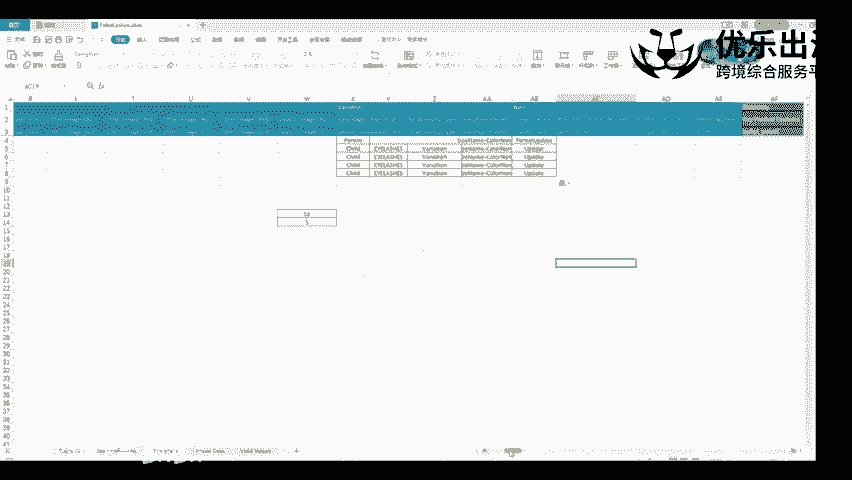

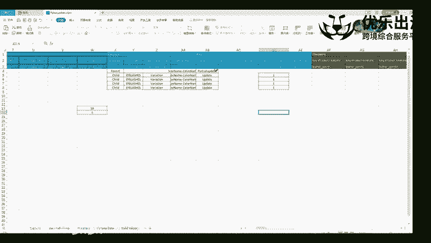

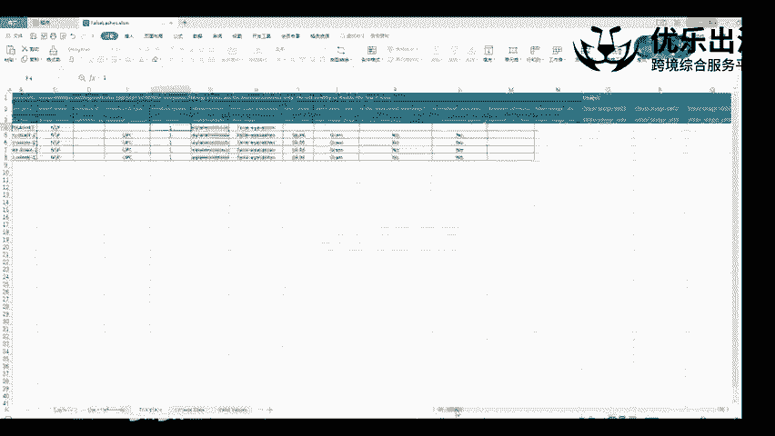

4。让批量拉下来。如果说我们的变题比较多的话，用这个。用这个模板去上传是非常快捷的非常快捷的。我们可以直接批量拉下来，把我们的数据拉下来。如果说不拉的话。

那么我们只能说是后台挨个去上传我们的一个产品的一个属性。以及我们的一个数据。接下来就是啊我们的一个关键词，这些关键词的话我们是没有办法去用的。

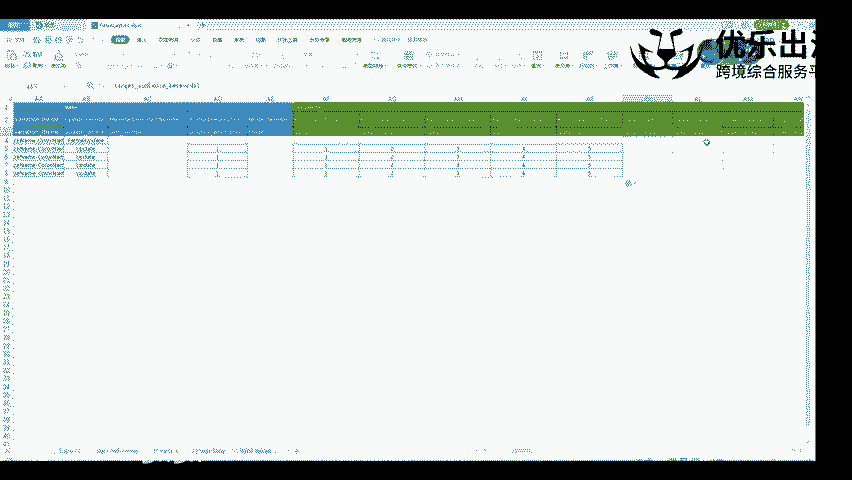

直接有一个。general keyword通用啊那个通用关键词这一栏。这栏的话我们可以去填写我们的一个关键词。啊，进行关键词。接着就是sign name color name啊。

sign name和 color name这个位置不同的类目，它的位置也不一样啊，它的类它那个位置也不一样。所以说我们就是可以直接就搜索。直接就搜索。S name。去查看一下啊，这个变体到底在哪里。

然后我们sign name的话去填写什么呢？就刚才有1个1个15毫米。对不对？然后上面也是15毫米。就是12毫米。是2。

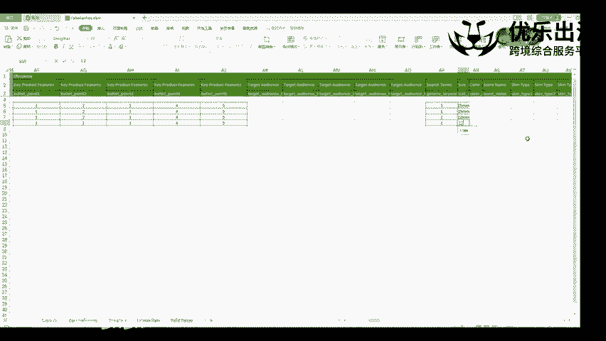

啊，就这种颜色的话，like。What。B。White。呃，一定要去记得哈，就是不管是从大小写还是那个这个名称，编辑的名称全部都要一样，全部都要一样。

另外一点就是包括color这里或者说size这里我们可以起一些比较有艺术性的一些文字。比如说是呃就是那个。还那个蓝色的话，海天蓝啊，就是说什么白色就是米白色，就这种的话会就是让客户感觉会更好一些啊。

会更好一些。然后后面的等等的一些所有的一些东西，我们可以都忽略啊，我们可以都忽略。包括这个有一个是包装包裹尺寸就我们产品的尺寸，包裹的尺寸我们都可以直接去那个后台直接去编辑出来啊，编直接去编辑出来。

都可以没问题。如果说我们是直接上传FBA的产品的话，就是我们的一个呃这个这个数据是比较比较比较长的啊，就是我们的一个就是变体是比较多的。那么我们挨个去填写我们的包裹信息也并不是特别好啊。

那么我们可以看在这里啊产品的一个详情啊，包括FBA里面啊FBA里面我们包裹的一个详情重量都可以去填写批量的去填写，这样会省我们很多的一个麻烦。

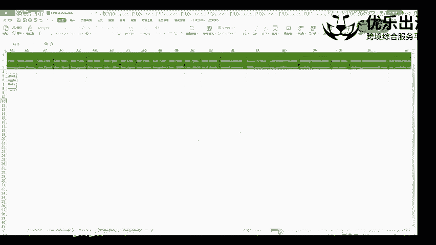

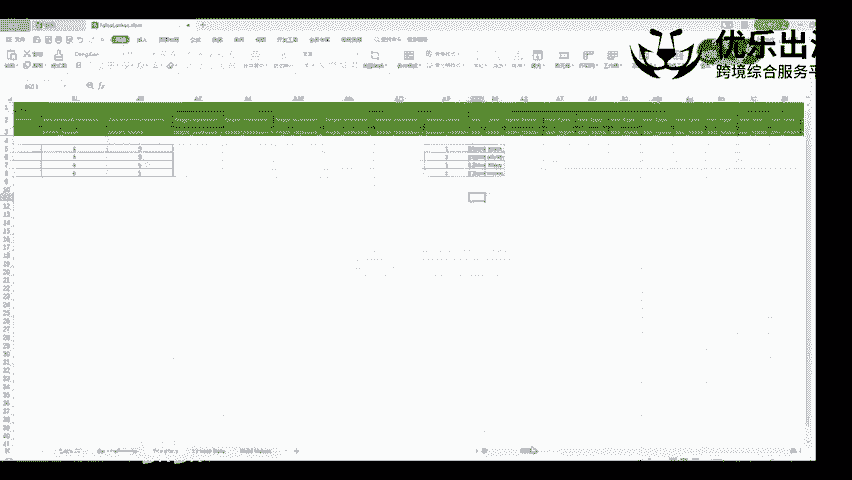

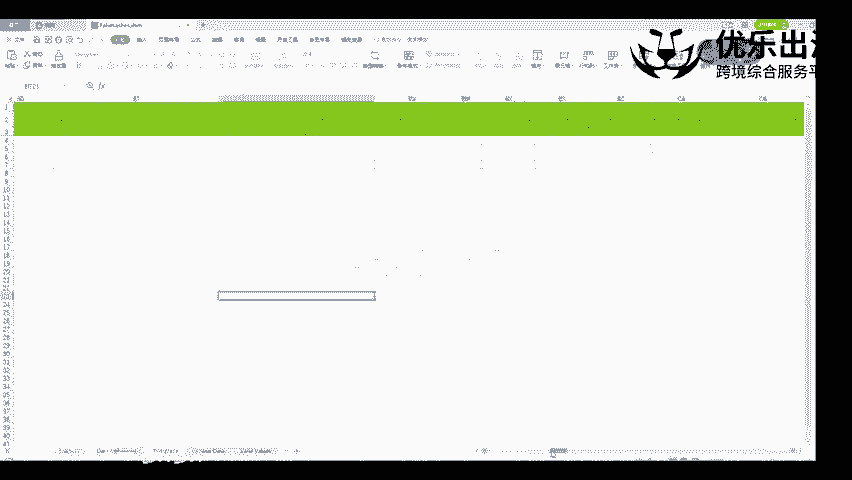

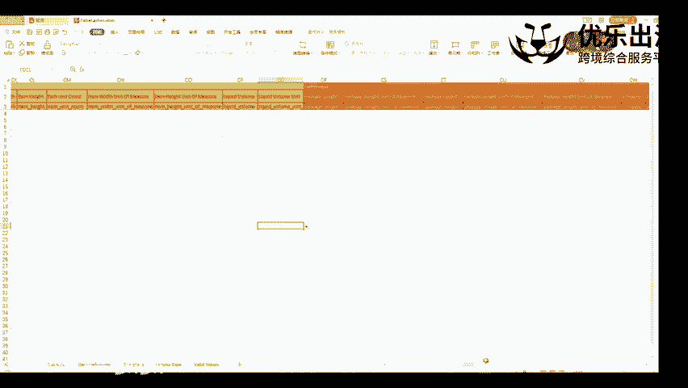

会省到我们很多的麻烦。这个的话就是如何去上传产品，如何去做我们的这个产品的一个表格编辑啊，大家能够理解吗？接着哈就是。😊，我们这个是下载模板以及模板信息填写必填项。必填项的话一般都是标红的。

但是标红的里面也有一些并不是必填项，还是看个人的一些经验吧。另外一个就是刚才也讲过了，我们的一个父子并体关系到底是如何的一种情况。如何去啊设置我们的一个父子变体关系啊，产品信息修改应该如何操作啊。

应该如何操作这样的一种形式。我们刚才基本上都已经带大家过了一遍啊，都已经带大家过了一遍。那么接下来的话，就是我跟大家去继续去讲解如何去合并拆分我们的变题，移除差评，达到移除差评的这种效果。

那么这一点的话就是。

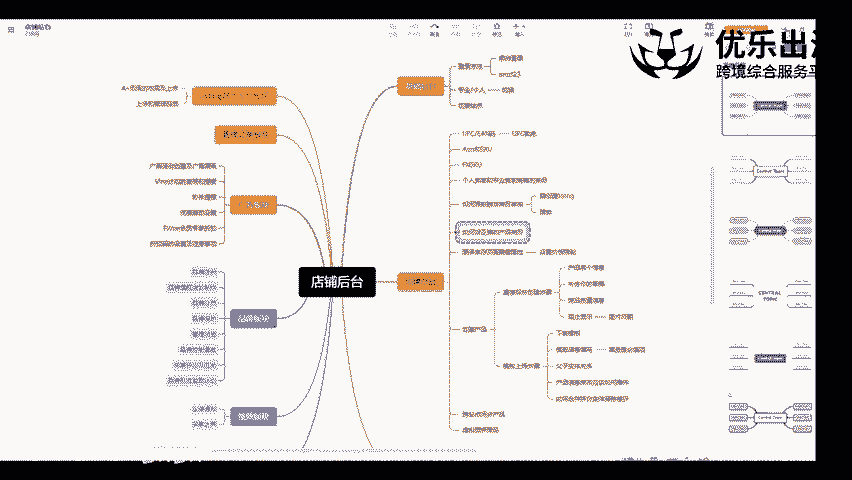

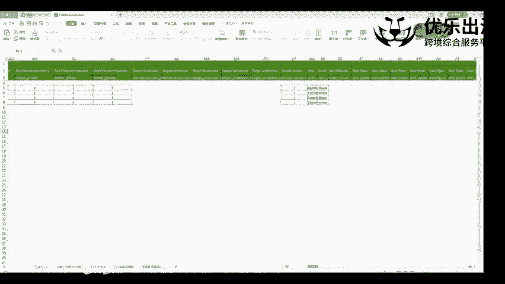

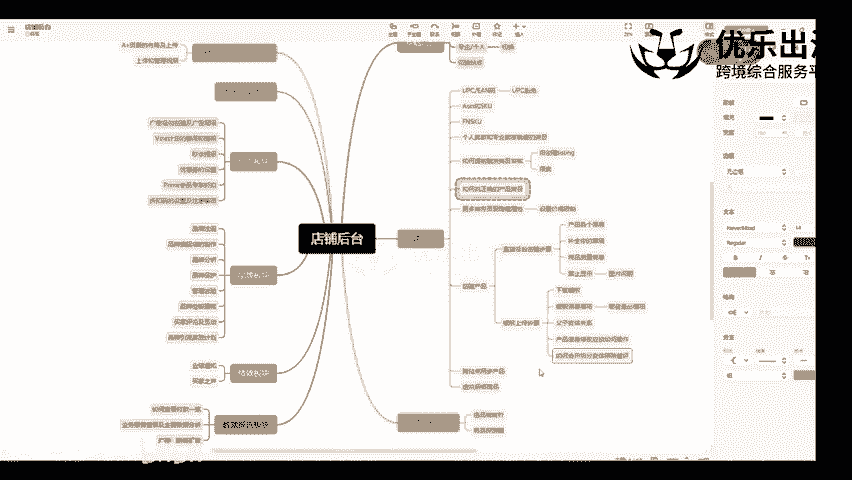

如何合并拆分我们的一个辩体，我跟大家去讲一下。首先。我们想要把。A和。B。这两个。变体去合并起来啊，去合并起来。我们应该如何去合并啊，可以跟大家去想一下，因为。主要是分两步，第一步打散，第二步合并。

第一步是打散。打散变体。具体操作手法就是删除附体。删除附地。然后第二步是合并变体。然后表格。创建新的。表格合并。啊，两格合并。然后这里又分为两种情况哈。第一种情况是我这里说的情况就是两个链接全部打散。

重新合并到里面去，重新合并到里面去。另外一个就是什么呢？就是B链接打散，合并到A链接里面去啊，合并到A链接里面去，这是两种不同的一个操作方法哈，就是我们先说这个B链接只打散其中一个链接，这因为省事嘛。

对不对？省事之后，我们去合并到A链接里面去。但是这种情况只适用于啊一种。形式就是B链接A链接里面它有两个变体，还有两个变体。B链接里面也有两个变体，它们这两个变体的。规格就是都是尺寸呃，颜色都是尺寸。

颜色或者尺寸图案。那么第一个是完全变体属性一模一样，第二个是变体里面的子体属性也是一模一样。15毫米black啊，就是完全一模一样。这种形式的话才能够很好的去打散合并进去。也就是说A链接里面只有白色。

啊，白色12毫米，白色15毫米在哪呢？在B链接里面，然后这个A链接里面也有15毫米这个变体关系啊，变体属性。那么我们就可以把B链接去打散合并到A链接里面去啊，是这种。然后另外一种的话就是。

B链接它是它属性是12毫米啊，或者说怎么样需要去增加一个新的一个变体变变体的一个属性值。那么最好是两个都打散。打散完之后，然后B合并到A里面去，或者或者说是新建一个变体。

去把这两个呃这个产品的属性全部都呃合并起来，全部都合并起来。是这样哈，然后首先我们就是刚才B链接合并到A链接里面去的话，这个是比较简单的。就是我们在讲这个的同时会直接带出来这个实际操作。

我们先讲第打三变体啊，打三变体操作很方便，删除附体就可以。我们把这个栏目全部删掉啊，全部删掉，只保留附体，附体的属性就写个SKU。然后这里选择as，因为它是已经存在了，对不对？已经存在了。

我们把附体的as填上去品牌填上去，然后标题填上去属性填上去。

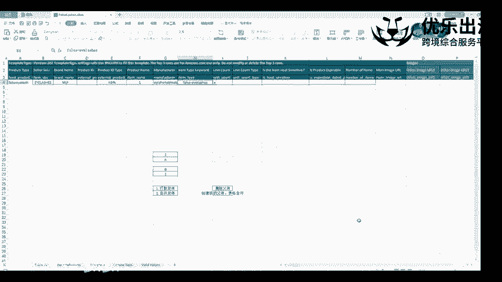

然后这个product呃那个fe也填上去，填上去之后，父子变体关系也都不用填，全部删掉，删掉，这里选择delete。啊，这里选对了，后面都没有后面都没有这里这个表格就是直接打散删除附体的一个表格啊。

然后我们直接在后台哈。

我们直接在后台，我们可以看到这个产品的一个附体吧。假设它是附体，我们直接在这里点击删除商品和报价，也可以把它删除。但是有一个问题呃，有一个问题是什么意思呢？就是。

🎼我们在后台删除的所有的一个操作没有记录，就是很难是有记录的。我们把这个附体删除之后，我们是没有任何的一个记录的。大家能够理解。比如说我误操作了。我误删了一个产品的一个辩题啊，我误删了一个产品的辩题。

删了之后呢，我想要去还回来，还回来，我可以联系客服去把这个链接找回来。但是说实话。客服帮助我们去找回来这个链接，需要我们产品的具体的A3号啊，SQ号SQ和AC。就需要把这些信息给到他的。

那么我们如果说这两个没有记住怎么办啊？没有记住的话，这两这个辩题可能就直接就找不回来了。我们误删就误删了，找不回来了，就这种情况出现。所以说我们所有的一个操作手法尽可能的是通过模板上传。

因为我们通过模板上传所有的一个呃操作都会有记录啊，都会有模板上传操作记录，然后模板上传操之前上传的模板，我们也可以重新下载下来。

就因为现在嘛现在美国站的话好像是没有办法下载下来这个表格式的一个呃模板的一个形式了，就只能是TST文本的。但是我们可以也可以通过这个点，也就是说我上传了这个模板会有一个模板编号啊。

会有一个模板编号可以看一下这里。在这里。啊，模板编号的形形式出现啊，就这里。然后呢，这些模板编号啊这些模板编号我们直接比如说这个模板编号导致我去误操作了。误操作的话，我把这个copy下来啊。

就是联系亚马逊的一个啊库存模板的一个团队，然后让他们帮我们把这个文件恢复，把这个文件恢复啊，是比较呃比较不错的一种形式。也就是说通过模板，我们所有的一个操作都有记录，并且可以联系模板团队。

就是追回我们操作失误的一些部分啊，是这种。然后第一个就是打算变题，就这种就是打算变体的这种啊方法。第二个就是合并变体，合并变体。

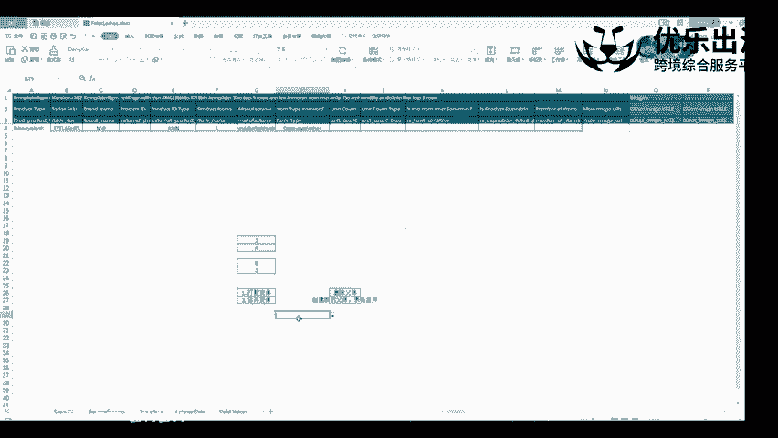

我们重新。把这个去拉出来，拉出来之后打散遍体之后，所有的这个产品都是已经是就是全部出来的一种形式，对不对？所有的变体形式全部都是出来的一种形式。那么这时候的话我们可以通过合并变体合并变体的话。

一定要去记得SQU和之前的删除的老的链接的附体的SQ是要完全不一样的啊，我们要去改一下，比如说变成LS2啊S2。然后在后面就是这些就是上合并的时候呢，我们只填一些必填项就行了。像这些数据都不用填。

因为我们的后台已经有这些属性记录了，包括我们的这些五点描述全部都不用填啊，全部都不用填。但是这些也不用填。但是变体关系一定要填，啊，变体关系一定要填，接着就是我们把这个。

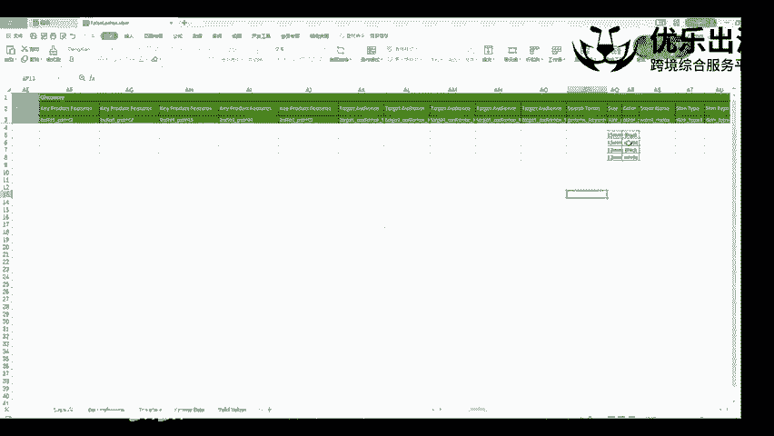

附体变成附体2创建的新的一个附体啊，创建的一个新的一个附体，这是这一点。另外一点的话就是所有的一个子体都是已经存在的，但是附体是新创建的。我们要把附体选择update，把子体全部填写成paup。

这就是整个的我们要去合并就是。打散之后和重新将两个链接合并起来啊的一个具体一个操作方法创建新的附体表格合并啊，创建新的一个附体表合并。

这里的话尽量都可以填A都可以填A因为我们用因为我们选择的UUPC后面嘛，可以填A号，把这些A号全部填进去之后，然后根据这种操作手法啊，创建一个新的附体，把这些所有的字体合并起来，容易出错的点。

就是第一附子变体关系啊，第二，这个数这个更新删除部更新和部分更新的问题。第三个就是我们的一个变体关系的问题啊，就是这里是比较容易出错的。大家需要仔细再仔细。

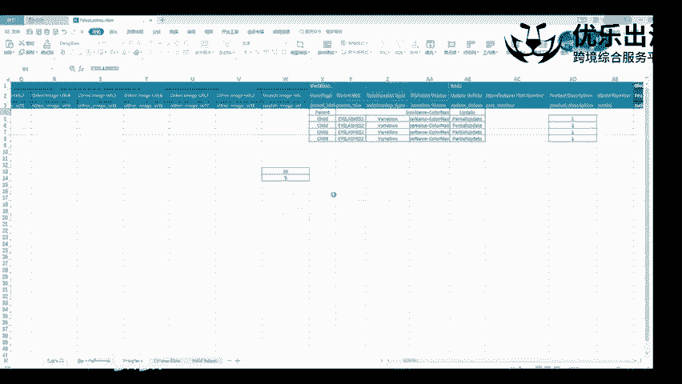

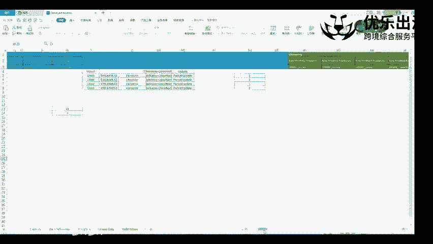

然后另外一点呢，就是大家可能会比较疑惑哈，就是我们去做这样的一个目的到底是什么啊？非常用的比较多的一个就是我们的一个产品的一个差评的点。我们可以通过这种形式将我们的差评移除出去啊，移除出去。移除出去的。

首先是我们先去看一下哈。一星，我们打开一星。打开完音形之后，可以看到哈，这里有一个变题关系style啊就是。

MDF12MDF12MDF12MDF12MDF12就这个变体MDF12。

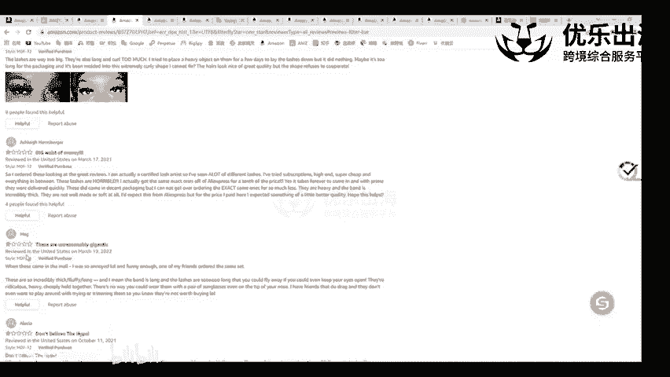

是他整个链接里面的。其中一个变体FDF10这个是FDF12啊，这个变体。他。为整个链接带来了大部分的一个一星差评啊，可能说基本上差评都是它带来的都是它带来的。那么这时候的话。

我们可以选择把这个变体移除出去，移除出去之后，差评会跟着变体走啊，差评会跟着变题走。也就是说这个整体的一个reing可能会下降了，从27000变成2500，或者是变成2万。

但是我们的一个星级可能会回到五星啊，五颗星或者说是提高了从四星变成四星半。因为这个评论的一个星级还是非常重要的啊，还是非常重要的。

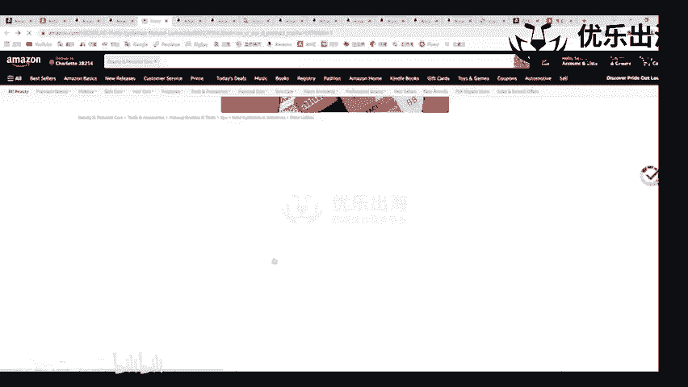

大家可以理解哈，也就是说我们。😊，先去找到通过一星去一星的这个评价，找到我们这个点啊，找到我们这个差评的变体是哪一个。然后我们再接着第一打散删除附体，从而打散整个变体啊，第二，我们去删除。

就我们在合并变体合并变体，比如说哈三个变体里面black15，这个是带着这个呃差评的啊，black15毫米是带着差评的。我们首先第一步把al。

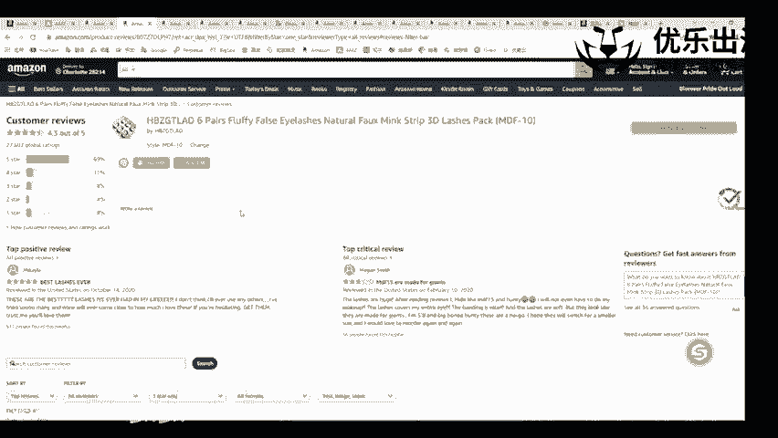

删除删除之后呢，所有的变体全部出来了，而且评价跟着变体走。这时候我们发现就是black15是带着产品的。我们把这个删除。把black15删除，删除之后，我们再创建一个新的一个附体。

把其他的三个去合并起来。然后另外我们可以重新allash。杠啊black杠15毫米，对不对？15毫米杠2啊，我们再去创建一个新的一个电体，去把它这个空白的位置给补上嘛，对不对？

然后后面的一个数据都可以是一样的一个数据。

都可以是一样的一个数据，是这种操作。然后这这种形式的话，就是把之前的那个啊black15毫米这个产品的差评移除了出去。移除出去之后。它会进行单独的页面显示。

比如说这个产品可能就是这个卖家把他这个差评的这个点给移除出去了啊，移除出去之后，我们直接降价，从13美金降到3。99美金，或者说是降到几美金。然后快速处理完处理完之后，或者说是我们把这个。库存移出来。

移出来之后，我们重新去那个发到新的，重新贴标，发到新的链接里面去。新到编辑里面去，这就是整体的我们如何去通过这个模板合并拆分变体，把我们的差评给拆出来啊，把我们的一个差评给拆出来的一种方法。

一种具体方法，希望能够给到大家就是非常有用的一个帮助。如果大家是用的是做的多变体的一个产品的话，这个模板一定要学会一定要学会。然后并且通过模板来合并拆分变体的话，这个操作手法也一定要学会。

但是不建议大家经常去使用。因为如果说我们频繁的去拆分合并拆分合并的话，那么会被亚马逊检测到，从而对我们的一个店铺进行限流啊，进行一个警告。

