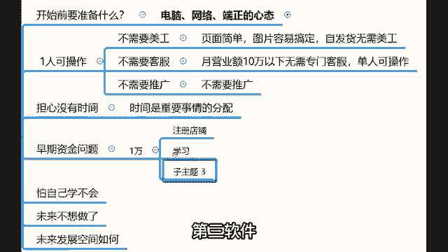
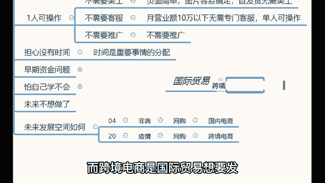

# 【2024年9月最新版】新手亚马逊跨境电商运营合集，亚马逊入门教程（纯干货，超详细） - P17：17、如何开始行动 - 疯往呗催哇 - BV1THsSeuEss

还有什么不太清楚的地方，可以在公屏上打一个呃公屏上讲一下，我可以帮你们做一些疑难问题的解答哈。那么先给大家做一些常见问题的解析哈。😊，呃，首先的话呢就是做跨境电商需要准备什么东西。

那么做跨境电商需要准备电脑网络以及一个端正的心态啊，饭要一口一口吃，路要一步一步走。做以亚马逊的话呢，千万不要抱着说一夜暴富的想法去做啊，以一个这个平常心去对待啊，这样的话。

你就可以把这个事情越做越好啊，你比如说我现在对吧是不是有一些成绩了嘛，我一直以来做亚马逊就是这样的一个平常心啊，那么呃至于做跨境电商需要团队嘛，我给大家去讲一下这个问题啊，首先做跨境电商不需要团队。

一个人就可以操作。因为第一个你不需要请美工，整个图片页面很简很简单，图片也很容易搞定，所以说你不需要请美工，第二个你不需要请客服，有百度翻译有道翻译的情况下啊，你也不用去管客服。😡。

那么客服这块的话呢。还有ERP总在，你请客服也没价值，第三个，你也不需要请推广，对吧？亚马逊的自动流量推送机制叫做A9算法。所以说这个你也不用请推广。哎，还有一个问题，刚刚忘了讲了。

说老师如果说呃那些不这个呃找那种支持一件代发的，是不是不用管发货了。对，找那些一件代发的，你不用再管发货了。那有些人说老师我如果说做的是自己的产品的话，那这个国际物流这个我我家里边比较偏僻啊。

我农村的对吧？我是农农农农农民宝我我是农村的孩子，那我家里边比较偏僻，我这个附近没有什么国际物流怎么办啊，这里我忘了给大家去讲了，这是一个误区哈，什么误区的这个国际物流啊？😡。

国际物流跟快递不太一样，他们不是上门取件的，你知道吧？这个国际物流在广州、深圳就是广州。😡，深圳。还有福建这样的一些。就是这样的一些林靠近海边的城市，会设置一些中转仓。😡。

那么就是你要卖的这款产品之话呢，就要你你要把你的产品。😡，发货到这些国际物流公司的中转仓，再由这个中转仓代为发货给你国外的客户就行了。所以说这块的话，如果说你卖的是自己的产品的话，对接的这个国际物流啊。

就是你们不用担心自己家里边比较偏僻啊，这个事儿怎么办？没关系，这个国际物流的话，他不也不管你偏不偏，他也不上门取件，都是把它发发到这个中转仓，再由中转商往外发的。所以说这块的话，你们不用担心啊。

就至于你家里边住哪，没有没有没有关系的啊，这块没有担不用担心。😡，それは。那么做亚马逊的话，就是你如果说你们做亚马逊的话，可以就是如果说你们现在想要做这个事儿啊，可以在公屏上讲一下。

你感觉你做亚马逊的优势在于哪些地方，其实这个优势的话，我给大家去讲哈，这个优势的话，你可以自己思考思考自己的一些优点。比如说呃就像有时间比较充裕，有个同学就比如说有些同学说老师我是一个就是呃全职宝妈。

对吧？现在神兽也已经开学了啊，小孩子都去上班了呃，不是都去上学了，对吧？我在家里边也没事，我的空闲时间很多，这就是你们的优势，就你一定要找到自己的一个优势，就这就是你的优势。如果说你时间很多的同学。

做亚马逊就很很适合为什么你你可以把你的时间充分的利用起来。😡。

对不对？你可以把你刷抖音玩游戏的时间去充分的利用起来，去去自己运营一个店铺。那么这样的情况下，你的不断的累积可以给你带来这个丰厚的收益的。😡，对它可以给你带来丰厚的一个结果和收益的。

所以说那么这就是一个优势。还有一个优势。还有比如说有同学说老师，那么我们这个我们是属于这个想要改变自己命运的哈，就是我的企图心比较强，我感觉自己的收入不够高。我想要提升自己的一个收入。

如果说你的这个企图心比较强，这也是一个优势。😊，对吧你感觉自己的收入不够高，你想要去改变这样一个情况，什么样的优势呢？你你的压力会比原来大一些，对吧？你做这个事，你是更渴望取得成绩的这也是优势。

那包括说有些东西老师我是工厂的，或者说老师我有一些电商经验的，这些都是你们的优势。你明白了吗？所以说做亚马逊这个事啊，不用去担心其他的东西啊，就是你要明白自己哎。😡，真正想要做好这个事儿，哎。

该怎么去做啊，那么。😊，呃，至于有同学说老师，我担心自己这个呃没有时间啊，我认为时间是重要事情的分配。我来问一下啊，今天听了我的直播课的各位同学，感觉自己愿意每天花个一两个小时。

或者说两三个小时的时间去学习运营，实操一个店铺啊，一个月不说多少，赚个七八千八九千甚至更高的一个被动收益的，有没有愿意的，有愿意的公屏上打个一两块钱。😡，所以说。😡，那么。时间是重要事情的分配。

一旦你在这件事情做出来成绩之后，你绝对是有足够多的时间愿意花在这个事上。所以说你们不用担心自己没有时间做啊，只要你花了时就是做出来一些成绩之后，你绝对是有大把的时间的。

那么至于早期做亚马逊的一个资金问题啊，就是前期的话，资金准备啊，大概在1万块钱左右就可以。😡，我刚刚有介绍过啊，就是1万块钱需要干什么呢？首先这1万块钱可以帮你注册店铺。😊，注册。注册。店铺。

第二。😡，学习。第三，软件。第四，你的流动资金。

所以说做亚马逊不需要说准备特别多的资金储备哈，就1万块钱左右就够够用了哈。😡，1万块钱足够用。那我刚刚也有看到有一个同学说，老师，我们是家具家具商，打算做打算做家居产品跨境。呃，这个物流这块的话。

到时候我帮你对接海运公司，物流费用的话可以大大的下降。如果说就是你们要是做家具的话，走海运就行了。家具的话，走海运价格就挺便宜的，因为会相对会比较低了。就是在你的承受范围内的。😊。

那么因为利润足够大，所以说这个费用是你能够接受的啊。然后至于这个资金的问题啊，就前期做亚马逊的话，普通人啊1万块钱左右就可以了。啊，店铺学习软件流动资金。所以说启度资金就大概在这样的一个数额。

那么也有同学说老师，我担心自己学不会。😊。

来，我问一下啊。首先今天我讲的内容，你能自己认为自己能听懂了，并且学会了的同学公屏上打一个一。😡，就是这我今天讲的内容，你听懂了，学会的公屏的打一个一。😡，如果说我今天讲的内容你没听你没学会，就我。😡。

我这个。呃，讲内容你今天你都没听懂。😊，嗯，我我说句那个什么一点的，如果说我今天讲的这个内容，你没听懂的情况下，你可能确实是不太适合做这个事儿。😡。

我说的现实啊，因为这个东西怎么讲呢？就像我的腐化成功率哈，我自己的个人腐化成功率可以做到90%，就没有人可以做到百分之百的。就我可以保证10个人听我讲课，9个人能够听懂。但是有一个人听不懂。

这是很正常的事儿。你明白吗？就这个不要去强迫自己，如果说你听我今天讲课的内容你能够听得懂，就证明至少这个事你是能够做的。😡，就这个事你是绝对可以做的。因为我今天讲的内容你可以听得懂。

后续讲的所有内容你也都可以听得懂。那不难，本来他就不难，就是本来他就不是说特别复杂，并且拍掰开的揉顺的讲的话，他就不是特别复杂。那么为什么我说90%，没有任何人可以做到百分百的，就是反正跟我学习的学员。

90%以上的学员都可以把自己的店铺运营起来。😡，听明白了吗？没有任何人可以做到百分之百的那有同学会时候，老师呃，我虽然说没有听没有没有听懂，但是但是我特别想做，我要去去选择了做这个事啊。😡，哎。

也投入了这1万块钱的资金，对吧？如果说你投入了这个资金之后，哎，你说我将来有一天不想做了，没关系。如果说有一天你不想做了，在网上这个。😡，就是我可以带你进来，我可以带你出去啊。

网上有一个网站叫做异店无忧。😡，这个一店无忧这个网站啊做了其实是一个非常老的网站，九年专注于网店转让。哎，这个网站是干什么的？我们点进来看一下啊。😡，那么这个一店无忧这个网站。

你看什么天猫店、淘宝店、京东店、拼多多这些网站都可以让网直接网店都可以在网站上转卖的啊。亚马逊店铺也可以。😡，比如说我们在这里搜索。搜索亚马逊。那么搜索亚马逊店铺。

你就可以看到亚马逊店铺可以在网站上买卖的。你看比如说它的一个这是一个2021年新开的日本站。😊，3000块钱就一个站点，3000块钱，这是1个2021年新开的北美站，4000块钱，这也是新店铺。

这有1个2019年的老店铺，7000块钱。😡，然后还有这是2021年的新店铺，也是北美站，也是4000啊。欧洲站2021年的老店铺8000块钱。然后北美站加澳大利亚站，这是2021年的新店铺。

8000块钱。😊，听明白了吗？有一天你说你不想做了，这就是一个资金回笼的方式。😡，可不可以帮你们回笼资金呢？完全是可行的。所以说啊这个带你进来，我可以带你出去，有明白了吗？所以说这就是我做人的原理原。

就是做人的原则，就是这个样子。你们会发现整一个做在讲课的时候，你们会发现我讲课的时候，我有给你们塑造什么东西吗？就我讲课的时候，我从来没有给大家去讲过说对吧？

这个我我的某一位学员跟我学习之后做来什么样的一个成绩，然拿出来几张照片给大家看一看，我没有做这些事儿，为什么？😡，为什么我不会讲这个东西啊？因为我希望的是用自己的实力去征服各位。😡。

甚至我自己的店铺都不愿意去给你们展示。对吧？你们听完我的店铺之后，感觉这个东西适合自己，你就可以去做。😡，对不对？各位，所以说这就是我为人的处持的方式。我希望的是拿出来最真实最直接的东西给到你们。

是你们需要的，你们就拿走，对不对？所以说这块你们就完全可以放心。那么至于亚马逊的未来发展空间如何呢？😡，2004年那个时候发生了一个事儿叫做非典。非典的时候，中国人不敢出门，所以说网购开始兴起。

那么国内电商。😡，就进入到了他的一个高速发展时期。那么同样的道理，2020年也发生一个灾难叫的疫情。😡，非典的时候，中国人不敢出门，疫情的时候全世界都不敢出门，全世界的网民都在网购。😡。

那么跨境电商就迎来了他的高速发展时期。

是不是？所以说我想要告诉各位的是国际贸易。😡，绝对是接下来发展的重中之重，而跨境电商是国际贸易想要发展最主要的助推器。它的未来发展空间如何？用一句话总结，就是跨境电商行。

跨境电商这个行业是接下来的10到15年的时间。我可以告诉你，这个东西是非常清晰的可以预测到的。接下来的1年15年的时间，绝对是跨境电商发展的黄金时期。😡。

听明白了吗？它是我们普通人能够接触到的行业当中，为数不多，可以让所有人凭借自己的努力，站着挣钱的行业啊，这就是关于跨境电商这个行业的一个未来发展空间。😡。

真正想好做好这件事的核心关键点还是在于你们自己的企图心。😊，就这件事是你是想做。😡，还是一定要做，它是不一样的。你想做一件事跟一定要做一件事，哪个更容易做起来？😡。

你拥有什么样的信念，就会有什么样的行动力，有什么样的行动力，又会产生什么样的结果。不管你过去是谁，也无论你过去有多么大的成绩，有过多少的光环。目前这个行业你想要做出样的结果跟你的家庭背景没什么关系。

跟你的学历也没什么关系，跟你腰包里有没有钱，有多少钱，住在哪个城市长得好不好看，年龄大小，能力强弱，通通无关。😡，他只跟一样东西有关，就是你坚持到底的决心跟这个有1%万%的关系。😡。

