# 【2024年9月最新版】新手亚马逊跨境电商运营合集，亚马逊入门教程（纯干货，超详细） - P20：21.竞争对手分析 - 疯往呗催哇 - BV1THsSeuEss

OK我们接着来看一下我们对于竞争对手分析，我们需要分析哪一些的内容。那么。作为我们打算销售任何产品的时候，都不能进京是这个固步自封的情况下，不看人和别人进京是依赖于我们自己的一种直观的感觉的情况。

去做一个市场的这个产品的销售。更多的我们需要做什么呢？需要去同时考量到我们的竞争对手。只有对竞争对手做一个很好的分析，我们才知道我们有没有能力去做这个产品。那么竞争对手相对我刚才说的搜索结果来说就是。

能够更直接的切入到某一些的产品。我们可以更直接的了解某一些的这个个体的卖家，他们给我们形成一种。对比。只有在这种对比中，我们才能够考量我们是否有这种把握这个市场的这种能力。那么具体来说。

我们怎么去分析竞争对手呢？首先我们要考虑竞争对手的。或者说我们在亚马逊哈更多的应该说是竞品，竞品的listing的一个规模，以及说它的这个。品牌的影响力。那么。为什么要考虑到竞品的一个规模和。

这个品牌的影响力呢，因为我们的实际的运营过程中。我们不能拿着这个非常我们实力方面非常不匹配的这些买家对我们去做一个呃，怎么说的？相当然的选品。举个例子来说，比如说我们在运营亚马逊的过程中。

一定能够听说安可这样一个品牌。那么安可作为中国亚马逊卖家中第一大卖家。然后呢作为移动电源移动电源类目里边。最大的一个品牌。那么当你想销售移动电源的时候，你去把anker作为一个对标的一个标的来说。

那么就失去了一个可行性。因为彼此方面体量是完全不匹配的。你可能仅仅是一个个人，甚至是说是一个。这个小的团队，那么在这种情况下去运作某一个产品，或者说就说运作移动电源产品。那么你和安克来说。

这个是没有具备很好的一个可参考性的。你具备不了他们整体在运作的这类产品的时候，那种呃完整的流程严格的品质等等一些吧。所以说这种情况下，我们在分析竞争对手的时候，我们要选择和我们体量相当，或者说是稍微。

拔高的这些竞争对手。和我们做一个有效的参考。那么除了竞争对手分析竞争对手本身之外呢，我们需要对还需要对竞品的质量、价格以及它的定位的一个分析。也就是说竞品为什么这个。用这样的品质。

他们做的品质是高端的呢，还是终端的呢？以及说是比较低端的产品呢。那么他们什么原因去做？选择准产品。那么他们的选择对我们有没有一定的启发意义，这是我们需要去考量的一点。当然还包括竞品的价格。

他们在这样一种品质。的基础上，他们指定这样一种价格，他们的利润预期能不能达到我们对产品的一种需求。他们的价格区间是否符合我们的选品的一种要求，我们的选品的一种需求。

同时呢还包括他们的产品的定位和我们自己。自身团队的一种发展的定位是否匹配，这些都是我们在竞品的这个分析过程中需要去考虑的几个角度的内容。当然还包括。那么我们再往下细细化的话。

就包括竞品的review的一个分析。那么竞品有多少的review，那么它的review分别是好的呢还是不好，这个好的有多少呢？就是说好新机有多高呢？一计说它的好评都是。

好评中有效的参考一能够给我们提供参考意议的review都是讲了一些什么呢？讲到它的产品哪一些特点。那么他讲到的特点在我们的产品将计划打打造的产品中是否具有相应的一些特点，这是我们需要去考量的。

当然也包括。我们对竞品的review里边一些差评，一星的二星的这些差评，我们去评估这些差评，是否我们能够在后续的运营中能够有效的克服。这些都是我们在review的过程中需要去分析的。当然。

review的整个分析会比较有一个详细的计划，我们会在这个实机的。录屏的演示过程中来给大家做一个简要的分析，做一个相对来说详尽的分析。那么除了review的分析之外，我们还要考量的是什么？

竞品的供应面和仓储情况，需要我们同样去做一个评估。举个例子来说，当我们卖某一个产品的时候。如果竞争对手选择的是原产地，那我们选择的是。靠近我们自己的某一个二级批发市场，这种的选择对我们来说意味着什么呢？

意味着我们没有可能拿到更优势的价格。那么如果说我们没有可能拿到竞更有势的更有优势的价格的情况下呢？我们凭什么能够在竞争对手和竞争对手的激烈的竞争过程中比拼过程中取胜呢。

这就是需要我们去考量对供应链的一个很好的把握。同时呢也要考量竞争对手的一个产品的仓储情况。仓储和物流。那么仓储方面，竞争对手的产品是在中国发货呢，还是是在到美国那边去发货呢？这些都是需要我们去考量的。

是IB发货呢？还是美国海外仓自发货呢？这些都是我们。这个评估。当然你说这个情况可能对于很多卖家来说。我怎么去知道竞争对手的这个供应链和仓储情况呢？其实呢对各类的产品，我们要有这样一个意识。

其实各类的产品相对来说供应链资源都是比较集中的。只要我们确定了去销售某一类产品，然后善于去挖掘就会慢慢的发现哦，原来供应链就在这里。这是我们不要去太在意不要去太呃紧张的一方面。

因为这些只要我们去用心对于精品的供应链，或者说它的仓储情况，我们都可以做一个很好的把握。当然还包括什么呢？我们确认了这类产品，然后我们确定了我们的竞争对手，那么我们就需要去考量竞争对手产品的优劣性。

我们只有知道明确的知道竞争对手的产品的好不好。然后我们才可能在我们自己产品运营的过程中做到更好，或者说克服原来的不好这些地方。那么具体怎么去知道竞争对手的优点劣点呢？这里简单来说，包括两方面，第一方面。

我们可能就是前面已经讲过了，我们通过竞品的review的一个分析，客户会告诉我们。竞品的好与不好。所以说这个是需要我们在选品过程中需要花相当大的精力去做的一件事情。我们只有去。把精品的哎用。

甚至说把多个竞品的review综合在一起，逐条的或者说筛选出来，分别筛选出来一定数量的review做一个评估和考量。我们自然而然的可以发现竞争对手的竞品的优劣点。当然还有一方面更直接的是什么呢？

就是我们去想通过我们自有自己的一些渠道采购到竞争对手的这些产品，采购到之后拿着竞争对手的产品和我们的产品做一个比较。竞争对手的做工怎么样，我们的产品的做工怎么样，竞争对手的包装是怎么样的。

说明书是怎么样的。那么竞争包装和说明书的质量，又分别是怎么样的。这些只有我们把这些内容做一个整体的分析之后，我们自然而然的在对比的过程中才能发现我们的产品是否具有比竞争对手的产品。

更好的点或者说这个能够更上一个层次的方面，这是我们在竞争对手分析方面需要做到的一上面的这几点内容。好，我们接着来看下一页。在前面的讲解中呢，我们讲到关于分析竞争对手的一些情况。

包括呢竞争对手竞品的一些规模、品牌的影响力以及竞品的质量、价格定位。然后包括竞品的review的一些分析，或者说甚至说包括了竞品的供应链和仓储情况的一些分析，然后我们通过分析中去发现竞品整个优劣之处。

那么。那么在我们这个分析之后呢，我们现在拿出来一个详细的例子给大家做分析。那么现在大家可以看到我的这桌面上呢已经选择了安克的这个产品，已经选择了安克这个品牌。

那么我们把安克作为一个产品分析来详细去看一下。如果说现在。你作为一个卖家呢，你想去做这个。移动电院这个类目的销售，那么你一定会绕不开的一个这个卖家就是安克绕不开这个品牌的。

那么我们怎么去从安克身上发现一些有用的信息呢？我们来看一下。当我们打开安克的某一条产品的时候，我们来看。首先是关于这个。安克这个卖家究竟是怎样的一个情况？我们来看。那我们。通过这个s by这是。

卖家名称进入到安克的店铺，我们来看一下安克的店铺。

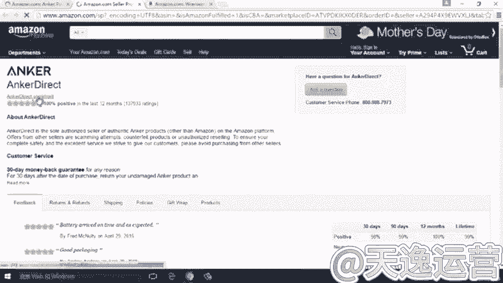

假定来说，你并不了解安克这个产这个卖家。但是当我们打开安克的店铺的时候，我们看到这种个性化定制的页面的时候，我们就应该意识到一个什么情况呢？意识到安克本身就是说他是一个白金买家。

白金卖家意味着他每个月的销售销售金额呢？在亚马逊上的销售金额一定要超过150万美金。当然，安克实际的体量也不仅仅是说150万美金。那么这是我们在安克的这个店铺里边我们能够看到的这样一些。

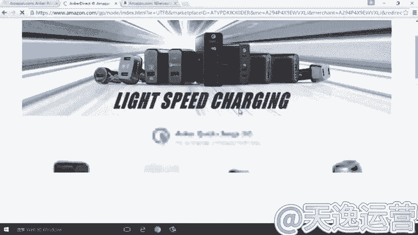

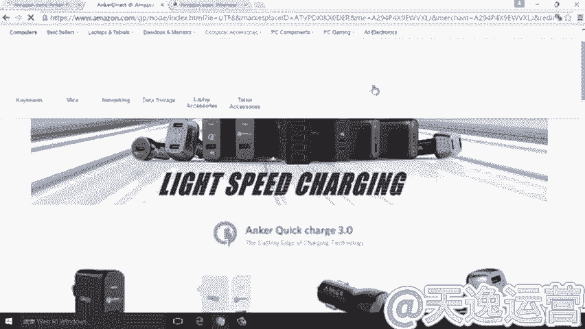

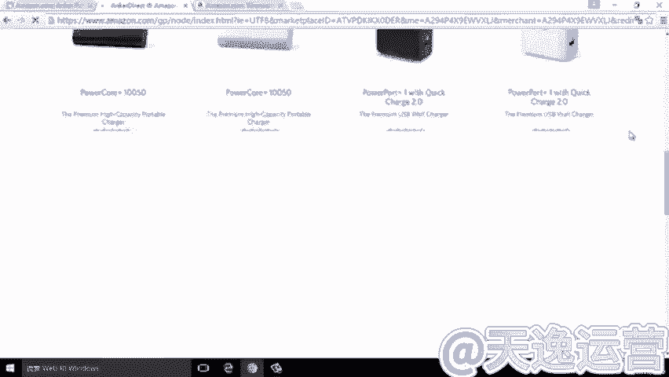

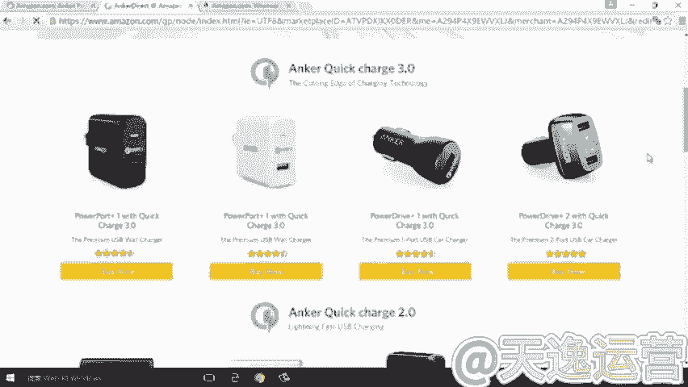

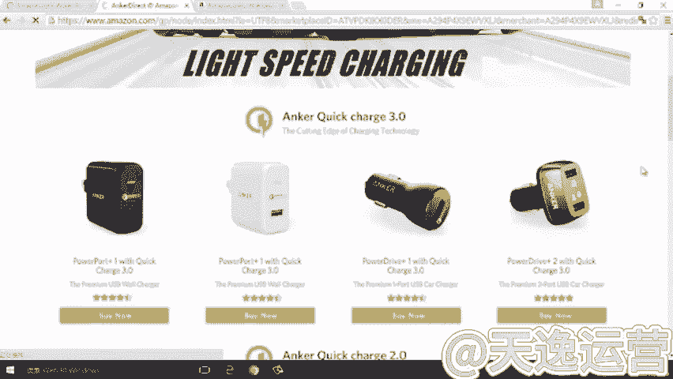

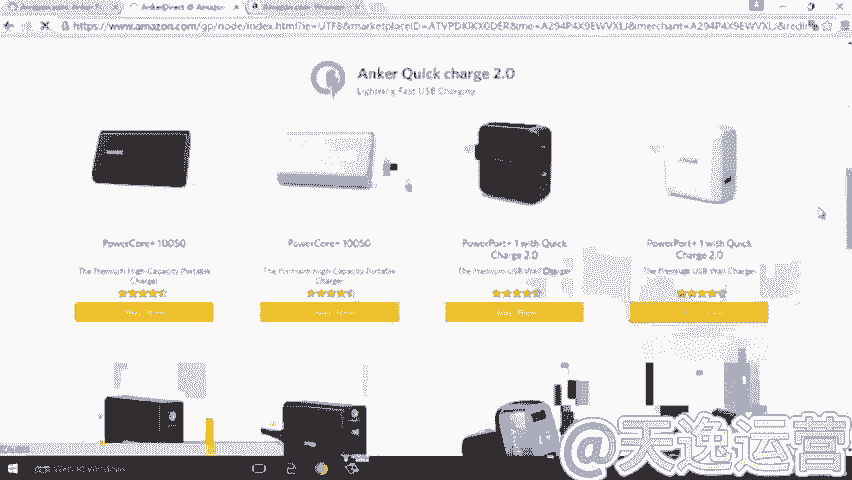

我们能够看到的这样一些信息。那么除了看到这样一些信息之外，我们就单独的某一个产品来看。比如说我们拿这个产品和大家做一个分析。那么对于这个产品来说呢，安克。首先我们看一下，它有20763个review。

那么这是一个非常庞大的数量了，对吧？当然这个数量呢也是在亚马逊整个平台上来说，应该算是卖的最好的一个产品，一个单品了。

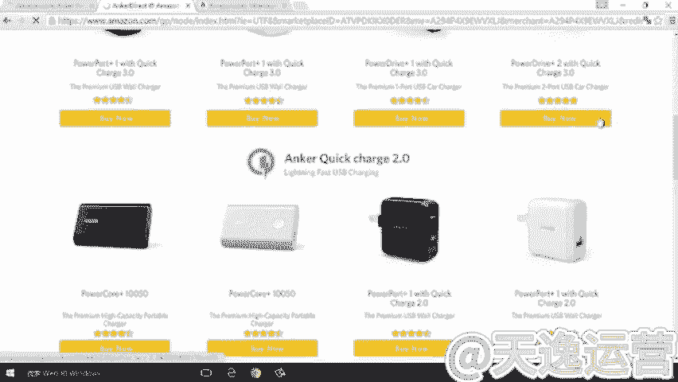

那我们就拿安克的这款单品来分析。那我们具体分析就到产品本身我们来分析哪一些内容呢？首先我们要看到它的review的数量，我们来点开，先来看一下它的review会是一个怎样的情况。okK。

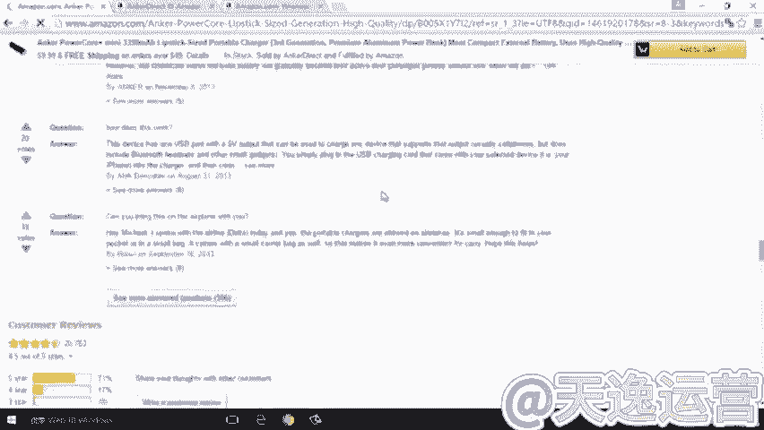

等一下。OK在这里我们已经能够看到产品的review。那么在产品的review里边，我们注意看一下。

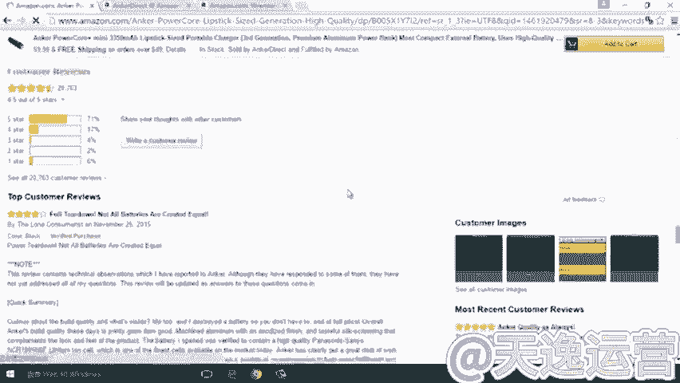

这里的review显示的时间是2015年的11月25号。这种review呢相比较来说是偏早的。那么我们。

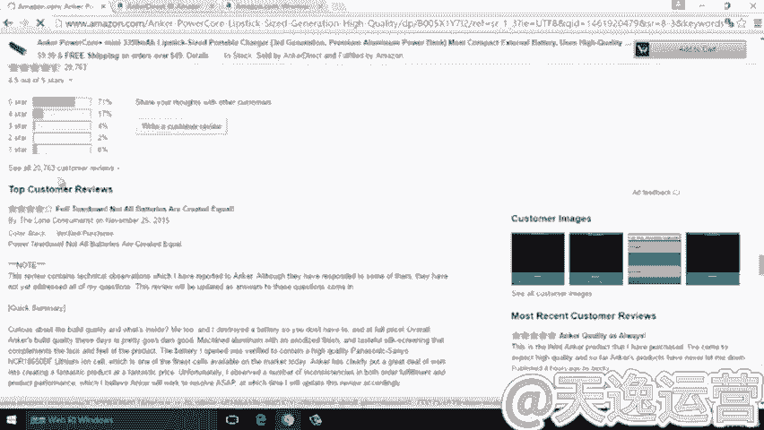

最好的看的方式是什么呢？因为对我们作为选品的参考来说，一定是最近的view，对我们的参考意义可能会更大一点。怎么去找到按时间排序呢？我们把review的整个页面拉到最下边来，点击这个。总的review。

同时呢是最新的排名在前ok。当我们扭完之后呢，整个排序就出来了，出来之后，这样的一个结果是不是我们要的呢？也没必。

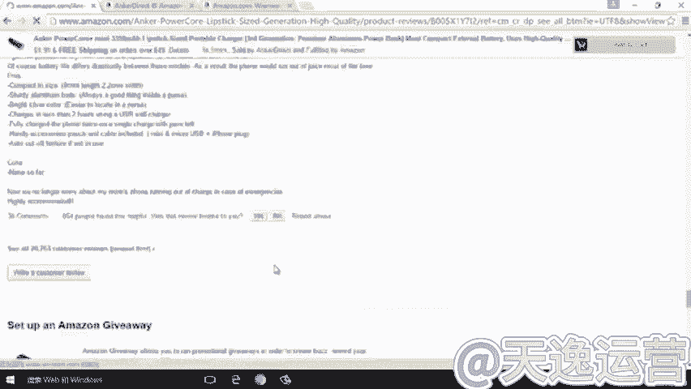

注意在每一个review的后面都会有一个veified purchase，或者说没有这样一个APP的标识。那么为了过料。单纯去看，只有VP的标识，意味着真实购买这样一个标识的情况呀，那我们去点。

点击mfi purchase，这里边我们可以看到等的搜出结果发生了变化，从20763个review变成了现在的19667个review。那么19667个review可以给我们的一个。

也就说当然我们可以在选择竞品的时候，我们可以去评估的另外一个数字。就是说从20763到19667，说明了他找了一些测评师，总共给他进行了多少的测评。那么这是我们的一个方面。但另一方面呢。

这里我们同样可以看到日期。这是以最近的日期来排序的。OK我们详细的去看每个日期。那么给我们的结果就是。什么呢？最近一段时间，比如说我们可以选择7天1月等等，选择一个时间去统计这里的页码可以去翻的。

去统计总共有多少的review。那么这些review对我们起到一个什么样的作用呢？

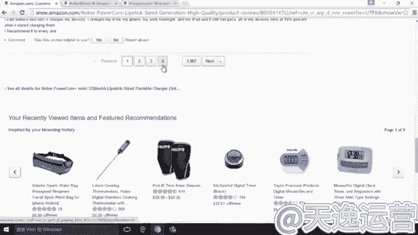

告诉我们这些review的数量呢，可以大概的告诉我们呢。在不考虑刷单的情况下，那么它的大概的销量是多少？当然安克呢也会有一些这个找写手写评价的。那么更多的。我们可以作一个参考。

就是知道哦它的销量是有多少。那么这个比例的话，大概的情况你可以做到就是以1比100这样一个比例去算吧，基本上来说都会一这个超过1比100这样一个比例了。所以说我们当判定这款产品销量的好与不好的时候。

这个review给我们的参考意义就是这些。但除了看re这个review本身。真实的购买review本身之外呢，我们还可以看到在这里呢。在这里我们可以看到。安克的产品整体的好评率是4。5星。4。

5星之外呢，我们可以看到的是五星的占了71%，四星的占了17%。然后当然可以看到一星两星的总共占了8%。那么看这个数字有什么启发作用呢？没错，当我们进行竞品分析，分析竞品的review的时候呢。

我们需要去考量的一点。就是我们要看一看这些好评好在哪里，我们详细来点开来看。当我们点了五星之后呢。那么这里的数量也发生了变化，显示的下面显示的所有的都是五星的评价。这时候我们去逐条评价进行去过滤去查看。

那么查看的结果就会告诉我们，客户对于这个产品的满意之处在哪里。但详细的话，需要我们自己结合我们自己的一些选品，结合我们自己的选择的竞争对手去做一个详细的分析，这是这一方面。那么除了我们看五星之外。

还要注意一点，这个review本身一星和两星对我们的意义可能更大。为什么说一星两星对我们的一可能更大呢？因为一星两星中。可以更多的给我们传递一些什么信息呢？关于。

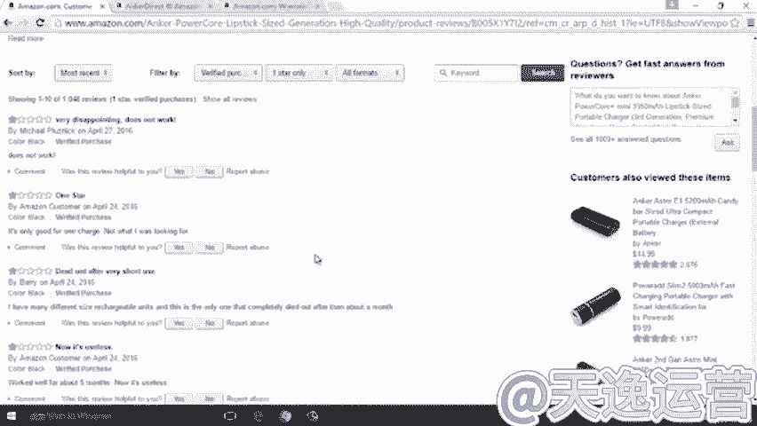