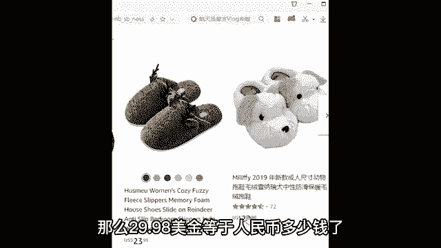

# 【2024年9月最新版】新手亚马逊跨境电商运营合集，亚马逊入门教程（纯干货，超详细） - P3：02、跨境电商的现状 - 疯往呗催哇 - BV1THsSeuEss

那么所以说接下来的话呢，我为了打消你们的顾虑啊，咱们就一起来对于跨境电商的现状，以及它的一个未来走势进行一个简单的了解。我们先来了解一下跨境电商的现状。现阶段跨境电商的用户规模呢已经超过了20个亿了。

就是跨境电商有很多人在用啊，有20个亿以上的用户群体在用OK有那么多的用户，这些用户的消费习惯是怎么样？这个问题是大家比较关注的一个事儿，就是外国人的消费习惯。OK那么怎么去了解呢？其实特别简单啊。

怎么去了解呢？😊。

比如说我们直接打开这个亚马逊的美国站的官网，对吧？你进入到亚马逊美国站的官网之后，你可以在这里随机的去搜索一些产品啊，你就可以做一些产品对比嘛，对比一下，看看这些产品在美国卖多少钱，卖的怎么样。

而在我们中国卖多少钱。对你们有什么想要对比的产品也可以打在公屏上，我随机再给大家去先对比一款产品啊。举个例子啊，比如说我以这个。😊，我们比较常见上面啊，以这个拖鞋来举个例子。那么在亚马逊上搜索拖鞋，哎。

来我们看一看，哎美国人穿拖鞋才多少钱买一双哈，就是美国人这个买一双拖鞋大概需要花多少钱。OK那么你们可以看到拖鞋这种东西在美国的一个售价大概需要多少钱哈，看一下。😊，34块钱，18。88块，39块钱。

24。88块、35块、22块、19块、21块。那么包括说18到19、21、23、29。98块okK那么你就可以看到这样拖鞋在亚板上的价格就是120二三十块钱啊，感觉这个价格贵不贵？

对你们感觉花个二三十块钱买上拖鞋贵不贵？😊，应该也没有说感觉特别贵吧，对吧？那么我感觉我还是舍得花个二三十块钱买双拖鞋的。那么但是呢你现在不要忽略一个问题，什么问题呢？

就是你现在看到的所有的产品的货币价值是什么？US对，它是美元，说的很好。那么你现在看到的这样的拖鞋，比如说这样一双拖鞋啊，就小小孩子穿的，给你家小baby买一双这样的拖鞋哈，对吧？

OK那么这样一的一双拖鞋在亚马尼的价格是卖到29。98美金。😊，对，那么29。98美金等于人民币多少钱了？OK那么我们在百度上搜索一个工具，这个工具叫做汇率换算计算器。

百度搜索汇率换算计算机之后呢，会有一个免费的实时转换工具哈。那么这样一双很可爱的卡通拖鞋，在亚美尼的价格是卖到29。98美金。那么29。98美金等于人民币大概多少钱？😊，哎，看一下大概在193。

43元钱左右，将近200块钱，一双拖鞋卖到将近200块。那你们自己可以想一下，就这样的拖鞋你去超市去买，你感觉需要花多少钱？😡，就这种拖鞋，你去超市去买，你感觉需要花多少钱？😡，顶天了啊。

就30块钱打底了，对吧？你去拼多多9。9块包邮都可以买到，对吧？所以说你做一些产品对比，你看这样的产品在国外可以卖到将近200块。OK那么所以说那我们会发现国外的消费者的消费水平还是相对比较高的。

那么感觉他们的消费水平高的核心原因在哪里啊？它总是总归它是有原因的。你们要知道对吧？😡，OK你要明白，在我们中国，普通人一个月的收入大概多少钱？一个普通人一个月的收入基本上就三五千0块钱吧。

就不会特别多吧。就一个月三五千0块钱。我说普通人哈，对吧？有的人可能3000块钱都不到哈，我就说我说的是普通人，这个东西他没有什么好坏之分哈。那么但是咱们就以一样的道理，你要明白的是，一个普通的美国人。

一个月的工资也是三五千0，在哪里都是这个样子，在任何一个国家都是这个样子，对吧？那么但是你要明白的是，他们发的不是人民币啊。😡，发的是什么？是美金。假如说一个美国人一个月发了3000美金的情况下。

那么3000美金等于人民币多少钱？看一下，3000美金等于人民币19356块钱。

差了644块呃，600啊，对，差了634块钱就就2万了，对不对？哎，我的数学能力还是可以的啊哈，就差了644就2万了。所以说你会发现在一个美国人眼里面看到，他说我买一双拖鞋，就吧？我花了一二十块钱。

就假如我花了一双2十块钱买了一双拖鞋。😊。

但是这20美金等于人民币就要在129块，将近30块，将近130块钱了。啊，129块钱左右，对不对？因为人民币跟美元之间存在一个东西，这个东西叫什么？叫做汇率差。这个点你们记住了。

你们就明白我们做亚马逊做跨境电商的主要收益来源在于哪里。对，赚的就是这样一个汇率差OK那么同样在这样的一个道理，就会有同学讲的，说老师，那你要这样说哈，你看就像你刚刚举那个卡通拖鞋，在国外卖的190哈。

我的进化价按40块钱来算，那么我还有这个150的利润。OK那那这个利润太夸张了哈那是不是邮费特别贵啊，你我这个邮寄费用是不是都在200块钱。

要不要一200块钱要不要我跟大家去讲一下邮费其实没有各位想象那么贵啊，这个邮寄的费用怎么讲呢？呃，我随便我打开一下这个物流报价表给大家去简单去聊一下这个邮费的问题啊，先给你们简单介绍一下。

等一会再重点去讲哈。😊，首先跟你们聊一下这个邮费的问题。那么正常情况下啊，这个邮费的话，像这个我打开的是云图物流，云图物流在整个国际物流行业的地位，类似于国内的顺丰，就价格稍微的。😊，啊，贵一点。

但是服务也会相对比较好一点。那么咱们以这个云图物流来举例啊，还是以一双拖鞋土举例，一双卡通拖鞋从中国邮到美国的运费大概需要多少钱呢？首先在计算这个运费之前，你要知道这个卡通拖鞋它不会特别重啊。

你感觉就这样的一双拖鞋能能能多重啊，就这样一双拖鞋。😊，啊，了不起了，就两30百克左右左右这个样子就可以了啊，就不会特别重啊，半斤啊，半斤多就差不多了哈。那么假如说我们说一双拖鞋重量达到300克。

300克的话就是0。3000克。那么0。3000克的拖鞋从中国邮到美国的运费是大概多少钱呢？就是。😊，0。3乘以70是21块钱的运费。就是有一双拖鞋从中国到美国，也就21块钱减，那还有什么费用呢？

还有像海关。😡，清关这些东西的话呢，也是需要去处理的对吧？那么这是由国际物流公司处理的，他们会收取一个挂号费，帮助你处理海关清关这些东西。那么正常一双拖鞋的挂号费16块钱，21块钱运费。

加上16块钱的挂号费，整体费用也就是在37块钱左右。就是你现在拿一双拖鞋从中国邮到美国去，那也就是30多块钱，37块钱，将近40块钱吧。😊，相比于我们的利润而言，这个这个费用应该是能够接受的，对不对？

对，这个是我们能够接纳的范围内的。同时我要告诉你们的是，假如说你走海运，走那些货代公司哈，这个费用最低的话可以做到1314块钱1公斤。😊，就啥概念哈。😡，就是如果说你走海运走船运哈。

然后这个130块4块钱一公斤，就是你有邮个三四双拖鞋，从中国到美国也就四十三4块钱，平均下来一双拖鞋到美国的价格可能邮费的话，才五六块钱，你不要感觉不可思议啊，我告诉你这个国际物流费用真没你想象那么贵。

你说海运海运是最便宜的，就但凡对于海运有那么一点点了解的，你合运都很便宜，明白吗？就是从古至今都是这个样子啊。那古代开始就海运就很便宜。因为海之船大装的东西多，对吧？然后所以说这个国际物流费用啊。

没有各位想象那么贵啊。当然你别走空运就行你要走空运，这个价格肯定会稍微贵一点。那如果说后期有需要的时候啊，尽量的还是少选择空运会好一点啊，节省成本啊，成本也是很重要的。😊，OK那么在这样的一种情况下。

我们了解完之后哈，那我们想要做这个事儿，哎，有一句老话说的很好啊，就做知己知彼，方能百战不殆，对不对？那我们中国人做跨境面商有什么优势吗？首先你们要知道是我们中国啊是一个农业比较发达的国家啊。

这个农业这个点哈，我们还是要感谢我们的这个呃中国食神袁隆平老先生啊，向袁隆平老先生致敬。那么呃袁老袁隆平老先生给我们带来的这样的一个农业的发展啊，其实给我们整个国家带来了很大的一个这个提升。

为什么这样讲呢？因为农业比较发达的话，他也预示着轻工业啊也很发达。什么是轻工业呢？像你家里常用的这些锅碗瓢盆、桌椅板凳，这些都属于轻工业用品。😊。

中国具备全球最完善的工业体系，我们是全世界第一出口大国和制造大国，全球有30%以上的轻工业来自于中国制造。我相信made in china这个词大家都有听说过，对不对？中国在世界上都有一个称呼。

被世界冠以世界工厂的美称。为什么会有这样的一个称呼呢？因为中国制造商品在整个国际上都可以被称之为物美价廉的代表。为什么这样讲哈？😡。

首先你像我刚刚给大家对比的一款拖鞋，对吧？我感觉大家肯定感觉一款产品没有什么代表性啊。我再最后的给你们对比个两款产品吧，就是再对比个两款啊，咱家选不同类目的产品。这样的话呢，我就不再对比。

我就讲课了啊啊，最后呢再给大家对比两款产品。比如说。😊，呃，我们比较常见的东西还有什么保温杯啊，保温杯OK。😊，那我们搜索保温杯之后呢，你们可以看一下保温杯这样的产品，从中国啊。

这这这这个东西在国外能卖到多少钱啊，就是保温杯啊，网络有点卡啊，我哎呀关掉了之后，网络又不卡了，怎么那那么气人呢？O我再重新搜索一下这个产品啊，我再重新打开一下这个网页啊，重新打开之后呢。

进入到美国站进来之后，在这里搜索保温杯嗯。😊。

保温杯。那么搜索完之后，你看到这种保温杯在亚马逊的价格，一个杯子能卖多少钱？

来在计算这个价格之前，你自己思考一下自己买个杯子能花多少钱，自己买一个保温杯能花多少钱看一下啊。😊，保温杯在亚马尼的价格30块钱30块钱，13块钱，10块钱啊，这种小的10块钱大一点30多啊。对。

那么我们找一个比较常见的常见的类型，就这种保温杯啊，就这种比较树高状的保温杯啊。看这个老板标配哈，那么这种保温杯在亚马逊的价格是卖到25。99美金。那么25。99美金等于人民币多少钱呢？算一下25。

99美金等于人民币啊，167块钱。😊。

看到了吧？167。68元钱。OK这又是一款保温杯的价格啊，160多啊，1671个呃，赶得上我们国内的那个品牌叫什么？就是就是特百惠啊，特百对特百惠的杯子就好贵哈。但是普通的杯子没没有卖那么贵的。

就这种这种钢胆杯子不会这么贵，基本上就二三十啊，除了这位之外，我再给大家最后对比一个，还有什么烟灰缸。😊，OK烟灰缸这样的产品来，你们可以看到在亚马逊的价格是卖多少钱。来，我们找一下最便宜。

最普通的烟灰缸，这种玻璃制的烟灰缸，就这种玻璃制的烟灰缸在国内的2元店啊，大家都知道啊，你应该在见过2元店吧。大家应该那么2元店的话，这种东西之后2块钱一个OK那么这样的2元店一个的这个这个烟灰缸啊。

在亚马逊的价格是2个啊，卖到12。99美金。那么12。99美金等于人民币多少钱。😡。

83块钱一个okK合下来1个40多块钱。😡，那一个这种烟灰缸可以卖可以等于人民币的，算下来就是40多块钱，看到没有？两个装12。99美金。OK那么对比完之后啊，你就很清晰了。

那么就像这种东西在我们国内的价格都会相对比较低，而在国外的价格也会相对会比较高。原因在哪里啊？这个原因在什么地方呢？首先你们要明白的一个点，第一个就是我们中国的人工成本比较低呀。😊。

为什么说我们中国的人工成本很低呢？在这里给大家算一笔账啊，你们会更清楚一些什么账呢？来我给大家举个例子啊，假设哈假如说我说我们咱们一个普通的中国人啊，一个人努努力啊，一个月挣个三五千0块钱。

假如哈咱们说一个普通中国人一个月啊挣了3000块钱啊，这个不难达到吧，就很简单的一个事，对吧？那么按正常情况下，一个月要工作几天啊，正常一个月三四天的工作时间工作26天，因为周日你肯定要放个假休息一下。

对吧？那么3000除以26，一个人一天的工资就是115块钱人民币，那么一天工作几个小时呢，正常情况下，一天工作8个小时，那么再除以8。😊，那么一个普通中国人一个小时的工资就是14块钱一个小时。

14元每小时。OK这是普通中国人的工资。有同学说老师，那我不可能一个月只只挣3000块钱啊，我这样对比的原因是因为啊这个3000块钱是每个人都能达到的啊，就是3000块钱，虽然说不高啊。

但是每个人都可以做得到啊，咱们就以这个对比吧。那么同样道理，你要知道一个普通美国人一个月也挣30003000000块钱，但是人发的是美金。😊，假如说一个美国人一个月发了3000美金的情况下，一样的道理。

他一个月是工作26天啊，一天也是工作半个小时。那么一个美国人一个小时的工资就是14。42美金OK那么14美金等于人民币多少钱？😊，14美金。那么14美金等于人民币啊，算一下。在90。32元钱左右。

90块钱左右。😡，90元。每小时。这就是一个美国人普通的一个小时的工资换算成人民币之后，这样的一个价格。看到这里你就应该明白为什么90年代那么多人喜欢去美国打工啊，因为他们感觉美国的工资高对吧？

为什么富士康这些厂子喜欢建在中国的？因为中国的人工成本比较低呀？😡，对吧那这个点大家要清楚啊，当然这只是现状哈。那么。未来有一天啊，在我们成为了发达国家之后啊，注定这个也会有一些改观。

但是啊在通往这条路上的通往发达国家的路上啊，需要我们每一个中国人一起努力哈。那么这是第一个关于人工成本的一个问题。第二个原材料的价格也低啊。😊，中国领土面积大，中国拥有960万平方公里的领土面积。

所以说我们的原材料价格也低啊，人工成本低，原材料价格也低。那我们合成出来的这个商品在整个国际上就可以被称之为物美价廉的代表。这就是咱们中国人的优势。😡，那么第三个就是做电商这个事，我们是比较有经验的。

像什么京东、淘宝、拼多多、抖音、直播带货各种各样的电商形式，不管是现在还是过去还是未来，中国一定会是跨境电商发展的主要推动力量。这就是咱们中国人的优势啊，那么这就是我们中国人的优势OK。

