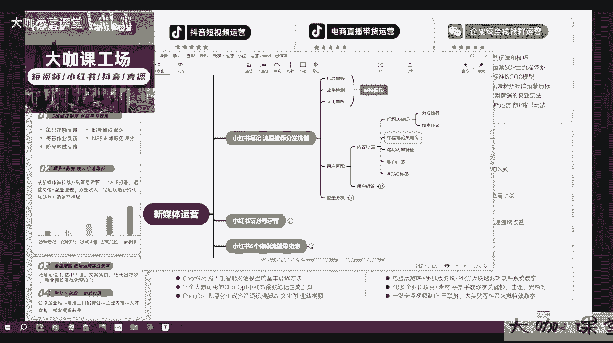
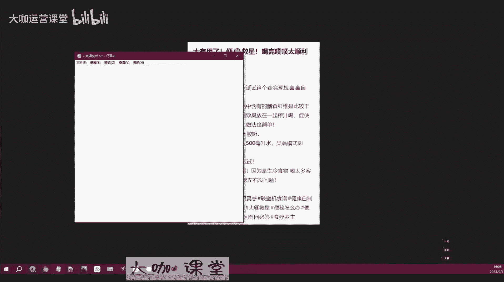
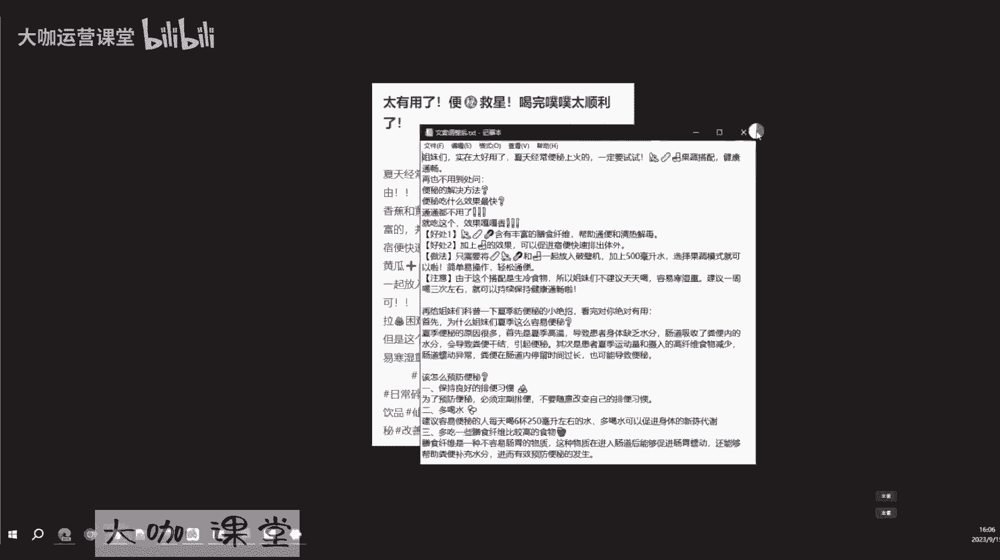
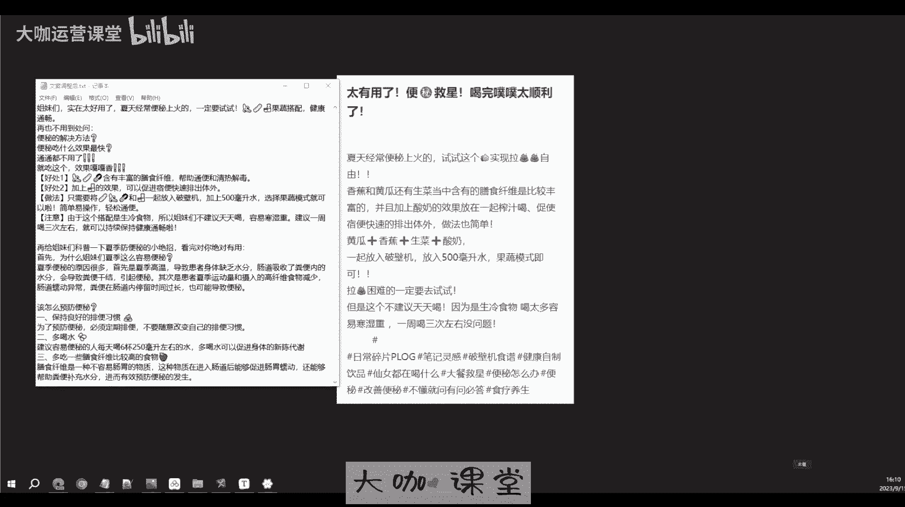
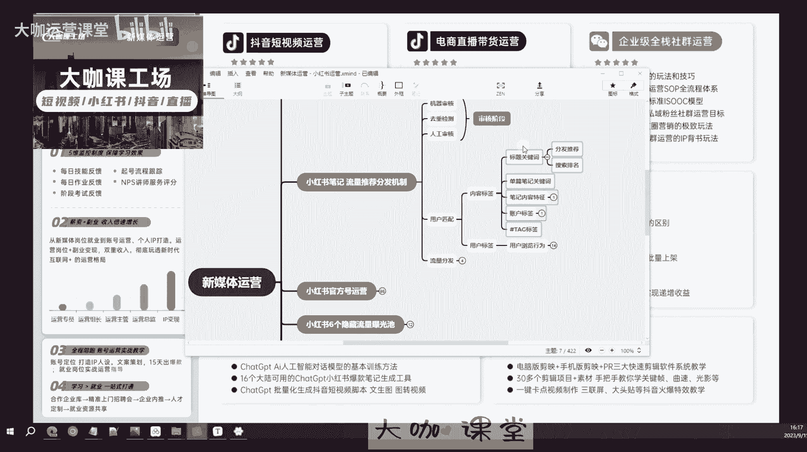

# 【2024年吃透新媒体运营全平台运营技巧】挑战30天打卡上岸 小红书运营涨粉／抖音直播带货／短视频拍摄剪辑／AI文案创作 学完少走99%的弯路 轻松打造爆款！ - P28：10：新媒体运营-小红书笔记标签及用户标签匹配 - 大咖运营课堂 - BV1fT421a7gW

好那么接下来我们讲一下小红书平台，就是这个系统它怎么去匹配用户啊，怎么去把你的笔记分配给对应的用户，那么这就涉及到平台对你的笔记，以及对用户的一个画像啊，或者说分析的这么一个工作。

我们知道通过审核的笔记呢，它会进入一个正常的一个推荐系统对吧，也就是说它会系统根据我们创作笔记时候，所提供的这个关键词标签话题，以及这篇笔记它本身的一些内容特征等等啊，来与对应标签的用户来进行匹配。

什么意思呢，比如说你是做啊，你发的内容是关于美甲的，对不对，然后你发布的内容是关于美甲，那么系统它识别了你的内容为美甲之后啊，也就是说你的主题内容为美甲之后，他就要想办法把你的这个内容推荐给什么呀。

他就要想办法把你的内容推荐给，喜欢看美甲的这种用户对吧，这也是我们前期啊第一节给大家讲到的，就是现在平台他要留住用户，他就要给用户推荐这种特别精准的，就是用户他喜欢的内容，那么这个东西就是呃系统在推荐。

我们创作者所创作的内容，跟用户之间的一个匹配的这么一个算法对吧，但是呢呃就是我们呃，你知道就是我们现在笔记啊，本身我们会做一些像小红书对吧，我们会填写一些像tag标签词，对不对。

我们会通过这些东西呢来告诉系统嗯，我这篇笔记它就是关于美甲的，但是的话啊系统它有本身也有自己的一套算法，那么它会对怎么说呢，就是对这篇笔记的一个内容啊，进行一些基本的分析，像句意分析啊，词义分析呀。

关键词提取啊，还有关键词一些出现次数等等，它会根据这些内容来分析，你的这个笔记的一个内容，来确定你到底你的主题是关于什么的，好吧，那么这一套内容，也就是我们这节课要跟大家讲一个重点啊。

也就是说关于用户的一个匹配，我们知道匹配用户这一块呢，啊平台不仅要去判定你的标签啊，判定你的笔记的标签，还要判定用户的标签，对不对，我们来分开聊这两个阶段，首先呢关于内容标签对吧，内容标签这一块。

我们的系统主要通过哪些东西去判定呢，首先第一个标题的一个关键词，那么标题关键词就是很啊，就是我们标题当中是否有包含，我们要发布的这样的一个内容啊，这是一个判定的点，它虽然不代表全部。

但是他有两个非常关键的影响，第一个就是影响我们的一个啊，我们刚才所说的影响你标签的啊，影响你这个笔记的一个标签的判定，然后其次呢它还会影响你的一个搜索排名，那至于为什么说标题上面的关键词。

它不会影响全部，这是因为呃，系统呢它会通过很多种的算法来推荐，它比较智能啊，这一套算法它比较智能啊，然后其次呢还有单篇笔记的一个关键词，那么单篇笔记的关键词呢很简单，就是系统呢他会分析你这篇笔记里边。

有多少内容是啊，有多出现了多少次这个美甲这个关键词啊，没多少次有有出现这个美甲关键词，那么我这里呢呃我看我简单举个例子哈，啊就是我们之前在分析啊，这个关键词给学员做这个相应的内容。

呃我们看一下啊，嗯首先呢这个是我们一个学员所发布的呃，关于一个夏天上火便秘的这样的一个笔记，好吧，他的笔记呢就是啊太有用了，便秘救星对吧，喝完什么的，太顺利了好吧，然后呢呃我们看一下内容啊。

便秘上火等等等等啊，来看一下它，这是它的一个原本的内容，原本的内容，然后我们可以看一下，就是他这个内容呢本身啊，稍等一下，我把这个标签打开啊，OK我们看一下它本身啊，在标题上面。

其实在这里呢有出现了一次，但是你们觉得这个东西它有没有用啊，你们看一下这个这个词，这个词本身它是有一定的问题的，可以理解为这个东西呢它就是一个表情符号啊，表情符号表情符号对于系统来讲。

它的理解能力是有限的，理解能力是有限的，他可能就把你理解成这个东西，理解成你一个标题里边带的符号，它并不能跟你的这个便秘这样的一个内容，组合到一起，所以说这个时候你在标题上就少了一个。

你这个内容跟便秘这块内容挂钩的一个分啊，我们假设把它理理解成打分，那么这个时候你就少了一分好吧，你就少了一分，嗯OK这是第一个，然后我们看一下它，内容当中出现的关键词的频率对吧。

嗯这里出现了一次嗯便秘好，我们再看一下，OK这个关键词，那么这个也不算好吧，也不算额，整体来讲啊，整体来讲它的内容当中，关键词出现的频率可以理解为只有一次，至少从我们正常来看啊，语义分析当中分析出来。

这个我们先不算啊，这里只出现了一次呃，标题上没有，然后呢他的标签里边有啊，标签里边有，但是在这个新号，我这个同学他是一个新号啊，他是个新号，那么新号你打的这个标签，那么平台的参考程度不高。

这个地方给你打的分啊，分值不会特别高好吧不会特别高，那么这就是我们啊所出现的这些问题，我们再来看给他优化过后的这么一篇笔记啊，我们再看优化过后的，嗯我们来看一下调整过后的啊。

啊这是这是我给他调整过后的，我们来看啊，首先啊姐妹们怎么怎么夏天便秘，上火啊等等等等，我们来看一下它的一个关键词的覆盖率吧，啊这里出现了一次嗯，好然后我们再来看一下，这里再也不用到处问啊，我们来看一下。

这里不是特别好用，这里有两个，对不对好，那么这里呢这就是我们的正文内容了啊，正文内容了，这里正文内容呢是为了吸引用户，对我们这个内容产生啊比较良好的兴趣，那么你看一下，可以看一下老师写的这个格式啊。

那我这里有些表情符号，在这个win10的系统里面是体现不出来的，其实正常来讲这些表情符号是可以提啊，是可以完美显示的啊，这是因为系统的不同，但是在小红书上它是可以显示的，OK我们来看一下，没有问题对吧。

这个呢整体来讲我们的关键词有，然后呢呃这个内容格式也还可以，我们再看啊，夏季防便秘的小绝招好，然后呢姐妹为是夏季这么容易便秘啊，并列啊，你再看啊，这里也有好，这里也有，这里也有，这里也有。

OK那么我们可以看到啊，在关键词当中，这个东西呢在我们做内容的时候呢，是非常重要的，我们做关键词，有些同学呢在听了老师讲之后，他说哎呀，我做小红书内容的时候，文案我多植入点这种关键词，我来堆砌一下啊。

我这里我这里贴一个，然后我这里紧接着再提一个，再贴一个，再填一个，这样好不好呢，这样肯定不行的好吧，你呃我们现在在看视频的同学，你可以研究一下老师这个内容好吧，你研究一下内容，我所有的关键词。

都不是以最生硬的方式来植入的，都是肯定跟上下文，上下文有关联的好吧，跟上下文有关联的，而且便秘的解决方法，因为吃什么效果最快，我就告诉你，这两个东西不是说老师去凭空想象，放在这里。

这两个东西是我搜索了小红书之后，发现这两个东西是很多人有的需求，那么这个需求就是呃我放在这里，系统它会判定哎我这篇笔记跟用户的想法，就是用户想看的内容，我这里有，那么他会给我加一定的分数好吧。

给我加一定的分数，至少说在系统判定我这篇笔记的时候，他能够跟便秘这个词，挂上非常强的这样的一个关联，那这个时候我的这篇笔记的内容就成功了，我的关键词也不会显得堆砌。

用户看起来又觉得我这个内容呢也非常有价值，我的文案我的图片也设计的非常好，那么你们想一想，如果你做出来这样一篇笔记，是不是啊，你的笔记一旦获得了推荐，就这么一篇笔记，你一旦获得推荐。

你觉得这篇笔记能给你带来多少的数据啊，能给你带来多少的赞，长关注好吧，那么这就是我们要求大家去做文案啊，这个要注意的这个关键词的这个点好吧，关键词这个点，那么关于具体的这个做内容，我们怎么做内容啊。

内容当中的一些呃小技巧啊，小技巧，表情符号，还有里边要穿穿插的这些点，我们后期的后面的内容会逐渐跟大家讲好吧。

逐渐跟大家讲，那么这里呢就是我我们说的关于啊，关于我们这个关键词的内容呃，然后呢，剩下的啊给我们判定我们笔记内容标签的，还有一个呢就是我们的这个笔记的内容特征，那么内容特征呢也是我们刚才说的啊。

我把关了，我再重新打开一下，内容特征怎么去讲呢，就是现在的系统啊，他很智能，其实早期有接触过SEO的同学啊，早早期有接触过SEO，SEO的同学应该知道，就是系统搜索或者系统判定一篇内容的时候。

它会根据你的内容来做分词法啊，他会给你一个词一个词拆分，比如说这个词叫由于，然后由于这由于这个，然后他就形成了哎，他分析出来了，你这个词，这句话讲讲的是由于这个搭配是生冷食物，它会分析你的语义。

你知道吧，他会分析你讲的这篇内容，而不是说我们认为的人工去检测，人工去检测，你看到这个东西，哎你一眼就能看懂，但是机器他分析你的内容，不是以肉眼的方式来分的，它是根据你的这个词啊。

两个词或者说一句话组合出来，他分析你这个东西讲的是什么啊，这就是现在系统的一个算法，所以说小红书你的笔记发完之后，他会来分析你的这篇笔记啊，分析你这篇笔记讲的是什么内容，首先一个关键词是给它做指引的。

然后系统还要分析对吧，首先为什么夏季这么容易便秘，夏季便秘的原因很多，再给姐妹们科普一下夏季防便秘的小绝招，OK那分析完之后发现啊，没有便秘的内容，它也是跟便秘相关的，这些内容总结起来哎。

就是教你怎么去防便秘，他就能分析你这篇内容，它到底是不是关于便秘的，然后我最后我决定，要不要把这篇笔记推荐给那些经常便秘，想搜便秘或者看便秘内容比较多的这种用户，那么这就是关于笔记内容特征的这一块。

除此之外呢，还有一个点就是我们账户的一个标签对吧，账户标签这个东西非常非常重要啊，这个账户标签不是指tab标签啊，一定要理解一下账户标签指的是什么，指的就是啊写错了啊，指的就是老师刚才跟大家讲的。

我们账号的一个权重啊，你可以理解为账号的一个权重啊，也可以理解为是什么呢，也可以理解为我们做过抖音的同学应该知道啊，就是我们经常啊强调我们的这个账号诶，系统有没有给我们打上标签对吧。

那么小红书其实它也是一样，你的账号打上了标签，那么后期你的内容才会被推荐的多，那像我刚才跟大家讲过，就是你是新号的时候，你权重比较低，因为你的账号没有标签，那么这个时候系统给你推荐的流量它比较杂乱。

什么人群都有，就是随机给你推荐一篇，看你的这个笔记的质量怎么样，然后其次呢，如果说你的账号打上了标签，那么这个时候你发布的笔记他的阅读量啊，可能就是200到300这样的一个起步，这个起步也就是说呃。

呃做过小红书的同学应该都知道哈，就是你的笔记打上标签，或者说比较健康啊，已经有一过有定有过一些报文的情况下，那当然是你做的比较垂直啊，那么你发布的笔记他的起始的阅读量都会很高，而不会出现几十个的啊。

那几十个的，就是说明你的这个笔记里面有违规词啊，有违禁的一些东西，那么这就是我们账户的一个标签，它非常非常重要，所以说这里我也强调一下，就是为什么我们一直跟大家说，你做内容一定要做垂直对吧。

一定要做垂直，我们知道用户的标签，我在这里我穿插一下讲一下啊，就是为什么我讲这个垂直的重要性啊，就用户他也是有标签的，对不对，用户的标签是根据什么来判定的，根据用户平时浏览的内容来判定。

比如说我作为一个正常用户，我浏览小红书的时候呢，啊我刷了一下美女的视频，哎我刷下美女的图片，然后我今天看了一下家居装修的啊，我明天看了一下带宝宝的等等等等，那么这些内容总有一个多少顺序，还有停留时间。

那么系统它就能根据我的这些行为来分析，我对哪一类内容更加感兴趣，对不对，他会可以这样给我们打上标签，但是我们作为创作者的时候，系统给你打上标记是没有那么容易的，因为系统啊就是我们的平台。

它一定要保证给用户提供足够优质的内容，那么优质的内容怎么来，就是根据呃，你是不是这个领域持续的一个创作者，那我们知道以前就是很多这个行业的专家，对不对，垂直的行业的专家。

你不可能说哎我是一个医学类的专家，同时我还是我还是一个法律类的专家，那不可能的事情啊，或者说非常非常少见这种人啊，我先说我先不说有没有啊，就是非常非常少，没有一个专家是同时能够把多个领域做的。

非常非常好的，那么我们在平台上用户判定啊，就是系统判定我我们是否是这个领域的专家，也是根据我们发布的内容来定的，我们把内容做得足够垂直啊，在这个行业坚持的去做，然后我们持续发布的都是。

关于这一个品类的内容，没有发一些其他乱七八糟的东西，那这个时候系统就会把我们打上一个，专家的标签啊，就这个领域的标签，我们是做美甲的好，那这个账号他就是一个美甲的优质博主，那这个时候怎么着。

这个时候你发布的笔记系统，首先它就会默认你发布的笔记就跟美甲相关啊，强相关强关联，那这个时候你的笔记就会获得一个，非常不错的一个推荐量，然后再加上你的关键词文案，以及推送给特定用户，他们的行为。

如果说你的偏偏文案都能做到，像老师这么精致化好，那么你标签也有了，推送也有了，你觉得这样的一个账号，他能不报吗，就是说啊十个用户刷到你这篇内容，他对你的内容感兴趣的情况下啊，那么十个用户里边可能有七个。

八个都能参与到他的互动，点赞收藏评论等等，那你这个笔记就会持续推持续推啊，持续推分发流量，这就是我们一直讲你的账户要垂直，你的这个啊笔记要做的优质的一个原因，好吧，这是这是一个底层的逻辑。

那么判定你内容的另外一个方式，也就是我们这个tag标签啊，当然tag标签这个东西呢我们一直在讲，就是这个东西呢，呃在还是跟你的一个笔记的权重分挂钩啊，权重分挂钩，那如果说你的这个笔记呃。

前期权重分很低的情况下，这个标签值他给的分值是非常低的，也就是说你打了标签其实也不一定啊，有用不一定有用，更多的呢，现在系统他并不一定相信你自己打的这些标签，他更相信他自己的一个判断。

他分析你标题里面的关键词，分析你的账户的表现啊，分析你的单篇笔记内容里边的关键词，还有你笔记的特征，它通过这些来判定你这篇笔记值不值得推荐，是不是关于这个领域的，那么这个内容呢老师讲的非常细啊。

呃我希望的就是我们看这个视频的同学，你能够理解，就是我们现在做新媒体平台，为什么要把标签垂直这个东西反反复复的强调，一定要把它做到垂直的，特别垂直的这种程度，它的根本意义。

