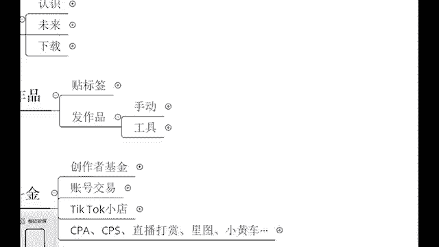
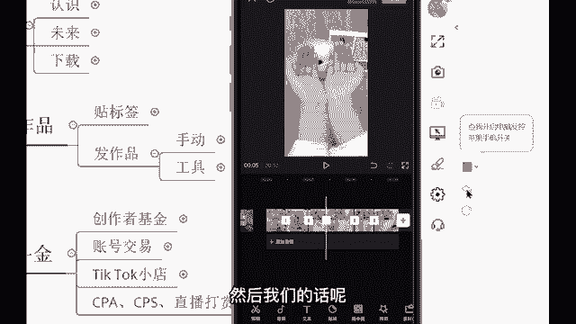
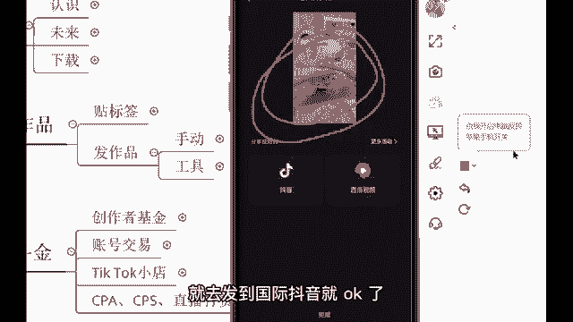
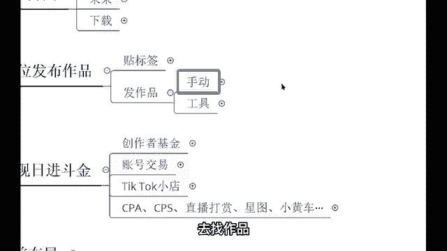

# 【2024年最新版】TikTok+亚马逊跨境电商运营全套零基础视频教程 （从入门到精通，日出百单！）学完适用全平台！ - P10：9.手动搬运作品教程2 - 琉璃月下梦2 - BV1FjbFePEo7

う。哎，有同学的话呢就是直接的话呢把这个视频唉往这个国际抖音上怼上去了哈，直接发是不行的。我告诉你，这样的话呢，你视频很难过审核。😊。

明白吗？视频和难过审核剪映你们都知道吧？打开剪映你们手机里面的剪映，然后呢，这里开始创作。😡，打开开始创作，然后把这个视频导入进去。直接导入导入之后，那接下来我们的话呢就要开始进行一个操作了啊。

那进行操作的话呢，首先我们先去把这个视频的哎大小啊需要去做了一个调试。为什么要去做这个二次剪辑呢？它的原由啊给你们讲清楚。😡，首先他的一个视频，它在互联网上有一个东西叫做MD5值。MD5值。

就相当于这个视频的身份证。如果说你直接的话呢，把人家的视频搬运下来，直接发，就相当于相当于你在用人家的身份证去发视频不行，所以呢我们得要去修改MD5值啊，把这个东西修改好了之后啊。

把这个视频做到一个剪辑做到一个处理，啊这个东西变成互联网上独一无二的视频，把这个MD5值修改了之后，我们再去发布就没有问题。而且不会受到受到这个流量啊，播放量的一个影响。反而的话呢还可能会更高，明白吧？

所以说我们得要去做到一个剪辑，不能直接发。😡，首先我们的话呢先去调整它的一个大小，把它变得和原视频不一样。两只手指哎对着屏幕放大放小啊，都是可以的。来，我这个放大给大家来放大一点点啊。

不需要破坏这个视频原有的美感放大一丢丢就行了哈。然后紧接着我把整段啊，把整个整个视频的这个滤镜啊给它调一下。😊，滤镜把这个滤镜的话呢变成一个气色啊，调一下，哎，现在更亮了，是不是看到没有？😊，看到吗？

气色啊，现在的话呢就更亮了。哎，这个的话呢微妙的一些操作，我我们都调一调，是不是？你看现在的话呢就没有什么太大的一个变化。那紧接着我们还要去做一个镜像处理，哎，镜像处理。

这是做二次剪辑最简单的一个操作了哈，镜像处理。😊，那跑哪去了？啊，等一下啊。编姐哦，这里。点击编辑，点击镜像。哎，现在的话呢就是。左手换右手，右手换左手了，你看一下。是吧哎。

刚刚的话呢是右手现在变足球了，但是的话呢也不会说影响这个视频。😡，是不是不会影响视频，同样的话呢是去看。所以我让你们不要去呃用那种有对白的呀，是吧？两个人对话的呀，尽量的话呢就不说话，就看视频内容。

看视频就O了啊。好，做完镜像之后。😡，你们有没有做登记啊？第一个视频的大小调整。😡，视频缩放这第一。第二，滤镜。第三，镜像。啊，然后呢紧接着第四分段。分段来，我们的话呢把这个视频来分一些分一下段啊。呃。

12秒的视频我们分三段。三段啊分割。分割啊分了三段分了三段之后的话呢，我们要进行调速啊，这是第五个步骤了哈。第五个步骤调速。😊，变速常规变速不要调太多啊，调个1。1。这个的话呢调个1。2。然后的话呢。

后面这一个调个1。3。嗯，1。3，那我们来看一下。🎼Yeah。🎼又声的像起了巧克粒，已经绕在操场等你，夏真的是烂的可以，让你试试草莓冰淇淋。😊，好，OK那像上这个视频的话呢，速度就做到一个调整了。

12秒的视频我们变成了10秒钟，是不是？好，那这个速度我们调了，接下来我们还得要再做第六步，就是抽帧。😡，抽针啊，把这个视频，有些同学不知道抽针是什么哈，这个我打出来抽针。😡，被个。😡，对。

从这个视频当中抽取那么一帧啊，不会影响画面的哈，点击分割，然后的话呢再点击啊当前位置不可分割。那你就是点后面。😊，一针就行了哈。😊，哎，分了。好，那这一帧的话呢，直接做到一个删除就行了。

你看还是10秒还是10秒。这一帧的话呢，不会破坏这个视这个视频画面的哈。好，那分了三段，是不是我每一个每一段都抽取那么一帧。😊，每一段都抽取那么一帧，放到最大。😡，放到最大，然后的话呢抽针分割。嗯。

然后把这一帧删掉。嗯。还有最后一个。好嗯。😊，我们来看一下现在画面整体的感感觉怎么样哈。😊，🎼风又见那天炙热的下课铃，一经要在操场等待，夏天真的是闷的可以带你吃着草莓冰淇淋淋。😊。

是不是现在的话呢已经是把很多的一些操作啊全部搞完了，是吧？像这个滤镜抽帧调速是吧？视频的一个缩放镜像等等一系列的一些操作都已经是搞完了。这个视频的话呢，已经是变成了全限的视频。还有第七步就是换背景音乐。

换BGM就可以了啊，这个大致哈就是这么几步操作了。然后搞完之后，然后我们的话呢把这个视频给它做到一个导出。😊。

对，给它导出啊，我不要这个视频哎啊导出来了啊，算了啊，导就导出来了。那导出来了之后的话呢，就是会出现到咱们那个相册里面。紧接着我们把这个视频啊，这个背景音乐还没有换哈，我只是简单给你们举个例子。😊。

这个视频导出来之后，传输到我们发布国际抖音的那个手机就可以了，我们就可以去发布作品，这个作品就直接发到上面就可以了。背景音乐嗯，这个的话呢是发作品的一个呃，这个是呃视频的一个剪辑方面的一些内容。同学们。

那个同学们可以去把这样的一些内容哈，把这个知识点啊，真的你要好好的登记起来。好吧，这些都是我自己的话呢，把这个结果做出来之后，然后给大家总结起来的一个内容，明白吗？😊，好，那这个视频保存好了。

你们自己的话呢就去发到国际抖音就OK了。这就是手动如何去剪辑视频去找作品。

