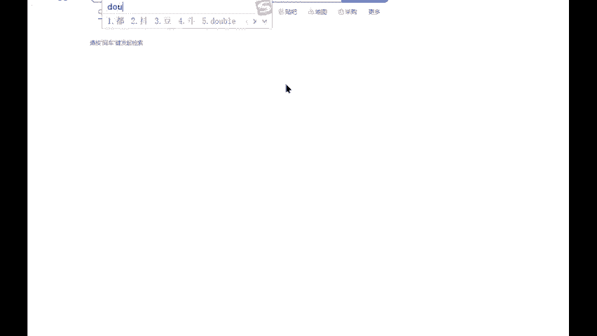
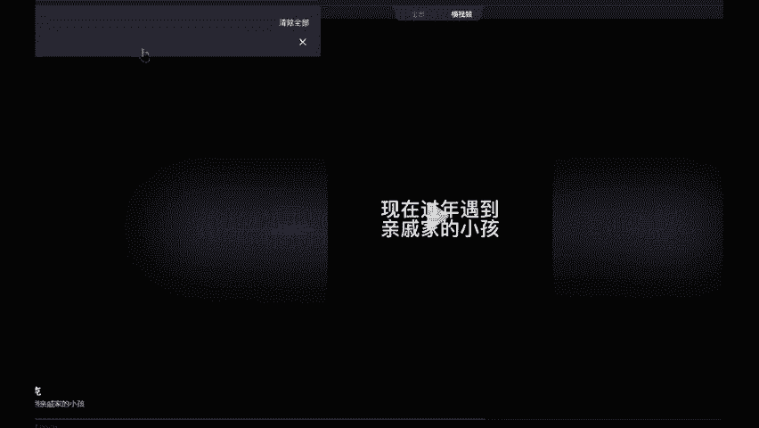
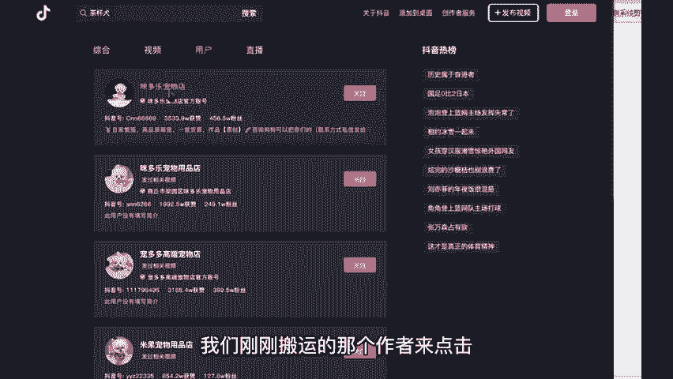
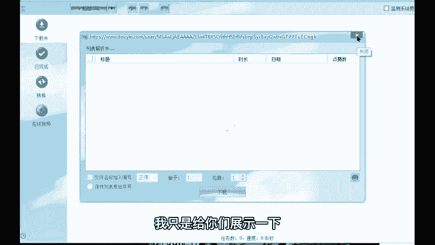
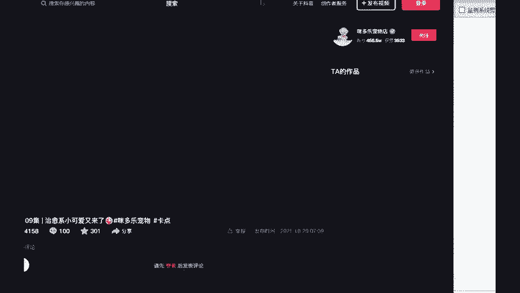
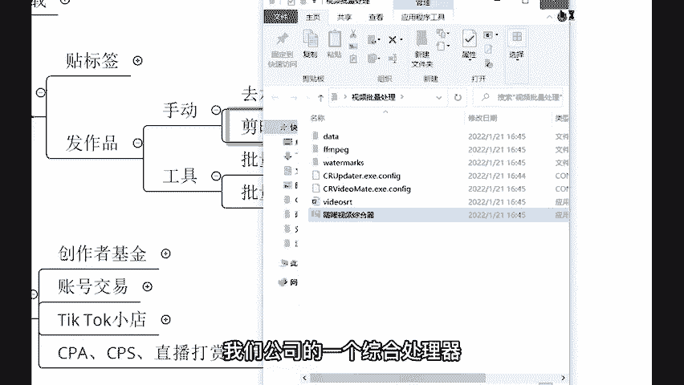
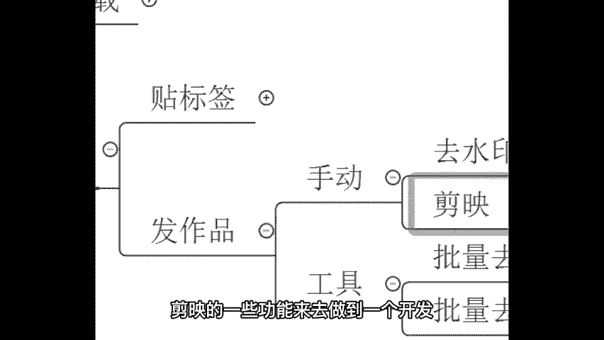
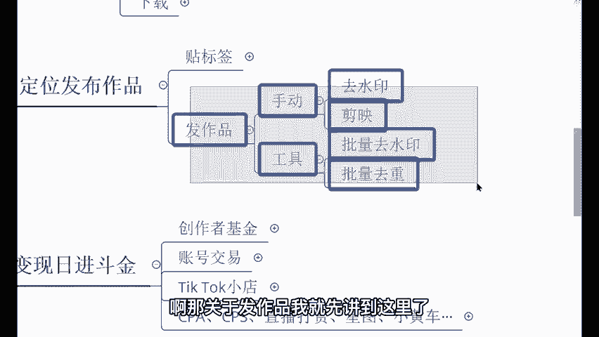

# 【2024年最新版】TikTok+亚马逊跨境电商运营全套零基础视频教程 （从入门到精通，日出百单！）学完适用全平台！ - P11：10.搬运视频工具 - 亚马逊小钢炮 - BV1GitDebEhC

嗯。那接下来我给你讲一下工具啊，工具工具会更简单一些，我觉得也会更加适合用这个新呃更加适用于这个新手。你们的话呢也刚开始接触这个国际抖音是吧？然后呢，想要去搬运作品啊怎么样的，也可以用到这个工具。

这个工具后续可以给到大家来，第一个的话呢叫做批量去水印。😊，嗯，批量去水印来，我这个工具给大家展示一下啊，这是我们公司自主研发的。嗯，花了几十万去打造的呢。现在的话呢就是可以给到大家去做的一个使用哈。

未来的话呢可以啊拉着更多的人去用。来，像这个呢就是去水印的一个工具了。那首先我们来先去找到一个视频，教大家怎么去水印。那个的话呢就更简单了哈，非常简单。😊。

直接的话呢把链接粘贴到上面就OK了。😡，抖音打开官方。官方跑哪去了？现在过年遇的。来，我们找到那个茶杯犬的那个视频啊，茶杯犬。

来米多乐宠物店是吧，我们刚刚搬运的那个作者来点击点进他的一个主页。那人家的主页呢有多少？729个作品，729个作品，是不是？我们如果说想要针对性这一个人针对他一个人去搬运他的作品。

我们就直接可以把他的链接，把他的主页链接给他复制。😡。

把它的链接给它复制下来，复制下来之后的话呢，把这个链接粘贴到这里。他现在呢就会去把人家这700多个作品全部给它做到一个去水印啊，但我不要这么多哈，我只是给你们展示一下，有这么一个功能。好吧。

那我的话呢就给大家搬运一个来试一下。我们看一下能不能找到我刚刚搬运的那个作品。😊。

不是这个啊，好像不是这个。哎，这个。

🎼场找作接下来我们也可以用工具对进行作链接这里。😊，链接并。复制复制好了之后呢，直接粘贴。现在就是在剪辑的过程当中，它现在就是在解析的过程当中，我们不需要管啊，就放到它放这就行了。待会儿的话呢。

它会自动的下载下来，下载成功，下载到嗯我们的电脑上面。😡，🎼下载好了下载好了之后呢，来我们来看一下啊。😊，点击这个文件。他这个视频就出来了。来，同学们看一下啊，是不是这个作品的话呢就出来了。

而且的话呢你发现没有特别高清，是不是和他的一个原作品是一模一样的，非常非常的高清是吧？这就是其中一个工具啊，批量去水印的一个工具。因为我现在的话呢只展示了那么一个就你如果说呃想要去搬很多很多个作品哈。

那你的话呢就可以是吧？人直接把人家的主页给他做了一个复制粘贴啊，几百个作品同步给你做了一个去水印，这就是呃批量起呃批量起好需要去用到的一个工具，你知道吧？这个未来的话呢，你们会发现这个东西很好用的哈。

嗯，因为我们未来学会了这套技术之后呢，你绝对不会说一个一个作品去搬运，你肯定是批量的去搬运的啊，这个就是功能，其中一个功能批量去水印。第二，还有一个东西啊批量去从。你比如我。😊。

自己哈我自己的话呢不是像这个手动用剪印，我不是用剪印的。我不是用减音，减音的话呢速度太慢了。😡，我用的是另外一个是我们公司的一个综合处理器啊，我们公司的一个综合处理器。这个东西呢。

功能和剪映上面的功能基本是一致的。因为我们的话呢就是按照这个剪映的一些功能来去做到一个开发。然后我给你看一下。

像这个加水印啊，去水印啊，裁剪画中画去去头尾呃，这个加头尾变速文本，还有这个背景音乐，全部都是按照剪映的功能来去做到一个研发。嗯，然后像这个视频唉视频跑哪去了啊，刚刚的一个视频的话呢，我可以直接把它。

我看一下啊，下载下载了。哎，没有下载。啊，刚刚那个视频，比如说啊我随便拖一个视频，随随便拖一个进去，进去了之后的话呢，这些功能全部都会亮起来。亮起来之后啊，这个软件叫什么？这个软件是我们公司自己家的。

知道吧？就叫耀西科技，耀西综合处理器。😡，这个不是东西，你可以在呃这个可以卖，但是的话呢直接可以给你，你下载不了的啊，你下载不了。那这个是我自己研发的啊。好，那咱们的话呢呃通过这个视频来点击一下。

点击之后我们可以调亮度。😊，啊，调亮度亮度可以往下调，也可以往上调啊。🎼对，往上调往下调都OK啊。然后的话呢这样这个饱和度呢也可以去调。调完之后呢，你可以去预览。🎼我发现好多小伙伴还不了解。

是不是可以去预览。如果说你觉得调过头了啊，不行是吧？太丑了，那你的话呢可以调回去啊，那像这一个什么嗯镜像水平翻转也是一样的。😡，🎼我发现好多小伙伴还不了解国际版抖音，国际版是不是？我让你们的话呢。

不要找这种对白的，也就是因为这个文字它也会对白啊，它也会去做到一个镜像尽量不要找那种有说话的对白的啊。然后像这个呃抽帧啊，每这个两秒两每两帧到每六帧啊，中间的话呢抽一帧啊。

这个的话呢我们简单的进行一个微调。两针。这个每两针的话呢，去抽那么两抽一针啊，然后像这个动态缩放，还有饱和度。这个应该你们刚刚听老师，我在讲这个剪映的时候，应该都能够。现在我不想再讲一遍了哈。

刚刚已经讲过了哈是吧什么是抽帧是吧？什么是动态缩放啊，什么是放大，什么是调整画面，是不是？这些功能的话呢就一应俱全，全部的话呢都是在这里，就不需要像抖音这个剪映一样，在一个手机里面1。1点的去戳摸啊。

1。1点的去用，知道吧？变速啊，也在这里加头尾去头尾画中画裁剪啊，还有文本还有背景音乐。好吧，这个功能就很适合新手。😊，因为你怕你们会去忘记有哪一些步骤。😡，知吧有些同学呢做了这个是吧？😊，呃。

变换这个滤镜。但是的话呢会忘记如何呃忘记这个抽针。但是的话呢你有这个工具，你就全部的步骤都能够说记得到。好吧，我就简单给你展示一下哈。未来的话呢，你自己拿到这个工具之后，呃，你不懂的，你再问我好吧。

这个会给到大家。但是的话呢，你得要把整堂课听完，我才给你啊，是不是？如果说你都没有听完，我给你这个工具，好像也没有太大的作用，好吧，也帮助不了你啊。😊，啊，那关于这个八作品就有两种选项嘛。

第一个的话呢就是手动发啊，第二种的话呢就是工具啊，用这个工具的话呢，效率会更高一些啊，弹射起步。啊，那关于发作品，我就先讲到这里吧。😡。

