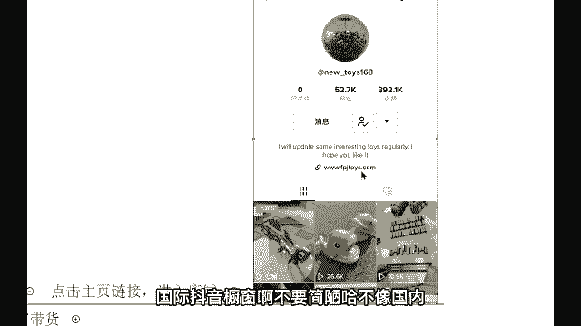
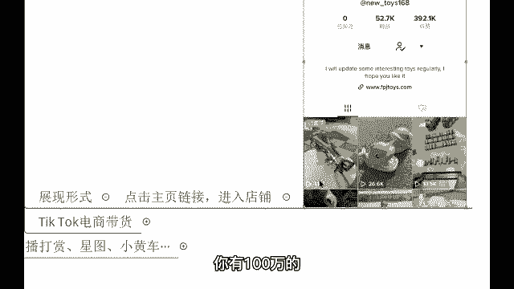
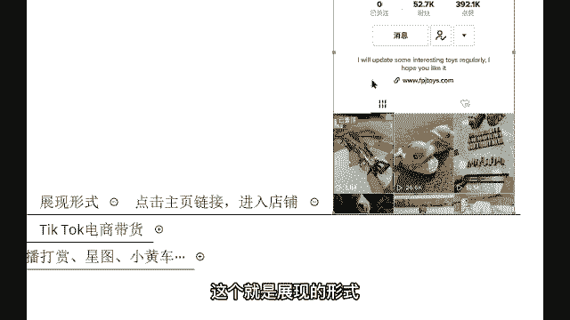

# 【2024年最新版】TikTok+亚马逊跨境电商运营全套零基础视频教程 （从入门到精通，日出百单！）学完适用全平台！ - P14：14.账号变现渠道：TikTok小店 - 琉璃月下梦2 - BV1FjbFePEo7

う。如进抖音小店的话呢，这个才是我们未来要做的一个东西。你像账号交易，可能对于有些同学来讲，不想好去布控这个。😡，这个基金呢哎人家的话呢搞个一两年可能就萎了啊，人家的话呢就不让不让搞了是吧？

基金就没有这么高了，那什么才是长期能做的呢？😡，国际抖音小店。啊，老师，你看我积极不？好，来，咱们助理老师把他名字登记起来哈。待会儿的话呢给他发一份啊，你可以加我的账呃，你可以加我微信。

我到时候给你发也行，找助理老师发也行啊。我看你确实很积极啊。好，那这个国际抖音小店，我给大家讲一下这个优势啊。😊，啊，都很积极都很积极，我都看得到的哈。对，咱们助理老师会登记的，放心。😊，好。

那讲一下这个优势，他没有门槛。刚刚有同学说老师人家粉丝没有到1万啊，我告诉你，国际抖音小店，他没有门槛，没有粉丝也可以挂。但是的话呢不要不要那么这个冲动啊，立马的话呢挂个链接上去，这个营销性质它会很重。

😡，营销性质太严重了，不要。啊，等到你这个视频到了，视频起来了一个，你再去挂这个链接，知道吧？好，它的变现很快。😡，变现很快，你只要把你的账号活跃起来，你只要去发布作品，你的播放量上去了。

有播放量就会有人买你的东西。啊，成交转化率非常的高。因为外国人对这个带货属于一个凌认知。人家的话呢就觉得哎这个东西很新奇，很好奇，人家就会点进去，点进去呢要你买哈，人家就买了。外国人花钱是大手大脚的哈。

😡，而且的话呢是透支消费，很喜欢去用信用卡。人家花钱是很凶的哈，就像我们18年19年那会儿，这个国内的带货刚刚兴起的时候，不也一样吗？对于国内那个抖音带货，哎，这个功能很好奇。

你们有没有在国内抖音上买过东西？😊，大多都买过吧，因为这个东西的话呢，我们也想尝试一下，看一下这个是啥是吧，到底上面的东西怎么样，是不是会产生这种好奇感啊，那这个的话呢也是呃外国人也是很好奇，买过很多。

是不是？好，那我跟大家讲一下这个展现的形式哈，它不是小黄车，它不是说看着看着视频，左下角会弹跳出来的那个小黄车，还不是人家还在内测，目前的话呢，它叫做一个抖音图框。😊。

抖音服窗像这个点击主页的链接进入店铺，来给你们来看一下。这是老师我的一个账号，我去做的一个账号呢是做好物种草，就是推荐那些玩具。比如说你看到了这个视频里面的这个玩具，你比较喜欢是吧？你感兴趣。

那你想买怎么办？想买的话呢，你就可以点击这个链接，你可以点击进入进入之后，这里面的话呢，各式各样的玩具，你都可以做到一个购买啊，就这个这个就是抖音的橱窗，国际抖音橱窗啊，比较简陋哈。

不像国内国内的话呢还有个购物车在那里是吧？因为现在的话呢还不太完善啊。但是的话呢这个功能的转化率还是蛮高的哈，你有100万的100万的播放量，这个出单率已经是非常的高了哈。😊。

这个就是展现的形式，你们自己的话呢要看到哈。😊。

行。