# 【2024年最新版】TikTok+亚马逊跨境电商运营全套零基础视频教程 （从入门到精通，日出百单！）学完适用全平台！ - P18：1.跨境电商市场了解 - 琉璃月下梦2 - BV1FjbFePEo7

好的，同学们，今天呢给大家讲的内容是跨境呃亚马逊注册店铺的流程，个人店铺和企业店铺的注册流程。今天我给大家演示一遍，还有里面具体的一些非常重要的细节，为什么还要讲这一课呢，因为之前讲过。

但是呢我发现最近老师反馈呢，有很多同学他会遇到一些所非常一些简单的问题，但是他就是不理解，他就是不理解。比如说那到底应该选美国还是选中国，那收款地址到底应该写什么，怎么填，他是很多很简简单的问题。

但是他他不理解，所以说我在这节课给大家再详细讲一下这些所有的你关心的流程，我尽可能把你们关心的流程都给讲出来，等客户再留大家时间来给大家解答。好吧。好，无论你有没有注册过店铺，或者说准正在准备资料啊。

或者说老师已经注册好了，或者之前注册没有注册成功啊，你都要听一下，我都建议你听一下。😊，好，那首先好首先知道今天要讲的内容，好吧。好，那今天开始来进行讲。好，首先第一个点就是前面给大家做一个引子。

因为这个还是之前跟大家讲的一个有重的一个课件哈呃，我就带动一下。首先呢就是这给大家引子。比如说亚马逊啊是95年成立了，这个就没没什么可说的。大家给大家简单提一下就行了。好，这个不是重点。😊。

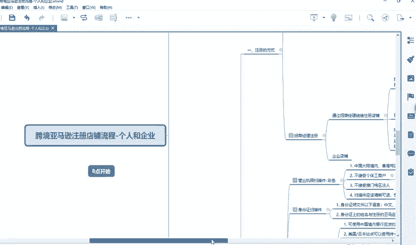

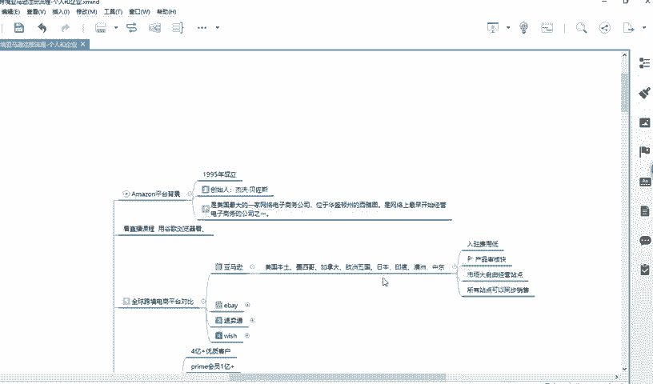

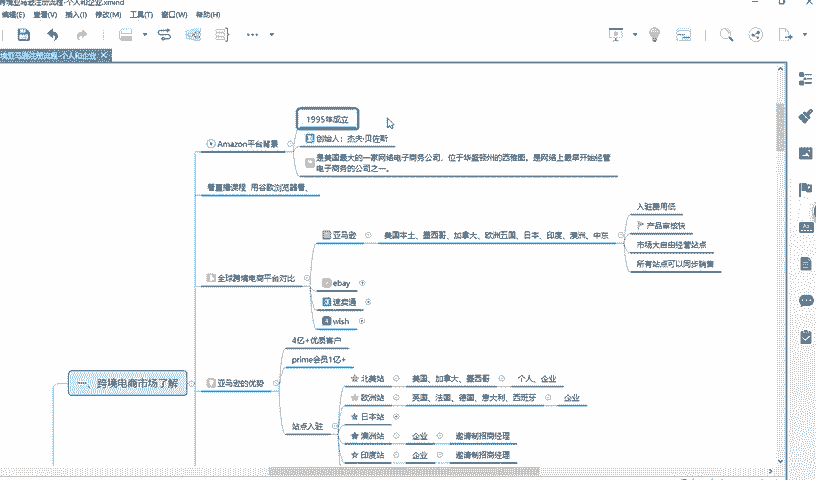

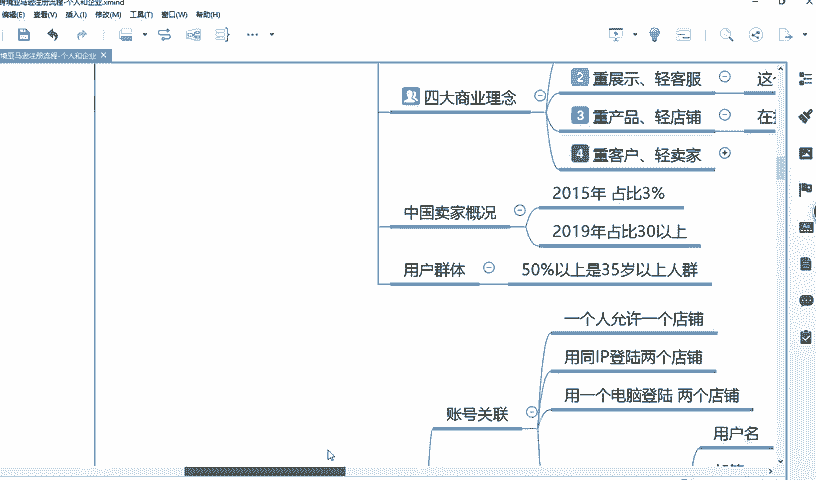

你要知道你这么回事就行了。第二个点呢，就是重要讲的就是亚马逊就是你有几个站点嘛，北美、欧洲、日本站、澳洲站、印度站和中东站像北美和日本站呢，你可以注册个人店铺。

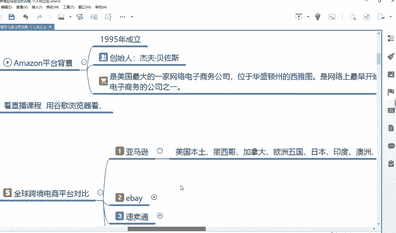

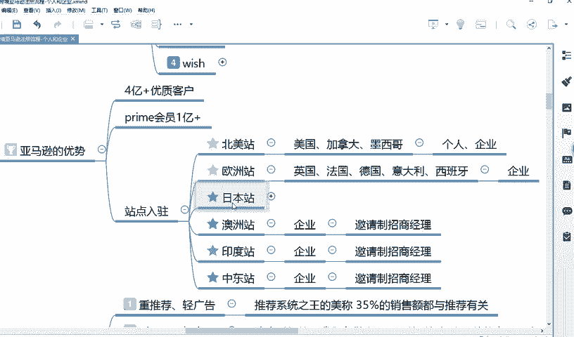

其他的你都要注册企业店铺，就是都要有营业执照才能注册。好，这是一个重要的点。

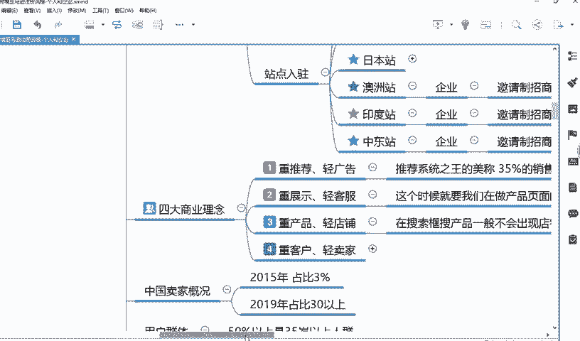

第二个点呢就是你账号关联这个很重要。账号关联就是你要记住一个概念。比如说一个人就是一个IP1个电脑，他只能登录一个账号。好，那这个时候就会有人问我一个问题啊，他老实啊我在家。

比如说老师我在家注册的这个店铺。那我能不能带回老家，或者说带回公司能不能登录这个账号了。好，你问这个问题，就说明你还是不理解这句话，就一个人只能允许在一个IP或者一个电脑上登录。那什么意思？

为什么你不理解，因为。你在家登录，比如说你注册好这，那没有问题，对不对？你在公司能不能登录里，能不能登录。那我应该问你，你在你公司有没有登录过其他亚马逊的账号，如果登录过，那你就不能再登录了。

如果没有登录，那你就不要登录，你懂我意思吗？就像你在老家，你说我去我朋友家能不能登录嘞。那那你我应该问你，你朋友家有没有登录过亚马逊的账户，对不对？有的话，你就不要登了。没有的话，你就登。😡。

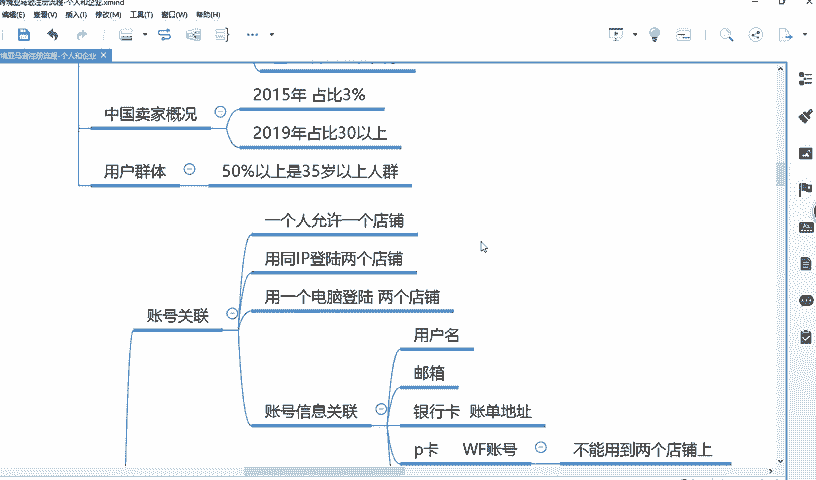

或者说老师我去一个宾馆的，我不确定那别人有没有登过，那你就不要登嘛，你最好对不对？或者说你用自己的外流量热点来进行登，你懂我意思吗？

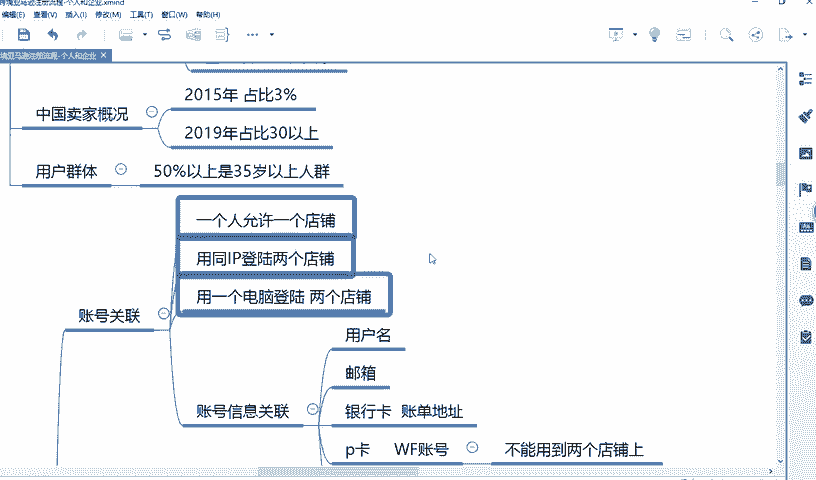

所以说你理解这些话，你剩下的一些小问题，你都能够迎刃而解了。你不理解你会问说老师我去个宾馆，那我能不能登你，对不对？那这个问题就就很尴尬。因为因为你问出来这个问题，就说明你还是不太懂理解这句话。好。

关于账号关联这个问题有没有懂。😡。

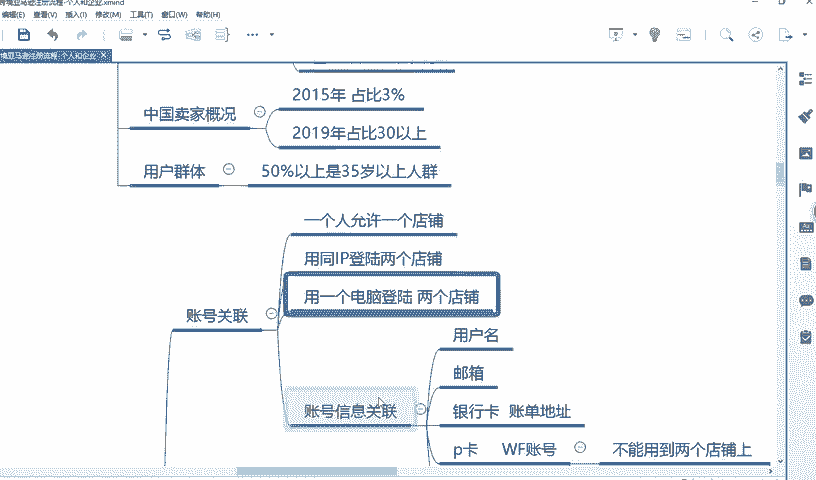

好，这点能懂的跟他打球，这个以后就不要再问了。好吧，你能不能登，你自己应该知道啊，不是不是我问你的，不要，不应该你问我，应该我问你啊。😊。

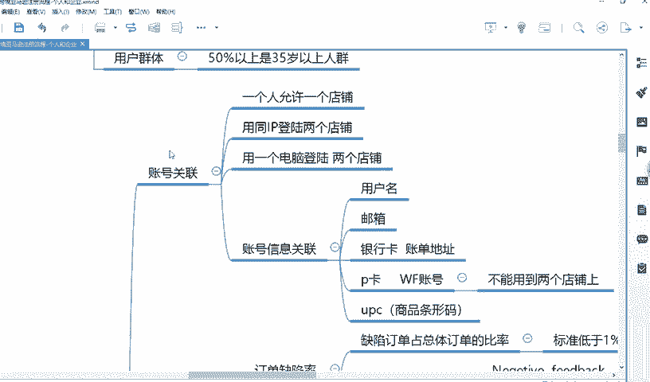

好，其他的什么什么这样，这个到时候课件发给你们，你可以自己去看。好，那我就不讲了。好，首先我讲一下，比如说呃亚马逊其实有两个呃一个注册的点嘛，一个是个人注册，一个是企业注册，对不对？😊。

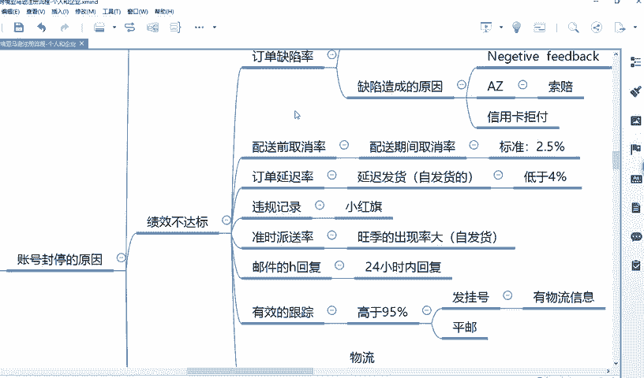

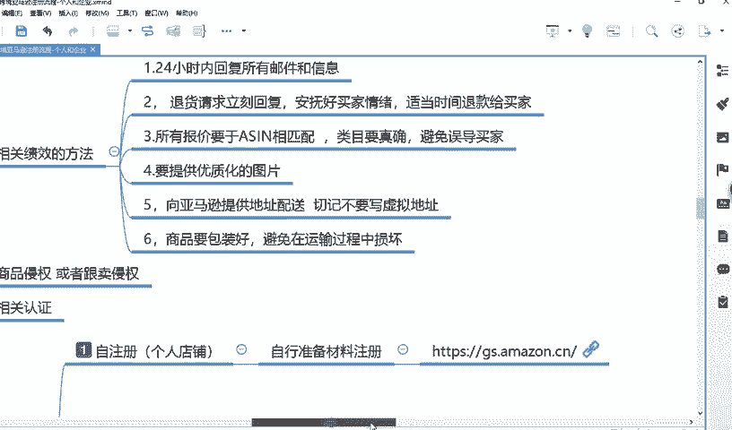

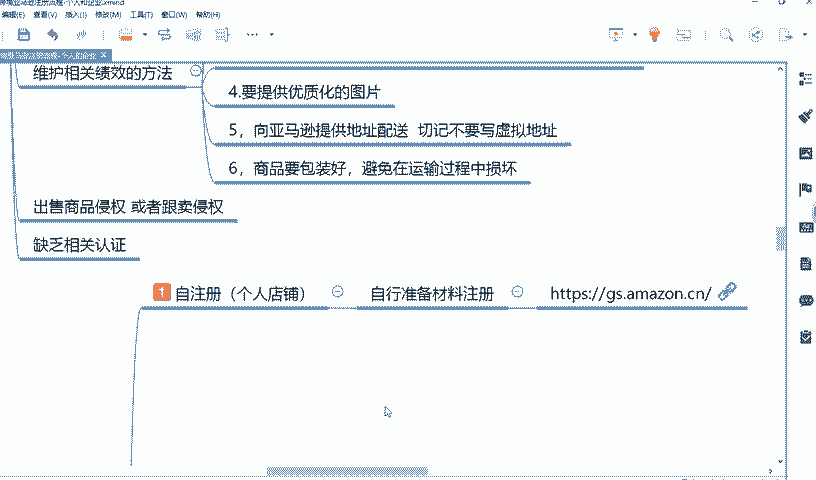

就是个人店铺和企业店铺无非就这两种嘛。好，无非就这两种。好。😊。

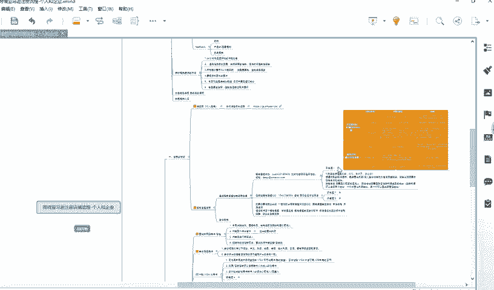

好，首先呢就是给大家讲一下，比如说你注册店铺。

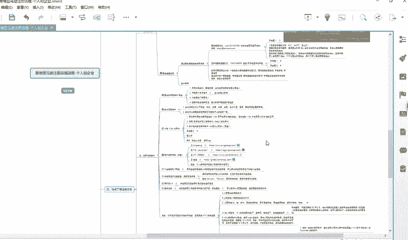

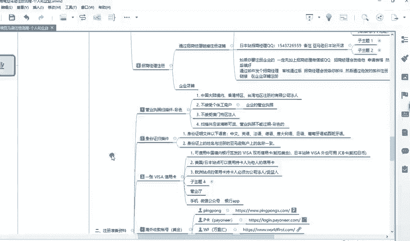