# 【2024年最新版】TikTok+亚马逊跨境电商运营全套零基础视频教程 （从入门到精通，日出百单！）学完适用全平台！ - P19：2.个人店铺准备资料 - 琉璃月下梦2 - BV1FjbFePEo7

我今天会重点给大家讲一下个人店铺该怎么支付的那企业店铺其实一样，你把个人店铺的姓名换成营业执照的姓名是一样的，所其实没什么呃可区别的。就是你重点听清一个流程，剩下流程基本上你就换一下东西填一下就可以了。

好，首先第一个点。😊。

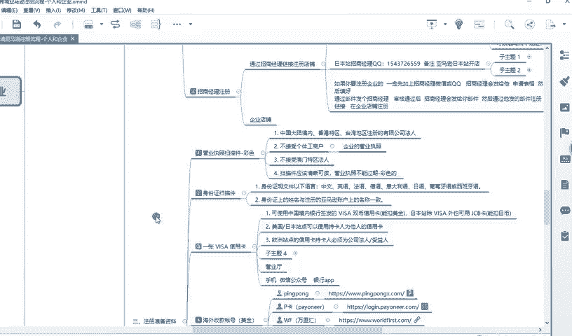

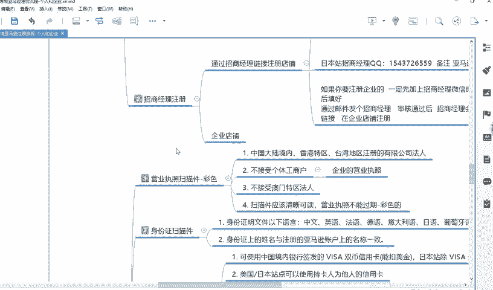

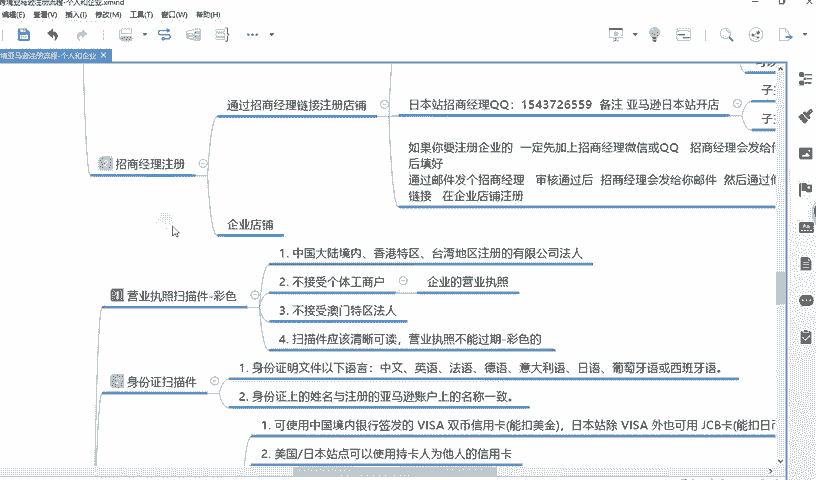

对于你个人店铺来讲，你需要准备什么资料？个人店铺准备的资料。第一个是身份证。好，这营业执照先不管了，我我先讲个人店铺，个人第要你需要准备的东西，第一是身份证证，身份证，好。

身份证你可以用扫描件也可以用拍照都可以好吧，都可以，这个都可以。当然什么中文德文日语法语西班牙，然后你你你是当然大家是中国人，的就是中文的嘛，对不对？那只不过写的比较详细一点。😊。

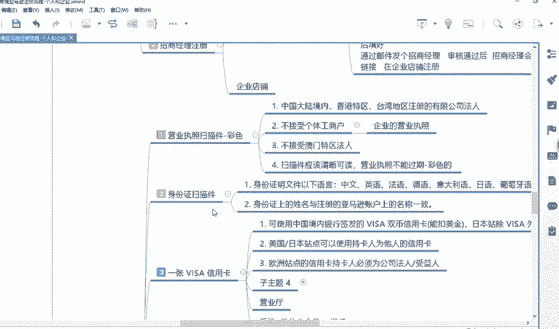

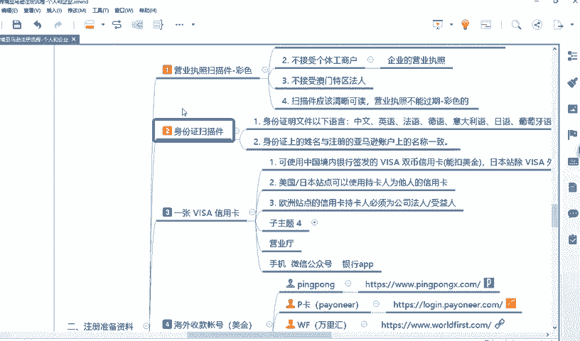

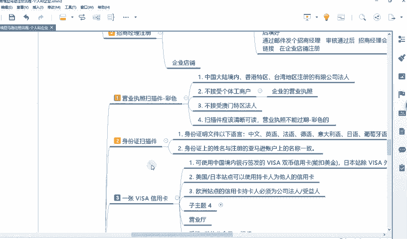

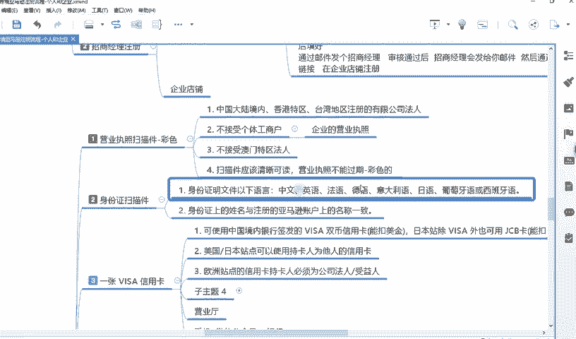

身份证上的姓名与注册亚马逊上的姓名一致。换句话说，就你这些比如说身份证啦，还有微R卡啦，下面所有的信息都要是同一个人的。你懂我意思吗？比如说好，比如说注册。

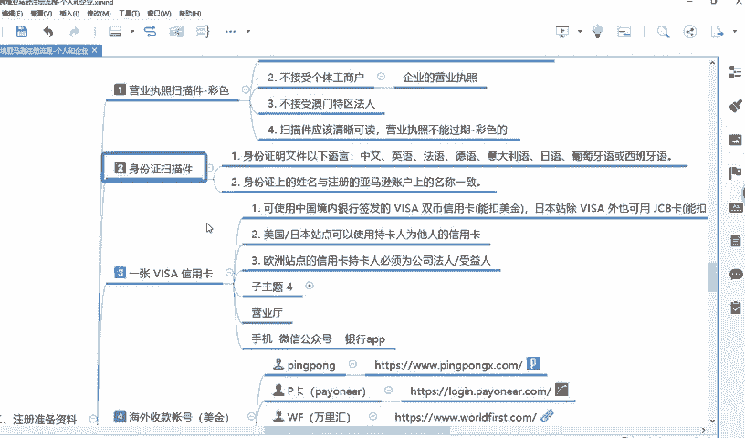

好，我再大家重新写一栏吧。好，这个。重新写来吧，防止大家忘。

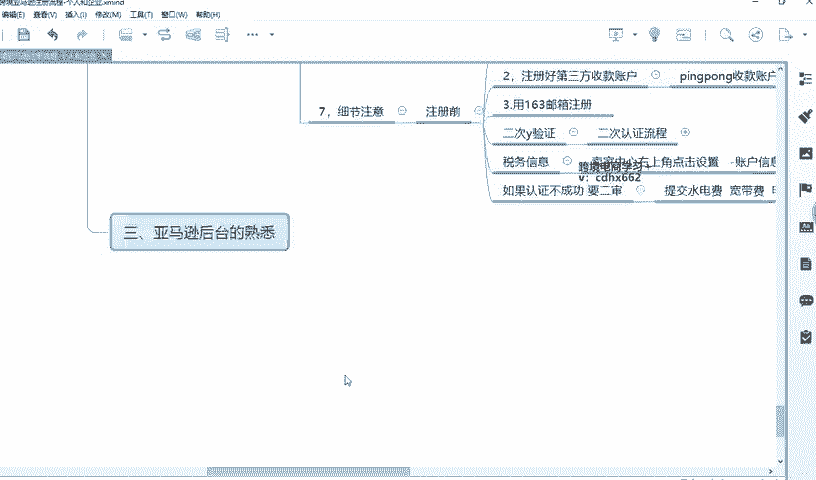

好。好，个人店铺准备资料。好，准备资料。首先第一个就是你你身份证嘛，对不对？身份证或者是拍照或者是扫描。

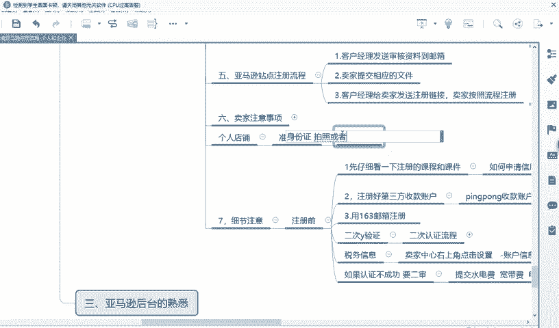

对不对？扫描就你正反面拍照啊，或者说反面拍照啊，但但它会提示你提示到时候让你该怎么提交，你就怎么提交，到时候再拍摄嘛，那也不晚。好，身份证。第二个呢就是你的一个。

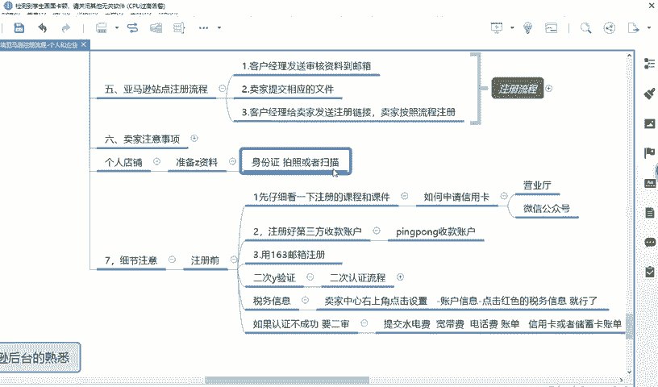

呃，准备两个准为信用卡。或者储蓄卡。账单好，最近3个月最近1到3个月。仔细听啊，最近1到3个月仔细听啊，你这点不要再弄混了。😡，好。我这节课我已经讲了，为什么要再讲一下，是因为有些同学他不理解。

你能理解吗？有些同学他不理解，还有一些同学是刚入学的，所以说这些有很多细节是没有没有涉及到的。如果你店铺已经注册好了，你可以先不讲，能理解吗？你可以先不听，你可以听之之前的课。懂我意思吧？好。

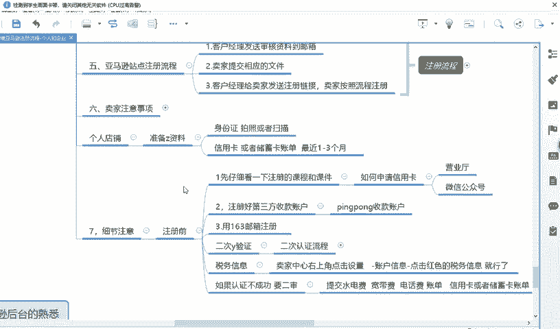

最近1到3个月的账单。好，那这个时候就会有人问了，说说老师，那我那这个时候会有几个细节，比如说会有人问这样的问题，他说老师，那我老师我这个没有信用卡怎么办呢？好，你没有信用卡，你就是储蓄卡，你懂白吗？

没有信用卡，你就是储蓄卡，储蓄卡一定是注册人的名下，注册人的储蓄卡或者信用卡，知道吗？😡，或者信用卡。账单知道吗？这个账单一定要去银行打印。去银行打印，银行营业厅去打印打印之后，然后再进行拍照，拍照。

然后上传。为什么什么时候会是要上传，是需要。

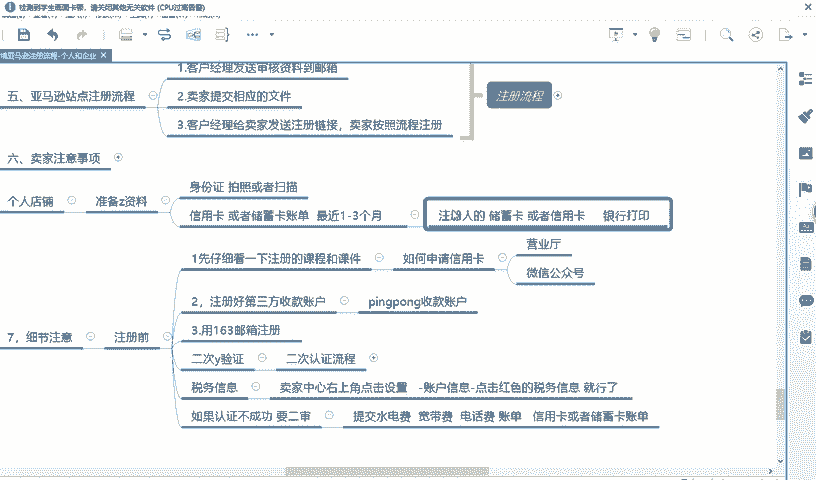

呃，是是你注册的最后一步，他愿意提交这个东西。等会我会讲到哈，你要知道，当你他需要账单的时候是注册人的。比如说你用你自己的名字注册，或者你用爸妈你的名名他的身份证注册，你就用他的信用卡或者是储蓄卡账单。

如果他有信用卡，你就打印信用卡账单。如果他有信用卡，但是他没有消费，那你打印出来是空的，那你也不要用嘛，你就用储蓄卡，对不对？你不能说老是用储蓄卡他也没有消费，那就不是一个正常人了，知道吗？

你为什么你看你为什么你说注册美国的这些东西，他为什么要这种信用卡各种账单，是因为美国人的消费习惯就是这种信用卡消费的嘛？😊。

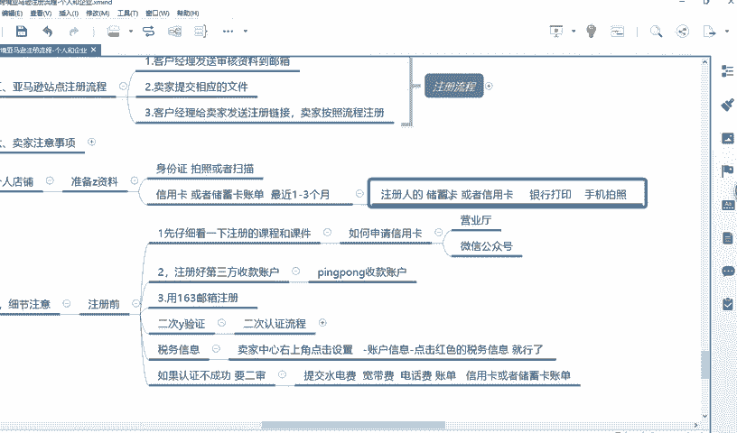

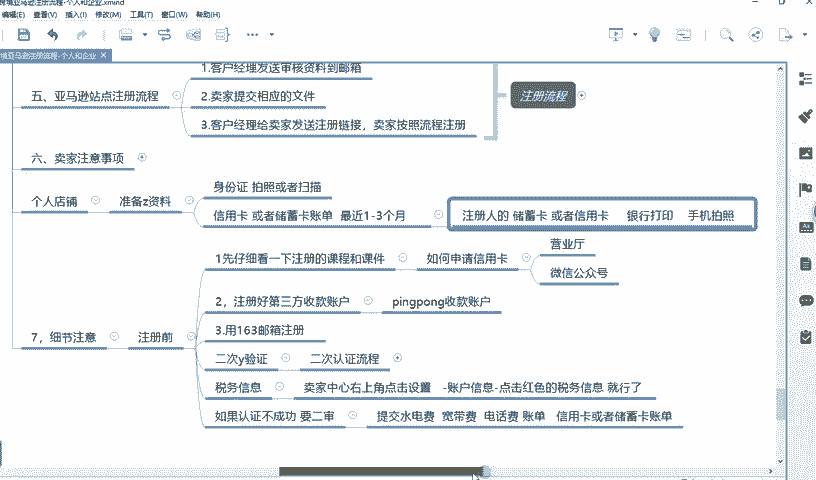

所以说他比较在意这个，你像你住在淘宝，他可能就不需要你什么信用卡了，他肯定直接你银行卡账号填上就行了。这是他美国习惯嘛，所以说呃你就按照他规则来就行了。你懂我意思吧？这点能懂的给到打一好。😊，好。

等会儿微R卡，我也告诉你该怎么注册。好吧。好，这点能懂了。好吧，还有一个细节问题，还有有人问的，这个也是老师之前没有想到的，对不对？或或者说老师不觉得不是一个问题的一个问题。

比如说老师他说老师我最近3个月。😊。

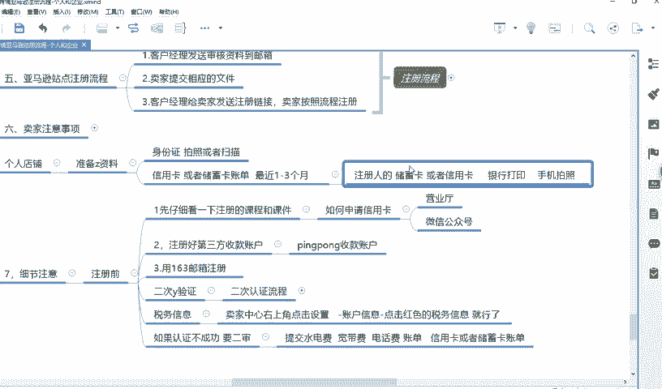

的账单我打印了好几张哎。😡，好几张，但是呢你注册的时候啊。😡，注册的时候呢。他只能够上传一张照片，那怎么办？

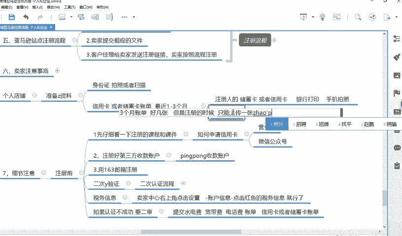

来怎么办？你们觉得怎么办？这个问题怎么解决？😡，信用卡可以用别人的吗？当然不行了呀。就是你你你所有的信息都要是同一个人的。如果你。😡，如果你身份证是别人的，当然信用卡就可以别人了吗？能理解吗？好。好。

我告诉你有两种方案。如果你打印了，比如说老师我打印了3张，对不对？你可以把三张拍在一起拍个大图。或或者说几张图片拍在一起，就是几张图片放在地上或者窗在桌子上。翻译起。

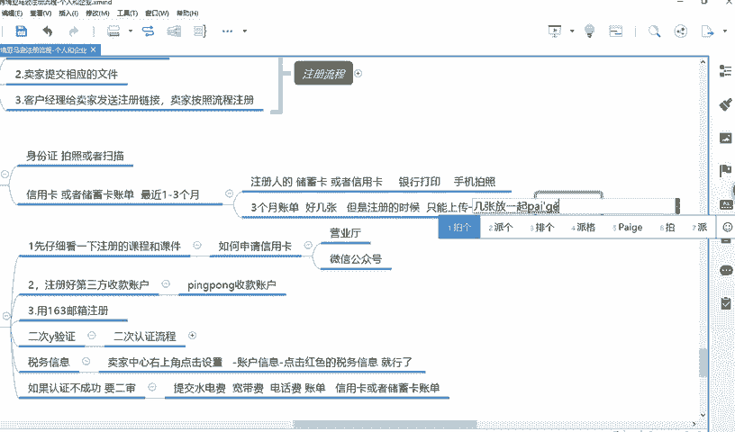

或者是什么呢？或者是你就拍摄。最近一个月的就拍。最近一个月的就是最近一个月的账单，比如说就就是就是那个呃一张啊，就是最近的一张的一张的账单。

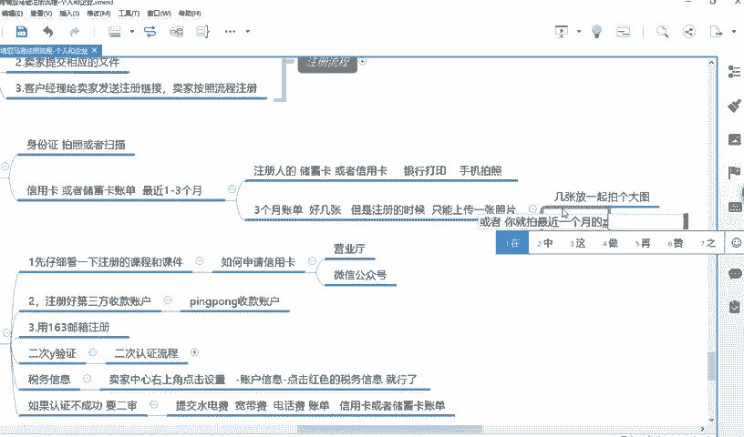

然后拍摄一张就行了，就是你上传一张就行了。意思了。比如说你弄打印了3张，对不对？你比如说你消费比较多，打印了3张，你你拍摄一张就行了，拍摄最近的就行了，最新的就行了。懂我了吗？这句话这个意思能懂了吧？

所以说这个信用卡。😊。

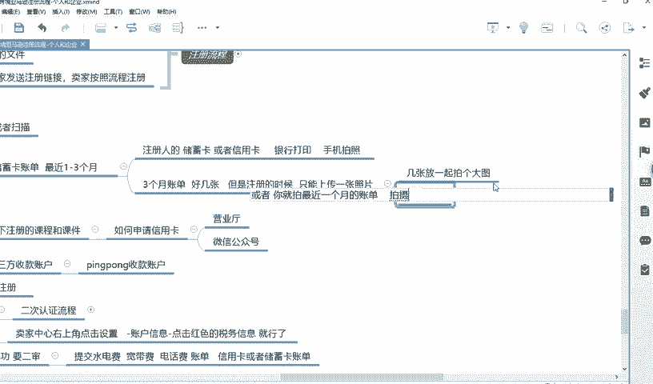

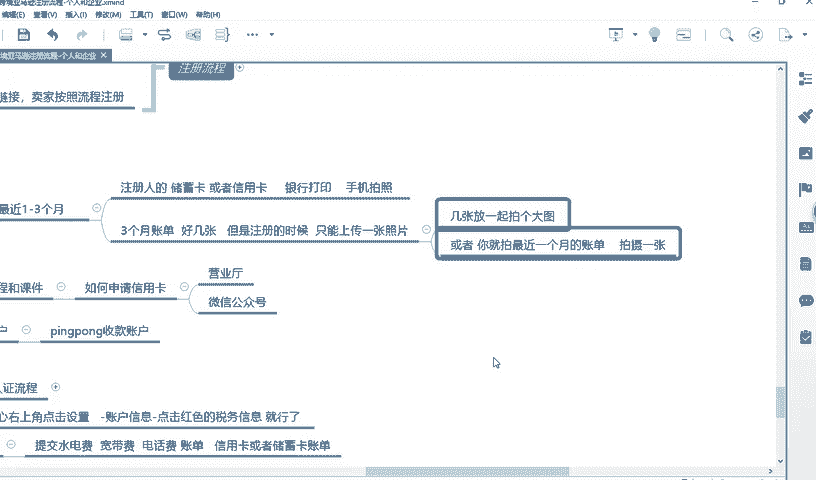

能理解了吧？好好，信用卡该怎么样上传或者拍几张啊这种问题细节问题我也给你讲到了。好吧，因为是学生注册的过程中会遇到这些问题。其实这个问问题在老师看来可能就不是一个问题，但是有学员他提出来了。

他可能不太理解，他他有些担心，还上传怎么上传啊，或者说他不知道怎么灵活变通。这次老师一次给你们讲讲清楚。好，下面一个点。😊。

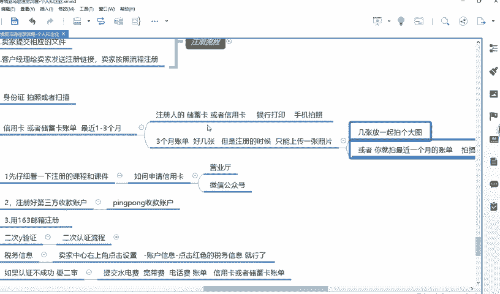

好，5张如果摆开的话，他拍摄的话不太清楚啊，你最好拍一张就行了，一张也能够审核通过。只要你拍的清楚，一般手机不都像素比较高吗？好，周五也有课，好吧，好，这点能懂到给他打一。好，然后再讲下面一个。

比如说还有一个叫办visa卡，对不对？😊。

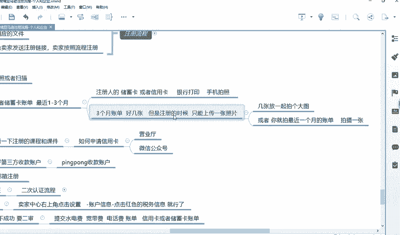

好，办理微啥卡。好，办理微a卡这个事情是这样，就是你办vis啥卡一定要是注册人。比如说你注册人的vis啥卡，名下的vis啥卡，你肯定不能用vis啥卡就是双B信用卡。就是你拿这个信用卡可以去外国消费。

就是这个意思嘛？说明信用卡一定是注册人名下的，是吧？你不能说身份证用你自己的，然后你信用卡可不可以用别人的那肯定不行啊，对不对？

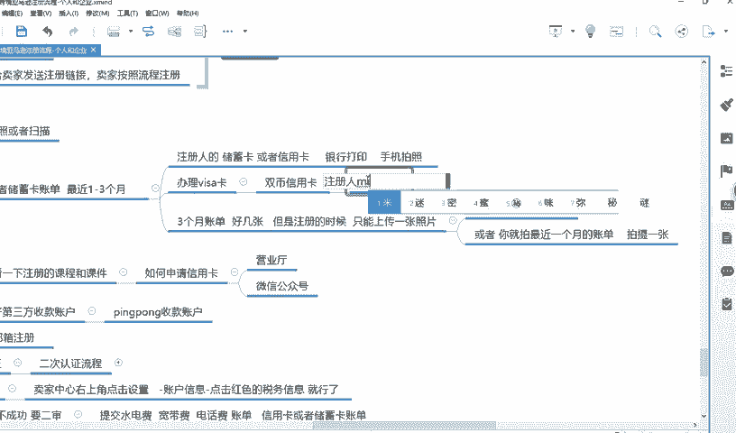

好。好，那这个时候该一个点，那这个时候该一个点就是该怎么办理呢？好，怎么办理有两种途径。第一种你自己去银银行营业厅。好，自己去银行营业厅去办理，去哪个银行，你就去大点的银行就行了。比如说什么建设银行啊。

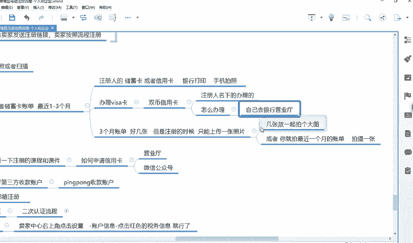

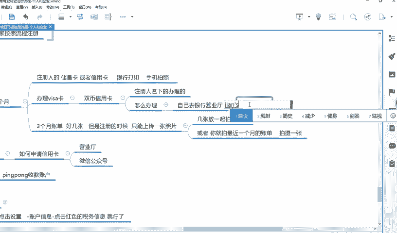

对不对？比如说什么工商银行啊。什么什么什么农业银行啊，当然老师不是为了给他们呃什么打广告啊，就是你这些银行大四大银行或者说大的银行，什么招商银行都可以去办理，能理解吗？😊，人家。但是这个办理有一个条件。

就是你之前没有信用卡逾期啊。你懂我意思吗？你比如说你之前欠款是银是银行的黑户，那你自然办不了嘛？那这个那谁也办不了，你是不是那你之前只要是正常消费的，正常怎么样的，你都可以办，人人都可以办，知道吗？

人人都可以办，除非你是是那个未成年对未成年一般也不会学学这个嘛，或者说年纪很大了，你七八十岁了，你七八十岁也没有必要做这个了吗？能理解吗？好，第二种怎么办呢？就是在一般在微信公众号上。😡。

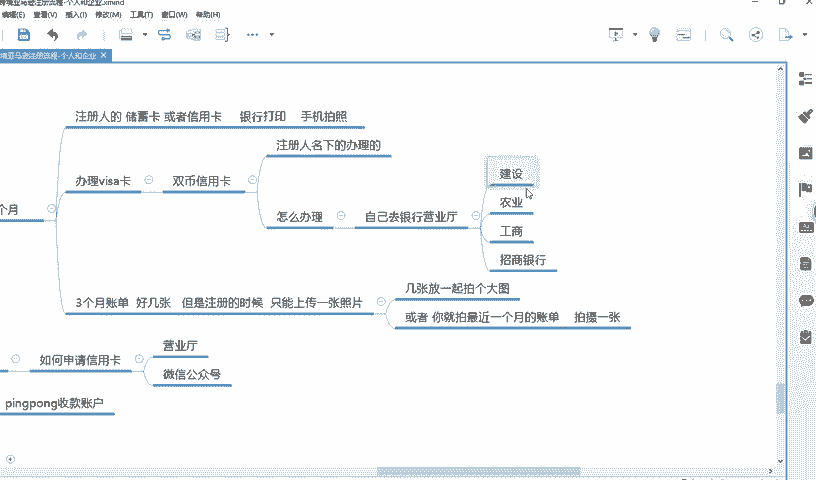

别。微信公众号。比如说比如说你想办建设银行，你搜索，比如说中国建。建设银行它基本上都有公众号，你关注一下，然后都有办理的入口能理解吗？比如你工商银行，你就搜索工商银行，然后关注一下那么公众号。

具体说该怎么办理，这个就不需要我教你了吧，你该点什么，该提交什么资料，他肯定都有都有信息的，能理解吗？好，怎么办理？双倍信用卡这个。😊。

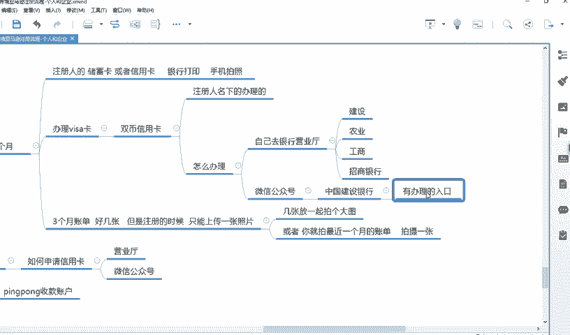

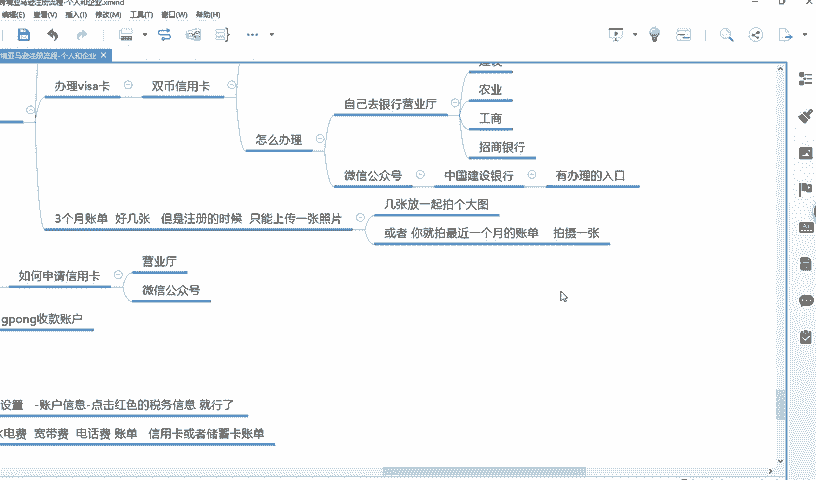

这个我跟你讲了哈，这点能懂了，给他给他打6。😊，怎么会不好办呢？老师在老师之前办的，在微信微信公众号申请就就已经办下来了呀。办理是有条件的。第一，你年龄要符合，对不对？你太大太年轻都办不了。第二个。

你信用卡没有逾个期是一个正常的一个消费者，那别人怎么会不让你办理？你现在手机上肯定莫名其妙的收个有短信说什么什么招商银行，恭喜你获得了6万额度的什么招商银行信用卡来办理资格请你办理。

人家都在大力推广这个事情，你办理信用卡，别人非常高兴的，比比办理银行卡还要高兴别人知道吗？因为他们可以从中拿利息嘛？当然非常高兴了，是不是怎么会不让你办理，只要你符合资格，肯定会让你办的呀。好。

这就是一个双闭信用卡，还有一个你要准备两个手机号。😊。

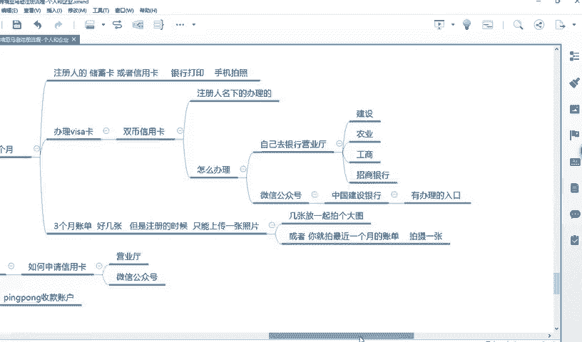

这是我给你重新写的啊。好，准备两个手机号，一个手机号，就你注册的时候用的注册的时候，他会让你时候用。

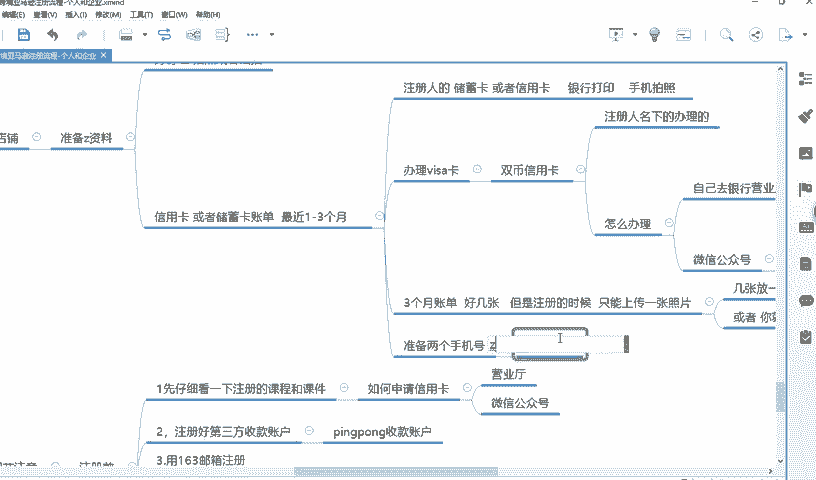

第二个呢就是你注册完成之后啊，有一个二次验证，注册成功后也不算成功啊，就是注册快成功的时候。时候他会有一个叫二次认证。等会儿二次认证是啥，我等会要跟你讲，好吧，基本上你注册过之后的。

注册店铺成功之后的人都知道，有二次认证，让你填什么下载什么什么什么认证器都得那个东西，等会跟你讲啊，二次认证的时候用，好吧，你最好要张准备两个手机号嘛？这两个手机号是谁名下的都行。

比如说老师我是我爸妈的一个呃身份证办理的可不可以的，就是手机卡任何人的都可以是吧？任何人办理的手机卡都可以。😊。

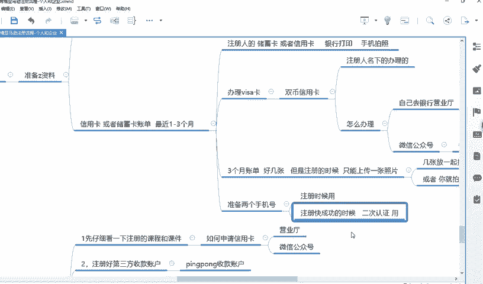

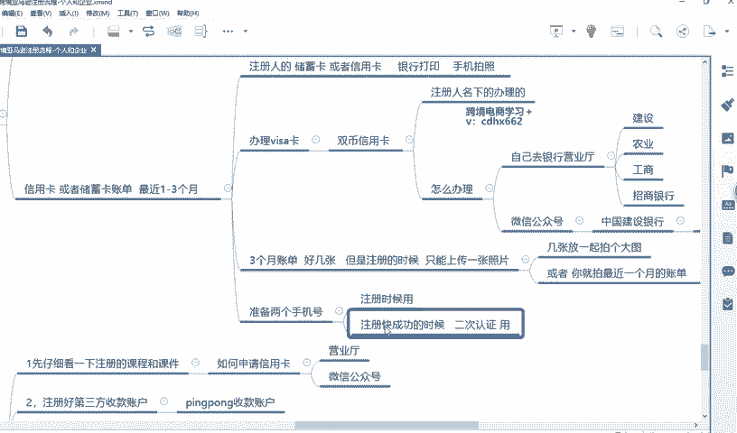

懂我意思吗？因为一个人因为一个人的身份证。嗯。因为任一个人的身份证可以在联通办5张卡，在移动办5张卡，在电信办办5张卡，能理解吗？就是他可以在可以办1来张卡。理论上当然，大部分人都不需要中那么多好。

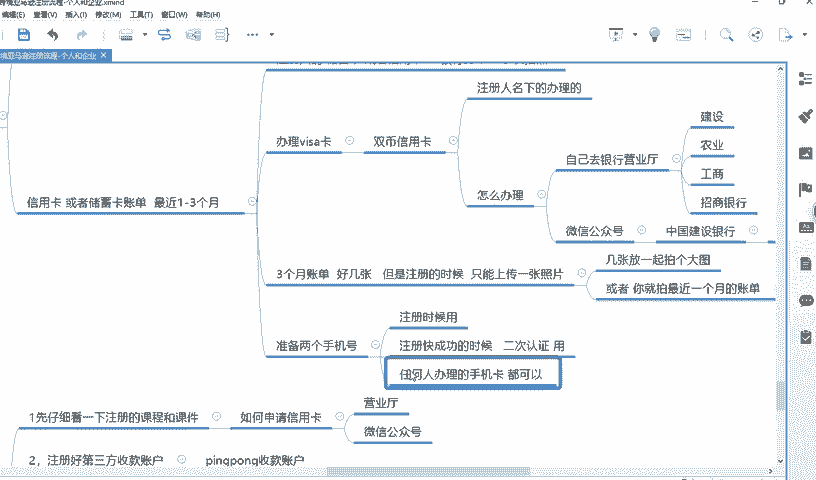

这点能懂了给他打一好，联通、移动都可以，好吧。😊，好，仔细听好吧，仔细听。仔细听。

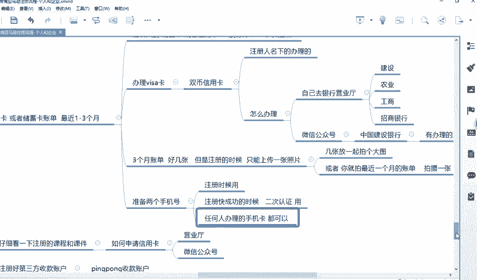

好好，这是一个点。好，这是你的准备资料啊，就是你你你一定要把这个东西先准备好，再给再再问老师什什么么怎么注册，或者怎么注册的课程在哪里学，对吧？你没有这个东西，你没办法注册的，知道吗？

不要说哎老师我头一日哎，突然想起来老师叫我怎么注册。那到时候你该填的资料，信用卡又没有办，然后账单又没有，你到时候还要去跑，对不对？所以说一下子准备好，你到时候就不用再跑二查了，懂我意思吗？好。

这是一个点。好，这是准备，就是你啥都没干之前，你就要准备这些东西了。好，这是你基本要用了。好，那。

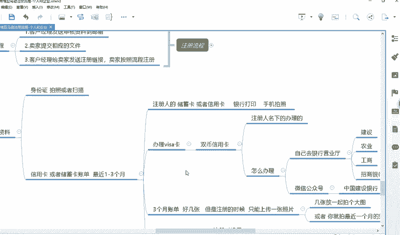

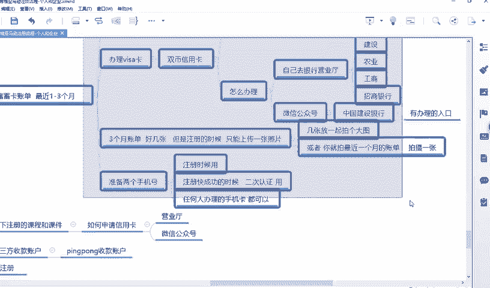

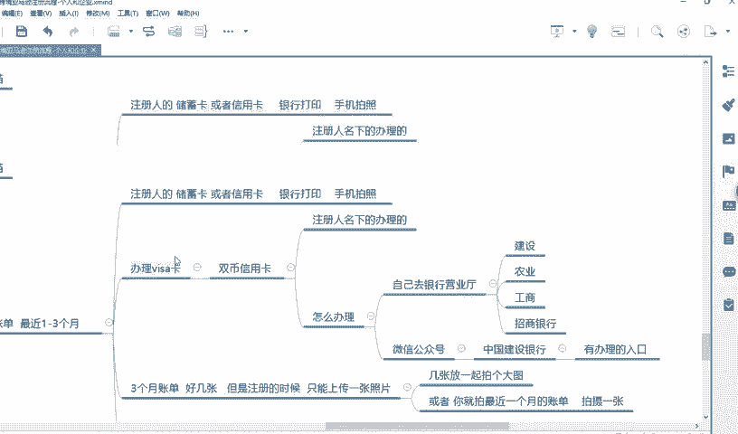

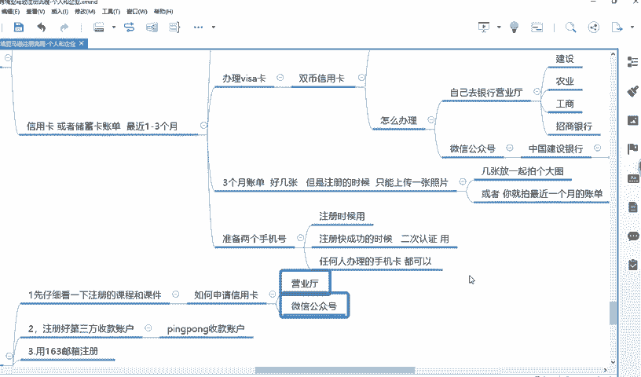

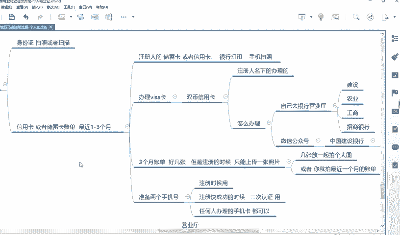

好，那那那是这个个人店铺是这样。那如果我的企业店铺里，企业店铺，我上述这些东西。

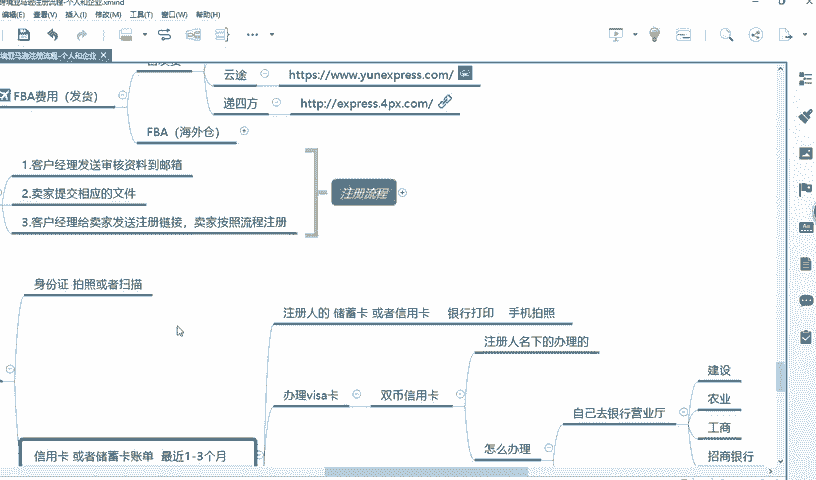

都要准备，但是呢要准备一个营业执照，就多一个营业执照能理解吗？多个营业执照好，多个营业执照好，其他的基本上都有。比如说你什么什么账单也要准备啦，然后法人的什么当然企业的话，你要多要什么法人的信息。

知道吗？法人的办理的双倍信用卡，法人名下的什么什么呃，什么什么这种账单啊，各种账单啊之类的，能理解吗？好。

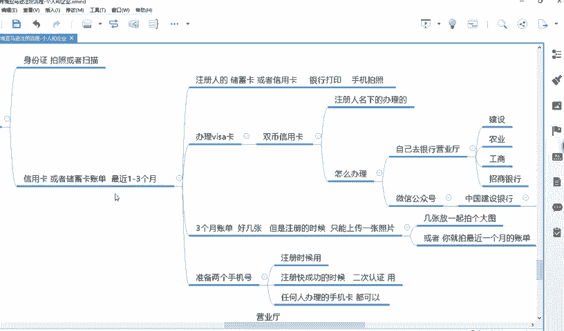

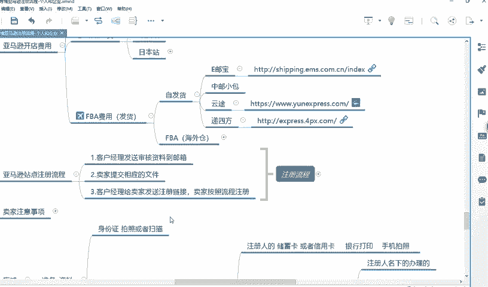

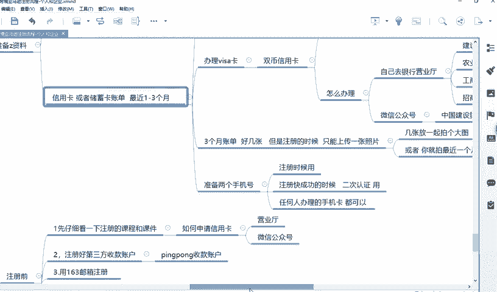

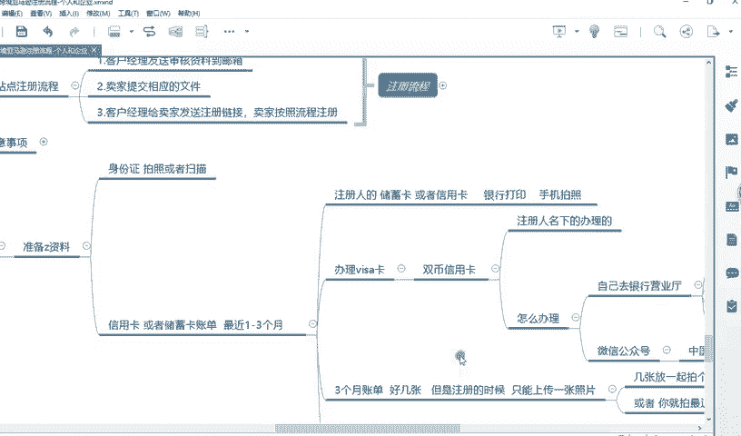