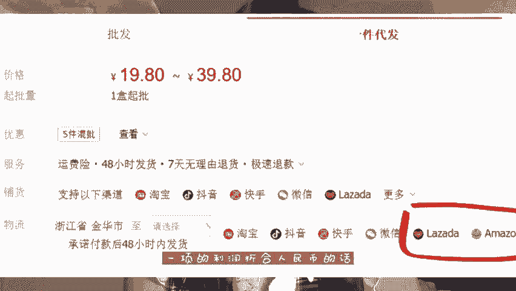
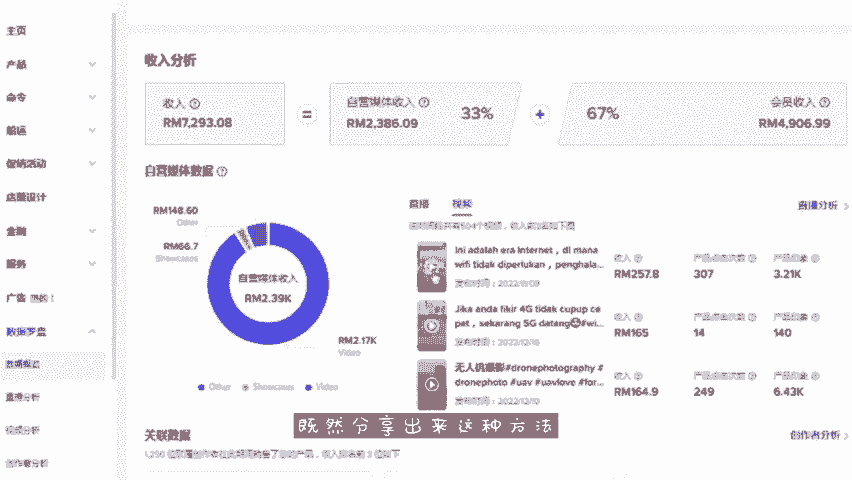

# 【2024年最新版】TikTok+亚马逊跨境电商运营全套零基础视频教程 （从入门到精通，日出百单！）学完适用全平台！ - P1：跨境电商 - 琉璃月下梦2 - BV1FjbFePEo7

up主视频凉了。🎼视频出示了正式昨天夜里，大部分的人都是来白嫖的啊。🎼hello大家好，最近呢也是一直在深入研究GPT我发现啊已经有很多人啊利用它成功赚到了钱。

有些人呢利用镜像网站的植入的方式啊把自己的公众号里面做的收费服务，基本上没有什么运营，一天就能拿到2到3万的流水直接利用在一些付费回答网站回答问题，每天呢只用机械式的搬运。

就赚个几十那我几小团队呢用它来做小红书带货网站，以经辅助我们带货视频，现在呢却已经非常丝滑了。虽然PT非常牛，但是中国啊至少有11人没有怎么使用过大多数人啊甚至连怎么登录都会时代的风格已经到来。

现在掌握I的人一定是场第一批红利的人会使用I人到淘汰那些不使用I。那么我们如何去利用T赚到第通金去年的创建了个账号在平台上面发布了一些有趣的玩视频也上架了国内的一些。🎼商扣除一些成本的话。

我大概算了一下，折合人民币的话，差不多是在10万左右。那么现在TGPT已经更新到第四代功能也是更加的强大，不仅能帮我们去做视频，而且最重要的一个可以直接帮我们去洗稿制作出那种爆款视频。

最近的话我也是尝试发布几条PT制作的视频，其中一条视频播光量高到几百万。包括小编的设例在内的话呢，已经赚到了900多美元。首机的话我们只需要准备一台IOS系统的手机，并且去注册一个tktok账号。

然后打开我们国内的短视频平台去搜索一些好物中草视频，我会去选择这款文具视频，就充满了趣味性复制视频的链接，到小程序里面提取文字，并且告诉PT帮我换种方式描述以上内容，它马上会给生成一条伪视频的脚本。

接着去使用剪辑软件成片的功能。一键生成视频，并且给视频加上英文字幕。最后呢将视频发到t上面。然后你发布的视频呢由老外观看就会。🎼收益据美食W的播放量呢大概是在5到20美元左右。

其次呢你要在视频下方挂上商品链接。那么有老来下单之后呢，选择海外代发一线的利润折合人民币的话，哇差不多是在100左右，海外的红利啊非常可怕。我最近的话已经上架了一些玩具的商品，例如玩具选箱无人机之类的。

上个月的销售啊将近8000美金了，抵靠无人机这一款产品，我上个月出了100多单，也赚到了这么多收益，那么对于我的分享啊肯定有些朋友会来疑问。既然非想不出来这种方法，那我自己还能赚到钱嘛。

其实我们这个生话从来不需赚钱的方法，关键是能否执行到位，在迷茫的时候去找到一个值得努力的方向非常重要啊，我要选择去躺拼打游戏了。如果你对这个副业啊感兴趣的话，给我的视频来个三年，并且在评论区留言感谢。

我给你分享一份我整理好的实操教程。只要没有能力付出行动的话，改善生活水平是完全没问题的。那我希望呢大家也可以找到自己正确的方向。朝自己的方向去前行，成为一个行动派。

🎼今天的视频呢就分享到这里了，我们下期再见。Yeah。

