# 【2024年最新版】TikTok+亚马逊跨境电商运营全套零基础视频教程 （从入门到精通，日出百单！）学完适用全平台！ - P21：3.pingpong注册实操 - 亚马逊小钢炮 - BV1GitDebEhC

好，这是一个前期的准备。好，那准备好之后，我下面开始注册了，对不对？好，那我注册前注册前。好，注册前，那我第一步我要干什么呢？第一步我要先仔细先看一下注册的课程。就是你比如说这一课听完了之后。

你肯定比如说有些同学他是刚入学，他可能是正在准备资料。好，那你准备好资料之后，你一定要再把这节课再看一遍，再看一遍。你首先。仔细看一下课件，还有一个，比如说课程内容。当然课件你到时候再老师再给你发一下。

准注册的这个资料呢，也是呃也是最近更新的，就是更更新了也也有一段时间了嘛。啊如果你入学很早了，你最好是找老师再要一份，或者说你你打算注册的同学，你再要一份，知道吗？😊，当然老师之前发你的也是更新的。

但是你最好在在这要一份嘛，确保一下好。😊，主仔细看一下课程和课件。好，第一个就是你比如说你注册之前一定要先认证好第三方收款账号。收款账号我建议大家用P的 popping。账号能理解吗？

top poppy收款账号这个收款账号怎么注册？其实很简单。好，怎么注册的网址在哪里？在这个地方。好，这个是你注册店铺流程流程图啊，就那个表格。😊。

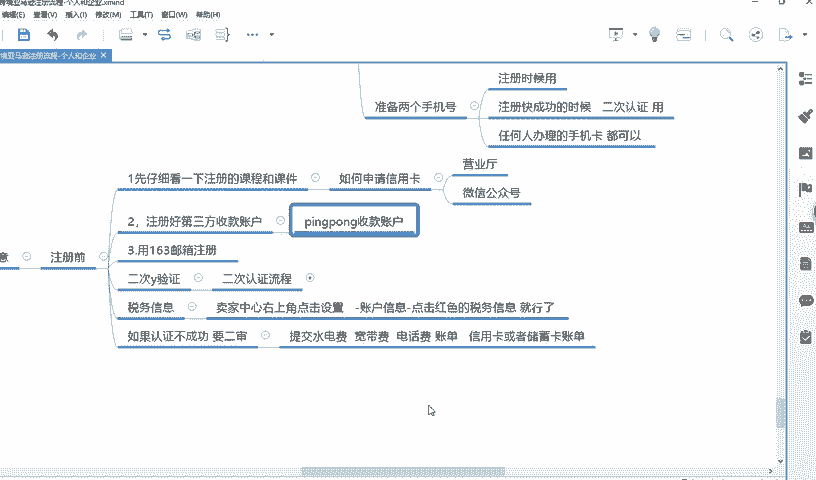

好，在这里好好，第就是你注册之前，你第一步一定要先注册拼碰收收款账号。比如说收款账号第三方收款账号。好，收款账号是什么意思？就是类似于支付宝一样，类似于中国的支付宝一样。就比如说你在亚马逊店铺里开店了。

那别人在你下单付款了，付款，那钱在存到哪里，它先存到第三方收款平台里。你就把它理解为支付宝，先存到支付宝里，那我怎么找搞到我银行卡里，你体现到自己银行卡里了嘛，对不对？那怎么体现。

绑定一下自己银行卡不就行了嘛？对不对？好，那这个很简单好啊，这我先告诉大家当你注册店铺之前，你首先先弄一个拼乒乓卡注册，能理解吗？当然我现在讲的是个人店铺啊，怎么样注册，等会企业店铺怎么注册。

我给你们也会讲啊，但是大同小异，大同小异。好，我建议大家用乒碰就可以了，不要过过了讲出连连，你用这个就行了，能理解吗？这个是最好用也最常用的。能理解吗？就像比如说老于办那个VA信用卡，老师。

我说这个卡行不行啊，那个卡行不行？我建议大家用visa，因为它最好用是吧？也最容易办好。😊，好，好，注册比如说啊注册，比如说老师注册链接在哪里，在这里也在这个表格呀，到时候这个表格基本上你们应该都有。

呃，如果你没有的话，到时候这个注册的就是注册的1个PPT方方法。好，在这个地方有第三方收款账号。如果你没有的话，客户找老师要一下，现在不要去要啊，现在先听课好。😊。

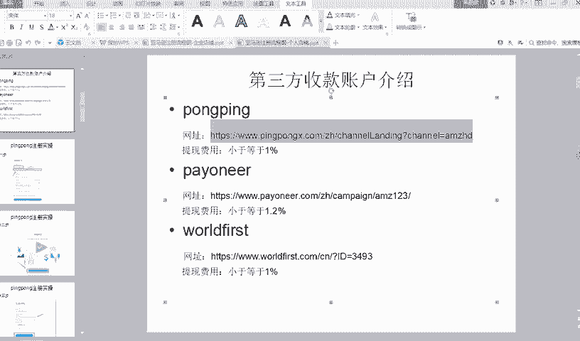

好，比如说。好，在在这个地方粘贴并访问，看到没有？好，这个登录好之后，然后点击立即注册就可以了。看到没有？点击立即注册右上角。这个地方点立即注册，他会提示让你这个注册的时候，一定要用163邮箱。好。

当然要是刚刚啊你比如说你是个人账号，你就选个人账号，然后填上你的一个好。个人账号，然后呢，你填上你的一个呃身份证上的一个信息。比如说中国内地。手机号、验证码、密码。好，这个什么客户经理呀。

这个选填这个就不用填，然后点击立即创建就可以了。好，能理解吗？好，这个就是个人的，你企业账号，你点企业的都可以。好，当然了当然了，如果你是企业店铺，你也你也可以用个人的。你比如你用法人的信息就行了。

企业的收款企坏企业店铺的收款账号，你可以点企业的，比如说对公账号。欧洲的。你看北美的北美站和日本站可以用个人的收款账号，可以用那个法人个人的收款账号。如果是欧洲的，你必须用企业对公账号。

一般是用企业对公账号，能理解吗？好，我建议大家用企业对公账号，如果是企业的，如果是欧洲站啊，如果你是北美的，你可以用法人的个人账号都可以啊这个注册，然后点击立即创建就可以了。好，这点能懂吗？

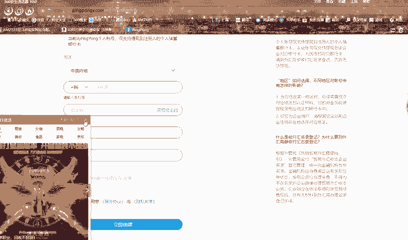

好，这点能懂的吗？好，这能懂的给他打一。好好，那下一步该怎么注册？其实很简单，就你填上东西信息就可以了。填上信息之后创建成功，然后点击这个地方有个继续完善。

这上面图上写的很清楚啊完善资料它会让你写邮箱地址。好，你就把你的自己的一个1个1个163邮箱填上去啊。当然了，我刚刚有一个点忘了讲了，就准备的过程中啊，准备的过程准备的资料，一个身份证，还有一个就是。

😊。

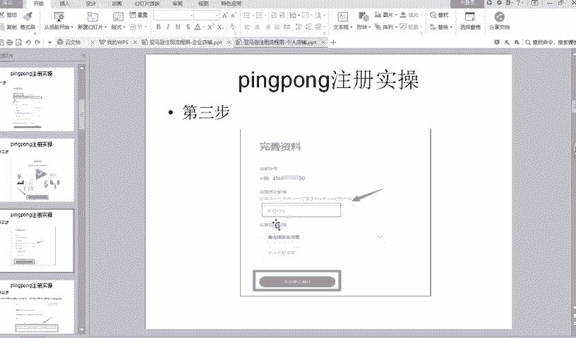

还有一个是比如说163邮箱。还有一个是163邮箱，我建议大家用1个163邮箱。好吧，有是说老师QQ邮箱行不行啊？呃，建议大家不要用QQ邮箱，用163邮箱。😊，123邮箱怎怎么从哪里来？是你注册啊。

你百度163邮箱就可以注册了。

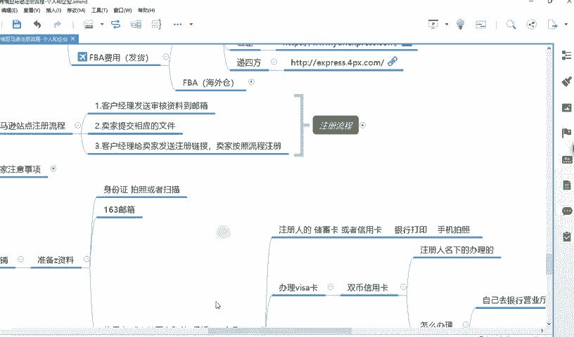

好，给大家演示一下吧。有些同学他是。

他是他必须在已经演示，否则他他不知道从哪找啊，比如说163邮箱。

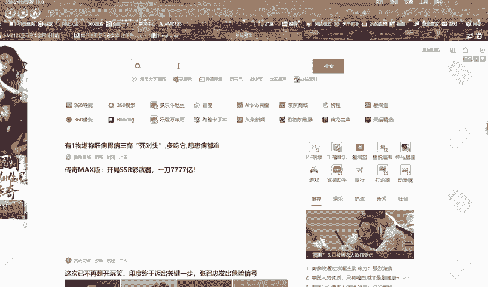

你百度163邮箱注册。都可以啊，你QQ号加163邮箱，那不还是163邮箱吗，对不对？😡。

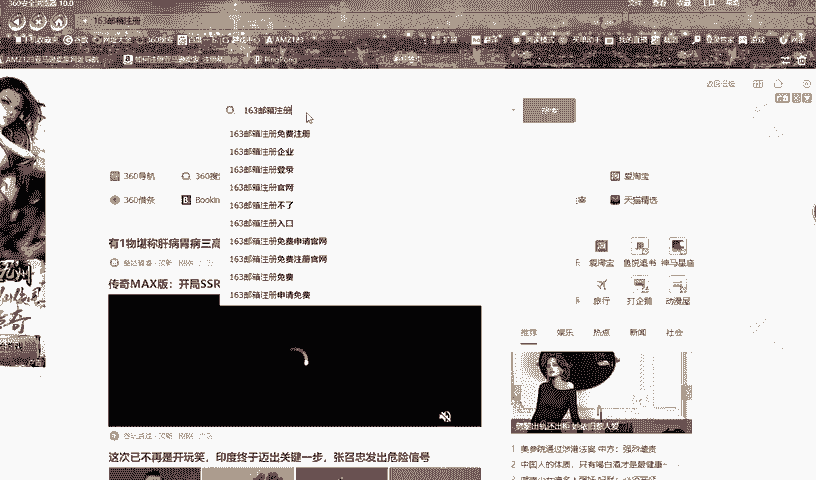

看到没有？你百度它不就都有这注册网址了吗？点击立即注册。😡，这是163邮箱，你前面的前缀啊，你可以自己编，知道吗？你比如说你可以加上自己的手机号，out什么什么什么16163点com什么什么QQ号。

然后3163com，或者你自己编个英文字母，163点com都可以，对吧？但是有一个点，还有一个同学在注册的过程中会遇到这个问题，说老师，我注册邮箱的时候啊，然后我注册好了。但是呢我后来没有记他。

我也没有记到纸上，我也没有记到电脑上。我后来我忘了。😊。

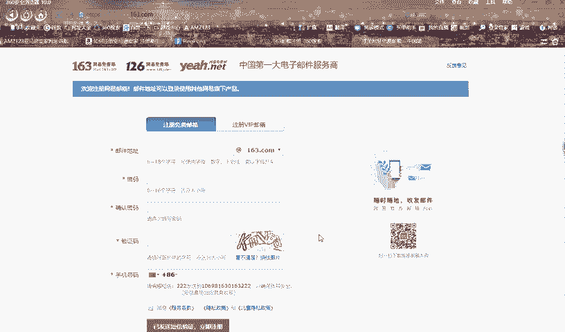

你这种尴尬的事就不要就不要就不要出现了，是吗？你注册好之后，你肯定要记下来呀，对不对？你记下来呀，你账号密码你要记下来呀。😡，对不对？你肯定要记下来啊，你不怎么会忘嘞？但是就有同学是这样的情况。

所以说给大家提个醒，不要出现这种尴尬的事情，知道吗？我老师建议你中163邮箱126了也行，好吧，但是最好用163嘛，对不对？

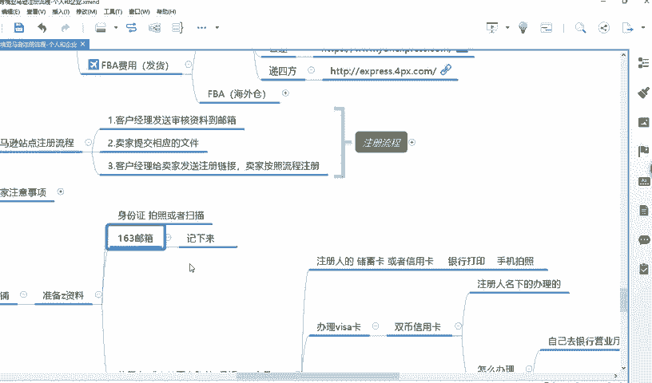

好，这个这个就就就过去了。好。😊，收款账号，然后点击这个好，你看这个地方有一个邮箱地址，什么选择安件问题，发送邮件。好好，还有这个叫到这一步了，收款账号，这个地方选择平台。好，你看这个地方选择平台。

然后如果你出在北美单你就选择北美。好，然后这个地方选择你的一个店铺名称。好，仔细看啊，这个地方要是店铺名称了，我我鼠标划的这个地方，这个是店铺名称，这个店铺名称呢？你要你也要记下来，为什么你要记下来的。

因为你这个店铺名称就和你绑定的店铺名称是同一个店铺。所以说在你出册店铺之前，你要把店铺名称给想好。比如说你个人店铺。😊。

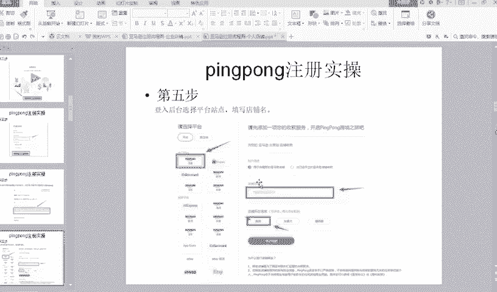

你个人店铺。😡，店铺名称。丁不平，比如说老师我不知道讲什么，你就看以这名字的拼音嘛。😡，你名字的拼音。或者说你自己编一个什么什么什么都可以。能理解吗？用你名字的拼音做店铺名字都可以了。对不对？

比如说老师我的名字比较简单，比如说叫叫李丽，我单身会有重复。比如我叫李丽，那这个时候你可以加个后缀嘛，如果老师比如说他会提示说你这个店铺名字不可用，那就加个后缀不就行了吗？加个8899，对不对？

或者加个加个789，加个123都可以，加个后缀就行了。你懂我意思吧？这个是灵活运用的，你自己写写好，但是你自己写好这个后缀也一定要记住，或者你这个店铺名字一定要记住。😡，因为等于你注册店铺的时候。

还会让你填一次店铺名字，知道吧？到时候你填的和你这个poping账号不一样，那不就尴尬了吗？懂我意思吗？美国华盛顿店是吧？😡，好，课程回放在网盘里，课后你可以找老老师去要好。好，这点都懂要给他打一啊。

这个细节一定要懂，可能对有些同学来讲就比较简单，就这个很用讲吗，是不是？但是有些同学他就是不理解啊，他就是会问说老师哎，我填上我的名字，发现后面怎么显示店铺名不可用啊。😡。

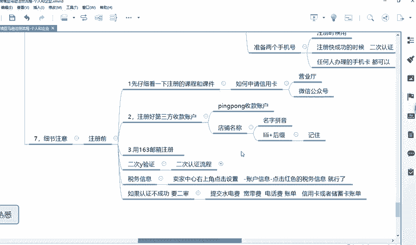

然后他就不会灵活的加一些字母或者加一些数字，然后不就可以用了吗？是不是？所以说老师要提一下，因为有些人会遇到这样的问题。😊，然后下面你选择美国就选择美国就可以了，对吧？可多选。

你也当然你也可以选择美国、加拿大、墨西哥。但是我建议你先选择美国就可以，然后点击绑定店铺。好，绑定店铺，然后绑定店铺它会显示，然后店铺名，还有一个还有一个还有一个啊好。法。好，美国看他会让你干什么嘞？

他会让你好，比如说这个北美美国，他会让你选择你的类目，你类目你可以随便勾选一个。这个不要紧，比如说你选择服饰鞋包，然后选择什么年销售额，比如说几几十0万到100万美元都可以知道吗？这个不重要。

这它只是一个认证过程，因为你店铺还没有创建嘛，它只是一个。做一个统计而已，对吗？你并不是说老师我一定会卖这个，我一定要选这个，这不一定知道吗？这个你自己勾选就可以了。😡，好。

还有一个他下下面比如说还有一个，比如说日本站，它是这样的，日本站它是这个界面，你这个你要选择日本，然后店铺名称啊，运销量啊什么什么你类目啊，都可以自己选一下都可以了。这个没啥可讲。好，然后弄好之后。

他会让你填写完善个人实名认证，它会提示让你实名认证，你懂我意思吗？好，你比如说实名认证在哪里。好，比如说你登录好，你注册好这个ping账号的，一般会进入到这个界面。这个界面应该有一个叫账户账号中心。

比如说。😊。

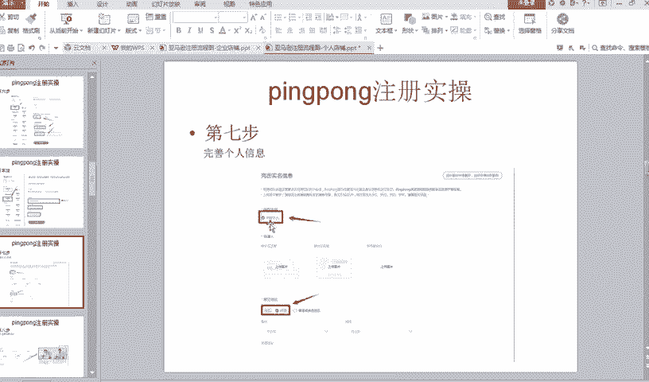

你你注册好这个你没有实名认证时，也能进入这个后台，因入后台，但是有些地方不一样。比如说它会显示你一个叫审核中的店铺或者代完生的店铺。好，这个时候有个账户中心，你一定要点击这个实名认证，能理解吗？

点击实名认证，这个时候它又跳转到让你实名认证的那个后台了。😡。

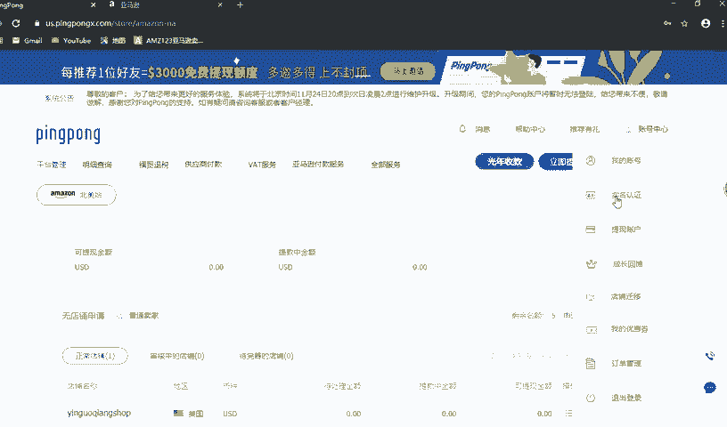

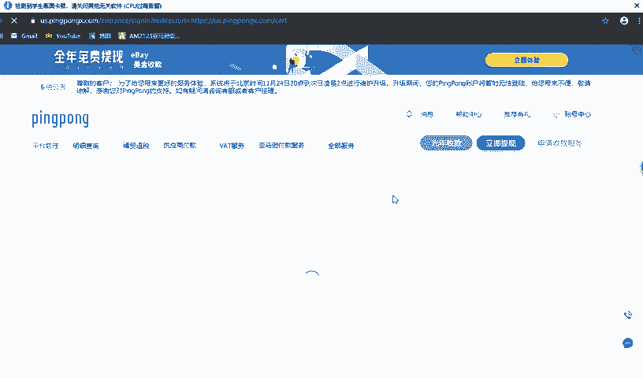

就是他会让你提示让你什么什么提交身份证啊之类的，你懂我意思吗？他会提示让你提交身份什么身份证之类的。好。

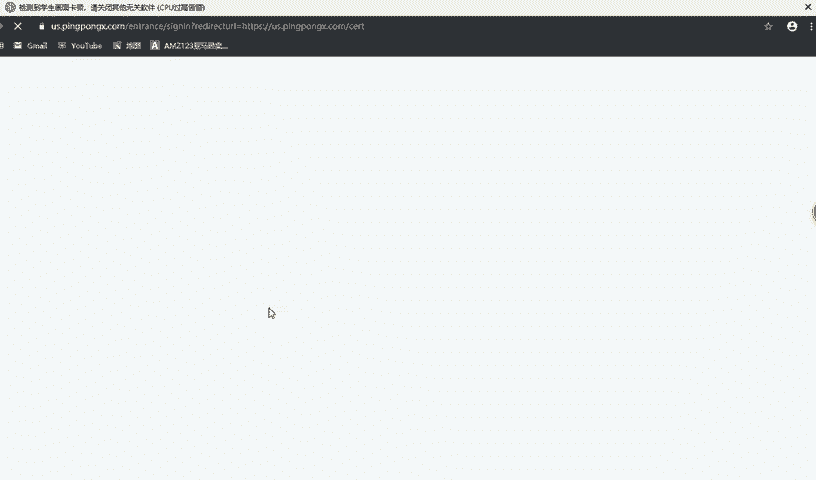

好，先不管啊。😊。

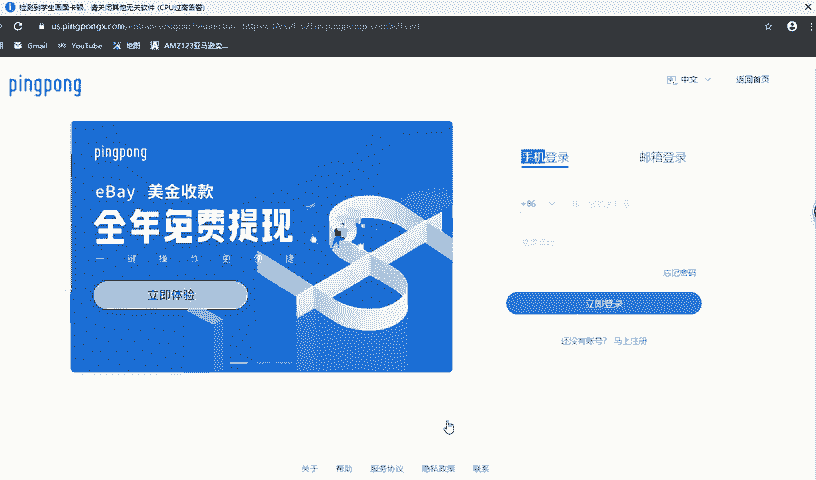

好，就是看这个东西啊。😡，就是你点身份认证的时候，他会提示让你上传身份证的正面照，还有一个背面照，还有一个手持身份证照片。好，你怎么怎么上传，它肯定是有提示的，手持身份证，这个是正确的，能理解吗？

就是你的聚焦聚光灯要把它放在手持身份证上，这样装样才能看得清楚，懂我意思吗？😡，好，能理解吗？好，这个就没什么可讲了。常住地址，你就写身份证上的地址就行了。然后点击就OK了。好，这个弄好之后。

下一步是什么呢？下一步你要点击好，就是你登登录poping账号后台之后啊。😊。

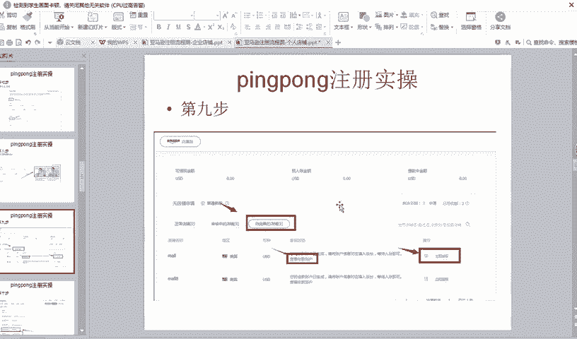

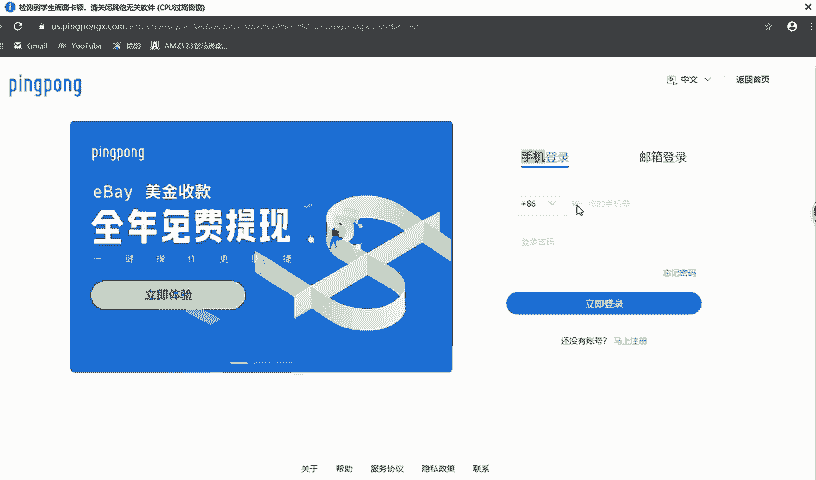

你登录popy账号后台之后。

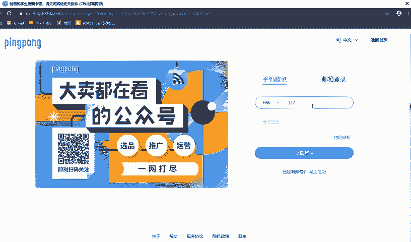

好，你登了这个后台之后啊，它会提示你什么呢？😡。

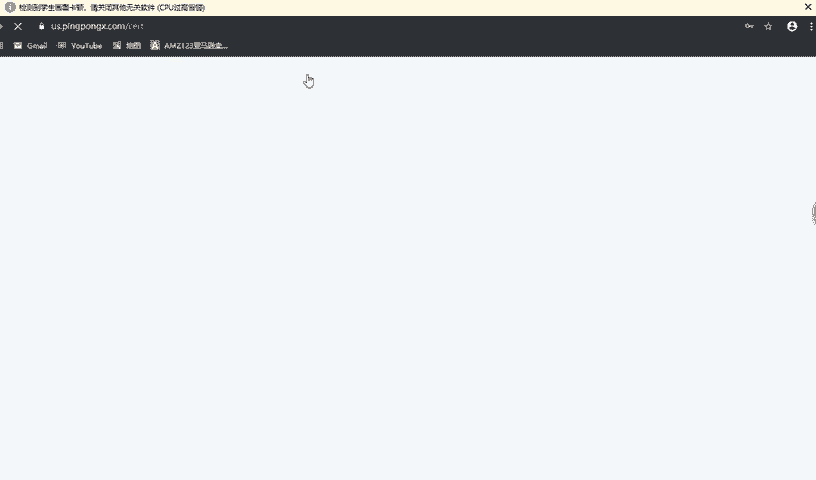

好，你登录了这个后台之后，比如说它会提示你什么呢？就是你点击这个左上角的一个叫平台管理，看到没有？😡，这地方有个平台管理。好，那你注册的时候，平台管理这个是么干什么？😡。

他这个地方会有一个叫待完善的店铺，他会写个一，就是括号不是零是一样。因为因为老师这个已经完善了嘛，好，会写个一待完善的店铺会写个一好，然后这个地方大概是会有一个叫查看详情的地方，然后你点击好，那当然了。

老师这个地方已经正常店铺了。正常店铺老师点这个地方和点击你下面一个查看详情是一样的。好，然后点这个地方就会跳出来这个界面，这个地方就是你的一个9位数收款码，能理解吗？😊。

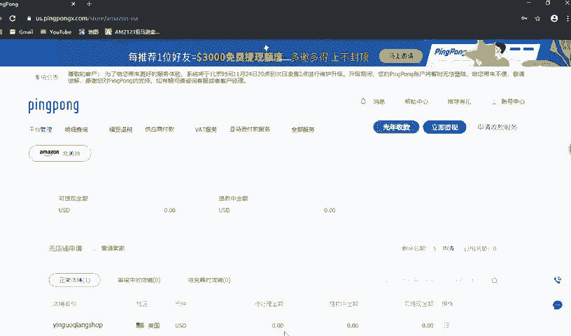

还有你的银行账户。看到没有？你主要老是我没银行，比如说老师我我没办这个卡，怎么会有银行账户，这是第三方收款平台自动给你生成的一个账户，能理解吗？😡，老师这个账户啥用，这个是你注册店M铺需要填的东西。😡。

懂我意思吗？好。好，这点能懂的给他打一。这个地方每个人肯定都不一样啊，能理解吗？比如说还有同学会问这样的问题，说老师啊，你让你让填写那个第三方收款账号的时候。😡。

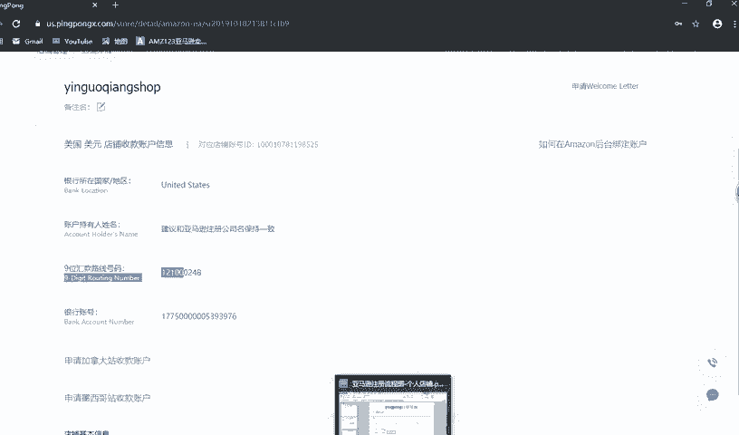

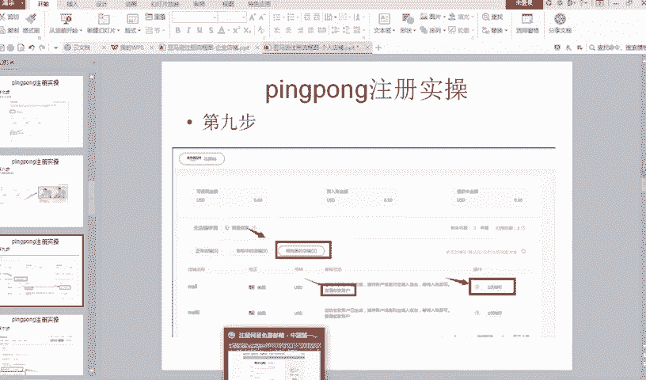

然后我我看到你那个PPT上呃，写的就是这个什么1020什么什么什么这个那我是不是也要填这个嘞？😡，嗯，肯定不是这样，因为你你要看你后台是不是这样，对不对？所以说我为什么要给你们讲这么详细，是因为。😡。

是为有些问题他可能不是一个问题，这在大多数同学啊看来就不是一个问题。但是有些问人他就不理解。😡。

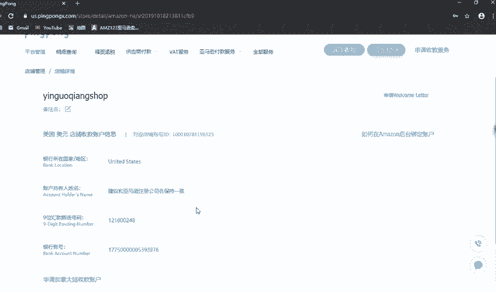

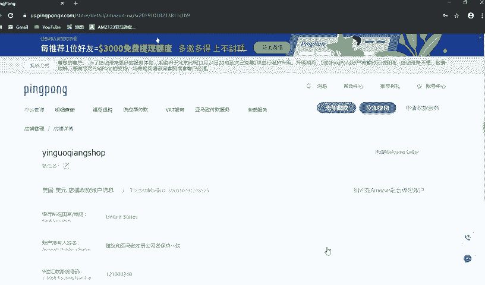

他就是不理解。他就是认为是不是一样的，对不对？那你这个不就很尴尬了。你看这个PPT就是这样吗。好，看到没有？这是老师这是举例啊，不是说让你填这个，只是让你在知道填哪个地方，能理解吗？😡，好。

注册个站点你肯定不能改了呀。好，那注册好poping，然后就放在这里就不管了。好，你注册好之后，一般他会审核。审核的话，一般情况下是一天之内，当然了也有可能是瞬间就通过了，或者过个半秒钟，不不是半秒钟。

半分钟或者几分钟，你刷新一下好，它显示你实名通过就OK了。😊。

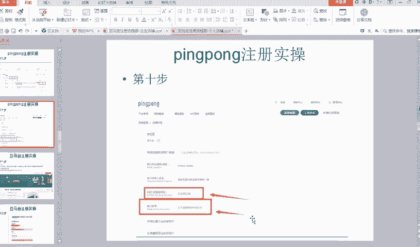

能理解吗？比如说你实名认证不是有个账号实名认证吗？你你点击下，你看它有没有通过，它会提示的呀。😡。

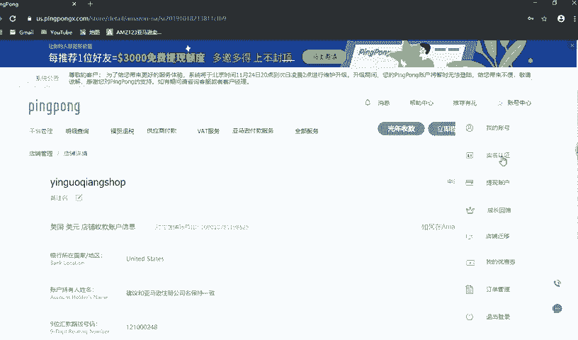

如果他在说审核中，啊那就审核中，你的等等。等到审核通过之后，你才能够干下面的事，才能够注册店铺，能理解吗？好。

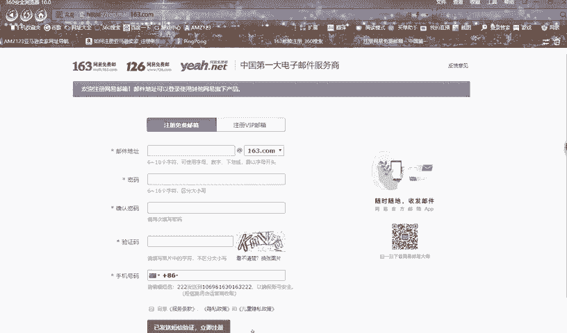

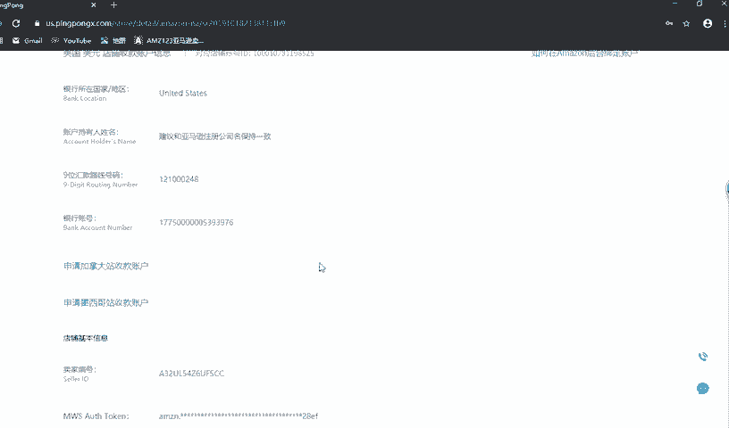

你要切记，等你第三方收款账号抛ping账号审核通过之后，你才能够注册店铺。能理讲？不是说先注册店铺，然后注册店铺之后需发现哎需要填这什么9位数码，然后慌慌张张又要又要注册，又要申请什么ping吗。

那你不就尴尬了吗？你注注册抛ping账号也要用163邮箱，知道吗？用163，就和你注册店铺那个163邮箱。😡，是一样的就行。往上一是一样的就行。好好，那这一点能懂的。

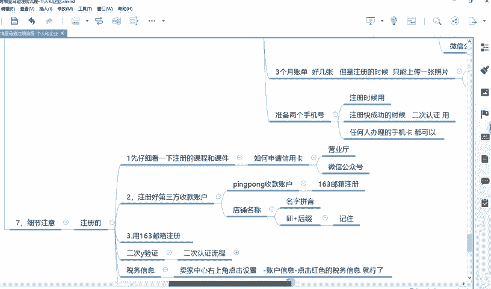