# 【2024年最新版】TikTok+亚马逊跨境电商运营全套零基础视频教程 （从入门到精通，日出百单！）学完适用全平台！ - P21：4.个人店铺注册流程① - 琉璃月下梦2 - BV1FjbFePEo7

好，下一步就教大家非常重要的点，该怎么样进行注册了。好，怎么样注册。那下面我给大家会讲的更详细。好吧。好，仔细看啊，下面看大家讲怎么样进行注册了。好，仔细看，首先注册的界面该从哪里进。好。

首先第一个你要从这个网站里进。就是我之前跟一直跟大家讲的叫AMZ123点com。😊。

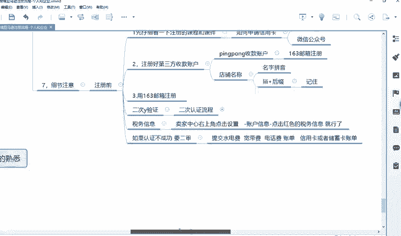

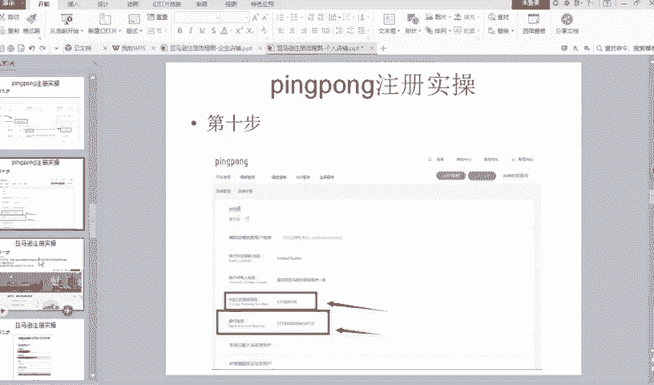

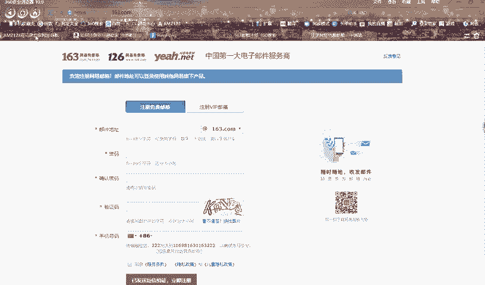

仔细看啊。然。好，仔细听啊。好。这我给你发的那个地方了，就是什么叫AMZ。😊，123点COM。好，然后登录好之后，这个是你做亚马逊非常常用的一个东西。它里面有各种呃亚马逊辅助的一些什么什么网址啊。

或者一些小软件啊，你看汇率计算单位计算啊，FBI计算啦，各种各种东西。好，如果你想注册店铺，你就点击这个地方叫全球亚马逊开店。好，点击这个地方仔细看啊。😊，点击这个地方啊，不要再讲完这节课之后。

你不要再问说老师我从哪进。好，点击了之后。😡。

然后有一个叫右边右上角有一个叫立即开店啊，如果你注册北美店，就点击北美开店，能理解吗？好，你注册欧洲站，就点击英国开店就可以了。好，点击啊，当然你注册欧洲站肯定不是从这点击啊。

你注册个人店铺才能才从这个界面进，你注册欧注册企业店铺，你千万不要从这个界面进，知道吗？我再次强调你注册企业店铺，千万不要从这点这面这个界面进，它是从企业招商经理会给你发个注册链接。

当然他进入界面是一样，但是一定要通过他给你发的链接，你点击进去才行。你自己从这个点进去，那你注册基本上不会成功的啊，但是不要给自己不要自己给自己找麻烦，知道吗？否则你尴尴尬的还是自己。😡。

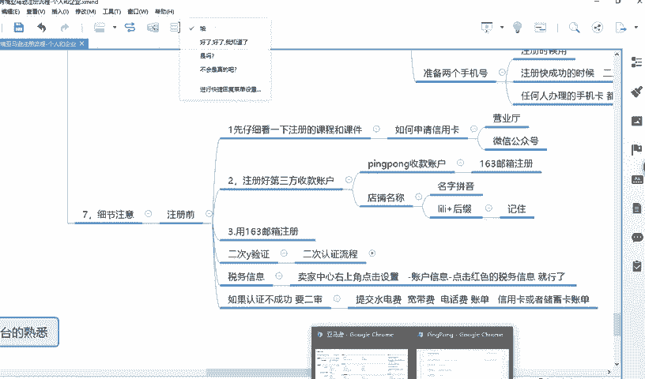

中东怎么是东南亚呢？亲爱的同学，中东是伊拉克、沙特、阿拉伯、土耳其、北非，不是不是北非，埃及，他统称中东啊，对不对？中东是欧洲人对对欧洲人的称物，以欧洲为中心，就是中东，知道吗？在他称为中国和日本。

比如说叫远东，称为那些叫中亚地区，造中东，知道吧？以他们的角度来进行冲突了。好，这个就不打了。好，点击北美开店。好，点ba本开店哈，我看稍等有点卡。😊，那个。好，你注册的时候，你用16。

你用那个你用那个什么谷歌浏览器啊，或者说三6浏览器都可以。但是有时候它会卡，知道吗？因为它是服务器是国外的，所以说它有时候它不好使。啊，这时候填你的163邮箱，知道吗？

163邮箱一定要填上去什么什么out，然后密码填上去。然后你一定要点这一步，点创建您的账户，知道吗？因为什么？因为你第一次创建啊，你要点创建您的账户。好，点击创建您的账号之后，它会提示什么？

他会让你这样填写你的姓名，填写你的一个账号和密码。😡。

好，那我这个时候就只能用这个PPT给大家讲了，因为创建账户老是不可能再登另一个账户，因为会被关联的。好，点击好第一步啊，第一步，点击创建账户之后，输入你的邮箱，输入你的密码，然后点击创建之后。

创建好账号之后，第二步他会创建账户，然后填进你的邮箱，填你的姓名，姓名写拼音就可以了。你老师现在讲的是个人店铺知道吗？企业店铺等会老师会讲大同小异，你个人店铺填你的姓名的拼音，然后邮箱地址，然后密码。

然后点下一步。好，直接听啊。😊。

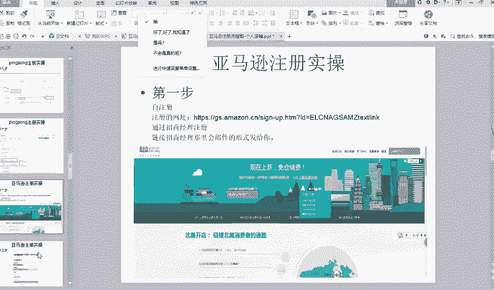

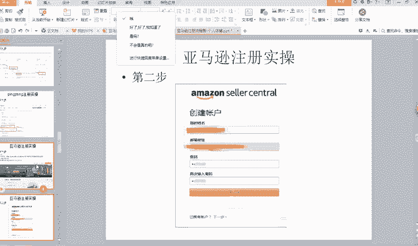

好吧。好，然后你你填好之后一定会到这一步。好，到这一步是这一点是最关用的。这一点，如果你填错了，那你就前功尽弃了。好，你你填完这一步之后，立刻点下一步，立刻就会到这一步。这一步呢。

它是默认企业端的一个注册，就是它会默认什么呢？这个界面就是企业端。比如是你选美国，它会选你美国是公司地址，一般你要选中国嘛，中公司他选择下面选择什么企业类型，选择私有企业。😡，但是你点击它是一个企。

它会下面会让你写营业执照或者营业执照的编号，那你不是变成企业注册的一个链接了吗？那不是，因为你要注册个人店铺啊，所以说这个地方有个小技巧，你要点这个问号，公司地址旁边不是有个问号吗？

点下还会出现这个界面，就是if country is not listple点击此数，好点击此数之后一定要你你一定要做这个动作哈，当然你这个地方你可以随便不用勾选。比如说老师你看还会有同学问这个问题。

说老师啊我这个界面是不是要勾选一下美国，然后再选一下实体，然后再点问号不是这样的好吧，只是老师截图的时候恰巧是这样你这个不用做任何选择，你就点击个问号，然后点击这个蓝色的，点击此处。

你点击它就会跳转到这个界面，看到没有？让你写法定什么是法定名称好，然后法定名称就你写名字拼音打个对号，点下一步你一定要跳转这个界面。😊，你才是个人注册的链接。否则就错了。😡，借点能等着，给他打6。😡。

好，先听仔细听先仔细听。我讲完之后，你大部分的问题都会给你解答清楚。😊，好，能理解吗？你你个人店铺一定要点这个问号再跳转上去，然后跳转到这个界面才对。好。

那这个时候会有人会有人他总会有人他是他不认真听课知道吗？总会有人他他是想当然的就不小心或者说他不小心啊，或者说他没听懂啊，或者他就慌慌张张就去注册，然后他点他选一个中国这个地方，然后选一个私有企业。

然后点下一步了。好，直接就跳转了这一步了。然后他就返回不去了嘛，返回不去了怎么办？那没有办法，你只能再注册一个新的163邮箱，然后把这个账号给退掉，然后重新再来一遍了，就从我刚刚说的，然后再注册一遍。

然后不影响，知道吧？再注册一遍就不影响，再重新来一遍，就这意思，能理解吧？再注册一个新的163邮箱，再来一遍了。😊。

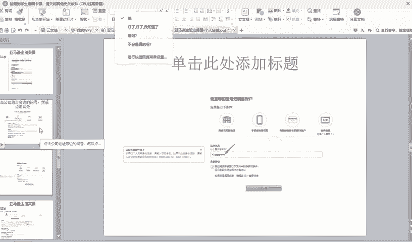

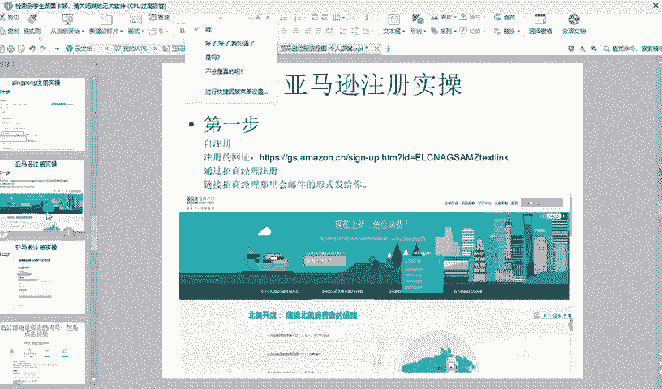

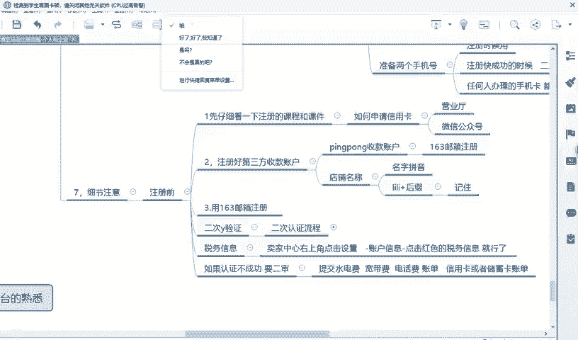

懂我意思吗？你一旦你点错了，你就是只能再做一个新的36新的163邮箱再弄一遍。那有人会呢，老师，那我的第三方收款账号还用不用再弄一遍呢？那可以不用呃，可以不用啊，因为你已经注册成功了嘛。😡。

你第三方收款账号的一个注册邮箱和你注册店铺的邮箱可以不一样，也可以一样，能理解吗？所以说你第三方收款账号不需要重新注册。😡，好，先听听完之后再去弄，好吧。😊，个人企业嘛个人就是个人，怎么是企业嘞？

个人就是个人呀。😡，好，这一步弄好之后，下一步就到这一个界面，到这个界面又很有意思了。好，这个地方就会填写你的公司地址。这个公司地址，因为老师注册是个人店铺，所以说公司地址就是你身份证上的地址。😊。

身份证地址这个上面写的非常清楚，这个地方写会写一个叫州什么什么省打一个杠。所以说这个地方你就写省的拼音啊，你能理解吗？好，我给大家举例子啊，这个地方有很多人他是。😡。

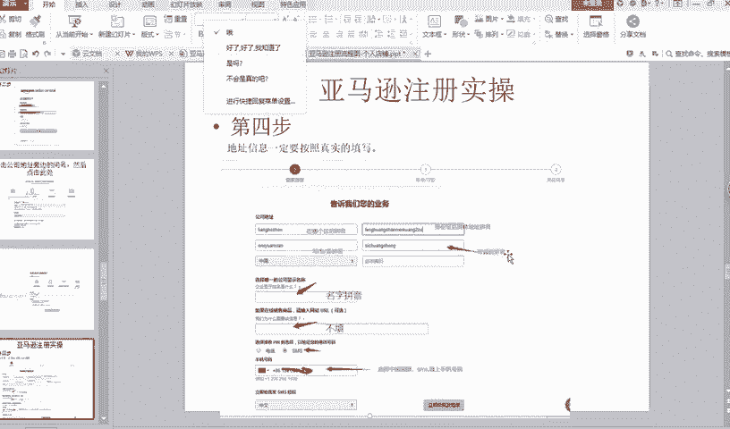

他这很。可以说说直白了，就是很笨的知道吗？你给他写的非常清楚了，这个地方要写省，这个地方要写县，这个地方要写哪个区写拼音，这个地方写身份证后面的拼音，他还是还是随便写，都是把这把所有的地址都写到第一行。

剩下都不写。😡。

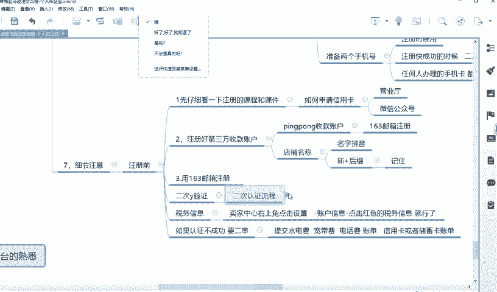

你说你说这个你说这个不是很尴尬吗？或者说。😡，或者说要么你不忍心看，要么你是。😡，好，这个先不讲了，老师给你详细的告诉你好，比如说老师随便编个地址，假如说啊老师随便编个地址。😊。

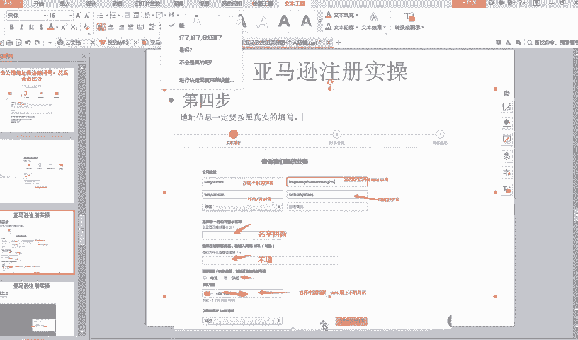

好，地址该怎么写？现在编个地址啊。😡，我们过去。好，比如说随便编个地址，假如说老师必须在山东省。啊，也不是是啊，假如说编一个什么。那什么什么江苏什么。假如你身份证上写的是江苏省。南京市。

什么什么什么什么什么什么。什么什么什么区来着，或者说什么东吴区好，我随便随便说个去啊。东吴区。还要什么什么。好律。华彩。街道啊什么。民芳小区民芳。小区。好，什么65栋。好，10。101001室。好。

假如说你身份上的地址是这样。好，那你应该怎么写嘞？好，那你很简单呀。😡。

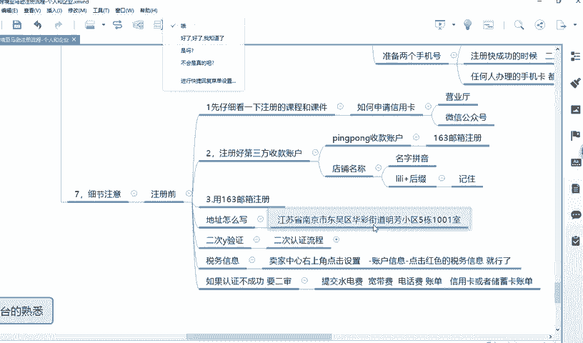

什么。哦，在哪里在这里。在这个最后面这个第第四个他标的很清楚，就需要写哪个省，你就写南江苏省知道吗？江苏省拼音这个地方他就提示下你写哪个城市了，你就写南京市写拼音就可以了。大写写小写都行，知道吗？

你比如说老师我讲那个南京，我能不能写个首字母能不能大写的都可以，你全程小写也都行，这个不影响，好吧，然后地址一，这个是地址一，这个地方是地址一啦，地址就你就写什么什么东吴区好。

写拼音东区剩下的写什么花夏街道，或者说哪个小区，然后多少多少号，东种号也用拼音，知道吧？全程拼音就可以了。

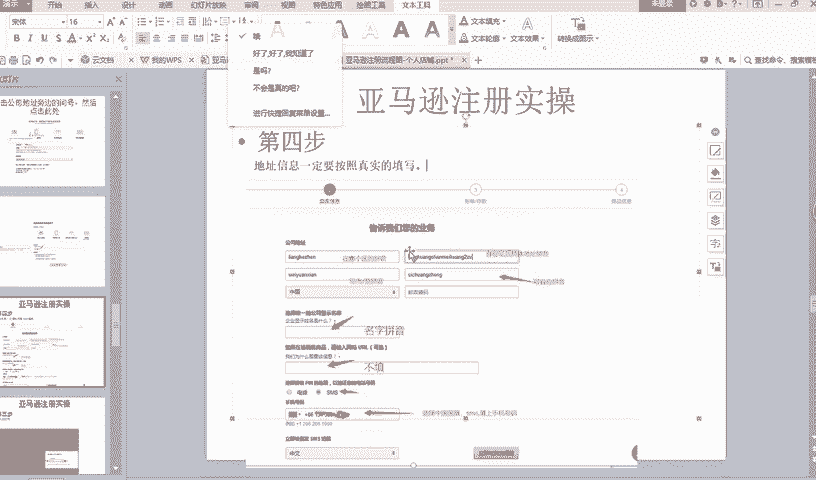

懂我意思吗？😡，这个很简单的呀，因为他提示了让你写什么呢呀？为什么还是有人不懂嘞，对不对？我就很不能理解，就是他明明让你写了，提示让你写。😡，那这个地方应该写省。这个地方应该写是。还是有人不会好。

我给大家写详细点，好吧，地址一这个。你啥都没写的时他肯定是这样提示的地址一，然后下面就个小是一个什么城市吧，我忘了，反正就是写市的。这个写什么什么省啊，或者什么什州啦，当然美国是按州来算的。

这个不就很简单了吗？对不对？😡，当办。真的吧。好，比如说什么省，假如这个什么省，你就写江苏省啊，对不对？你比如说我听老师讲，说有同学遇到这个问题，他就是写不好，明明提示让你写州和省啊，他非要写到第一行。

哎，你说难不难受？😡，你信这不是写信用卡的地址啊，亲爱的同学现在还没有到写信用卡的地址了，你能理解吗？等会儿我会给你讲。😡，不要没有到那一步呢，没有到为啥卡那一步呢，对不对？好，地址一地址一怎么写。

地址一地址一，你就写东吴区啊。😡，东吴区。好，然后剩下的写后面的后缀，比如华彩街道。您。民方哎。小区。舞栋。1001室。OK啦，懂我意思吗？😡，懂我意思吗？😡，好，这点能多要给要大一。😊，好。

我已经讲的很清楚了，好吧，到时候不要再问老师说我又不知道咋填的。好，但是这里面还会有些要细节，什么意思？就有些他地方。😊，有些人的地方他后面的后缀比较长，比如说他后面写了好多字，但是后面的地址。

他提示说你的达到上限了。那这时候很简单啊，你把这个比如说东把这一部分往前面挪一点，比如说你把什么南东吴区华彩街道写到前面，你把地址一和地址2。😡，把它给给平均一下，他不就能写下了吗？对不对？

你要灵活运用一点，懂我的意思吗？不是说老师哎这上写了上线，我不知道咋办了。😡，哎，那就说明这真的是不动脑子怎么做事。😡，然后大家。好，你写的什么赞文，你也用拼音就可以了，懂我意思吗？好。

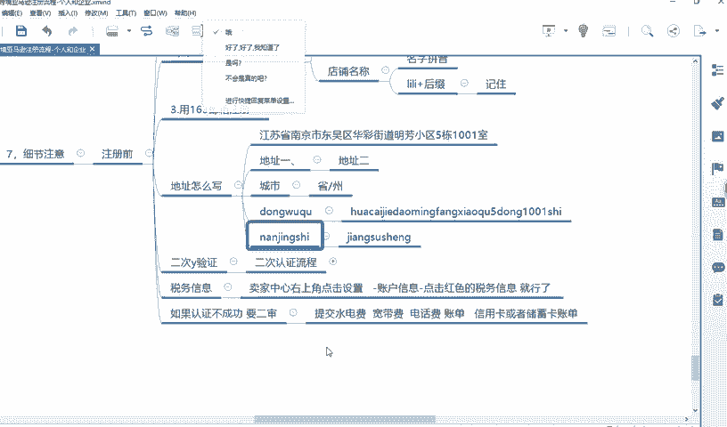

好，那剩剩下剩下再讲，我每个细节都讲到了，因为这是你们注册店铺的时候遇到的问题，就在在别人看来，其实不应该是成为一个问题。😊，好，然后下面哎。下面一个叫什么显示公司唯一名称，这个写你名字的拼音就可以了。

还有一个叫如果在线商务商品上输入URVL可选哈，他打个可选，你就不填就行了，知道吗？他明明写的就是可选，是你不要问说老师这个地方填什么。就是说明你做事情不认真啊，然后这个SM你想SM就代表短信的意思。

知道吗？有些人他这个地方注册的一个界面是英语的，比如他公司地址写的英语，但是界面格式是一样的。如果是英语，你就翻译一下，你就按照个表格对照是一样的意思，知道吗？不是说他这个公司地址变成英语。

你就不知道咋是要填啥了。😡，一翻译一下就能知道了吗？好，然后这个地方一定要选中国，知道吗？然后填上你的手机号就可以了。😡，然后点击立即发送短信，然后认证一那个把验证码填上去，填上去之后，然后点击下一步。

懂我意思吗？好，这一步答完了。

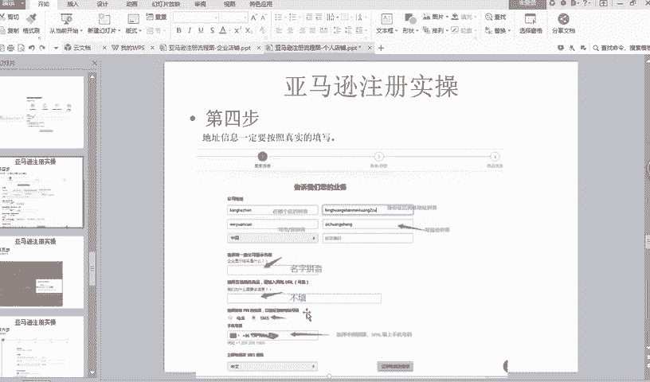

好，然后就就就是点点验证码，输入验证码。你看老师讲的很每一步啊，都就是输入你短信的验证码添上去就行了。你看我刚刚讲的不是说准备两个手机号吗？现在就用到其中一个手机号了，看到没有？你准备两个手机号。

现在就用到其中一个了。

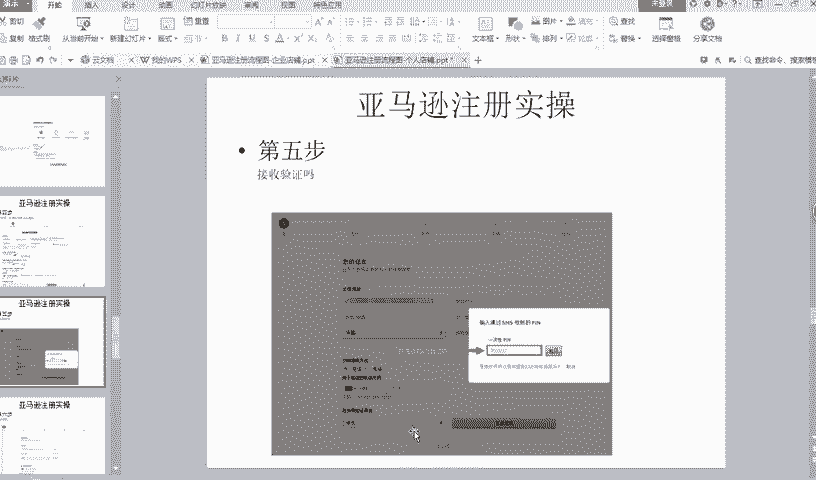

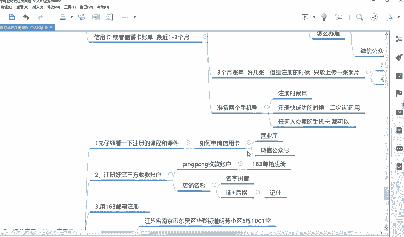

好，然后讲下一步。