# 【2024年最新版】TikTok+亚马逊跨境电商运营全套零基础视频教程 （从入门到精通，日出百单！）学完适用全平台！ - P23：5.个人店铺注册流程② - 亚马逊小钢炮 - BV1GitDebEhC

当庭人。下一步就写好，这认证成功了啊，这个就不管。啊，这这张图应该多余的。好，呃，不呃，没有没有多余，就是你点击那个输入验证码，然后然后认证成功了，认证成功，然后点下一页就可以了。下一页就会到这一步。

到这一步，它会提示让你设置您的收款方式。好，收款方式，这个就是填visa卡的卡号，visa卡的卡号，就你办理好visa卡。当然有一个前提啊，就你办理好vissa卡。你比如说你你把它收到之后。

它会一般银行会寄给你啊。😊。

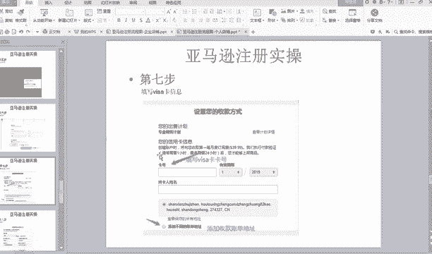

寄给你之后，你一定要激活，知道吗？你再激活你再用，你不激活等于没办。😡，说法啊，在哪里？一定要激活啊。有人问他说老师咋激活嘞？咋激活，你不应该问我，因为什么呢？因为他给你寄过来的，那里有激活的方法。

你下载个什么他们银行APP根据他的提示不就激活了吗，对不对？😊。

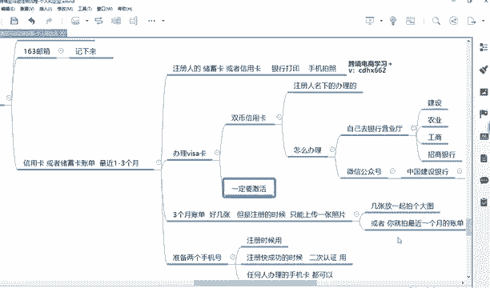

啊，这个问题就不用不需要问了吧，对不对？你这个再问我觉得那你你你你就不适合创业了，你适合上上班就行了，或者搬搬砖好。😡，好，你你在银行办就是激活嘛。如果你寄过来，你自己要激活，因为它需要人脸识别啊。

或者说填你人脸的信息啊，是本人要亲自激活的。好，填上visa卡信息，还有有效期，有效期，这个卡上也有，知道吗？有效期，比如说是23年2023年你就写个2310月就写个10，也在卡上知道吗？

也在visa卡上，我告诉你vissa卡长什么样子，什么叫vissa卡，有些人visa卡就一定要有visa标志的。😊。

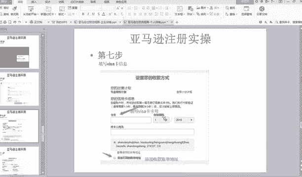

好，我看一下，有看一下有没有，我记得有那个什么图。

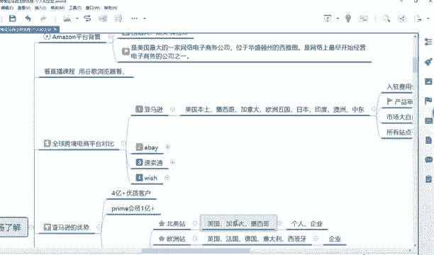

哦。啊，威萨卡我看一下啊，哎，我记得好像呃对对微萨卡就是就是长这样的，看到没有？一定要有微a标志的才叫微萨卡，你懂我意思吗？这就是vis萨卡。😊，带微萨标志的叫微萨卡。没有带这个就不是知道吗？

有些人有些工作人员他是不懂的那他说你是不是去国外消费啊，那我给你推荐这个卡吧，他我给你办上来，不是这个东西。😡，是吧有些人他不懂，有些工作人员，他认为你你不是什么，你就说你是办微sa双闭信用卡就行了。

他无论怎么忽悠你办其他卡，你就你就说我就要办这样的，或者你百度百度一张图片，你说我就带这个标志的，他就懂了，知道吗？😡，好，这个你看是到期地址就是这个地方叫什么e什么什么，这这个我也不知道啥啥意思。

反正这个就到期地址，意思就是二零二0年07月知道吗？所以说你选的时候。😡。

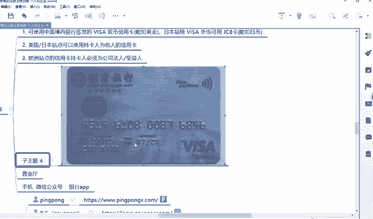

那这个地方就选择07选择7呀，这个选择2020，懂我意思吗？你这怎么勾选就不需要我教你了吧。😡，好，然后持海人姓名写你名字拼音。好，然后这个地方有一个非常重要的关键点，就是你的收款地址。

收款者一般这个地方你他会直接默认你身份证上的地址。😡，一般情况下都不是你身份证的地址，什么叫账单地址的？这个账单地址啊，他又要又要说美国文化了，就是美国它是信用卡消费嘛，信用卡消费它基基本上你有账单。

他会信用卡公司会寄寄给你寄到你家里，对不对？他门口都有一个小邮箱，收到家里啊，你账单是这个啊他给你寄过去，然后你知道你这个月消费多少，你像中国就没有这个东西，对不对？

中国就直接你支付宝上或者银行卡上就查一下账单或者拉一下，登录他们官网查一下就行。因为咱们中国这个这方面是比较发达嘛，也比较简单，但在美国他就是信用卡消费嘛，所以说他有一个账单地址，这个账单地址。

你要切记他不并不一定一定是默认的这个呃身份证上的地址。😡。

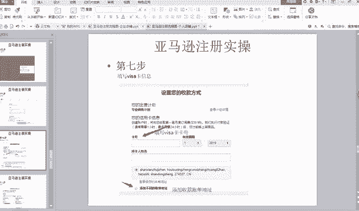

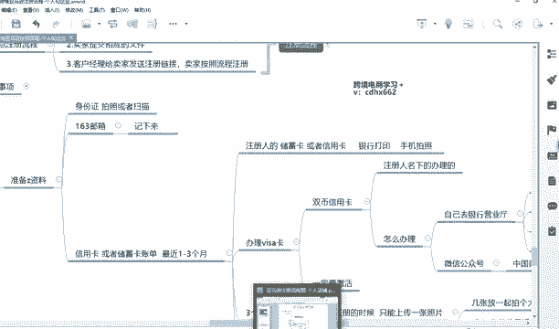

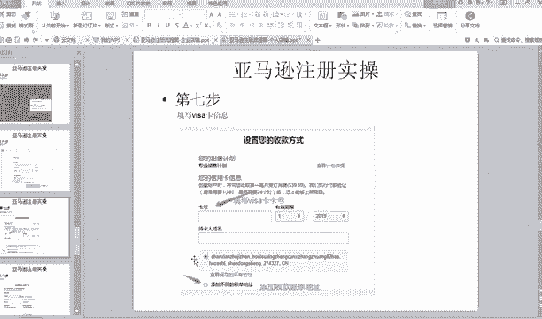

那我怎么知道我障碍地是多少呢？很简单，有两种渠道，这个障碍地是一定要填对哈。😡，今？说了。好，仔细听啊。账单地址。你这个地方填错，那就注册不成功了。几乎。账单地址怎么查？第一，打电话问银行客服。

你说你说老师，我不知道他电话号码怎么办呢？😊，好你这个问题哎，你这个问题你就很尴尬，知道吗？😊。

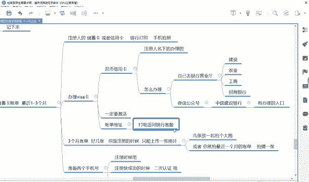

你说你在网上你要你是个互联网人员或者你的创业人员，你要你要学会用百度啊，对不对？你比如说建设银行。

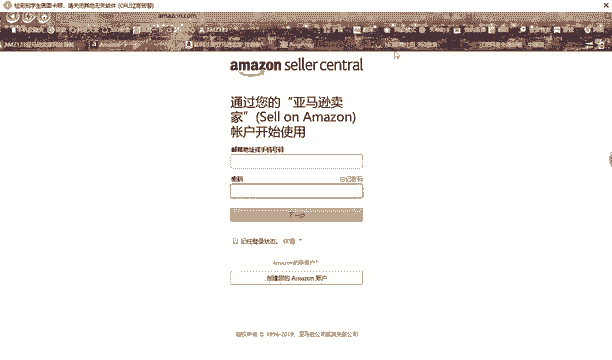

客服电话。这不就有了吗？对不对？你打一下不行，信用卡，什么服务中心打电话都懂了，你怎么能理解吗？你不要问老师说这个什么电话是多少，我也不知道。😡，好，这个都这个都可以懂了吧。😊，好，对。

企业注册我也跟你讲，好吧，但是里边填的东西几乎是大同小异，无非就把姓名填成你的一个营业执照上的名字。好，一定要打电话问一下。好，这是一种问客服的方式。还有一种呢就是你要下载一个他们银行的手机APP。😊。

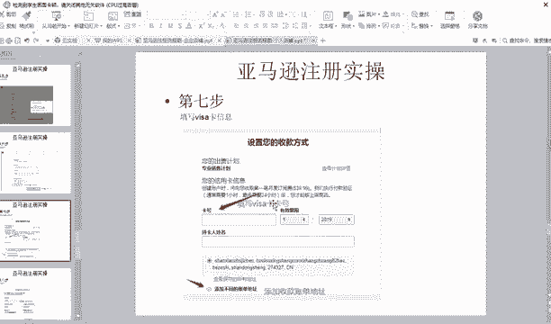

就银行银行客户端啊，比如说你下载一个建设银行的客户，你办理建设银行的建设银行在手机上啊。😊，信用卡什后APP什么，然后下载好之后，你登录登录，然后把信用信用卡绑定上去就可以查询账单了。怎么查询账单？

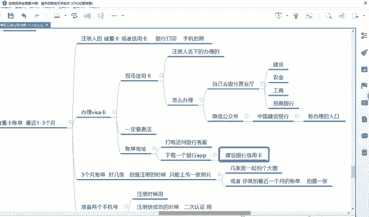

因为每个APU的入口不一样，你自己去百度一下，知道吗？你比如说。😡，建设银行。APP。怎么查询账单？对吧你百度一下他每个银行的APP查询的地方不一样。

你可能自己找估计找不出来手机建设银行怎么查询账单详情。😊，或者怎么查询账单地址吧。地址。看到没有？这里面都有能理解吧？这个就不需要我教你了啊，因为每个银行都不一样，你自己去查一下就知道了。好。

这点能懂的给他打一。😡，这个账单地址一定要是你打电话问的，或者说和你呃手机APP上查的账单地址是一样。如果发现它不是你默认的身份证上的地址，你就点击添加不同地址，添加不同地址，然后。😡，然后你就添加呗。

你就按照。😡，按照就是上面这一步，就是就之前跟上面添加这个这个地址一样，写省县什么地址一地址2，挨着写上去就行了，知道吧？那流程是一样的，你到时候不要再问说啊地添加地址咋填嘞？😡。

咋填和上面的步骤是一样的，该怎么填，会怎么填。好，然后你看添设置您的收款方式和下面和这一步。因为他俩是在同一页啊，主要老师截了两张图，下面一个就是一个叫设置你的收款方式。收款方式，这个银行地址。

一定要选择美国。好，切记一定要选择美国，你不要选择中国啊，你选择中国又要挂了又要又要填写失误了。😊，设置您的收款账户，它会到这个界面，不是到这个，他俩是同一个界面，就是您的呃微a和下面就好像是一个界面。

我记得是一个界面。好，一定要选择中国啊？一定要选择美国能理解吗？收款人的姓名你有写拼音，然后9位数收款路径在哪里？在这里啊，在抛卡里面看到没有？9位数收款账号，你右上角点击登录你的账号，点击平台管理。

然后再点击那个什么什么呃查看账号详情，然后就一个把这个复制填上去，还有一个银行账号填到下面。

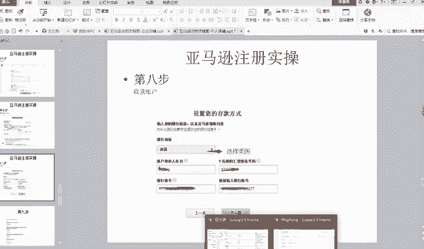

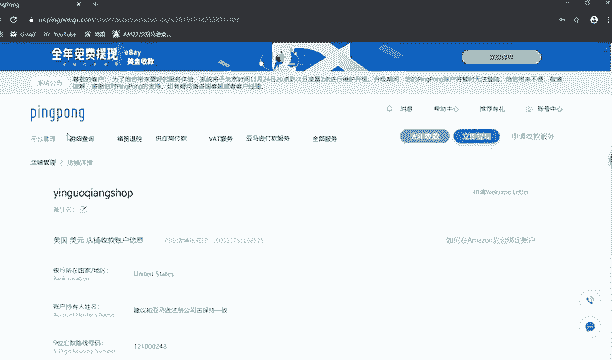

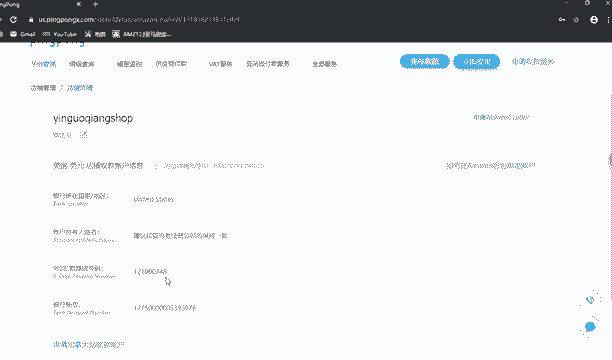

银行账号填两遍。好，这点能懂着给他答9，看准录像到在网盘里。呃，一般一般下课后11到2个小时就可以更新了，好吧，到时候老师会上传的，仔细听啊，所以说这些小细节问题一定要认真听。否则的话，你说你问。

比如说有些同学他会问，就明明是上面写的很清楚，要该怎么填怎么填，他还是有同学会问你，就是很很。😊，就是老师觉得很不理解，对吗？因为不应该成为一个问题啊，因为老师讲的很清楚啊，你应该这样听。

因为但是他就是不懂。😡，所以很让人头疼。好，然后这下一页之后就到基本上到这一步了。这一步它会有这几个选项嘛。第一个选项你就按我箭头那来，知道吗？第一个你就选是，第二个呢，你又选否，什么拥有自己的品牌。

你就选否，第三个你就选否第第四个呢你就选100乘以500，能理解吗？你看这个时候我记得还有一个同学问过一个问题。他说老师，你这张截图，你这个地方不是打个圆圈吗？人你怎么箭头打个否啊。

那我是选是还是选否的，对不对？你说你问这样的问题就很尴尬啊，你就按箭头来，知道吗？😊，懂我意思吗？好，这点能懂给他打一，好吧，你显示也可以啊，对吗？这个不重要，但是老师建议你是这样，因为它写的很清楚。

你是否拥有自己的品牌，你不是，那你就不先否呗，对不对？你试的，那你就显示嘛，那这个也没有什么大不了。😡，没。啊，这没有绝对的啊，不是说一定要是这样，然后然后就到这一步了。这一步呢就是你除了图书。

你不要勾选你选择服装啊，你随便勾选俩，随便勾三俩，点击完成注册就可以了啊，这个没啥可讲。你你勾不勾选都可以。你或者你点击跳过都可以，点击完成，然后随便勾选俩，你勾选一个勾选俩都行，点击完成注册。

然后就到这一步了。😡，这一步他会让你选择是个人卖家还是企业，你且不我是个人卖家，没有营业执照。好，杨雪先打一个点一下。好，点一下之后，然后就选择个体营业执照好，这呢能懂的给他打球。能理解吗？好。好。

下一页下一页之后，然后就到这一步了，到这一步，然后你填上你的身份证，后面有一个身份证号，能理解吗？这个就要填身份证号的。然后有效期有效期它上面写的是月日年，能理解吗？你月日年，你要按照它格式来。

比如说你身份证上写的是2019年。😊。

仔细听啊，你这点不要又搞错了，又不会填了。😡，为什么要是这样填？你学过英语的人都知道啊，因为美国人就是这样的，他把年放到后面或者日月年或者月日年。😡，比如说在中国，比如说中国啊。

你的一个身份证到期是2019年。啊，比如说你到期啊，不是2019年，比如说2027年。什么2月。09日。好，那这个时候你你你这个地方填啥嘞？😡，你你这个地方听啥嘞？😡。

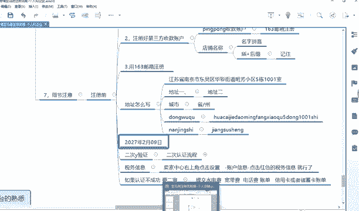

好，你这个地方填啥嘞？😡，世界末日早就过了。好，这个地方填啥嘞？月日年，那你就这样填。😊。

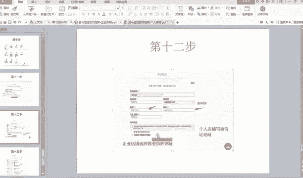

这个地方填什么填。月就比如说2。港。9。杠2027。能理解吗？

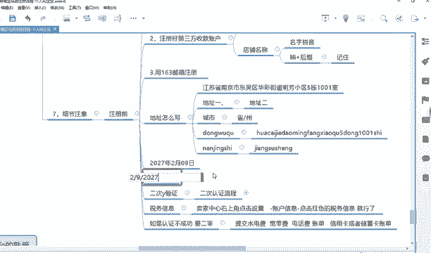

写你就按照他格式来，他写的很清楚啊，对不对？他明明写的很清楚，月日年，他还是有人，他说不懂。😡，你一定要仔细看它的提示啊，它又提示的呀，月有写月日就写日年就写年，然后选中国。然后姓你看这个地方写盛。

它的famous name就是什么什么首首字母姓。比如说你叫什么王小明，那这个什么姓，你就写王 en王名字就写X小m en名，能理解吗？然后出生年日月日年，然后地址就是你身份证上的地址，能理解吗？😡。

这个地方没什么可讲的。😡，能理解吗？😡，能理解吗？好，这点能懂的，给他打几给他打给他打6。😊，好，个体工商和公司有区别吗？有区别啊，你注册企业的话，一定要是公司营业执照，不是个体营业执照。好。

下一步就到这个地方了，就让你提交一些身份证的一个照片。正面照和反面照它会提示嘛，然后你拍好照片上传就行了。还有填一个银行卡对账单，看到没有？如果你上传的银行卡这账单，你就选择银行卡，然后上传一下图片。

就你拍照把它放到桌面上。如果你打印的是信用卡，然后你这个点一下这个地方，选择信用卡，然后上传提交就OK了。然后下面就。注册完成了，看到没有？两个工作日内经历。另外工作日之内，然后完成注册。

它会在邮箱里提示你的，懂我意思吗？好，这些流程能听懂的给他家打9。

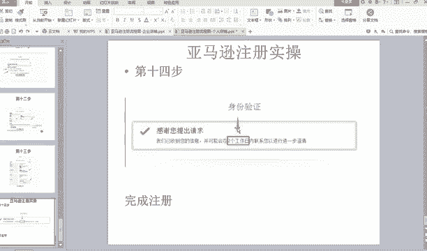

很多课没上怎么办？之前的课有讲到的呀。

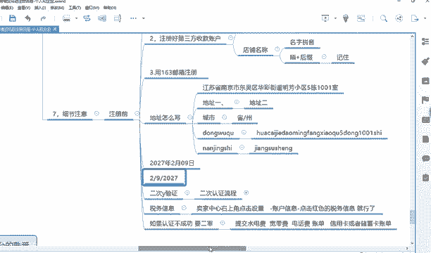