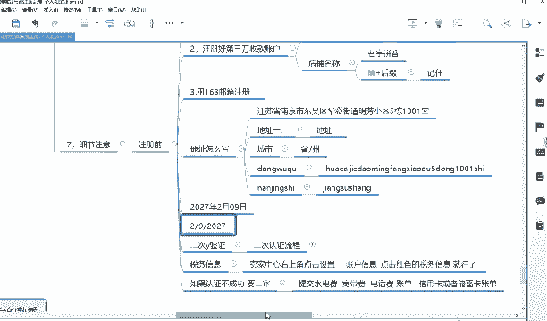
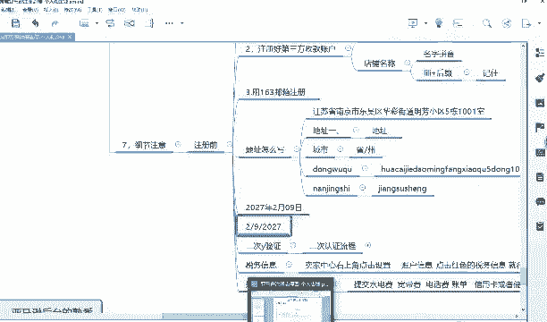
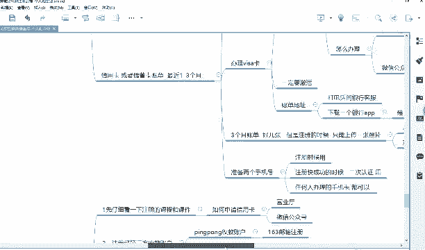
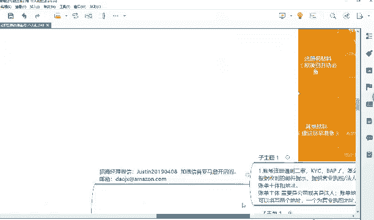
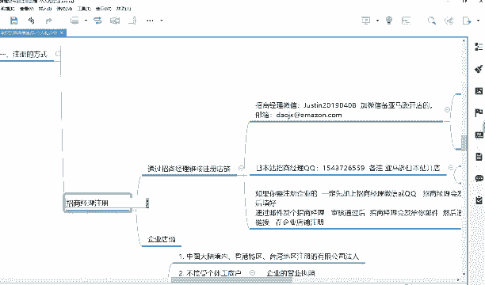
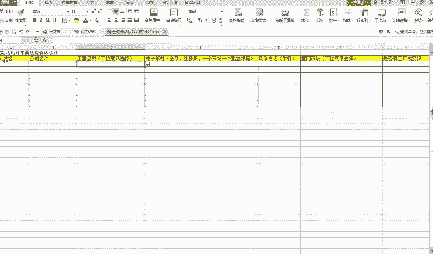
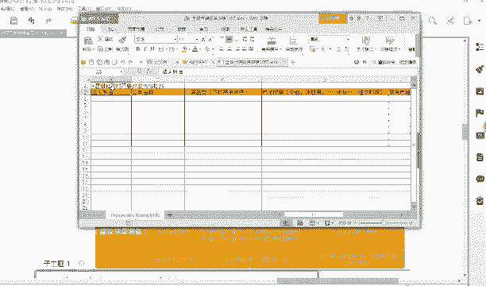
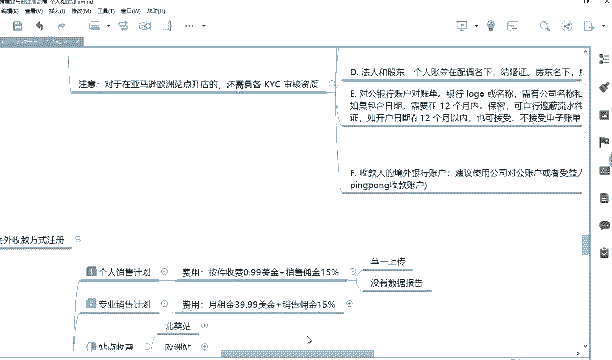

# 【2024年最新版】TikTok+亚马逊跨境电商运营全套零基础视频教程 （从入门到精通，日出百单！）学完适用全平台！ - P23：6.企业店铺注册流程 - 琉璃月下梦2 - BV1FjbFePEo7

好好，那这是个人店铺，那企业店铺怎么办呢？企业店铺在这个地方好，企业店铺注册的流程看企业店铺是这样。

企业店铺你一定要是。哎，在哪，我重新写吧。

鞋垫部在这个地方。对他。

好。企业店铺是什么呢？企业店铺在这个地方，企业店铺你一定要是通过招商经理注册。

这有没告。企业。企业店铺。哎，啊老是企业店铺招商。好，就是你企业店铺啊。😡，企业店铺就是一定要通过招商经理的注册。好，那招商经理的联系方式，北美的和欧洲的。你一定要加这个人的微信。加这个人的微信啊。

这不有微信号吗？你备注说是我是亚马逊开店的就可以了，他就会通过了。😡，我给你发一下啊，到时候这课件里面你找老师要一下，也都有，好吧。😡，在一。好。你操作的时候过程中遇到不懂的，也要问老师，知道吗？

你弄到哪个地方模棱两可，一定要问老师。😡，好，你加他微信之后，等他通过，他通过之后，然后呢，他基本上会发你这几个信息。第一个就是你账账号注册呃，遇到二审怎么办，还发你这个图片什么之类。

这是企业注册的时候遇到一些信息嘛，你看一下就知道了，他写的很清楚，你准备什么材料，信用卡、营业执照、商标什么之类的，还有什么说明写的很清楚，你按照他规定来弄就行了。😊，好，还有一个他会发你这个表格。

就你填写好，我给你大家放小一点。

好，这个地方会填写法人的身份证，你看它让你粘贴时不要改变任何格式，就你法人身份证，你写一下什么公司名称，就是你营业执照的名称，品类下拉框，看到没？这个下拉框你自己勾选。😊。

你比如说有些有人会问他说老师那个英语的，我不认识啊，你不认识你就翻译一下就行了，对不对？PC什么camera，camera就代表相机sport就代表运动嘛，对不对？你翻译一下不就知道吗？

假如说你卖这个东西，你只要你选一下不就行了。toy应该是玩具的意思吧，然后选一下，然后邮箱地址。😡，注册的邮箱地址填上手机号码。对不对？意向市场，你比如说你写北美选一个就行了。比如说你选北美。

北美不是美国吗？UC不是北美吗？😡，是否是种工厂，你是就闪示不是就不是。如果你不是你就选贸易商，能理解吧？如果你不是工厂，也不是品牌选贸易商公司地址，公司所在城市看就这么简单，填好保存保存一下。

然后然后通过这个邮箱，他会发你一个邮箱，这个邮箱看到没有？什么叫doazon点com，然后呃然后你发给他，你通过你的一个注册注册的邮箱，就163邮箱发给这个人发给这个人等待他给你呃呃，那个转发回来。

他如果审核通过之后，他会你转发一个注册的链接，注册链接，然后你通过邮箱一点击他就跳转到这个界面了。就跳转了给给你给你刚刚这个界面是一样的。

就给跟你刚刚刚刚是哪个界面？比如说刚刚是这个界面啊。😡，不对，是这个界面。对，就刚开始这个界面是一样的，知道吗？但是你一定要通过他给你发的链接，再点击这个界面才行。当然他这个界面有可能英文版的。

比如说他这个什么通过什么英文版，但是东西都是一个意思，你不懂就翻译一下，知道吗？该填什么就让你填什么，都是一样的。好，填好之后，那下面的步骤流程不都一样了吗？😡，啊，企业店铺出册链接。不都一样了吗？

剩下的所有的东西都一样了。就是你第一，你当然你前提要先把抛ping给注册好啊，抛ping给注册好啊，这个这个是前提。😡，好。其他的就是到这一步了。好，到这一步了到这一步了，看到没有？

这一步就你你千万不要用这个了，我只是给大家演示这个时候你就选择中国这个地方公司地址选择中国，然后选择比如说私有企业，然后下面下面说的这个地方法法定名称你就写你营业执照上的拼音就可以了。

然后剩下的剩下就没有啥事及，公司的营业执照的地址，然后法人呃公司的名称就是营业执照上的名称就可以了。营业执照名称的拼音，然后手机号。剩下的就都没有啥了，剩下的都是该填什么就填什么。

只不过企业的企业的唯一两个区别点就是第一，一定要通过招商经理的一个邮箱进行进行，然后链接来进行注册。第二就是把一些什么个人注册的那个呃方法的那个什么姓名啊，改成营改成营业执上的那个名字。

然后就那呃你的一个营业执上的名字。😊，法人的一个什么什么信息啊，你就改变人法人的信息，公司营业执照的地址啊就变成就写成无营业执照上的地址，无非就这些区别。然后其他的东西都是一样，你该提交什么就提交什么。

能理解吗？好。它基本上流程都是一样的，是吧？他跟它会提示让你提交什么，你你只要是稍微用心一点，你很容易的，知道吗？因为他写的很清楚，比如说还有一个文会有问题，就像那一个我刚刚讲的有好像是哪一步来着？😡。

他会让你填。中文版的姓名还是英语版的姓名？我记得有一个地方是让你填中文版的姓名还是英文版的姓名，它会让你提示的。比如说呃企业企业的，它这个地方你看list name，它写拼音。它就代表你一定要写拼音。

对吧？它里边框里边框里面有个浅色的一个，他就让你填写拼音嘛。如果他这个浅色的地方体现让你写汉字，比如中文或者说举例什么礼，那你就写汉字，能理解吗？它提示让你写什么，你就写什么，很简单的，知道吧？

很简单的，只要你能够用心把这节课再听听，知道吧？不要不要认为说老师我把这些课放一遍，我就要听了，那不叫听知道吧？那你只说自己骗自己。😡，你要用心听你这个注册流程是很容易的啊否则你到时候一填错了。

那审核不通过嗯。那。