# 【2024年最新版】TikTok+亚马逊跨境电商运营全套零基础视频教程 （从入门到精通，日出百单！）学完适用全平台！ - P24：7.二次认证流程 - 亚马逊小钢炮 - BV1GitDebEhC

好，那这个时候还有一个重要的一个点。仔细听啊。好，那这个时候还有一个遇到问题。比如说老师我注册的过程中好，比如说还需要一个二次认证。就是你比如说老师比如说哎我到这一步了，我到哪一步了。

对我到了最后一步了，过两天了，邮箱说我哎，我。我注册成功了。好，那这个时候你登录一下你的卖家中心后台，怎么登录，还在这个地方。😡。

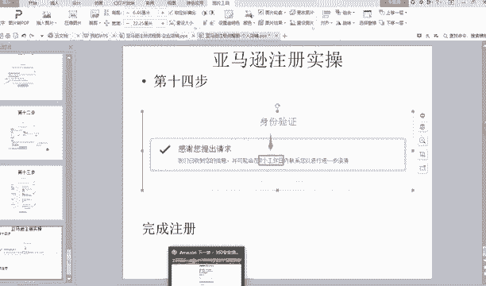

还在这个地方登录，你在哪个地方注册的，在哪个地方登录啊，这个地方不有个登录的地方吗？登录看到没有？😡，最右边是立即开店，这个地方不就登录吗？北美卖家平台把你的账号密码给给那个输入进去。

就能够进入你的一个店铺后台了。好，能理解吗？好，登入你的店铺后台之后，它会导致这个界面，看到没有？这是你的店铺后台，有目录啊，什么什么什么都是都是正常的。好，那还有一个重要点，当你进入这个店铺后台之后。

你要一定要点击这个设置。😊。

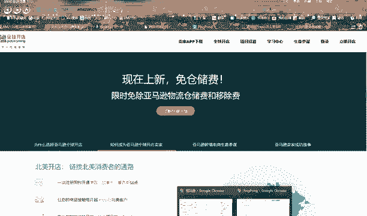

啊，不是不是。

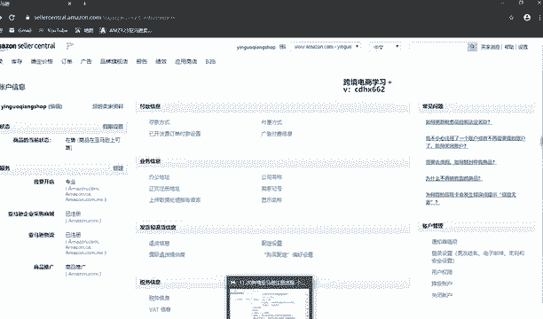

好，有一个叫二次认证啊，二次认证。好，二次认证会到这个界面。什么叫二次认证？就是它会让你一个安全认证，就是它会提示你让启动哈你登录卖家中心后台，它会让你有一个提示会有一个叫启动两步验证。

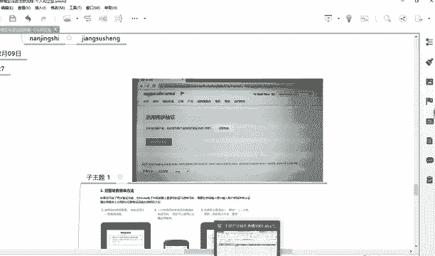

当然老师这个正常的店铺啊，你还没有你你还没有认证完全，还有一个要启动两部两部验证。😡。

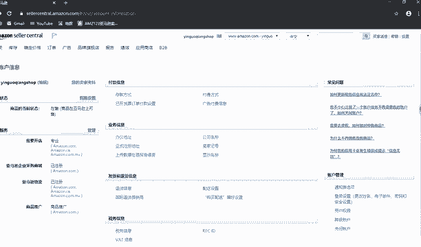

那这个时候就会出现这个界面，看到没有？启动两步验证，你点一下，点一下之会到这个界面，然后你把这个对勾给勾选一下，然后点好启动两步验证。好，然后它会有这个界面好，有这个界面。好，有这个啊，不对，反了。

应该是先有这个界面。好，有个电话号码看到没有？其他会让你填电话号码，电话号码，然后把电话号码填上去，就一定要选择短信，然后点击继续把电话号码把那个手机号码。你看这个时候就用到另一个手机号码了。

我刚刚讲的，不是说你要准备两个手机号码。你看这个时候就准备的就用到另一个手机号码了，懂我意思吗？😊，好，然后点击短信继续就可以了。然后这个时候就就就跑这一步了。当然这两个图到时候。好，老师刚刚发反了。

但是你们知道啥意思就行了。好，就到这一步了。认证器看到没有？认证器下面就到这一步了，认证器上面写的非常清楚。第一步，打开您的认证器程序，需要认证器应用的程序，有个倒三角，你点击它会推荐你。😊。

下载3个啊，然后第一个下载好之后，在手机上下载啊，不是电脑上。😊，然后扫登录你的账号，然后扫描二维码，然后扫完二码之后，然后输入一个密码就可以了。你看没有？😡，当当你到这一步的之后啊。

它会提示你的需要认证器的应用器。就是意思就是你手机上要下载一个软件，这个软件就就是说会提供密码。那我应该下载什么软件呢？你点击这个倒三角，它会提示推荐你下载三个，看到没有？就会变这个界面。😡。

前往手机应用商店，你看他写的非常清楚。前往手机应用商店。手机应用商店，你们知道吧？😡，这个就不需要老师讲了吧。😡，你知道吗？真的有学生会问说老师在哪里下载啊，手机上哪里下载？😡，就是你下载微信。

下载QQ那个地方呀，这样，这个就不需要老师讲了。你说老师手机上应用在哪里下。好，然后搜索认证器应用程序啊，下载了应用认证器应用程序是这几个，你要搜索这几个知道吗？不是搜索认证器应用程序这几个字。

是搜索谷歌身份认证器。😊，或者是什么IWS什么什么或者说me，这个是微软的一个认证器。你一般你用谷歌的就可以了。谷歌身份认证器，然后点击下载下载好之后。下载好之后就然后上上面写的很清楚啊。

然后登录你的亚马逊账号，然后扫描一下这二维码，然后就可以绑定了。绑定之后它会出现一个密码，然后填上去之后。😊，就手机上会那个认证器会出现一个密码添上去，然后提交认证就OK了。懂了吗？

你这个他因为他你就根据他提示来就行，他让你干嘛你就干嘛就行，知道吗？因为他提示的很清楚。😡，但是还是有人会问。哎，老师哪里下呀，对不对？老师下哪一个东西啊，我怎么搜不到啊？😊。

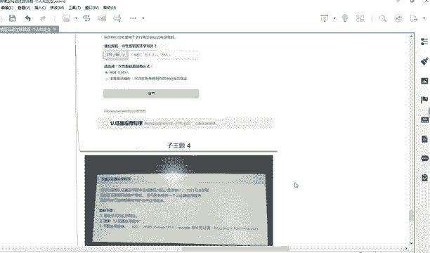

这次老师讲的很清楚了好，这弄好之后，这一步就到这一步了，就基本上你都会登录卖家中心后台了嘛。但是它会出现一个红色的框，说什么你要提交账账户信息啊。

就在这个地方会有一个说说你要提交什么账户信息啊什么之类的。好，然后这个时候你点击设置，或者你点击旁边了解详情，或者你点击的这个右上角的设置，点击账户信息。

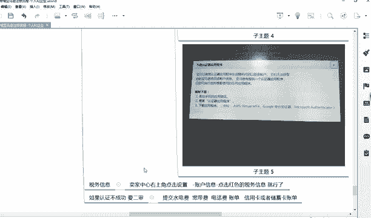

就跳转到这个界面了，就跳转到这个界面了。跳转这个界面有个账户信息，税务信息，看到没有？它是红色的。然后你点一下这个红色的这个地方。😊，点击红色这个地方啊，当然老师要认证好了，还是这个这个界面。

你没有认证好之后，它是个红色的。😡。

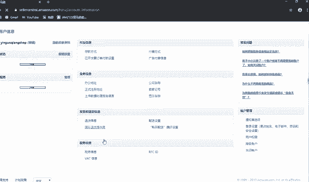

红色的你点击一下，然后签上自己的名字就可以了。签上自己的名字就是用拼音填写就可以了。一般是这样的，我给大家看一眼。😊，好像是这样的界面，对他会让你选择，比如你的个人。还是什么，还是他会让你勾选。

请问你公司还是个人，你说选个人就可以了。😡，美国是不是是不是美国人，你选否吗？对不对？企业名字你写拼音就可以了。当然你这如果你企业的话，你就写你企业的名字，然后选中国。

然后地址的话就是你的身份证上的地址。呃，如果你企业你有写你和呃，营业执照的地址吗，这这流程都是一样的，剩下的就是你签一下名。还邮编啊，什么前一栏啊之类的，写拼音就行了。好，然后解提交表格。

然拼音提交表格，然后什么退出调查，然后结束了。啊，能理解吗？你是要写拼音。对，写拼音，他只要不提醒写汉字。比如说他是一个框里面，你写的示例汉字或者中文，你就写很中文。如果他没有提示，你就写拼音。

这点能懂的给大家打6，好吧。😡。

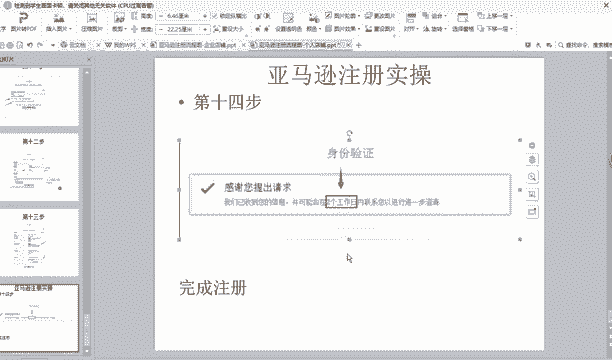

仔接听好，那这个时候还会遇到一些问题。说老师啊，我会遇到二审，比如说有些同学他更新的店铺里会遇到二审，他会在这个地方卖家中心后台，他会提交你说你的账号已冻结，然后点击查看申诉，有个申诉的地方。

点击查看申诉，然后他会让你提交什么呢？他会提示让你提交什么，你就提交什么，他提示让你提交水电费宽带费账单，什么水电费账单。😊。

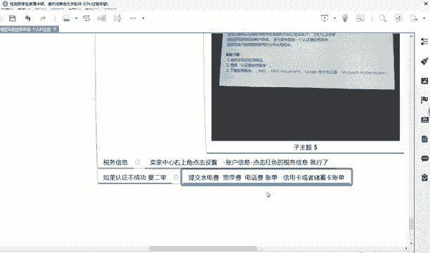

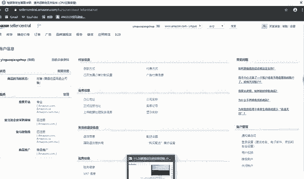

什么什么信用卡或者储蓄卡账单，你就提交这些东西，知道吗？你不用讨价还价，说老师我提交我不提交行不行？😡，他让你提交什么，你就提交什么。当然了，这些东西你不是说全部提交，你提交越多，通过的概率越大。

懂我意思吗？水电费账单一定是你注册人的信息，注册人的信息。😡，比如水电费账单，那上面的名字一定要是你注册人的信息。宽带费账单一定要就是网费啊，宽带就是网费，一定注册人的那个账单，电话费账单。

去那个水电费账单，去水电局打印宽带费账单去电话费账单去什么电电话公司。我么移通移动连心啊，移动什么。呃，什么什么什么什么联通公司去打印，对不对？信用卡你就去银行去打印就行了。注册人的信息懂我意思吗？

那这时候还会遇到一个问题，说老师啊，我注册人是我自己，但是交电费是我老公，对不对？是别人。😊，是别人怎么办？是别人有一种办法。视频还怎么办？就是你去小区啊。搞一个做一个呃要一张纸，要一张租房合同的纸。

就是正规的租房合同的纸啊，不是说一个白纸，然后手写的那租房合同，那可不是什么，就是打印出来带条条框框啊，什么甲方乙方啊，就那种模板上到处都有，百度上到处都有，基本上基本上小区物业它基本上也都有是吗？

小区物业基本上都有。😡，我说没有你就去打印一个嘛，去什么打印店，他们也有那种模板，估计啊去做一个租房合同。租个租赁合呢，你就是租客，知道吗？你就是租客，你就是租客的角色，就是你填的就是租客。

我不知道租客，租客应该是乙方嘛。对我我我不知道租客这应该是甲方还是乙方，然后做一个租房合同不就好了吗？然后连连同。😡，水电费账单。一起拍照。就行了。懂我意思吗？为什么要这样干？

这样干的目的就是证明这个水电费消费呀。😡，是你是你产生的消费。😡，知道吗？你没有这个租房合同，那是别人名下交费的，你怎么能上传这个嘞？那你搞一个租房合同啊，他就证明这个东西是你租的，所以说是房东交的。

😡，水电费懂我意思吧？是这样，你只能这样干。这也能懂了给他打意思。对，没有二审就不用吗？😡，没有二审就不用，知道吗？提示让你干啥，你就干啥，对吗？你不要给老师讲说，哎，老师我怕麻烦，怎么又要提交这个。

你既然干这一行，他需要让你干啥，你提交啥，你就提交啥，对吧？你不用讲道理，你也不用说嫌麻烦，你做事情哪有什么。😡，哪有什么麻烦不麻烦的，只要只是你愿意不愿意干而已，知道吗？😡，所以说如果你没有执行力。

那你千万不要做做事情，你就上上班就行了，或者什么朝九晚六，你就上上班就行了。你不适合创业，知道吧？😡，老师，如果是公共服，能不能注册亚马逊？好，是这样的，你注册亚马逊。

比如说如果是那种注册亚马逊的营业执照不有经营范围吗？经营范围有各各种各样的，对不对？呃，各种各样的我的一个意思是这样，就是如果你是比如说你想卖那种呃什么各种各样的营业执照啊，都有。

比如说我是电子服务类的，或者什么什么什么杂七杂八类啊，它只是一个认证的而已。它只是认证的而已。但是我建议你最好是要有给你那个，比如说最好是批发零售啊，或者说什么什么。某某某什么建筑加工厂啊。

什么这类的那个经营信息，它通过的概率大一些。当然了呃在在老师看来，其实其实认证信息，比如说你的一个什么什么经营范围其实并不影响，因为它只是个认证用的，最终你卖不卖它，其实也并不重要，是吧？

他只是证明你是个活生生的企业而已，知道我意思吗？宽带没有凭证咋办？宽带咋会没有凭证呢？没反应，就再提交一次，好吧，没反应，你就再提交一次。还有一个点。比如说老师。

我你看你遇到二审的很大的原因是因为你提交资料肯定哪个地方填错了。😡，你提交对的话，你基本上遇到二审的概率就比较小。😡，当然你遇到二审，那你就该提交什么，提交什么呗。于说老师我就写对了，但是他还是遇到。

那你就提交呗，那这个是规则嘛。😡，那是规子，对不对嗯？好，然后嘞，然后怎么办？然后下一步，然后比如说如果你怎么认证。比如说怎么提交。😡，什么资料他都补充过。然后那你就用另一个人的信息再再申请一个店铺。

重新申请了。征信的，然后你重新申请的时候要注意一个点，你电脑和。和IP就是和和宽带啊都要换一个。建议要重新换一个。不要用之前的电脑来进行申请注册了，能理解吗？所以说我给大家一个讲的意思。

就是你注册的时候千万不要着急。不要说老师我刚报名，然后就老师教我怎么注册。😡，不用着急知道吧？你一着急，你填错了一个东西，你后面倒霉的都是自己是吧？你一定要先把课去看一下，准备的资料准备好。😡。

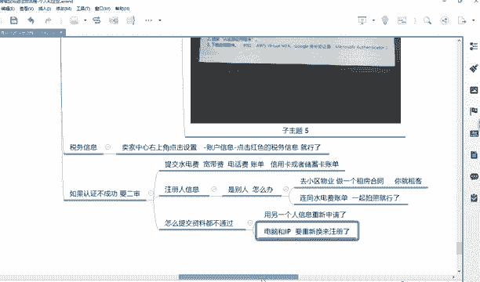

弄你说老师当年做亚马逊的时候，哪有人教了一东西，没有人教你。那但是我就能把店铺给注册好。因为我问问别人家，偶尔问别人几句话，然后别人只能告诉我几句或者百度我查啥东西。😡，对不对？

但是我准备的资料准备的很详细啊，就后我我。😡，把所有的资料准备好，提前预预防哪些去要遇到哪些问题，然后我再开始花一个时间集中注册，然后填什么东西，填什么东西。但是那那也老师花了好几天。

因为老师很多不知道啊，原来还要什么账单哦，又去银行打印，原来还要什么告搞这个又没弄啊，但是老师就能够注册通过啊，我说的这个意思，就是你做事情，你一定要有执行力，知道吗？你说你们现在有还有课厅。

还有什么老师指导，还有这个什么课件给你们，你说这个时候你你你因为你又搞错了，你那不是那你是让别人怎怎么讲呢，是不是。

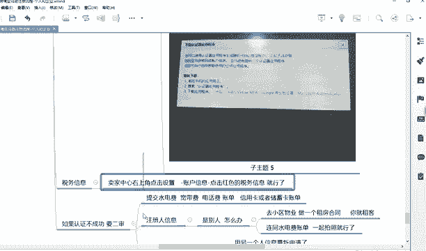

是不是所以说一定要去认真的来听，也不要着急，说上来就就要去注册，不用你先把你的东西搞搞好，然后所有的流程你都捋一遍。虽然你没有实操，哎，我就捋一遍，对，老师讲到这哦，我注册的时候可能会遇到这个。

当时我应该添加什么，我看我手上有没有啊，然后弄好弄好好好，流程都捋顺了，脑袋大概有个概念了啊，这个时候我再开始好注册哪个地方哎，如果注册实在比较纠结或者不懂，再问一下你老师。这个时候才能防止出错呀。

知道吗？

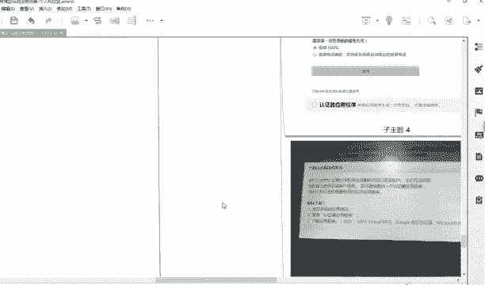

VR卡怎么VR卡没有银联啊，亲爱的同学。😊，为啥卡没有阴0。和威赛卡必须是同一个银行吗？不不是啊，信用卡、储蓄卡和威赛卡都不是同一个银行。😡，不是同一个银行也行，知道吗？只要是同一个人的名下就行。😡。

只有企业注册在二审的时候提交你个人店铺也会遇到二审，也会提交这个水电费账单，都会的，他会让你提示让你提交什么。遇到二审的时候，在卖家中，他会提示让你提交什么，写的很清楚。让你提交什么。

你就提交什么就行了，是吧？你也不要纠结，哎，他怎么又让我提交这个哎，你也不要嫌麻烦，哎，怎么我又要去打印这个好，如果你嫌麻烦，你就不要做这个事，知道吗？因为他本来就是规则，你就按照规则来就行。😊。

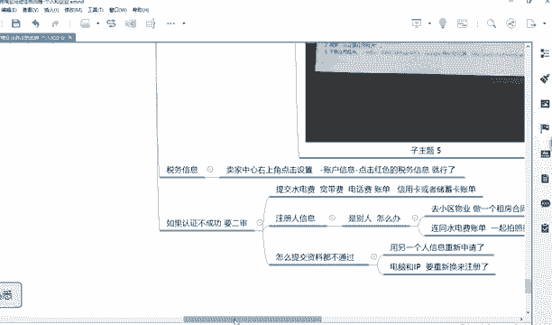

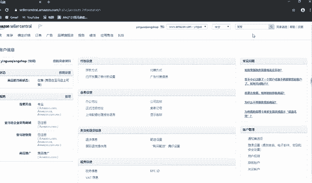

好，所以说哪个地方对，遇到二审。很大的概率就是你之前哪个地方填错了，慌慌张张的就就开始哦勾选成功，然后开始就等待结果，结果遇到20人，所以说你不要着急，知道吗？千万不要着急。😡。

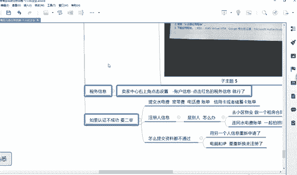