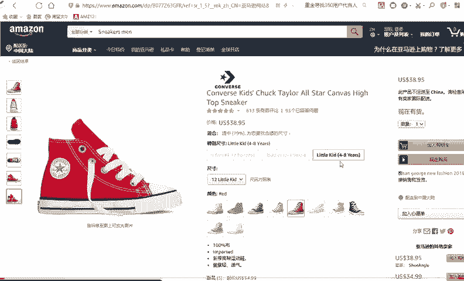
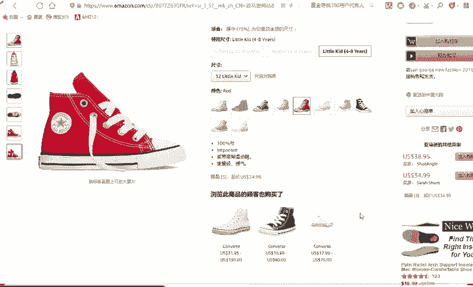
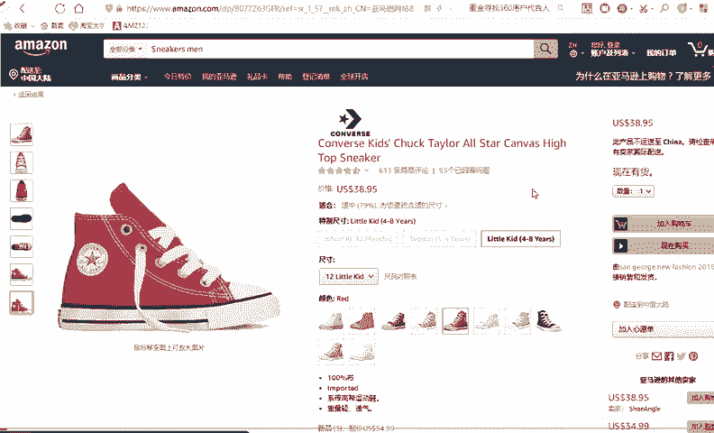
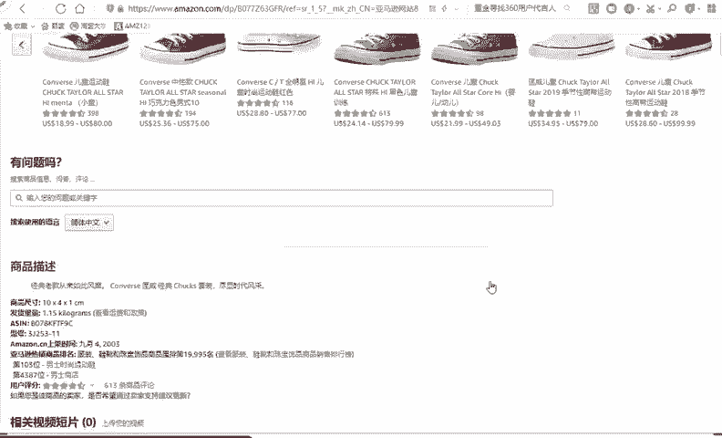
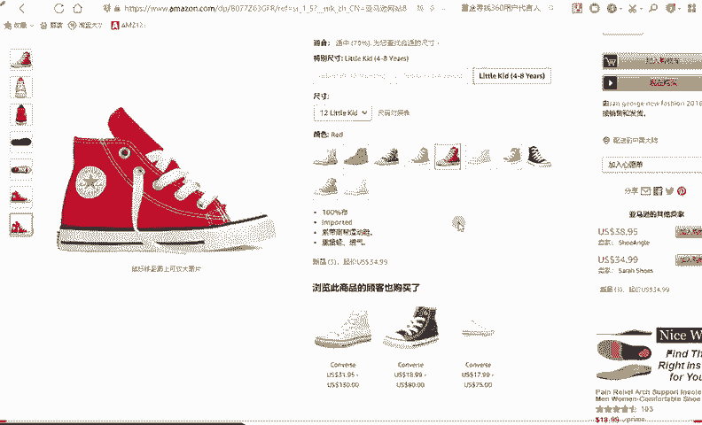
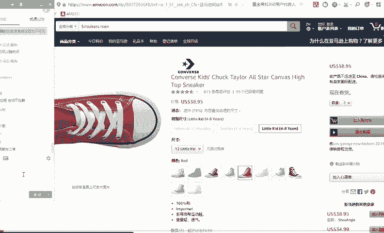

# 【2024年最新版】TikTok+亚马逊跨境电商运营全套零基础视频教程 （从入门到精通，日出百单！）学完适用全平台！ - P25：8.问题解答 - 琉璃月下梦2 - BV1FjbFePEo7

这是可以，但后期垫付开来之后，老师给你会给你们演示，好吧。😊，一个办公室好几个人在网上卖东西，那他肯定是好。如果他是亚马逊店铺的话，他一定签了好好几个网。😡，然后好几个电脑能理解吗？或者是一个店铺。

他给你建了好几个子账号，就像你淘宝上有很多子账号，有很多客服一样共同卖一家店铺的产品。😊，是一样的。因为因为亚马逊其实他他是轻客服的，你知道吧？他是轻客服的，就是他注重的产品的展示。😡。

你看他的图片展示非常干净，没有什么花里胡哨的，就是展示你看到之后就去决定买不买了。😡。

很少有人会询单，哎，我跟你。😡，呃，跟你讨价还价啊，还要跟你谈谈价格呀，很少有人，因为什么呢？😊。

因为我那个。我那个就是学员或者说我那个身边朋友，他们做亚马逊的，他们就是非常轻松，就是因为他宝贝然后上产好之后，然后店铺也弄好之后，然后每天早上9点多来上班，晚上5点多他们就走了。

因为因为他不需要回复卖家消息啊，有单子，他第二天然后再发一发，然后没有的话，然后然后或者客户的消息去回一回。😊，他不需要一直盯着这个东西。

因为他因为因为他的官方要求就是要听客服注重产品的展示，就是你看到这个产品，你就觉得买不买就就可以了。所以说他会图片那么干净，然后图片那么清晰，就是通过图片。因为为什么别人会问问你这个东西哎。

尺码正不正常啊，颜色掉不掉啊，或者说你这个东西呃，什么材质的呀，你问不为什么会有这么多人会有这个问题，是因为你肯绝大部分原因是你没有展示出出来。

就是你没有把你的信息表达清出来，那别人肯定要问的，你懂我意思吗？😡，懂我意思吗？好，这点能懂的给他打6。😡，好，关于开店的问题。好，什么时候会触罚二审？一般你如果你第一次没审核过，他会触罚二审。

二审的话，一般要提交你的水电费资料。不还有一个同学会有这样一个问题。他说老师，比如说如果要提交什么水电费资料或者水电表单，那如果我是租房子的怎么办呢？😡。

比如说老师我我加。😡，我住的这个地方是我租的。😡，那不他不是我名下的房子怎么办？😡，来回答我。哎，同学们，你觉得这个时候怎么办？😡，好，这时候很简单。告诉你，如果你在哪个地方租的，你就要有那个租房合同。

😡，当然是正规的啊，不是说你在纸上写的那个找一张白纸写的那可能就不正规了。一定是你和那个比如说物业啊要的那种纸合同模板，然后双方有签字，还有盖章啊，盖手印啊，这种模板，然后照合同模板、租房合同模板。😡。

然后拍照。和那个水电费账单一块上交上去就可以啊，就证明这个东西是你消费的嘛。因为我上次讲了，为什么。😊，这个这个亚马逊他要这么多什么账单啊，信用卡账单，因为他是国外的，他是美国的。

他美国大部分消费都是说通过什么信用卡。😊，他们发工资其实是一个星期结一次的，有的甚两个星期结一次，他很少有一个月结一次工资。😡，为什么呢？因为他们花钱。就是花明天的钱，比如说他。😡，他他一个星期呃。

不那个发工资，他可能今天的信用卡账单他就没办法还了。你懂我意思吗？他那很大部分人都是提前消费，都是刷卡，都是过过度消费。然后呢，哎再发工资，再找工作，然后赶紧还这一批的钱，都是这样的。

他说就是大部分有很多人都是这样的。😡，因为他这们的思维就是这样的，所以说他们很在意你各种账单了，叫你提交各种账单，你可能不太习惯。你说哎我假如说有人开过淘宝店，说我开淘宝店就没这么多什么道道。😡。

他可能因为他的国家是不一样的嘛。你懂我意思吗？支付宝缴费记录呃，我建议你去那个水电局打印，好吧，支付宝缴费记录好像是不太不太行的。😊，水电费就可以了，什么网费呢，暂时不需要，好吧。😡，水和电就行了。

因为水革店他是每个月都交的呀。😡，不是本人的渠道可以。水电费，你是租的，你就去搞一个租房合同啊。对，还有一个同学会这样问，他说老师我是住我妈家，对不对？这个房子是我妈的，我是他孩子，然后我我还没嫁出去。

然后这种情况怎么办嘞？这个情况也很简单啊，你俩去你和你爸去物业去签一个租房合同不就好了吗？你懂我意思吗？😡，懂我意思吗？还有一种方法，不过我这个方法当是有一定的成功概率。比如说那个像比如说水电费。

比如说水电账单怎么办？😡，水电账单还有一种方法，这个是一个学生分享给我的，也也是有好几个学生吧，我也告诉过学生，但是有一个成功概率的成功概率，但不是百分之百水电费账单该怎么弄？😡，还有一种。

就是你可以花钱请人做，就是可以找人批。在淘宝上，你搜索水电费账单。就他可以帮你批出来。😡，P的很真，但是有一个前提就是你要你要你要知道这个模板大概长什么样子吗？😡，就是你可以去水电费打印一个。

或者说知道这种大概的这这种模板长什么样子，他可以去淘宝上花钱啊，比如说我给你搜一下吧。😊，那很多东西都可以的。😊，就淘宝上。啊，比如说淘宝。但是这有个成功概率啊，并不是并不是百分之百。

如果你真能打印的话，那最好如果你。😡。

实在是搞不定，比如说在外地在外地啊什么之类的。😡，那你可以找找淘宝上人批一下。嗯，不是。看到没有？有很多人有这种服务的，很便宜的啊，就是就就看各种账单都有什么税务单啊，什么各种单，就他可以帮你做出来。

😊，你懂我意思吗？就比如说你公司想要报账，对不对？你比如说你买一个电脑主机，哎，你你想报账过账，然后他给你搞一个账单，拍照发，你或者怎么寄给你啊，就是很多做账的就在在淘宝上就可以找到。😡，对。

欧洲是审核比较严的。你一开始见你做北美。能理解吗？好，那今天的主体内容就到这里了。😊。