# 【2024年最新版】TikTok+亚马逊跨境电商运营全套零基础视频教程 （从入门到精通，日出百单！）学完适用全平台！ - P26：9.产品货源 - 亚马逊小钢炮 - BV1GitDebEhC

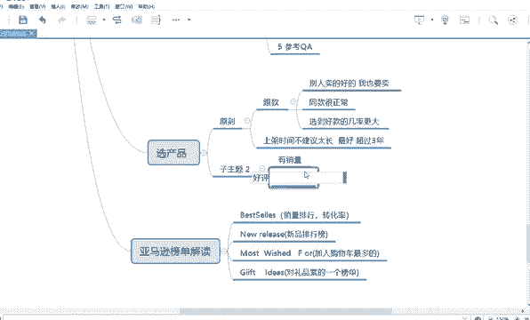

好，那还有一个问题，比如说老师，那我既然比如说我选出来这个东西，假如说这个东西可以卖，是不是那我怎么找货源嘞，对不对？那我肯定要在国内找货源，然后卖给他怎么找着这种同款一模一样的这个东西嘞？好。

这个东西很简单。如果你在1688上来进行找。好，首先第一步。😡。

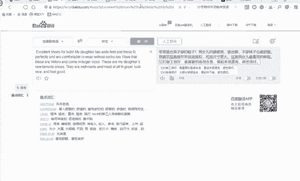

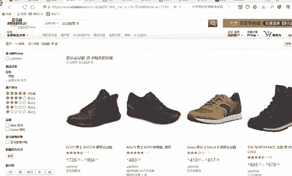

你要返回一下。好，假如说你卖这个东西，首先你要看你的一个代发工厂有没有卖这个东西。好，你把这个图片。

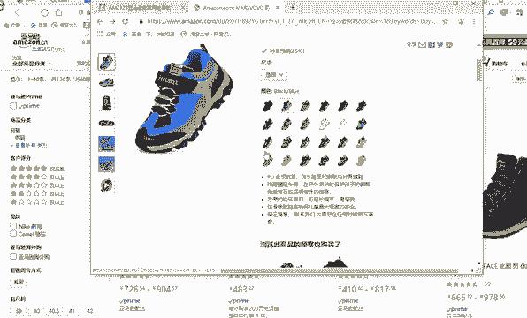

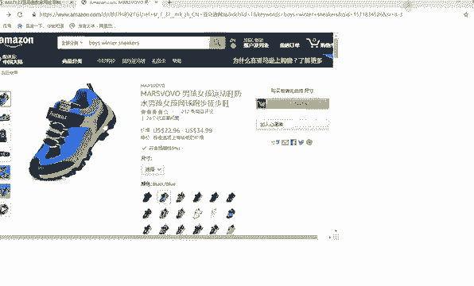

好，首先你可以把这个图片。好，他这个还没有还没有反应过来，应该是。啊，要不然可以放大的，那估计是没有反应过来。好，这样吧。😊。

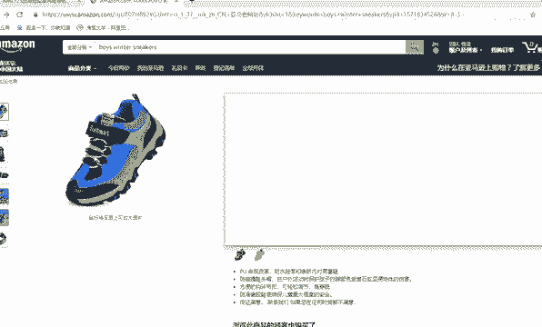

你就把这个图片做个截图。好，截图的快捷键在哪里？

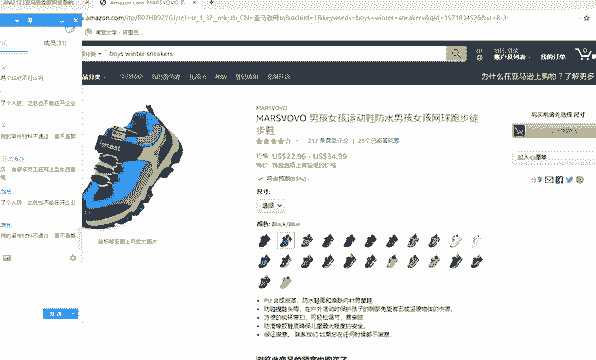

好，截图快件在在这里。好，你把这个。给截图。好，截图好之后，把它放到桌面。好，我这个右键怎么用不了嘞？

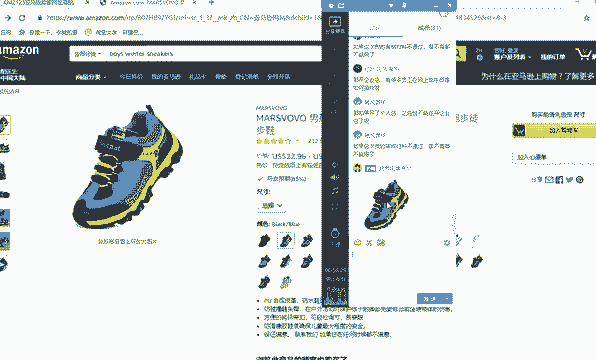

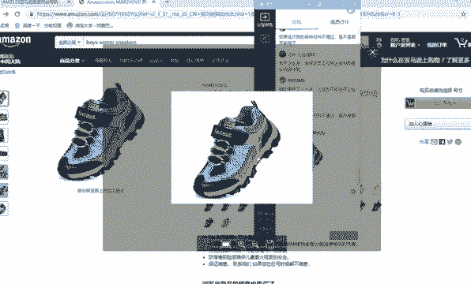

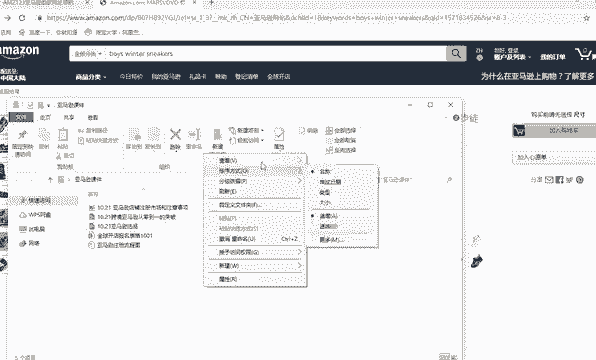

好，看能不能粘贴到桌面啊，大家稍等。好。

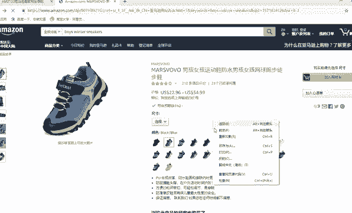

为什么没有截图？😔，好，这个可以放大了。Hao。好，我要做一个截图，把这个图给保存一下。

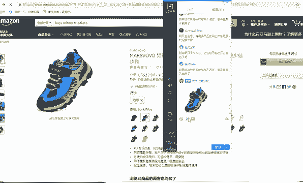

好，保存到桌面上。好，保存在桌面上。好，把这个图保存到桌面上。O。

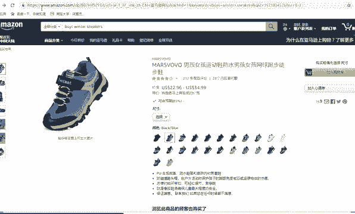

好，我存到桌业上，下一步，我打开1688官网，就是百度1688官网。看1688有没有代发的1688批发网，这是国内的一个批发网站。好，这里面呢如果是你来到首页的话，它一般是有那个照相机功能。

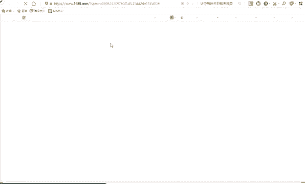

好，看到没有？你来了首页啊，点击168首页。😊，这有一个照相机功能，就看它可以通过图片来识别。好，桌面。

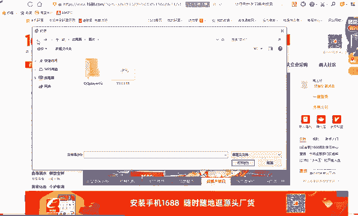

好，在这里。看到没有？它就识别出来了。好，基本上和它款式差不多。你看。😡，好，颜色稍微有点区别，但是款式差不多，看到没有？颜色侧面有点差不多啊，看有没有一模一样的。好，这个应该给他涨的差不多。看到没有？

你要卖的话，就选这样的产品来进行代发就可以了，懂我意思吗？😡，啊，当然了，后期怎么样进行作图啊，我么拍摄啊，都要后面给你讲，但是你找货源就用这个对吧？因为你没办法搜关键词，假如你要搜索呃叫运动鞋男孩童。

就是男孩儿。😊，他搜出来有很多款式，但是跟你的款式不一定一样或者很像啊。你只有通过图片查找。😡，你才能够找得到。好，这点能懂的给他打一，知道吗？这是1688自带的功能，就像你淘宝上自带的功能一样。😊。

能理解吗？你找货源就这样找，这是最快的。你因为1688已经很非常成熟了。它在中国的话，只要有市场，只要有界面上有卖的东西。😡，你在1688基本上都能找到。好，能理解吧？好，所以说你选产品的时候。

要这样进行选。