# 【2024年最新版】TikTok+亚马逊跨境电商运营全套零基础视频教程 （从入门到精通，日出百单！）学完适用全平台！ - P27：10.卖什么 - 亚马逊小钢炮 - BV1GitDebEhC

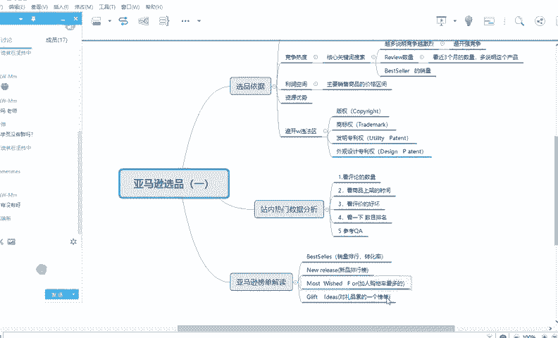

好嗯，那接下来先给大家讲前面的一点，后面的话给大家讲一个，比如说你呃你注册的一个一个点，你审核的话，一般要要等几天的呀，没有那么快的。好。好。呃，那今天先讲第一节内容，就是第一节是亚马逊选品。

就是你假如说你店铺开好之后，你要卖什么？其实按理说是要进行选。好，那选的话，其实有这几个原则，就是比如说哎比如说那有同学会问，他说老师。

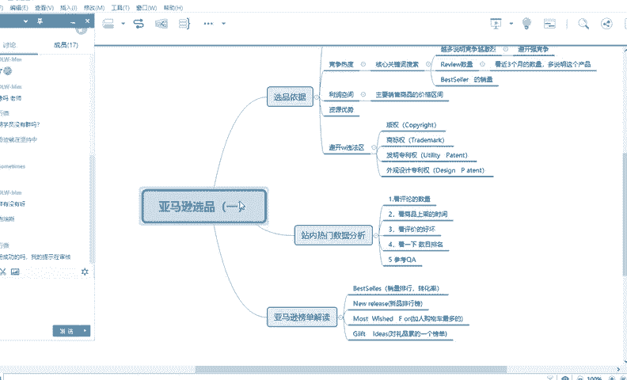

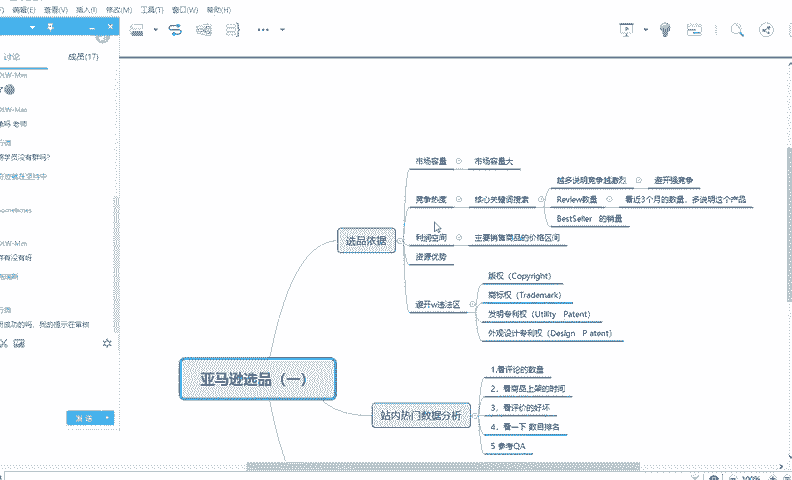

那我在亚马逊里，比如说开店，那我应该卖什么产品嘞，对不对？那我卖什么，那有什么关系吗？对不对？老师只要他上架能让上架，那我不就可以卖了吗？那不是这，那为什么还要选呢对你选的一个目的是什么？

就是你要选更好卖的一个产品来卖。😡。

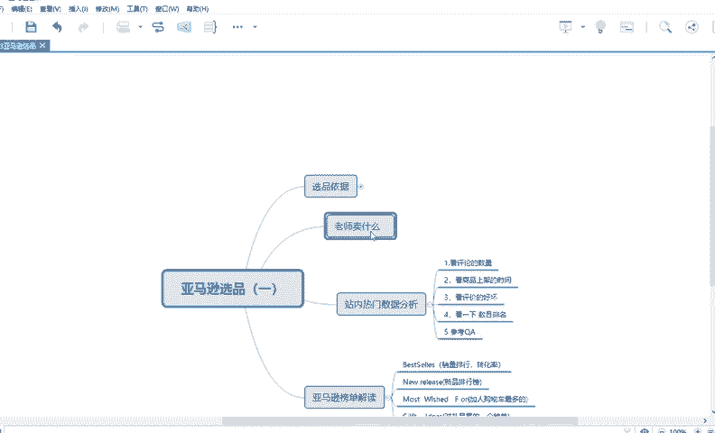

对不对？你更好选择卖产品来卖，是你要选的一个原则。比如说哎那同样是一个比如说我我手上有个手机，对，或者一个手机壳，旁边有个鼠标垫，然后还有一个窗帘，那我应该卖什么嘞？对不对？那我应该卖哪一个呢？

那我肯定要有自己的一个规则，以自己的一个选法，就是哪一个竞争小，哪一个好卖，哪一个更适合新手卖，哪是一个更适合我当下的一个资源来卖，那我就优先来卖哪一个，对不对？并不是说哎老师。

那既然既然别人已经上架了，肯定是可以卖的，对不对？😡，那为什么你不让我卖这个东西呢？好，那所以说那就说明有些东西是不适合你当下的，你懂我意思吗？好，不适合你当下的。😡。

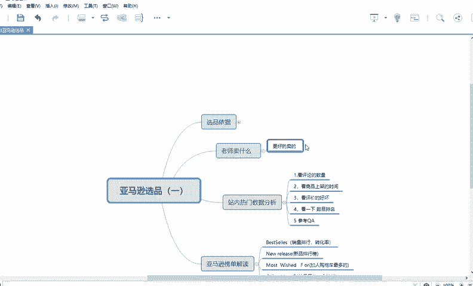

好，那你什么的才叫好的产品能卖呢？好，对于你来讲，他有好几个产品，有这几句话你你深刻理解一下，等会我也会讲，就是呢就是第一他首先第一个就是它一个竞争环境小。😡。

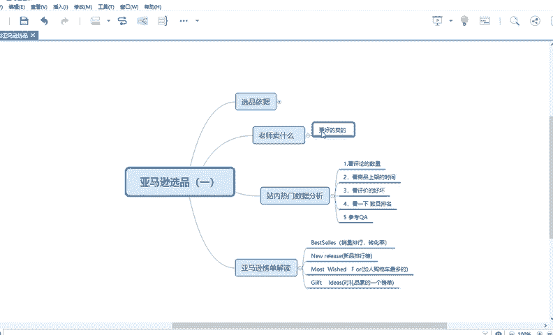

好。竞争环境小，他有两好大。竞争环境。小好，那什么叫产品才叫竞争环境小呢？竞争环境小就是第一个就是卖家少。对不对？这是一个竞争环境条。第二个呢就是。

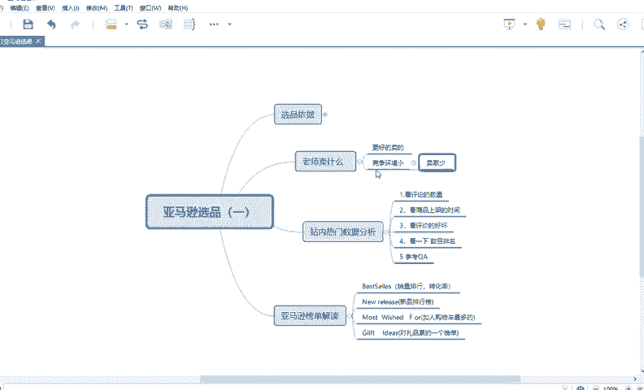

第二个呢就是这个产品是刚刚出来，刚刚出来一般都是属于蓝海啊。对，这叫竞争环境小。还有一种竞争卖家少的一个点又可以细分。比如说就这个产品。假如说假如说我手我旁边有一个叫什么呃，我旁边有一个叫叫什么杯子哈。

比如说有一个茶杯，假如说有一个出然出现出现了一个比如说叫科比茶杯，科比牌茶杯，假如说或者说科比同款茶杯，我随便举个例子啊。好，假如说这个东西如果是刚刚出来，那刚刚出来，那别人没有卖，那我看到一个新闻哦。

然后我我看到有一家在卖的。然后我赶紧模仿这个东西，我也卖这个哎，那你可能前两个月卖的非常好，这属于蓝海，就是刚刚出来，还有一种卖卖家少，这属于即是刚刚出来，也是卖家少，还有一种呢是根据价格段。卖家少。

卖家不同。比如说我同样是一个，假如说我身上穿一个衬衫嘛，同样穿了一个衬衫。假如说有人卖30，对不对？

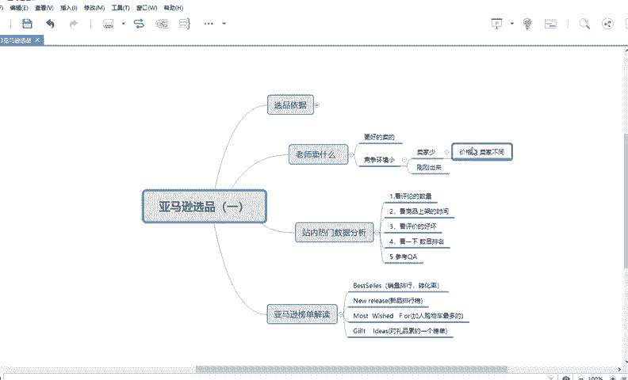

有人卖60。

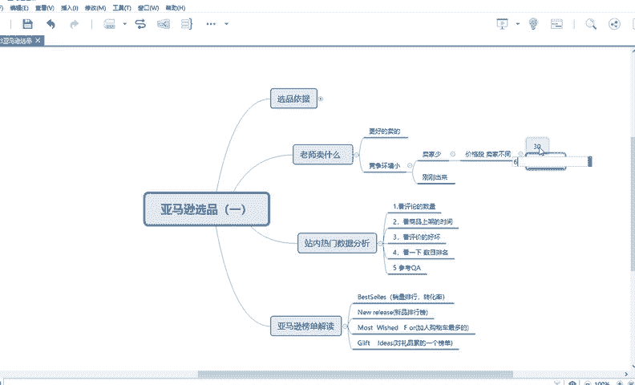

他有人卖90。哎。那这个就不一样了呀，这个就是属于价格段。因为不同的价格段对应的一批人群。那你有些人会问他老师。😡。

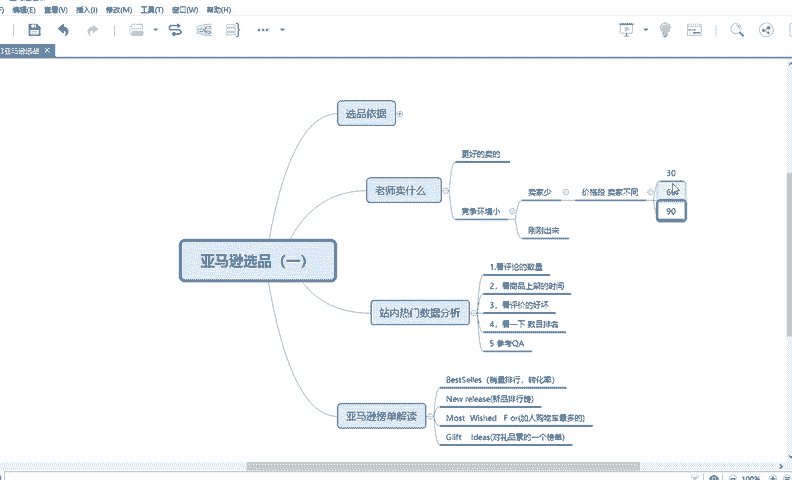

那你。别人不会买便宜的嘛，对不对？既然比如说同一款衣服，有人买不同的价格，那为什么别人不买便宜的，那贵的不就不好卖了吗？不是这样，因为每个价格都会对应着一批人群。😡，他。好，能理解吗？

就是你每一个人群啊，就是每一个价格，它对应着不同的人群，你懂我意思吗？它每一个地方对应一个人群能理解吗？好，那你选的时候，你首先第一个你要进行选产品。好，那还有哪些东西，其实亚马逊不允许卖的。好。

基本上如如果是不允许卖的，他一般是。😡。

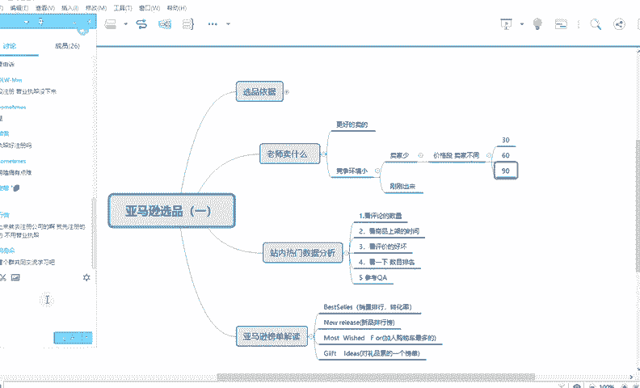

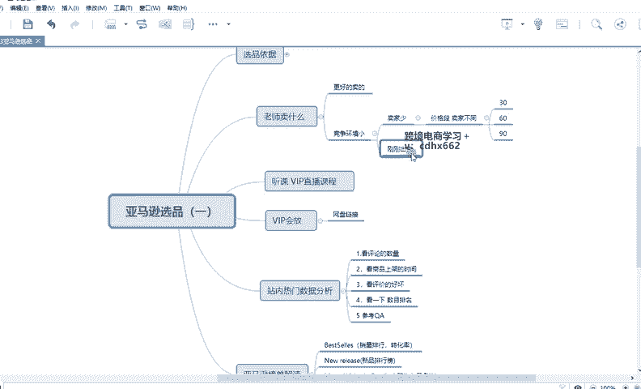

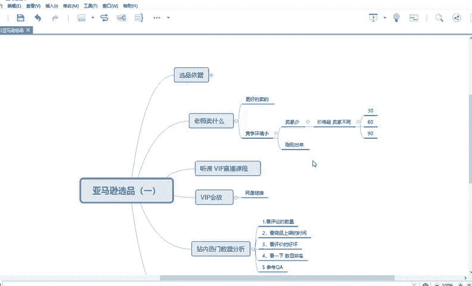

是这几个就是你不建议卖或者说不允许卖，不建议卖。比如说是图书类，那亚马逊，他是一般是不要求商家来进行卖的啊，因为因为一开始亚马逊就是从图书进行起家的嘛，所以这个他他他不要求那个新的卖家来进行卖。

第二个就是像那种不易保存的。比如说像食品啊，对对？比如说你是在哪个地方的农产品。

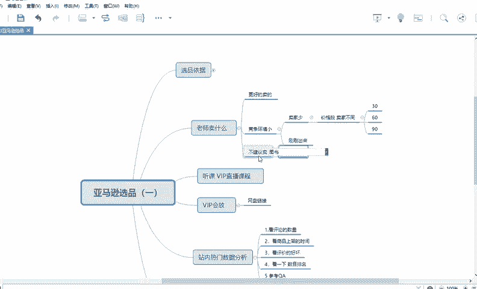

他肯定是不适合长途运输的呀。对像这种意嗯很难长久保存的东西，那你是不向于卖的。比如说你可以卖衣服，卖玩具，卖什么数码产品，呃，卖卖什么挂件啊等等等等，这可以长途运输的这个东西是可以来进行卖的。好。

那这是一个点。好，首先第一。

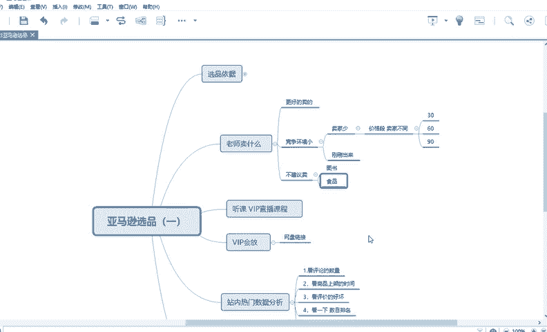

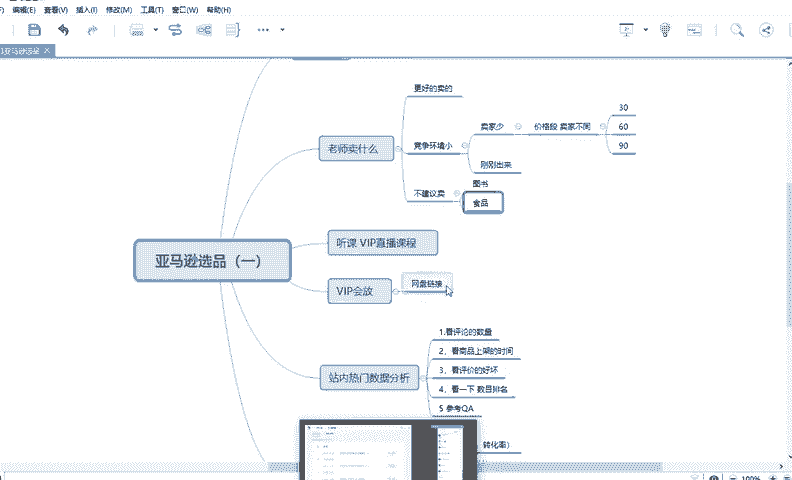