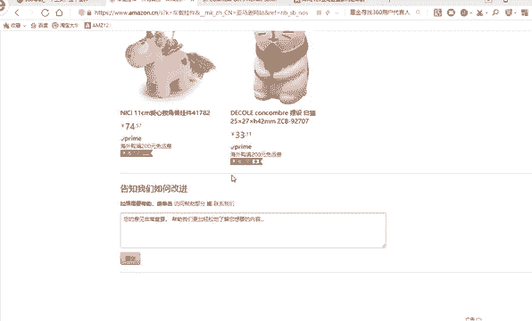
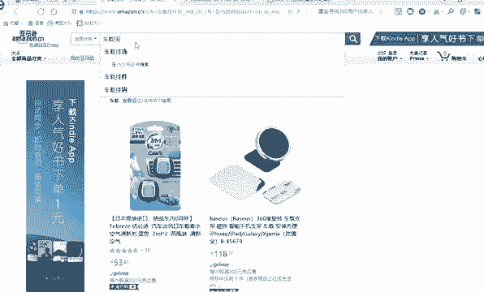
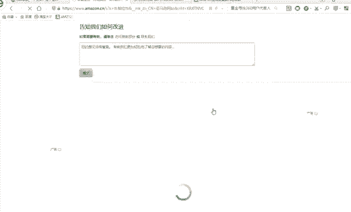
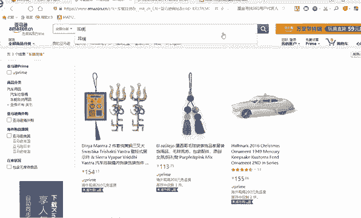
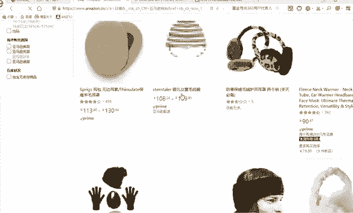
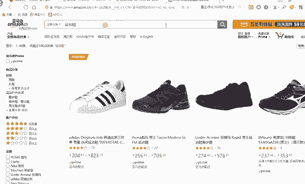
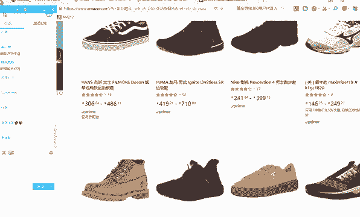
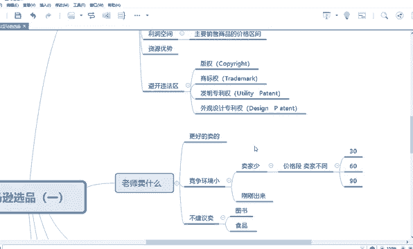

# 【2024年最新版】TikTok+亚马逊跨境电商运营全套零基础视频教程 （从入门到精通，日出百单！）学完适用全平台！ - P29：12.选品依据 - 琉璃月下梦2 - BV1FjbFePEo7

好，第二个呢就是你选品的依据。选品的依据第一就是市场容量呢大，市场容量呢就是有更多的人来愿意卖这个东西。好，那比如说那我想判断这个东西能不能卖，其实有两个点，第一就是这个东西买的人多不多。

第二个就是这个人卖的多不多，对不对？好。买的人是否多，买的人肯定是越多越好。就是尽可能的多吧，也不是说越多越好，尽可能的多。好，然后卖的人。尽可能的少，对不对？好，那我怎么判断？

比如说老师我有我家里有一个新产品，比如说是是某一个挂件，比如说出来一个叫什么呃，比如说车载挂件嘛，假如我随便举个例子好，车载挂件。那老师，我这个东西能不能在亚马逊上卖嘞？好，你这个东西能不能在亚马逊卖？

比如说你在实体店上可以卖，你在淘宝网上可以卖，但是我能不能放到亚马逊上卖呢？这个是这样，你能不能放在亚马逊上卖，你就把这个产品放到这个亚马逊市场里看，有没有别的同行在卖，你懂我意思吗？你懂我意思吗？😡。

好，就是好，那比如说好老师打开，比如说亚马逊网好，亚马逊网，等会儿我再告诉你一个网址啊。好好，比如说你是。好，车载挂件好，搜一下。

好，车的挂饰换一个词之。

你看像这个东西。😡，就很少。像这个东西就很少很少，你看到没有？这个东西在在亚马逊上几乎没有什么市场。所以说这个东西不建议卖。你首先好，你比如说你想判断这个东西能不能卖，一定要在这个网站上这个平台上来搜。

比如说哎那老师我在平常在淘宝上为什么呃我在淘宝上买这个东西，或者我在淘宝上卖这个东西，为什么有这么多人卖嘞？有的人都能买的。因为淘宝允许商家这个东西，或者说这个东西在这个有市场，所以说你想卖这个东西。

你一定要先看一下有没有同行在卖。好，没对于一个非常常见的东西，比如说什么什么挂饰啊之类常见的东西，如果要在亚马逊官网上很少有人卖，那你也不要建议去卖，对不对？要么他是他不愿意来进行呃。

让这个新注册的商家来进行发布，要么他是。😡，这个东西他没有开放这个类目，知道我意思吗？所以说你首先要判断这个卖家市场有没有人别人在卖，这是最重要的。😡，好，声音还不够大是吗？我再声音大一点，好不好？😊。

好，能理解吗？现在呢好讲到这一点，能懂的给他家打一。😊，好，那接下来再给大家讲下面一个点。好，就是你比如说那我第一个，假如说老师如果这个产品允许别人来买，比如说我举一个最。😡，最简单的。

比如说像什么像什么什说。😊，耳暖吗？我看耳暖这个东西就是耳罩。耳暖。好，比如说这个耳暖看看有没有。

啊，你看这个东西也非常少。好，比如说我再举个，比如像运动鞋。😊。

你看运动鞋这个东西就非常多了，有共有多少多少条运动鞋，各10百千万、10万、10万条，共有10万条做卖运动鞋的。所以这个市场肯定是有的，对不对？也要也有很多人在卖好，那对于你来讲，你卖不卖这个运动鞋嘞。

好，对你你要记住这几点，如果你想卖大类目。

什么叫大雷目？😡，大类目你可以理解为叫服饰鞋包，就是大类目，就是服装饰品饰品就是你耳环啊什么之类鞋子、包包属于大类目。这个大类目永远都有市场，就是你永远都可以卖。你不用判断说老师我能不能卖衣服啊。

能不能卖鞋子啊，永远都可以卖，那你要选什么呢？你要选这里面的款式，就是比如说我想卖哪一款衣服，😡，唉，哪一款包包哪一款之类的，对不对？因为你对于你来讲，或者说对于你平常买东西来讲，你想买一个。

比如说羽绒服。😡，那我肯定。😡，看一下这个款式，我喜不喜欢，我再决定买不买啊，对不对？我如果我不在乎什么品牌的情况下，那我肯定这个款式好不好，然后再看价格哎，再看它评价，对不对？永远是这个，他看款式。

那比如说那淘宝网上，假如说或者说亚马逊网上有很多人在卖这个羽绒服。但是羽绒服这里面的款好的款式是有限的。就是好的你要把好的款式选出来，就比别人随便找一个款式上架，要成功的概率要高的多得多。

所以说你要大类目进行选款。那小类目里对大家什么叫小类目，小类目你可以理解除了服饰鞋包，基本上都是小类目。😡，你可以这样理解，好吧，但是并不是百分百，因为有些类目它不大不小。

比如说像窗帘啊之类的对你也不能说它大，也不能说它小。好，但是你记住它几个特征啊，比如说除了扶蚀鞋包，大部分都是小类目。😊，小类目的产品远远要比大类目要多。好，比如说我我身边有一个键盘，有个鼠标。

有个电话，有个手机，呃，有个什么这种有了一盆花，还有一个挂饰，一个椅子，一个桌子都是属于你可以都理解为小类目，能理解吗？小类目你一般是词比较少。一般款也比较少。款款少，它是相对于大类目的，对对不对？

就是款式的意思就是它的样式。比如说像哎这个鼠标它的样式，它可能就是这样的，无非改改颜色，对不对？改改什么角度，它变布了新的花样啊，它不可能变成直的，不可能变成扁的，对不对？

那只能是从这个大致的框架里来回改来改去。但这衣服就不一样了。我有我身上有一个T恤，那我走大街上，那所有人穿T恤都不一样，对不对？所以说它款式很多，导致词也很多，还要各有区别，各有区分。好好。

那这是一个点。😡，好。那对于你来讲好，但是还有一个点要给大家讲，就是你做亚马逊的时候，我建议大家不要做小不要做低价产品。😡，什么叫低价产品？就比如说你是卖垃圾袋的，对不对？可能人民币9块钱就能买一大包。

然后还要包包邮过去。假如说是国内啊，还要包邮。如果有国际，那你更还没有邮费贵，那你就没有必要卖了。因为亚马逊的人群大部分都是都是高消费人群。😡，他们上一节课讲过有百分之。50以上都是35岁以上的人。

因为他有自己成家立业了，他有能力来进行消费了。所以说这些人群是属于高客单。你要买高客弹，高客单有什么好处？嗯。高可能第一。买家更喜欢。第二个利润更高啊。对不对？你只有卖的价格更高，你才能利润高。

比如说你卖个东西是20块钱人民币，只要价值20块钱人民，你哪怕全赚，你才能赚20啊。如果卖个东西2两百块钱人民币，那有可能我就会赚100。你懂我意思吧？你只有卖的更高，你才有可能利润才回旋律矩才会更高。

所以说提倡大家卖高高可能价的。😡，好，那高客单呢还又分为两种。什么叫高客单呀又分为两种。第一种就是一件是高客单。😡，比如说这个我比如说我卖这个桌子对不对？可能是几百块钱一个或者上千块钱呃。

假说我只算人民币啊，上千块钱一个。还有一种呢就是他一个人，虽然这个单个的价格很低，但是一个人大部分都是买很多个。😡，哎，这也也有可能会卖高客单。因为一个人比如说比如说啊比如举个例子。

假如说他是卖你是卖小玩具的。😡，对不对他可能要加购了好好多个十来个，然后才能够愉快下单，哎，加起来100多块钱，哎，基本上也算是一个高客南。你懂我意思吗？只要看你的一个产品属性。

你要知道有这么回事就可以了。好，还有一个呢就是你卖产品的时候。😊，你要那卖产品的，一定要避开自己的违法区间。好，我把这个放大一点给大家看一下。好，因为因为你卖向国外啊，它不像中国。

中国可能改革开放才几十年。像外国的话，像美国，你要卖到美国去，它的一个市场都比较成熟。因为他比较在意这个东西。你懂我意思吗？他比较在意这个东西，他所以说就像我第一节给你们讲的，就上一节给你们讲的。

说呢一一个卖家不小心把那个什么呃一个国外的一个标，然后粘到那个牛仔裤上了，结果过美国海关的时候。😡，被别人起诉了，发邮件让他赔偿100万美元，对不对？把吧吓得连店铺都那个卖给别人了吗？😊。

所以说外国的话是比较在意这个那中国可能就这方面还不是太成熟嘛。当然我不建议大家卖什么假的呀，你这个是自己坑自己知道吗？因为你不是耐克的，你千万不要打耐克标，你不是什么阿迪的，千万不要打阿迪的表，知道吗？

这个是很重要的那那比如说那那比如说老师那我不卖品牌，难道就卖的出去了吗？可以啊，你比如说像衣服类的，别人主要是看款式，他不看什么，你是哪个哪个什么品牌的，就像你去买东西一样。

你会在意他我这个东西一定是耐克的吗？对不对？如果这个东西他你一定要买耐克的，那一定是超级贵，你直接进官网搜就行了。你叫普通的店买的，那一定是。😡，大部分都是假的。你你如果是搜哎。

比如说我是想买一个什么牛呃棉绒牛仔裤。好，那我首先搜一下棉绒牛仔裤。假如我在亚马逊买你棉绒牛棉绒牛仔裤。那我首先看一下这个牛仔裤款式喜不喜欢，对不对？然后再看价格，再看其他的，我不会在意它是什么牌子的。

因为那个不重要，因为有没有牌子，它质量价格还一分货就是一分价格，哎，他卖100和卖200200，他可能价质量上有点区别，那我就看我是想买哪一种。😡，所以说你是自己脑袋里就有这种想法，懂我意思吗？好。

这是一个点。好。

