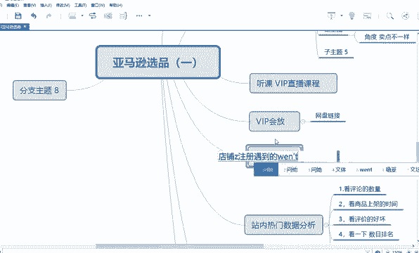
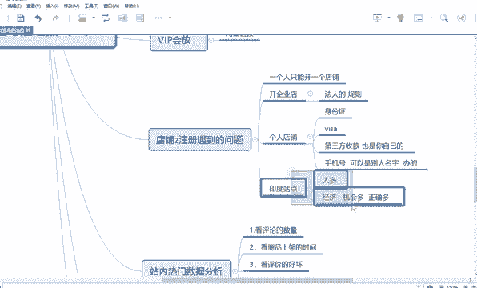
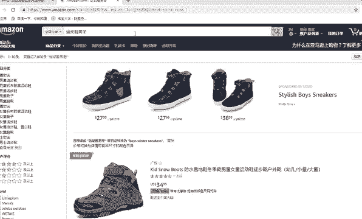
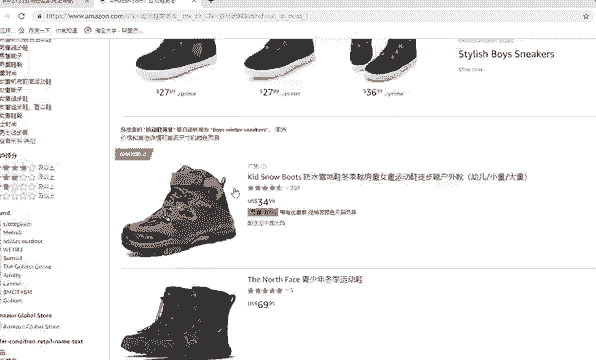
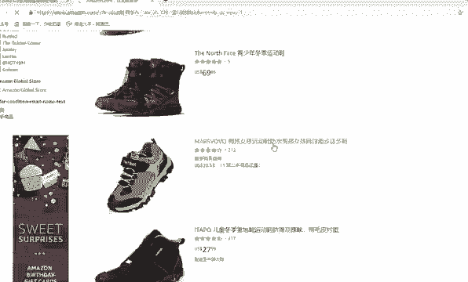

# 【2024年最新版】TikTok+亚马逊跨境电商运营全套零基础视频教程 （从入门到精通，日出百单！）学完适用全平台！ - P30：13.店铺注册遇到的问题 - 琉璃月下梦2 - BV1FjbFePEo7

啊，这网速突然卡掉了，大家稍等。好。那这样吧，等他反映一下，我先跟大家讲一下你你们店铺注册最近遇到的一些问题。好，就你最后最后。就是你大家遇到了一些主要的一些问题啊。好，比如说。😡。

店铺注册遇到的一些问题。

好，第一个呢就是。就是有同学他问，他说老师，如果我先申请了，以我个人的名义申请了个人店铺。😡，假如说在北美站申请了个人店铺，那我还能不能在欧洲站申请我的企业店铺里？

假如说这个企业店铺的法人还是我还能不能嘞？来大家回答一下。😊，能理解这个意思吗？😡，能理解我老师的问题的意思吗？😡，就是我假说假设我用我的身份证，然后呢注册了一个个人店铺在北美站。

那我还是我还有一个企业，就是法人是我，但是我还能不能用这个法人申请欧洲的嘞？😡，好吧。好，我告诉你不能了。那就是重复开店了呀，你懂我意思吗？😡，一个人不能开两个店铺，一个人只能开一个店铺。对不对？

还有第二个问题，就是老师他说老师我如果开企业店。😡，上次我讲过很清楚，如果你开企业店，你要有营业执照，还有你的法人呢，是就是你的一个信息，都是法人的信息。比如说法人的一个什么，你要提供什么法人的账单。

然后对公的那个就是那个信用卡的收款的账单，都要是法人的，知道吗？这个是规则。😡，所以说你这些问题，其实老师之前可能跟你讲过，你可能没注意。然后老师再给你提一下，这是规则。啊都是要法人的信息。

如果你是个人的话，那就是不不不需要营业执照了嘛？也不需要上么法人。因为你要身份证就行了。你个人的信息，比如说你是V啥信用卡，也是你的如果你是个人店铺。😡，对，如果你是个人申请的。

比如说身份证肯定是你个人嘛？然后这个身份证名下办理的微啥卡肯定也是个人的嘛，对不对？然后什么第三方收款，第三方收款，那肯定提交了一些那个实名认证照片，肯定也是你自己的嘛。能理解吗？也也是你死的。

还有一个就是你。还有你的，比如说你手机号，其实手机号不是你你名下的。比如说老师，那我这个手机号是不是一定要是我名下的呢？这不一定你手机号可以，比如说让你父母的办的，他名下他的身份证办的，这个也可以。

知道吗？但是这个手机号一定可以是别人名下办的。😡，因为它只是一个验证接收消息的一个内容，它并不是。这个验证信息啊。对吗这些细节基本上都问到了吧。好，关于店铺开店的时候，还有什么问题？😊，你开了个人店了。

就不能开开企业店了呀，是这个意思。一个店铺，两个站点不可以吗？呃，你可以开全球店，但是全球店就更审核就更难了呀。能理解吗？一般就老师建议你开一个站点就足够了。因为它市场足够大，他把全球分为若干个站点。

上节课也讲过，中东啊、印度啊等等，一个站点就相当于对应了好几个国家，甚至就是一个国家到多个国家。😡，那市场是足够大的。比如说哎为什么亚亚马逊最近开了一些，比如说像印度站点，印度站点。

比如说老师我还听着印度不是很穷吗？他能买得起东西吗？好。😡，好，为什么要开印度站点？你们一第一印象是印度很穷是吧？好，是这样。印度很穷穷穷，它可是相对中国，它是穷。但是的话他的人口比较多。第一。

他的人口基数多。第二个。他的一个能有消费能力的人，起码占了一半，占了一半就有五六亿了。他甚至比美国的人还多。所以说对于你来讲，市场不够大。我对于你来讲，市场足够大。对于一个卖家来讲，这个网址来讲。

市场是足够大的，能理解吗？就像现在小米、华为都在开拓印度市场，因为它最大的一个优势是什么呢？😡，最大的优势就是他人多，他人多，他会产生很多很多经济效益。😡，比如说是不是人人大部分人都开始买手机了。

他只要消费在存款，哎，他现在买不起，哎，可能他工作个半个月，他就有时间，他有钱来买那个手机了，或者工作半年，对不对？哎，他现在没有衣服穿，哎，他可能就是大部分都是年轻人上班，他上上了两年班。

他可能就是哎他就是给家里人买买各种生活用品。😊，他只要有人，他就有需求，人有需求，他就有市场就是无限的。你懂我意思吗？这是非常非常重要的。😡，一个逻辑。所以说所以说就是中国人多，这是一个非常重大的优势。

因为中国人能养活得起这么多人啊，而且。你看其实人多是什么呢？哪个地方人多，就是你选的人多，是一定是这些。😡，这些就是经济比较好的地方人多啊。😡，那为什么？像新疆。那还有个新疆荒漠里为什么没有人呢？

因为那就没有经济啊？对，为什么要在这里，为什么北上广有那么挤，交通那么挤，然后上班时间然后那么挤，然后呢上班时间那么赶，节奏那么强，还有那么多人愿意上班呢，因为第一环境是一个问题。第二个就是机会多啊。

就是挣钱的机会多啊，所以说他们不是他会就忽略忽略，哎，房租要高了，交通挤了，他忽略这些了，他不在意，对不对？😡，所以说你有利越有弊啊，有利也有弊，你要看会学会看待事情的一个两面性，能理解吗？

这是一个很重要的。

好。这是一个很重要的点，能理解吧？好，这是一个很重要的点啊，你看到没有？好，这是一个很重要的点。😊。

好，看这一个。

