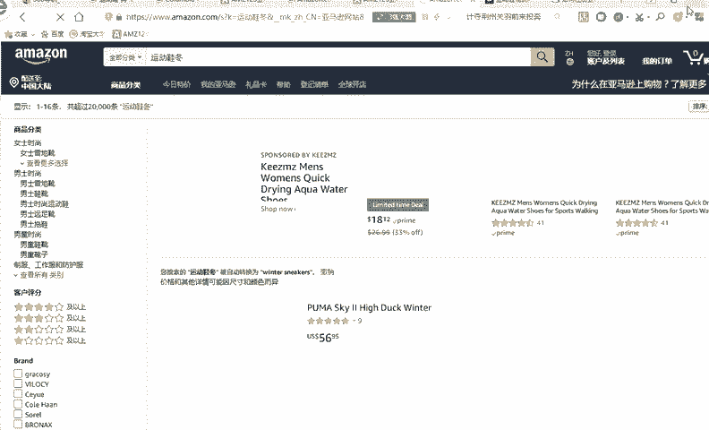
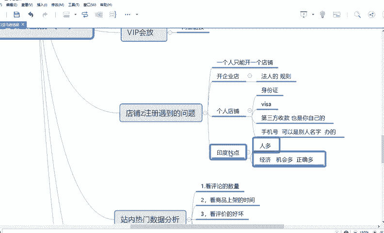

# 【2024年最新版】TikTok+亚马逊跨境电商运营全套零基础视频教程 （从入门到精通，日出百单！）学完适用全平台！ - P31：14.选品的优先选择 - 琉璃月下梦2 - BV1FjbFePEo7

好，出来了，晚有点慢。刚刚。好，看到没有？这就是一个。宝贝的展示页面。好，首先再跟大家讲几个知识点吧。首先第一个就是你看这里面亚马逊是不是有几个主图，它的主图有几个特点。第一。

当然主图的特征后面会讲第一个主图的特征就是它重产品展示，就是后面没有任何文案，它只是一个白白底图，看到没有？😊，然后这个。你看然后这个他大概有7张主图，看到没有？7张主图啊，当然有点卡，它没显示出来。

看到没有？好，这说明什么呢？说明两点。第一，你的图一定要是白底图。😡，第二个，你的图。你的图要有放大功能，放大功能是900乘900的一个像素。啊，到会以后会给你们讲的吗？第二点呢，就是你每你这几张主图。

它一定要是不同的卖点，就是你要不同的角度。比如说哎我第一张图是这样的角度，第二张图是这样的角，第三张是背的，第四个是底，看底，第五个是这样的，看里面，第六个是看侧面，对不对？然后后面一个是展示图。

就鞋带呃，展示图。😡，为什么要这样放呢？为什么不是说哎老师我这一个颜色，然后画下一第二张图，另一个颜色再用另一个颜色。😡，你要明白你做主主图的一个原因，做主图，你要把它做成一个微型的详情页。

好，我给你写了哪好。比如说你要做主图。你要时刻的想着，比如说我想要做几张主图，这几张主图放的图片一定要是一个微型的详情页。😡，换句话说，就是你要把尽可能多你想要表达的这个产品的特点。展到展示到每个图了。

那这种要求什么呢？只要求你每个图展示的卖点是不一样的呀。😡，或者他的一个特点，或者他的一个角度啦。😡，什么什么什么卖点啦不一样，对不对？或者展示的一个角度不一样才行啊。

如果哎如果你比如说哎你第一张图放了这个颜色，第二张图放了一个白色，第三张放了一个绿色，然后角度都一样。那对于买家来讲没有意义啊。😡。

因为他没有了解到你这个产品里面长什么样，侧面长什么，后面长什么样，对不对？你至于说只其他产品在这里面能够看到，知道吗？所以说你展示的时候要把它做成一个微型的详细页。😡。

为什么要这样做？因为实话实说，就是在互联网社会，它现在变得就是比较有碎片化的时间。因为别人没有那么多闲心，然然后翻你翻你的一个详情页，要看很多很多遍，然后才能了解到你。哎，如果你前几张图吸引不了。

他家可能直接划走了，就看别家了。所以说你要尽可能多的满足客户的需求。现在客户的角度上来给他来制作你的一个产品。😡。

对不对？就比如说就像。就像呃为什么要制定一些规则，比如说哎什么什么呃，比如说邮费，你尽快发货啊，然后你哎多少天你要尽快回复买家信息啊之类的，他都是为了让买家在这个平台上有更好的体验，有更好的体验。

才有更多的人愿意在这边下单，才有他的平台才能盈利，对卖家来讲也更能更有实惠呀，所以说还有买家体验感。😊。

好，这是一个。还有一个就是亚马逊，它现在也接入大数据了，就是它有个性化推荐。因为你你们做过淘宝的也都知道。😊，是有个性化？什么叫个性化？就是你平常在这个网站里浏览什么，他会在优箱给你推荐什么。

每个人的界面是不一样。比如说哎你搜索运动鞋男冬。😡。

和我搜索也因为运动鞋男冬它展示的界面就不一样。有可能哎你推荐的是这个，有可能我第一名推荐的这个，它不完全一样，但大部分有有可能是一样的，或者有一部分是一样的，这就是个性化推荐。

因为它会根据你平常收藏的收平常购买的平常购买的价格。平常点击的浏览的来进行给你匹配相应的这个产品。😡。

核心还是就是为了让你尽快的付钱，让你尽快的买从哪买的东西是这样的一个目的，对吧？就提高你的体验感。好。😡。

好，那如果你翻到这个界面，那好，那首先第一，首先要看这个产品的一个。

好，首先要看这个产品的一个。第一靠上架时间看到没有？上架时间好，2003年4月啊，9月4日看到没有？这个是上架时间，这个是中文版的界面啊。2003年啊，9月，因为外国的一个规则一般都是把月和日放在前面。

年放在后面嘛。好，说明这个产品卖的是比较久的。好，是属于非常老的爆款。好，那对于你来讲，对于你来讲，我建议你第一，你首先上架时间最好不要选择太长的。😊。

是第一好，这就是一个好选产品的一个特点。一、上架时间。不建议太长。好。最好不要超过3年。不要不要局现在不要超过3年。

好，能理解吗？好，那我怎么看断把这个上架时间近的这找出来的，很简单。😊。

好，比如说这个。

好，比如说叫运动鞋。东。冬季的冬。好，点击搜索。好，这里面不是有个综合吗？这个可能挡着有点看不见啊，看到没有个综合，还有个叫上架时间排序好，点击一下。😊。

这就按上架时间排序，大概有超过1万条。

好，看到没有？你像这样的产品啊，首先第一个。

他是有还有还是有评价的，就像在淘宝上一样，他是有很多评价的啊。

好，还有很多评价，我想翻现他可能没有反应反应出来。

你看五星好评，我大家挪一下吧，你看五星的有64%，四星的有多少。好，你点一下。😊。

他就会跳转到这个评价了。

你看还有晒图的，就像淘宝上差不多，看到没有？你看晒图好，你看他晒图这这一大堆好。😊，这应该是。excite就是非常好的鞋子。好，对于孩子来讲。😊。

you shows for kiss对孩子来讲是一个非常非常满意的，非常兴奋的。好，咱们百度翻译一下吧。后好，如果你不知道这个评论啥意思。😊。

你可以翻译一下。好。嗯。看非常适合孩子穿的鞋，看到没有？我女儿很亮，脚很宽，不适合袜子，然后儿子怎么怎么怎样看起来很漂亮，感觉很好。看到没有？说明这个产品还是对客户满意度还是非常好的。你懂我意思吗？

如果你不懂英文怎么样，你就百度翻译一下就可以了，懂我意思吗？你看你像这些评论基本上肯口语化的，就像你在淘宝上买东西一样，就是非常口语化的那种评价嘛。好，那对于你来讲，你可以优先卖这样产品。第一。

他一定要有一定的销量。第二个，他的评价要一定的好。好，那你就优先来卖这样产品。好。😊。

好评多。

