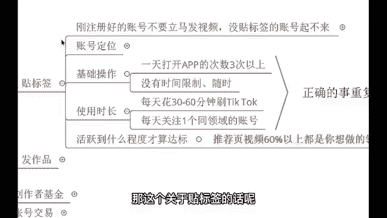

# 【2024年最新版】TikTok+亚马逊跨境电商运营全套零基础视频教程 （从入门到精通，日出百单！）学完适用全平台！ - P8：7.贴标签账号成果示例 - 亚马逊小钢炮 - BV1GitDebEhC

う。那这个关于贴标签的话呢，我得要给你们看一下这个真正实际的一个结果怎么样啊，这个是我做搬运的。

来，我给你们来看一下，这个是我做的一个搬运视频。我把国内抖音的视频搬运到了海外。啊，如果说这个声音大了哈，你们可以说我可以调小一些啊。如果声音大的话呢，我可以调小一些。来，同学们可以看到这个视频的话呢。

我是从国内抖音翻到了海外抖音，它呢发生了一些变化，38000的点赞，我发到海外170万的点赞。各位。😊，翻了多少倍，38000到170万。😡，啊，那这个估计啊原视频的作者要是看到了会气死是吧？

人家的话呢发个作品才3万多的点赞啊，我一发100多万的点赞。来，我们看一下这两个视频有哪里不同啊，我们先看国内的。😊，🎼对对。🎼我败。嗯，行，那这个视频的话呢就简单看完了，他非常简短。

而且的话呢国内的人哎他会觉得这个视频没有什么亮点。所以说这个点赞量的话呢，顶多也就在几万点赞就封顶了。但是的话呢，我经过调查，我知道外国人他喜欢什么？他的一个审美，他的一个兴趣爱好，经过调查的话呢。

发现外国人对于这种宠物哎非常非常的喜欢啊，宠物他们花在宠物身上的钱比花在男人身上的钱还更多。所以说对于这种视频的话呢，外国人是非常喜欢的那我直接的话呢做到一个二次剪辑。😡，二次剪辑之后。

来我们看一下这个视频有哪里不同。🎼夜る ままを 意し で くれる なんろうとの かき の のよみしポレしな おちに をいで。🎼没。好，视频没有没有了啊，看完了，就这么简单。那同学们可能可能会发现啊。

这个视频没有什么太大的一个区别是吧？我告诉你，我把这个视频做到了一个二次剪辑，也就是接下来我们会讲到的一个发作品的一个知识点啊，发作品的一个知识点。那我经过二次剪辑之后，把国内的视频发到海外34。

1M的播放量。来，考考你们有没有认真的听讲，有没有认真的把这个之前的内容来做到一个啊理解。来，我考考你们，这是多少播放量，这是我发布的第一个作品。😡，这是我发布的第一个作品，来，你告诉我34。

1M是多少播放量来打到公屏上，我看一下有多少同学能回答。对。啊，340万34000。还有呢。他同学，你是什么看法？34万。😡，340万3400万340万。341万。3400万3亿3400万啊。

三四百万啊，你这个。三四百万啊，涵盖了好多啊。嗯。340万。啊，行哈，嗯这个也看到了很多同学很多同学的一个答案哈。😊，这个很多同学那个答案这啊。😊，我我们来先恭喜一下这些打340万的同学哈，恭喜你们。

😊，回答从。啊，回答错误。啊，老师我提一下啊，这个呃开个玩笑啊，这个340万的同学你们确实是回答错误了哈。哎，确实回答错误了。刚刚说什么那个几亿的来着，刚刚有同学说33亿啊，你这个3亿太夸张了哈。

我跟你们讲啊，这个正确的答正确的答案正确的答案是3400万。😊，各位。3400万，这个是正确的答案，好吧，来，咱们再次恭喜一下这些打3400万的同学啊。好，那像这个M是百万。对你们理解的没有错啊。

理解的没有错，M是百万。那如果我有EM，那就是100万，是不是？😊，那这就是100万。如果说哎我有10M，那这不就是上升到另另外一个阶层了吗？10M不就是等于1000万了吗？😡，是不是啊？

这就是另外一个阶层了，所以呢像这1个34。1，那你倒推一下，那不就是3400万的一个播放量吗？是不是？对，就这个哈，所以说我这个考考你们哈，未来的话呢，我相信有了这么一段经历。

你后续你自己发作品有多少播放量，你心里应该会有数，你会时时刻刻想到现在的一幅场景。好吧，行那哈到时候的话呢，你自己就明白了，你看这个贴好了标签之后，第一个作品暴力不？😊。

第一个作品就3000多万的播放量，是不是？😡。