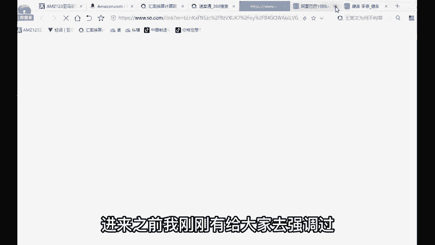
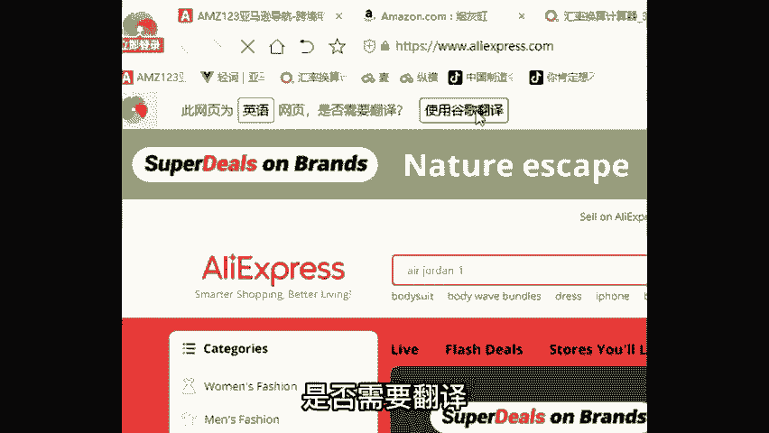
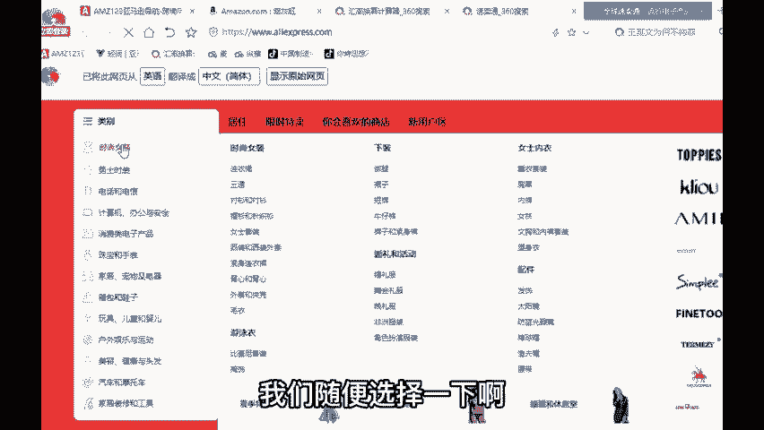
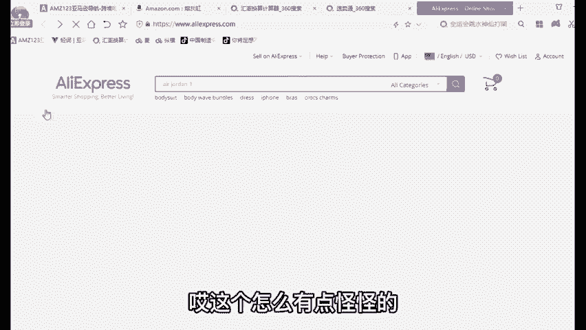
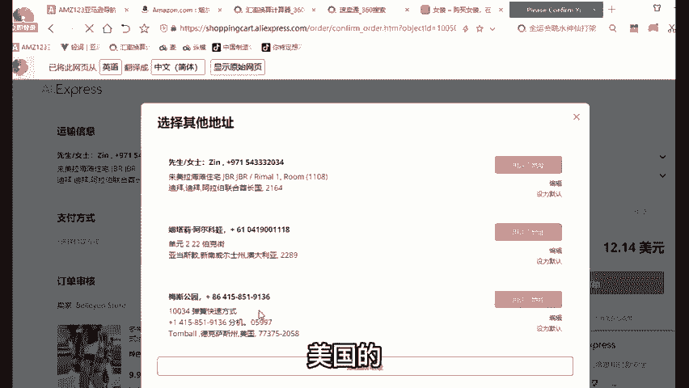
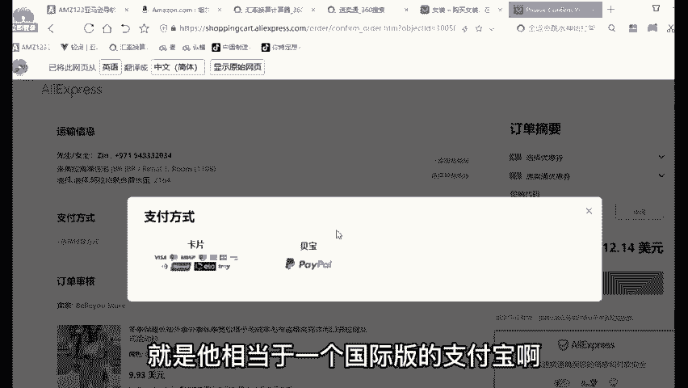
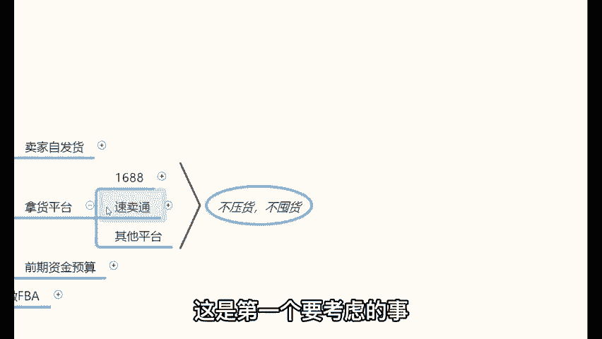

# 【2024年最新版】新手亚马逊跨境电商运营合集，亚马逊入门教程（纯干货，超详细） - P12：09、亚马逊运营模式：拿货平台② - 亚马逊电商小孙 - BV1YvxPedEjR

。

那么第二个可以拿回的平台叫什么？叫做速卖通。那么这个平台的话呢，它也是阿里巴巴旗下的。跨境电商平台就是它也是阿里巴巴旗下的啊，就是阿里巴巴的业务比较广哈。这个大家都知道哈。

它也是阿里巴巴旗下的一个跨境电商平台。但是因为上线的时间比较晚，在2010年的4月份才上线啊，一说2010年到现在也1年十多年了，对吧？但是实际情况下，亚马逊在1995年上线。😊。

那么所以说现在速麦通做的比较好的市场，主要在俄罗斯跟巴西。啊，俄罗斯你们都知道啊，就是军工很发达，就普通人啊就是他们整个国家的军工很发达，但是普通人没什么钱。所以说整个速卖通的收入水平就相对比较低。😡。

对速卖通针对的用户群体的，他们收入水平会相对比较低。那么整个平台的产品售价呢也会相对会比较低一些。对，这就是速卖通这样的一个平台啊，就产品售价会相对比较低。那么我打开速卖通给大家看一下啊。

我打开数码筒给大家看一下，简简单介绍一下啊。😊，嗯。🤧OK打开速卖通之后，咱们进入到苏卖通的官网。进来之前，我刚刚有给大家去强调过啊，这个平台是做跨境电商的。所以说进来之前你突会发现全是外语。

全是外语的话，看不懂的时候。没关系啊，在左上角这里你去下载1个360浏览器，在左上角会有一个提示说此网页为英语网页是否需要翻译，你点击使用谷歌翻译，那么它就会自动的把这些网页的内容，从英语翻译成中文。

对吧？翻译成。😊。

翻译成中文之后就看得懂了。那我们随便选择一个像这个时尚女装，对吧？我们随便选择一下啊。呃，选择这样的一一个类目的产品之后，你们先来关注一下速卖通里面的产品售价哈。😊。

先来关注一下产品的一个价格，看到没有？28。18美金，14。79美金、11。97美金、22美金、12美金、17美金、15美金、21美金、21美金、15美金、18美金、22美金。

这就是速卖通里面的产品价格是相对比较低的，就很类似于咱们国内的物价了。对，这就是速卖通的一个产品的售价，就相对比较低。同时啊速卖通里边哎这个怎么有点怪怪的，真的。😡。

除了价格低之外啊，还有一个非常重要的点，除了价格低之外，速卖通里面有很多产品支持免运费的。😊，我们打勾这个免运费之后，呢，你就看到这样的产品都是支持包邮的哎，都是支持包邮的。😡，那么所以说。

该怎么去操作呢？其实很简单，你先来到速卖通里面选择你要卖的产品啊。举个例子啊，你在速卖通里面选择一款你要卖的产品。那么选好了这款产品之后呢，把这个产品的相关信息，比如说什么。😡，啊，标题图片啊。

这些相关信息一个一个复制粘贴拷贝上交到自己的亚马逊店铺里边。但是这个价格要往上提一下，它这里面卖了10点多美金，那你可以卖了19。99美金啊，或者说29。99美金的之类的。那么在亚马逊上去卖。

然后当你把这些东西这个复制粘贴拷贝到自己的亚马逊店铺里边之后啊，开始去卖。当有客户买了举个例子啊，有客户买了这款衣服，买完之后啊，你看什么保暖长袖外套才10点多美金啊。那么。😊，买完之后怎么办？

买完之后我们再来到速卖通，有客户在我们的店铺里边买了这款产品。那么这个时候我们就来到速卖通，找到这个店铺，然后在这里点击立即购买。😊，然后点击完立即购买之后，登录一个速卖通的买家账户。啊。

登录一个速卖腾的买家账户啊，稍等，我先登录一下啊。好，登录完之后呢，在这里填写上你的客户地址，就亚马逊的客户他买了这款产品，肯定要把他地址给你，到不然的话，你怎么给他邮过去，对吧？

那么当拿到这个客户的地址之后，你把客户地址写在这个地方，就填写在这个地方就可以了，复制粘贴过来。你像我自己的客户啊，比如说什么迪拜的澳大利亚的美国的，把我的客户地址写在这个地方之后选择付款方式。

我们可以使用信用卡付款，也可以使用被保付款。被保的话，就相当于国际版的支付宝啊，等一会儿再讲到亚马逊店铺注册的时候，我再重点给大家去讲这个被保的东西啊，其实很简单哈，就是它相当于一个国际版的支付宝啊。

那么选择被保之后，绑定一张储蓄卡，然后点击下订单。那么下完订单之后，这个店铺的店长就会自动的配送发货这款产品给我们的客户了。😊。

就他会自动的帮我们去进行一个配送发货。那么在这个过程当中，首先你有没有发现一个问题？第一个你不用处理物流。就是这是第一个点，你不用管物流的事儿。因为速卖通的卖家他们肯定他因为做跨境电商的平台。

所以说他肯定自己对接的有物流。所以说第一个问题，你就先不用处理的是物流的问题。😡，那么除了这个物流的问题之外，你还不用处理什么，还不用处理售后。为什么这样讲啊？因为有亚马逊。

假如说啊你把这个产品卖出去了，有亚马逊的客户在找你做售后的时候。😡，你要明白一个道理，在亚马逊上，你是一名卖家，对吧？你是做生意的，你是一名卖家。但是在速卖松上呢。😡，在速卖通上，你是一名买家。

亚马逊的客户在找你做售后的时候，你来到速卖通，找他们的卖家去做售后就可以了。😡，🎼有明白了吗？所以说在这个地方啊，连售后的问题你都不用管。那当然就会有同学说老师，那外国人是脑子有有有问题吗？

速卖通里面的产品价格低，那为什么欧美的发达国家的消费者不直接在速卖通上买呢？哎，来问一下各位同学，你们会不会有这样的一个好奇啊，你们会不会好奇说，那为什么速卖通里面的产品价格低？

而欧美的发达国家消费者不直接在速卖通上买呢？有的话，公屏上可以打个一，我给你们解释一下。如果有的话，你们可以在公屏上打个一。😡，我给大家解释一下这个问题，为什么会有这种情况呢？😡。

那么我相信啊很多人在听我讲完之后都会有这样的一个顾虑。OK那么既然你们有这个顾虑的情况下，那我问各位一个小小问题，哎，我问你们一个非常简单的问题，什么简单的问题？😊，各位来，我问一下。

你们平常购物的时候，经常会在哪一个平台购物，就你会在经常在哪一个电商平台购物，可以打在公屏上。你们可以一起大家来一起分享一下，你平常购物的时候喜欢在哪个平台购物。哎，我看到有同学说老师淘宝啊。

京东京东吧打错了哈啊，京东唯品会淘宝、京东唯品会还有吗？还有没有拼多多？😊，啊，16887168应该会比较少。😊，我们平常购物的时候经常习惯用的这个电商平台，就是淘宝、京东和拼多多，这是我们的购物习惯。

对，这是这是我们养成的这样的一个购物习惯，对不对？😡，来，我问一下啊，各位呃，你们这个不信的话，我们做一个小小的测试，咱们来做个测试。我这个测试的话，它它不是100%的啊，但是我说的是绝大多数。😊。

今天来我们来听课的绝大多数同学。如果说你喜欢在淘宝上购物，你就会很少用京东。我说对了的，公屏上打个一。😡，这为我说的对的，你可以在公屏上打个一。如果说你喜欢在淘宝上购物，你就会很少用的京东。😡。

甚至你就不用。😡，然后如果说你喜欢在京东上购物，你就会很少用淘宝。😡，我说我说的对不对？😡，就这个东西叫做什么呢？😡，就这个东西啊，它无关无关乎于价格。这个东西叫做一个用户习惯。😊。

这是一个用户习惯的问题。😡，就你一旦养成了这样的一种用户习惯之后，你就比较难改了。你像从1995年至今，这些外国人就是这些欧美的发达国家最开始截止的就是亚马逊，对吧？然后一直养成用亚马逊的习惯。

这时候突然来一个速卖通，他也习惯不了。😡，那。这是一个非常重要的点啊，这是一个用户习惯的问题。这个希望你们能够理解哈。同时除了这个问题之外，还有一个核心关键点啊，就这个东西它属于一个题外话。

给我两分钟的时间，我给大家讲一个题外话。😡，什么题外话呢？来，你们看看亚马逊的主流站点定位，你看都有哪些国国哪些站点，美国、英国、日本、德国、法国、意大利、西班牙、加拿大、墨西哥，你看到中国了吗？😡。

哎，你在亚马逊有看到中国站吗？😡，有没有没有吧。其实在2004年的时候，亚马逊又来了中国。😡，收购了中国当时的叫做卓越网。当时卓越网的负责人还是谁？还是雷军啊，那个所以说贝佐斯曾经给雷军道过一次歉啊。

说没有把这个东西做起来。😊，实际上啊2004年的时候，亚马逊就已经来了中国，开通了中国站。那么直到2019年的时间，亚马逊撤出了中国市场，把中国站给关掉了。😡，那么为什么2004年亚马逊来了之后。

2019年会撤呢？因为他在中国混迹了15年的时间，15年啊，2019年他撤出中国市场的时候，在中国仅占有1%的市场份。😡，🎼就仅占有1%的市场份额，剩余的99%都被京东、淘宝和拼多多给占据。说白了啊。

速卖通相当于被阿里巴巴，还有京东这样的公司，还有拼多多啊，现在还有抖音挤出的中国市场。😡，他被硬生中被打出去的，你明白了吧？😡，所以说哈。😡，这个时候你说你速卖通。

你阿里巴巴公司旗下的想来我们的我们的老地盘，欧美的范围啊，亚马逊。😡，你可想而知。😊，对不对？所以说哈那么现阶段的速卖通，它在欧美发动家做的真的挺烂的啊，就是好多人大家都不知道。

就是根本就没几个人知道这个平台。但是它可以成为我们现阶段的一个非常拿好的拿货平台。那么这就是对于我们的一个优势点啊。就他们知不知道没关系。但我们知道就行，我们会会做，哎，我们知道怎么去赚这笔钱就可以了。

你了解了吗？所以这就是我们可以拿货的第二个平台叫做速卖通，这个平台对于我们现阶段而言，它是我们可以你可以理解为可以薅羊毛的非常好的机会。再过个几年啊，这事谁也保证不了啊。

但是现阶段对于我们而言确实是一个非常好的机会哈。那么当然除了1688和速卖通之外，有没有其他的电商平台可以去拿货呢？也有啊，就像什么包包网啊之类的这个一乌购啊之类的。

后期啊如果需要的同时候再帮你们对接比较适合你们新手的啊，就我了解过那么多平台，我从当。😊，种选择啊就最最适合你们新手的就是这两个平台。因为这两个平台无论你从哪个平台拿货的话，都是不用压货。

不用囤货的风险小。😡，就是。就是对于我们而言，风险小，这是第一个要考虑的事儿。那至于这样做的话呢，需要准备多少的一个资金呢？

