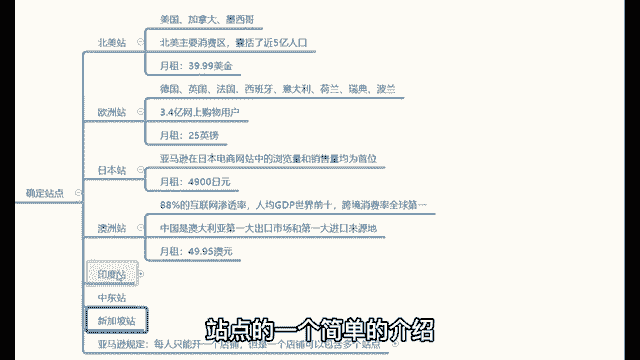
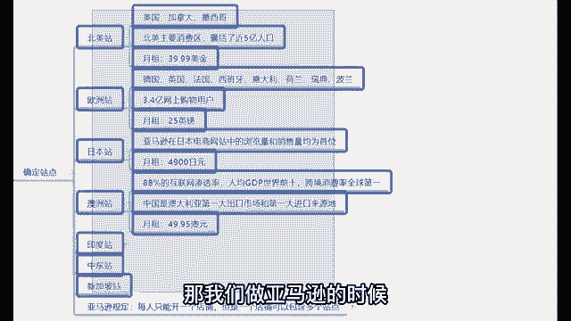
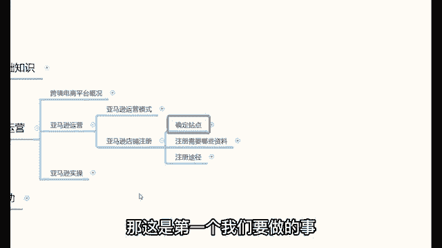

# 【2024年最新版】新手亚马逊跨境电商运营合集，亚马逊入门教程（纯干货，超详细） - P14：11、如何注册店铺：确定站点 - 亚马逊电商小孙 - BV1YvxPedEjR

那么讲完了这个运营模式之后，接下来我们要讲的是什么呢？就是接下来我们要分享的是哎在亚马逊呢如何去注册一个店铺啊，这个问题呢我相信很多同学从开始就想问的问题，说老师我怎么去注册一个店铺啊？😊。

那么在讲注册店铺的第一个环节，我先给大家去介绍一下亚马逊的几个站点。亚马逊有四大主流站点，也有一些小站点啊，我来简单去介绍一下啊，这几个站点。那么首先第一个站点呢是叫做北美站。😊，北美战包含了美国。

加拿大和墨西哥三个国家。北美是亚马逊的主要消费区，囊括了将近5个亿的人口，这是第一个站点。北美站。那么北美站的月租是多少钱？39。99美金。那么第二个站点是欧洲站。

欧洲站包含英国、德国、法国、西班牙、意大利、荷兰、瑞典、波兰这么8个国家。他拥有3。4个亿的网上购物用户。那么欧洲站的月租是25营镑。第三个站点是日本站。亚马逊在日本电商平台的地位就类似于国。

就是类似于淘宝，在我们国内电商平台的地位。就是也是相对比较高的。所以说日本也是一个小男孩。那么日本占的月租是4900日元。😊，第四个是澳洲站，也叫做澳大利亚站。澳大利亚站拥有88%的互联网渗透率。

人均G毙全世界前十，跨境消费率全球第一。😡，那么中国是澳大利亚的第一出口市场和第一进口来源地，澳洲站的月租是多少钱？49。95欧元，这是亚马逊的4个主流站点。那么像什么印度站，中东站和新加坡站。

这就属于一些小站点啊，这是关于亚马逊的几个站点的一个简单的介绍。那么首先那么站点简单了解完之后，那我们做亚马逊的时候，从哪个站点开始做的。😡。

第一个，亚马逊的规定是每个人只能开通一个店铺，但是你这一个店铺可以包含了多个站点。比如说你开通了一个样粉店铺之后，这个店铺可以同时的去激活北美、欧洲、日本和澳洲这四大站点都是没问题的。

就是你一个店铺里边可以包含了多个站理。😡，那么。我们先从哪个站点开始做呢？我们中间马线先从哪个站点开始做呢？首先我的建议先做北美站。😡，为什么我会建议你们先做北美站呢？你们还记不记得？我刚刚有讲过。

亚马逊是哪一个国家的项目，你们还记得吗？😡，亚马逊是哪个国家项目？我刚才有讲哈，记得可以打在公屏上。😊，亚马逊是哪一个国家的？创办的项目。😡，哎，这位同学都知好，美国的。近水楼台先得月，肥水不流外人田。

北美战是因为美是美国的项目，对吧？所以说北美战是亚马逊规则最健全，福利最多的一个战。😡，那么除此之外，他亚马逊还有一个全球开店计划。什么是亚马逊的全球开登计划啊？比如说你开通了一个北美战之后。😡。

你再去开通欧洲站、日本站和澳洲站的时候。😡，你开通了北美站，你再去开通欧洲站、日本站和澳洲站的时候，那么其他站点的月租可以全部免费。😡，听明白了吗？只要你开通了北美站，那么其他站点的月租。😡。

可以全部都免费。比如说你一个店铺里边同时开通了北美、欧洲、日本、澳洲这四个站点。😡，对吧然后你每个月只用付一份北美这的月租就可以了。这是亚马，这就是亚马逊的全球开店计划。所以说你们做亚马逊的时候。

我的建议啊是先开通一个北美的。😡，你了解了吗？对这是第一个我们要做的事儿是先确定站点。😡。

