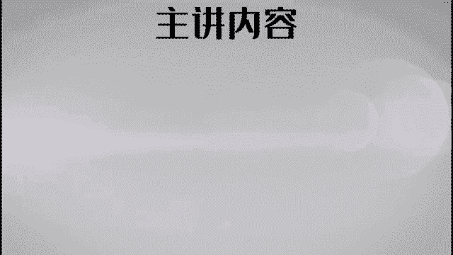
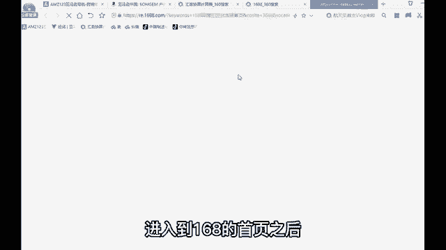
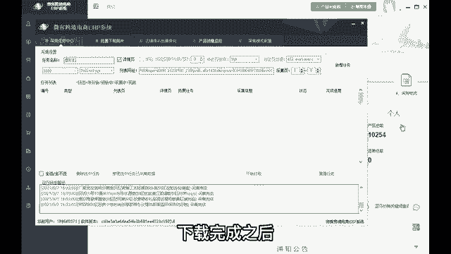
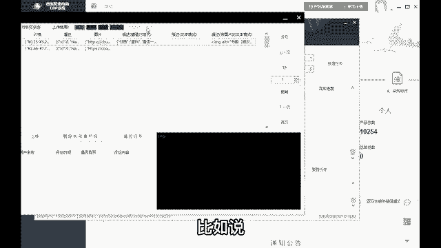
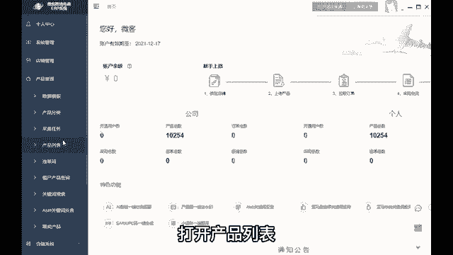
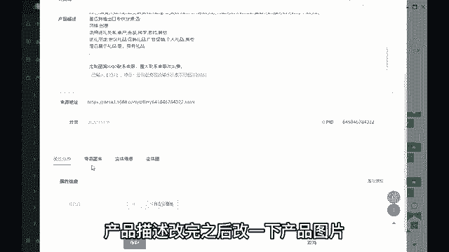
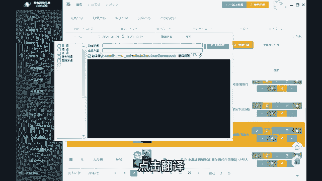
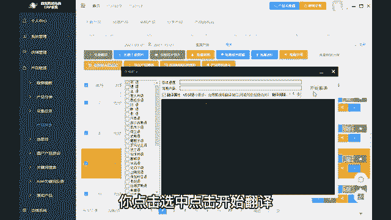
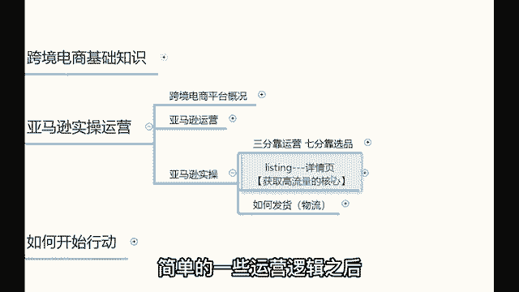

# 【2024年最新版】新手亚马逊跨境电商运营合集，亚马逊入门教程（纯干货，超详细） - P18：15、怎样获取流量 - 亚马逊电商小孙 - BV1YvxPedEjR

OK那么所以说选品这个事啊，选品选的好，出单出的早，选品是很重要的。今天教你们两种选品的方式。那么接下来我要告诉各位的是什么呢？接下来我要跟你们分享的是在亚马逊上如何才能够获得更多的流量。😊。

流量这个问题我相信也是非常多的伙伴比较关注的一个问题，对吧？在亚马逊如何才能够获得高的流量呢？那么首先你们要明白的是，亚马逊哈，有同学会说，老师我一个新店铺跟你老店铺能够去竞争吗？😊。

这个是怎么跟大家去分享呢？就是亚马逊没有所谓的这种很浓重的新老店铺的概念。😊，为什么呢？因为亚马逊这个平台是不展示产品销量的。😊，亚马逊是不展示产品销量的。😡。

所以说亚马逊的自动流量分配机制啊叫做A9算法。😡，这个A9算法是什么呢？就是一个机器人，就是就这块的内容啊，呃那些已经在做亚马逊做的时间比较久的同学也好，包括说你们现在是刚刚去了解这个项目的同学也好。

认真听这个A9算法，就这个东西很很重要很重要。有很多人做了亚马逊做了很长一段时间，这个东西解释的也是乱七八糟的乱七八糟的东西，就实际上这个东西我经量给你们讲的通俗易懂一点啊。

A9算法这个东西对于我们来讲很重要。它是我们获得流量的一个运营机制。就是亚马逊是通过这种A9算法给我们分配分配流量的。嗯，并且亚马逊也是所有电商平台里边，唯一一家拥有自己的独立算法的公司啊。

所以说这个东西很重要哈。😊，那么他还是怎么跟我们分配留院呢？是这么回事。😡，只要你上架了一款新产品，前45天都是有一个自动的流量推送的。😡，怎么个自动流量推送法呢？就是一个免费流量的加热期。

它是怎么加热的？是这个回事？举个例子，你在亚马上上架了一款烟灰缸，你在亚马逊会不会给你展示在首页？😡，你猜会不会，这肯定不会。你如我刚刚剩下一款新产品，它怎么对吧？它不可能给我们展示在首页的新品。

它不可能展示在首页的。那么在哪里展示我们上线的产品呢？是在这个位置。😡，在产品详情页中间这个地方在这儿你看一下，有一个根据您最近的购物趋势推荐的商品，还有浏览了此商品的顾客，也同时浏览这样的产品。😊。

那么这里展示的才是我们刚刚上架的新产品。新品的推荐位是在这个地方，那么它是怎么给我们进行流量的推荐呢？是这么回事啊。比如说你上架了一款烟灰缸，它会先推荐给一批人看，比如说他先推荐给100个。😊。

搜索烟灰缸的人。看到。你上架的烟灰缸。比如说他先推荐给100个人看，那么推荐给了这100个人看到之后，假如说这100个人里面有10个人被你这个烟灰缸的标题啊、图片啊之类的吸引到了。

点击进入到你的产品详情页里。这个时候呢你就获得了10个点击量，对吧？10个人点击进入。😡，产品OK那么在这10个人点击进来之后，假如说啊就10个人点击进入到你的产品详情页里边。

假如说有一个人点击了现在购买。😊，直接买了个烟灰缸。😡，这个时候呢你就获得了一个订单。对不对？那么你的产品转化率就是1%的转化率。就是100个人看到你这个产品，有一个人在你这买。

所以说你的转化率就是1%。😡，那么你的转化率越高，也就意味着说你的产品。😡，越吸引人。你的产品越吸引人的情况下啊，那么你的订单就会越多，对不对？你的订单越多，你赚的钱越多，你赚的钱越多。

亚马逊能够从你身上拿到的佣金也会越高。😡，咱现实一点就是这么回事，有明白了吗？就是只要你的产品足够的吸引人，你的订单越多，哎，你在亚马上赚的钱越多，平台能够达到的佣金也会越高。就是有的学说老师。

那我投广告费，不能把这个转化率投起来嘛？你投广告费，想要把投转化率投起来是不可能的。你还身为一名新手，你还很可能把你这个产品投废掉。😡，为什么我说广告费不能乱投呢？😡，首先如果说你的产品详情页很low。

对吧？你的转化率很低，你就是投入再多的广告费。有再多的客户进来之后。😡，他会买吗？他还是不会买啊，他该不买还是不买，对不对？😡，那么他该不买还不买。那当你的广告费用完了那天。😡，就是你断流的那一天。

因为你的转化力极其低。😡，然后你就断流了，这个产品就为你打玩废了。😡，有明白了吗？所以说在亚马逊上想要获得高的流量，那么我们一定要做的事是什么呢？就是优化自己的产品详情页。😡。

你你把你的产品详情页优化的越好，那么你的转化率就会越高。你的转化率越高，你的订单越多，你的流量就会越大。这就是亚马逊的A9算法。第一次给你们去讲，有些同学可能不能够完全去理解这个东西什么意思。

但是已经做过亚马逊的同学，我相信你们肯定会恍然大悟，应该明白是怎么回事了。如果说一次不能够完全去理解的。没关系，慢慢来，等你开通了店铺之后，在你真正的上架的产品之后。

你会更加的去理解我今天给你讲课的这个内容。😡，就是A9算法的意思就是。😡，你想要在你的亚马逊上获得高的流量，就要去不断的去优化自己的产品，把你的产品详情页打造好。你的产品详情页打造的越精美。

你的转化率就会越高啊。有同学说老师这个A9算法能不能再讲一次，我告诉你哈呃学习这个事，我我告诉你一个小小的窍门哈，有些东西你可能一次性的没有完全的听懂，但是你回去之后慢慢去回顾，慢慢去想，你会想明白的。

所这些东西你会想明白的。如果说你回去之后还没有想明白的情况下，到时候微信上跟我说，我微信上再给你解释，就给自己留一点时间，让子弹飞一会儿。你不要指望着说我把这个东西全部填压式的塞到你的脑袋里。

本来这个东西就很重要，并且他他理解起来就相对会比较难，就很多多亚马逊很长一段时间的时候，刚刚你讲，他对于这个东西掌握的都不是很清晰。对，只有说像我做亚马逊做的时间比较久了，才会更加清楚一些。

那么这个东西不是你一次性就能完全能理解的了。然后呃那么并且。😡，后续的话呢多去这个交流。那么这个事儿你就会越来越清楚了哈。所以说呃这个没关系的哈。呃后续的话如果说你自己再去回去再回顾一下啊。

没太明白的地方，你到时候微信上跟我说就行了。我再给你去解释啊，这就是亚马逊的一个自动流量推送机制。这个A9算法，它是自动帮我们获取流量的。那么这个点啊，不管你现在完全掌握了没有，还是完全理解了没有？

没关系。那么接下来我给大家去揭秘一下，怎么去让自己的产品详情页看起来更加的精美。哎，这个点啊，咱们接下来给大家去重点讲一下，首先你想要让自己的产品详情页变得更加的精美的情况下。

那么你要做的第一件事是干什么。😊，先打造产品的图片。讲到图片这个地方，就有同学会说老师。那么图片是不是要请请个人P个图啊？是不是要人把这个图片P的很漂亮？我要告诉你们的是，在亚马逊上。

首先对于图片的要求，必须是真实的产品展示。为什么是真实啊？来，你们可以看一下，不管是这张图片也好，还是剩余的这些这些产品的图片也好，你们看起来真实不真实。😡，就看起来这些图片是不是非常的真实？😡。

对不对？感觉真实的公平打个一仗看下有没有发现？😡，产品的图片是不是看起来很真实？😡，就是明显是就是。没有经过修饰P图的之类的图片。对不对？所以亚马逊的要求其实就是这样。

他务必要保证这个产品的图片的真实性。😡，就是买家秀跟卖家秀一定要相符的。客户看到你的图片长这个样子。拿到商品之后，如果说说跟这个图片相差很大，他会直接投诉你说你虚假宣传。

所以对于图片的要求一定要是真实的这是第一个。那么具体的要求都有哪些呢？这是一些具体的要求。😡，比如说第一张图片叫做主图，主图是不允许加任何的logo、水印和无相关的文字的。

那么第二张图片你就可以加文字啊，加描述之类的，你可以随便去加。但是第一张图片上必须是白色的背景，纯白色的，必须有任何的一些乱七八糟的信息的。😡，所以你在这块，你跟国内电商就不太一样。你像我们国内电商。

你像淘宝啊，咱们举个例子啊，打开淘宝。😡，啊，在淘宝上也搜索烟灰缸吗？你看你在淘宝上也搜索烟灰缸，你看整个淘宝的这个烟灰缸是不是搞得花里胡哨？😡，对吧整个就是真的啊你说的漂亮吧，也还好吧。

然后但是亚马逊呢你再看看是不是很简洁。😡，就在这个地方啊，对亚马逊的要求就是要简洁明了，比较真实。那么并且。😡，就是。必须是白色的背景。像素，如果是能够在1600乘以1600以上。

就会有一个细节放大图啊，这是关于图片的一些要求，没有说很复杂的。到时候后期的话，你们上传一两款产品之后就明白了，就这个东西就很简单啊，没有什么特别复杂的要求。所以说关于产品图片这一块啊。

在亚马线上不需要说。😡，特别的去呃花很多的心思。那么除了这个图片之外，还要去打造的是什么？就是产品的标题。这个产品的标题就跟你的名字一样，为什么那些明星出道之前都会改名字呢？

因为他想把自己的改名字改的更好听一点，对不对？各位，所以说这个标题啊也要好好去写。标题后续我可以教你们很多关于标题的写法和公式啊，这个东西也是很重要的。因为客户在这里只能看到你的标题和图片啊。

这些东西的话，你后期都要去学习，然后去打造的。那么除了这个标题和图片之外，还要去打造的是什么？就是这个产品的污点描述。你像这123455个黑点，这个叫做五点描述，就像产品的简易说明书一样。

把这个产品的特色卖点使用的材质适用的人群都写在这个地方，写的简单明了一点，不要写的太多哈，你要是有很多东西想写的，但是写不下的话，在这下面这有一个商品描述。😊，所以你在这里可以进行更加细致之微的补充。

但是在整个产品描这个5点描述这一块不要写太多的信息啊，这就是关于整个产品详细包含的几个核心关键点啊，那么就是四大要素哈，标题图片，五点描述和商品描述。那么具体这个东西该怎么去打造呢？身为一名新手。

我什么都不懂，你给我讲这个东西，我怎么去打造呢？那么如果我们身为一名新手刚开始进入到这个平台，一下子不能够打造好一个好的产品的话，我们可以记入一个系统，叫做ERP系统。😡，ERP。系统也叫做懒人神器。

为什么叫做懒人神器呢？我打开ERP总给大家看一下，你们就明白我的意思了。就对于你们新手来讲，这个系统简直是帮你们解决太多的问题了。我们打开这个ERP总给大家简单看一下。😡，这就是你们常用的第二个软件。

就刚刚第一个是选品软件，第二个就是这个ERP系统，就是我们公司研发这个系统花了将近100多万。那么研发这个系统有什么功能呢？给大家简单展示一下啊。😡，嗯。展示完之后，你就会发现哇。

原来打造的产品那么简单。比如说你第一步哈，你想要在卖某一款产品的时候，你要第一步的操作之前呢先来到1688里边选品的吧？先来到1688里边选择我们要卖的产品啊。进入到1688的首页之后。

比如说我想卖什么东西啊，举个例子啊，比如说我想要卖一个这个烟灰缸。😡。

啊，假如说我想卖烟灰缸，我在168里边搜索烟灰缸，搜索完之后，你看各式各样款式的烟灰缸。哎，假如说你感觉某一款不错哈，你比如说你感觉这款烟灰缸就看起来挺不错的。你想要去卖这款烟灰缸的时候，按道理来讲。

你要把这个烟灰缸的什么标题图片。就是标题图片，这些相关的信息，一个一个复制粘贴拷贝上交在自己的亚马逊店铺上，还要翻译成外语。😊，对，就很浪费时间，对不对？但是如果说有这个系统之后就不用了。

有这个系统之后，你看整一个产品详情页里边有几十上百款的年灰膏，对吧？几十上百款的年灰缸。那这个时候我们怎么去操作呢？你感觉这款也好看，那款也好看的，没关系，我们把这个网址复制下来。😡。

把这个网址复制下来之后，打开ERP系统，在这里粘贴上网址。😡，응 뭐。然后创建任务烟灰缸。然后点击新增任务。那么刚刚整一个产品详情页，这几十上百款的烟灰缸都会被。下载进入到这个系统里，我们点击选中。

点击开始抓取，它就会从网上直接进行下载哈。就是大家稍等一下，就很快就下载好了。就刚刚整一个产品详情里边，这几十上百款烟灰缸都会下载进来，我们让它下载一下，马上就好，稍等。😊，呃，开始下载了哈。

下载完之后给大家看一下都下载了哪些信息。😊，50%60。好，下载完成下载完成之后给大家看一下都有哪些信息被下载下来了啊。像这个烟灰缸的一些相关信息，比如说。😊。

刚刚你看到那个详情页里边那么多款烟灰缸的标题。😡，价格、属性、图片、描述、文本描述、图片描述都已经被下载接用到这个系统里。一共下载了多少个东西，一共下载了多少？一共下载了100款烟灰缸进来。

我们点击全选，点击上传。😡，那么这100款烟灰缸就会被全部上传进入到我们的这个系统。我们上传一下啊，就马上就好。所以说为什么有些同学就会讲说老师。😡，就是为什么我们做亚马线时间久了？

会讲说这个事其实难度非常小啊，就是为什么我刚刚会讲到一句话叫做有手就能干的原因，就是你说对吧？这些东西又不用你一个一个去编辑，用不用你一个个去写，对吧？你直接下载不就好了吗？呃。

我说这个有手就能我说错了吗？我感觉也没说错。😊，好嘅。马上下载好哈。😊，好，那么下载完成了，下载完成之后，把这个关掉，关掉之后哈，这里面有一个产品管理，打开产品管理，打开产品列表。

那么刚刚我们看到的这100款烟灰缸都已经被下载进入到这个系统里。下载进来之后啊，你在这个烟灰缸里边哈进行一个选择。你说我想要卖哪一款，你在这里边可以开始选了啊。比如说我找一找有没有我喜欢的往后翻翻页哈。

😊。

好，假如说我感觉这款烟灰缸不错啊，就假如说我感觉这款烟灰缸不错。那我点击编辑，我就开始编辑这个烟灰缸的相关信息，先把标题改一下标题按照我教你们的写法和公式去改，改完标题之后改产品描述。

主要的产品描述的相关信息啊，都已经被下载进入到这个系统里。比如说材质陶瓷的，然后这个这个主要的相关信息就在这里啊，你就在这里边修改就行了，会写作文吧，就不按作文的方式去写，但是不要写的太多啊。

就写的简单一点啊，然后把这个产品描述改一下，产品描述改完之后改一下产品图片。😊。

高清无水印的产品图片也已经被下载接用到这个系统里。看到没有？留下你需要的图片，删掉你不需要的图片。第一张图片是白色的底图就可以了。剩余的图片就不需要白色的底图了啊。那么这些相关信息里边留下你需要的。

删掉你不需要的。然后还有就是产品的遍体信息。比如说它有一些什么啊有猫耳朵的，还有什么狗狗的、招财猫的、酷狗的这个等等的一些，它有一些不同的款式，成本价格就是拿货价，销售价格是你的售价呃。

库存写个50100都可以。😡，在这里把这些相关信息改一下，就是几呃二三十分钟时间，一个产品就修改好了。😡，对吧你又不用一个一个复制粘贴，你在这个软件里边直接修改不就好了吗？修改好之后点击保存。

那么这款产品就OK了。保存完之后这在上传之前，你还要有有一步操作，就点击全选，点击翻译。你要是卖到美国就翻译成英语，卖到德国就翻译成德语，卖到法国就翻译成法语。😡。

所以你卖到哪一个国家就翻译成哪个家文字，你点击选中，点击开始翻译，它就会自动翻译。就这个系统会帮助我们自动的把这些中文翻译成外语。就这样的情况下，你像。😡。

是不是帮你省了很大的功夫啊？对于你们新手来讲，对这个东西可不可以称之为懒人神器啊，可以吧？对，这就叫做ERP系统的一个功效哈。所以说我们新手的话想要做好亚马逊的话，可以有这样的一个系统啊。

就花个几千块钱买一个啊，这样的话，你给你节省出来的这笔给你节省的时间，后续能帮你赚的钱，就不是这几千块钱能打得住的啊，就是关于这个ERP统的一个简单的介绍啊。后续你们可以拥有一个这样的一个系统。

叫做ERP系统。😊，OK那么在有了这个系统之后，你会现做亚马逊，其实也没有说很复杂，对吧？其实只要你搞懂了他的一些简单的一些运营逻辑之后，你自己也可以开通一个店铺去进行一个运运营。😊。

