# 【2024年最新版】新手亚马逊跨境电商运营合集，亚马逊入门教程（纯干货，超详细） - P24：22.宏观环境分析 - 亚马逊电商小孙 - BV1YvxPedEjR

那么除了aned review的分析之外呢，我们还可以从哪里获得信息呢？我们来看一下。我们可以看到。在这个review的数量之后呢，有一个answered questions。

有1000家的asked questions，这个是因为安克智这款产品卖了相当长的一个时间。那么他这里的整个answ questions，我们可以去点开来看。在这里边我们同样可以发现到。

这些问题呢多数都是有客户提出来的。那么我们同样可以从客户的提问中发现到一些客户对这个产品的关切点在哪里？这一点我们需要去注意一下，在我们选品中也可以充分的利用起来。

这是我们在分析对一个产品的把握方面做到的这些功夫，需要做到的这些这个用功的地方。

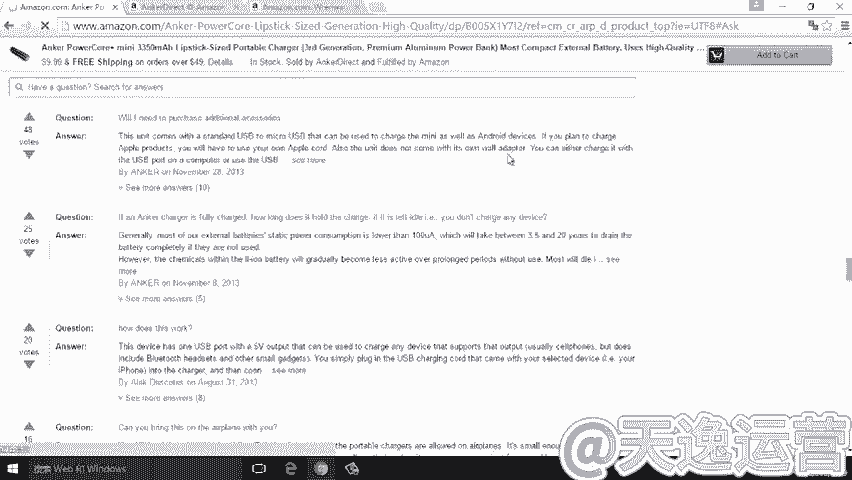

当然，如果说从listing优化，还会包含很多的关于产品的标题等等一些内容了。这个呢不是我们今天要讲解的内容，我们会放在随后的课程中去做一个简单的讲解。

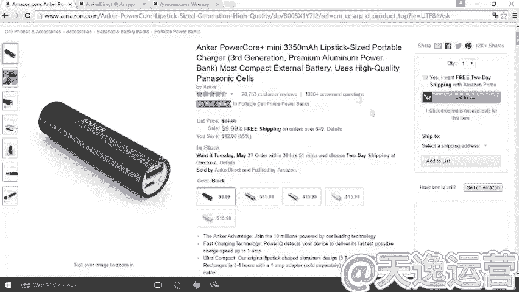

那么在看完 anchor个之后呢，我们重新来看另外一个产品，K chain timer。那么。我一进在利用Kching他们这个关键词搜索到了这样一个卖家。

这个卖家呢是在亚马逊上关于这一类的产品卖的比较好的一个卖家。那么我们去做一个对比来看，当我们点开。这个卖家的这个页面之后，这个卖家的产品页面之后呢。就像我在课程前面讲到的，我们既要看。

产品本身又要看一下卖家的规模究竟是怎么样的。我们点开看一下。那么嗯。我们可以明显的感觉到什么呢？感觉到这个产品的这个卖家的首页和刚才我们看到的安克的产品页面是有明显的区别的。也就是说，对于我们来说。

这个是一个中小卖家，同样我们可以看到它只有8条产品在售，那么这个是一个中小卖家。那么对于我们来说，如果说安克作为一个白金卖家，或者说我们知道的他作为亚马逊。

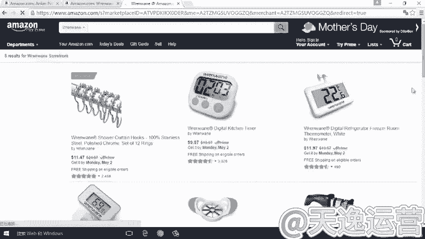

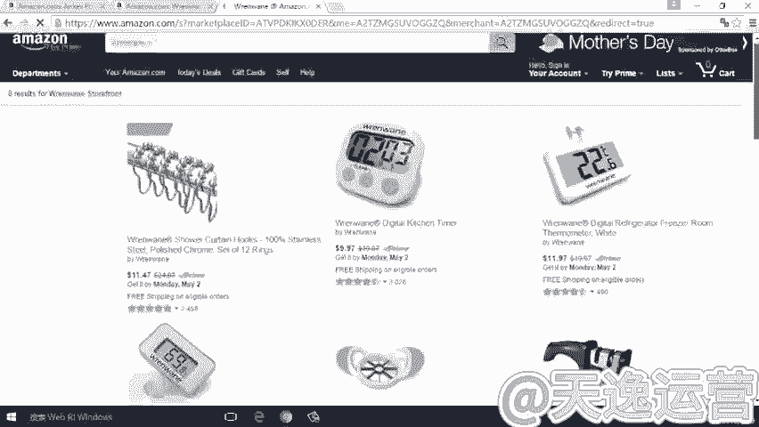

中国卖家中的第一名，那么我们可参考的意义比较小的话，那么相对来说这个卖家对我们的参考意义可能就大一些。那我们可以详细的去看这个卖家在产品的打造的过程中做了哪一些功夫。

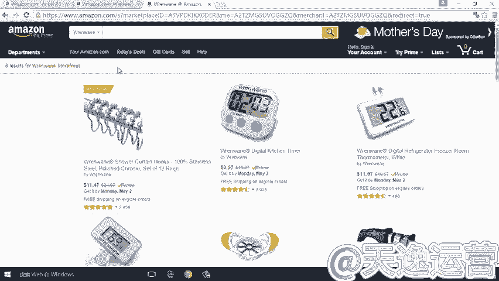

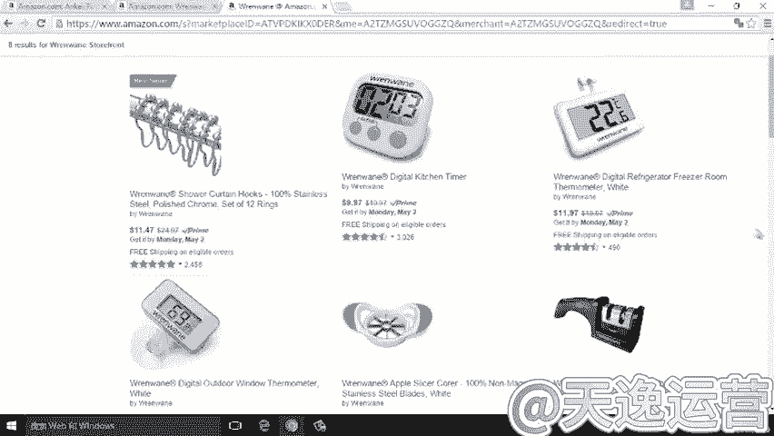

我们再回到产品的页面。同样的情况呢，我们可以看到。它这条产品本身在。这条产品本身的review呢达到4。4星。一般情况下，我们选择一款产品的时候呢，如果一个好评率低于百分低于这个四星。

那么基本上来说这个产品的问题就非常多了。或者说这个卖家的问题就非常多了。那么这样一个产品这4。4星，基本上还是一个比较优良的买这个评价。同样的情况，我们可以去点开它的整个搜索结果来看。

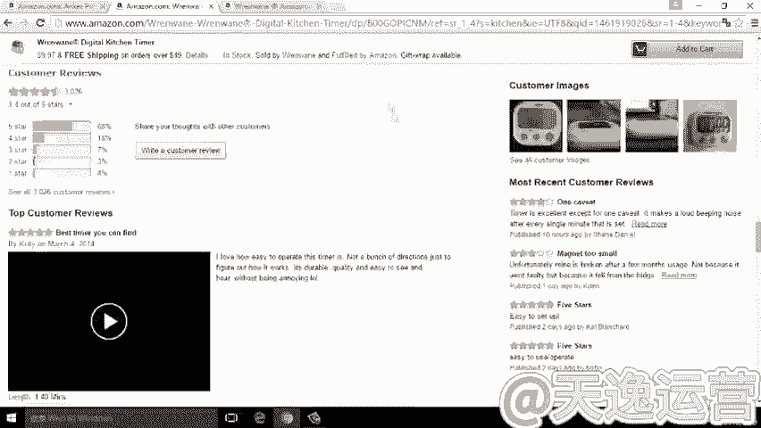

那么这里边也能够看到它的整个review。整个review呢。

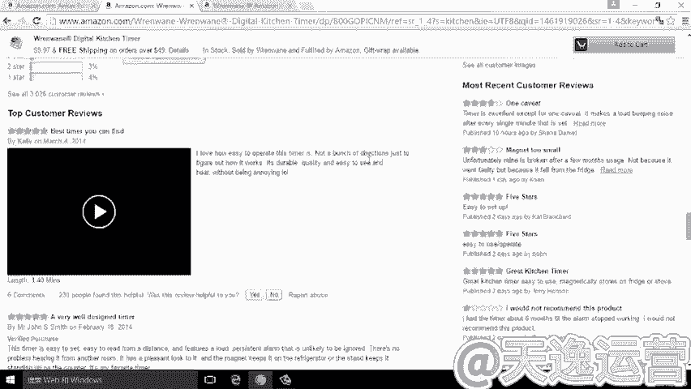

刚才我已经讲到，我们可以通过五颗星、四颗星一直到一颗星、两颗星去对产品的优劣点一个把握。那么同时呢我们可以按照这个实践。

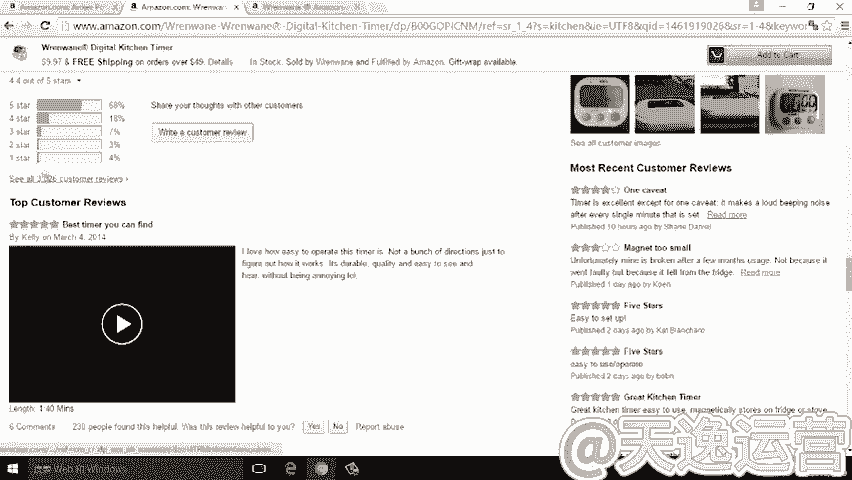

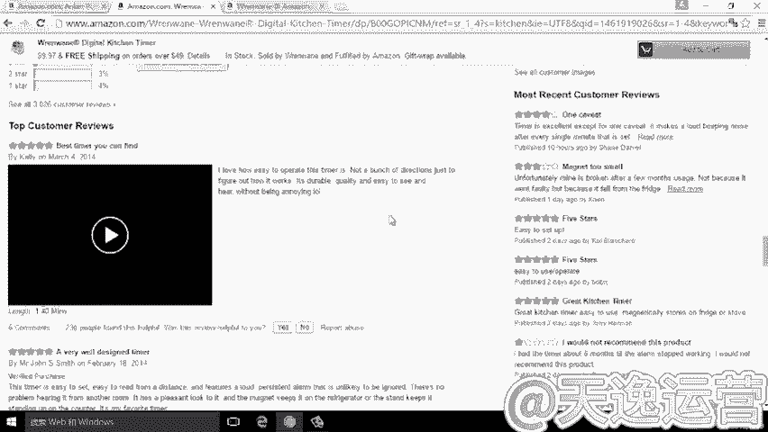

review的时间排序，对这个产品最近的销量做一个把握。那么除了这之外呢。

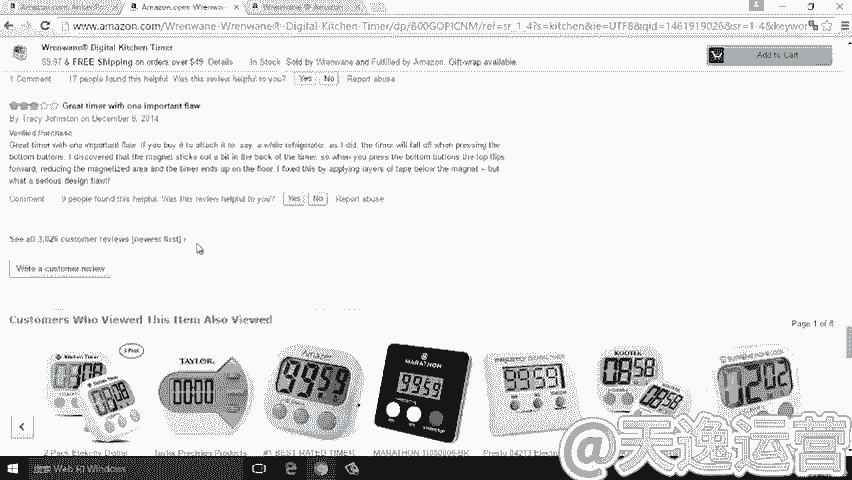

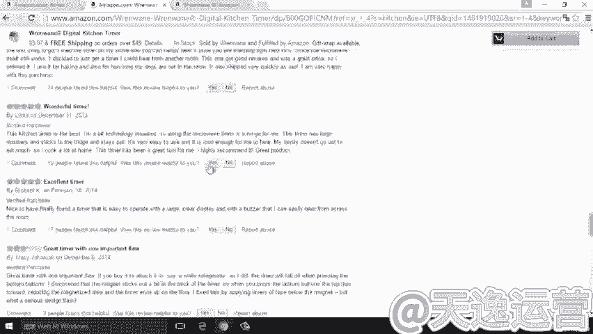

我们来看一下。像比较上边的这两条。这两条review我们最明显的区别是第一条review没有that purchase这样一个标识，这说明什么呢？

就说明这条review是经过M这个卖家找到一些测评的写手，然后对他的产品做了一个测评。但这有个视频，我们在这里就不去详细去看了。如果感兴趣的呢，你也可以去关注一下你竞论对手的产品里面的视频。

那我们会发现一个什么问题呢？为什么这个产品的。这个review的发布日期是2014年的3月4号，而接着下面的时间往往是比较杂乱的对吧？那么这这个是什么原因造成的呢？

这也是我们在review的过程中需要去考量的一点，需要注意看一下，这里。首先。这里有一句话，这个review对你是否有帮助，对吧？如果我们觉得这个review对我们有帮助。

那我们去点yes ok这里的同样可以看到230个人，觉得这个review对它有帮助。我们接着往下看。第二条就只有61个人。第三条559个人，以及往项越来越少。

所以说从这个地方我们可以看到review对我们有帮助的是按照一个什么呢？按照一个这个review的排序，是按照一个。更多的人的点击，然后产生的这样一种结果。所以说这同这个在我们查看review的过程中。

也给我们一个启发。就是说如果我们自己在打造listing的过程中，想让一条listing跑到前边去，我们同样可以自己或者说调动一些朋友帮我们在这里干什么呢？

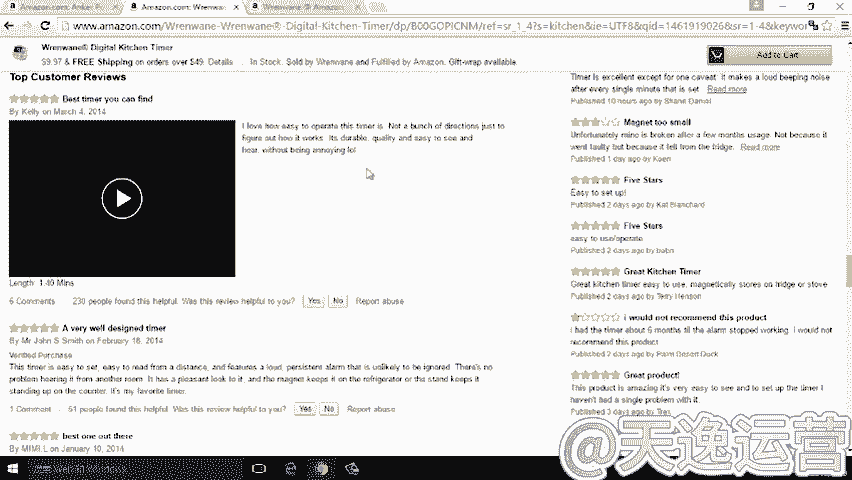

帮我们在这里点一个yes，对吧？这是关于这一块。当然了，我们接着回到店铺里边来看。那么对于一个普通的买家，他的店铺里边仅仅有几条产品，然后有非常好的销量。这就告诉我们另外一个启示性的一这个呃。

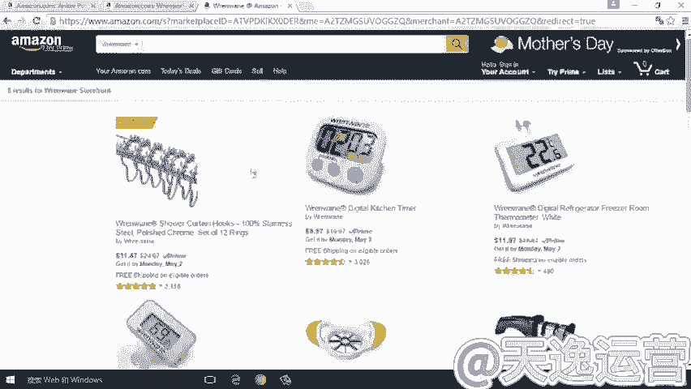

意义就是说，对于我们很多卖家所关心的我的选品要选多少多少。这个在亚马逊上绝对不是以铺货的方式能够取得成功的，而往往是以单品之胜的方式能够取得成功的。所以说在亚马逊整个运营中，我们不需要上很多的产品。

我们只需要做到什么呢？精心的去选择几款适合自己销售的这些产品，然后全力以赴的去打造。通过这样的方式，我们就一定能够取得成功。

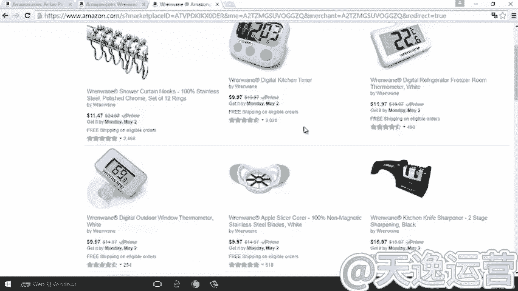

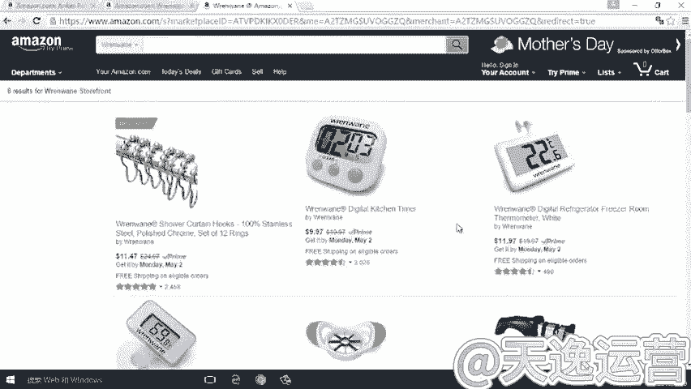

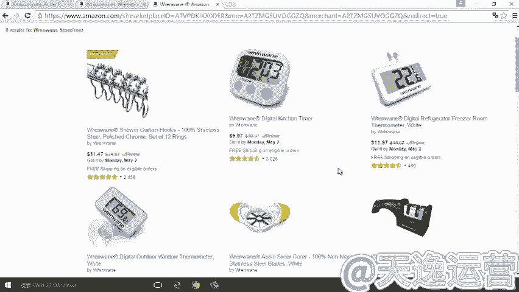

这是关于我们分析这个竞品listing做的一个简要的分析，希望能够给大家一些启发的意义。那么在我们分析完竞争对手之后呢。

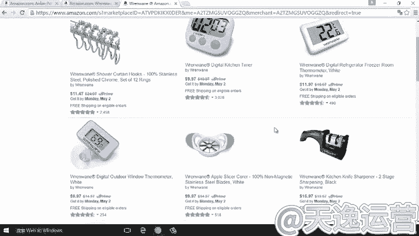

我们来看一下我们还需要做一个什么样的工作呢？就是说我们需要去分析。宏观的一个环境。只有在对宏观的环境的一个把握之后，我们才能够对这个产品的整体的前景有一个更明朗的一个理解。或者说一个评估。

那么具体来说包括哪些呢？首先我们去做一个市场调研，宏观环宏观环境方面分析，最直接的就是要求我们去做一个很好的市场调研的适合市场评估。我们去评估这个产品的市场容量。这在我前边已经讲过，再一个。

我们还需要做到的是对仓储物流方面的一个评估。那么有一些产品可能并不适合某些卖家的销售。那么只有在。为什么不适合呢？就是说比如说你的资金量有限，然后。想做一些相对来说短平快的这样的产品。

那么就要求你必须去发空运这个发快递。然后快速的进行一个资金的周转。在这种情况下，相对来说大件的一些产品可能就。并不适合你做一个选品的方向。那么这是。还有一些，比如说我们这个发货方式方面怎么去考虑呢？

那么发货方式方面就是说我们要考量一下我们的产品是否能够去做。IB物流。那么我们知道马逊的整个运营中。亚马逊的IB物流呢对我们来说是非常需要去做的一块儿，这一经是亚马逊在整个卖家中一个非常重要的内容。

那么如果你选择某一类的产品。比如。孔明灯之类的这些产品。你虽然可能看到它的市场容量很好，它的销量很好。然后利润空间也还不错。但是当你选择发FBA的时候，你会发现因为它是属于易燃物品。那么易燃物品的话。

直接被FBA排除在外。如果在这种情况下。你在公司，你在这个亚马逊的运营中，整个核心的是要去运营IB发货的话，那么孔明灯可能就会被排除在你的选品之外了。当然我们在宏观分析的过程中呢，我们还要考虑一点。

就是说。对趋势的一个分析。趋势的分析包括哪一些呢？首先包括这个季节性的产品。那么有一些产品它的季节性非常明显。比如说你想卖圣诞季的一些产品，圣诞树，那么圣诞树它的整个销售周期就是那么短。

在一年12月份才是一个销售的季节，其他的季节几乎没有任何的销量，那么这里的产品你就需要去考量。你是否能把握得了，是否能把握得住。另一方面呢？还包括一些，比如说你想买卖雪橇。

卖雪橇这个滑雪滑雪用的一些产品。那么这时候就要求你去考虑。那么夏季的时候，是不是你将面临的是一个淡季的情况？你想卖一些呃。节假日。有针对性的一些节假日的产品。比如说万圣节，万圣节的时候面具卖的很好。

但是它只是进金率局限于万圣节一个前期的一个很短的周期。这些季节性太明显的产品是否适合你的选品方向，这是我需要去考量的一点。当然还有一点就是说我们要考量趋势方分析方面，我们要考量的是产品本身的生命周期。

那么我们。只有对产品本身生命周期有一个明确的理解。然后我们才知道这类产品是否是当你选择的时候，是否是处于一种上升的趋势，这是非常关键的一点。比如来说你卖手机壳，你现在卖iphone6的手机壳。

可能你刚刚打造出一点成绩。那么iphone7的手机壳，iphone7的手机出来了。那么这时候可能就意味着iphone6进入了一个相对没落的这样一个环节。那么在这种情况下。

肯定也就意味着它的市场越来越萎缩。在这种情况下，你是否能够满足你一个较长期的运营的一个需求。当然。我们在整个分析的过程中，还要包括什么呢？包括我们的供应链资源的一个分析。在我刚才讲到的课程中。

我也提到一点，就是说你不能选择。别人在原产地拿货。而你在一个二级的批发市场拿货。然后。你还觉得自己具有很明确的很明显的优势。那么这种情况往往是我们并没有什么特别突出的优势。

这就要求我们去对供应链资源的一个整体的评估，这就包括什么呢？供应链资源既要包括我们自自身是否具有这种方面的优势。同时还要评估我们在掌握这种供应链资源的情况下，我们是否具有更有利的竞争的优势。

那么当我们在二级批发市场去拿一个货的时候，很明显我们的价格优势是是这个不太可能有价格优势的。那么除了价格优势之外，还有一些什么呢？就是。我们再进行一些个性化的定制，或者说我们叫做这个生机。

或者说修正的情况下，我们在二级市场的一个呃批发市场，那么可能对于我们这方面就达不到。因为我们所面对的供应商进军是能够做一个什么动作呢？左手转右手这样一种动作。

那么这样的动作对于我们选择这类的产品很定肯定是具有不少的这个制约性的，所以说这就要求我们对整个供应链资源做一个评估。当然，那么供应链资源的评估，是不是很难呢？这个倒也不难。

我们可以在自己在实际的选品的过程中，实际的选品的经验中慢。