# 【2024年最新版】新手亚马逊跨境电商运营合集，亚马逊入门教程（纯干货，超详细） - P8：05、跨境电商平台概括 - 亚马逊电商小孙 - BV1YvxPedEjR

。

介入完这些之后，接下来我们开始讲亚马逊的运营和实操。首先你们要明白的是啊，跨境电商平台啊，它是比较多样化的。像我们比较熟悉的这样的平台啊，比如说像什么亚马逊、苏卖通伊贝卫士虾皮拉萨达。

这些都是跨境电商平台。当然你记不了这么多啊，你就记住一个这个叫做亚马逊，也是我们今天的重头戏。亚马逊这个平台是全球最大的电商平台，他在1995年就成立在美国的西雅图。

我相信啊他的成立时间可能比我们听课的某一些同学啊，一部分同学的年龄都要大啊，也正常。您95年今年也26256了对吧？可能比这个年龄都大，那么在1995年创立于美国西雅图。

它的老板呢是全世界的现阶段的世界首富，2018年开始啊，就是这个杰夫贝佐斯就是亚马逊的创始人就开始蝉联世界首富的宝卫了宝座了啊。你们可以在网上查一下，有一个榜单叫做福布斯。😊。

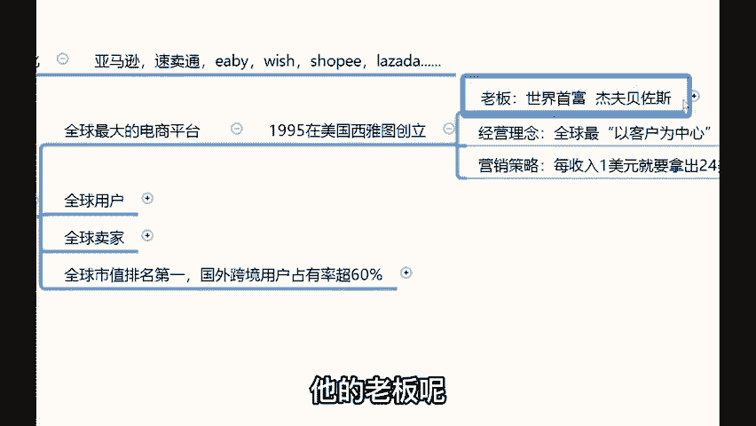

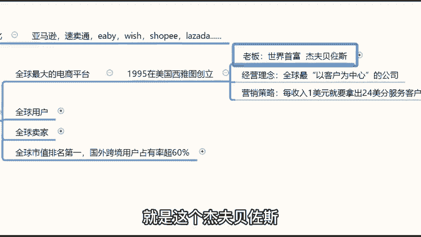

排行榜。哎，就是全就是全球富豪排行榜，排名第一的人是谁呢？就是亚马逊的创始人杰夫贝佐斯OK贝佐斯的经营理念呢就是要把亚马逊打造成为全球最以客户为中心的公司。营销策略就是这个平台每收入1块钱。

就会拿出其中的24美分去服务客户。😊。

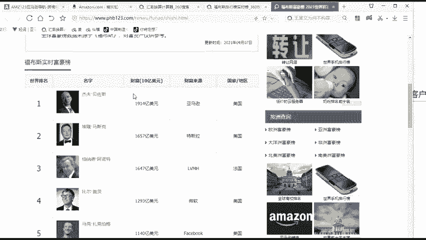

对吧那么这是亚马逊的一个这个简单的平台，它的一个介绍啊。呃，同时的话呢亚马逊做那么大，它的一个全球用户主要集中在哪些人身上呢？就亚马逊的一个主要客户群体啊，集中在欧美的发达国家为主。来。

你们可以看一看啊，这个点，什么来大家可以看一下。

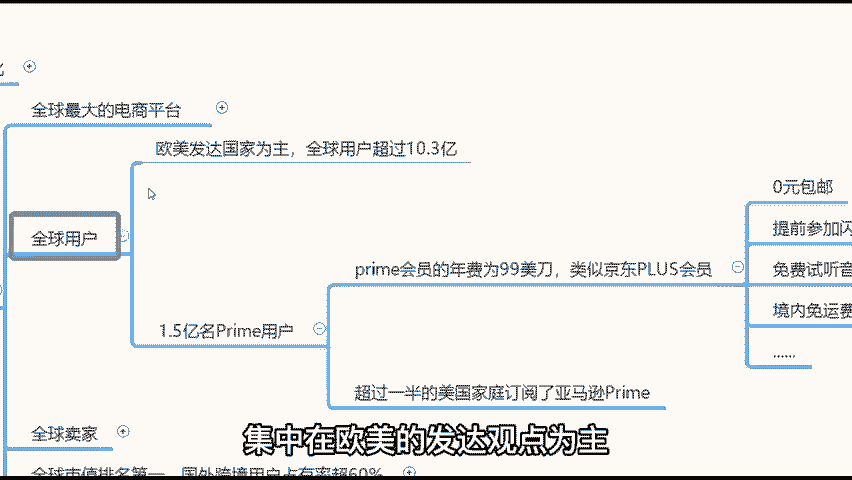

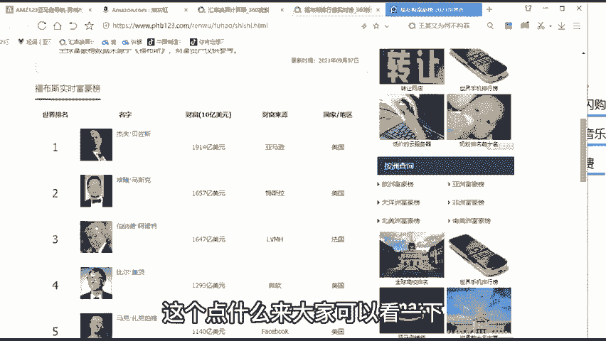

亚马逊的主流站点定位，刚刚我给你们介绍过了啊，像美国、英国、日本、德国、法国、意大利、西班牙、加拿大、墨西哥，你们眼前看到的这些所有的站点是不是都是欧美的发达国家啊，对不对？

这这就是亚马逊的主流客户群体定位，欧美的发达国家为主，全球用户规模超过10。3个亿。并且在这10。3个亿啊，记得这个数值啊，全球用户超过10。3个亿，一会儿你会用到的哈。😊，10。3个亿的用户当中有1。

5个亿的用户，是他的一个prom会员，就是prome会员的意思就是说。😡，每年要给亚马逊交99美刀的年费哈，交了这个会员费之后就可以参加一些会员活动。有多少人买了这个会员呢？

有一半的美国人都买了亚马逊的这个会员。我想要告诉你们的是，通过这样的一个数据，你就可以了解到一半以上的美国加美国人都在用这个亚马逊的会员哈，还买了一个会员是他的一个忠实粉丝。对。

这就是亚马逊的主流客户群体定位，也就是我们的一个主要的客户是面向什么人，你要清楚，对吧？你要明白的是你的客户群体是什么样的人，那么欧美的发达的一个显著特征就是收入高，消费高。那么同样的道理。

我们的利润也会大啊，这就是亚马逊的一个全球用户定位，O那么亚马逊的全球卖家呢。😊，亚马逊的全球卖家的店铺店铺注册数量有1000万啊，现在最新的数值已经突破了1000万，但是活跃店铺400多万。

那么很多人把店铺注册下来之后啊，不知道卖什么产品啊，有不知道平台的规则也不懂。那么嗯也没有什么这个选品经验啊，身边人懂得又少，没有人么相互交流。所以说活跃店铺知识只有这400多万。

OK那么讲到这里就会有同学说了，老师哇，这个1000万的用户啊，1000万的卖家啊，对我跟1000万在同台竞技啊，我跟那1000万人在竞争啊。在这里啊，就有同学会说老师亚马逊现在还能做吗？对吧？

1000万的竞争对手，这个有点太太恐怖了，我想要跟你们做个对比，对比完之后，你就没有对比就没有伤害啊，你就明白这个事儿到底能不能做了，OK。😊，咱们以国内外电商平台做个对比，好吧。

我们国内电商平台你们都了解的哈，像淘宝、京东和拼多多，咱们就以这三个平台。😊，淘宝的卖家数量现在已经突破了2300万。就是淘系卖家已经突破了2300万。那么京东的卖家已经突破了800万。

而拼多多卖家也是刚刚突破了1000万OK。😊，自己可以看一下中国一共才多少人。😡，你刨去老人小孩，能够就是你刨去老人小孩，经常会在网上购物的人了不起了，也就七八个亿吧，八九个亿，对吧？

而国内电商的用户就是卖家的总数量加在一起大概多少？4100万。😡，对不对？七八个亿的用户4100万的一个卖家。那你就明白为什么淘宝现在竞争压力那么大，就是国内电商竞争压力为什么那么大。

我还没有算上抖音呢，就我还没有算上抖音的一个卖家呢？你明白了吗？那么而亚马逊同样的对比哈，就你我告诉你们，为什么会有这种非常奇葩的情况出现。为什么国内竞争压力那么大，而跨境电商。

它现阶段就显得哎这个那么平，就是竞争压力会相对比较小。为什么我们说跨境蓝海，跨境蓝海呢，你明白就是跨境电商，我告诉你，就单单跨境这两个字就下退了无数人。😡。

就是就如果说哈你们不是接下来要跟着我学习这两个小时，你听跨经商，你也会犯怵。😡，对不对？因为跨境跨境要跨境啊，是吧？一进跨境，你跟外国人打交道，你就很就很容易就犯怵了，对不对？明白了吗？

所以说很多人对于跨境的认知啊，他不全面的时候就很害怕。他感觉跨境那商是不是很很了不起的一个事儿啊，就我告诉你啊，跨境电商，哎，你把跨境两个字去掉。😡，他也就是个电商而已，他有什么了不起的，真没有。

我不感觉跨境电商有什么了不得的地方。对他跟我，我因为我之前做过淘宝哈，我感觉我做亚马逊，跟我做做做跨做我我感觉我当时做淘宝，跟我现在做亚马逊啊，没有说很大的一个差距啊。

所以说呃你们先要放下的就是自己的这样的一个这个什么恐惧心理啊，就这个东西的话，你一定要清晰的认知。对，就在这个世上能够做出来成绩的人都是那些敢于战胜恐惧的人。你只要把跨境两个事忘掉啊，那你就会发现哇。

原来这个市场那么大。😡，对吧原来我可以做的空间还有那么那么的多，对不对？跟着国内电商去对比的话，那我现在简直处于天堂，对不对？所以说这就是亚马逊的一个全球卖家的用户情况。那这就是为什么现在会国家提倡哎。

我们鼓励做跨茎商的原因，就在这个地方OK。😡，同时我们接着往下讲，那么亚马逊也是全球市值排行第一的公司，国外跨境电商用户占有率超过60%。为什么有那么多的用户都在用亚马逊啊，对吧？

那么首先第一个点你要明白的是它的生态体系很好。为什么说生态体系好呢？就是这个平台跟卖家之间是属于一个共生的关系。呃，怎么讲呢？给大家去简单的去了解一下啊，就是如果说你们了解过，或者说做过国内电商的同学。

你们都明白的，就是国内电商这些平台都是要交押金保证金的。我举个例子啊，比如说像淘系卖家，像淘宝啊、拼多多啊之类的，一般它的押金保证就两三千三五千啊，或者说就大几万做到天猫店就是好几万啊。

那么一般像京东啊这种店铺的话，基本就是5万到8万。😊，我说的是什么？我说的是还只是押金和保证金。😡，对，国内电商都是要交这个押金和保证金的，但是亚马逊不需要。😡，在于这个点上。

亚马逊的政策是零押金、零保证金，一毛钱的押金和保证金都不需要交。你明白了吗？他只用交一个月租和佣金，月租的话呢就是39。99美金等于人民币大概在260到270万钱之间，佣金是8%到15%的佣金。

不同类目的佣金不一样。在这里有同学会说，老师，这个佣金这块的话。😡，你要你不用担心佣金，因为你要明白产品的定价权，就是你卖多少钱，是你说了算。😡，你在给这个产品在定价格的时候，你会定你会根据什么定价？

首先你会拿出来你这个产品的一个进货成本，对吧？😡，你的成本。然后如除了这个成本之外啊，还有什么呢？如果说你这个再加上你的佣金啊。😡，如果你包邮，还有运费。😡，通过你把这些东西都计算完之后，你才定的价。

正常情况下，像我们做亚马逊的利润空间啊。😡，一般在20%到30%就可以了。就是我们能够拿到20%到30%的纯盈利，剩余的钱你不可能让自己拆完的。那为什么说共生的关系的话，你会发现啊，你赚你的利润。

平台赚平台的佣金。😡，对不对？所以说这就是卖家跟平台之间共生关系的好处，就在这个地方，它是在一条线上的。我们的利润越高的时候，平台的佣金才会越大。这样的情况下才能够啊对吧？更加的照顾我们卖家啊。

这是亚马逊的一个。😡，呃，生态体系好的一个点。同时。呃，给大家开个玩笑，就是在我们行内啊，还有一个什么小玩笑，跟大家去聊一下。你就是我们都在聊啊，说那个淘宝啊、京东，你知道为什么要收押金保证金吗？

就是开玩笑说的啊，就是当个笑话听啊，就我们当时都在聊说。😊，因为现在国内电商竞争压力比较大哈，你投入的钱都要打水漂了，对吧？你现在国内电商投入的钱基本上都在打水漂。

押金保证金的话是你最后一最后一块这个啊遮羞布哈。就是说你这个哪怕你将来这个呃就是所有的钱都赔掉了，你还可以把你的押金和保证金从这个电商平台里面撤出来啊，就是就是所以说通过这样的一个笑话。

你们也可以了解得到啊。现在国内电商竞争压力确实大啊。因为我之前也是做淘宝的啊，对于这个我还是有感情的。😊，怎么讲呢？确实实际情况我们要不能忽略啊，但是亚马逊的话呢，现阶段对于我们而言哈。😊。

就它是很好的一个入场的机会。为什么你这样讲哈，那么接下来我再给你们分享一下亚马逊的商业模式，你就会更清楚了啊那我们接着往下讲吧，接着往下讲你就更清楚了。😊，那么亚马逊也是全球商品品种最多的网上零营售商。

为什么要这儿这个它为什么会有这样的规则呢？就是亚马逊的商业模式，就是它可以无限的上升产品，并且这些产品没有什么类目限制。这个我告诉你们，就是这个典型是为了讨好我们新卖家。😡。

为什么这个哦亚马逊会讨好新卖家呢？你们要明白的一个事儿啊。😡，假如说客户进入到一个平台里边。呃，搜索自己想要买的产品，搜不到，没有卖家在卖，你感觉这个客户会不会走，他一定会平台就留不住这个客户，对不对？

所以说平台想要发展壮大啊，两个核心关键点，一个是卖家，一个是买家，要有足够多的卖家入驻，也要有足够多的买家在用，对吧？那但是呢卖家这个是一定是走在前面。

所以说那么现阶段亚马逊在不停的希望有更多的卖家进来。因为卖家多了之后，他才能够承载更多的用户呀，他才承长更多的这个客户啊，所以说他的商业模式是比较偏向我们卖家新手卖家的，因为都是从新手到老手的一个过程。

那你刚过来一棒子把你打死呢，你扭头你就走，谁还在做生意啊，对吧？那么首先他要让我们新卖家尝到甜头，怎么尝甜头呢？亚马逊的商业模式。第一个可以无限的上产产品。那什么叫做无限的上产产品呢？

就是一个店铺里面你可以上传很多很多件产品。😡。

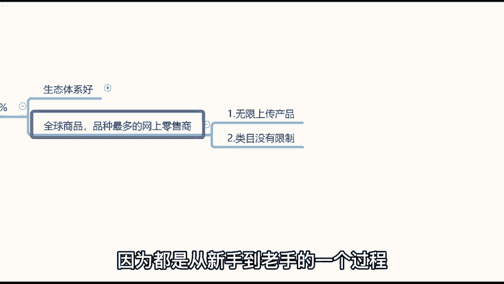

这个好处在于哪里啊？就是有同学说老师，我刚刚开通店铺的时候，最困难，最害怕的事就是选品。我不知道哪些产品好卖。😡，亚马逊告诉你，没关系啊，小兄弟，哎，来我这里就好了，你不用担心什么选品的问题，对吧？

你随便上你我给你个店铺，你随便我给你这个开通好了这个店铺之后，你里边上个呃80%，就是几几百上千款产品没关系，我不在乎，没关系的。😊，亚马逊不在乎这个事儿，它是允许我们一个店铺上传很多的产品。

这是第一个。第二个这些内目没有限制。比如说你一个店铺里边卖一些日用品，再卖一些化妆品，没有关系。亚马逊也不做限制。这是亚马逊的商业模式啊，就是重产品，轻店铺的商业模式。😡。

在这里的话呢呃我打打就是咱们做个对比，你就会更清楚了。咱们以国内面商啊，像淘宝来举个例子，好吧。打开淘宝。呃，我们以淘宝来举个例子，点击淘宝进入到淘宝的一个官网。咱们在淘淘宝里边，假如说要买一款产品。

咱们做个对比，你就会清楚我刚刚说的这个话什么意思吧。比如说你在淘宝里面想要买一个买一条休闲裤啊，你在淘宝里边搜索休闲裤。然后你看到了很多很多款休闲裤啊，就男士的、女士的都有。

OK那么在看到这些休闲裤的同时，你还可以看到各种各样的店旗舰店。你看。这个纳斯鲁旗舰店还有什么五本秀才的牛仔裤，还有什么啊唉什么什么旗舰店线上商城、花花公子、奥特奥莱斯折扣店啊，就各种各样的吧。

就你会发现在我们国内电商品台都是有这种店铺的概念。😡，🎼它整个的店铺装修是非常漂亮，但是在亚马逊上没有。你比如说你在亚马逊上想买个烟灰缸，你能看到这个烟灰缸是哪个店铺在卖的吗？😡。

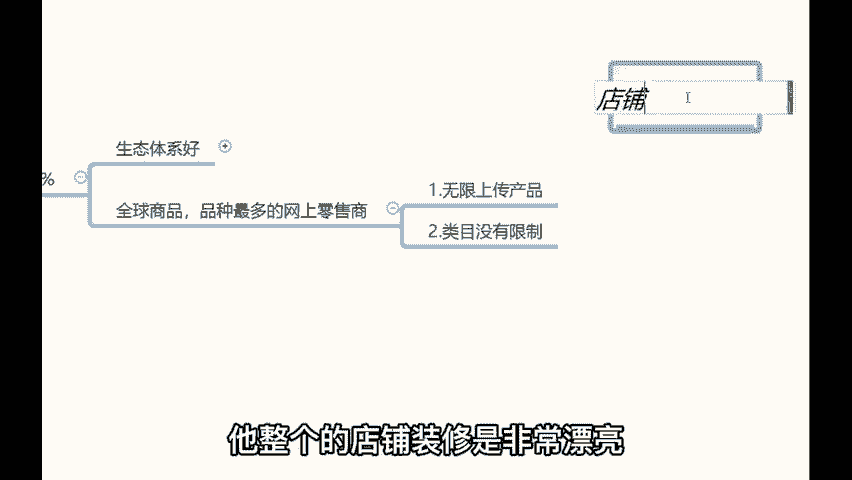

你看不到。首先在整个的一个这个产品的一个。这个首页这栏点你就看不到是哪一个店店铺在卖的这个烟灰缸。他不会展示给你的，你看你能看到吗？你绝对看不到，就是他对它只有产品，它只产生产品。

他不会给你展示这个产产品是哪一个店铺在卖的。就你哪怕哈你说我找这个卖家。😡。

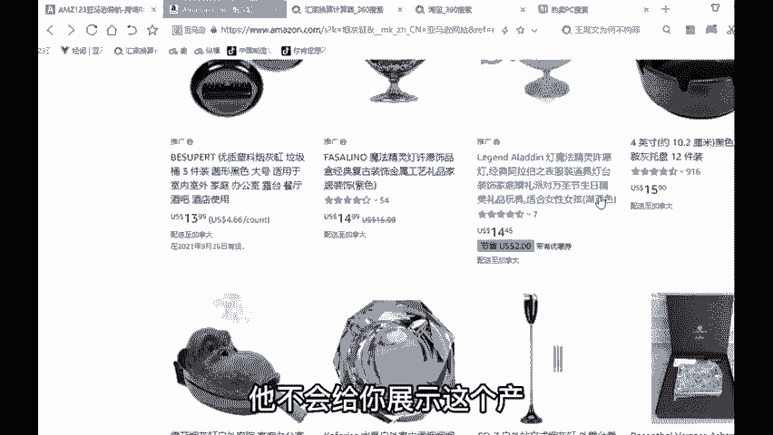

我能不能找到一个卖家呢？OK你说我点击产品详情页，我找这个卖家能不能找得到呢？可以的，在右下角这个位置可以找到卖家。😡，找到卖家之后，你点击这个卖家，点击这个卖家之后呢，也只只能进入到一个卖家档案。😡。

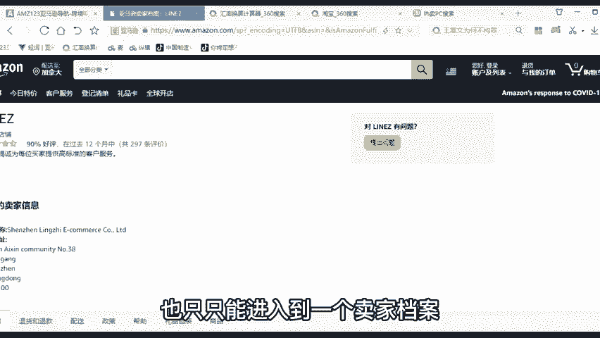

就是进入到这个卖家档案之后呢，你可以在这里给他发邮件提问提问题。但是你看到这个卖家都卖了什么东西嘛？他这个店铺都卖了什么产品，都有哪些产品来卖，卖了多少件产品，你能看到吗？😡。

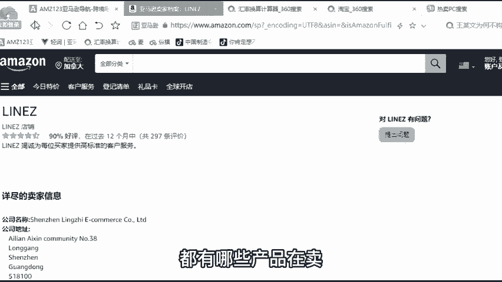

看不到，就亚马逊就不会展示这个东西，就亚马逊的商业模式就是这个样子啊，叫做这个商业模式叫做重产品。😡。

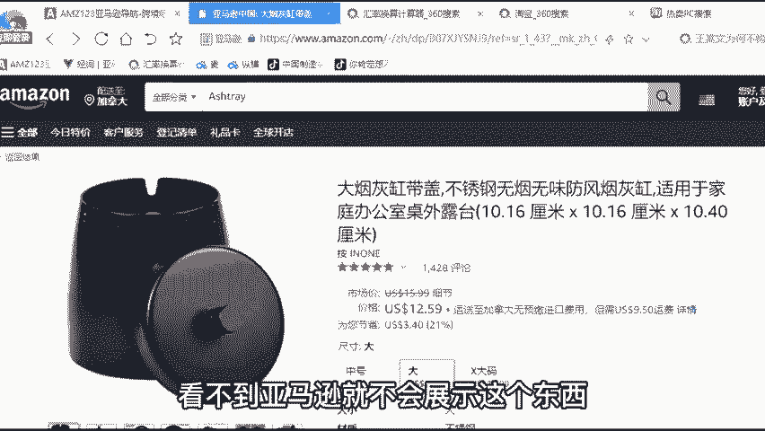

轻店铺。什么叫做重产品？轻店铺呢？就是说你开通了一个店铺之后啊，你想要卖什么产品，你的自由这样的一个模式有什么好处呢？首先你不用花心思去打造你的店铺了。😡。

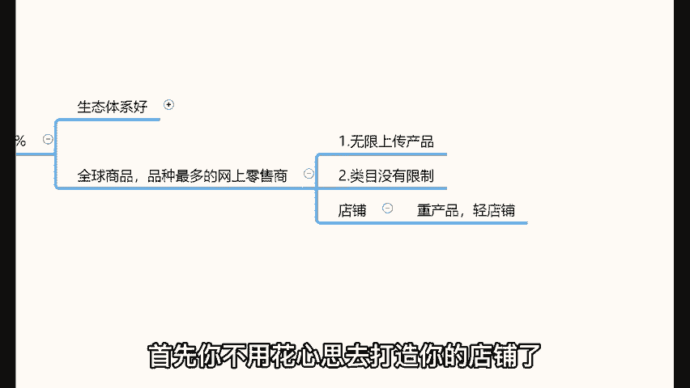

对吧那么你可以花更多的心思去优化自己的产品。让你的产品更加的让客户喜欢。就你看亚马逊在这里搜索某一款产品的时候，比如说他想买烟灰缸，他就在这儿直接搜索烟灰缸，他想买帽子，他就在这儿直接搜索帽子。

他搜索完帽子之后，他会看到很多款帽子，对吧？他在这些更多的款这么多款式里边选他自己想要的那这就是亚培呢，这就是客户的这个行为模式啊，客户。😊，🎼希望买了他需要的商品。至于你这个店铺装修的漂不漂亮。

对于客户来讲重要吗？不重要。所以说亚马逊的商业模式就是来这个地方。那么对于我们新手而言，那么这个地方就不会说给我们特别大的一种就是跟老卖家之间很明显的一种差距啊，不会，那么这就是亚马逊的商业模式。

比较青睐于呃比较照顾新手的地方，叫做重产品轻店铺。好吧。😊。

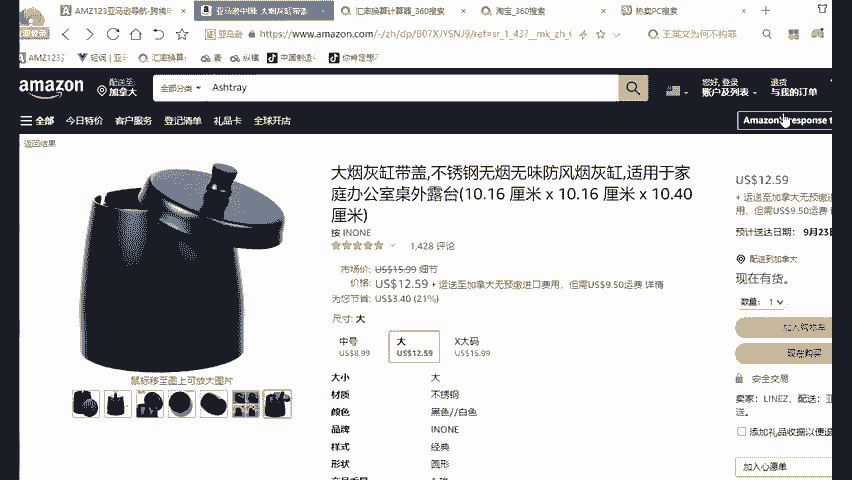

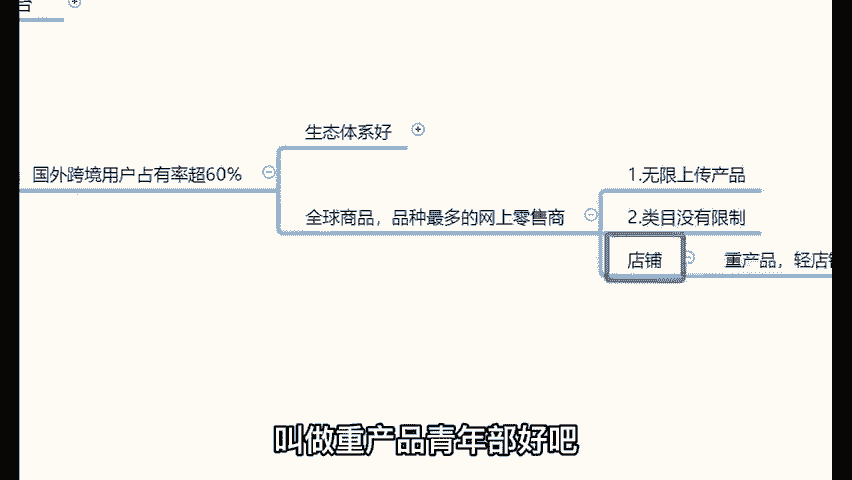