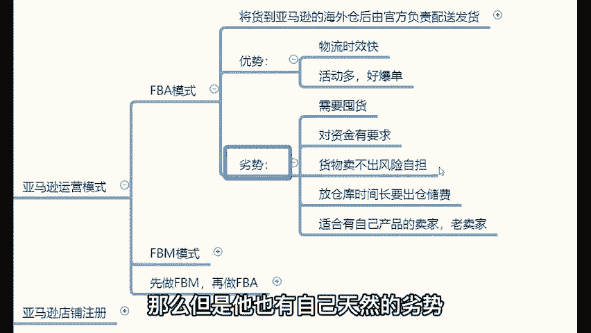
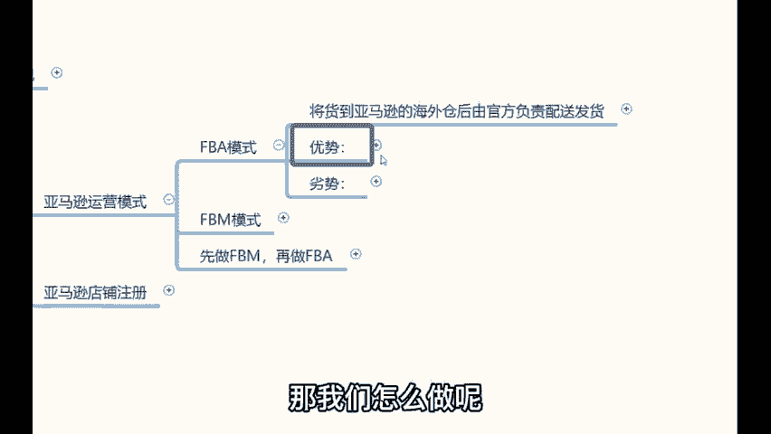

# 【2024年最新版】新手亚马逊跨境电商运营合集，亚马逊入门教程（纯干货，超详细） - P9：06、亚马逊运营模式：FBA模式 - 亚马逊电商小孙 - BV1YvxPedEjR

。

那么讲完这个亚马逊的商业模式，简单介绍完之后，接下来我们开始讲亚马逊的运营。首先你们要明白亚马逊的运营分为两种运营模式，分别叫做FBA和FBM模式。啥叫做FBA啊？我给你们解讲的通俗易懂一点哈。

FBA理解起来哈，就是它类似于国内的京东自营仓。😊，新东。自营商。🎼如果说你们在京东里边买过东西的话，用过它的京东自行仓的话，你发现它物流速度很快啊，你上午下的订单，下午就到了。

那么京东自行仓是怎么运营？呢？我给大家去讲一下，首先京东啊在很多的地方啊，比如说各个地市，各个省份，它会设置非常多的本地仓库，就是京东的仓库，就是京东设置了很多的本地仓，那么你在京东里边卖某一款产品啊。

举个例子，你在京东里边卖某一款这个保温杯的时候，对吧？😡，那么。你要假如说你是一个工厂，你在京东里边做京东自营仓，卖保温杯。那么你要把你这个保温杯啊分批发到京东在很多的地方设置的一些本地仓去。

就把你的保温杯，那么发货到京东的各个地市的这个本地仓。😡，然后当有客户在你的京东店铺里边下了订单之后，这个京东本地仓的官方工作人员呢，对吧就会把你这个产品进行二次打包，然后直接帮你配送发货。😊。

那么这就是京东自仓模式。这种模式的优点就在于说物流速度快。那FBA模式就类似于这种模式。比如说你是做美国人的生意的，你是卖衣服的对吧？那么你就准备一些你想要卖的衣服。

准备好了之后发货到美国亚马逊的海外仓库，把你要卖的这个产品发到美国亚马逊的海外仓，当你把这个东西发过去之后，有客户在你的亚马逊店铺里面下了订单。这个海外仓的官方工作人员就会把你这个产品进行二次打包。

然后直接帮你去配送发货。那么这就是关于FBA模式。😡，那么FBA模式的优势在于哪里？它的优势在于说物流时效比较快，活动多好报单，因为你东西已经发到国外了。那么但是它也有自己天然的劣势。

这个劣势的话就是对于我们新手来讲就比较痛比较痛苦的事儿哈。那么做这种模式的话呢，需要囤货和压货的。并且对于资金有要求。😡。

假如说你发了一堆衣服到美国，万一你说卖的不好，对吧？不是我讲放弃话，这事谁能百分之百在没有经过测试之前，你能保证你刚刚对吧？你你选好一个产品发到国外，你就一定能大爆门。你开玩笑就不可能，对不对？

那么假如说你说你一个新手刚刚发了一堆东西过去啊，开通的店铺，你就发了一堆衣服到国外去了，卖的不好，你说你是怎么处理，扔了东西没了，放仓库，你要出仓储费管理费发回中国来，你要自己承担运费。😡。

对吧他是比较适合那些有自己产品的卖家，还有老卖家。你说你做亚马逊做的时间久了哈，你说你做个三五个月，这个半年一年的，你知道哪些产品好卖的时候，已经经过测试的产品。当这些产品确实好卖。

都可以稳定出单的时候，你就可以做这种模式。但是它显然不太适合新手。核心原因它需要囤货，需要压货，对于资金的要求。你说白了，你说你说我花个几千块钱，我囤货，你你能囤几件货呀。😊，对不对？所以说那。😊。

这种FBA模式可能不太适合，那我们怎么做呢？😊。

