# 【2024强到无法呼吸】从最根本的起号／涨粉说起，抖店运营保姆级教学，全程实操不讲废话！ - P11：小店基础搭建 - 决战桃花江 - BV1oLe4ejE3J

这节课我们讲一下啊，小店的基础搭建，就是我们开通小店以后呢，我们要去做哪些动作。

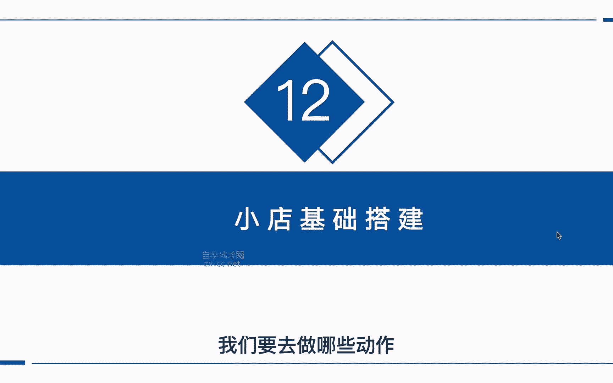

把我们的店铺做到精细化的运营，首先我们来到我们的小店后台，在我们店铺的支付方式里面呢，我们去把这四个支付功能都给它全部打开啊，这四个功能全部开通以后呢，我们后期提现啊才能正常的提现到我们的账户。

不管是我们的对公账户，或者是我们的个人账户啊，都是必须先开通这几个账户才可以提现的。

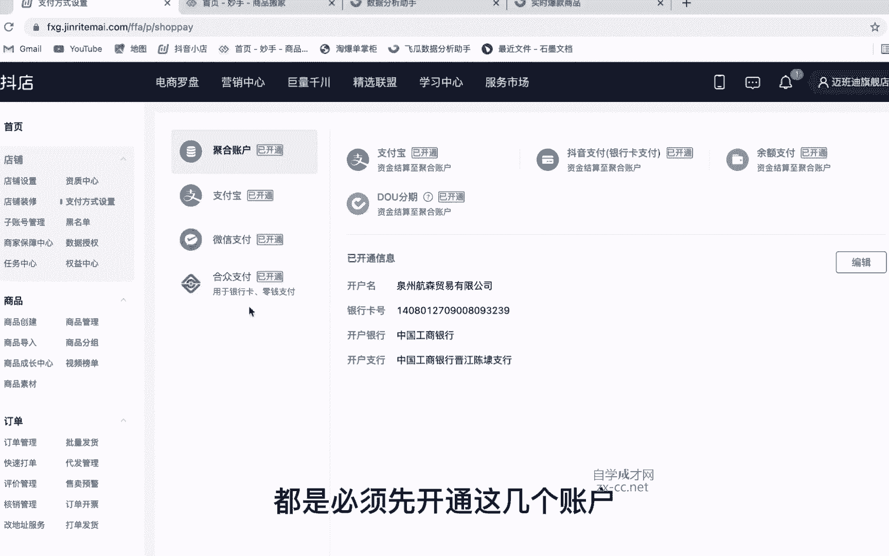

那么接下来来到我们的商家保障中心里面。

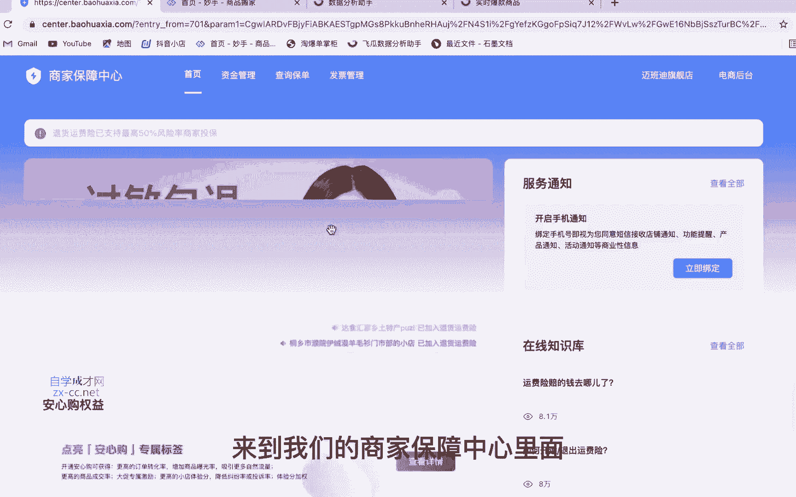

好去把我们的这个运费险给它打开，那开通运费险以后呢会有一定的流量倾斜。

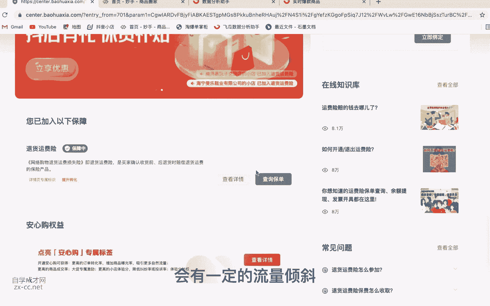

那他这个运费险的价格呢也不是特别的高啊，几毛钱就可以了，那开通运费险以后有哪些好处呢，第一个呢可以增加我们商品的曝光，增加19%，就是消费者在退货的时候呢，系统它会自动的理赔。

就可以打消一些顾客下单的他的顾虑对吧。

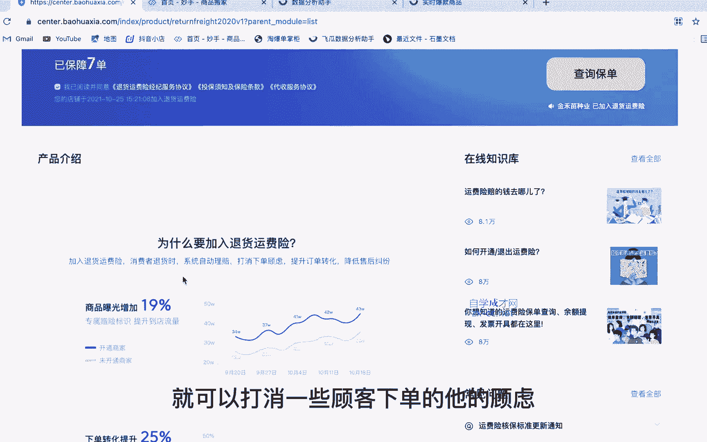

那还有呢就是可以提升我们的一个转化率啊，还有一个就可以降低客户的投诉啊。

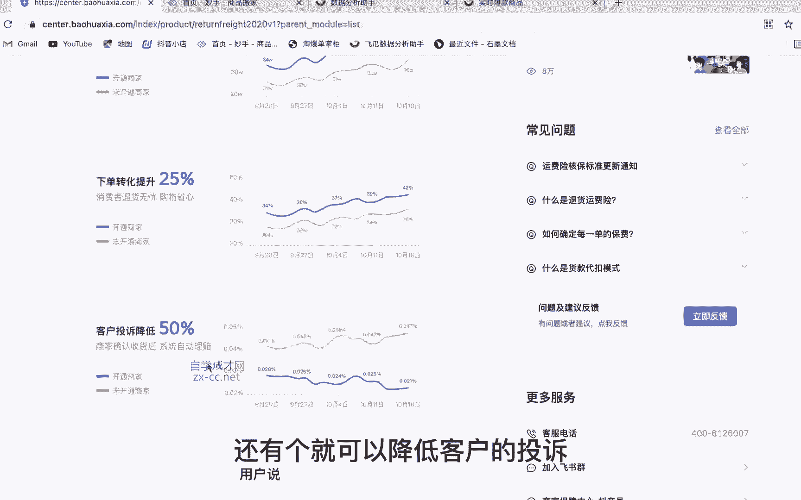

这是我们开通运费险的好处，然后我们再回到我们的首页啊，往下滑，找到这个急速退款的助手，点进去以后呢，我们把这个未发货仅退款给他，打开系统呢，它会识别在小于300元以内的产品啊。

并且是下单时间在六个小时以内，没有发货的订单，如果说有客户退款，他会进行一个急速的退款，那我们这个退货退款了就不用去选了啊。

那这里开通完成以后呢，我们回到这个商家保障中心，我们往下滑。

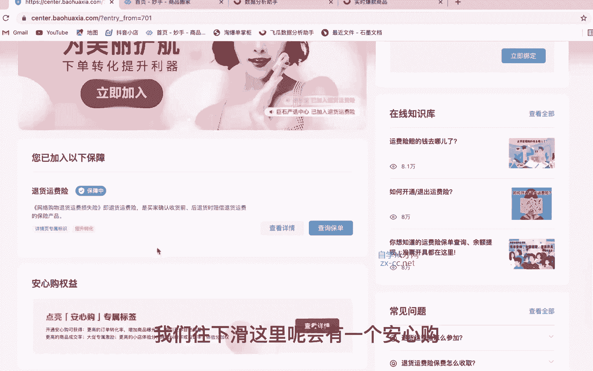

这里呢会有一个安心购啊，去把它开通一下，他的要求呢，就是必须要把这些各项功能全部开通，你可以看一下这里有没有开通，如果说已经开通的话，这里是已开通，没有开通，它显示是一个未开通的状态。

我们去把它每个功能把它打开，然后再加入这个安心购，这个安心购呢在用户购买我们产品的时候，就在我们商品的详情页，它会有一个安心购，这样呢有便于提高我们订单的转化率，以及成交率，还可以提升我们商家的体验分。

好处是非常多的，那么开通完安心购以后呢，我们继续往下滑啊，找到我们的地址库管理，那在这里面呢，去添加我们一个默认发货和默认退货的地址，因为有的同学是做无货源对吧，我们的上家呢非常多。

他的仓库地址也不一样，而且平台最近有一个闪电退货的规则，就是说用户在退货的时候呢，系统会默认的发送一个退货的地址，也就是我们这地址库里面默认的退货地址，那这里呢我们就要提前去跟商家对接好啊。

把他的退货地址给他要过来，我们再填到这里面，下节课呢我会给大家讲闪电退货的那个策略，我们如何去创建多地址的退货策略啊，我们在下节课来给大家讲，那如果说有的商家啊，他可能不会给你退货地址。

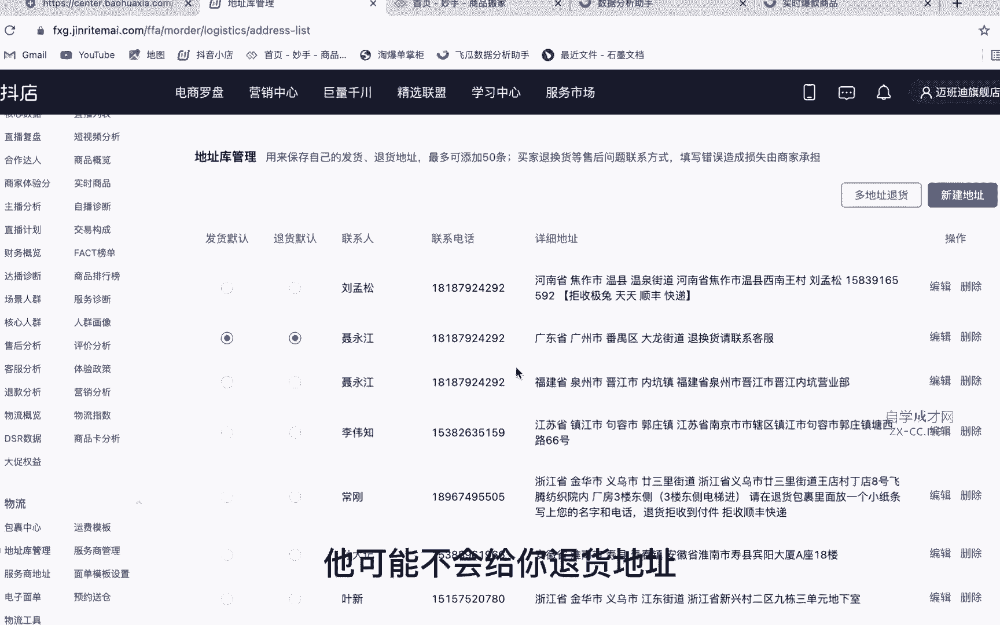

那怎么办呢，我们可以随便去填写一个地址，然后在这个详细地址里面呢，我们可以去添加一些话术啊，比如说退货请联系客服对吧，或者是说该地址不作为退货地址，因为我们的仓库比较多啊，如果说要退货的话，联系客服。

这个地址不作为退换货的地址啊，在这里把它输入进去，编辑一段话术就可以了。

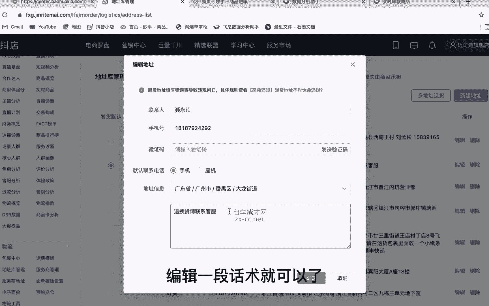

然后呢，在这里把它设为默认发货和默认退货的地址，那这样就解决了，我们部分没有退货地址的同学啊，该如何去设置，那接下来来到我们的运费模板，这里呢去新建一个啊属于自己的运费模板，因为新店铺的话。

他这里只有一个全国包邮的默认的，而且不支持修改的，那如果说我们想要来添加自己的运费模板，我们点击进去啊，点击这里新建模板，那这里呢输入我们模板的名称，比如说设置一个啊，部分地区包邮啊。

或者是什么什么包邮啊，根据你自己的情况来设置，然后设输入完成名称以后呢，我们这里选择发货的地址，也就是你发货的地址从哪里发啊，这去填写就可以了，然后运费设置呢，这里有三个模板选择啊，一个是阶梯计价。

阶梯计价是什么意思呢，就比如说他是按键或者是按重量，比如说一件以内啊，多少钱，运费每增加一件啊，增加多少钱的运费，那还有一个呢是固定运费，固定运费呢，就是说不管你是多少件或者是多少重量的。

都是一定的运费，那还有第三个呢就是卖家包邮，不管是什么产品，都是卖家给你包邮，那这点我建议大家去设置这个阶梯的计价，如果说你是卖衣服对吧，卖服装我们就按件按件数来计，如果说你是卖水果对吧。

我们就按重量来计，那这里呢我们可以去输入，比如说一件以内啊，零元包邮对吧，每增加一件啊，我们零元啊就可以了，那如果说有的地方对吧，它是需要邮费的，比如说一些偏远地区，新疆啊。

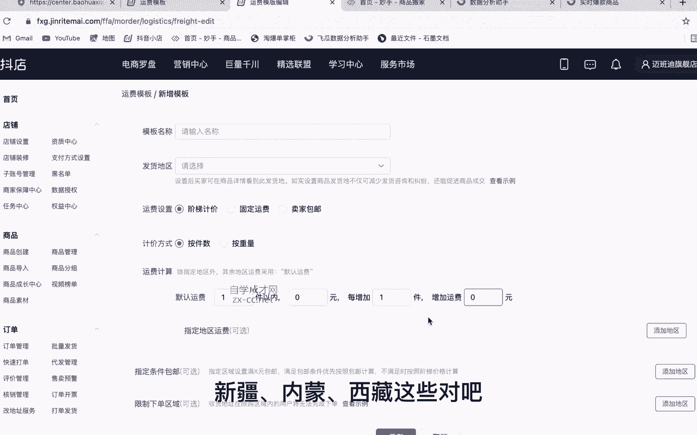

内蒙啊，西藏这些对吧，我们在这里去添加一下啊，添加地区这里去选择，比如说澳门对吧，还有这个嗯，内蒙古，还有这个台湾，香港，新疆西藏对吧，选择完成以后呢。

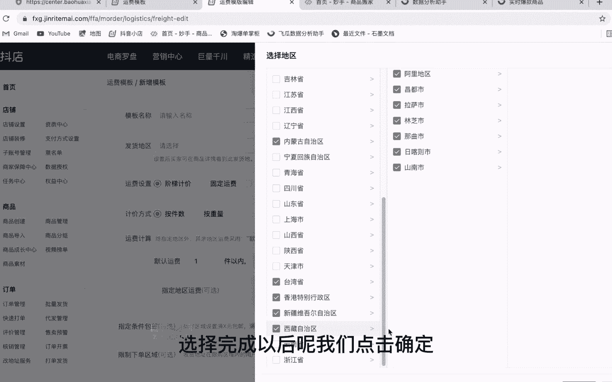

我们点击确定啊，这里呢去选择，比如说一件以内他可能要30元的运费对吧，那如果说每增加一件它有重量啊，可能需要加五块加十块，这个呢就要根据你们的那个物流去核算啊，具体需要多少运费，那这里填写完成以后呢。

我们一定要把它打上勾啊，选择把它选择上，那下面呢还有两个，一个是指定条件包邮，比如说啊全场满多少件或者满多少元包邮啊，这个也可以去设置啊，一般呢我们这里是不设置的，因为我们都是包邮了嘛对吧。

那还有就是一些下限制下单的区域，比如说一些现在比较疫情比较严重的地方，它是不支持送货的啊，那这里我们可以去添加，比如说最近疫情哪些区域区域不能送货的，我们把它添加进去就可以了，那用户在购买的时候。

如果说他填写的地址是当前疫情比较严重的，那么他就没有办法下单啊，选择完成以后呢，我们点击保存，我们这个运费模板就创建完成了，那设置完成以后，我们来到运费模板这里，就可以看到我们刚才新建的模板。

以及我们被使用的商品有多少个啊，那么到这里以后呢。

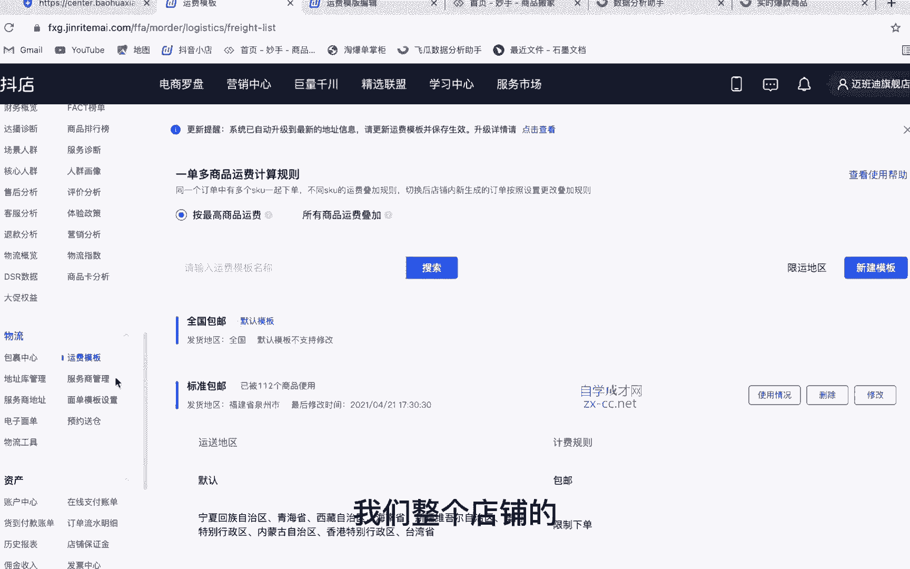