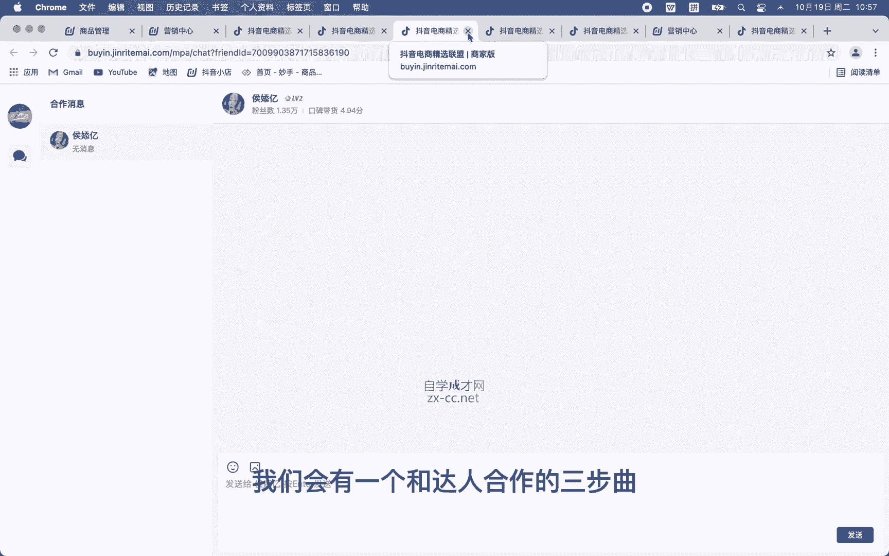
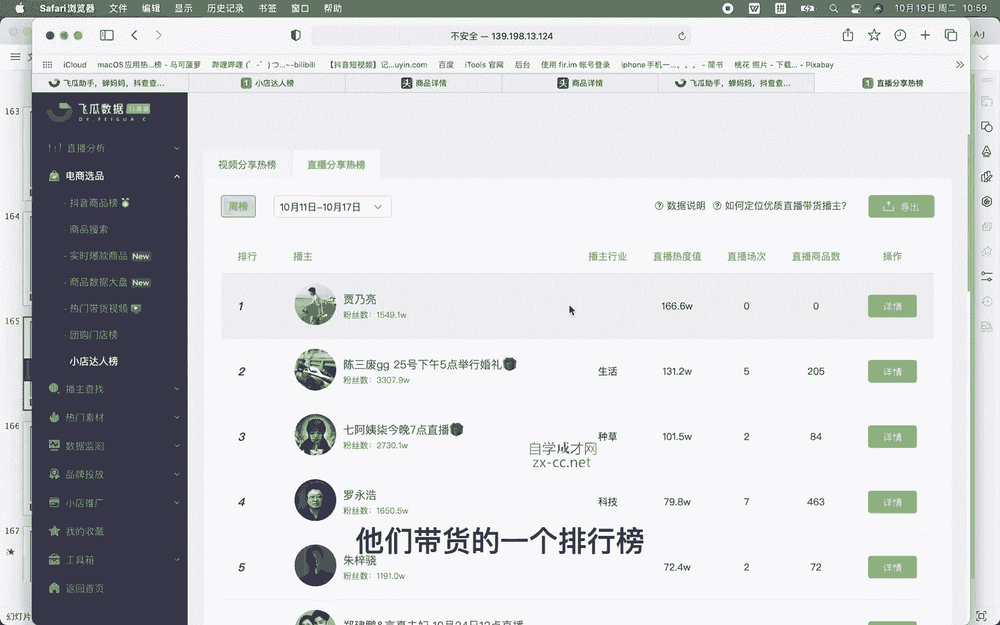
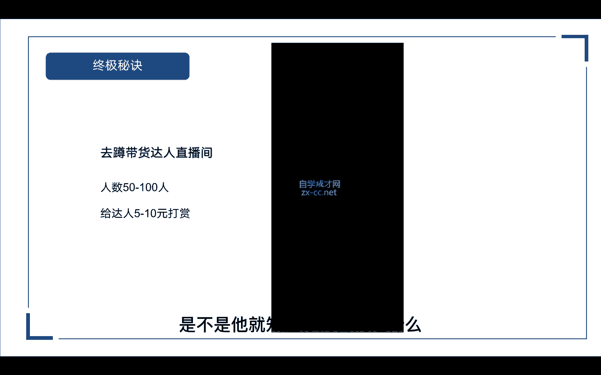

# 【2024强到无法呼吸】从最根本的起号／涨粉说起，抖店运营保姆级教学，全程实操不讲废话！ - P13：寻找达人-设置佣金 - 决战桃花江 - BV1oLe4ejE3J

那我们如何才能找到达人呢，啊去筛选到合适达人，让他带货，那这里呢我们去看一下怎么如何主动寻找达人。

那我们可以通过这三个方法，第一个呢是抖音平台去搜索，第二个呢是我们抖店后台的达人推广里面去找，第三个呢就是通过数据平台，查妈妈或者飞瓜数据啊，这些去寻找我们的达人，那抖音后台怎么去搜索呢。

在我们的创作者服务中心有一个商品橱窗，点击进去以后呢，我们往下滑会找到一个排行榜，那这里面呢就是小店达人的一个排行榜，它呢是根据我们昨日的一个商品分享榜排名的，那我们可以去上面去寻找适合我们的达人。

那第二个呢就是通过我们的抖店后台。

那抖店后台我给大家打打开看一下啊，同样的也是进入到我们营销中心以后呢，我们在左侧的工具栏往下滑，然后在精选联盟这里面有一个达人广场，进来以后呢，我们就会看到系统给我们匹配的1000个啊，比较合适的达人。

那么它是根据我们的经营范围去匹配的，那这里我们可以自动手动去选择一下，比如说你的呃品类是什么样的好，我们可以在这里去选我们的一级品类，那他这里有两种，一种是直播的达人，一种呢是短视频的达人。

就是一个是通过直播带货，一个是通过短视频带货的，那根据你自身的需求，你要去寻找哎，要直播给你带货的，还是要短视频给你带货的达人对吧，当然这两种我们都可以去选择，那选择以后我们先去看一下。

比如说找到以后呢，我们点击进去，那看一下他的带货数据啊，比如说他的带货场次啊，啊带货的直播天数啊，推广的商品啊，还有合作的店铺啊，以及它的厂关呀，平均在线时间，还有他的场均销售额是多少钱。

还有它的转化率高不高，那么在下面呢它会有一个系统的匹配度，通过我们的综合维度去匹配一个分值，那分值越高呢，代表这个达人跟我们的店铺哎是越相近的，那他是通过哪三个维度呢，一个是粉丝的匹配度。

一个是商品的匹配度，还有一个就是历史合作的匹配度，那下面呢还有一个粉丝的分析他的粉丝特征啊，粉丝团的特征以及他直播间的特征，都是女性女性居多对吧，31~40岁啊，41~50岁，然后是用的什么手机。

哪里的地区客单价是多少，然后偏好是什么啊，这里都很详细，以及它的一个带货分析啊，他带过哪些类，比如说鞋服，包包啊，钟表配饰啊，服饰内衣啊等等，还有一些品牌的，比如说巴宝莉啊，绝代佳人对吧，这些都能看到。

而且还能看到他的一个历史作品啊，以及我们下面还有一个相似的达人，如果说确定以后呢，我们可以发送一个邀约达人，看到以后他会回复你，回复以后我们就可以正常的去沟通，或者呢是在线的沟通啊，去给他私信他啊。

去后台私信他，跟他聊合作，那具体要怎么聊呢，在后面我会给大家详细的讲解到，我们会有一个和达人合作的三部曲。

那就是通过我们抖店的后台达人广场，那第三种呢就是通过数据平台去找，那这里我就先拿飞瓜来做演示，给大家看一下我们怎么通过飞光去寻找。

我们打开非挂后台数据以后呢，啊我们在这里会找到一个小店达人榜，小店达人榜里面呢，其实他这个榜单就是跟我们那个啊，抖音后台的榜单，它其实是一样的，不过这上面呢能看到更加详细的数据啊。

比如说昨日的榜单对吧啊，他排在第一的是谁，排在第二的，他有一个排名，那最多呢它会显示50个前50个，那么这里呢就可以根据适合我们的品类，去找相关的达人，那么除了这个视频分享榜呢，还有一个直播的分享榜啊。

通过昨天的直播，他们带货的一个排行榜。

比如说排在第一的贾乃亮啊，然后这些罗永浩啊等等。

那么还有一个呢就是通过蝉妈妈去寻找达人，我们在下方呢可以看到一个抖音数据，那这里面呢在第三行有一个达人，这里面包括我们涨粉的达人。

商品分享榜，以及他的达人行业达人榜，我们点击商品分享榜进去看一下，这里就有一个达人带货，昨日的一个榜单，其实它这个跟我们抖音后台是一样的啊，他同样的也是只能看前50名，那这两个数据平台呢。

都是可以看到我们达人的一个排行榜，那么除了通过达人分享榜去找到达人呢，我们可以通过商品里面啊，通过商品库啊，抖音热搜榜里面，我们去看一下给他带货的达人有哪些，同样如果说适合我们的品类。

跟我们的产品相关的话，比如说我们是做日化美妆的对吧，像这个呃，我们就拿这个精华液来看，我们把它点击进去以后呢，这里面会有一个达人分析啊，他有哪些达人给他带货，那这个是啊，这个好像这个是专场的。

我们再换一个，我们找一个呃就是带货比较多的达人，那这里面呢我们就会看到很多啊，很多的达人信息，那么他的排序是根据我们的销售量来排的，排在第一位的，他的销售量，带货口碑分，以及它关联的视频。

关联的直播场次有多少，如果说这个品类很适合你的，那么通过这个达人分析这个榜单里面呢，去找到适合我们的达人，再去跟他对接谈合作。

那么以上呢就是我们找到达人的方法，同样的我们在筛选达人的时候呢，要通过这三个维度去看，第一个就是看我们达人带货的类型，跟我们的类目是否相关，第二个呢是查看他粉丝的喜好，看他的粉丝画像。

他的粉丝喜欢什么样的产品对吧，是否跟我们卖的产品相符合，那第三个呢就是通过他的带货GMV，他的带货销量是多少，如果我们点进去看他带货数据不太好，那可能他也带不动我们的产品。

所以我们要通过这三个维度去筛选，适合我们的达人，那达人带货的类型我们要怎么去看呢，我们这里还是以飞瓜数据平台为例。

在播主搜索里面呢，它是根据主播的行业来进行排序的，比如说我们要找哎网红的美女，或者是网红的帅哥，或者是一些搞笑的剧情的美食美妆啊，这有很多的行业分类，那除了行业分类以外呢，还有我们带货的品类。

比如说我们做服饰内衣对吧，我们就要去找带过服饰内衣的主播，那如果说你做美妆呢，我们要去找那些带过美妆的主播对吧，根据我们自己的品类来找合适的达人，那在下面呢他还有一些筛选的啊条件，还有一些筛选的条件啊。

比如说开通橱窗的啊，开通直播的对吧，这肯定是需要的啊，我们要找人直播带货嘛，那还有有联系方式的，我们需要联系到他对吧，那还有一种纯佣的啊，他要佣金的，那还有下面一个高级的筛选粉丝数量啊。

或者带货口碑分呐啊带货口碑分，我们可以根据自己的需求去找嘛，如果说你的产品真的很给力对吧，我们肯定要找带货口碑比较高的，他跟他的粉丝粘性就更高对吧，那通过搜索呢，它出现了45个播主。

我们再去筛选一下适合我们的达人，那我们这里随便选一个，然后点击进去看它的详情页，那通过这里呢，我们就可以看到他的一个详细数据，对吧啊，视频的作品，直播的记录，还有我们带货的商品以及带货分析。

还有我们的粉丝分析对吧，刚才说了，要通过查看他粉丝的喜好，我们看下他粉丝的性别分布，以及他粉丝的那个购买需求，当然这个他已经把它隐藏了，我们看不到啊，我们看不到，我们要去找啊，能够看到的主播。

我们再换一个啊，这个就这个就能看到啊，那这里呢我们能看到他们粉丝啊，经常购买的是什么类目，比如说女装对吧，女装包含哪些连衣裙，毛针织衫，就是毛衣嘛，然后还有衬衫，那第二排到第二呢就是男装，男士外套T恤。

男士毛呢外套，还有就是首饰对吧，吊坠首饰颈饰，那这些呢是他粉丝喜欢购买的，那这里还有一个啊单价的区间啊，比如说粉丝购买的价格，它的区间单位占比是多少，比如说呃1000的占3%啊。

500~1000的占7%，那最多的是100~300左右，那如果说刚好我们的产品在100~300之间，那就很符合他的粉丝群体对吧，那我们再来看一下他的一个带货节MV，看他这30天带了多少钱，销售额是多少。

那在这里呢我们可以看到他的预估总销量啊，一个月30天以内带了1007单对吧，他的销售额在24。7万，那证明这个达人他还是有带货能力的对吧，那这个时候呢我们就可以去联系他啊。

去跟他谈合作，这里的会有一个联系号主，我们点击一下就可以获取到他的联系方式。

那么通过这三个维度呢，就能找到非常适合我们的达人，那达人找到以后，我们洽谈好了，开始合作的时候呢，我们就要去给达人寄样品对吧，把样品寄给他，并且呢要提醒达人，我们的样品已经寄到了，让他去查收。

最后就是检查一下达人带货的视频啊，带货的视频和他直播的质量，那我们通过哪里去看呢，我们可以去数据平台对吧，飞瓜或者常妈妈都可以看到他的直播详情，那他开直播的时候呢，我们就去蹲他的直播间，看他的带货数据。

那还有一种他是专门做短视频带货的对吧。

我们要去哪里看呢，我们可以去我们抖店后台的电商罗盘里面去看，对吧，来到抖店以后呢，在左上角有一个电商罗盘，我们把它点进去，在这里面呢就可以看到我们合作的达人，他的一些具体数据或者一些带货的数据对吧。

有直播的，有短视频的，那我们怎么去看呢，如果说他是通过短视频带货，我们就选择短视频分析，当然我这里没有合作的达人，看不到的，你有合作的达人，他有发过短视频的内容，并且带上了我们商品链接。

那他就会出现在这里，我们就可以去查看他的一个数据，这时候有的同学就会说了，他说哎我找得到达人。

但是我不知道怎么去跟他对接，不知道怎么去谈，没有关系啊，这里我们讲一下跟达人合作的三个步骤，那第一个呢是自我包装，第二个呢是体现产品的专业度，第三个呢就是产品的价格满意度，通过这三个步骤。

我们去找达人来谈合作，那第一种自我包装，因为我们找达人，我们是肯定是以商家的身份对吧，首先我们是不是要展示我们的实力，第一要么你的品牌很有实力，第二要么你的生产力很有实力，第三要么你的产品很给力对吧。

很有实力，那这些东西呢都是你提前要做好PPT的，比如说我们之前是做盼盼集团的供应链，那我们在跟达人对接的时候呢，会把会先把我们公司的介绍发给他，那第二我会告诉他我们在全网有多少的销量。

有多少的爆品已经卖出去了，多少都会在那个PP里面把它呈现出来，那首先我们的第一步，是不是信任感就已经建立起来了对吧，至少你在加达人的时候，那你的微信上面是不是名称也很重要，你不要一上来取一个头像。

什么什么都没有的头像对吧，或者一些卡通头像，然后取一个诗情画意的名字，那鬼知道你是谁啊，对不对，那比如说我做盼盼集团，那我们就用盼盼集团的logo作为我的头像，然后呢我就写盼盼集团总部达人对接渠道啊。

总部达人对接渠道号，那别人一看是不是立马就通过了，对不对，那你也要这样做啊，那如果你不是大品牌，你怎么做呢，你可以把自己的名字改成什么全网爆品，供应链啊，或者是全国最大的供应仓储等等。

那这些一看是不是就立马就通过了。

就比如说这个图对吧，找到达人以后，我们去后台私信他，哎你好，我这边看到你橱窗的产品，我们工厂这边都有对吧，我们这边可以给到您更低的价格，更高的佣金，您看需要合作吗，那有的达人他就非常愿意对吧，佣金更高。

价格还更低，那这个时候就可以转到我们的后端，把我们的PPT介绍给他，对不对，他加你微信的时候一看你的头像哇，我靠供应链的啊，好牛逼的样子，对不对，那在这之前呢，我们就要提前去塑造好我们的朋友圈对吧。

这都是这都是非常重要的。

第二体现产品的专业度，那在这里你要记住啊，我们是做精选联盟对吧，你所有的产品必须要提前做好表格，这份表格里面呢第一个你要有产品的编号，第二个呢要有产品的图片，第三个呢要产品我们正常的零售价。

第四个呢有一个直播价对吧，第五呢还有一个下单时候啊用到的优惠券，那第六呢就是我们的佣金，你要把它全部罗列的清清楚楚，明明白白的发给别人，因为现在大家都挺忙的，特别是你要去找达人带货，人家都是表格。

一发地址，一发样品就寄过去了，那你这个时候还跑去跟人家说，哎我家有这个产品，然后你发再发个图片给他，那鬼理你啊，对吧，大家都忙的要死，所以说我们要做好这个表格，如果没有的话，可以来找我要啊。

那是不是这样就很明确对吧，大家都知道我是卖什么的，哪怕这一次没有合作，那他下一次他突然想起来哎，他要卖一个食品对吧，或者要卖一个衣服诶，他就会想起你，你之前发过表格给他，他就会问你啊。

这个产品还有没有货啊，我明天想要直播卖这个产品，你能给我什么的价格，什么样的佣金对吧，你文件给了他，他其实都会保存在他们的选品库里面的，那有一天需要了，他就能调出来，那如果说我们什么都没有。

你跟他扯嘴皮子，没有人理你的啊，第三个产品价格满意度，比如说你给他这个表格啊，你可以跟他说，这个是我们的通版对吧，那你这个时候你自己可以看啊，如果这个达人卖的很好，那我们价格可以再低一点。

佣金可以再高一点嘛，你可以先发给单人通版，万一哪天他真的要播的时候，你再把你的底价丢给他对吧，那如果他不播，你直接丢给他底价，那下次我们怎么发展其他的达人，对不对，那这就是我们达人合作的三个步骤。

最后呢我再给大家分享一个我的终极秘诀啊，这是我亲测非常有效的，那就是我们去蹲带货达人的直播间，那我们去蹲的直播间呢，我们一定要去选那种人数比较少的，50~100人的直播间，像这种带货的主播啊。

一般都没人给他刷礼物的，都是进去看他卖商品的，去买东西的，为什么选择人少的呢，因为那种人人多的啊，几百个上千个的，他的公屏里面都是一直在刷屏的，他看不到你的，看不到你发信息的啊，那我们去蹲的时候呢。

可以给他打赏5~10块钱的礼物，其实五块到十块并不多啊，不你可以去刷五块的，也可以刷十块的对吧，这期间都可以，那这个时候他本来就是做直播带货吧，每天在卖东西，讲解产品，这个时候你去给他刷礼物。

是不是就能吸引到他的注意力对吧，来给大家看一下，我亲自去实操的嗯，是这个，这时候呢我给他刷了几个棒棒糖，也就五六块钱，弹性非常大的，知道吧，这款就要人家随便你这样扯，随便你这样拉，知道吧，随便这样扯。

随便这样拉，对十根黑色，十根咖色对的，那他这个时候他并没有搭理我啊，他看到了，他看到我给他刷礼物，他不知道我是要干嘛，没点关注，然后另外2万，另外点个关注的小姐姐，再来送两个我们家这收纳盒。

所以说喜欢的话可以直接去开车不，那这个时候呢我给他发了一段文字，哎我说哎主播下播了以后聊一下，私聊一下，我这边跟你谈一下合作嗯，不，因为你一来就给他刷礼物，他可能不知道你要干嘛对吧，他可能以为你点错了。

那这时候我们再发一段文字给他，他就是不是就知道了，阿令点关注，他这个时候让我点一下关注啊，要互相关注才能私信吗，我看到你了，点关注，点关注，找他私聊啊，找他私聊。

那这个时候我们是不是就找到一个合适的达人，我们就可以去跟他谈，会有很多答案，你去后台直接私信他，他不会鸟你的啊，不会鸟你的，那我们可以通过这个方法诶，去占一下他的榜单，占一下他榜一，当一下他的榜一大哥。

你给他刷个几块钱，是不是他就知道你的目的是什么。

我们再去谈合作是不是更加容易呢，啊那么前面呢我们是讲到主动去寻找达人，那还有一种呢就是达人主动来寻找到我们，那我们要达到什么样的条件，才能被达人主动寻找呢，那第一个店铺评分不能低于4。8分。

第二个呢是我们的产品质量要有优势，第三个呢就是佣金比较吸引人，那达人一般是通过什么来找到我们的达人，也会用工具啊，对不对，他也会通过数据平台去筛选优质的商家和商品，对吧，那第一点卖的好的。

他才会卖啊对吧，第二点他是不是要看我们的店铺评分，因为他要极力的去维护他的口碑分呢，那万一你的产品不好，影响他的带货口碑分，他下次还卖得动吗，所以说这个口喷分，说白了就是质量要有优势嘛对吧。

那我们的产品也OK了，销量也OK了，那接下来肯定是佣金啊对吧，是不是聪明人都是这样选择的，先选产品嘛，然后再选销量对吧，那有一些笨的人，他只会看佣金有很多，这样子只看佣金的，他只为了自己的利益着想。

也有，虽然两个你都有机会，要么你把你的店铺体验分干到极致，要么你把你的佣金拉到极致对吧，那佣金该怎么设置呢，我们可以对照你的同行去设置啊，比如说一款连衣裙，他卖160，你也卖160对吧。

那他开20%的佣金，那你就开25%，那实在不行，30%对吧，我比他高就行了，那还有一个就是根据我们货源渠道去计算，根据你的进货渠道和你的销售渠道，我们把我们的利润比，控制在30%到50%就可以了。

因为后期你要给达人佣金呀对吧，所以总的来说，只要你的产品足够好，我们只需要开通了精选联盟，把你的产品上架上去。

你不需要去找达人。