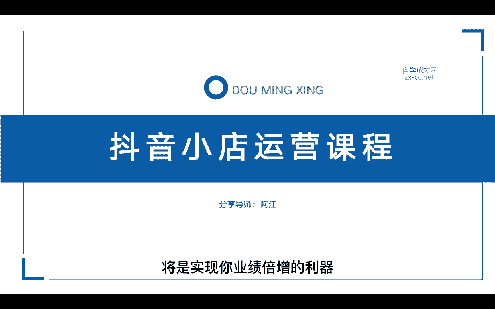
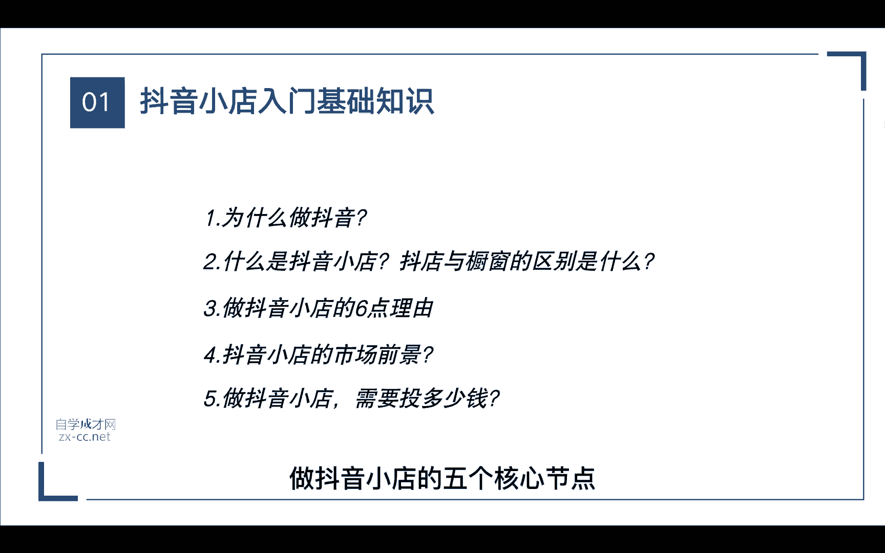
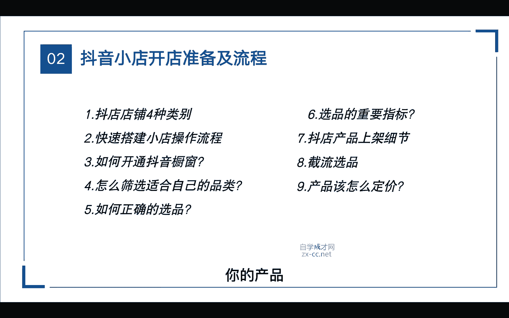
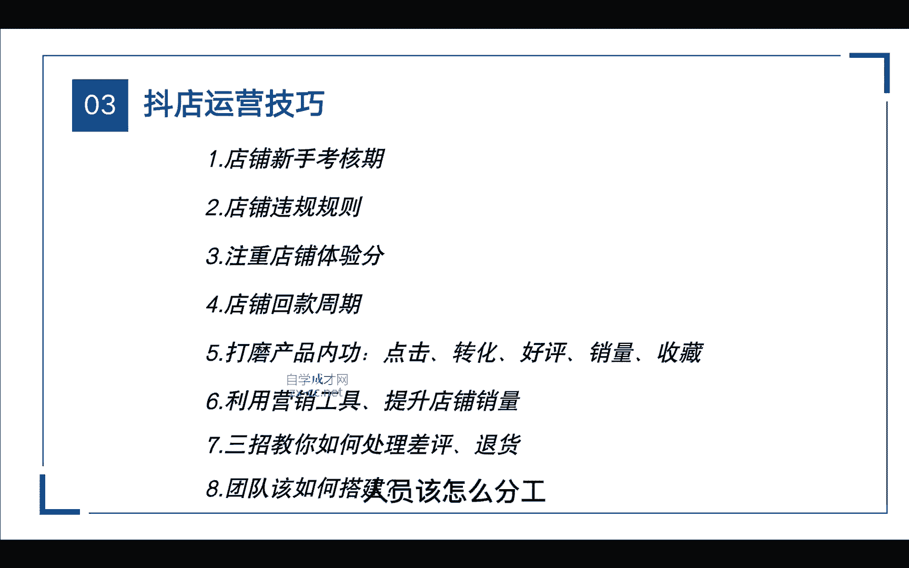
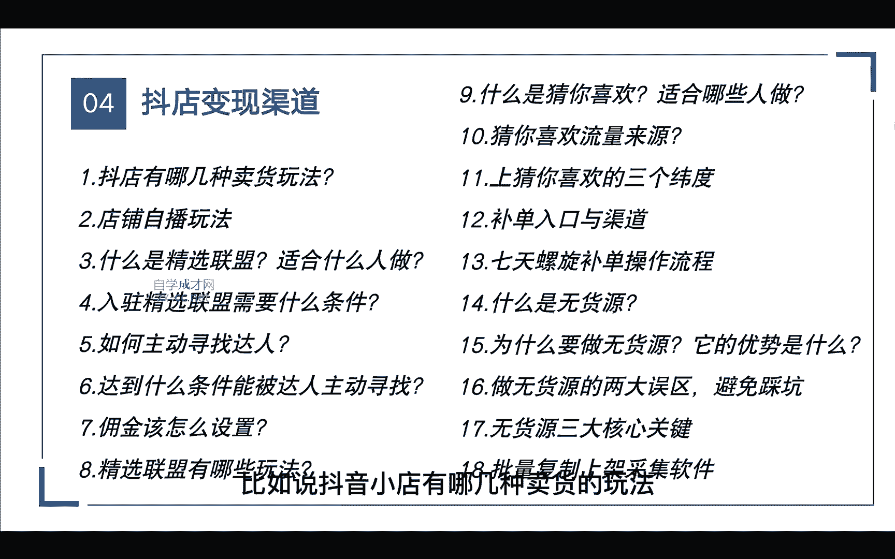
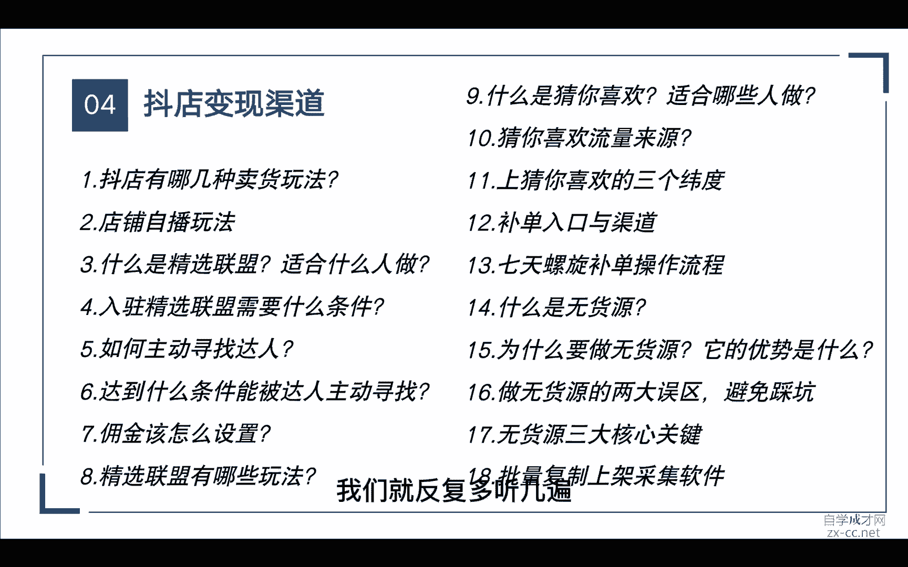
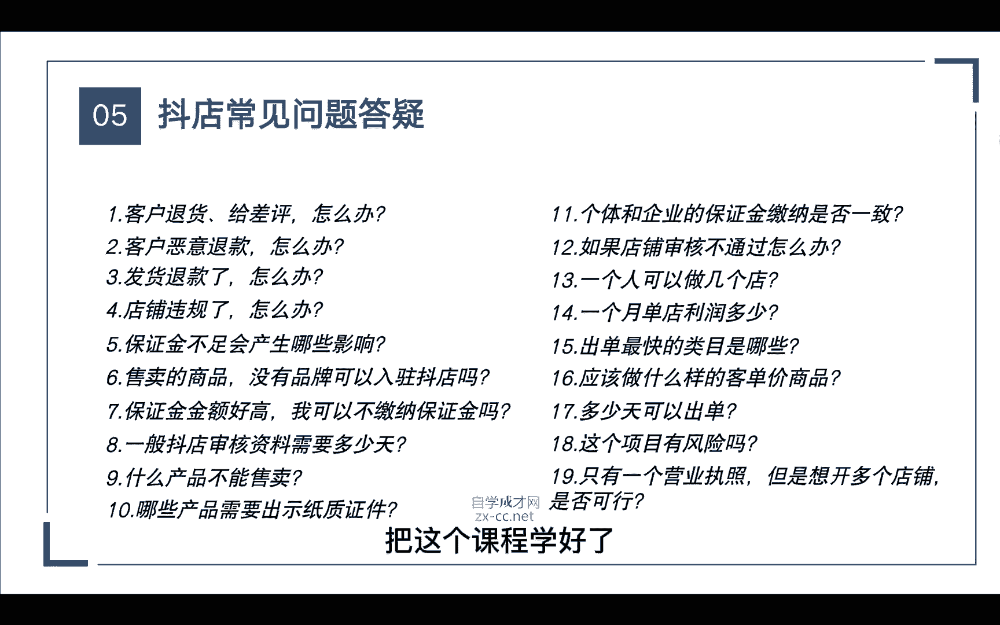

# 【2024强到无法呼吸】从最根本的起号／涨粉说起，抖店运营保姆级教学，全程实操不讲废话！ - P3：课前预习 - 决战桃花江 - BV1oLe4ejE3J

做传统电商的还是做实体店，又或者你是做生产制造的企业，那如果你想跟上这个时代的新电商浪潮，那么抖音小店将是实现你业绩倍增的利器。

那么今天这堂课呢，我会分为五个章节来给大家讲解，在第一节课里面呢，我会重点的通过五个维度给大家讲解一下，抖音小店是什么，以及你为什么要做抖音小店，还有最重要的是大家都在思考的。

做抖音小店到底要投入多少钱对吧，这是我们都想知道的，那无论我们在做哪一个平台，对这个平台是要足够的了解，首先你要了解它的发展趋势，还有它的规则，那这些看起来都很简单，但其实他是最重要的。

他所有的认知都在这里面，如果说你连这个基础的层面你都不了解，那么后面你肯定是做不好抖音小店的，所以在第一节课里面呢，我会给大家总结归纳一下，做抖音小店的五个核心节点。

具体应该怎么去操作，那在第二节课里面呢，我会讲到开店会需要哪些准备的细节，我会重点通过这九个维度，那这里面比如说抖音小店分为几种店铺，你最适合哪一种店铺，在后面的课程呢，我会详细的去说。

那这节课里面有个非常重要的就是我们的选品，为什么呢，因为我们无论做哪个平台啊，都要符合那个平台的调性对吧，比如说淘宝，淘宝属于一个综合型的平台，从小的品类再到大的品类，从低的价格再到高的价格。

他都能做对吧，因为他是综合型的，那比如说拼多多，拼多多呢，它是一个低价的平台，它面向的人群呢就属于三四线的城市，那最早呢他是从3C类目做起来的，当然还有京东，如果说你是做家电类3C类的。

那京东平台可能更适合，那在抖音小店呢，它的流量跟快手又不一样了，那快手主要也是做下沉市场对吧，它面向的也是一些三四线的城市用户啊，所以在快手上大部分卖的都是一些库存尾货，特价的产品，但是在抖音平台呢。

它更多的用户是在一二线城市，那么抖音平台到底应该以什么样的价格，才能去销售呢，那在我后面的课程会给大家重点的去讲解，你的产品在抖音平台应该怎么样去定价啊。

怎么去设计，那在第三节课呢，重点的途径来了，我们想要做好这个平台，是不是首先要懂得它的工具使用，说白了不管我们做哪个平台，我们所用的不管是套路也好，还是运营，它都是围绕这个平台的算法。

所以在这里面呢重点会通过这八个维度，比如说从店铺的新手考核期，再到店铺的规则，哪些错误的动作会导致我们的店铺违规啊等等，那在这里面呢，还给大家整理了一些抖店的规则资料包，那还有很多人都想知道的。

店铺回款周期具体是多少天，里面还包括了重要的店铺营销工具，我们应该如何使用，才能提升店铺的销量，最后还会讲到团队该如何搭建，人员该怎么分工。

这节课里面都会详细的去给大家讲解到，那在第四节课里面呢，总共分为了18节，每一节呢都是非常重要的，比如说抖音小店有哪几种卖货的玩法。

像最常见的就是达人直接挂橱窗卖货对吧，那其实除了这种玩法，还有很多种，特别是现在抖音的搜索电商开始了，玩法就更多，所以在这18节里面呢，我会详细的讲解到抖店的各种玩法，以及它的具体操作步骤。

甚至还包括了大家最想要的七天螺旋补单，操作步骤，以及猜你喜欢，那这些玩法呢都是那些会传统电商运营的人，必玩的项目，因为抖音现在这些玩法都是红利期，如果你在其他的平台已经做得很好，或者你想增加一个赛道。

那么如何才能节省人工成本，做这个项目，我会在第18节里给大家分享，一个非常好用的商品上架软件，所以说这节课每一个点都非常的重要，大家一定要做好笔记，认真的听，如果说一遍听不懂，我们就反复多听几遍。

那当你学完前面的东西还不会怎么办，没有关系啊，我在最后一节课，整理了一些关于抖店的常见问题解答，如果当你哪天遇到某一个问题，比如说我们小店被处罚，被扣了保证金应该怎么办，那这些问题在最后一节课都有解答。

所以说这是一套非常完整，从零起步的小店运营课程，把这个课程学好了。

