# 【2024强到无法呼吸】从最根本的起号／涨粉说起，抖店运营保姆级教学，全程实操不讲废话！ - P4：抖音小店基础入门知识 - 决战桃花江 - BV1oLe4ejE3J

开始进入我们的第一节课，抖音小店的入门基础知识，那我们在做抖音之前呢。

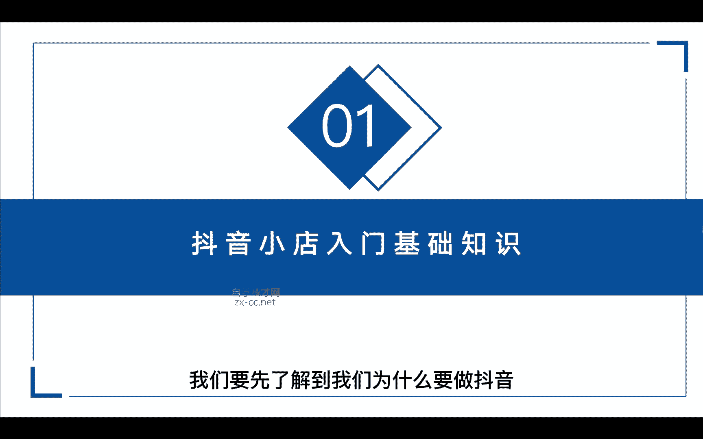

我们要先了解到我们为什么要做抖音，抖音呢，现在是全国最大的一个短视频平台，它目前抖音的日活呢已经突破了8亿，流量呢是非常庞大的，俗话说，哪里有流量，哪里就有机会对吧，那淘宝和拼多多现在流量是非常的匮乏。

如果说你正在做淘宝或者拼多多，那么现在来做抖音就是你赚钱的机会，我先给大家看一个案例，你就能非常直观地了解到，抖音的流量是有多么的庞大。

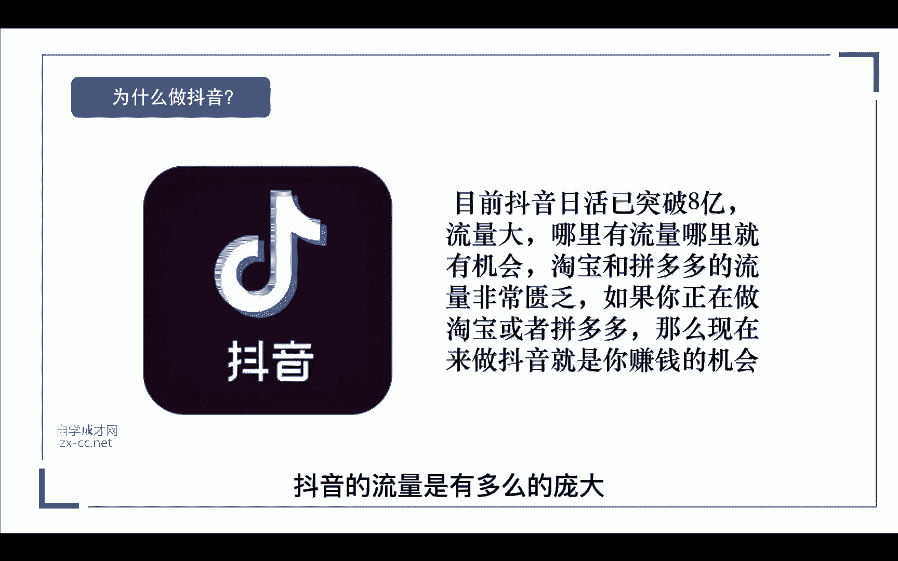

我们来看一下左边这张图，这是一个金冠的店铺，而且是三个金冠的店铺，他的粉丝呢只有466万，三个金皇冠是什么概念，代表他这个店铺已经销售出去了，几千万的一个销量，是一个非常恐怖的数据啊。

但是他在淘宝这里呢，一年的销售额都不足一个亿，我们再来看一下他自从入驻抖音以后呢，也就是我们的第二张图，他的粉丝呢只有200多万，还不如淘宝店的一半的粉丝对吧。

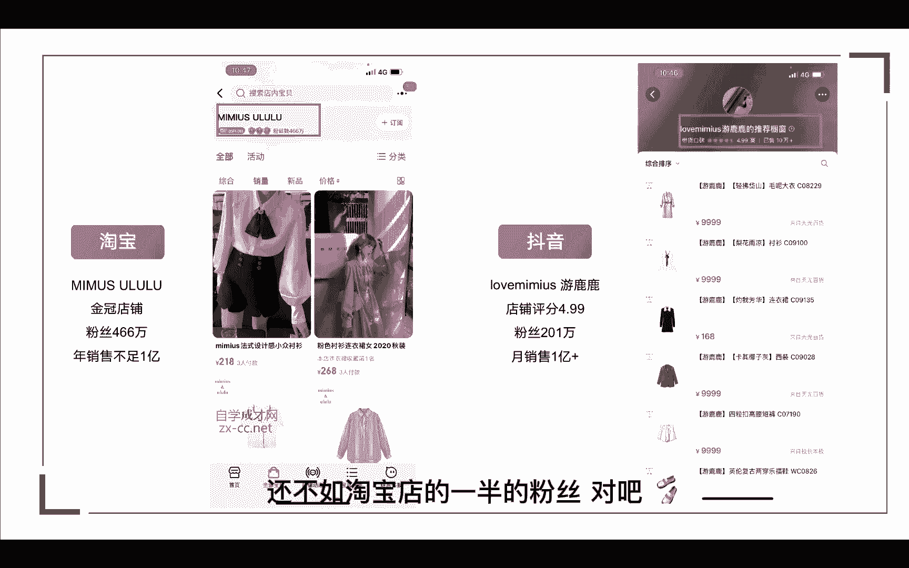

但是他来到抖音以后呢，一个月的销售额就突破了一个亿，来我们再看一下具体的数据，这是他30天以内的一个销售额，预估总销售额是1。3亿，预估总销量是122万，这个数据是不是就很牛逼，当然现在在抖音上。

一个月销量1亿以上的商家也是非常多，我们再来看一下他的带货详细数据，我们来看下这款双面力的大衣，光是一个单品，一件衣服，他的带货销售额就达到了432万，1。4万的销量。

你说如果我们是做实体店的一件同款的大衣，一天能卖出去十件都很牛逼了对吧，那如果说你是做制造生产业的，你去接订单，你可能一年接到1。4万都很难对吧，但是在抖音上有的一天销售就能达到1万单。

所以说如果你的企业是生产制造的，那么你必须要入局抖音小店，从这些数据我们就可以看出，抖音的流量是不是非常的庞大，那当然这也只是简单的举一个案例。

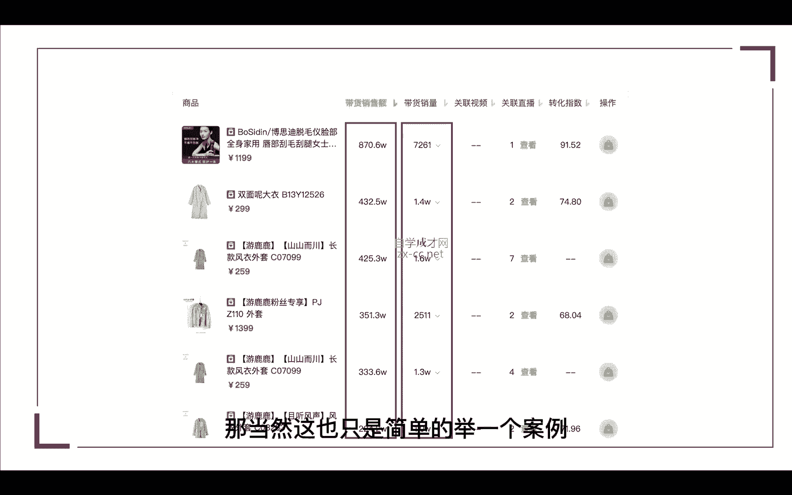

这也是我们为什么要来抖音做，因为它的流量真的非常的庞大，让我们再来看一下什么是抖音小店，抖音小店呢，是抖音为商家提供的一个电商服务平台，简单来说呢，就是平台给商家和达人提供了一个交易的软件。

帮助我们商家在抖音拓宽我们变现的渠道，提升流量的价值，那开通抖音小店以后呢，商家是可以在PC版，也就是我们电脑端管理我们的后台，进行商品的创建和订单发询，以及售后等等一些基础的操作，总的来说。

抖音小店呢它就是为抖音服务的一个独立平台，那在这里呢有一个需要注意的，就是，很多人呐，他会把抖音小店跟抖音橱窗搞混在一起。

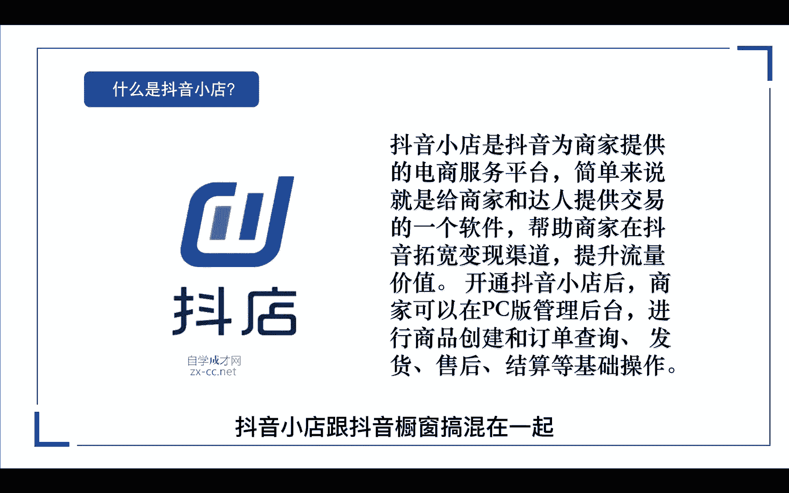

那这里我们一定要区分一下，抖音小店和抖音橱窗的区别，那什么是抖音橱窗，它其实就是相当于给达人提供一个变现的工具，抖音橱窗呢它不是店铺，它只是抖音的一个电商功能，橱窗呢就相当于你的商品货架。

比如说我们开一个便利店对吧，你有产品，你是不是得把你的产品放在货架上，让你的用户去选择去购买对吧，在抖音里面呢，他也是担当了一个商品货架的角色，那抖音橱窗呢，不但可以添加我们自己小店的商品对吧。

它还可以添加淘宝联盟，比如说淘宝啊，拼多多啊，还有考拉呀，京东等等一些其他电商平台的商品，都可以链接到我们的抖音橱窗，或者是添加我们精选联盟里面的商品，那我们的商品怎么样才能添加到精选联盟。

并且挂到我们的商品橱窗呢，在后面的课程我会详细的讲解到，关于精选联盟的玩法，那这就是抖店与橱窗的区别，大家一定要把它区分开来。

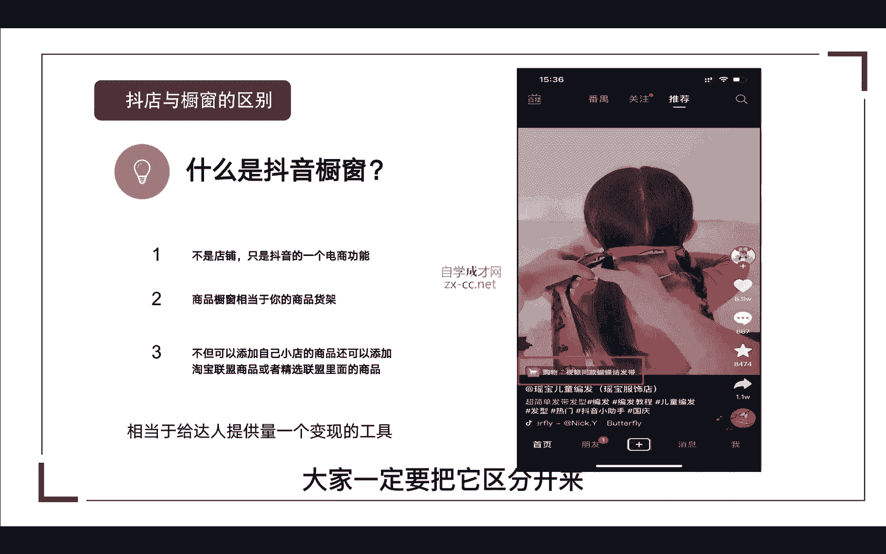

我们再看一下做抖音小店的六点理由，当然我们做抖音小店不只是这六点理由。

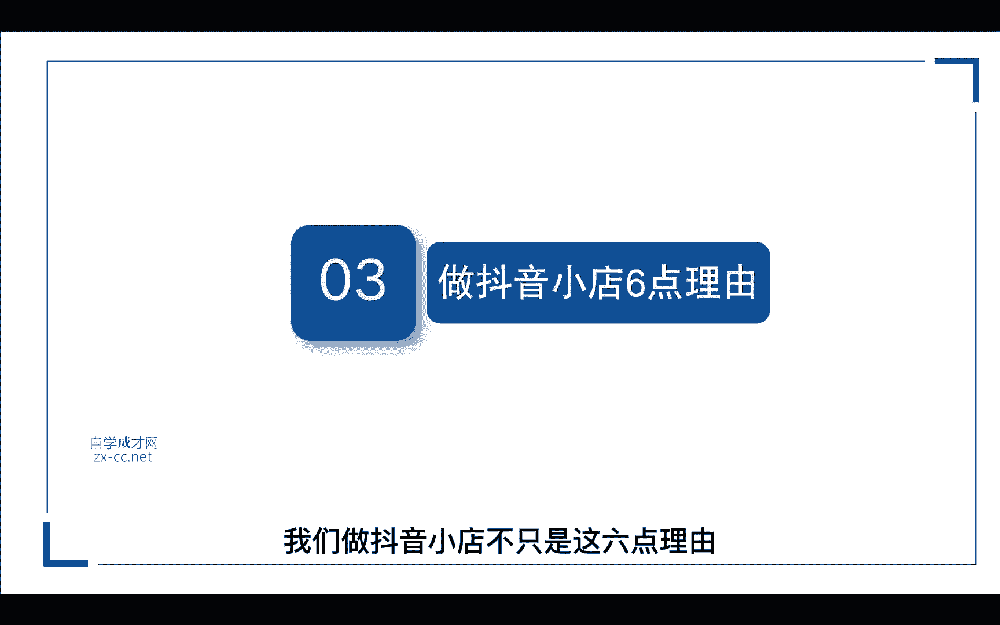

我只是简单给大家整理了六点，第一个门槛低，零门槛只需要营业执照就可以入住，那为什么这样说呢，那我们做过淘宝，做过天猫的人都知道，如果说你现在想要去开一个天猫店，你的公司必须要注册一年以上。

甚至还不一定能注册下来一个天猫店，那现在在抖音不一样，他现在还属于开放式的，这也是现在为什么有很多人啊，他注册了一大堆的营业执照，去开通抖音小店，那是为什么，因为这些人他都是互联网的人才。

他们看到了抖音小店的趋势啊，所以他们去囤电，那第二个，如果说你现在去开一个实体店，不管你是开奶茶店还是服装店，你的装修成本要不要是不是很高，过去的话，大家拼了命的去装门面啊，装修店铺啊，但是你看一下。

现在做互联网的人，全部都是在办公室，随便隔一小间出来，随便装修一下对吧，产品一摆就搭建出了一个直播间，所以说做抖音小店啊，它不只是门槛低，而且它还是能够快速的跟用户之间啊，建立最短距离的购物平台。

第二个平台流量大，刚才前面也说了，抖音是我国最大规模的短视频平台，它的日活量呢已经超过了8亿，那抖音其实最早的定义呢是短视频平台，但是现在你也可以把它理解为，它是现在国内最大的一个社交平台。

同时呢它这个平台也有了政府的背书，你看现在国内各大的政府机关单位啊，都已经入驻抖音，那证明这个平台呢已经被大家慢慢的认可了，所以呢它是一个非常庞大的泛流量平台，那么在这个庞大的泛流量平台。

只要你的产品能够出现在这上面，你随时随地把你产品卖出去的几率，是不是比你在某一个地方开实体店，成交的几率要大了很多呢，那第三个操作简单快速上手，现在的抖店啊是刚刚成立，比起淘宝来说啊。

淘宝毕竟发展了这么多年对吧，它里面的工具发展的都非常完善，而且它有N多个工具，比如说直通车啊，超级推荐啊，达摩盘这些工具，你一听你头都晕了，那其中任何一个工具，单单是一个直通车来说。

你可能学个两三年你都学不透啊，但是抖音小店呢它所有的后台都是智能化的，它后台的操作界面都是非常简单的，比如说你开电脑，你没有流量，但是你想要做投放对吧，他连后台投放的工具都是全自动化的，傻瓜式的操作。

只要是能看得懂文字的人都能去操作，是不是很简单，所以说你只需要跟着我一步步来实操，我们一周左右就可以出单，店铺呢就可以做起来，那第四点占用的时间少，可自动化运营，不管你是想做兼职或者全职。

我们都可以来操作抖音小店，那兼职和全职，唯一的区别就是在于你能做多少个店铺，可能可能你兼职只能做一到两个店铺，那你全职可以做1~5个店铺，那比如说你是全职来做这个店铺，你需要管理很多的店铺对吧。

那这里呢我们就可以去使用一个，批量化上传产品的工具，这样就能方便你同时管理多个店铺，那这个工具的使用呢，我会在第四节课，给你详细的讲解到他的操作步骤，第五个投入成本低，那关于投入成本呢。

我们把它分为两大块，第一种呢是想做店群的人，虽然说我们做店群呢不需要你囤货对吧，但是我们可能会面临一些产品的刷单啊，那这个时候我们可能需要准备一点流动资金，那第二种呢，你之前是做实体店的对吧。

或者你做制造业的，那在过去呢，抖音上有很多达人卖货都卖的很火爆，那是为什么，只要你是做传统制造业，甚至是做批发的，开实体店的对吧，没有一家是没有库存的，那么只要在这个时候，你只要在这个平台上。

你的价格占有优势，你就有机会去曝光你囤的这些库存呢，你都有机会把它卖掉，那当然这里还有一些硬性的投入成本，比如说店铺的保证金，还有办理营业执照作者的保证金等等，那这些具体保证金需要多少呢。

我会在后面给大家详细讲解到，第六点，市场变化快，机会多，抖音小店呢目前呢是属于蓝海期，根据统计啊，抖音小店目前的商家呢是不足50万的，我们再对比一下淘宝和拼多多，他们的商家数量都已经超过了800多万。

那这中间的差距呢相差是几十倍的，在2020年，抖音的总GMV超过了5000亿，一个不足50万商家的平台，一年的GMV超过了5000亿，虽然说这里面只有1000亿，是通过抖音小店平台卖出的。

那我们再把这1000亿细分一下呢，你可以去算一下，所以说我们只要跟着市场的趋势走，你就能赚到钱，这就是我们做抖音小店的六点理由。

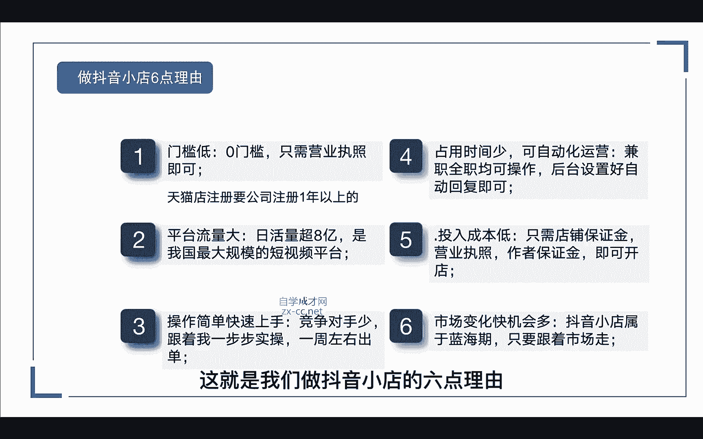

那我们再来看一下抖音小店的市场前景，依靠互联网存在的电商风云万变下呢，抖音小店目前是电商圈最具有潜力的项目，那些做淘宝做拼多多的，很多人都已经转载到抖音小店了，但目前呢还不是抖店的顶端，在2021年呢。

抖音小店一定会迎来一个高速发展的阶段，如果你现在入场，至少呢还有3年的红利期，今天听完我这堂课程，你就可以马上去开始实操了，那我们再来看一下大家比较关注的，做抖音小店需要投多少钱，那做抖音小店呢。

我们这里是需要交纳保证金的，做过淘宝的都知道对吧，我们开淘宝店都要交保证金，为什么要交保证金呢，是因为平台要保证我们商品的服务质量，所以一定要缴纳这个保证金，那这个保证金呢。

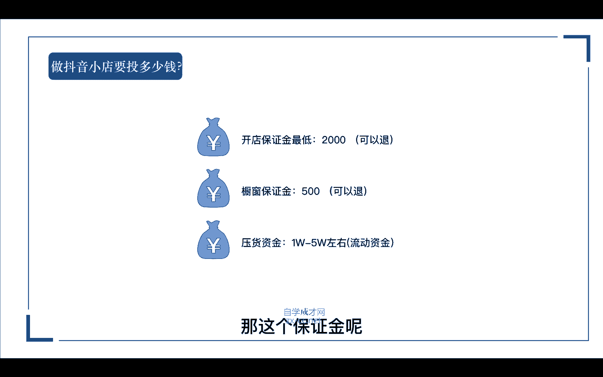

它不同的类目缴纳的保证金是不同的，这里有一个保证金的表格，如果有需要的话。

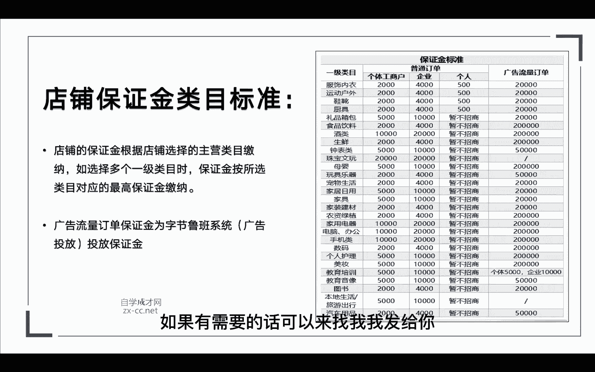

可以来找我，我发给你，那我们先按照最低的2000来算，当然这个保证金呢在后期你不做的时候，我们这个钱是可以退回来的，那第二个呢是橱窗的保证金，那这个呢是针对达人的带货口碑，分这个呢只需要交纳500块钱。

这个都是统一的，同样的这500块钱呢在后面都是可以退的，但是这500块钱退出来以后呢，你的商品组装权限就会被关闭，那第三个呢就是我们的压货资金，这里啊有针对两种人群，第一种是有自己供应链的。

第二种是没有自己供应链的，做无货源的，那如果说你是做无货源的话，我们后期可能会面临一些刷单啊，或者是一旦一个品爆了以后呢，我们可能需要自己去垫资对吧，去发货，那我们这里需要准备一点流动资金1~5W。

那如果说你是有货源，有供应链的，那你做供应链，你下面肯定有很多的主播帮你带货对吧，比如说今天这个主播我帮你带了10万，那个主播帮你带了20万，那这里可能面临的流动资金会更大。

当然如果你能提前跟厂家或者商家对接好，诶，可能有的商家他会帮你垫付这个资金，比如说我们在福建的那个团队，前段时间大狼狗夫妇带的那个曲奇，曲奇瓶饼干那一场就带了100多万。

那如果说你作为一个个人或者小团队，这个资金对你来说压力还是挺大的，那我们那个团队呢他是提前跟厂家沟通好，这个资金呢由厂家来垫付，这样是不是就减轻了我们的一个资金的压力。

那这三点就是我们前期做小店要投入的资金，那么第一节课的内容到这里就结束了，那这节课我们主要讲了什么呢，我们来再回顾一下，我们讲了我们为什么要做抖音对吧，我们只要跟着平台发展的趋势走。

流量这么庞大的一个平台，哪怕是你只要抓住一个风口，你都能赚到钱，那还有就是抖音小店和橱窗的区别，这里呢我们也要把它区分清楚，以及我们做抖音小店的六点理由，还有抖音小店的市场前景。

那最后呢我们讲了抖音小店需要投多少钱，那在接下来的课程中呢，我会讲到抖店应该怎么去开通精选联盟，该怎么加入，怎么去对接达人带货和抖店无会员的玩法，以及怎么获得官方的免费流量，猜你喜欢的玩法。

当然还有个更重要的就是店铺如何去刷单，这里呢会有一个七天的操作流程，记得一定要带好笔记。

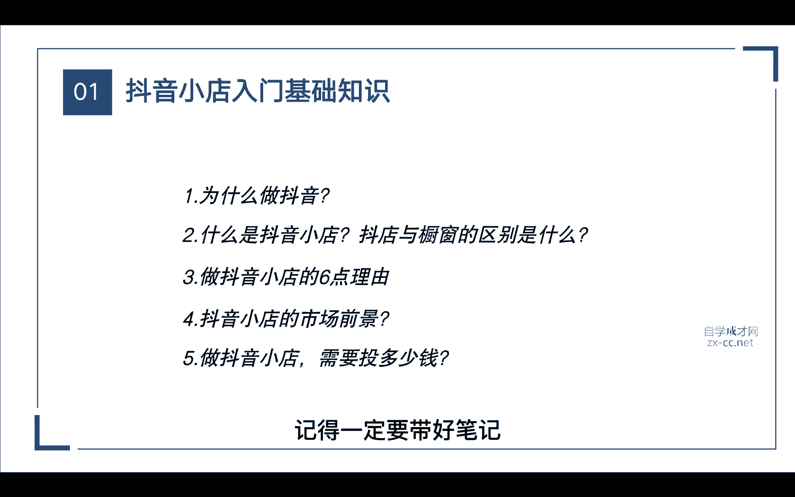